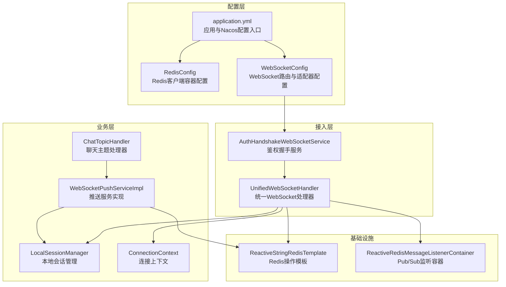
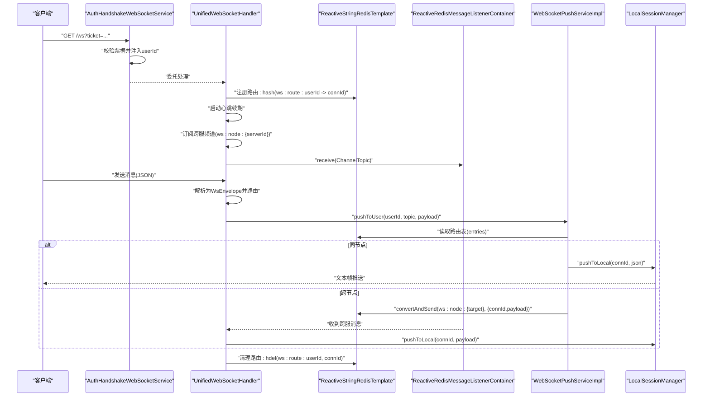
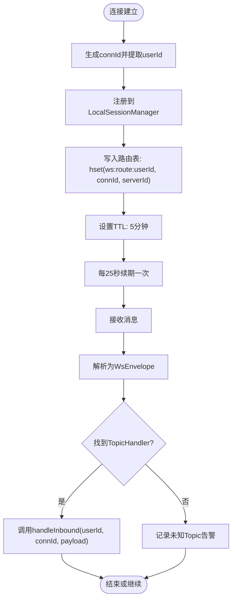
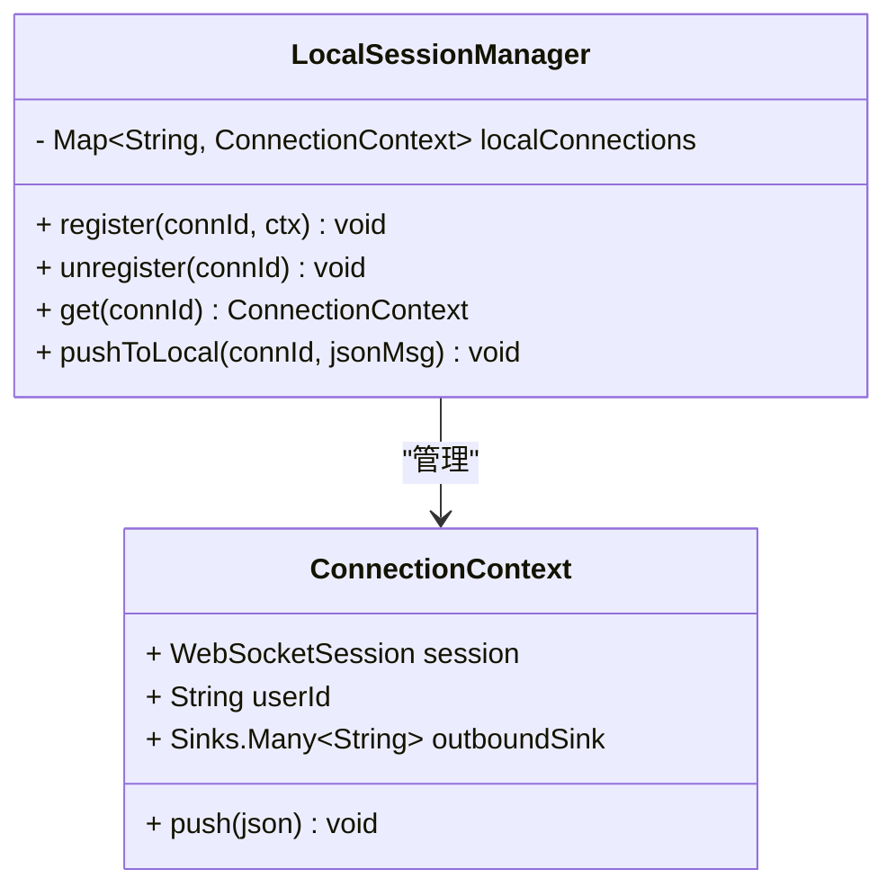
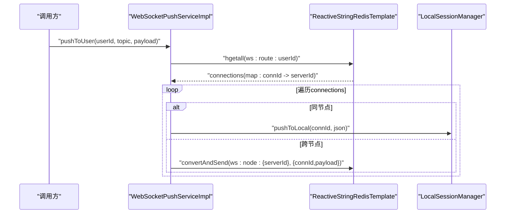
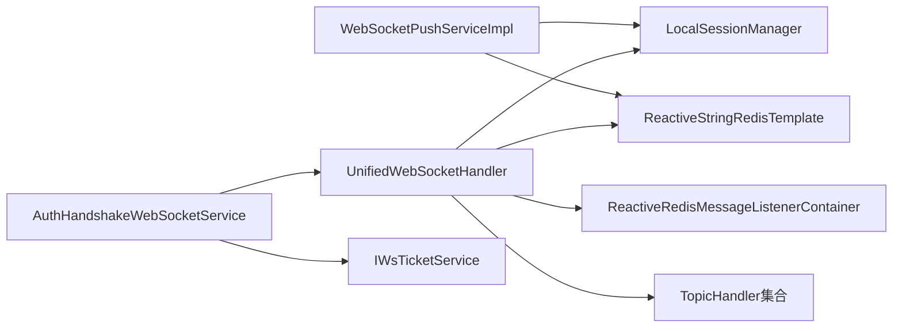
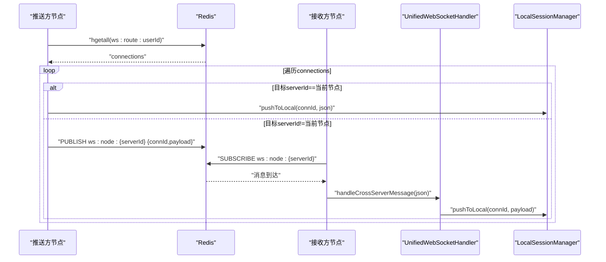

# Redis集成与分布式会话

<cite>
**本文档引用的文件**
- [RedisConfig.java](file://src/main/java/com/rivers/im/config/RedisConfig.java)
- [WebSocketConfig.java](file://src/main/java/com/rivers/im/config/WebSocketConfig.java)
- [UnifiedWebSocketHandler.java](file://src/main/java/com/rivers/im/config/UnifiedWebSocketHandler.java)
- [LocalSessionManager.java](file://src/main/java/com/rivers/im/manage/LocalSessionManager.java)
- [ConnectionContext.java](file://src/main/java/com/rivers/im/context/ConnectionContext.java)
- [WebSocketPushServiceImpl.java](file://src/main/java/com/rivers/im/service/impl/WebSocketPushServiceImpl.java)
- [WsTicketServiceImpl.java](file://src/main/java/com/rivers/im/service/impl/WsTicketServiceImpl.java)
- [AuthHandshakeWebSocketService.java](file://src/main/java/com/rivers/im/service/impl/AuthHandshakeWebSocketService.java)
- [ChatTopicHandler.java](file://src/main/java/com/rivers/im/router/ChatTopicHandler.java)
- [IWebSocketPushService.java](file://src/main/java/com/rivers/im/service/IWebSocketPushService.java)
- [application.yml](file://src/main/resources/application.yml)
</cite>

## 目录
1. [引言](#引言)
2. [项目结构](#项目结构)
3. [核心组件](#核心组件)
4. [架构总览](#架构总览)
5. [详细组件分析](#详细组件分析)
6. [依赖关系分析](#依赖关系分析)
7. [性能考虑](#性能考虑)
8. [故障排查指南](#故障排查指南)
9. [结论](#结论)
10. [附录](#附录)

## 引言
本文件面向Redis集成与分布式会话管理场景，系统性阐述以下主题：
- RedisConfig配置类的作用与职责边界
- ReactiveStringRedisTemplate在会话管理中的使用方式
- 分布式会话管理的实现机制：连接状态存储、路由表维护、跨节点通信
- Redis在WebSocket中的关键作用：会话注册、心跳维护、路由查询、消息转发
- Redis Pub/Sub的使用：频道命名规范、消息格式定义、订阅管理
- 键空间设计：路由键、会话键、过期策略
- 性能优化建议、故障处理策略与监控指标
- 跨节点消息传递的完整流程：从消息发布到本地处理

## 项目结构
本项目采用按功能域分层的组织方式，Redis相关能力主要分布在配置、WebSocket处理、推送服务、会话管理与路由处理器等模块中。

图表来源
- [RedisConfig.java:1-18](file://src/main/java/com/rivers/im/config/RedisConfig.java#L1-L18)
- [WebSocketConfig.java:1-35](file://src/main/java/com/rivers/im/config/WebSocketConfig.java#L1-L35)
- [UnifiedWebSocketHandler.java:1-181](file://src/main/java/com/rivers/im/config/UnifiedWebSocketHandler.java#L1-L181)
- [LocalSessionManager.java:1-43](file://src/main/java/com/rivers/im/manage/LocalSessionManager.java#L1-L43)
- [ConnectionContext.java:1-24](file://src/main/java/com/rivers/im/context/ConnectionContext.java#L1-L24)
- [WebSocketPushServiceImpl.java:1-90](file://src/main/java/com/rivers/im/service/impl/WebSocketPushServiceImpl.java#L1-L90)
- [ChatTopicHandler.java:1-51](file://src/main/java/com/rivers/im/router/ChatTopicHandler.java#L1-L51)
- [application.yml:1-14](file://src/main/resources/application.yml#L1-L14)

章节来源
- [application.yml:1-14](file://src/main/resources/application.yml#L1-L14)
- [RedisConfig.java:1-18](file://src/main/java/com/rivers/im/config/RedisConfig.java#L1-L18)
- [WebSocketConfig.java:1-35](file://src/main/java/com/rivers/im/config/WebSocketConfig.java#L1-L35)

## 核心组件
- RedisConfig：提供ReactiveRedisMessageListenerContainer Bean，作为Redis Pub/Sub监听容器的基础配置。
- UnifiedWebSocketHandler：统一的WebSocket处理器，负责会话建立、消息分发、心跳续期、跨节点消息订阅与清理。
- LocalSessionManager：本地会话注册、注销与推送，维护connId到ConnectionContext的映射。
- ConnectionContext：封装WebSocketSession、用户标识与出站消息通道（多播+背压）。
- WebSocketPushServiceImpl：基于Redis路由表进行用户消息推送，支持同节点本地推送与跨节点转发。
- ChatTopicHandler：具体业务主题处理器，演示消息解析与推送调用。
- AuthHandshakeWebSocketService：鉴权握手服务，通过票据校验后注入用户信息到会话属性。

章节来源
- [RedisConfig.java:13-17](file://src/main/java/com/rivers/im/config/RedisConfig.java#L13-L17)
- [UnifiedWebSocketHandler.java:38-65](file://src/main/java/com/rivers/im/config/UnifiedWebSocketHandler.java#L38-L65)
- [LocalSessionManager.java:10-43](file://src/main/java/com/rivers/im/manage/LocalSessionManager.java#L10-L43)
- [ConnectionContext.java:7-24](file://src/main/java/com/rivers/im/context/ConnectionContext.java#L7-L24)
- [WebSocketPushServiceImpl.java:20-37](file://src/main/java/com/rivers/im/service/impl/WebSocketPushServiceImpl.java#L20-L37)
- [ChatTopicHandler.java:14-28](file://src/main/java/com/rivers/im/router/ChatTopicHandler.java#L14-L28)
- [AuthHandshakeWebSocketService.java:22-55](file://src/main/java/com/rivers/im/service/impl/AuthHandshakeWebSocketService.java#L22-L55)

## 架构总览
下图展示从客户端连接到消息路由与跨节点转发的全链路：

图表来源
- [AuthHandshakeWebSocketService.java:26-54](file://src/main/java/com/rivers/im/service/impl/AuthHandshakeWebSocketService.java#L26-L54)
- [UnifiedWebSocketHandler.java:87-122](file://src/main/java/com/rivers/im/config/UnifiedWebSocketHandler.java#L87-L122)
- [WebSocketPushServiceImpl.java:44-89](file://src/main/java/com/rivers/im/service/impl/WebSocketPushServiceImpl.java#L44-L89)
- [LocalSessionManager.java:35-42](file://src/main/java/com/rivers/im/manage/LocalSessionManager.java#L35-L42)

## 详细组件分析

### RedisConfig配置类
- 职责：提供ReactiveRedisMessageListenerContainer Bean，用于订阅Redis频道。
- 关键点：
  - 未提供ReactiveStringRedisTemplate Bean，需在其他配置中定义。
  - 仅暴露Pub/Sub监听容器，便于统一管理订阅生命周期。
- 影响范围：被UnifiedWebSocketHandler与WebSocketPushServiceImpl通过构造函数注入使用。

章节来源
- [RedisConfig.java:13-17](file://src/main/java/com/rivers/im/config/RedisConfig.java#L13-L17)

### UnifiedWebSocketHandler（WebSocket统一处理器）
- 会话注册与清理
  - 建立连接时生成connId，提取userId，注册到LocalSessionManager。
  - 清理阶段移除路由表中的connId条目。
- 路由表维护
  - 使用哈希结构存储“用户到连接”的映射：key为ws:route:{userId}，field为connId，value为当前serverId。
  - 设置5分钟TTL，通过心跳周期续期。
- 心跳机制
  - 每25秒对路由键执行一次续期，确保在线状态有效。
- 跨节点订阅
  - 订阅频道ws:node:{currentServerId}，收到消息后直接推送至本地会话。
- 消息分发
  - 将原始消息反序列化为WsEnvelope，按topic路由到对应TopicHandler。
- 生命周期管理
  - 初始化时订阅跨服频道；销毁时释放订阅。

图表来源
- [UnifiedWebSocketHandler.java:87-122](file://src/main/java/com/rivers/im/config/UnifiedWebSocketHandler.java#L87-L122)
- [UnifiedWebSocketHandler.java:124-138](file://src/main/java/com/rivers/im/config/UnifiedWebSocketHandler.java#L124-L138)
- [UnifiedWebSocketHandler.java:151-162](file://src/main/java/com/rivers/im/config/UnifiedWebSocketHandler.java#L151-L162)

章节来源
- [UnifiedWebSocketHandler.java:38-65](file://src/main/java/com/rivers/im/config/UnifiedWebSocketHandler.java#L38-L65)
- [UnifiedWebSocketHandler.java:67-77](file://src/main/java/com/rivers/im/config/UnifiedWebSocketHandler.java#L67-L77)
- [UnifiedWebSocketHandler.java:87-122](file://src/main/java/com/rivers/im/config/UnifiedWebSocketHandler.java#L87-L122)
- [UnifiedWebSocketHandler.java:111-118](file://src/main/java/com/rivers/im/config/UnifiedWebSocketHandler.java#L111-L118)
- [UnifiedWebSocketHandler.java:140-149](file://src/main/java/com/rivers/im/config/UnifiedWebSocketHandler.java#L140-L149)
- [UnifiedWebSocketHandler.java:151-162](file://src/main/java/com/rivers/im/config/UnifiedWebSocketHandler.java#L151-L162)

### LocalSessionManager（本地会话管理）
- 数据结构：ConcurrentHashMap保存connId到ConnectionContext的映射。
- 功能：
  - register：注册新连接并绑定出站消息通道。
  - unregister：注销连接并尝试完成出站流。
  - get：按connId获取上下文。
  - pushToLocal：线程安全地向指定连接推送JSON消息，若连接不存在或已关闭则记录告警。

图表来源
- [LocalSessionManager.java:10-43](file://src/main/java/com/rivers/im/manage/LocalSessionManager.java#L10-L43)
- [ConnectionContext.java:7-24](file://src/main/java/com/rivers/im/context/ConnectionContext.java#L7-L24)

章节来源
- [LocalSessionManager.java:10-43](file://src/main/java/com/rivers/im/manage/LocalSessionManager.java#L10-L43)
- [ConnectionContext.java:7-24](file://src/main/java/com/rivers/im/context/ConnectionContext.java#L7-L24)

### WebSocketPushServiceImpl（推送服务实现）
- 路由查询
  - 以ws:route:{userId}为键，读取所有connId及其所在serverId。
- 同节点推送
  - 若serverId等于当前节点，则直接调用LocalSessionManager推送。
- 跨节点转发
  - 若serverId不同，则构造{connId, payload}对象，向目标节点的ws:node:{serverId}频道发布消息。
- 消息封装
  - 将topic、messageId与payload封装为WsEnvelope，再序列化为JSON字符串。

图表来源
- [WebSocketPushServiceImpl.java:44-89](file://src/main/java/com/rivers/im/service/impl/WebSocketPushServiceImpl.java#L44-L89)

章节来源
- [WebSocketPushServiceImpl.java:20-37](file://src/main/java/com/rivers/im/service/impl/WebSocketPushServiceImpl.java#L20-L37)
- [WebSocketPushServiceImpl.java:44-89](file://src/main/java/com/rivers/im/service/impl/WebSocketPushServiceImpl.java#L44-L89)

### WebSocketConfig与AuthHandshakeWebSocketService（握手与路由）
- WebSocketConfig
  - 定义URL映射"/ws"到UnifiedWebSocketHandler。
  - 注入自定义AuthHandshakeWebSocketService以实现鉴权握手。
- AuthHandshakeWebSocketService
  - 从请求参数提取ticket，调用WsTicketServiceImpl消费票据。
  - 成功后将userId注入WebSocketSession属性，再交由统一处理器处理。
  - 对握手失败场景进行优雅拒绝，避免响应已提交导致异常。

章节来源
- [WebSocketConfig.java:22-34](file://src/main/java/com/rivers/im/config/WebSocketConfig.java#L22-L34)
- [AuthHandshakeWebSocketService.java:26-55](file://src/main/java/com/rivers/im/service/impl/AuthHandshakeWebSocketService.java#L26-L55)

### 路由处理器（示例：ChatTopicHandler）
- 主题：chat
- 输入校验：要求payload包含接收方字段to。
- 构造推送内容：包含from、to、content与时间戳。
- 推送行为：同时向发送方与接收方推送相同消息体。

章节来源
- [ChatTopicHandler.java:14-28](file://src/main/java/com/rivers/im/router/ChatTopicHandler.java#L14-L28)
- [ChatTopicHandler.java:31-49](file://src/main/java/com/rivers/im/router/ChatTopicHandler.java#L31-L49)

### 会话票据服务（WsTicketServiceImpl）
- 创建票据：生成UUID并去除横杠，写入Redis，键前缀ws:ticket:，有效期30秒。
- 消费票据：原子读取并删除，确保一次性使用。
- 返回值：封装ResultVO，包含票据或错误信息。

章节来源
- [WsTicketServiceImpl.java:26-53](file://src/main/java/com/rivers/im/service/impl/WsTicketServiceImpl.java#L26-L53)

## 依赖关系分析
- 组件耦合
  - UnifiedWebSocketHandler依赖RedisTemplate、ListenerContainer、LocalSessionManager与TopicHandler集合。
  - WebSocketPushServiceImpl依赖RedisTemplate、LocalSessionManager与ObjectMapper。
  - AuthHandshakeWebSocketService依赖IWsTicketService与WebSocketHandler。
- 外部依赖
  - Redis：Pub/Sub监听容器、字符串模板、哈希操作、过期控制。
  - Jackson：消息序列化与反序列化。
- 循环依赖规避
  - WebSocketConfig通过字段注入UnifiedWebSocketHandler，避免构造循环。
  - AuthHandshakeWebSocketService通过装饰器模式将userId注入会话属性，避免属性传递问题。

图表来源
- [UnifiedWebSocketHandler.java:50-64](file://src/main/java/com/rivers/im/config/UnifiedWebSocketHandler.java#L50-L64)
- [WebSocketPushServiceImpl.java:27-36](file://src/main/java/com/rivers/im/service/impl/WebSocketPushServiceImpl.java#L27-L36)
- [AuthHandshakeWebSocketService.java:24-54](file://src/main/java/com/rivers/im/service/impl/AuthHandshakeWebSocketService.java#L24-L54)

章节来源
- [WebSocketConfig.java:18-34](file://src/main/java/com/rivers/im/config/WebSocketConfig.java#L18-L34)
- [AuthHandshakeWebSocketService.java:24-54](file://src/main/java/com/rivers/im/service/impl/AuthHandshakeWebSocketService.java#L24-L54)

## 性能考虑
- 连接状态存储
  - 使用哈希结构存储路由表，单键容量大且支持批量读取，适合高并发场景。
- 心跳续期
  - 固定周期续期，避免频繁写入；可结合业务空闲阈值动态调整。
- 背压策略
  - 出站消息采用多播+缓冲+背压策略，防止内存暴涨。
- 跨节点转发
  - 本地聚合推送，减少网络往返；跨节点使用Pub/Sub异步解耦。
- 序列化与反序列化
  - 使用Jackson进行高效序列化，避免重复解析开销。
- 键空间设计
  - 路由键：ws:route:{userId}，field为connId，value为serverId。
  - 票据键：ws:ticket:{ticket}，value为userId，TTL短。
  - 频道命名：ws:node:{serverId}，全局唯一。
- 过期策略
  - 路由键TTL=5分钟，心跳周期=25秒，留足续期余量。
  - 票据键TTL=30秒，防止重放攻击与资源占用。
- 监控指标建议
  - Redis命令耗时分布、Pub/Sub订阅数量、消息队列长度、推送成功率、会话数峰值。
  - WebSocket连接建立/断开速率、心跳失败率、未知Topic告警数。

## 故障排查指南
- 握手失败
  - 检查ticket是否有效且未过期；确认AuthHandshakeWebSocketService日志输出。
- 会话无法推送
  - 核对路由表是否存在connId；检查心跳是否持续续期；确认LocalSessionManager中connId是否仍存在。
- 跨节点消息丢失
  - 检查目标节点是否正确订阅ws:node:{serverId}；确认Pub/Sub发布成功且JSON格式正确。
- 心跳失效
  - 观察心跳续期错误日志；检查Redis连接与网络延迟。
- 资源清理
  - 断开连接后确认路由表已移除；查看清理阶段日志。

章节来源
- [AuthHandshakeWebSocketService.java:26-55](file://src/main/java/com/rivers/im/service/impl/AuthHandshakeWebSocketService.java#L26-L55)
- [UnifiedWebSocketHandler.java:111-118](file://src/main/java/com/rivers/im/config/UnifiedWebSocketHandler.java#L111-L118)
- [WebSocketPushServiceImpl.java:76-88](file://src/main/java/com/rivers/im/service/impl/WebSocketPushServiceImpl.java#L76-L88)

## 结论
本项目通过Reactive Redis实现了高可用的分布式会话管理与消息推送体系：
- 使用哈希路由表与TTL机制保障会话状态一致性与时效性。
- 借助Pub/Sub实现跨节点消息透明转发，降低耦合度。
- 通过心跳续期与背压策略提升系统稳定性与吞吐能力。
- 鉴权握手与票据机制确保接入安全与防重放。

## 附录

### Redis键空间设计
- 路由键：ws:route:{userId}
  - 类型：hash
  - field：connId
  - value：serverId
  - TTL：5分钟
- 票据键：ws:ticket:{ticket}
  - 类型：string
  - value：userId
  - TTL：30秒
- 频道命名：ws:node:{serverId}
  - 类型：pub/sub
  - 用途：跨节点消息转发

章节来源
- [UnifiedWebSocketHandler.java:97-102](file://src/main/java/com/rivers/im/config/UnifiedWebSocketHandler.java#L97-L102)
- [WsTicketServiceImpl.java:24-32](file://src/main/java/com/rivers/im/service/impl/WsTicketServiceImpl.java#L24-L32)
- [WebSocketPushServiceImpl.java:81-84](file://src/main/java/com/rivers/im/service/impl/WebSocketPushServiceImpl.java#L81-L84)

### 跨节点消息传递流程（完整版）

图表来源
- [WebSocketPushServiceImpl.java:56-89](file://src/main/java/com/rivers/im/service/impl/WebSocketPushServiceImpl.java#L56-L89)
- [UnifiedWebSocketHandler.java:67-77](file://src/main/java/com/rivers/im/config/UnifiedWebSocketHandler.java#L67-L77)
- [UnifiedWebSocketHandler.java:140-149](file://src/main/java/com/rivers/im/config/UnifiedWebSocketHandler.java#L140-L149)