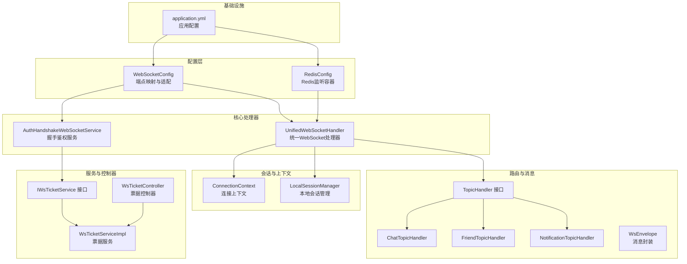
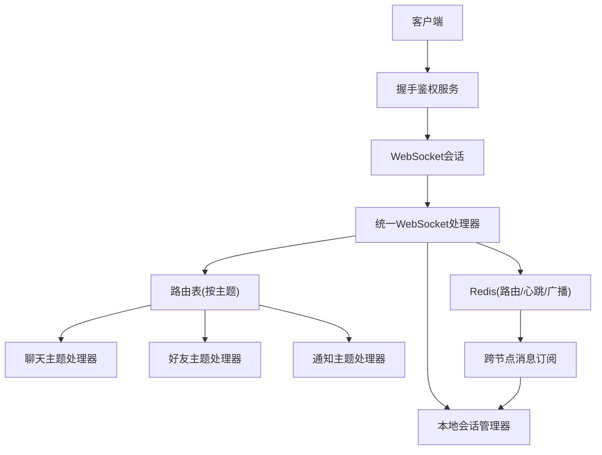
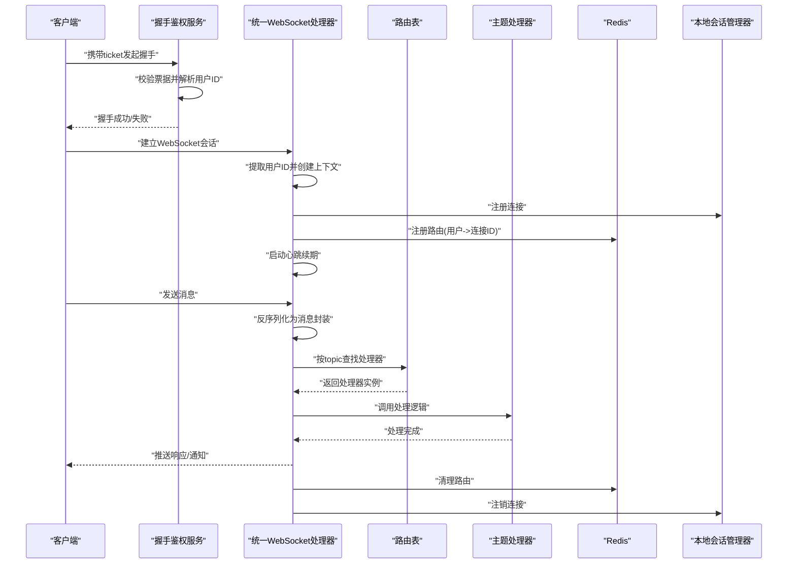
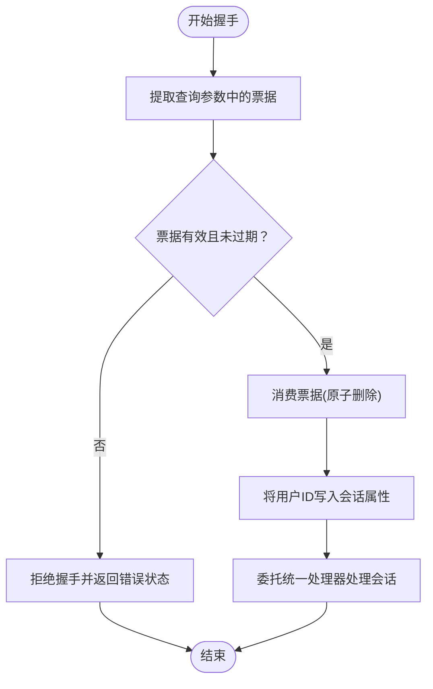
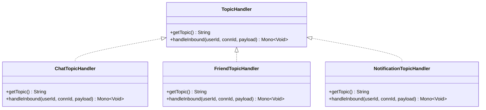
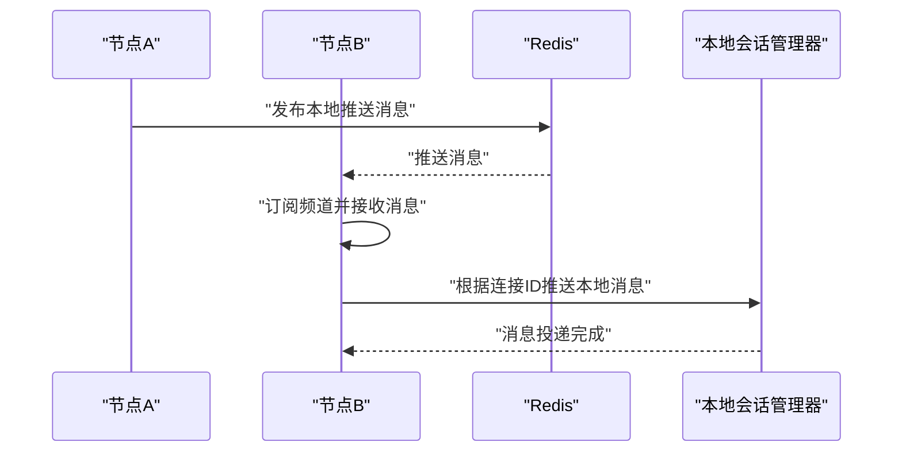
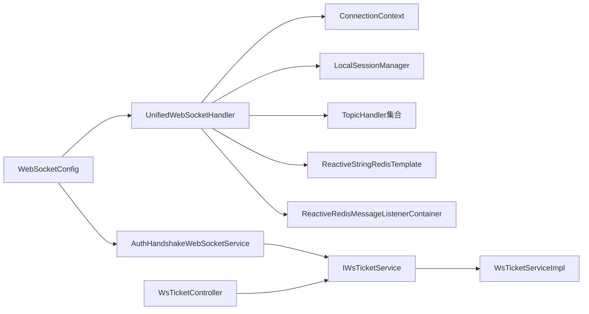

# WebSocket通信系统

<cite>
**本文引用的文件**
- [UnifiedWebSocketHandler.java](file://src/main/java/com/rivers/im/config/UnifiedWebSocketHandler.java)
- [WebSocketConfig.java](file://src/main/java/com/rivers/im/config/WebSocketConfig.java)
- [RedisConfig.java](file://src/main/java/com/rivers/im/config/RedisConfig.java)
- [ConnectionContext.java](file://src/main/java/com/rivers/im/context/ConnectionContext.java)
- [LocalSessionManager.java](file://src/main/java/com/rivers/im/manage/LocalSessionManager.java)
- [AuthHandshakeWebSocketService.java](file://src/main/java/com/rivers/im/service/impl/AuthHandshakeWebSocketService.java)
- [TopicHandler.java](file://src/main/java/com/rivers/im/router/TopicHandler.java)
- [WsEnvelope.java](file://src/main/java/com/rivers/im/record/WsEnvelope.java)
- [ChatTopicHandler.java](file://src/main/java/com/rivers/im/router/ChatTopicHandler.java)
- [FriendTopicHandler.java](file://src/main/java/com/rivers/im/router/FriendTopicHandler.java)
- [NotificationTopicHandler.java](file://src/main/java/com/rivers/im/router/NotificationTopicHandler.java)
- [IWsTicketService.java](file://src/main/java/com/rivers/im/service/IWsTicketService.java)
- [WsTicketServiceImpl.java](file://src/main/java/com/rivers/im/service/impl/WsTicketServiceImpl.java)
- [WsTicketController.java](file://src/main/java/com/rivers/im/controller/WsTicketController.java)
- [application.yml](file://src/main/resources/application.yml)
</cite>

## 目录
1. [简介](#简介)
2. [项目结构](#项目结构)
3. [核心组件](#核心组件)
4. [架构总览](#架构总览)
5. [详细组件分析](#详细组件分析)
6. [依赖分析](#依赖分析)
7. [性能考虑](#性能考虑)
8. [故障排查指南](#故障排查指南)
9. [结论](#结论)
10. [附录](#附录)

## 简介
本技术文档围绕统一WebSocket处理器与相关配置展开，系统性说明连接建立、握手认证、消息路由与会话管理机制；阐述WebSocketConfig配置类在端点注册、消息转换器与SockJS支持方面的职责；解析Redis在分布式会话管理中的作用（连接状态存储与跨节点消息同步）；并给出连接生命周期管理的最佳实践（心跳检测、断线重连与异常处理策略）。文档同时提供关键流程图与时序图，帮助读者快速理解代码实现。

## 项目结构
系统采用按功能域分层组织：配置层负责端点映射与握手适配；上下文与会话管理负责连接生命周期与消息输出通道；路由层以TopicHandler接口抽象不同业务主题的消息处理；服务层提供票据签发与握手鉴权；控制器提供票据创建接口；资源文件承载应用基础配置。

图表来源
- [WebSocketConfig.java:13-35](file://src/main/java/com/rivers/im/config/WebSocketConfig.java#L13-L35)
- [RedisConfig.java:9-18](file://src/main/java/com/rivers/im/config/RedisConfig.java#L9-L18)
- [UnifiedWebSocketHandler.java:38-122](file://src/main/java/com/rivers/im/config/UnifiedWebSocketHandler.java#L38-L122)
- [AuthHandshakeWebSocketService.java:22-55](file://src/main/java/com/rivers/im/service/impl/AuthHandshakeWebSocketService.java#L22-L55)
- [ConnectionContext.java:8-24](file://src/main/java/com/rivers/im/context/ConnectionContext.java#L8-L24)
- [LocalSessionManager.java:12-43](file://src/main/java/com/rivers/im/manage/LocalSessionManager.java#L12-L43)
- [TopicHandler.java:8-14](file://src/main/java/com/rivers/im/router/TopicHandler.java#L8-L14)
- [ChatTopicHandler.java:14-51](file://src/main/java/com/rivers/im/router/ChatTopicHandler.java#L14-L51)
- [FriendTopicHandler.java:24-261](file://src/main/java/com/rivers/im/router/FriendTopicHandler.java#L24-L261)
- [NotificationTopicHandler.java:12-27](file://src/main/java/com/rivers/im/router/NotificationTopicHandler.java#L12-L27)
- [WsEnvelope.java:5-9](file://src/main/java/com/rivers/im/record/WsEnvelope.java#L5-L9)
- [IWsTicketService.java:8-14](file://src/main/java/com/rivers/im/service/IWsTicketService.java#L8-L14)
- [WsTicketServiceImpl.java:20-55](file://src/main/java/com/rivers/im/service/impl/WsTicketServiceImpl.java#L20-L55)
- [WsTicketController.java:14-26](file://src/main/java/com/rivers/im/controller/WsTicketController.java#L14-L26)
- [application.yml:1-14](file://src/main/resources/application.yml#L1-L14)

章节来源
- [WebSocketConfig.java:13-35](file://src/main/java/com/rivers/im/config/WebSocketConfig.java#L13-L35)
- [application.yml:1-14](file://src/main/resources/application.yml#L1-L14)

## 核心组件
- 统一WebSocket处理器：负责连接接入、鉴权后上下文初始化、消息路由、心跳续期与连接清理。
- 握手鉴权服务：基于票据进行鉴权，注入用户标识到会话属性中。
- 会话与上下文：维护每个连接的输出通道与用户信息，支持本地推送。
- 路由处理器：以TopicHandler抽象不同主题的消息处理逻辑。
- Redis配置：提供响应式Redis监听容器，支撑跨节点消息同步。
- 票据服务与控制器：提供票据生成与消费能力，保障握手安全。

章节来源
- [UnifiedWebSocketHandler.java:38-122](file://src/main/java/com/rivers/im/config/UnifiedWebSocketHandler.java#L38-L122)
- [AuthHandshakeWebSocketService.java:22-55](file://src/main/java/com/rivers/im/service/impl/AuthHandshakeWebSocketService.java#L22-L55)
- [ConnectionContext.java:8-24](file://src/main/java/com/rivers/im/context/ConnectionContext.java#L8-L24)
- [LocalSessionManager.java:12-43](file://src/main/java/com/rivers/im/manage/LocalSessionManager.java#L12-L43)
- [TopicHandler.java:8-14](file://src/main/java/com/rivers/im/router/TopicHandler.java#L8-L14)
- [RedisConfig.java:9-18](file://src/main/java/com/rivers/im/config/RedisConfig.java#L9-L18)
- [IWsTicketService.java:8-14](file://src/main/java/com/rivers/im/service/IWsTicketService.java#L8-L14)
- [WsTicketServiceImpl.java:20-55](file://src/main/java/com/rivers/im/service/impl/WsTicketServiceImpl.java#L20-L55)
- [WsTicketController.java:14-26](file://src/main/java/com/rivers/im/controller/WsTicketController.java#L14-L26)

## 架构总览
系统采用“响应式WebFlux + 响应式Redis”的异步非阻塞架构。统一处理器作为入口，完成鉴权、会话注册与消息分发；路由层按主题解耦业务；Redis用于跨节点广播与路由表维护；本地会话管理器负责连接的生命周期与消息推送。

图表来源
- [AuthHandshakeWebSocketService.java:26-54](file://src/main/java/com/rivers/im/service/impl/AuthHandshakeWebSocketService.java#L26-L54)
- [UnifiedWebSocketHandler.java:87-122](file://src/main/java/com/rivers/im/config/UnifiedWebSocketHandler.java#L87-L122)
- [LocalSessionManager.java:17-42](file://src/main/java/com/rivers/im/manage/LocalSessionManager.java#L17-L42)
- [RedisConfig.java:14-17](file://src/main/java/com/rivers/im/config/RedisConfig.java#L14-L17)

## 详细组件分析

### 统一WebSocket处理器（连接建立、握手认证、消息路由与会话管理）
- 连接建立与上下文初始化：为每个新会话生成唯一连接ID，提取用户ID并创建连接上下文，注册到本地会话管理器。
- 握手认证：通过自定义握手服务注入用户ID到会话属性，未通过鉴权则拒绝握手。
- 消息路由：将输入消息反序列化为消息封装对象，按topic选择对应处理器执行；未知topic记录告警但不中断连接。
- 会话管理：注册路由表（哈希键为用户路由键，值为连接ID到服务器ID映射），心跳周期性续期，连接关闭时清理路由与上下文。
- 跨节点消息：订阅当前节点频道，接收其他节点推送的本地消息并投递至本地连接。

图表来源
- [AuthHandshakeWebSocketService.java:26-54](file://src/main/java/com/rivers/im/service/impl/AuthHandshakeWebSocketService.java#L26-L54)
- [UnifiedWebSocketHandler.java:87-122](file://src/main/java/com/rivers/im/config/UnifiedWebSocketHandler.java#L87-L122)
- [LocalSessionManager.java:17-26](file://src/main/java/com/rivers/im/manage/LocalSessionManager.java#L17-L26)
- [WsEnvelope.java:5-9](file://src/main/java/com/rivers/im/record/WsEnvelope.java#L5-L9)
- [TopicHandler.java:10-12](file://src/main/java/com/rivers/im/router/TopicHandler.java#L10-L12)

章节来源
- [UnifiedWebSocketHandler.java:38-122](file://src/main/java/com/rivers/im/config/UnifiedWebSocketHandler.java#L38-L122)
- [ConnectionContext.java:8-24](file://src/main/java/com/rivers/im/context/ConnectionContext.java#L8-L24)
- [LocalSessionManager.java:12-43](file://src/main/java/com/rivers/im/manage/LocalSessionManager.java#L12-L43)
- [WsEnvelope.java:5-9](file://src/main/java/com/rivers/im/record/WsEnvelope.java#L5-L9)
- [TopicHandler.java:8-14](file://src/main/java/com/rivers/im/router/TopicHandler.java#L8-L14)

### 握手认证与票据服务（SockJS支持与消息转换器）
- 握手认证：从查询参数读取票据，调用票据服务消费票据，超时或无效即拒绝握手；成功后将用户ID写入会话属性，再交由统一处理器处理。
- 票据服务：票据有效期短、写入Redis并原子删除，确保一次性使用；提供创建票据接口供前端调用。
- SockJS支持与消息转换器：配置类中通过适配器注入自定义握手服务，便于扩展SockJS等传输协议；消息转换器默认由框架提供，统一WebSocket处理器使用JSON封装对象进行序列化/反序列化。

图表来源
- [AuthHandshakeWebSocketService.java:26-54](file://src/main/java/com/rivers/im/service/impl/AuthHandshakeWebSocketService.java#L26-L54)
- [WsTicketServiceImpl.java:50-53](file://src/main/java/com/rivers/im/service/impl/WsTicketServiceImpl.java#L50-L53)
- [WsTicketController.java:21-24](file://src/main/java/com/rivers/im/controller/WsTicketController.java#L21-L24)

章节来源
- [WebSocketConfig.java:22-34](file://src/main/java/com/rivers/im/config/WebSocketConfig.java#L22-L34)
- [AuthHandshakeWebSocketService.java:22-55](file://src/main/java/com/rivers/im/service/impl/AuthHandshakeWebSocketService.java#L22-L55)
- [IWsTicketService.java:8-14](file://src/main/java/com/rivers/im/service/IWsTicketService.java#L8-L14)
- [WsTicketServiceImpl.java:20-55](file://src/main/java/com/rivers/im/service/impl/WsTicketServiceImpl.java#L20-L55)
- [WsTicketController.java:14-26](file://src/main/java/com/rivers/im/controller/WsTicketController.java#L14-L26)

### 消息路由与主题处理器
- 主题接口：定义topic标识与入站处理方法，便于扩展新的业务主题。
- 聊天主题：校验接收方，构造包含发送方、内容与时间戳的数据，向双方推送。
- 好友主题：支持请求、接受、拒绝三种动作，采用关系ID双向同步状态，持久化离线通知并尽力实时推送。
- 通知主题：示例性处理“已读”等通知事件。

图表来源
- [TopicHandler.java:8-14](file://src/main/java/com/rivers/im/router/TopicHandler.java#L8-L14)
- [ChatTopicHandler.java:14-51](file://src/main/java/com/rivers/im/router/ChatTopicHandler.java#L14-L51)
- [FriendTopicHandler.java:24-261](file://src/main/java/com/rivers/im/router/FriendTopicHandler.java#L24-L261)
- [NotificationTopicHandler.java:12-27](file://src/main/java/com/rivers/im/router/NotificationTopicHandler.java#L12-L27)

章节来源
- [TopicHandler.java:8-14](file://src/main/java/com/rivers/im/router/TopicHandler.java#L8-L14)
- [ChatTopicHandler.java:14-51](file://src/main/java/com/rivers/im/router/ChatTopicHandler.java#L14-L51)
- [FriendTopicHandler.java:24-261](file://src/main/java/com/rivers/im/router/FriendTopicHandler.java#L24-L261)
- [NotificationTopicHandler.java:12-27](file://src/main/java/com/rivers/im/router/NotificationTopicHandler.java#L12-L27)

### 分布式会话管理与Redis配置
- 路由表：以用户ID为键，哈希存储连接ID到服务器ID映射，并设置短期过期，用于定位用户连接所在节点。
- 心跳续期：每25秒对路由键进行续期，保证活跃连接不会被误删。
- 跨节点消息：统一处理器订阅当前节点频道，接收来自其他节点的本地推送指令并投递给本地连接。
- Redis监听容器：提供响应式监听能力，配合发布/订阅实现跨节点消息同步。

图表来源
- [UnifiedWebSocketHandler.java:67-85](file://src/main/java/com/rivers/im/config/UnifiedWebSocketHandler.java#L67-L85)
- [UnifiedWebSocketHandler.java:140-149](file://src/main/java/com/rivers/im/config/UnifiedWebSocketHandler.java#L140-L149)
- [LocalSessionManager.java:35-42](file://src/main/java/com/rivers/im/manage/LocalSessionManager.java#L35-L42)
- [RedisConfig.java:14-17](file://src/main/java/com/rivers/im/config/RedisConfig.java#L14-L17)

章节来源
- [UnifiedWebSocketHandler.java:97-102](file://src/main/java/com/rivers/im/config/UnifiedWebSocketHandler.java#L97-L102)
- [UnifiedWebSocketHandler.java:111-118](file://src/main/java/com/rivers/im/config/UnifiedWebSocketHandler.java#L111-L118)
- [RedisConfig.java:9-18](file://src/main/java/com/rivers/im/config/RedisConfig.java#L9-L18)

### 连接生命周期管理最佳实践
- 心跳检测：每25秒续期路由键，避免因空闲导致连接被清理；若会话关闭则停止心跳。
- 断线重连：客户端应在连接断开后携带有效票据重新发起握手；服务端通过票据消费保证一次性使用。
- 异常处理：消息解析失败与路由未知均记录告警并忽略，不影响整体连接；Redis操作出现异常记录警告并继续运行；会话结束时清理路由与上下文，防止内存泄漏。

章节来源
- [UnifiedWebSocketHandler.java:111-121](file://src/main/java/com/rivers/im/config/UnifiedWebSocketHandler.java#L111-L121)
- [UnifiedWebSocketHandler.java:134-137](file://src/main/java/com/rivers/im/config/UnifiedWebSocketHandler.java#L134-L137)
- [UnifiedWebSocketHandler.java:151-161](file://src/main/java/com/rivers/im/config/UnifiedWebSocketHandler.java#L151-L161)

## 依赖分析
- 组件内聚：统一处理器聚合了会话管理、路由分发与Redis交互；路由处理器按主题解耦业务；票据服务与控制器分离关注点。
- 外部依赖：Spring WebFlux响应式栈、响应式Redis客户端、Jackson JSON工具。
- 循环依赖规避：WebSocketConfig仅持有处理器与握手服务引用，避免循环注入；统一处理器通过构造注入各协作组件。

图表来源
- [UnifiedWebSocketHandler.java:50-64](file://src/main/java/com/rivers/im/config/UnifiedWebSocketHandler.java#L50-L64)
- [WebSocketConfig.java:18-34](file://src/main/java/com/rivers/im/config/WebSocketConfig.java#L18-L34)
- [AuthHandshakeWebSocketService.java:24-24](file://src/main/java/com/rivers/im/service/impl/AuthHandshakeWebSocketService.java#L24-L24)
- [IWsTicketService.java:10-12](file://src/main/java/com/rivers/im/service/IWsTicketService.java#L10-L12)
- [WsTicketServiceImpl.java:22-22](file://src/main/java/com/rivers/im/service/impl/WsTicketServiceImpl.java#L22-L22)
- [WsTicketController.java:19-24](file://src/main/java/com/rivers/im/controller/WsTicketController.java#L19-L24)

章节来源
- [WebSocketConfig.java:13-35](file://src/main/java/com/rivers/im/config/WebSocketConfig.java#L13-L35)
- [UnifiedWebSocketHandler.java:38-122](file://src/main/java/com/rivers/im/config/UnifiedWebSocketHandler.java#L38-L122)

## 性能考虑
- 响应式背压：输出通道采用带缓冲的多播背压策略，避免高并发下丢包与阻塞。
- 并发安全：本地会话管理使用并发哈希表，保证多线程下的注册/注销安全。
- 路由键过期：短期过期策略降低Redis键数量与内存占用。
- 最佳实践：控制消息体大小、避免频繁心跳；在处理器中尽量使用异步数据库访问；合理设置Redis连接池与超时参数。

## 故障排查指南
- 握手失败：检查票据是否缺失或已过期；确认票据服务可用且Redis写入成功；查看拒绝握手的日志。
- 无法获取用户ID：确认握手阶段是否正确将用户ID写入会话属性；检查URL参数拼写与编码。
- 消息未送达：核对topic是否正确；查看路由表是否存在该用户的连接映射；检查Redis发布/订阅是否正常。
- 连接频繁断开：排查心跳续期是否成功；检查网络波动与客户端重连策略；确认会话清理逻辑是否触发异常。

章节来源
- [AuthHandshakeWebSocketService.java:29-43](file://src/main/java/com/rivers/im/service/impl/AuthHandshakeWebSocketService.java#L29-L43)
- [WsTicketServiceImpl.java:31-47](file://src/main/java/com/rivers/im/service/impl/WsTicketServiceImpl.java#L31-L47)
- [UnifiedWebSocketHandler.java:164-179](file://src/main/java/com/rivers/im/config/UnifiedWebSocketHandler.java#L164-L179)
- [UnifiedWebSocketHandler.java:140-149](file://src/main/java/com/rivers/im/config/UnifiedWebSocketHandler.java#L140-L149)

## 结论
本系统通过统一WebSocket处理器与响应式架构实现了高并发、低延迟的实时通信能力。借助Redis实现跨节点消息同步与路由定位，结合严格的握手鉴权与心跳续期机制，确保了连接的可靠性与安全性。按主题解耦的路由设计便于扩展更多业务场景，适合在分布式环境下部署与演进。

## 附录
- 端点与配置：WebSocket端点为/ws；应用端口由配置文件指定；Redis监听容器自动装配。
- 票据生命周期：票据创建后短暂有效，消费即失效，保障握手安全。

章节来源
- [WebSocketConfig.java:24-27](file://src/main/java/com/rivers/im/config/WebSocketConfig.java#L24-L27)
- [application.yml:13-14](file://src/main/resources/application.yml#L13-L14)
- [WsTicketServiceImpl.java:31-32](file://src/main/java/com/rivers/im/service/impl/WsTicketServiceImpl.java#L31-L32)