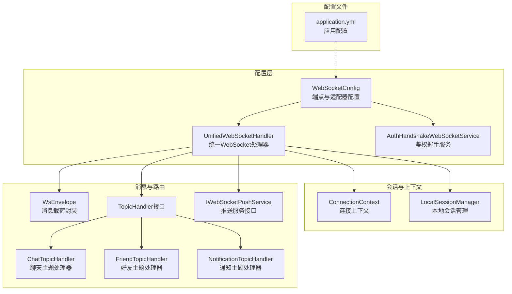
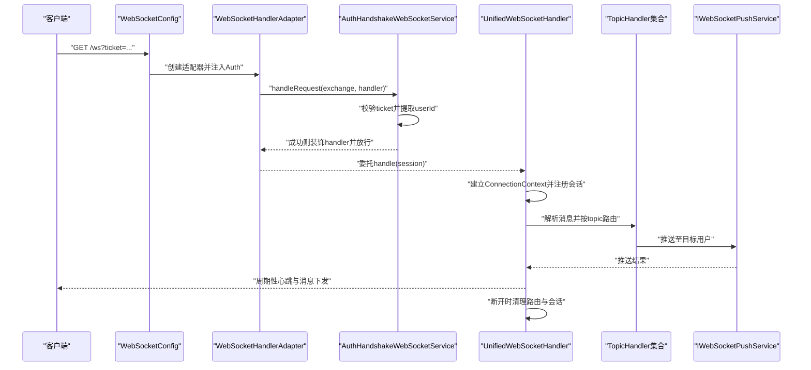
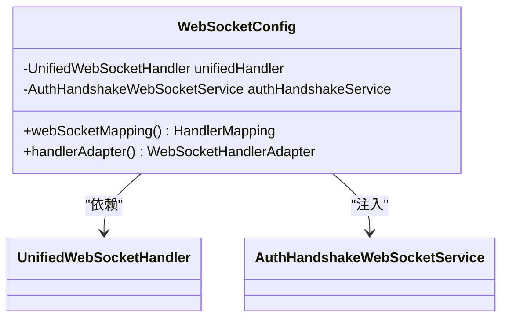
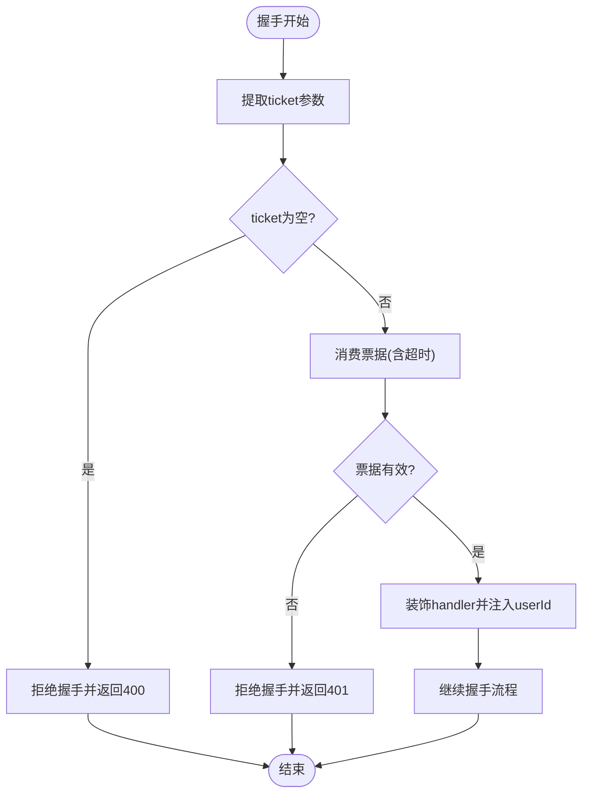
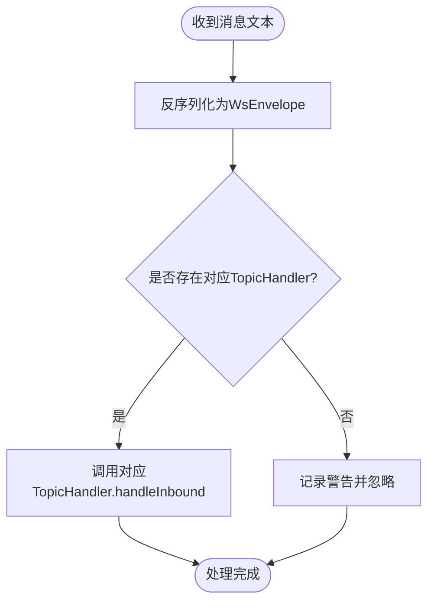
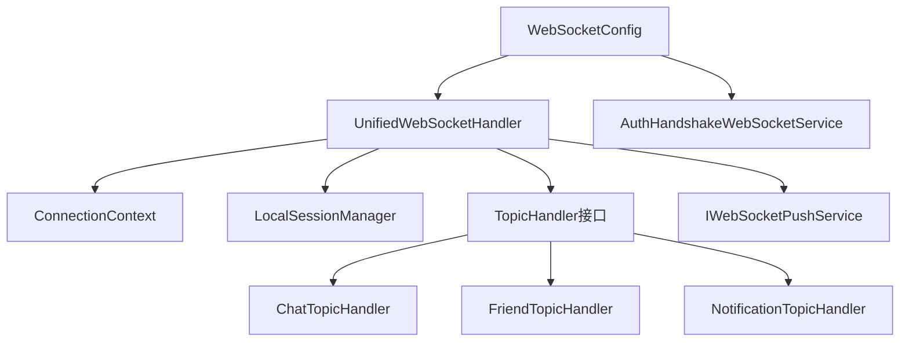

# WebSocket配置管理

<cite>
**本文档引用的文件**
- [WebSocketConfig.java](file://src/main/java/com/rivers/im/config/WebSocketConfig.java)
- [UnifiedWebSocketHandler.java](file://src/main/java/com/rivers/im/config/UnifiedWebSocketHandler.java)
- [AuthHandshakeWebSocketService.java](file://src/main/java/com/rivers/im/service/impl/AuthHandshakeWebSocketService.java)
- [ConnectionContext.java](file://src/main/java/com/rivers/im/context/ConnectionContext.java)
- [LocalSessionManager.java](file://src/main/java/com/rivers/im/manage/LocalSessionManager.java)
- [WsEnvelope.java](file://src/main/java/com/rivers/im/record/WsEnvelope.java)
- [application.yml](file://src/main/resources/application.yml)
- [ChatTopicHandler.java](file://src/main/java/com/rivers/im/router/ChatTopicHandler.java)
- [FriendTopicHandler.java](file://src/main/java/com/rivers/im/router/FriendTopicHandler.java)
- [NotificationTopicHandler.java](file://src/main/java/com/rivers/im/router/NotificationTopicHandler.java)
- [TopicHandler.java](file://src/main/java/com/rivers/im/router/TopicHandler.java)
- [IWebSocketPushService.java](file://src/main/java/com/rivers/im/service/IWebSocketPushService.java)
</cite>

## 目录
1. [简介](#简介)
2. [项目结构](#项目结构)
3. [核心组件](#核心组件)
4. [架构总览](#架构总览)
5. [详细组件分析](#详细组件分析)
6. [依赖分析](#依赖分析)
7. [性能考虑](#性能考虑)
8. [故障排查指南](#故障排查指南)
9. [结论](#结论)
10. [附录](#附录)

## 简介
本文件面向WebSocket配置管理，系统性梳理WebSocketConfig配置类的设计与实现，涵盖端点注册、消息转换器配置、SockJS支持设置、端点映射规则、消息转换器作用与JSON序列化配置、消息格式处理与编码设置、SockJS传输方式选择与心跳设置、回退机制、配置参数说明（超时、缓冲区大小、并发限制）、最佳实践、性能调优建议以及常见问题解决方案。

## 项目结构
该项目采用基于功能域的分层组织，WebSocket相关的核心配置集中在config包中，消息路由与业务处理位于router包，会话上下文与本地会话管理位于context与manage包，消息载体与推送接口位于record与service包。应用配置位于resources目录下的application.yml。

图表来源
- [WebSocketConfig.java:13-35](file://src/main/java/com/rivers/im/config/WebSocketConfig.java#L13-L35)
- [UnifiedWebSocketHandler.java:38-181](file://src/main/java/com/rivers/im/config/UnifiedWebSocketHandler.java#L38-L181)
- [AuthHandshakeWebSocketService.java:22-73](file://src/main/java/com/rivers/im/service/impl/AuthHandshakeWebSocketService.java#L22-L73)
- [ConnectionContext.java:8-24](file://src/main/java/com/rivers/im/context/ConnectionContext.java#L8-L24)
- [LocalSessionManager.java:12-43](file://src/main/java/com/rivers/im/manage/LocalSessionManager.java#L12-L43)
- [WsEnvelope.java:5-10](file://src/main/java/com/rivers/im/record/WsEnvelope.java#L5-L10)
- [application.yml:1-14](file://src/main/resources/application.yml#L1-L14)

章节来源
- [WebSocketConfig.java:13-35](file://src/main/java/com/rivers/im/config/WebSocketConfig.java#L13-L35)
- [application.yml:1-14](file://src/main/resources/application.yml#L1-L14)

## 核心组件
- WebSocketConfig：负责将"/ws"端点映射到统一处理器，并注入自定义鉴权握手服务以提升握手阶段的安全性与可控性。
- UnifiedWebSocketHandler：实现WebSocketHandler，完成会话建立、消息解析与路由、心跳维护、跨节点消息推送与清理等核心逻辑。
- AuthHandshakeWebSocketService：扩展Spring WebFlux默认握手服务，基于票据进行鉴权，注入userId到会话属性，拒绝非法握手。
- ConnectionContext：封装单个WebSocket会话的上下文，包含输出通道（多播+背压缓冲）与用户标识。
- LocalSessionManager：维护本地会话表，提供注册、注销、本地推送能力。
- WsEnvelope：消息载荷封装，包含topic、msgId与payload三要素。
- TopicHandler及其子类：定义不同业务主题的消息处理接口与实现，如聊天、好友、通知等。
- IWebSocketPushService：推送服务接口，用于向指定用户推送消息。

章节来源
- [WebSocketConfig.java:13-35](file://src/main/java/com/rivers/im/config/WebSocketConfig.java#L13-L35)
- [UnifiedWebSocketHandler.java:38-181](file://src/main/java/com/rivers/im/config/UnifiedWebSocketHandler.java#L38-L181)
- [AuthHandshakeWebSocketService.java:22-73](file://src/main/java/com/rivers/im/service/impl/AuthHandshakeWebSocketService.java#L22-L73)
- [ConnectionContext.java:8-24](file://src/main/java/com/rivers/im/context/ConnectionContext.java#L8-L24)
- [LocalSessionManager.java:12-43](file://src/main/java/com/rivers/im/manage/LocalSessionManager.java#L12-L43)
- [WsEnvelope.java:5-10](file://src/main/java/com/rivers/im/record/WsEnvelope.java#L5-L10)
- [TopicHandler.java:8-14](file://src/main/java/com/rivers/im/router/TopicHandler.java#L8-L14)
- [IWebSocketPushService.java:6-12](file://src/main/java/com/rivers/im/service/IWebSocketPushService.java#L6-L12)

## 架构总览
下图展示了从客户端发起WebSocket连接到消息路由与推送的整体流程，包括端点映射、握手鉴权、会话建立、消息解析与路由、心跳维护与清理等环节。

图表来源
- [WebSocketConfig.java:22-34](file://src/main/java/com/rivers/im/config/WebSocketConfig.java#L22-L34)
- [AuthHandshakeWebSocketService.java:26-55](file://src/main/java/com/rivers/im/service/impl/AuthHandshakeWebSocketService.java#L26-L55)
- [UnifiedWebSocketHandler.java:87-122](file://src/main/java/com/rivers/im/config/UnifiedWebSocketHandler.java#L87-L122)
- [TopicHandler.java:8-14](file://src/main/java/com/rivers/im/router/TopicHandler.java#L8-L14)
- [IWebSocketPushService.java:10](file://src/main/java/com/rivers/im/service/IWebSocketPushService.java#L10)

## 详细组件分析

### WebSocketConfig配置类设计与实现
- 端点注册：通过SimpleUrlHandlerMapping将URL路径"/ws"绑定到UnifiedWebSocketHandler，设置order为-1确保最高优先级。
- 握手适配：通过WebSocketHandlerAdapter注入AuthHandshakeWebSocketService，实现自定义握手逻辑。
- 依赖注入：持有UnifiedWebSocketHandler与AuthHandshakeWebSocketService实例，解耦处理器与握手服务。

图表来源
- [WebSocketConfig.java:18-34](file://src/main/java/com/rivers/im/config/WebSocketConfig.java#L18-L34)

章节来源
- [WebSocketConfig.java:13-35](file://src/main/java/com/rivers/im/config/WebSocketConfig.java#L13-L35)

### 端点映射规则与路径匹配机制
- 映射规则："/ws"精确匹配，不支持通配符或前缀匹配；该设计简化了路由与安全控制。
- 匹配顺序：order=-1确保在所有其他HandlerMapping之前被评估，避免与静态资源或其他映射冲突。
- 握手参数：ticket必须通过查询参数传入，作为鉴权凭证；若缺失或无效将直接拒绝握手。

章节来源
- [WebSocketConfig.java:23-28](file://src/main/java/com/rivers/im/config/WebSocketConfig.java#L23-L28)
- [AuthHandshakeWebSocketService.java:27-32](file://src/main/java/com/rivers/im/service/impl/AuthHandshakeWebSocketService.java#L27-L32)

### 消息转换器配置与JSON序列化
- JSON序列化：使用Jackson ObjectMapper对消息进行反序列化与序列化，确保消息格式一致性。
- 消息格式：WsEnvelope包含topic、msgId与payload三要素，payload为JsonNode，便于TopicHandler按需解析。
- 编码设置：WebSocketSession使用文本帧传输，统一按UTF-8编码处理；消息解析与路由均基于字符串文本。

章节来源
- [UnifiedWebSocketHandler.java:124-138](file://src/main/java/com/rivers/im/config/UnifiedWebSocketHandler.java#L124-L138)
- [WsEnvelope.java:5-10](file://src/main/java/com/rivers/im/record/WsEnvelope.java#L5-L10)

### SockJS支持设置
- 当前实现未启用SockJS。项目使用原生WebSocket，通过"/ws"端点提供直连通信。
- 若需支持多种传输（如轮询）与回退机制，可在现有基础上引入SockJS端点与相应配置，但当前仓库未包含相关配置。

章节来源
- [WebSocketConfig.java:23-28](file://src/main/java/com/rivers/im/config/WebSocketConfig.java#L23-L28)

### 握手鉴权与会话建立
- 鉴权流程：从查询参数提取ticket，调用IWsTicketService消费票据，超时时间为5秒；票据无效或过期时拒绝握手。
- 会话注入：鉴权成功后将userId写入session.getAttributes()，供后续处理器读取。
- 会话清理：断开连接时移除路由与会话，释放资源。

图表来源
- [AuthHandshakeWebSocketService.java:27-55](file://src/main/java/com/rivers/im/service/impl/AuthHandshakeWebSocketService.java#L27-L55)

章节来源
- [AuthHandshakeWebSocketService.java:22-73](file://src/main/java/com/rivers/im/service/impl/AuthHandshakeWebSocketService.java#L22-L73)
- [UnifiedWebSocketHandler.java:87-122](file://src/main/java/com/rivers/im/config/UnifiedWebSocketHandler.java#L87-L122)

### 消息路由与处理
- 解析与路由：将文本消息反序列化为WsEnvelope，根据topic查找对应TopicHandler进行处理。
- 并发控制：dispatchMessage内部使用concatMap(1)保证消息串行处理，避免并发竞争。
- 主题处理器：ChatTopicHandler处理聊天消息，FriendTopicHandler处理好友请求/接受/拒绝，NotificationTopicHandler处理通知读取等。

图表来源
- [UnifiedWebSocketHandler.java:124-138](file://src/main/java/com/rivers/im/config/UnifiedWebSocketHandler.java#L124-L138)
- [TopicHandler.java:8-14](file://src/main/java/com/rivers/im/router/TopicHandler.java#L8-L14)

章节来源
- [UnifiedWebSocketHandler.java:124-138](file://src/main/java/com/rivers/im/config/UnifiedWebSocketHandler.java#L124-L138)
- [ChatTopicHandler.java:31-49](file://src/main/java/com/rivers/im/router/ChatTopicHandler.java#L31-L49)
- [FriendTopicHandler.java:59-70](file://src/main/java/com/rivers/im/router/FriendTopicHandler.java#L59-L70)
- [NotificationTopicHandler.java:19-26](file://src/main/java/com/rivers/im/router/NotificationTopicHandler.java#L19-L26)

### 心跳与会话维护
- 心跳机制：每25秒向Redis续期路由键有效期，防止因空闲导致路由失效。
- 断开清理：连接关闭时清理会话与路由，避免内存泄漏与脏数据。

章节来源
- [UnifiedWebSocketHandler.java:111-121](file://src/main/java/com/rivers/im/config/UnifiedWebSocketHandler.java#L111-L121)
- [UnifiedWebSocketHandler.java:151-162](file://src/main/java/com/rivers/im/config/UnifiedWebSocketHandler.java#L151-L162)

### 跨节点消息推送
- 订阅频道：每个节点订阅形如"ws:node:{currentServerId}"的Redis频道，接收来自其他节点的跨服消息。
- 本地推送：根据connId将消息推送到本地会话的outboundSink，实现跨节点实时消息转发。

章节来源
- [UnifiedWebSocketHandler.java:67-85](file://src/main/java/com/rivers/im/config/UnifiedWebSocketHandler.java#L67-L85)
- [UnifiedWebSocketHandler.java:140-149](file://src/main/java/com/rivers/im/config/UnifiedWebSocketHandler.java#L140-L149)

## 依赖分析
- 组件内聚与耦合：WebSocketConfig低耦合地依赖处理器与握手服务；UnifiedWebSocketHandler聚合多个协作组件（路由、Redis、会话管理、推送服务）。
- 外部依赖：Jackson用于JSON序列化；Reactive Redis用于路由与跨节点消息；Reactor用于响应式流处理。
- 循环依赖规避：通过构造函数注入避免循环依赖；会话属性注入userId而非共享状态。

图表来源
- [WebSocketConfig.java:18-34](file://src/main/java/com/rivers/im/config/WebSocketConfig.java#L18-L34)
- [UnifiedWebSocketHandler.java:50-65](file://src/main/java/com/rivers/im/config/UnifiedWebSocketHandler.java#L50-L65)
- [TopicHandler.java:8-14](file://src/main/java/com/rivers/im/router/TopicHandler.java#L8-L14)

章节来源
- [WebSocketConfig.java:18-34](file://src/main/java/com/rivers/im/config/WebSocketConfig.java#L18-L34)
- [UnifiedWebSocketHandler.java:50-65](file://src/main/java/com/rivers/im/config/UnifiedWebSocketHandler.java#L50-L65)

## 性能考虑
- 并发与背压：ConnectionContext使用多播+背压缓冲（容量1024），避免高并发场景下的丢包与阻塞。
- 序列化成本：消息解析与序列化集中在单线程处理（concatMap(1)），降低并发竞争带来的复杂度。
- 心跳频率：25秒心跳在保持连接活跃的同时，尽量减少Redis续期压力。
- 路由与清理：会话断开时及时清理路由与会话，避免长期占用内存。
- 推送策略：推送服务采用best-effort策略，失败仅记录日志，保障主流程稳定性。

章节来源
- [ConnectionContext.java:18](file://src/main/java/com/rivers/im/context/ConnectionContext.java#L18)
- [UnifiedWebSocketHandler.java:108](file://src/main/java/com/rivers/im/config/UnifiedWebSocketHandler.java#L108)
- [UnifiedWebSocketHandler.java:111-118](file://src/main/java/com/rivers/im/config/UnifiedWebSocketHandler.java#L111-L118)
- [FriendTopicHandler.java:247-259](file://src/main/java/com/rivers/im/router/FriendTopicHandler.java#L247-L259)

## 故障排查指南
- 握手失败
  - 现象：返回400或401状态码。
  - 原因：ticket缺失或无效/过期；鉴权服务异常。
  - 处理：检查ticket参数是否正确传递；确认票据服务可用且未超时。
- 无法获取userId
  - 现象：连接被立即关闭。
  - 原因：握手未注入userId或URI中未携带userId参数。
  - 处理：确保ticket有效；检查URI查询参数格式。
- 消息解析失败
  - 现象：记录警告并忽略消息。
  - 原因：消息格式不符合WsEnvelope规范或topic未注册。
  - 处理：核对消息格式与topic名称；确认对应TopicHandler已注册。
- 路由清理异常
  - 现象：断开后残留路由键。
  - 原因：Redis操作失败。
  - 处理：检查Redis连接与权限；关注错误日志。
- 心跳续期失败
  - 现象：连接空闲后路由失效。
  - 处理：检查Redis可用性与网络延迟；适当调整心跳频率。

章节来源
- [AuthHandshakeWebSocketService.java:29-43](file://src/main/java/com/rivers/im/service/impl/AuthHandshakeWebSocketService.java#L29-L43)
- [UnifiedWebSocketHandler.java:91-94](file://src/main/java/com/rivers/im/config/UnifiedWebSocketHandler.java#L91-L94)
- [UnifiedWebSocketHandler.java:124-138](file://src/main/java/com/rivers/im/config/UnifiedWebSocketHandler.java#L124-L138)
- [UnifiedWebSocketHandler.java:154-160](file://src/main/java/com/rivers/im/config/UnifiedWebSocketHandler.java#L154-L160)
- [UnifiedWebSocketHandler.java:114-118](file://src/main/java/com/rivers/im/config/UnifiedWebSocketHandler.java#L114-L118)

## 结论
本项目通过简洁而清晰的配置与实现，提供了可靠的WebSocket通信基础：明确的端点映射、严格的握手鉴权、稳健的消息路由与推送、完善的会话生命周期管理与心跳维护。当前未启用SockJS，若未来需要兼容多种传输与回退机制，可在现有基础上扩展SockJS配置与传输策略。

## 附录

### 配置参数说明
- 端点映射
  - 路径："/ws"
  - 作用：WebSocket入口端点
  - 优先级：order=-1
- 握手鉴权
  - 参数：ticket（查询参数）
  - 超时：5秒
  - 状态码：400（缺失）、401（无效/过期）
- 心跳设置
  - 周期：25秒
  - 目的：续期Redis路由键有效期
- 缓冲区大小
  - 出站缓冲：1024（多播+背压）
- 并发限制
  - 消息处理：串行（concatMap(1)）
- 应用端口
  - server.port：9000

章节来源
- [WebSocketConfig.java:23-28](file://src/main/java/com/rivers/im/config/WebSocketConfig.java#L23-L28)
- [AuthHandshakeWebSocketService.java:35](file://src/main/java/com/rivers/im/service/impl/AuthHandshakeWebSocketService.java#L35)
- [ConnectionContext.java:18](file://src/main/java/com/rivers/im/context/ConnectionContext.java#L18)
- [UnifiedWebSocketHandler.java:111-118](file://src/main/java/com/rivers/im/config/UnifiedWebSocketHandler.java#L111-L118)
- [application.yml:13-14](file://src/main/resources/application.yml#L13-L14)