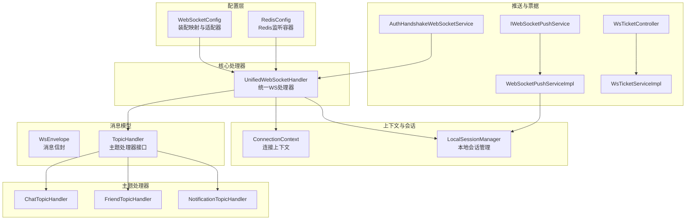
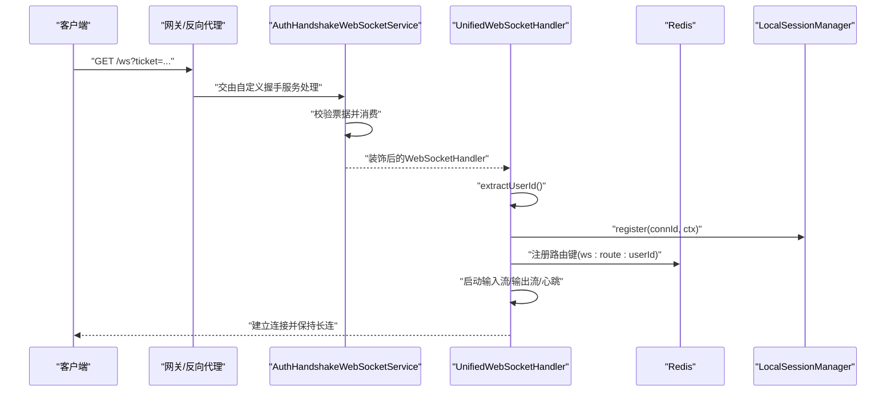
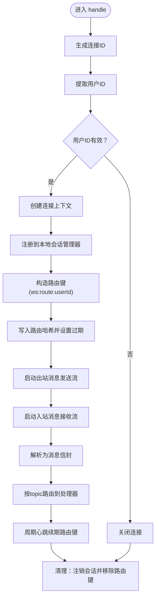
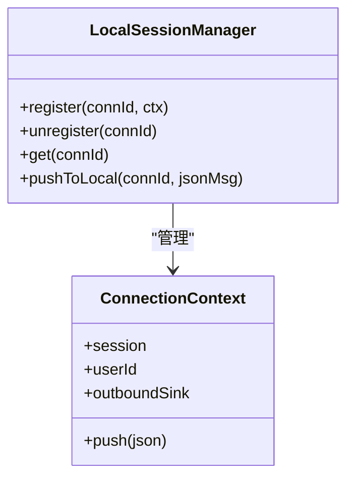
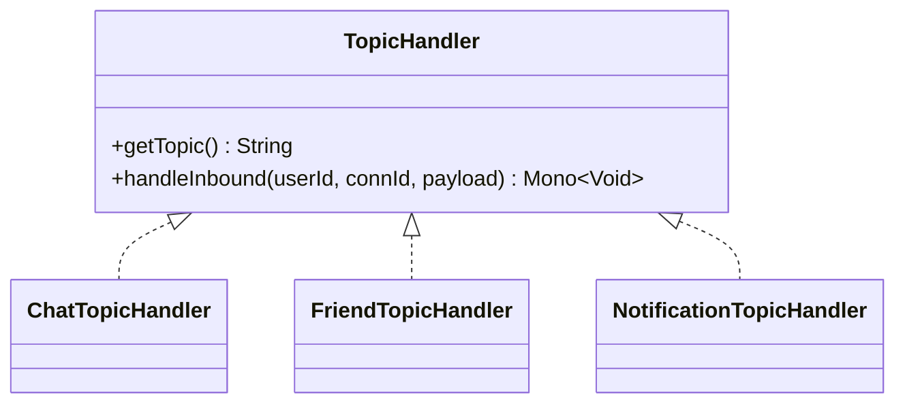
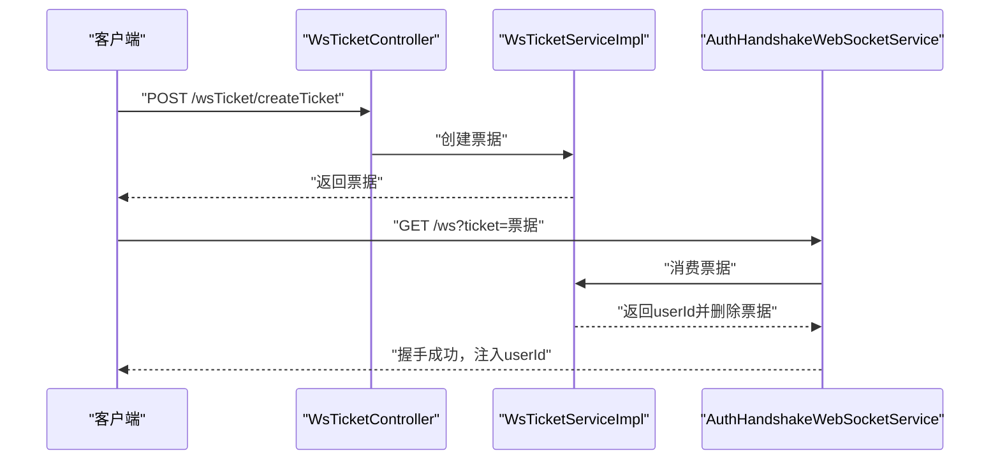
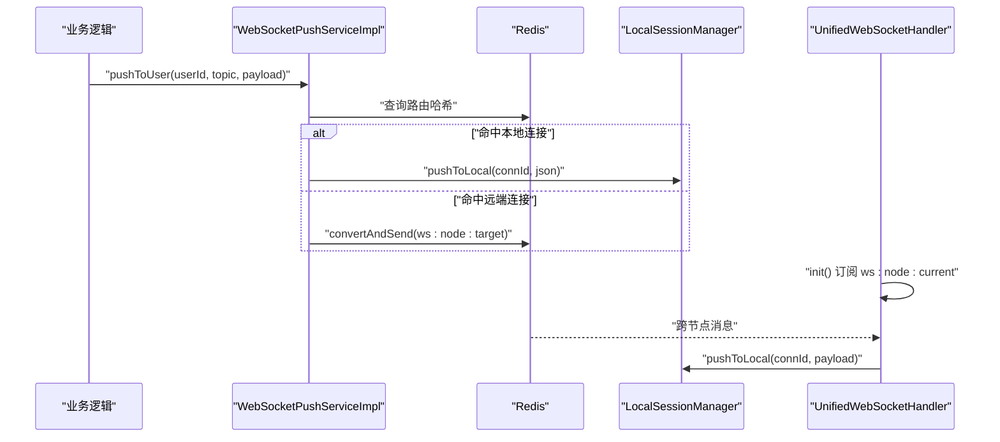
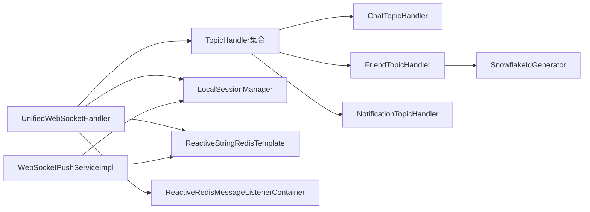

# 统一WebSocket处理器

<cite>
**本文引用的文件**
- [UnifiedWebSocketHandler.java](file://src/main/java/com/rivers/im/config/UnifiedWebSocketHandler.java)
- [ConnectionContext.java](file://src/main/java/com/rivers/im/context/ConnectionContext.java)
- [LocalSessionManager.java](file://src/main/java/com/rivers/im/manage/LocalSessionManager.java)
- [WsEnvelope.java](file://src/main/java/com/rivers/im/record/WsEnvelope.java)
- [TopicHandler.java](file://src/main/java/com/rivers/im/router/TopicHandler.java)
- [ChatTopicHandler.java](file://src/main/java/com/rivers/im/router/ChatTopicHandler.java)
- [FriendTopicHandler.java](file://src/main/java/com/rivers/im/router/FriendTopicHandler.java)
- [NotificationTopicHandler.java](file://src/main/java/com/rivers/im/router/NotificationTopicHandler.java)
- [AuthHandshakeWebSocketService.java](file://src/main/java/com/rivers/im/service/impl/AuthHandshakeWebSocketService.java)
- [WebSocketConfig.java](file://src/main/java/com/rivers/im/config/WebSocketConfig.java)
- [IWebSocketPushService.java](file://src/main/java/com/rivers/im/service/IWebSocketPushService.java)
- [WebSocketPushServiceImpl.java](file://src/main/java/com/rivers/im/service/impl/WebSocketPushServiceImpl.java)
- [RedisConfig.java](file://src/main/java/com/rivers/im/config/RedisConfig.java)
- [WsTicketController.java](file://src/main/java/com/rivers/im/controller/WsTicketController.java)
- [WsTicketServiceImpl.java](file://src/main/java/com/rivers/im/service/impl/WsTicketServiceImpl.java)
- [application.yml](file://src/main/resources/application.yml)
- [SnowflakeIdGenerator.java](file://src/main/java/com/rivers/im/util/SnowflakeIdGenerator.java)
</cite>

## 目录
1. [引言](#引言)
2. [项目结构](#项目结构)
3. [核心组件](#核心组件)
4. [架构总览](#架构总览)
5. [详细组件分析](#详细组件分析)
6. [依赖分析](#依赖分析)
7. [性能考虑](#性能考虑)
8. [故障排查指南](#故障排查指南)
9. [结论](#结论)
10. [附录](#附录)

## 引言
本技术文档围绕统一WebSocket处理器展开，系统性阐述其连接建立流程、握手与认证机制、消息路由分发、会话生命周期管理、心跳检测与跨节点消息推送等关键能力。文档同时给出错误处理策略、资源清理机制与性能优化建议，帮助开发者快速理解并高效扩展该WebSocket基础设施。

## 项目结构
项目采用按功能域划分的层次化组织方式，核心模块包括：
- 配置层：WebSocket与Redis配置、统一处理器装配
- 上下文与会话：连接上下文、本地会话管理
- 路由与主题处理器：基于Topic的消息分发
- 推送与票据：面向用户的推送服务、握手票据服务
- 控制器与工具：票据创建接口、雪花ID生成器

图表来源
- [WebSocketConfig.java:15-35](file://src/main/java/com/rivers/im/config/WebSocketConfig.java#L15-L35)
- [RedisConfig.java:9-18](file://src/main/java/com/rivers/im/config/RedisConfig.java#L9-L18)
- [UnifiedWebSocketHandler.java:38-65](file://src/main/java/com/rivers/im/config/UnifiedWebSocketHandler.java#L38-L65)
- [ConnectionContext.java:8-24](file://src/main/java/com/rivers/im/context/ConnectionContext.java#L8-L24)
- [LocalSessionManager.java:12-43](file://src/main/java/com/rivers/im/manage/LocalSessionManager.java#L12-L43)
- [WsEnvelope.java:5-9](file://src/main/java/com/rivers/im/record/WsEnvelope.java#L5-L9)
- [TopicHandler.java:8-14](file://src/main/java/com/rivers/im/router/TopicHandler.java#L8-L14)
- [ChatTopicHandler.java:14-51](file://src/main/java/com/rivers/im/router/ChatTopicHandler.java#L14-L51)
- [FriendTopicHandler.java:24-261](file://src/main/java/com/rivers/im/router/FriendTopicHandler.java#L24-L261)
- [NotificationTopicHandler.java:12-27](file://src/main/java/com/rivers/im/router/NotificationTopicHandler.java#L12-L27)
- [IWebSocketPushService.java:6-12](file://src/main/java/com/rivers/im/service/IWebSocketPushService.java#L6-L12)
- [WebSocketPushServiceImpl.java:20-90](file://src/main/java/com/rivers/im/service/impl/WebSocketPushServiceImpl.java#L20-L90)
- [AuthHandshakeWebSocketService.java:22-55](file://src/main/java/com/rivers/im/service/impl/AuthHandshakeWebSocketService.java#L22-L55)
- [WsTicketController.java:14-26](file://src/main/java/com/rivers/im/controller/WsTicketController.java#L14-L26)
- [WsTicketServiceImpl.java:20-55](file://src/main/java/com/rivers/im/service/impl/WsTicketServiceImpl.java#L20-L55)

章节来源
- [WebSocketConfig.java:15-35](file://src/main/java/com/rivers/im/config/WebSocketConfig.java#L15-L35)
- [RedisConfig.java:9-18](file://src/main/java/com/rivers/im/config/RedisConfig.java#L9-L18)
- [application.yml:1-14](file://src/main/resources/application.yml#L1-L14)

## 核心组件
- 统一WebSocket处理器：负责握手后会话初始化、消息分发、心跳续期、跨节点消息监听与清理回收。
- 连接上下文：封装WebSocketSession、用户ID与出站消息通道。
- 本地会话管理：维护当前节点的连接映射，支持本地推送与清理。
- 主题处理器：按topic路由到具体业务处理器（聊天、好友、通知）。
- 推送服务：基于Redis路由键定位用户连接，支持同节点直接推送与跨节点Pub/Sub转发。
- 握手认证服务：基于票据消费完成鉴权，注入userId到会话属性。
- 票据服务：生成一次性票据并设置过期时间，供握手阶段校验。

章节来源
- [UnifiedWebSocketHandler.java:38-181](file://src/main/java/com/rivers/im/config/UnifiedWebSocketHandler.java#L38-L181)
- [ConnectionContext.java:8-24](file://src/main/java/com/rivers/im/context/ConnectionContext.java#L8-L24)
- [LocalSessionManager.java:12-43](file://src/main/java/com/rivers/im/manage/LocalSessionManager.java#L12-L43)
- [TopicHandler.java:8-14](file://src/main/java/com/rivers/im/router/TopicHandler.java#L8-L14)
- [IWebSocketPushService.java:6-12](file://src/main/java/com/rivers/im/service/IWebSocketPushService.java#L6-L12)
- [WebSocketPushServiceImpl.java:20-90](file://src/main/java/com/rivers/im/service/impl/WebSocketPushServiceImpl.java#L20-L90)
- [AuthHandshakeWebSocketService.java:22-55](file://src/main/java/com/rivers/im/service/impl/AuthHandshakeWebSocketService.java#L22-L55)
- [WsTicketServiceImpl.java:20-55](file://src/main/java/com/rivers/im/service/impl/WsTicketServiceImpl.java#L20-L55)

## 架构总览
统一WebSocket处理器作为Reactive Websocket入口，结合Redis实现跨节点消息路由与心跳续期；通过自定义握手服务完成鉴权并将userId注入会话属性，确保后续流程可直接获取用户身份。

图表来源
- [AuthHandshakeWebSocketService.java:26-55](file://src/main/java/com/rivers/im/service/impl/AuthHandshakeWebSocketService.java#L26-L55)
- [UnifiedWebSocketHandler.java:87-122](file://src/main/java/com/rivers/im/config/UnifiedWebSocketHandler.java#L87-L122)
- [LocalSessionManager.java:17-26](file://src/main/java/com/rivers/im/manage/LocalSessionManager.java#L17-L26)
- [WebSocketConfig.java:22-34](file://src/main/java/com/rivers/im/config/WebSocketConfig.java#L22-L34)

## 详细组件分析

### 统一WebSocket处理器（UnifiedWebSocketHandler）
- 连接建立与握手认证
  - 在握手阶段，通过自定义握手服务注入userId到会话属性；处理器从会话属性中提取userId，若为空则立即关闭连接。
  - 生成随机连接ID，创建连接上下文并注册到本地会话管理器。
  - 使用Redis哈希记录“用户ID->连接ID”的映射，并设置过期时间以维持路由有效性。
- 输入/输出/心跳
  - 输出：将连接上下文中的多播出站通道转换为文本消息流发送。
  - 输入：逐条读取文本消息，解析为消息信封，按topic路由到对应处理器，串行顺序处理。
  - 心跳：周期性对路由键进行续期，确保连接存活期间路由不丢失。
- 跨节点消息监听
  - 启动Redis Pub/Sub监听当前节点的频道，收到消息后直接推送到本地指定连接。
- 清理与异常处理
  - 会话结束时注销本地连接并移除Redis路由键；对异常进行日志记录但不影响整体流程。

图表来源
- [UnifiedWebSocketHandler.java:87-122](file://src/main/java/com/rivers/im/config/UnifiedWebSocketHandler.java#L87-L122)
- [LocalSessionManager.java:17-26](file://src/main/java/com/rivers/im/manage/LocalSessionManager.java#L17-L26)
- [ConnectionContext.java:14-23](file://src/main/java/com/rivers/im/context/ConnectionContext.java#L14-L23)

章节来源
- [UnifiedWebSocketHandler.java:87-181](file://src/main/java/com/rivers/im/config/UnifiedWebSocketHandler.java#L87-L181)

### 连接上下文与本地会话管理
- 连接上下文
  - 封装WebSocketSession、用户ID与出站消息通道（多播+背压缓冲）。
  - 提供push方法向下游发送JSON消息。
- 本地会话管理
  - 维护当前节点的连接映射，支持注册、注销、查询与本地推送。
  - 注销时触发出站通道完成，避免内存泄漏。

图表来源
- [ConnectionContext.java:8-24](file://src/main/java/com/rivers/im/context/ConnectionContext.java#L8-L24)
- [LocalSessionManager.java:12-43](file://src/main/java/com/rivers/im/manage/LocalSessionManager.java#L12-L43)

章节来源
- [ConnectionContext.java:8-24](file://src/main/java/com/rivers/im/context/ConnectionContext.java#L8-L24)
- [LocalSessionManager.java:12-43](file://src/main/java/com/rivers/im/manage/LocalSessionManager.java#L12-L43)

### 主题处理器与消息路由
- 主题处理器接口
  - 定义topic标识与入站消息处理方法。
- 典型处理器
  - 聊天处理器：校验接收方，封装消息内容，调用推送服务向双方推送。
  - 好友处理器：支持请求、接受、拒绝三种动作，使用关系ID批量更新状态并持久化离线通知，尝试实时推送。
  - 通知处理器：处理用户已读等轻量事件。

图表来源
- [TopicHandler.java:8-14](file://src/main/java/com/rivers/im/router/TopicHandler.java#L8-L14)
- [ChatTopicHandler.java:14-51](file://src/main/java/com/rivers/im/router/ChatTopicHandler.java#L14-L51)
- [FriendTopicHandler.java:24-261](file://src/main/java/com/rivers/im/router/FriendTopicHandler.java#L24-L261)
- [NotificationTopicHandler.java:12-27](file://src/main/java/com/rivers/im/router/NotificationTopicHandler.java#L12-L27)

章节来源
- [TopicHandler.java:8-14](file://src/main/java/com/rivers/im/router/TopicHandler.java#L8-L14)
- [ChatTopicHandler.java:14-51](file://src/main/java/com/rivers/im/router/ChatTopicHandler.java#L14-L51)
- [FriendTopicHandler.java:24-261](file://src/main/java/com/rivers/im/router/FriendTopicHandler.java#L24-L261)
- [NotificationTopicHandler.java:12-27](file://src/main/java/com/rivers/im/router/NotificationTopicHandler.java#L12-L27)

### 握手认证与票据服务
- 自定义握手服务
  - 从查询参数提取票据，调用票据服务消费票据并超时控制。
  - 成功后将userId写入会话属性，再交由统一处理器处理。
- 票据服务
  - 生成一次性UUID票据并设置短期过期时间，供客户端握手使用。
  - 消费票据时原子删除并返回用户ID，确保票据不可重用。

图表来源
- [WsTicketController.java:14-26](file://src/main/java/com/rivers/im/controller/WsTicketController.java#L14-L26)
- [WsTicketServiceImpl.java:26-55](file://src/main/java/com/rivers/im/service/impl/WsTicketServiceImpl.java#L26-L55)
- [AuthHandshakeWebSocketService.java:26-55](file://src/main/java/com/rivers/im/service/impl/AuthHandshakeWebSocketService.java#L26-L55)

章节来源
- [AuthHandshakeWebSocketService.java:22-73](file://src/main/java/com/rivers/im/service/impl/AuthHandshakeWebSocketService.java#L22-L73)
- [WsTicketServiceImpl.java:20-55](file://src/main/java/com/rivers/im/service/impl/WsTicketServiceImpl.java#L20-L55)
- [WsTicketController.java:14-26](file://src/main/java/com/rivers/im/controller/WsTicketController.java#L14-L26)

### 推送服务与跨节点消息
- 推送服务
  - 将业务负载封装为消息信封，查询用户路由键，分别处理本地与跨节点推送。
  - 本地：直接调用本地会话管理器推送。
  - 跨节点：序列化为跨节点消息并通过Redis Pub/Sub发送至目标节点。
- 跨节点监听
  - 统一处理器在启动时订阅当前节点的频道，收到消息后直接推送至本地连接。

图表来源
- [WebSocketPushServiceImpl.java:44-88](file://src/main/java/com/rivers/im/service/impl/WebSocketPushServiceImpl.java#L44-L88)
- [UnifiedWebSocketHandler.java:67-77](file://src/main/java/com/rivers/im/config/UnifiedWebSocketHandler.java#L67-L77)
- [LocalSessionManager.java:35-42](file://src/main/java/com/rivers/im/manage/LocalSessionManager.java#L35-L42)

章节来源
- [WebSocketPushServiceImpl.java:20-90](file://src/main/java/com/rivers/im/service/impl/WebSocketPushServiceImpl.java#L20-L90)
- [UnifiedWebSocketHandler.java:67-85](file://src/main/java/com/rivers/im/config/UnifiedWebSocketHandler.java#L67-L85)

### 心跳检测机制
- 路由键续期
  - 处理器周期性对“用户->连接”路由键进行续期，防止连接断开导致路由失效。
- 连接状态维护
  - 心跳仅在会话打开时继续，异常时自动停止，避免无效操作。

章节来源
- [UnifiedWebSocketHandler.java:111-118](file://src/main/java/com/rivers/im/config/UnifiedWebSocketHandler.java#L111-L118)

## 依赖分析
- 组件耦合
  - 统一处理器依赖主题处理器集合、对象映射、Redis模板、监听容器、本地会话管理器与服务器标识。
  - 主题处理器依赖推送服务、数据库映射与雪花ID生成器（好友场景）。
- 外部依赖
  - Redis用于路由、心跳续期与跨节点Pub/Sub。
  - Spring WebFlux提供响应式WebSocket支持。

图表来源
- [UnifiedWebSocketHandler.java:50-65](file://src/main/java/com/rivers/im/config/UnifiedWebSocketHandler.java#L50-L65)
- [FriendTopicHandler.java:39-51](file://src/main/java/com/rivers/im/router/FriendTopicHandler.java#L39-L51)
- [WebSocketPushServiceImpl.java:27-37](file://src/main/java/com/rivers/im/service/impl/WebSocketPushServiceImpl.java#L27-L37)

章节来源
- [UnifiedWebSocketHandler.java:50-65](file://src/main/java/com/rivers/im/config/UnifiedWebSocketHandler.java#L50-L65)
- [FriendTopicHandler.java:39-51](file://src/main/java/com/rivers/im/router/FriendTopicHandler.java#L39-L51)
- [WebSocketPushServiceImpl.java:27-37](file://src/main/java/com/rivers/im/service/impl/WebSocketPushServiceImpl.java#L27-L37)

## 性能考虑
- 背压与缓冲
  - 出站通道采用多播+背压缓冲，避免高并发下丢包与阻塞。
- 顺序处理
  - 入站消息串行处理，确保同一连接内的消息有序性。
- 心跳频率
  - 25秒心跳续期在保证路由存活的同时降低Redis压力。
- 跨节点推送
  - 本地推送无网络开销，跨节点通过Pub/Sub异步转发，提升吞吐。
- Redis键设计
  - 路由键带过期时间，避免长期占用内存；推送前先查表，减少无效广播。

## 故障排查指南
- 握手失败
  - 检查票据是否正确生成与过期；确认自定义握手服务是否成功注入userId。
- 连接未建立
  - 核查用户ID提取逻辑与会话属性注入；确认路由键写入与过期设置是否成功。
- 消息未达
  - 检查topic是否匹配；核对路由键是否存在且未过期；查看跨节点Pub/Sub是否正常。
- 心跳异常
  - 关注心跳续期错误日志；检查Redis可用性与权限。
- 资源清理
  - 确认会话关闭后本地与Redis路由均被清理；避免残留连接句柄。

章节来源
- [AuthHandshakeWebSocketService.java:26-55](file://src/main/java/com/rivers/im/service/impl/AuthHandshakeWebSocketService.java#L26-L55)
- [UnifiedWebSocketHandler.java:98-102](file://src/main/java/com/rivers/im/config/UnifiedWebSocketHandler.java#L98-L102)
- [WebSocketPushServiceImpl.java:56-88](file://src/main/java/com/rivers/im/service/impl/WebSocketPushServiceImpl.java#L56-L88)

## 结论
统一WebSocket处理器通过清晰的职责分离与响应式编程模型，实现了高可用、可扩展的长连接服务。结合Redis路由与跨节点Pub/Sub，既能满足单节点内高效推送，也能支撑多实例部署下的消息一致性。配合严格的握手认证与会话生命周期管理，系统在安全性与稳定性方面具备良好基础。

## 附录
- 配置要点
  - 端口与应用名在资源配置文件中定义。
  - WebSocket映射与自定义握手适配器在配置类中装配。
- 数据模型
  - 消息信封包含topic、msgId与payload三要素，便于跨节点传输与本地解析。

章节来源
- [application.yml:1-14](file://src/main/resources/application.yml#L1-L14)
- [WebSocketConfig.java:22-34](file://src/main/java/com/rivers/im/config/WebSocketConfig.java#L22-L34)
- [WsEnvelope.java:5-9](file://src/main/java/com/rivers/im/record/WsEnvelope.java#L5-L9)