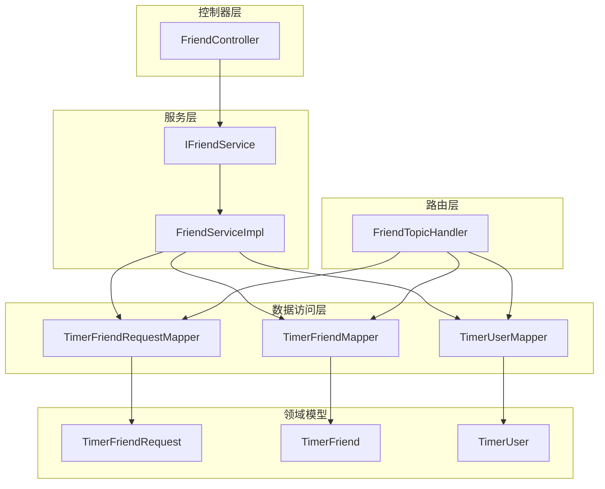
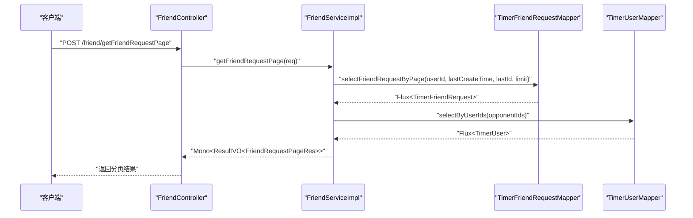
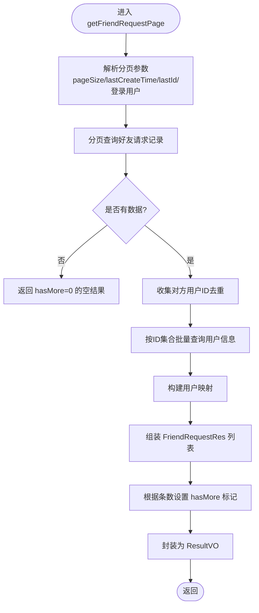
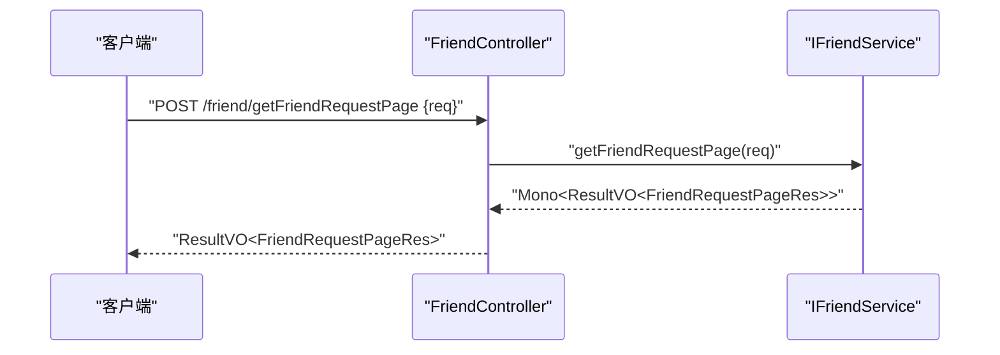
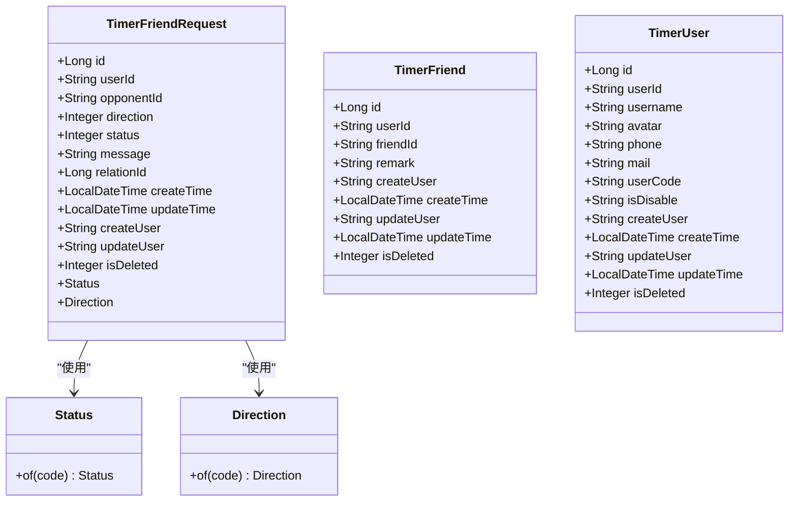
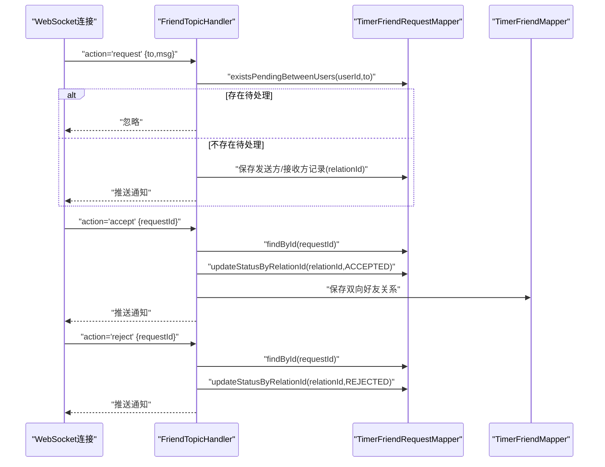
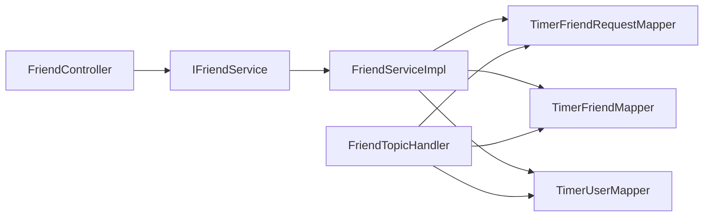

# 业务服务层

<cite>
**本文引用的文件**
- [IFriendService.java](file://src/main/java/com/rivers/im/service/IFriendService.java)
- [FriendServiceImpl.java](file://src/main/java/com/rivers/im/service/impl/FriendServiceImpl.java)
- [FriendController.java](file://src/main/java/com/rivers/im/controller/FriendController.java)
- [TimerFriendRequest.java](file://src/main/java/com/rivers/im/entity/TimerFriendRequest.java)
- [TimerFriend.java](file://src/main/java/com/rivers/im/entity/TimerFriend.java)
- [TimerUser.java](file://src/main/java/com/rivers/im/entity/TimerUser.java)
- [TimerFriendRequestMapper.java](file://src/main/java/com/rivers/im/mapper/TimerFriendRequestMapper.java)
- [TimerFriendMapper.java](file://src/main/java/com/rivers/im/mapper/TimerFriendMapper.java)
- [TimerUserMapper.java](file://src/main/java/com/rivers/im/mapper/TimerUserMapper.java)
- [FriendTopicHandler.java](file://src/main/java/com/rivers/im/router/FriendTopicHandler.java)
</cite>

## 目录
1. [引言](#引言)
2. [项目结构](#项目结构)
3. [核心组件](#核心组件)
4. [架构总览](#架构总览)
5. [详细组件分析](#详细组件分析)
6. [依赖关系分析](#依赖关系分析)
7. [性能考量](#性能考量)
8. [故障排查指南](#故障排查指南)
9. [结论](#结论)
10. [附录](#附录)

## 引言
本文件聚焦于IM服务器中的“业务服务层”，系统化梳理好友服务的领域模型与服务边界，深入解析IFriendService接口的设计理念、FriendServiceImpl的实现逻辑、FriendController的REST API设计，并给出扩展指南与错误处理策略，帮助读者在保持业务逻辑清晰分离与可测试性的前提下，快速理解与演进该模块。

## 项目结构
业务服务层围绕“好友”这一核心领域展开，主要由以下层次构成：
- 控制器层：FriendController 提供REST接口，负责请求接入与结果封装。
- 服务层：IFriendService定义接口契约，FriendServiceImpl实现具体业务逻辑。
- 数据访问层：基于Spring Data R2DBC的Reactive Mapper，提供响应式查询与写入能力。
- 领域模型：TimerFriendRequest、TimerFriend、TimerUser等实体承载数据结构与状态枚举。
- 路由层：FriendTopicHandler处理WebSocket消息，完成好友请求的实时交互与状态变更。

图表来源
- [FriendController.java:13-27](file://src/main/java/com/rivers/im/controller/FriendController.java#L13-L27)
- [IFriendService.java:8-11](file://src/main/java/com/rivers/im/service/IFriendService.java#L8-L11)
- [FriendServiceImpl.java:30-43](file://src/main/java/com/rivers/im/service/impl/FriendServiceImpl.java#L30-L43)
- [TimerFriendRequestMapper.java:12-44](file://src/main/java/com/rivers/im/mapper/TimerFriendRequestMapper.java#L12-L44)
- [TimerFriendMapper.java:6-7](file://src/main/java/com/rivers/im/mapper/TimerFriendMapper.java#L6-L7)
- [TimerUserMapper.java:10-18](file://src/main/java/com/rivers/im/mapper/TimerUserMapper.java#L10-L18)
- [TimerFriendRequest.java:14-51](file://src/main/java/com/rivers/im/entity/TimerFriendRequest.java#L14-L51)
- [TimerFriend.java:27-82](file://src/main/java/com/rivers/im/entity/TimerFriend.java#L27-L82)
- [TimerUser.java:23-108](file://src/main/java/com/rivers/im/entity/TimerUser.java#L23-L108)
- [FriendTopicHandler.java:24-70](file://src/main/java/com/rivers/im/router/FriendTopicHandler.java#L24-L70)

章节来源
- [FriendController.java:13-27](file://src/main/java/com/rivers/im/controller/FriendController.java#L13-L27)
- [IFriendService.java:8-11](file://src/main/java/com/rivers/im/service/IFriendService.java#L8-L11)
- [FriendServiceImpl.java:30-43](file://src/main/java/com/rivers/im/service/impl/FriendServiceImpl.java#L30-L43)
- [TimerFriendRequestMapper.java:12-44](file://src/main/java/com/rivers/im/mapper/TimerFriendRequestMapper.java#L12-L44)
- [TimerFriendMapper.java:6-7](file://src/main/java/com/rivers/im/mapper/TimerFriendMapper.java#L6-L7)
- [TimerUserMapper.java:10-18](file://src/main/java/com/rivers/im/mapper/TimerUserMapper.java#L10-L18)
- [TimerFriendRequest.java:14-51](file://src/main/java/com/rivers/im/entity/TimerFriendRequest.java#L14-L51)
- [TimerFriend.java:27-82](file://src/main/java/com/rivers/im/entity/TimerFriend.java#L27-L82)
- [TimerUser.java:23-108](file://src/main/java/com/rivers/im/entity/TimerUser.java#L23-L108)
- [FriendTopicHandler.java:24-70](file://src/main/java/com/rivers/im/router/FriendTopicHandler.java#L24-L70)

## 核心组件
- IFriendService：定义好友请求分页查询的单一职责接口，返回统一结果包装。
- FriendServiceImpl：实现分页查询，聚合请求记录与用户信息，构建响应对象。
- FriendController：暴露REST端点，转发请求至服务层，返回统一结果。
- TimerFriendRequest/TimerFriend/TimerUser：领域模型，包含状态与方向枚举，支撑请求、关系与用户数据。
- TimerFriendRequestMapper/TimerFriendMapper/TimerUserMapper：响应式数据访问接口，提供分页查询、批量更新与按ID集合查询。
- FriendTopicHandler：WebSocket路由处理器，支持“发送请求/接受/拒绝”的实时交互与状态变更。

章节来源
- [IFriendService.java:8-11](file://src/main/java/com/rivers/im/service/IFriendService.java#L8-L11)
- [FriendServiceImpl.java:30-104](file://src/main/java/com/rivers/im/service/impl/FriendServiceImpl.java#L30-L104)
- [FriendController.java:13-27](file://src/main/java/com/rivers/im/controller/FriendController.java#L13-L27)
- [TimerFriendRequest.java:53-99](file://src/main/java/com/rivers/im/entity/TimerFriendRequest.java#L53-L99)
- [TimerFriend.java:27-82](file://src/main/java/com/rivers/im/entity/TimerFriend.java#L27-L82)
- [TimerUser.java:23-108](file://src/main/java/com/rivers/im/entity/TimerUser.java#L23-L108)
- [TimerFriendRequestMapper.java:12-44](file://src/main/java/com/rivers/im/mapper/TimerFriendRequestMapper.java#L12-L44)
- [TimerFriendMapper.java:6-7](file://src/main/java/com/rivers/im/mapper/TimerFriendMapper.java#L6-L7)
- [TimerUserMapper.java:10-18](file://src/main/java/com/rivers/im/mapper/TimerUserMapper.java#L10-L18)
- [FriendTopicHandler.java:24-70](file://src/main/java/com/rivers/im/router/FriendTopicHandler.java#L24-L70)

## 架构总览
业务服务层采用“控制器-服务-数据访问-领域模型”的分层设计，配合响应式编程模型，实现高并发下的低延迟与高吞吐。FriendController作为入口，调用IFriendService；FriendServiceImpl组合多个Mapper进行数据聚合；FriendTopicHandler则在WebSocket层面处理好友请求的实时交互。

图表来源
- [FriendController.java:23-26](file://src/main/java/com/rivers/im/controller/FriendController.java#L23-L26)
- [FriendServiceImpl.java:46-104](file://src/main/java/com/rivers/im/service/impl/FriendServiceImpl.java#L46-L104)
- [TimerFriendRequestMapper.java:32-44](file://src/main/java/com/rivers/im/mapper/TimerFriendRequestMapper.java#L32-L44)
- [TimerUserMapper.java:13-16](file://src/main/java/com/rivers/im/mapper/TimerUserMapper.java#L13-L16)

## 详细组件分析

### IFriendService接口设计与业务抽象
- 设计理念
  - 单一职责：仅负责“好友请求分页查询”，避免功能蔓延。
  - 结果统一：返回统一的结果包装，便于上层一致处理。
  - 响应式契约：使用Mono<ResultVO<...>>，契合异步非阻塞风格。
- 业务抽象
  - 输入：FriendRequestPageReq包含登录用户、分页参数与游标信息。
  - 输出：FriendRequestPageRes包含是否还有更多数据以及请求列表。
  - 关键边界：分页查询与用户信息聚合的边界清晰，便于后续扩展其他好友相关能力。

章节来源
- [IFriendService.java:8-11](file://src/main/java/com/rivers/im/service/IFriendService.java#L8-L11)

### FriendServiceImpl实现逻辑
- 分页查询
  - 使用Mapper提供的分页查询接口，结合游标(lastCreateTime, lastId)与pageSize进行翻页。
  - 若无数据，直接返回“无更多”标记。
- 用户信息聚合
  - 从请求记录中提取对方用户ID集合，一次性查询用户信息，减少多次往返。
  - 将用户信息映射到请求记录，生成对外响应字段。
- 状态与方向解析
  - 通过枚举工具将数据库整型状态/方向转换为描述性文本，提升可读性。
- 性能与健壮性
  - 使用响应式流式处理，避免阻塞。
  - 对空集合与缺失用户信息进行兜底处理，保证输出稳定。

图表来源
- [FriendServiceImpl.java:46-104](file://src/main/java/com/rivers/im/service/impl/FriendServiceImpl.java#L46-L104)
- [TimerFriendRequestMapper.java:32-44](file://src/main/java/com/rivers/im/mapper/TimerFriendRequestMapper.java#L32-L44)
- [TimerUserMapper.java:13-16](file://src/main/java/com/rivers/im/mapper/TimerUserMapper.java#L13-L16)
- [TimerFriendRequest.java:53-99](file://src/main/java/com/rivers/im/entity/TimerFriendRequest.java#L53-L99)
- [TimerUser.java:23-108](file://src/main/java/com/rivers/im/entity/TimerUser.java#L23-L108)

章节来源
- [FriendServiceImpl.java:46-104](file://src/main/java/com/rivers/im/service/impl/FriendServiceImpl.java#L46-L104)
- [TimerFriendRequestMapper.java:32-44](file://src/main/java/com/rivers/im/mapper/TimerFriendRequestMapper.java#L32-L44)
- [TimerUserMapper.java:13-16](file://src/main/java/com/rivers/im/mapper/TimerUserMapper.java#L13-L16)
- [TimerFriendRequest.java:53-99](file://src/main/java/com/rivers/im/entity/TimerFriendRequest.java#L53-L99)
- [TimerUser.java:23-108](file://src/main/java/com/rivers/im/entity/TimerUser.java#L23-L108)

### FriendController REST API设计
- HTTP方法与路径
  - POST /friend/getFriendRequestPage
- 参数与校验
  - 请求体：FriendRequestPageReq，包含登录用户、分页大小、游标等。
  - 控制器层未做额外参数校验，建议在服务层或全局异常处理中补充。
- 返回值
  - 统一返回ResultVO包裹的FriendRequestPageRes，便于前端一致处理。

图表来源
- [FriendController.java:23-26](file://src/main/java/com/rivers/im/controller/FriendController.java#L23-L26)
- [IFriendService.java:10-11](file://src/main/java/com/rivers/im/service/IFriendService.java#L10-L11)

章节来源
- [FriendController.java:13-27](file://src/main/java/com/rivers/im/controller/FriendController.java#L13-L27)
- [IFriendService.java:8-11](file://src/main/java/com/rivers/im/service/IFriendService.java#L8-L11)

### 领域模型与服务边界
- TimerFriendRequest
  - 字段：用户ID、对方ID、方向、状态、消息、关联ID、时间戳等。
  - 枚举：Status(PENDING/ACCEPTED/REJECTED)、Direction(SENT/RECEIVED)，用于请求生命周期与来源方向的建模。
- TimerFriend
  - 字段：用户ID、好友ID、备注、时间戳等，表示双向好友关系。
- TimerUser
  - 字段：用户ID、用户名、头像等，用于展示与关联。
- 服务边界
  - 分页查询：FriendServiceImpl专注于“请求记录+用户信息”的聚合。
  - 实时交互：FriendTopicHandler负责“请求/接受/拒绝”的实时处理与通知，与分页查询形成互补。

图表来源
- [TimerFriendRequest.java:14-101](file://src/main/java/com/rivers/im/entity/TimerFriendRequest.java#L14-L101)
- [TimerFriend.java:27-82](file://src/main/java/com/rivers/im/entity/TimerFriend.java#L27-L82)
- [TimerUser.java:23-108](file://src/main/java/com/rivers/im/entity/TimerUser.java#L23-L108)

章节来源
- [TimerFriendRequest.java:14-101](file://src/main/java/com/rivers/im/entity/TimerFriendRequest.java#L14-L101)
- [TimerFriend.java:27-82](file://src/main/java/com/rivers/im/entity/TimerFriend.java#L27-L82)
- [TimerUser.java:23-108](file://src/main/java/com/rivers/im/entity/TimerUser.java#L23-L108)

### WebSocket路由与好友关系建立
- 主题：friend
- 支持动作：request、accept、reject
- 关系建立策略
  - request：写扩散模型，同时创建发送方与接收方两条记录，通过relation_id绑定，便于批量状态同步。
  - accept/reject：通过relation_id批量更新双方记录状态，随后持久化双向好友关系并推送通知。
- 错误处理
  - 对无效参数、重复操作、越权操作进行日志记录与忽略，保证流程健壮性。

图表来源
- [FriendTopicHandler.java:58-213](file://src/main/java/com/rivers/im/router/FriendTopicHandler.java#L58-L213)
- [TimerFriendRequestMapper.java:14-29](file://src/main/java/com/rivers/im/mapper/TimerFriendRequestMapper.java#L14-L29)
- [TimerFriendMapper.java:6-7](file://src/main/java/com/rivers/im/mapper/TimerFriendMapper.java#L6-L7)

章节来源
- [FriendTopicHandler.java:58-213](file://src/main/java/com/rivers/im/router/FriendTopicHandler.java#L58-L213)
- [TimerFriendRequestMapper.java:14-29](file://src/main/java/com/rivers/im/mapper/TimerFriendRequestMapper.java#L14-L29)
- [TimerFriendMapper.java:6-7](file://src/main/java/com/rivers/im/mapper/TimerFriendMapper.java#L6-L7)

## 依赖关系分析
- 组件耦合
  - FriendController依赖IFriendService，解耦控制器与实现细节。
  - FriendServiceImpl依赖三个Mapper，承担数据聚合职责，内聚度较高。
  - FriendTopicHandler独立于REST层，专注实时交互，避免与REST层耦合。
- 外部依赖
  - Spring Data R2DBC提供响应式数据访问能力。
  - Lombok简化实体与服务代码。
  - 日志框架用于运行期可观测性。
- 循环依赖
  - 当前结构未发现循环依赖，分层清晰。

图表来源
- [FriendController.java:17-21](file://src/main/java/com/rivers/im/controller/FriendController.java#L17-L21)
- [FriendServiceImpl.java:32-43](file://src/main/java/com/rivers/im/service/impl/FriendServiceImpl.java#L32-L43)
- [FriendTopicHandler.java:32-50](file://src/main/java/com/rivers/im/router/FriendTopicHandler.java#L32-L50)

章节来源
- [FriendController.java:17-21](file://src/main/java/com/rivers/im/controller/FriendController.java#L17-L21)
- [FriendServiceImpl.java:32-43](file://src/main/java/com/rivers/im/service/impl/FriendServiceImpl.java#L32-L43)
- [FriendTopicHandler.java:32-50](file://src/main/java/com/rivers/im/router/FriendTopicHandler.java#L32-L50)

## 性能考量
- 响应式流式处理
  - 使用Flux/Mono进行数据流式处理，避免阻塞，提高吞吐。
- 批量查询
  - 对方用户ID集合一次性查询，降低N+1查询风险。
- 游标分页
  - 基于(create_time,id)复合条件的翻页，避免跳页与重复。
- 并发与资源
  - 建议在网关或控制器层增加限流与熔断，防止突发流量冲击。
  - 对热点用户ID的查询可考虑缓存策略（需评估一致性）。

## 故障排查指南
- 常见问题
  - 分页结果为空：确认lastCreateTime/lastId/limit参数是否正确传递。
  - 用户信息缺失：检查用户ID集合是否为空或查询失败。
  - 状态不一致：WebSocket accept/reject通过relation_id批量更新，若失败需检查事务与幂等性。
- 日志定位
  - FriendServiceImpl与FriendTopicHandler均包含详细的日志记录，可用于定位问题。
- 建议
  - 在服务层增加参数校验与异常捕获，统一返回错误码。
  - 对关键路径增加监控指标与告警。

章节来源
- [FriendServiceImpl.java:46-104](file://src/main/java/com/rivers/im/service/impl/FriendServiceImpl.java#L46-L104)
- [FriendTopicHandler.java:76-121](file://src/main/java/com/rivers/im/router/FriendTopicHandler.java#L76-L121)

## 结论
业务服务层以清晰的分层与职责划分，实现了好友请求分页查询与实时交互的完整闭环。通过响应式数据访问与枚举化的状态/方向建模，既保证了性能，也提升了可维护性。建议在现有基础上逐步扩展好友关系的增删改查、群组与消息联动等能力，同时完善参数校验与错误处理，持续提升系统的稳定性与可测试性。

## 附录
- 扩展指南
  - 新增好友相关接口：在IFriendService新增方法，FriendServiceImpl实现，FriendController新增端点。
  - 增强参数校验：在控制器或全局异常处理中加入参数校验与错误码规范。
  - 优化分页：引入更复杂的游标或索引策略，进一步降低翻页成本。
  - 缓存策略：对用户信息与常用查询结果进行缓存，注意一致性与失效策略。
- 错误处理策略
  - 统一异常包装：在服务层捕获异常并返回标准错误码。
  - 幂等性保障：对accept/reject等操作增加幂等键，避免重复处理。
  - 降级与熔断：在高并发场景下启用熔断与降级，保护下游系统。