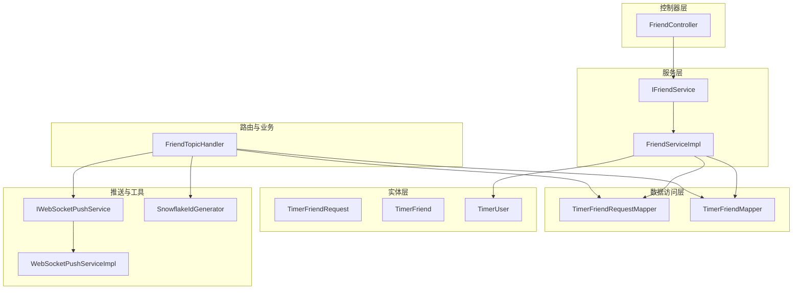
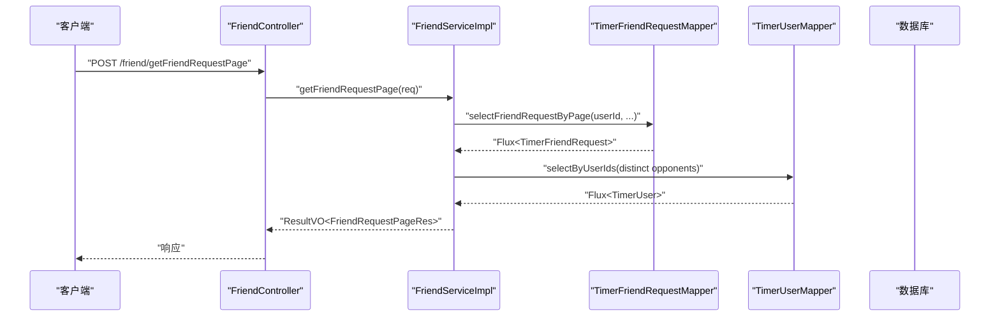
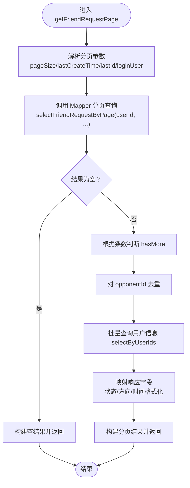
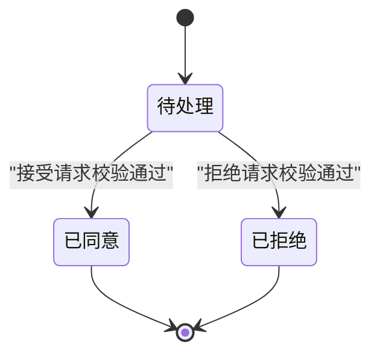
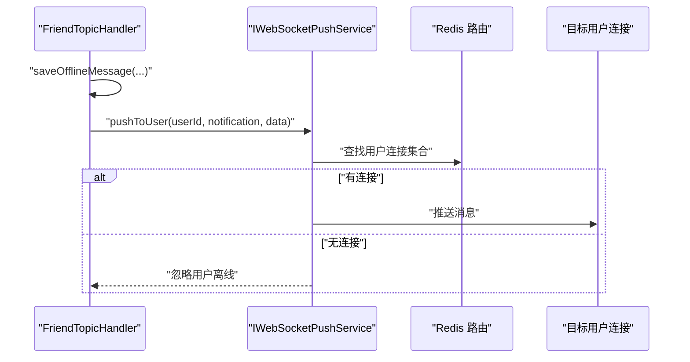
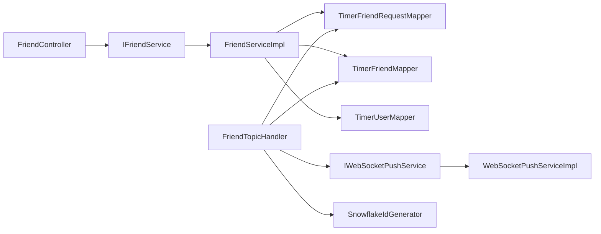

# 好友服务实现

<cite>
**本文引用的文件**
- [FriendServiceImpl.java](file://src/main/java/com/rivers/im/service/impl/FriendServiceImpl.java)
- [IFriendService.java](file://src/main/java/com/rivers/im/service/IFriendService.java)
- [FriendController.java](file://src/main/java/com/rivers/im/controller/FriendController.java)
- [TimerFriendRequest.java](file://src/main/java/com/rivers/im/entity/TimerFriendRequest.java)
- [TimerFriend.java](file://src/main/java/com/rivers/im/entity/TimerFriend.java)
- [TimerUser.java](file://src/main/java/com/rivers/im/entity/TimerUser.java)
- [TimerFriendRequestMapper.java](file://src/main/java/com/rivers/im/mapper/TimerFriendRequestMapper.java)
- [TimerFriendMapper.java](file://src/main/java/com/rivers/im/mapper/TimerFriendMapper.java)
- [FriendTopicHandler.java](file://src/main/java/com/rivers/im/router/FriendTopicHandler.java)
- [IWebSocketPushService.java](file://src/main/java/com/rivers/im/service/IWebSocketPushService.java)
- [WebSocketPushServiceImpl.java](file://src/main/java/com/rivers/im/service/impl/WebSocketPushServiceImpl.java)
- [SnowflakeIdGenerator.java](file://src/main/java/com/rivers/im/util/SnowflakeIdGenerator.java)
- [application.yml](file://src/main/resources/application.yml)
</cite>

## 目录
1. [简介](#简介)
2. [项目结构](#项目结构)
3. [核心组件](#核心组件)
4. [架构总览](#架构总览)
5. [详细组件分析](#详细组件分析)
6. [依赖分析](#依赖分析)
7. [性能考虑](#性能考虑)
8. [故障排查指南](#故障排查指南)
9. [结论](#结论)

## 简介
本文件面向“好友服务”的实现进行深入技术文档化，重点覆盖以下方面：
- FriendServiceImpl 的实现逻辑与数据流
- 好友请求的状态机设计与并发控制
- 好友请求处理的完整链路：从请求创建到状态变更
- 好友关系建立的业务规则与数据一致性保障
- 关键算法说明：去重逻辑、状态转换、异常处理策略
- 性能优化建议与常见问题解决方案

## 项目结构
本项目采用分层与按功能模块组织的结构，其中与好友服务直接相关的关键模块如下：
- 控制器层：FriendController 提供对外接口
- 服务层：IFriendService 与 FriendServiceImpl 实现分页查询好友请求
- 路由与业务处理：FriendTopicHandler 处理 WS 入站消息，完成请求创建、接受、拒绝等操作
- 数据访问层：Reactive R2DBC Mapper 访问数据库
- 实体层：TimerFriendRequest、TimerFriend、TimerUser 映射数据库表
- 推送与工具：IWebSocketPushService/ WebSocketPushServiceImpl、SnowflakeIdGenerator

图表来源
- [FriendController.java:1-28](file://src/main/java/com/rivers/im/controller/FriendController.java#L1-28)
- [IFriendService.java:1-12](file://src/main/java/com/rivers/im/service/IFriendService.java#L1-12)
- [FriendServiceImpl.java:1-106](file://src/main/java/com/rivers/im/service/impl/FriendServiceImpl.java#L1-106)
- [FriendTopicHandler.java:1-261](file://src/main/java/com/rivers/im/router/FriendTopicHandler.java#L1-261)
- [TimerFriendRequestMapper.java:1-68](file://src/main/java/com/rivers/im/mapper/TimerFriendRequestMapper.java#L1-68)
- [TimerFriendMapper.java:1-8](file://src/main/java/com/rivers/im/mapper/TimerFriendMapper.java#L1-8)
- [TimerFriendRequest.java:1-101](file://src/main/java/com/rivers/im/entity/TimerFriendRequest.java#L1-101)
- [TimerFriend.java:1-86](file://src/main/java/com/rivers/im/entity/TimerFriend.java#L1-86)
- [TimerUser.java:1-111](file://src/main/java/com/rivers/im/entity/TimerUser.java#L1-111)
- [IWebSocketPushService.java:1-12](file://src/main/java/com/rivers/im/service/IWebSocketPushService.java#L1-12)
- [WebSocketPushServiceImpl.java:1-74](file://src/main/java/com/rivers/im/service/impl/WebSocketPushServiceImpl.java#L1-74)
- [SnowflakeIdGenerator.java:1-69](file://src/main/java/com/rivers/im/util/SnowflakeIdGenerator.java#L1-69)

章节来源
- [application.yml:1-14](file://src/main/resources/application.yml#L1-14)

## 核心组件
- FriendController：暴露 REST 接口，转发分页查询请求至服务层
- IFriendService/FriendServiceImpl：实现好友请求分页查询，关联用户信息并返回结果
- FriendTopicHandler：处理 WebSocket 入站消息，负责好友请求的创建、接受、拒绝与通知推送
- TimerFriendRequestMapper/TimerFriendMapper：基于 R2DBC 的响应式数据访问
- TimerFriendRequest/TimerFriend/TimerUser：实体映射
- IWebSocketPushService/WebSocketPushServiceImpl：基于 Redis 的推送路由与实时推送
- SnowflakeIdGenerator：全局唯一 ID 生成器

章节来源
- [FriendController.java:1-28](file://src/main/java/com/rivers/im/controller/FriendController.java#L1-28)
- [IFriendService.java:1-12](file://src/main/java/com/rivers/im/service/IFriendService.java#L1-12)
- [FriendServiceImpl.java:1-106](file://src/main/java/com/rivers/im/service/impl/FriendServiceImpl.java#L1-106)
- [FriendTopicHandler.java:1-261](file://src/main/java/com/rivers/im/router/FriendTopicHandler.java#L1-261)
- [TimerFriendRequestMapper.java:1-68](file://src/main/java/com/rivers/im/mapper/TimerFriendRequestMapper.java#L1-68)
- [TimerFriendMapper.java:1-8](file://src/main/java/com/rivers/im/mapper/TimerFriendMapper.java#L1-8)
- [TimerFriendRequest.java:1-101](file://src/main/java/com/rivers/im/entity/TimerFriendRequest.java#L1-101)
- [TimerFriend.java:1-86](file://src/main/java/com/rivers/im/entity/TimerFriend.java#L1-86)
- [TimerUser.java:1-111](file://src/main/java/com/rivers/im/entity/TimerUser.java#L1-111)
- [IWebSocketPushService.java:1-12](file://src/main/java/com/rivers/im/service/IWebSocketPushService.java#L1-12)
- [WebSocketPushServiceImpl.java:1-74](file://src/main/java/com/rivers/im/service/impl/WebSocketPushServiceImpl.java#L1-74)
- [SnowflakeIdGenerator.java:1-69](file://src/main/java/com/rivers/im/util/SnowflakeIdGenerator.java#L1-69)

## 架构总览
好友服务涉及两类主要路径：
- 分页查询路径：HTTP REST → 服务层 → Mapper → 用户信息聚合
- 实时交互路径：WebSocket 入站消息 → 路由处理器 → 数据库写入/更新 → 推送服务

图表来源
- [FriendController.java:23-26](file://src/main/java/com/rivers/im/controller/FriendController.java#L23-26)
- [FriendServiceImpl.java:46-104](file://src/main/java/com/rivers/im/service/impl/FriendServiceImpl.java#L46-104)
- [TimerFriendRequestMapper.java:32-44](file://src/main/java/com/rivers/im/mapper/TimerFriendRequestMapper.java#L32-44)
- [TimerUser.java:1-111](file://src/main/java/com/rivers/im/entity/TimerUser.java#L1-111)

## 详细组件分析

### FriendServiceImpl：分页查询好友请求
- 输入参数：分页大小、上次时间戳、上次记录ID、登录用户
- 查询逻辑：
  - 使用 Mapper 按条件分页查询好友请求记录
  - 若为空则直接返回空结果；否则根据是否达到页大小判断是否有更多
  - 对查询结果去重取对方用户ID，批量查询用户信息
  - 将用户信息映射到响应对象，填充状态与方向描述
- 关键点：
  - 去重使用 distinct，避免重复用户信息
  - 状态与方向通过枚举映射为中文描述
  - 时间格式化统一为字符串

图表来源
- [FriendServiceImpl.java:46-104](file://src/main/java/com/rivers/im/service/impl/FriendServiceImpl.java#L46-104)
- [TimerFriendRequestMapper.java:32-44](file://src/main/java/com/rivers/im/mapper/TimerFriendRequestMapper.java#L32-44)
- [TimerUser.java:1-111](file://src/main/java/com/rivers/im/entity/TimerUser.java#L1-111)

章节来源
- [FriendServiceImpl.java:46-104](file://src/main/java/com/rivers/im/service/impl/FriendServiceImpl.java#L46-104)

### FriendTopicHandler：好友请求生命周期与状态机
- 状态机设计（TimerFriendRequest.Status）：
  - 待处理（PENDING）
  - 已同意（ACCEPTED）
  - 已拒绝（REJECTED）
- 方向（TimerFriendRequest.Direction）：
  - 我发出的（SENT）
  - 我收到的（RECEIVED）
- 生命周期关键流程：
  - 发送请求：写扩散模型，创建两条记录（发送方/接收方），通过 relation_id 绑定，便于批量状态更新
  - 接受请求：校验状态/方向/目标用户，批量更新双方状态，同时在双方各自写入好友关系记录
  - 拒绝请求：校验状态/方向/目标用户，批量更新双方状态
- 并发控制与一致性：
  - 使用 relation_id 在单条 SQL 中批量更新双方状态，减少跨事务复杂度
  - 接受/拒绝时先读取再校验，确保幂等性
  - 推送采用“尽力而为”策略：先持久化离线消息，再尝试实时推送

图表来源
- [TimerFriendRequest.java:54-99](file://src/main/java/com/rivers/im/entity/TimerFriendRequest.java#L54-99)
- [FriendTopicHandler.java:76-205](file://src/main/java/com/rivers/im/router/FriendTopicHandler.java#L76-205)

章节来源
- [FriendTopicHandler.java:72-205](file://src/main/java/com/rivers/im/router/FriendTopicHandler.java#L72-205)
- [TimerFriendRequest.java:54-99](file://src/main/java/com/rivers/im/entity/TimerFriendRequest.java#L54-99)

### 数据一致性与事务管理
- 当前实现采用响应式 R2DBC，未显式声明 Spring 事务管理器，因此：
  - 接受/拒绝场景中，状态更新与好友关系写入并非处于同一数据库事务边界内
  - 通过 relation_id 的批量更新与幂等校验降低不一致风险
- 建议（见“性能考虑”章节）：在需要强一致性的场景引入本地事务或分布式事务框架

章节来源
- [FriendTopicHandler.java:159-167](file://src/main/java/com/rivers/im/router/FriendTopicHandler.java#L159-167)
- [TimerFriendRequestMapper.java:17-19](file://src/main/java/com/rivers/im/mapper/TimerFriendRequestMapper.java#L17-19)

### 推送与通知
- 离线通知持久化：将通知内容写入 timer_message 表，消息类型为系统通知
- 实时推送：通过 WebSocketPushServiceImpl 将消息推送到目标用户
- “尽力而为”策略：推送失败仅记录日志，保证消息最终可达

图表来源
- [FriendTopicHandler.java:210-259](file://src/main/java/com/rivers/im/router/FriendTopicHandler.java#L210-259)
- [WebSocketPushServiceImpl.java:45-74](file://src/main/java/com/rivers/im/service/impl/WebSocketPushServiceImpl.java#L45-74)

章节来源
- [FriendTopicHandler.java:210-259](file://src/main/java/com/rivers/im/router/FriendTopicHandler.java#L210-259)
- [IWebSocketPushService.java:1-12](file://src/main/java/com/rivers/im/service/IWebSocketPushService.java#L1-12)
- [WebSocketPushServiceImpl.java:1-74](file://src/main/java/com/rivers/im/service/impl/WebSocketPushServiceImpl.java#L1-74)

### 关键算法说明
- 去重逻辑：对查询结果的对方用户ID执行去重，减少后续用户查询次数
- 状态转换：通过 relation_id 批量更新双方状态，确保一致性
- 异常处理策略：
  - 参数校验失败：记录告警并快速返回
  - 幂等检查：若请求已处理则跳过
  - 错误恢复：推送失败仅记录日志，不影响主流程

章节来源
- [FriendServiceImpl.java:68-70](file://src/main/java/com/rivers/im/service/impl/FriendServiceImpl.java#L68-70)
- [FriendTopicHandler.java:132-144](file://src/main/java/com/rivers/im/router/FriendTopicHandler.java#L132-144)

## 依赖分析
- 控制器依赖服务接口，服务实现依赖 Mapper 与用户 Mapper
- 路由处理器依赖 Mapper、推送服务与雪花 ID 生成器
- 推送服务依赖本地会话管理与 Redis 模板

图表来源
- [FriendController.java:17-21](file://src/main/java/com/rivers/im/controller/FriendController.java#L17-21)
- [FriendServiceImpl.java:32-43](file://src/main/java/com/rivers/im/service/impl/FriendServiceImpl.java#L32-43)
- [FriendTopicHandler.java:32-51](file://src/main/java/com/rivers/im/router/FriendTopicHandler.java#L32-51)
- [TimerFriendRequestMapper.java:12-44](file://src/main/java/com/rivers/im/mapper/TimerFriendRequestMapper.java#L12-44)
- [TimerFriendMapper.java](file://src/main/java/com/rivers/im/mapper/TimerFriendMapper.java#L6)
- [IWebSocketPushService.java:6-11](file://src/main/java/com/rivers/im/service/IWebSocketPushService.java#L6-11)
- [WebSocketPushServiceImpl.java:22-37](file://src/main/java/com/rivers/im/service/impl/WebSocketPushServiceImpl.java#L22-37)
- [SnowflakeIdGenerator.java:30-59](file://src/main/java/com/rivers/im/util/SnowflakeIdGenerator.java#L30-59)

章节来源
- [FriendController.java:17-21](file://src/main/java/com/rivers/im/controller/FriendController.java#L17-21)
- [FriendServiceImpl.java:32-43](file://src/main/java/com/rivers/im/service/impl/FriendServiceImpl.java#L32-43)
- [FriendTopicHandler.java:32-51](file://src/main/java/com/rivers/im/router/FriendTopicHandler.java#L32-51)

## 性能考虑
- 分页查询优化
  - 使用复合排序与限制条件，避免全表扫描
  - 对对方用户ID去重，减少用户信息查询次数
- 写扩散模型
  - 通过 relation_id 批量更新状态，减少往返次数
  - 接受/拒绝时同时写入双方好友关系，避免后续二次写入
- 推送策略
  - 离线消息持久化与实时推送并行，提升用户体验
  - 推送失败仅记录日志，避免阻塞主流程
- 事务与一致性
  - 当前响应式实现未显式开启事务，建议在需要强一致的场景引入本地事务或分布式事务
- 并发与锁
  - 建议在请求创建阶段增加幂等键（如 relation_id）与唯一约束，防止重复创建
  - 对高频操作可考虑缓存用户基本信息以降低数据库压力

## 故障排查指南
- 常见问题
  - 无法接收到实时通知：检查推送服务是否成功路由到目标用户连接
  - 请求重复创建：确认是否存在重复的 relation_id 或未正确使用去重逻辑
  - 状态不一致：检查批量更新是否成功执行，必要时补充事务或补偿机制
- 日志定位
  - 路由处理器对非法输入与重复操作有明确告警日志
  - 推送服务对离线与失败情况有详细日志输出
- 快速修复
  - 参数校验失败：修正请求参数（目标用户ID、消息内容等）
  - 幂等检查触发：提示请求已处理，无需重复操作
  - 推送失败：确认用户连接状态与推送服务可用性

章节来源
- [FriendTopicHandler.java:76-121](file://src/main/java/com/rivers/im/router/FriendTopicHandler.java#L76-121)
- [FriendTopicHandler.java:126-170](file://src/main/java/com/rivers/im/router/FriendTopicHandler.java#L126-170)
- [FriendTopicHandler.java:175-205](file://src/main/java/com/rivers/im/router/FriendTopicHandler.java#L175-205)
- [WebSocketPushServiceImpl.java:56-74](file://src/main/java/com/rivers/im/service/impl/WebSocketPushServiceImpl.java#L56-74)

## 结论
- FriendServiceImpl 提供了高效的好友请求分页查询能力，结合去重与批量用户查询，具备良好的扩展性
- FriendTopicHandler 通过写扩散模型与 relation_id 批量更新，简化了好友请求的状态流转与一致性保障
- 推送服务采用“尽力而为”策略，在保证可靠性的同时兼顾性能
- 建议在需要强一致性的场景引入事务或补偿机制，并进一步完善幂等与并发控制策略