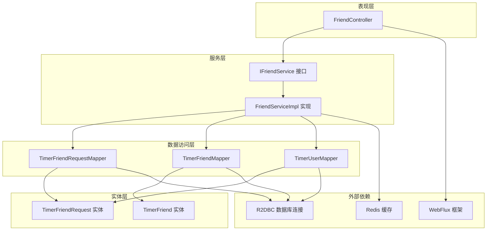
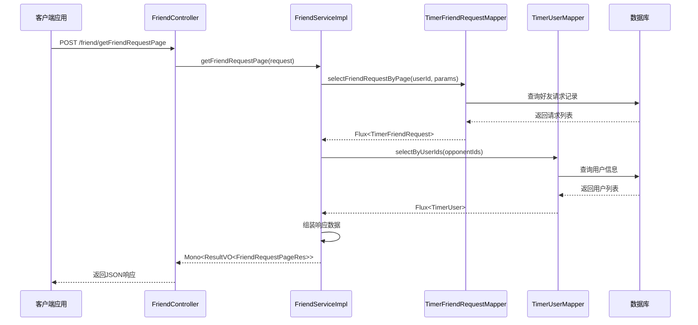
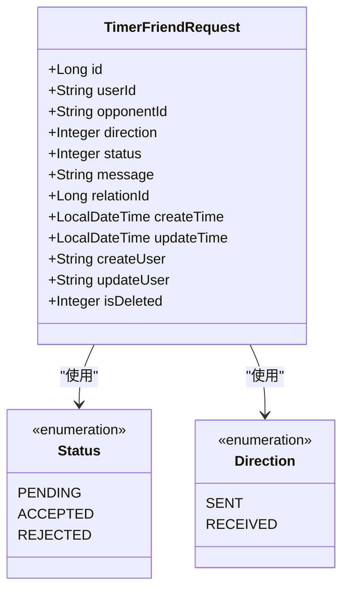
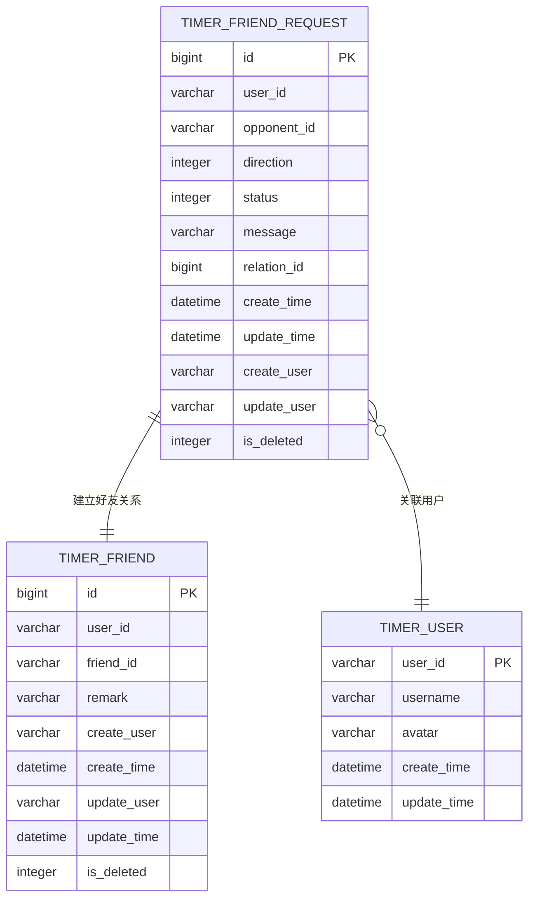
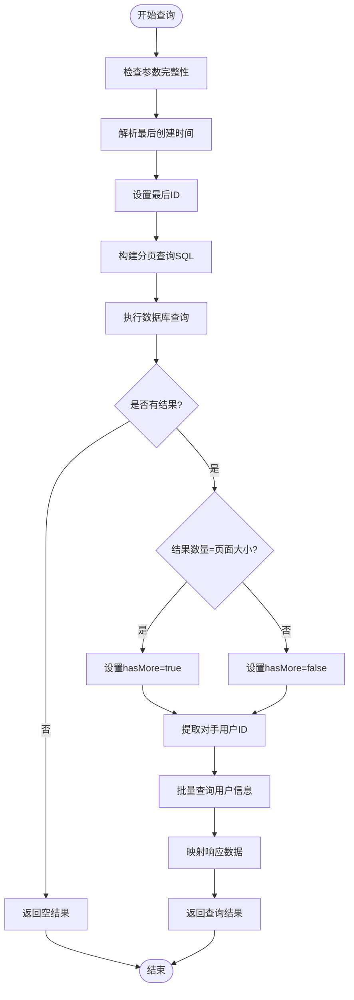
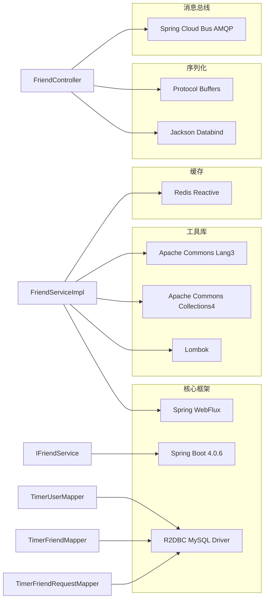

# 好友服务接口

<cite>
**本文档引用的文件**
- [IFriendService.java](file://src/main/java/com/rivers/im/service/IFriendService.java)
- [FriendServiceImpl.java](file://src/main/java/com/rivers/im/service/impl/FriendServiceImpl.java)
- [FriendController.java](file://src/main/java/com/rivers/im/controller/FriendController.java)
- [TimerFriendRequest.java](file://src/main/java/com/rivers/im/entity/TimerFriendRequest.java)
- [TimerFriend.java](file://src/main/java/com/rivers/im/entity/TimerFriend.java)
- [TimerFriendRequestMapper.java](file://src/main/java/com/rivers/im/mapper/TimerFriendRequestMapper.java)
- [TimerFriendMapper.java](file://src/main/java/com/rivers/im/mapper/TimerFriendMapper.java)
- [TimerUserMapper.java](file://src/main/java/com/rivers/im/mapper/TimerUserMapper.java)
- [build.gradle](file://build.gradle)
</cite>

## 目录
1. [简介](#简介)
2. [项目结构](#项目结构)
3. [核心组件](#核心组件)
4. [架构概览](#架构概览)
5. [详细组件分析](#详细组件分析)
6. [依赖关系分析](#依赖关系分析)
7. [性能考虑](#性能考虑)
8. [故障排除指南](#故障排除指南)
9. [结论](#结论)

## 简介

本文档详细介绍了IM服务器中的好友服务接口系统，重点分析了`IFriendService`接口的设计原则和业务抽象。该接口提供了好友请求分页查询的核心功能，采用响应式编程模型，支持异步数据流处理。系统基于Spring WebFlux构建，使用R2DBC进行数据库操作，实现了高性能的实时通信能力。

## 项目结构

好友服务系统采用典型的分层架构设计，包含以下主要层次：

**图表来源**
- [FriendController.java:1-28](file://src/main/java/com/rivers/im/controller/FriendController.java#L1-L28)
- [IFriendService.java:1-12](file://src/main/java/com/rivers/im/service/IFriendService.java#L1-L12)
- [FriendServiceImpl.java:1-106](file://src/main/java/com/rivers/im/service/impl/FriendServiceImpl.java#L1-L106)

**章节来源**
- [build.gradle:31-45](file://build.gradle#L31-L45)

## 核心组件

### IFriendService 接口

`IFriendService`是好友服务的核心接口，目前定义了一个单一职责的方法：`getFriendRequestPage`。该接口采用函数式编程范式，返回`Mono<ResultVO<FriendRequestPageRes>>`类型，体现了响应式编程的特点。

**接口设计特点：**
- **单一职责原则**：专注于好友请求分页查询功能
- **响应式设计**：使用Reactor框架实现非阻塞异步处理
- **类型安全**：通过泛型确保返回类型的正确性
- **可扩展性**：接口定义为未来功能扩展预留空间

### FriendServiceImpl 实现类

`FriendServiceImpl`是接口的具体实现，展现了完整的业务逻辑处理流程：

**核心功能特性：**
- **分页查询优化**：使用时间戳和ID双重条件实现精确分页
- **批量用户信息获取**：通过IN查询减少数据库往返次数
- **状态枚举映射**：将数据库整数状态转换为人类可读描述
- **空值安全处理**：使用Optional避免空指针异常

**章节来源**
- [IFriendService.java:8-11](file://src/main/java/com/rivers/im/service/IFriendService.java#L8-L11)
- [FriendServiceImpl.java:30-43](file://src/main/java/com/rivers/im/service/impl/FriendServiceImpl.java#L30-L43)

## 架构概览

好友服务采用经典的三层架构模式，结合响应式编程的优势：

**图表来源**
- [FriendController.java:23-26](file://src/main/java/com/rivers/im/controller/FriendController.java#L23-L26)
- [FriendServiceImpl.java:46-104](file://src/main/java/com/rivers/im/service/impl/FriendServiceImpl.java#L46-L104)
- [TimerFriendRequestMapper.java:32-44](file://src/main/java/com/rivers/im/mapper/TimerFriendRequestMapper.java#L32-L44)

## 详细组件分析

### 数据模型设计

#### TimerFriendRequest 实体

`TimerFriendRequest`实体设计体现了好友请求的核心属性：

**图表来源**
- [TimerFriendRequest.java:14-101](file://src/main/java/com/rivers/im/entity/TimerFriendRequest.java#L14-L101)

**状态管理机制：**
- **待处理状态**：用户发起请求后的初始状态
- **已同意状态**：被请求用户接受好友申请
- **已拒绝状态**：被请求用户拒绝好友申请

**方向标识：**
- **我发出的**：当前用户向他人发送的好友请求
- **我收到的**：他人向当前用户发送的好友请求

#### TimerFriend 实体

`TimerFriend`实体表示已经建立的好友关系：

**图表来源**
- [TimerFriendRequest.java:14-51](file://src/main/java/com/rivers/im/entity/TimerFriendRequest.java#L14-L51)
- [TimerFriend.java:28-85](file://src/main/java/com/rivers/im/entity/TimerFriend.java#L28-L85)

**章节来源**
- [TimerFriendRequest.java:14-101](file://src/main/java/com/rivers/im/entity/TimerFriendRequest.java#L14-L101)
- [TimerFriend.java:28-85](file://src/main/java/com/rivers/im/entity/TimerFriend.java#L28-L85)

### Mapper 层设计

#### TimerFriendRequestMapper

该Mapper接口负责好友请求的数据库操作：

**核心查询方法：**
- `selectFriendRequestByPage`：实现分页查询功能
- `updateStatusByRelationId`：批量更新状态
- `existsPendingBetweenUsers`：检查是否存在待处理请求

**分页查询算法：**

**图表来源**
- [FriendServiceImpl.java:46-104](file://src/main/java/com/rivers/im/service/impl/FriendServiceImpl.java#L46-L104)
- [TimerFriendRequestMapper.java:32-44](file://src/main/java/com/rivers/im/mapper/TimerFriendRequestMapper.java#L32-L44)

**章节来源**
- [TimerFriendRequestMapper.java:12-44](file://src/main/java/com/rivers/im/mapper/TimerFriendRequestMapper.java#L12-L44)

### 控制器层设计

#### FriendController

控制器层采用RESTful设计原则，提供简洁的HTTP接口：

**接口规范：**
- **URL路径**：`/friend/getFriendRequestPage`
- **HTTP方法**：POST
- **请求体**：FriendRequestPageReq对象
- **响应体**：ResultVO<FriendRequestPageRes>包装的JSON

**错误处理机制：**
- 统一的异常处理策略
- 标准化的响应格式
- 详细的错误信息反馈

**章节来源**
- [FriendController.java:13-27](file://src/main/java/com/rivers/im/controller/FriendController.java#L13-L27)

## 依赖关系分析

### 外部依赖关系

系统采用现代化的技术栈，主要依赖包括：

**图表来源**
- [build.gradle:31-45](file://build.gradle#L31-L45)

### 内部模块耦合度分析

**低耦合设计体现：**
- **接口隔离**：通过IFriendService实现业务与实现分离
- **依赖注入**：使用构造函数注入降低模块间耦合
- **分层清晰**：表现层、服务层、数据访问层职责明确
- **可测试性**：接口设计便于单元测试和集成测试

**潜在改进点：**
- 当前接口过于简化，建议扩展更多好友管理功能
- 可以引入更细粒度的错误码体系
- 考虑添加缓存层提升性能

**章节来源**
- [build.gradle:31-45](file://build.gradle#L31-L45)

## 性能考虑

### 响应式编程优势

系统采用响应式编程模型，在高并发场景下具有显著优势：

**性能特征：**
- **非阻塞I/O**：避免传统阻塞式调用导致的线程等待
- **弹性伸缩**：根据负载自动调整资源使用
- **内存效率**：减少不必要的对象创建和内存占用
- **背压处理**：有效控制数据流速率防止系统过载

### 数据库优化策略

**查询优化：**
- 使用复合索引优化分页查询性能
- 通过IN子句批量查询用户信息减少数据库往返
- 时间戳+ID双重条件确保查询结果的确定性

**连接池管理：**
- 合理配置R2DBC连接池大小
- 实施连接超时和重试机制
- 监控数据库连接使用情况

### 缓存策略

**多级缓存设计：**
- **Redis缓存**：存储热点用户信息和好友关系
- **本地缓存**：减少频繁的数据库查询
- **智能过期**：基于业务规则设置合理的缓存失效时间

## 故障排除指南

### 常见问题诊断

**接口调用失败：**
1. 检查请求参数的完整性和有效性
2. 验证用户身份认证状态
3. 确认网络连接稳定性
4. 查看服务端日志获取详细错误信息

**性能问题排查：**
1. 监控数据库查询响应时间
2. 分析内存使用情况
3. 检查Redis连接状态
4. 评估并发连接数

**数据一致性问题：**
1. 验证事务边界设置
2. 检查幂等性设计
3. 确认分布式锁使用
4. 实施补偿机制

### 错误处理最佳实践

**统一错误码设计：**
- **业务错误码**：00001-09999
- **系统错误码**：10000-19999  
- **网络错误码**：20000-29999
- **参数错误码**：30000-39999

**错误恢复策略：**
- 实施指数退避重试机制
- 提供降级服务方案
- 记录详细的错误追踪信息
- 支持手动干预和恢复操作

**章节来源**
- [FriendServiceImpl.java:46-104](file://src/main/java/com/rivers/im/service/impl/FriendServiceImpl.java#L46-L104)

## 结论

IM服务器的好友服务接口系统展现了现代Java企业级应用的最佳实践。通过采用响应式编程、分层架构和领域驱动设计，系统实现了高性能、可扩展和易维护的特性。

**主要成就：**
- **设计优雅**：接口设计简洁明了，职责单一明确
- **性能优异**：响应式编程模型带来卓越的并发处理能力
- **扩展性强**：良好的架构设计为未来功能扩展奠定基础
- **技术先进**：采用Spring WebFlux、R2DBC等前沿技术栈

**改进建议：**
- 扩展IFriendService接口，增加好友请求的发送、接受、拒绝等功能
- 引入更完善的缓存策略和监控体系
- 实施更细粒度的权限控制和审计日志
- 考虑引入分布式事务处理复杂业务场景

该系统为构建高性能即时通讯应用提供了坚实的技术基础，其设计理念和实现方式值得在类似项目中借鉴和参考。