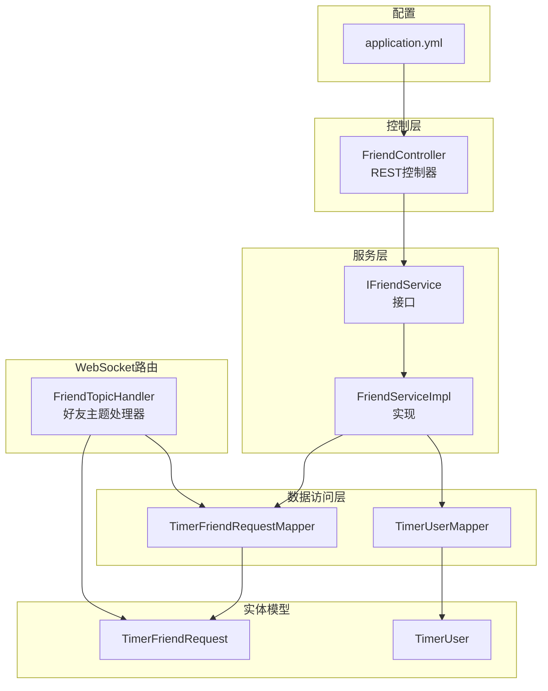
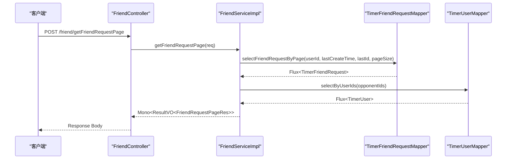
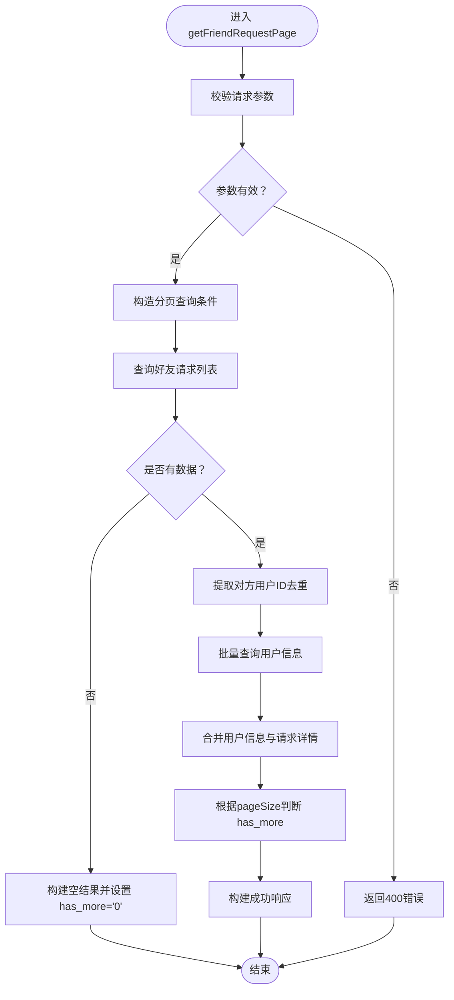
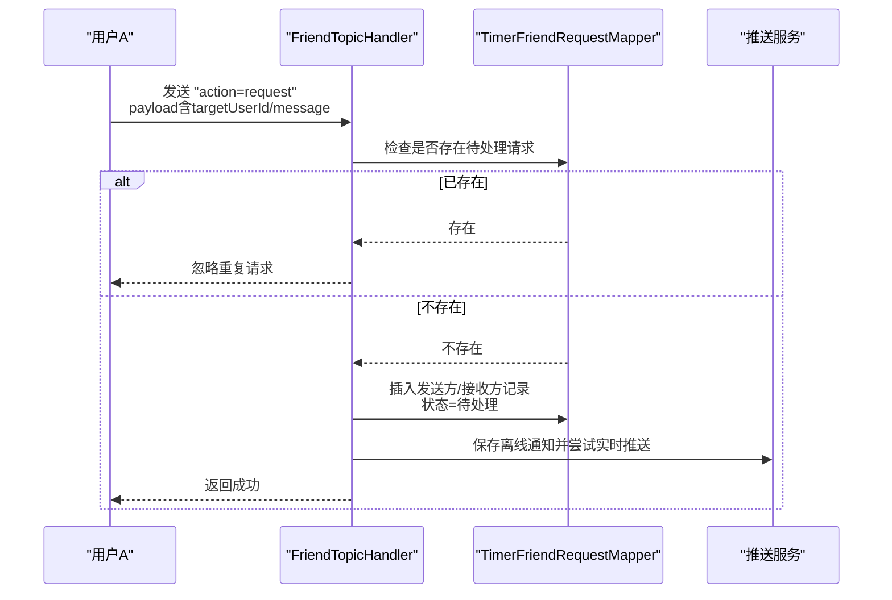
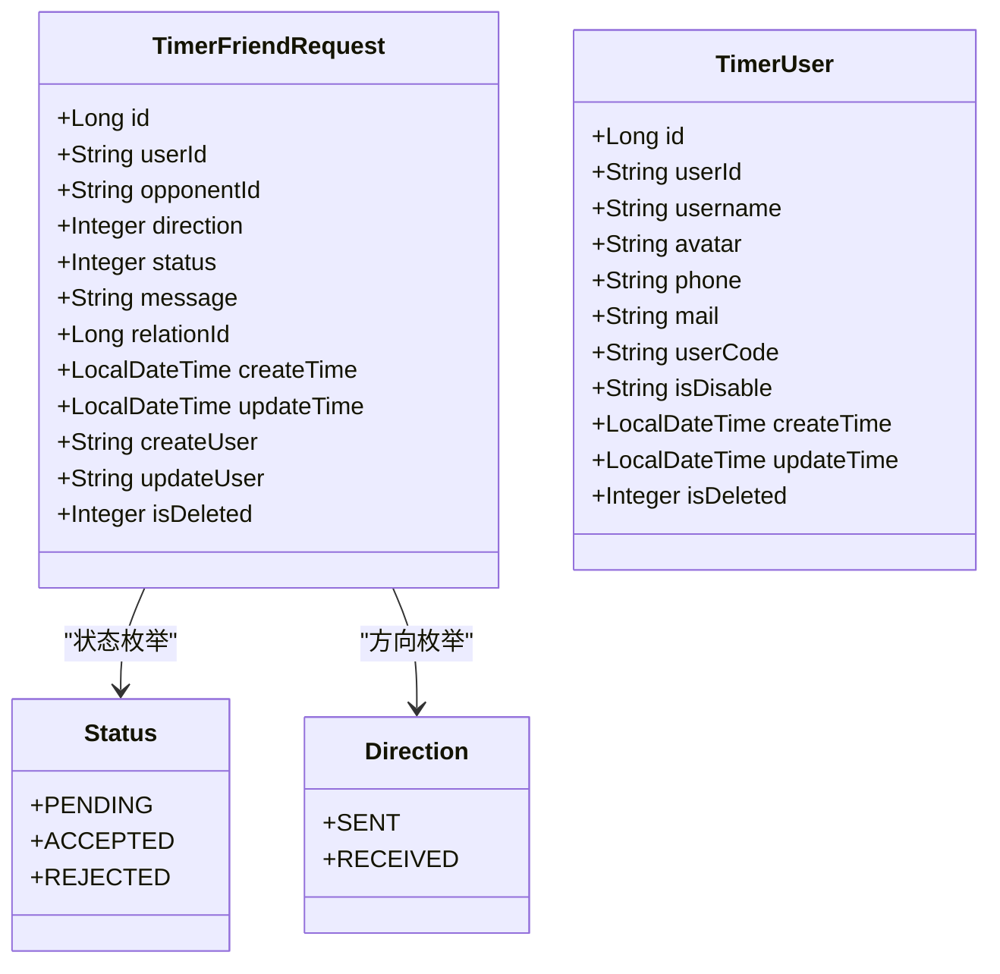
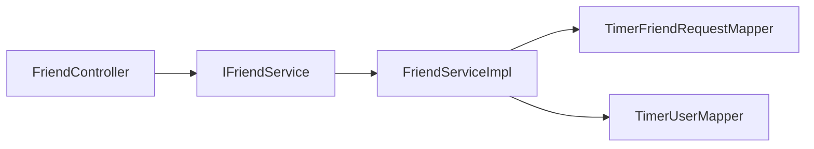

# 好友管理API

<cite>
**本文引用的文件**
- [FriendController.java](file://src/main/java/com/rivers/im/controller/FriendController.java)
- [IFriendService.java](file://src/main/java/com/rivers/im/service/IFriendService.java)
- [FriendServiceImpl.java](file://src/main/java/com/rivers/im/service/impl/FriendServiceImpl.java)
- [FriendTopicHandler.java](file://src/main/java/com/rivers/im/router/FriendTopicHandler.java)
- [TimerFriendRequestMapper.java](file://src/main/java/com/rivers/im/mapper/TimerFriendRequestMapper.java)
- [TimerUserMapper.java](file://src/main/java/com/rivers/im/mapper/TimerUserMapper.java)
- [TimerFriendRequest.java](file://src/main/java/com/rivers/im/entity/TimerFriendRequest.java)
- [TimerUser.java](file://src/main/java/com/rivers/im/entity/TimerUser.java)
- [application.yml](file://src/main/resources/application.yml)
</cite>

## 目录
1. [简介](#简介)
2. [项目结构](#项目结构)
3. [核心组件](#核心组件)
4. [架构总览](#架构总览)
5. [详细组件分析](#详细组件分析)
6. [依赖分析](#依赖分析)
7. [性能考量](#性能考量)
8. [故障排查指南](#故障排查指南)
9. [结论](#结论)
10. [附录](#附录)

## 简介
本文件为“好友管理API”的综合技术文档，聚焦于FriendController提供的REST接口与相关服务实现，覆盖以下方面：
- 接口定义：HTTP方法、URL路径、请求参数、响应格式
- 业务用途与参数校验规则
- 错误码与异常处理策略
- 安全考虑、权限控制与速率限制建议
- 版本管理、向后兼容性与迁移指南
- 调用示例（成功与失败场景）

当前仓库中仅暴露一个REST端点用于分页查询好友请求列表；其余好友相关能力（如发起好友请求、同意/拒绝等）通过WebSocket消息路由实现。

## 项目结构
- 控制层：FriendController 提供REST接口
- 服务层：IFriendService + FriendServiceImpl 实现业务逻辑
- 数据访问层：TimerFriendRequestMapper、TimerUserMapper
- 实体模型：TimerFriendRequest、TimerUser
- WebSocket路由：FriendTopicHandler 处理好友主题消息（请求、同意、拒绝）
- 应用配置：application.yml

图表来源
- [FriendController.java:1-28](file://src/main/java/com/rivers/im/controller/FriendController.java#L1-L28)
- [IFriendService.java:1-12](file://src/main/java/com/rivers/im/service/IFriendService.java#L1-L12)
- [FriendServiceImpl.java:1-106](file://src/main/java/com/rivers/im/service/impl/FriendServiceImpl.java#L1-L106)
- [TimerFriendRequestMapper.java:1-68](file://src/main/java/com/rivers/im/mapper/TimerFriendRequestMapper.java#L1-L68)
- [TimerUserMapper.java:1-18](file://src/main/java/com/rivers/im/mapper/TimerUserMapper.java#L1-L18)
- [TimerFriendRequest.java:1-101](file://src/main/java/com/rivers/im/entity/TimerFriendRequest.java#L1-L101)
- [TimerUser.java:1-111](file://src/main/java/com/rivers/im/entity/TimerUser.java#L1-L111)
- [application.yml:1-14](file://src/main/resources/application.yml#L1-L14)

章节来源
- [FriendController.java:1-28](file://src/main/java/com/rivers/im/controller/FriendController.java#L1-L28)
- [application.yml:1-14](file://src/main/resources/application.yml#L1-L14)

## 核心组件
- FriendController：对外暴露REST接口，当前仅提供“分页获取好友请求”能力
- IFriendService：声明式服务接口
- FriendServiceImpl：实现分页查询、用户信息聚合、结果封装
- TimerFriendRequestMapper：基于R2DBC的响应式查询，支持按时间+ID降序分页
- TimerUserMapper：批量查询用户基础信息（头像、昵称等）
- TimerFriendRequest/TimerUser：领域实体，承载数据库字段映射与枚举状态/方向

章节来源
- [FriendController.java:1-28](file://src/main/java/com/rivers/im/controller/FriendController.java#L1-L28)
- [IFriendService.java:1-12](file://src/main/java/com/rivers/im/service/IFriendService.java#L1-L12)
- [FriendServiceImpl.java:1-106](file://src/main/java/com/rivers/im/service/impl/FriendServiceImpl.java#L1-L106)
- [TimerFriendRequestMapper.java:1-68](file://src/main/java/com/rivers/im/mapper/TimerFriendRequestMapper.java#L1-L68)
- [TimerUserMapper.java:1-18](file://src/main/java/com/rivers/im/mapper/TimerUserMapper.java#L1-L18)
- [TimerFriendRequest.java:1-101](file://src/main/java/com/rivers/im/entity/TimerFriendRequest.java#L1-L101)
- [TimerUser.java:1-111](file://src/main/java/com/rivers/im/entity/TimerUser.java#L1-L111)

## 架构总览
下图展示从REST到服务再到数据访问的整体链路，以及WebSocket消息路由对好友请求生命周期的补充。

图表来源
- [FriendController.java:23-26](file://src/main/java/com/rivers/im/controller/FriendController.java#L23-L26)
- [FriendServiceImpl.java:46-104](file://src/main/java/com/rivers/im/service/impl/FriendServiceImpl.java#L46-L104)
- [TimerFriendRequestMapper.java:32-44](file://src/main/java/com/rivers/im/mapper/TimerFriendRequestMapper.java#L32-L44)
- [TimerUserMapper.java:13-16](file://src/main/java/com/rivers/im/mapper/TimerUserMapper.java#L13-L16)

## 详细组件分析

### REST接口：分页获取好友请求
- HTTP方法：POST
- URL路径：/friend/getFriendRequestPage
- 功能描述：按时间倒序分页拉取当前登录用户的待处理/历史好友请求，并返回对应对方用户的基础信息（头像、昵称等），同时标注请求状态与方向（我发出的/我收到的）。
- 请求体参数（FriendRequestPageReq）
  - login_user.user_id：当前登录用户ID（必填）
  - page_size：每页条数（必填，建议10~50）
  - last_create_time：上次最后一条记录的创建时间（可选，格式：yyyy-MM-dd HH:mm:ss；为空表示从最新开始）
  - last_id：上次最后一条记录的自增ID（可选；为0表示从最新开始）
- 响应体（ResultVO<FriendRequestPageRes>）
  - has_more：是否还有下一页（字符串："1" 或 "0"）
  - friend_requests[]：请求明细数组
    - friend_id：对方用户ID
    - friend_name：对方用户名
    - friend_avatar：对方头像
    - remark：附言/验证消息
    - status：状态描述（待处理/已同意/已拒绝）
    - direction：方向描述（我发出的/我收到的）
    - update_time：该记录的更新时间（yyyy-MM-dd HH:mm:ss）
- 参数校验规则
  - login_user.user_id 必填且非空
  - page_size 必须为正整数，建议合理范围（如10~100）
  - last_create_time 仅在传入时需符合指定格式
  - last_id 仅在传入时需为非负整数
- 错误码与异常
  - 400：请求参数缺失或格式不正确
  - 500：服务内部异常（数据库查询、序列化等）
  - 200：成功，但has_more可能为"0"表示无更多数据
- 成功示例
  - 请求：包含login_user.user_id、page_size、可选last_create_time与last_id
  - 响应：ResultVO.success，包含has_more与friend_requests列表
- 失败示例
  - 参数缺失：返回400
  - 查询异常：返回500
  - 无数据：返回200，has_more="0"，friend_requests为空数组

图表来源
- [FriendServiceImpl.java:46-104](file://src/main/java/com/rivers/im/service/impl/FriendServiceImpl.java#L46-L104)
- [TimerFriendRequestMapper.java:32-44](file://src/main/java/com/rivers/im/mapper/TimerFriendRequestMapper.java#L32-L44)
- [TimerUserMapper.java:13-16](file://src/main/java/com/rivers/im/mapper/TimerUserMapper.java#L13-L16)

章节来源
- [FriendController.java:23-26](file://src/main/java/com/rivers/im/controller/FriendController.java#L23-L26)
- [FriendServiceImpl.java:46-104](file://src/main/java/com/rivers/im/service/impl/FriendServiceImpl.java#L46-L104)
- [TimerFriendRequestMapper.java:32-44](file://src/main/java/com/rivers/im/mapper/TimerFriendRequestMapper.java#L32-L44)
- [TimerUserMapper.java:13-16](file://src/main/java/com/rivers/im/mapper/TimerUserMapper.java#L13-L16)

### WebSocket消息路由：好友请求生命周期
- 主题：friend
- 支持动作：
  - request：发起好友请求
  - accept：同意好友请求
  - reject：拒绝好友请求
- 行为要点
  - request：若存在重复请求则忽略；否则创建发送方/接收方两条记录，设置状态为“待处理”，并尝试推送离线通知
  - accept/reject：按relation_id批量更新双方记录状态，记录日志并推送通知
  - 未知动作：记录告警并丢弃
- 与REST接口的关系
  - REST仅负责“查看/分页获取”请求列表
  - WebSocket负责“发起/处理”请求

图表来源
- [FriendTopicHandler.java:59-104](file://src/main/java/com/rivers/im/router/FriendTopicHandler.java#L59-L104)
- [TimerFriendRequestMapper.java:24-29](file://src/main/java/com/rivers/im/mapper/TimerFriendRequestMapper.java#L24-L29)

章节来源
- [FriendTopicHandler.java:59-104](file://src/main/java/com/rivers/im/router/FriendTopicHandler.java#L59-L104)
- [TimerFriendRequestMapper.java:24-29](file://src/main/java/com/rivers/im/mapper/TimerFriendRequestMapper.java#L24-L29)

### 数据模型与枚举
- TimerFriendRequest
  - 字段：user_id、opponent_id、direction、status、message、relation_id、create_time、update_time、create_user、update_user、is_deleted
  - 枚举：Status（PENDING=0、ACCEPTED=1、REJECTED=2）、Direction（SENT=1、RECEIVED=2）
- TimerUser
  - 字段：user_id、username、avatar、phone、mail、user_code、is_disable、create_time、update_time、is_deleted

图表来源
- [TimerFriendRequest.java:14-101](file://src/main/java/com/rivers/im/entity/TimerFriendRequest.java#L14-L101)
- [TimerUser.java:23-111](file://src/main/java/com/rivers/im/entity/TimerUser.java#L23-L111)

章节来源
- [TimerFriendRequest.java:14-101](file://src/main/java/com/rivers/im/entity/TimerFriendRequest.java#L14-L101)
- [TimerUser.java:23-111](file://src/main/java/com/rivers/im/entity/TimerUser.java#L23-L111)

## 依赖分析
- 控制器依赖服务接口，服务实现依赖两个Mapper
- Mapper基于R2DBC响应式接口，查询采用时间+ID复合排序与LIMIT分页
- 用户信息通过批量查询聚合，减少N+1查询风险

图表来源
- [FriendController.java:17-21](file://src/main/java/com/rivers/im/controller/FriendController.java#L17-L21)
- [FriendServiceImpl.java:32-43](file://src/main/java/com/rivers/im/service/impl/FriendServiceImpl.java#L32-L43)
- [TimerFriendRequestMapper.java:1-7](file://src/main/java/com/rivers/im/mapper/TimerFriendRequestMapper.java#L1-L7)
- [TimerUserMapper.java:1-6](file://src/main/java/com/rivers/im/mapper/TimerUserMapper.java#L1-L6)

章节来源
- [FriendController.java:17-21](file://src/main/java/com/rivers/im/controller/FriendController.java#L17-L21)
- [FriendServiceImpl.java:32-43](file://src/main/java/com/rivers/im/service/impl/FriendServiceImpl.java#L32-L43)
- [TimerFriendRequestMapper.java:1-7](file://src/main/java/com/rivers/im/mapper/TimerFriendRequestMapper.java#L1-L7)
- [TimerUserMapper.java:1-6](file://src/main/java/com/rivers/im/mapper/TimerUserMapper.java#L1-L6)

## 性能考量
- 分页查询优化
  - 使用复合索引（create_time, id）与LIMIT，避免全表扫描
  - last_create_time与last_id作为游标，降低偏移量过大带来的性能问题
- N+1查询规避
  - 先收集opponent_id去重，再一次性批量查询用户信息
- 异步与背压
  - 基于Reactor的Flux/Mono，充分利用响应式流的背压与异步特性
- 数据库连接与事务
  - R2DBC为非阻塞IO，注意避免长事务与大结果集

[本节为通用性能建议，不直接分析具体文件]

## 故障排查指南
- 常见错误与定位
  - 参数校验失败：检查请求体字段是否完整、格式是否正确
  - 数据库查询异常：关注Mapper层SQL与参数绑定
  - 用户信息缺失：确认TimerUser表中是否存在对应记录
- 日志与可观测性
  - 服务层与路由层均输出关键日志，便于定位问题
- 临时解决方案
  - 对于分页末尾has_more="0"属于正常现象，无需特殊处理
  - WebSocket路由遇到未知action会记录告警并忽略，属预期行为

章节来源
- [FriendServiceImpl.java:60-65](file://src/main/java/com/rivers/im/service/impl/FriendServiceImpl.java#L60-L65)
- [FriendTopicHandler.java:65-69](file://src/main/java/com/rivers/im/router/FriendTopicHandler.java#L65-L69)

## 结论
- 当前REST接口仅覆盖“分页查看好友请求”，其余好友交互（发起、同意、拒绝）通过WebSocket消息路由完成
- 服务层通过响应式编程与批量查询提升性能与稳定性
- 建议在网关层增加统一鉴权与限流策略，确保接口安全与稳定性

[本节为总结性内容，不直接分析具体文件]

## 附录

### API调用示例

- 成功场景
  - 请求
    - 方法：POST
    - 路径：/friend/getFriendRequestPage
    - 请求体：包含login_user.user_id、page_size，可选last_create_time与last_id
  - 响应
    - 状态码：200
    - body：ResultVO.success，包含has_more与friend_requests数组

- 失败场景
  - 参数缺失
    - 状态码：400
    - body：ResultVO.error
  - 无数据
    - 状态码：200
    - body：ResultVO.success，has_more="0"，friend_requests为空数组
  - 服务器异常
    - 状态码：500
    - body：ResultVO.error

### 安全考虑与权限控制
- 当前REST接口未显式进行鉴权校验，建议在网关或过滤器中接入统一鉴权（如JWT、会话校验）
- WebSocket握手通过ticket机制进行鉴权，ticket由独立服务生成并存储于Redis，建议结合超时与幂等策略

章节来源
- [application.yml:13-14](file://src/main/resources/application.yml#L13-L14)
- [FriendTopicHandler.java:59-69](file://src/main/java/com/rivers/im/router/FriendTopicHandler.java#L59-L69)

### 速率限制策略
- 建议在网关层针对/friend/getFriendRequestPage设置QPS/并发限制
- WebSocket层面可结合Redis对同一用户连接数与消息频率做限制

[本节为通用建议，不直接分析具体文件]

### API版本管理、兼容性与迁移
- 版本管理
  - 建议在URL中引入版本号，如/friend/v1/getFriendRequestPage
- 向后兼容
  - 新增字段采用可选策略，避免破坏既有客户端
- 迁移指南
  - 若新增字段，先双写兼容一段时间，再逐步替换旧字段
  - WebSocket消息结构变更需同步通知客户端并提供过渡期

[本节为通用建议，不直接分析具体文件]