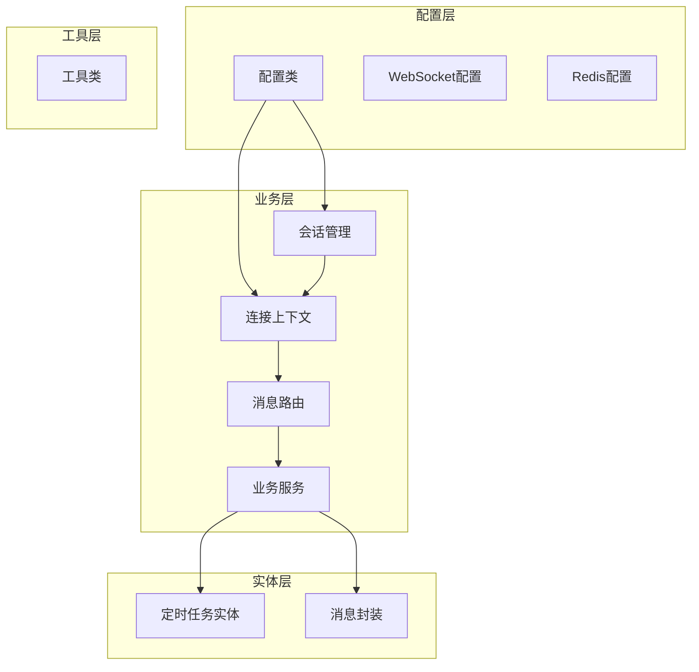
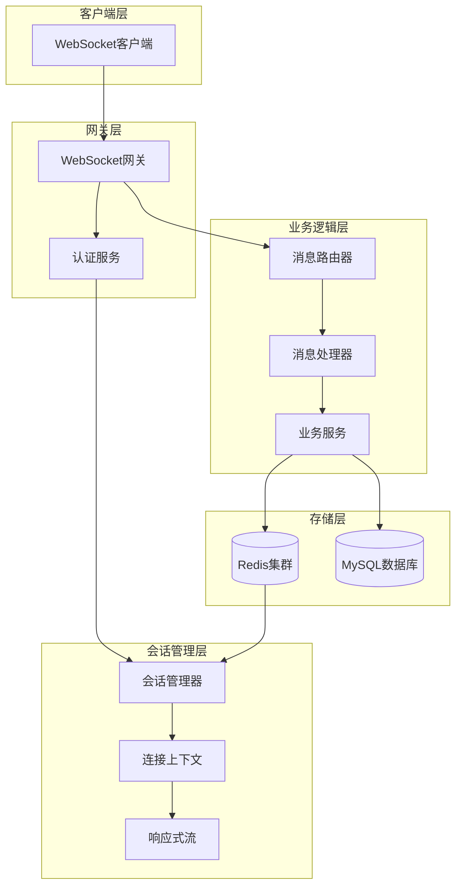
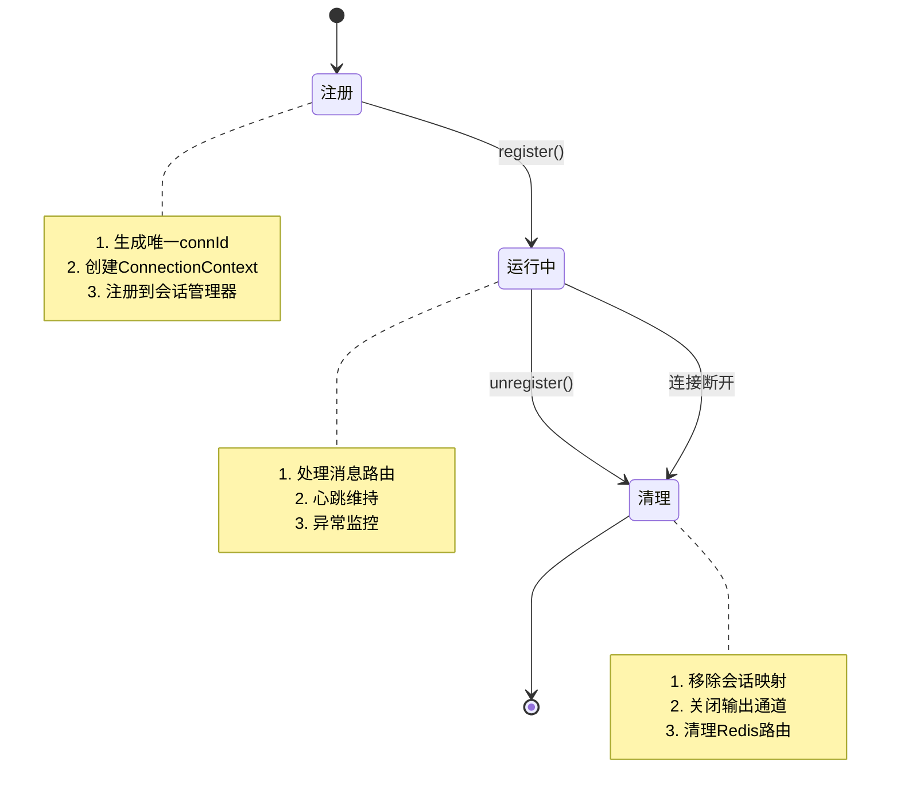
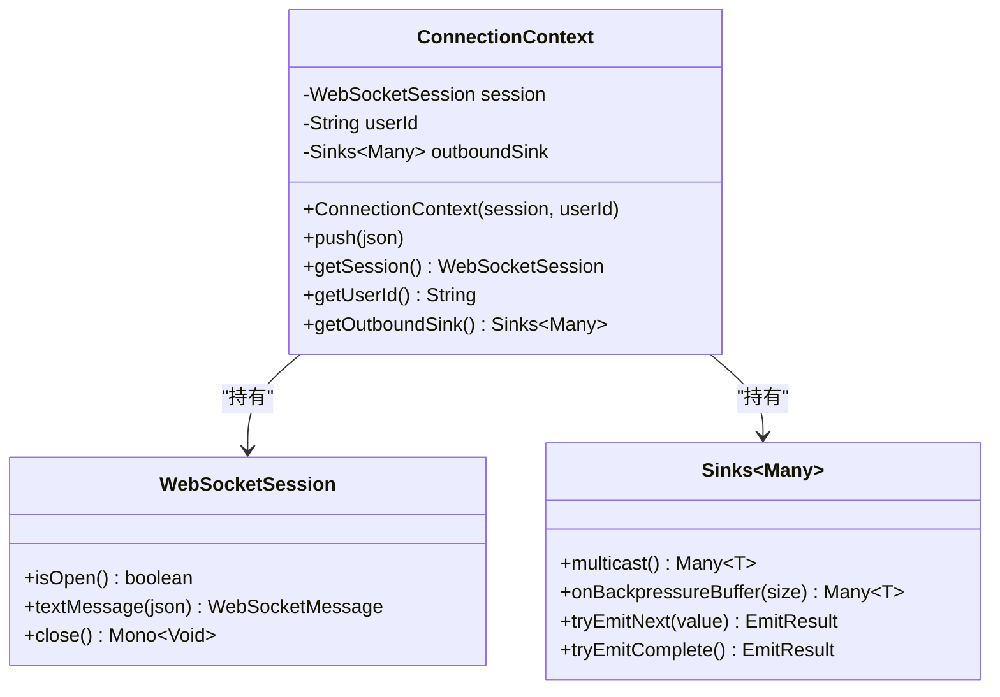
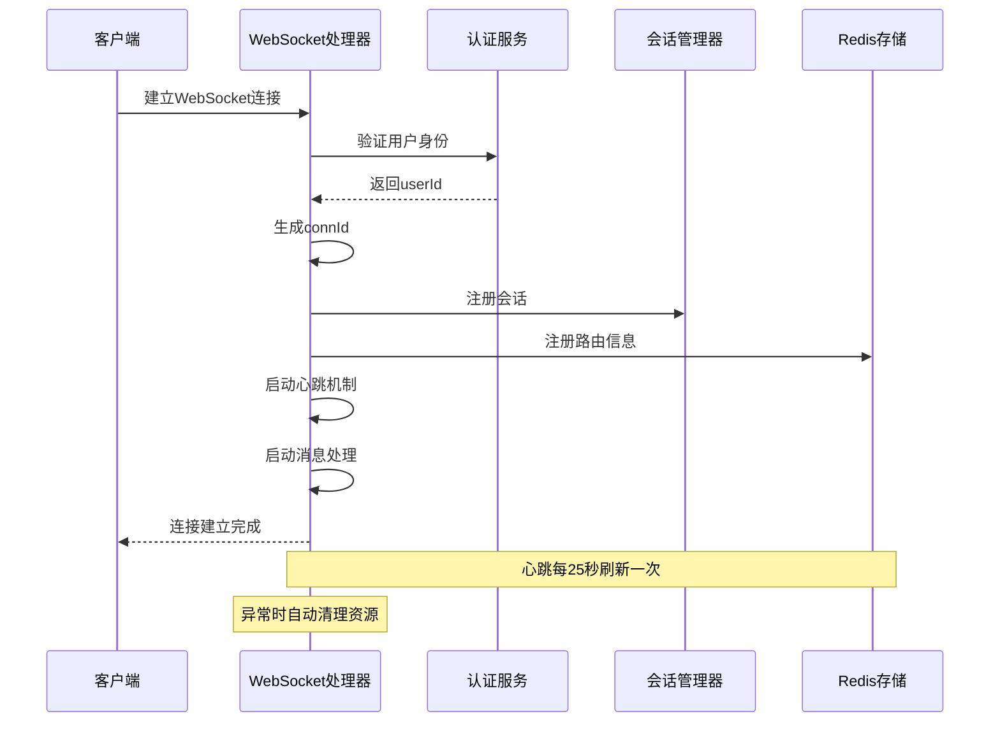
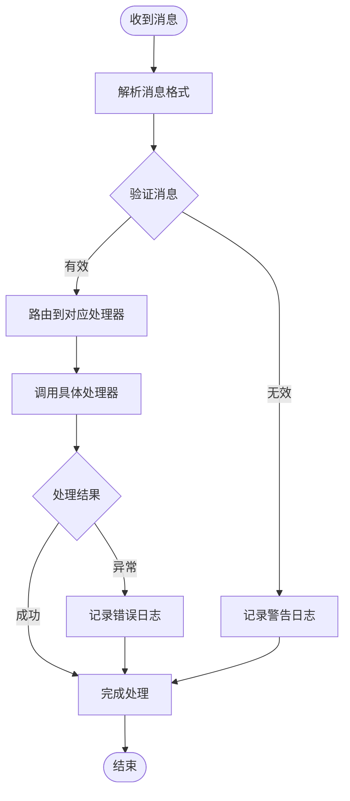
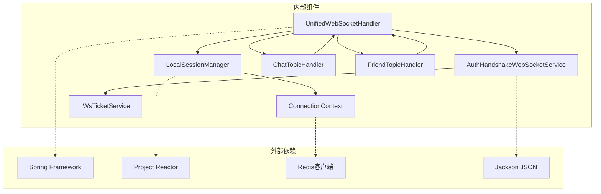

# 会话管理系统

<cite>
**本文档引用的文件**
- [ConnectionContext.java](file://src/main/java/com/rivers/im/context/ConnectionContext.java)
- [LocalSessionManager.java](file://src/main/java/com/rivers/im/manage/LocalSessionManager.java)
- [UnifiedWebSocketHandler.java](file://src/main/java/com/rivers/im/config/UnifiedWebSocketHandler.java)
- [WebSocketConfig.java](file://src/main/java/com/rivers/im/config/WebSocketConfig.java)
- [AuthHandshakeWebSocketService.java](file://src/main/java/com/rivers/im/service/impl/AuthHandshakeWebSocketService.java)
- [TopicHandler.java](file://src/main/java/com/rivers/im/router/TopicHandler.java)
- [ChatTopicHandler.java](file://src/main/java/com/rivers/im/router/ChatTopicHandler.java)
- [FriendTopicHandler.java](file://src/main/java/com/rivers/im/router/FriendTopicHandler.java)
- [WsEnvelope.java](file://src/main/java/com/rivers/im/record/WsEnvelope.java)
- [IWsTicketService.java](file://src/main/java/com/rivers/im/service/IWsTicketService.java)
- [application.yml](file://src/main/resources/application.yml)
</cite>

## 目录
1. [简介](#简介)
2. [项目结构](#项目结构)
3. [核心组件](#核心组件)
4. [架构概览](#架构概览)
5. [详细组件分析](#详细组件分析)
6. [依赖关系分析](#依赖关系分析)
7. [性能考虑](#性能考虑)
8. [故障排查指南](#故障排查指南)
9. [结论](#结论)

## 简介
本项目是一个基于Spring WebFlux的即时通讯服务器，采用响应式编程模型构建。系统实现了完整的会话管理机制，包括本地会话管理、连接上下文设计、消息路由分发以及跨节点通信支持。本文档将深入分析LocalSessionManager的本地会话管理机制、ConnectionContext连接上下文的设计理念，以及会话状态的生命周期管理策略。

## 项目结构
项目采用模块化的MVC架构，主要包含以下核心包结构：

**图表来源**
- [WebSocketConfig.java:1-35](file://src/main/java/com/rivers/im/config/WebSocketConfig.java#L1-L35)
- [LocalSessionManager.java:1-43](file://src/main/java/com/rivers/im/manage/LocalSessionManager.java#L1-L43)
- [ConnectionContext.java:1-24](file://src/main/java/com/rivers/im/context/ConnectionContext.java#L1-L24)

**章节来源**
- [application.yml:1-14](file://src/main/resources/application.yml#L1-L14)

## 核心组件
系统的核心组件围绕响应式编程模型构建，主要包括：

### 会话管理组件
- **LocalSessionManager**: 本地会话管理器，负责会话的注册、注销和消息推送
- **ConnectionContext**: 连接上下文，封装WebSocket会话、用户标识和输出通道
- **UnifiedWebSocketHandler**: 统一WebSocket处理器，处理连接建立、消息路由和清理工作

### 消息处理组件
- **TopicHandler接口**: 消息处理器接口，定义统一的消息处理规范
- **具体处理器**: 包括聊天消息处理器和好友关系处理器
- **WsEnvelope**: 消息封装对象，包含topic、msgId和payload

### 认证授权组件
- **AuthHandshakeWebSocketService**: WebSocket握手认证服务
- **IWsTicketService**: 令牌服务接口，提供票据验证功能

**章节来源**
- [LocalSessionManager.java:10-43](file://src/main/java/com/rivers/im/manage/LocalSessionManager.java#L10-L43)
- [ConnectionContext.java:7-24](file://src/main/java/com/rivers/im/context/ConnectionContext.java#L7-L24)
- [UnifiedWebSocketHandler.java:35-181](file://src/main/java/com/rivers/im/config/UnifiedWebSocketHandler.java#L35-L181)

## 架构概览
系统采用分布式架构设计，结合Redis实现跨节点通信：

**图表来源**
- [UnifiedWebSocketHandler.java:87-122](file://src/main/java/com/rivers/im/config/UnifiedWebSocketHandler.java#L87-L122)
- [LocalSessionManager.java:14-43](file://src/main/java/com/rivers/im/manage/LocalSessionManager.java#L14-L43)
- [AuthHandshakeWebSocketService.java:22-55](file://src/main/java/com/rivers/im/service/impl/AuthHandshakeWebSocketService.java#L22-L55)

## 详细组件分析

### LocalSessionManager本地会话管理机制

LocalSessionManager是系统的核心组件，负责管理所有活跃的WebSocket连接会话：

#### 数据结构设计
- 使用ConcurrentHashMap存储连接映射，键为connId，值为ConnectionContext
- 提供线程安全的并发访问能力
- 支持高并发场景下的快速查找和更新操作

#### 会话生命周期管理

**图表来源**
- [LocalSessionManager.java:17-42](file://src/main/java/com/rivers/im/manage/LocalSessionManager.java#L17-L42)

#### 核心方法分析

**register方法**：
- 负责新会话的注册和初始化
- 将connId与ConnectionContext建立映射关系
- 支持幂等性设计，避免重复注册

**unregister方法**：
- 安全地移除会话并进行资源清理
- 通过outboundSink的tryEmitComplete()通知下游停止发送
- 防止内存泄漏和资源占用

**pushToLocal方法**：
- 实现线程安全的本地消息推送
- 包含连接状态检查，避免向已关闭的连接发送消息
- 提供调试日志，便于问题排查

**章节来源**
- [LocalSessionManager.java:14-43](file://src/main/java/com/rivers/im/manage/LocalSessionManager.java#L14-L43)

### ConnectionContext连接上下文设计理念

ConnectionContext作为会话的核心载体，设计了简洁而高效的结构：

#### 核心属性设计

**图表来源**
- [ConnectionContext.java:8-24](file://src/main/java/com/rivers/im/context/ConnectionContext.java#L8-L24)

#### 设计特点分析

**响应式流设计**：
- 使用Reactor的Sinks.Many实现多播响应式流
- 采用背压缓冲策略，支持1024个元素的缓冲区
- 确保线程安全和异步处理能力

**连接状态管理**：
- 直接持有WebSocketSession实例
- 通过session.isOpen()状态判断连接有效性
- 支持动态状态检测和及时清理

**用户标识管理**：
- 存储userId信息，便于会话关联和路由
- 与Redis路由表配合实现跨节点定位
- 支持用户级别的消息推送

**章节来源**
- [ConnectionContext.java:7-24](file://src/main/java/com/rivers/im/context/ConnectionContext.java#L7-L24)

### UnifiedWebSocketHandler统一处理流程

UnifiedWebSocketHandler作为WebSocket的统一入口，实现了完整的连接生命周期管理：

#### 连接建立流程

**图表来源**
- [UnifiedWebSocketHandler.java:87-122](file://src/main/java/com/rivers/im/config/UnifiedWebSocketHandler.java#L87-L122)

#### 消息处理流程

**图表来源**
- [UnifiedWebSocketHandler.java:124-138](file://src/main/java/com/rivers/im/config/UnifiedWebSocketHandler.java#L124-L138)

#### 资源清理机制
- 使用doFinally回调确保连接断开时的资源清理
- 自动移除Redis中的路由信息
- 关闭响应式流通道，防止内存泄漏
- 记录详细的清理日志，便于运维监控

**章节来源**
- [UnifiedWebSocketHandler.java:87-181](file://src/main/java/com/rivers/im/config/UnifiedWebSocketHandler.java#L87-L181)

### TopicHandler消息路由机制

系统采用插件化的消息路由设计，支持多种消息类型的处理：

#### 接口设计
TopicHandler接口定义了统一的消息处理规范：
- getTopic(): 返回消息主题标识
- handleInbound(): 处理入站消息的核心方法
- 支持响应式编程模型，返回Mono<Void>

#### 具体实现分析

**ChatTopicHandler聊天消息处理器**：
- 处理用户间的即时聊天消息
- 支持单聊和群聊场景
- 实现双向推送，同时向发送方和接收方发送确认消息

**FriendTopicHandler好友关系处理器**：
- 实现完整的好友关系生命周期管理
- 支持好友请求、接受、拒绝等操作
- 采用写扩散模型，通过relation_id实现双向状态同步
- 提供离线通知持久化和实时推送的混合策略

**章节来源**
- [TopicHandler.java:7-14](file://src/main/java/com/rivers/im/router/TopicHandler.java#L7-L14)
- [ChatTopicHandler.java:14-51](file://src/main/java/com/rivers/im/router/ChatTopicHandler.java#L14-L51)
- [FriendTopicHandler.java:24-261](file://src/main/java/com/rivers/im/router/FriendTopicHandler.java#L24-L261)

## 依赖关系分析

系统采用松耦合的依赖注入设计，各组件间通过接口进行交互：

**图表来源**
- [UnifiedWebSocketHandler.java:40-65](file://src/main/java/com/rivers/im/config/UnifiedWebSocketHandler.java#L40-L65)
- [LocalSessionManager.java:3-6](file://src/main/java/com/rivers/im/manage/LocalSessionManager.java#L3-L6)

### 关键依赖特性

**响应式编程模型**：
- 全面采用Reactor响应式编程范式
- 支持背压处理和异步流式处理
- 实现非阻塞的高性能网络通信

**依赖注入配置**：
- 使用Spring的构造函数注入，确保线程安全
- 避免循环依赖问题
- 支持组件的自动装配和生命周期管理

**接口隔离原则**：
- 通过接口定义清晰的职责边界
- 支持组件的替换和扩展
- 便于单元测试和集成测试

**章节来源**
- [WebSocketConfig.java:14-35](file://src/main/java/com/rivers/im/config/WebSocketConfig.java#L14-L35)
- [AuthHandshakeWebSocketService.java:22-55](file://src/main/java/com/rivers/im/service/impl/AuthHandshakeWebSocketService.java#L22-L55)

## 性能考虑

### 并发性能优化

**会话管理优化**：
- 使用ConcurrentHashMap实现O(1)的查找复杂度
- 采用原子操作减少锁竞争
- 支持高并发场景下的快速会话注册和注销

**消息处理优化**：
- 响应式流式处理，避免阻塞操作
- 背压机制防止消息积压导致内存溢出
- 异步处理提升整体吞吐量

**内存管理策略**：
- 及时清理断开连接的会话资源
- 使用有限大小的缓冲区控制内存使用
- 避免长生命周期的对象持有短生命周期的数据

### 网络性能优化

**连接池管理**：
- 复用WebSocket连接，减少连接建立开销
- 实现连接池的动态调整机制
- 支持连接的健康检查和自动重连

**消息压缩**：
- 对JSON消息进行必要的压缩处理
- 支持二进制消息传输以提高效率
- 实现消息的批量发送优化

**缓存策略**：
- 利用Redis缓存用户路由信息
- 实现热点数据的本地缓存
- 支持缓存的失效和更新机制

### 监控和诊断

**性能指标收集**：
- 记录会话数量、消息处理速率等关键指标
- 监控内存使用情况和垃圾回收频率
- 分析连接建立和断开的统计信息

**异常处理机制**：
- 实现全面的异常捕获和处理
- 提供详细的错误日志和堆栈信息
- 支持异常的分类统计和告警

## 故障排查指南

### 常见问题诊断

**连接建立失败**：
- 检查认证服务是否正常工作
- 验证ticket的有效性和时效性
- 确认WebSocket握手参数的正确性

**消息处理异常**：
- 查看消息格式是否符合WsEnvelope规范
- 检查TopicHandler的实现是否正确
- 验证消息路由表的配置

**会话管理问题**：
- 监控LocalSessionManager的会话数量变化
- 检查ConnectionContext的状态是否正常
- 确认Redis路由表的一致性

### 日志分析要点

**关键日志级别**：
- INFO: 正常的业务操作和状态变更
- WARN: 警告信息和潜在问题
- ERROR: 错误事件和异常情况

**重要日志字段**：
- connId: 会话唯一标识符
- userId: 用户标识符
- topic: 消息主题
- serverId: 服务器标识符

**章节来源**
- [UnifiedWebSocketHandler.java:151-162](file://src/main/java/com/rivers/im/config/UnifiedWebSocketHandler.java#L151-L162)
- [LocalSessionManager.java:35-42](file://src/main/java/com/rivers/im/manage/LocalSessionManager.java#L35-L42)

### 性能调优建议

**资源配置优化**：
- 根据预期的并发连接数调整JVM堆大小
- 优化Redis连接池配置
- 调整响应式流的缓冲区大小

**监控指标设置**：
- 设置会话数量的告警阈值
- 监控消息处理延迟和失败率
- 跟踪系统资源使用情况

**故障恢复策略**：
- 实现自动重连和降级处理
- 建立完善的备份和恢复机制
- 制定应急响应预案

## 结论

本会话管理系统采用了现代化的响应式编程架构，通过精心设计的组件结构实现了高效、可靠的即时通讯服务。系统的主要优势包括：

**架构优势**：
- 响应式编程模型提供了优秀的并发性能
- 插件化的消息路由设计支持灵活的功能扩展
- 分布式架构支持水平扩展和高可用部署

**技术特色**：
- 完善的会话生命周期管理机制
- 基于Redis的跨节点通信支持
- 丰富的监控和诊断能力

**应用价值**：
- 适用于高并发的即时通讯场景
- 支持大规模用户的在线状态管理
- 提供可靠的消息传递和状态同步能力

通过持续的优化和改进，该系统能够满足现代即时通讯应用的各种需求，在保证性能的同时确保系统的稳定性和可靠性。