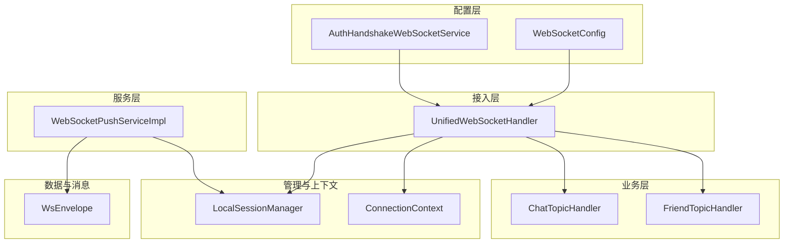
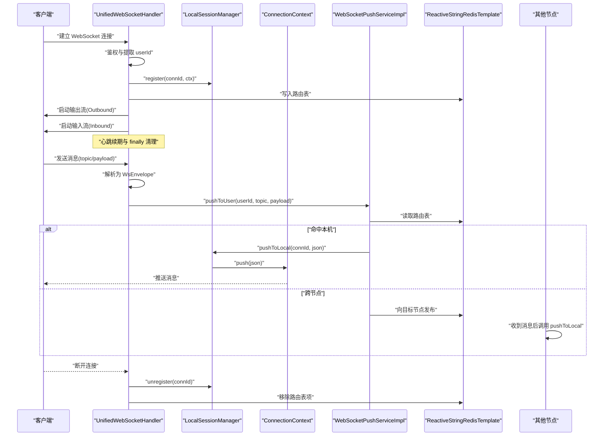
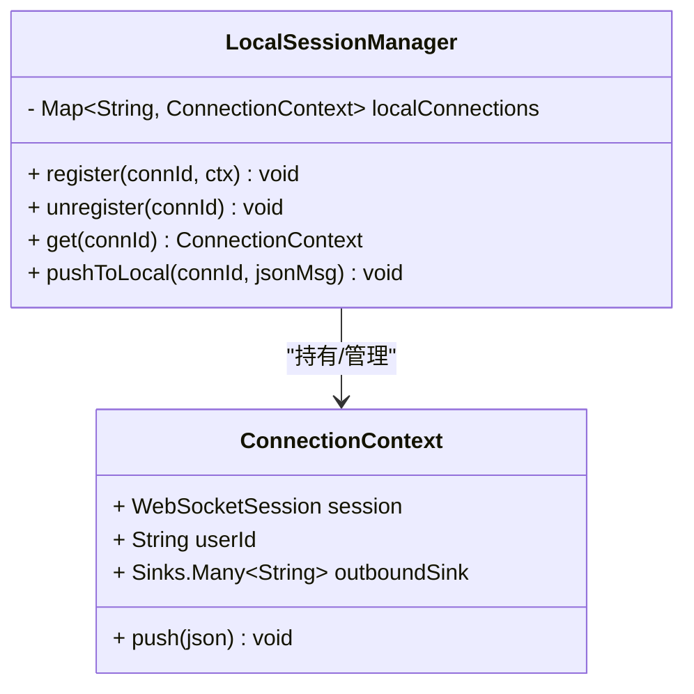
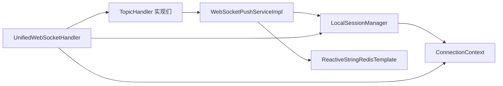

# 本地会话管理器

<cite>
**本文档引用的文件**
- [LocalSessionManager.java](file://src/main/java/com/rivers/im/manage/LocalSessionManager.java)
- [ConnectionContext.java](file://src/main/java/com/rivers/im/context/ConnectionContext.java)
- [WebSocketPushServiceImpl.java](file://src/main/java/com/rivers/im/service/impl/WebSocketPushServiceImpl.java)
- [UnifiedWebSocketHandler.java](file://src/main/java/com/rivers/im/config/UnifiedWebSocketHandler.java)
- [WsEnvelope.java](file://src/main/java/com/rivers/im/record/WsEnvelope.java)
- [TopicHandler.java](file://src/main/java/com/rivers/im/router/TopicHandler.java)
- [ChatTopicHandler.java](file://src/main/java/com/rivers/im/router/ChatTopicHandler.java)
- [FriendTopicHandler.java](file://src/main/java/com/rivers/im/router/FriendTopicHandler.java)
- [WebSocketConfig.java](file://src/main/java/com/rivers/im/config/WebSocketConfig.java)
- [AuthHandshakeWebSocketService.java](file://src/main/java/com/rivers/im/service/impl/AuthHandshakeWebSocketService.java)
</cite>

## 目录
1. [简介](#简介)
2. [项目结构](#项目结构)
3. [核心组件](#核心组件)
4. [架构总览](#架构总览)
5. [详细组件分析](#详细组件分析)
6. [依赖关系分析](#依赖关系分析)
7. [性能考量](#性能考量)
8. [故障排查指南](#故障排查指南)
9. [结论](#结论)

## 简介
本文件聚焦于本地会话管理器 LocalSessionManager 的设计与实现，系统性阐述其在 IM 服务器中的职责：会话注册、注销、查询以及本地推送机制。同时深入解析基于 ConcurrentHashMap 的线程安全设计与高性能特性，结合 ConnectionContext 的协作关系，说明消息推送的异步处理机制，并给出会话生命周期管理策略（连接建立时的注册流程、断开时的清理机制与异常处理）。最后提供使用 register、unregister、get、pushToLocal 等核心方法的具体调用路径与最佳实践。

## 项目结构
IM 服务器采用响应式 Web 管道与 Redis Pub/Sub 实现跨节点消息转发，本地会话管理器作为核心组件之一，负责维护当前节点内的 WebSocket 连接上下文映射，并提供线程安全的本地推送能力。

图表来源
- [WebSocketConfig.java:1-35](file://src/main/java/com/rivers/im/config/WebSocketConfig.java#L1-L35)
- [AuthHandshakeWebSocketService.java:1-73](file://src/main/java/com/rivers/im/service/impl/AuthHandshakeWebSocketService.java#L1-L73)
- [UnifiedWebSocketHandler.java:1-181](file://src/main/java/com/rivers/im/config/UnifiedWebSocketHandler.java#L1-L181)
- [LocalSessionManager.java:1-43](file://src/main/java/com/rivers/im/manage/LocalSessionManager.java#L1-L43)
- [ConnectionContext.java:1-24](file://src/main/java/com/rivers/im/context/ConnectionContext.java#L1-L24)
- [ChatTopicHandler.java:1-51](file://src/main/java/com/rivers/im/router/ChatTopicHandler.java#L1-L51)
- [FriendTopicHandler.java:1-261](file://src/main/java/com/rivers/im/router/FriendTopicHandler.java#L1-L261)
- [WebSocketPushServiceImpl.java:1-90](file://src/main/java/com/rivers/im/service/impl/WebSocketPushServiceImpl.java#L1-L90)
- [WsEnvelope.java:1-10](file://src/main/java/com/rivers/im/record/WsEnvelope.java#L1-L10)

章节来源
- [WebSocketConfig.java:1-35](file://src/main/java/com/rivers/im/config/WebSocketConfig.java#L1-L35)
- [AuthHandshakeWebSocketService.java:1-73](file://src/main/java/com/rivers/im/service/impl/AuthHandshakeWebSocketService.java#L1-L73)
- [UnifiedWebSocketHandler.java:1-181](file://src/main/java/com/rivers/im/config/UnifiedWebSocketHandler.java#L1-L181)

## 核心组件
- LocalSessionManager：维护 connId 到 ConnectionContext 的映射，提供注册、注销、查询与本地推送能力。
- ConnectionContext：封装 WebSocketSession、用户标识与出站多播通道，支持线程安全的异步推送。
- WebSocketPushServiceImpl：面向用户的推送服务，负责消息编排、路由决策与跨节点转发。
- UnifiedWebSocketHandler：统一的 WebSocket 入口，负责握手、注册会话、心跳续期、消息分发与连接清理。
- TopicHandler 及其实现：按主题路由业务逻辑，触发推送服务进行消息下发。
- WsEnvelope：消息载体，包含 topic、msgId、payload 字段。

章节来源
- [LocalSessionManager.java:1-43](file://src/main/java/com/rivers/im/manage/LocalSessionManager.java#L1-L43)
- [ConnectionContext.java:1-24](file://src/main/java/com/rivers/im/context/ConnectionContext.java#L1-L24)
- [WebSocketPushServiceImpl.java:1-90](file://src/main/java/com/rivers/im/service/impl/WebSocketPushServiceImpl.java#L1-L90)
- [UnifiedWebSocketHandler.java:1-181](file://src/main/java/com/rivers/im/config/UnifiedWebSocketHandler.java#L1-L181)
- [TopicHandler.java:1-14](file://src/main/java/com/rivers/im/router/TopicHandler.java#L1-L14)
- [WsEnvelope.java:1-10](file://src/main/java/com/rivers/im/record/WsEnvelope.java#L1-L10)

## 架构总览
下图展示了从客户端连接到消息推送的完整链路，重点体现 LocalSessionManager 在本地会话管理与推送中的作用。

图表来源
- [UnifiedWebSocketHandler.java:87-122](file://src/main/java/com/rivers/im/config/UnifiedWebSocketHandler.java#L87-L122)
- [LocalSessionManager.java:17-42](file://src/main/java/com/rivers/im/manage/LocalSessionManager.java#L17-L42)
- [ConnectionContext.java:21-23](file://src/main/java/com/rivers/im/context/ConnectionContext.java#L21-L23)
- [WebSocketPushServiceImpl.java:44-88](file://src/main/java/com/rivers/im/service/impl/WebSocketPushServiceImpl.java#L44-L88)
- [WsEnvelope.java:5-9](file://src/main/java/com/rivers/im/record/WsEnvelope.java#L5-L9)

## 详细组件分析

### LocalSessionManager 分析
- 数据结构与并发特性
  - 使用 ConcurrentHashMap 维护 connId 到 ConnectionContext 的映射，提供线程安全的 put/remove/get 操作，适合高并发场景下的会话注册与查询。
  - put/remove 操作的时间复杂度近似 O(1)，查询为 O(1)，满足大规模在线用户场景的性能要求。
- 核心方法
  - register(connId, ctx)：将新连接注册到本地会话表。
  - unregister(connId)：移除会话并尝试完成出站通道，确保资源释放。
  - get(connId)：根据连接 ID 获取上下文。
  - pushToLocal(connId, jsonMsg)：检查连接是否存活，若存活则推送消息；否则记录调试日志。
- 异常与边界处理
  - 当连接不存在或已关闭时，不抛出异常，而是记录调试信息，避免影响整体流程。
  - 出站通道通过 tryEmitComplete 完成，防止资源泄漏。

图表来源
- [LocalSessionManager.java:14-42](file://src/main/java/com/rivers/im/manage/LocalSessionManager.java#L14-L42)
- [ConnectionContext.java:8-23](file://src/main/java/com/rivers/im/context/ConnectionContext.java#L8-L23)

章节来源
- [LocalSessionManager.java:1-43](file://src/main/java/com/rivers/im/manage/LocalSessionManager.java#L1-L43)

### ConnectionContext 分析
- 设计要点
  - 封装 WebSocketSession 与 userId，便于上层按用户维度进行管理。
  - 使用 Reactor 的 Sinks.Many 并启用 onBackpressureBuffer(1024) 背压策略，确保在高并发推送场景下不会丢失消息。
  - 提供 push(json) 方法，内部通过 tryEmitNext 将消息推送到下游。
- 线程安全
  - Sinks 是线程安全的，可在多线程环境下安全调用。
  - 结合 ConcurrentHashMap，形成“会话表 + 出站通道”的双重线程安全保障。

章节来源
- [ConnectionContext.java:1-24](file://src/main/java/com/rivers/im/context/ConnectionContext.java#L1-L24)

### WebSocketPushServiceImpl 分析
- 路由与推送
  - pushToUser(userId, topic, payload)：构建 WsEnvelope，序列化为 JSON，然后根据路由表决定本地推送还是跨节点转发。
  - routeToUser(userId, jsonMsg)：读取 Redis 中的路由哈希，遍历所有连接并行推送。
  - pushToConnection(connId, targetServerId, jsonMsg)：若目标服务器为本机，则调用 LocalSessionManager.pushToLocal；否则通过 Redis Pub/Sub 发布到目标节点。
- 错误处理
  - 对 Redis 操作进行错误捕获与降级处理，避免单点失败导致整条链路中断。
  - 跨节点推送失败时记录告警日志并继续执行。

章节来源
- [WebSocketPushServiceImpl.java:1-90](file://src/main/java/com/rivers/im/service/impl/WebSocketPushServiceImpl.java#L1-L90)

### UnifiedWebSocketHandler 分析
- 连接生命周期
  - 握手阶段：通过 AuthHandshakeWebSocketService 验证 ticket 并注入 userId。
  - 注册阶段：创建 ConnectionContext，调用 LocalSessionManager.register 完成注册。
  - 输出流：将 ConnectionContext 的 outboundSink 转换为 Flux 并发送到客户端。
  - 输入流：解析客户端消息为 WsEnvelope，按 topic 路由到对应 TopicHandler。
  - 心跳：周期性续期 Redis 路由键，保持会话活跃。
  - 清理：finally 钩子中调用 LocalSessionManager.unregister 并清理 Redis 路由表。
- 跨节点消息
  - 启动 Redis 订阅，监听当前节点的 ws:node:<serverId> 频道，收到消息后调用 LocalSessionManager.pushToLocal。

章节来源
- [UnifiedWebSocketHandler.java:1-181](file://src/main/java/com/rivers/im/config/UnifiedWebSocketHandler.java#L1-L181)

### TopicHandler 与消息分发
- TopicHandler 接口定义了 getTopic 与 handleInbound 方法，各主题处理器实现具体业务逻辑。
- ChatTopicHandler：处理聊天消息，构造内容并调用推送服务向双方推送。
- FriendTopicHandler：处理好友请求、接受、拒绝等操作，结合数据库持久化与实时推送。

章节来源
- [TopicHandler.java:1-14](file://src/main/java/com/rivers/im/router/TopicHandler.java#L1-L14)
- [ChatTopicHandler.java:1-51](file://src/main/java/com/rivers/im/router/ChatTopicHandler.java#L1-L51)
- [FriendTopicHandler.java:1-261](file://src/main/java/com/rivers/im/router/FriendTopicHandler.java#L1-L261)

## 依赖关系分析
- 组件耦合
  - LocalSessionManager 与 ConnectionContext 弱耦合：前者只依赖后者提供的接口能力。
  - WebSocketPushServiceImpl 依赖 LocalSessionManager 与 Redis，用于本地推送与跨节点转发。
  - UnifiedWebSocketHandler 依赖 LocalSessionManager、ConnectionContext、TopicHandler 与 Redis，承担接入层职责。
- 外部依赖
  - Reactor Sinks：提供线程安全的多播与背压。
  - Redis：用于会话路由与跨节点消息转发。
  - Jackson：JSON 序列化与反序列化。

图表来源
- [LocalSessionManager.java:1-43](file://src/main/java/com/rivers/im/manage/LocalSessionManager.java#L1-L43)
- [ConnectionContext.java:1-24](file://src/main/java/com/rivers/im/context/ConnectionContext.java#L1-L24)
- [WebSocketPushServiceImpl.java:1-90](file://src/main/java/com/rivers/im/service/impl/WebSocketPushServiceImpl.java#L1-L90)
- [UnifiedWebSocketHandler.java:1-181](file://src/main/java/com/rivers/im/config/UnifiedWebSocketHandler.java#L1-L181)
- [TopicHandler.java:1-14](file://src/main/java/com/rivers/im/router/TopicHandler.java#L1-L14)

## 性能考量
- ConcurrentHashMap 的选择
  - 读写操作近似 O(1)，适合高并发场景；在大量连接时仍能保持良好吞吐。
- 背压策略
  - ConnectionContext 的 Sinks.Many 使用 onBackpressureBuffer(1024)，在瞬时高负载时避免丢包，但需关注内存占用。
- 异步推送
  - 基于 Reactor 的异步链路，避免阻塞主线程；跨节点通过 Redis Pub/Sub 解耦，提升扩展性。
- Redis 路由
  - 路由表采用哈希结构，查找与更新均为 O(1)；配合过期时间控制内存占用。

[本节为通用性能讨论，不直接分析特定文件]

## 故障排查指南
- 连接无法注册
  - 检查握手是否成功（ticket 是否有效），确认 userId 是否正确注入。
  - 查看 LocalSessionManager.register 是否被调用，以及 Redis 路由写入是否成功。
- 推送失败或丢失
  - 检查 LocalSessionManager.pushToLocal 是否命中存活连接；若连接已关闭，将记录调试日志。
  - 核对 WebSocketPushServiceImpl 的路由逻辑，确认目标服务器是否为本机。
- 跨节点推送异常
  - 检查 Redis Pub/Sub 订阅是否正常，确认 ws:node:<serverId> 频道是否被正确订阅。
  - 关注推送失败的日志，定位网络或目标节点问题。
- 连接清理异常
  - 确认 finally 钩子是否执行，Redis 路由表是否被正确移除。

章节来源
- [AuthHandshakeWebSocketService.java:26-55](file://src/main/java/com/rivers/im/service/impl/AuthHandshakeWebSocketService.java#L26-L55)
- [LocalSessionManager.java:35-42](file://src/main/java/com/rivers/im/manage/LocalSessionManager.java#L35-L42)
- [WebSocketPushServiceImpl.java:76-88](file://src/main/java/com/rivers/im/service/impl/WebSocketPushServiceImpl.java#L76-L88)
- [UnifiedWebSocketHandler.java:140-162](file://src/main/java/com/rivers/im/config/UnifiedWebSocketHandler.java#L140-L162)

## 结论
LocalSessionManager 以 ConcurrentHashMap 为核心，结合 ConnectionContext 的线程安全出站通道，实现了高性能、低延迟的本地会话管理与推送。配合 UnifiedWebSocketHandler 的完整生命周期管理与 WebSocketPushServiceImpl 的路由决策，系统在单机与分布式场景下均具备良好的可扩展性与稳定性。建议在高并发场景下关注 Redis 路由表容量与 Sinks 背压参数的平衡，确保系统在峰值流量下的可靠性与性能表现。