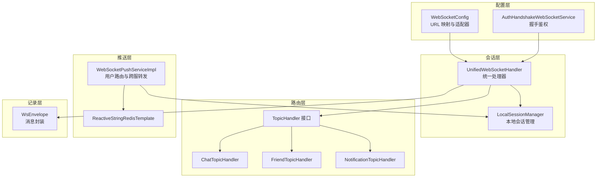
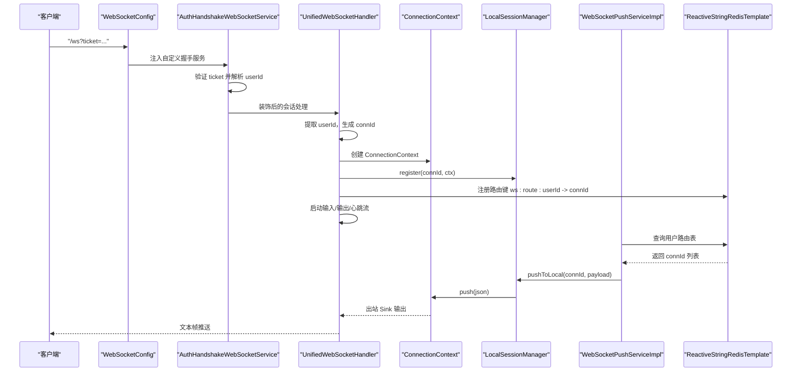
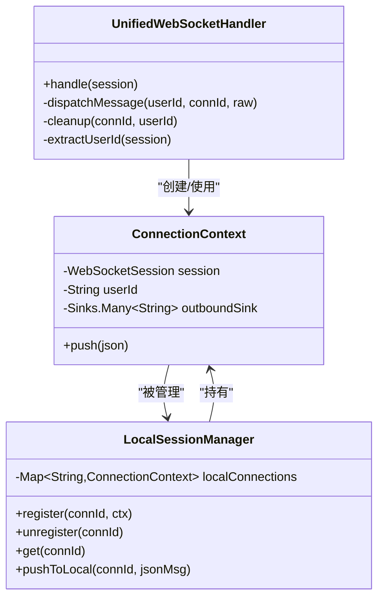
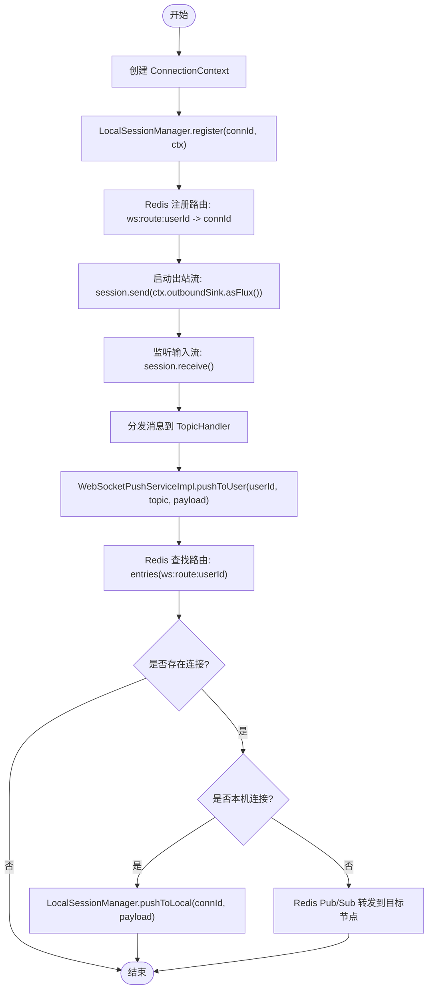
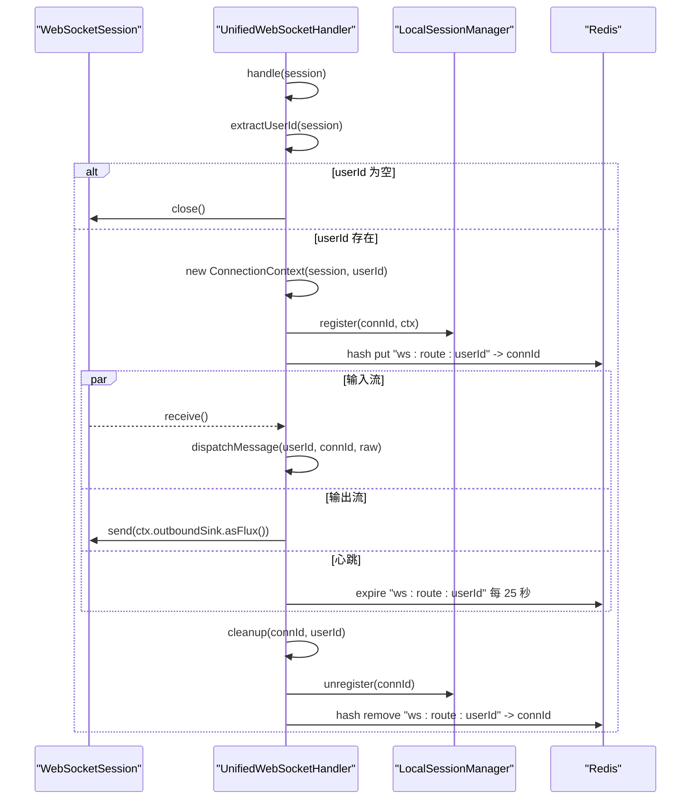
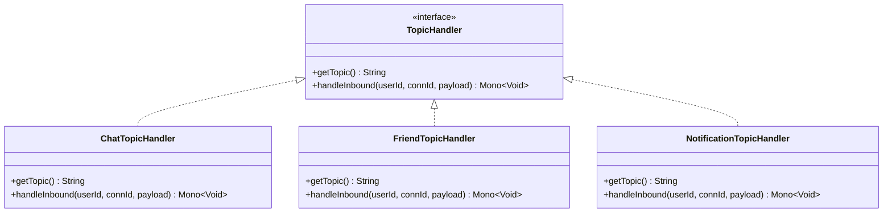
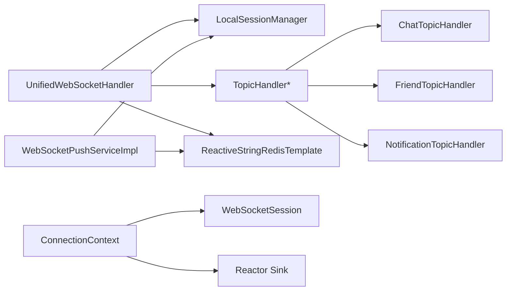

# 连接上下文管理

<cite>
**本文档引用的文件**
- [ConnectionContext.java](file://src/main/java/com/rivers/im/context/ConnectionContext.java)
- [LocalSessionManager.java](file://src/main/java/com/rivers/im/manage/LocalSessionManager.java)
- [UnifiedWebSocketHandler.java](file://src/main/java/com/rivers/im/config/UnifiedWebSocketHandler.java)
- [WebSocketConfig.java](file://src/main/java/com/rivers/im/config/WebSocketConfig.java)
- [AuthHandshakeWebSocketService.java](file://src/main/java/com/rivers/im/service/impl/AuthHandshakeWebSocketService.java)
- [WsEnvelope.java](file://src/main/java/com/rivers/im/record/WsEnvelope.java)
- [TopicHandler.java](file://src/main/java/com/rivers/im/router/TopicHandler.java)
- [ChatTopicHandler.java](file://src/main/java/com/rivers/im/router/ChatTopicHandler.java)
- [FriendTopicHandler.java](file://src/main/java/com/rivers/im/router/FriendTopicHandler.java)
- [NotificationTopicHandler.java](file://src/main/java/com/rivers/im/router/NotificationTopicHandler.java)
- [IWebSocketPushService.java](file://src/main/java/com/rivers/im/service/IWebSocketPushService.java)
- [WebSocketPushServiceImpl.java](file://src/main/java/com/rivers/im/service/impl/WebSocketPushServiceImpl.java)
- [application.yml](file://src/main/resources/application.yml)
</cite>

## 目录
1. [简介](#简介)
2. [项目结构](#项目结构)
3. [核心组件](#核心组件)
4. [架构总览](#架构总览)
5. [详细组件分析](#详细组件分析)
6. [依赖关系分析](#依赖关系分析)
7. [性能考量](#性能考量)
8. [故障排查指南](#故障排查指南)
9. [结论](#结论)

## 简介
本文件围绕连接上下文管理展开，系统性阐述 ConnectionContext 的设计理念与架构职责，重点覆盖：
- 用户标识、连接属性与会话元数据的管理机制
- 连接上下文的数据结构设计：WebSocket 会话对象、用户信息、连接状态与消息通道的组织方式
- 上下文在会话管理中的核心作用：会话标识符、消息路由载体、状态维护容器
- 使用示例：如何创建、配置与操作 ConnectionContext 实例
- 与 LocalSessionManager 的协作关系及在系统中的传递机制

## 项目结构
IM 服务器采用响应式 WebSockets 架构，结合 Redis 实现跨节点消息路由与心跳保活。核心模块划分如下：
- 配置层：WebSocket 入口映射与握手鉴权
- 会话层：统一的 WebSocket 处理器与会话管理
- 路由层：按主题分发消息的处理器集合
- 推送层：基于 Redis 的用户路由与跨服消息转发
- 记录层：消息封装载体

图表来源
- [WebSocketConfig.java:22-34](file://src/main/java/com/rivers/im/config/WebSocketConfig.java#L22-L34)
- [AuthHandshakeWebSocketService.java:26-54](file://src/main/java/com/rivers/im/service/impl/AuthHandshakeWebSocketService.java#L26-L54)
- [UnifiedWebSocketHandler.java:87-122](file://src/main/java/com/rivers/im/config/UnifiedWebSocketHandler.java#L87-L122)
- [LocalSessionManager.java:17-42](file://src/main/java/com/rivers/im/manage/LocalSessionManager.java#L17-L42)
- [TopicHandler.java:8-13](file://src/main/java/com/rivers/im/router/TopicHandler.java#L8-L13)
- [ChatTopicHandler.java:14-50](file://src/main/java/com/rivers/im/router/ChatTopicHandler.java#L14-L50)
- [FriendTopicHandler.java:24-70](file://src/main/java/com/rivers/im/router/FriendTopicHandler.java#L24-L70)
- [NotificationTopicHandler.java:12-26](file://src/main/java/com/rivers/im/router/NotificationTopicHandler.java#L12-L26)
- [WebSocketPushServiceImpl.java:44-88](file://src/main/java/com/rivers/im/service/impl/WebSocketPushServiceImpl.java#L44-L88)
- [WsEnvelope.java:5-9](file://src/main/java/com/rivers/im/record/WsEnvelope.java#L5-L9)

章节来源
- [WebSocketConfig.java:13-35](file://src/main/java/com/rivers/im/config/WebSocketConfig.java#L13-L35)
- [application.yml:1-14](file://src/main/resources/application.yml#L1-L14)

## 核心组件
- ConnectionContext：承载单个 WebSocket 连接的上下文，包含会话对象、用户标识与出站消息通道
- LocalSessionManager：以连接 ID 为键的本地会话存储与推送入口
- UnifiedWebSocketHandler：统一的 WebSocket 处理器，负责握手提取用户、建立上下文、注册路由、心跳续期与清理
- TopicHandler 及其实现：按主题分发消息的处理器集合
- WebSocketPushServiceImpl：基于 Redis 的用户路由与跨服消息转发
- WsEnvelope：消息封装载体，包含主题、消息 ID 与负载

章节来源
- [ConnectionContext.java:7-24](file://src/main/java/com/rivers/im/context/ConnectionContext.java#L7-L24)
- [LocalSessionManager.java:10-43](file://src/main/java/com/rivers/im/manage/LocalSessionManager.java#L10-L43)
- [UnifiedWebSocketHandler.java:38-181](file://src/main/java/com/rivers/im/config/UnifiedWebSocketHandler.java#L38-L181)
- [TopicHandler.java:8-13](file://src/main/java/com/rivers/im/router/TopicHandler.java#L8-L13)
- [WebSocketPushServiceImpl.java:20-90](file://src/main/java/com/rivers/im/service/impl/WebSocketPushServiceImpl.java#L20-L90)
- [WsEnvelope.java:5-9](file://src/main/java/com/rivers/im/record/WsEnvelope.java#L5-L9)

## 架构总览
ConnectionContext 在系统中扮演“会话标识符 + 消息路由载体 + 状态维护容器”的三重角色：
- 会话标识符：通过连接 ID 唯一标识一次 WebSocket 会话
- 消息路由载体：通过出站 Sink 将消息推送到对应会话
- 状态维护容器：持有 WebSocketSession 与用户 ID，便于心跳续期、清理与状态查询

图表来源
- [WebSocketConfig.java:22-34](file://src/main/java/com/rivers/im/config/WebSocketConfig.java#L22-L34)
- [AuthHandshakeWebSocketService.java:26-54](file://src/main/java/com/rivers/im/service/impl/AuthHandshakeWebSocketService.java#L26-L54)
- [UnifiedWebSocketHandler.java:87-122](file://src/main/java/com/rivers/im/config/UnifiedWebSocketHandler.java#L87-L122)
- [ConnectionContext.java:14-23](file://src/main/java/com/rivers/im/context/ConnectionContext.java#L14-L23)
- [LocalSessionManager.java:17-42](file://src/main/java/com/rivers/im/manage/LocalSessionManager.java#L17-L42)
- [WebSocketPushServiceImpl.java:44-88](file://src/main/java/com/rivers/im/service/impl/WebSocketPushServiceImpl.java#L44-L88)

## 详细组件分析

### ConnectionContext 设计与数据结构
ConnectionContext 是连接上下文的核心载体，其设计遵循“最小必要性”原则：
- 字段
  - WebSocketSession：底层会话对象，用于发送文本帧与检查连接状态
  - String userId：用户标识，贯穿整个生命周期
  - Sinks.Many<String> outboundSink：多播、带缓冲的背压策略，保证线程安全的消息推送
- 方法
  - push(String json)：向出站通道投递 JSON 消息
- 设计要点
  - 使用响应式 Sink 作为消息通道，避免阻塞与竞争条件
  - 通过构造函数注入会话与用户 ID，确保上下文不可变且可追踪
  - 出站 Sink 默认缓冲大小为 1024，兼顾吞吐与内存占用

图表来源
- [ConnectionContext.java:7-24](file://src/main/java/com/rivers/im/context/ConnectionContext.java#L7-L24)
- [LocalSessionManager.java:12-43](file://src/main/java/com/rivers/im/manage/LocalSessionManager.java#L12-L43)
- [UnifiedWebSocketHandler.java:87-122](file://src/main/java/com/rivers/im/config/UnifiedWebSocketHandler.java#L87-L122)

章节来源
- [ConnectionContext.java:7-24](file://src/main/java/com/rivers/im/context/ConnectionContext.java#L7-L24)

### LocalSessionManager 协作关系与传递机制
LocalSessionManager 以连接 ID 为键维护本地会话，并提供线程安全的推送入口：
- register/unregister：注册与注销会话，注销时主动完成出站通道，避免资源泄漏
- get：按连接 ID 获取上下文
- pushToLocal：在会话仍开放时推送消息；否则记录调试日志

传递机制：
- UnifiedWebSocketHandler 在握手后创建 ConnectionContext，并以随机生成的 connId 注册到 LocalSessionManager
- WebSocketPushServiceImpl 通过 Redis 查询用户路由表，得到 connId 列表后调用 pushToLocal 将消息推送到本地会话
- 跨服场景：若目标连接不在当前节点，则通过 Redis Pub/Sub 将消息转发至目标节点，目标节点再调用本地推送

图表来源
- [LocalSessionManager.java:17-42](file://src/main/java/com/rivers/im/manage/LocalSessionManager.java#L17-L42)
- [WebSocketPushServiceImpl.java:56-88](file://src/main/java/com/rivers/im/service/impl/WebSocketPushServiceImpl.java#L56-L88)
- [UnifiedWebSocketHandler.java:97-102](file://src/main/java/com/rivers/im/config/UnifiedWebSocketHandler.java#L97-L102)

章节来源
- [LocalSessionManager.java:10-43](file://src/main/java/com/rivers/im/manage/LocalSessionManager.java#L10-L43)
- [WebSocketPushServiceImpl.java:20-90](file://src/main/java/com/rivers/im/service/impl/WebSocketPushServiceImpl.java#L20-L90)

### UnifiedWebSocketHandler 的会话管理流程
UnifiedWebSocketHandler 负责从握手到清理的完整生命周期：
- 握手阶段：从会话属性或握手 URI 中提取 userId，若缺失则拒绝连接
- 初始化：生成 connId，创建 ConnectionContext，注册到 LocalSessionManager，并在 Redis 中注册路由
- 输入/输出/心跳：并发运行输入流解析、主题分发、出站流推送与心跳续期
- 清理：连接断开或异常时，注销会话并清理 Redis 路由

图表来源
- [UnifiedWebSocketHandler.java:87-122](file://src/main/java/com/rivers/im/config/UnifiedWebSocketHandler.java#L87-L122)
- [UnifiedWebSocketHandler.java:151-162](file://src/main/java/com/rivers/im/config/UnifiedWebSocketHandler.java#L151-L162)

章节来源
- [UnifiedWebSocketHandler.java:38-181](file://src/main/java/com/rivers/im/config/UnifiedWebSocketHandler.java#L38-L181)

### 主题处理器与消息路由
系统通过 TopicHandler 接口实现按主题分发：
- TopicHandler：定义 getTopic 与 handleInbound
- ChatTopicHandler：处理聊天消息，校验接收方并推送至发送方与接收方
- FriendTopicHandler：处理好友请求、接受与拒绝，支持写扩散与离线通知持久化
- NotificationTopicHandler：处理通知读取等动作

图表来源
- [TopicHandler.java:8-13](file://src/main/java/com/rivers/im/router/TopicHandler.java#L8-L13)
- [ChatTopicHandler.java:14-50](file://src/main/java/com/rivers/im/router/ChatTopicHandler.java#L14-L50)
- [FriendTopicHandler.java:24-70](file://src/main/java/com/rivers/im/router/FriendTopicHandler.java#L24-L70)
- [NotificationTopicHandler.java:12-26](file://src/main/java/com/rivers/im/router/NotificationTopicHandler.java#L12-L26)

章节来源
- [TopicHandler.java:8-13](file://src/main/java/com/rivers/im/router/TopicHandler.java#L8-L13)
- [ChatTopicHandler.java:14-50](file://src/main/java/com/rivers/im/router/ChatTopicHandler.java#L14-L50)
- [FriendTopicHandler.java:24-70](file://src/main/java/com/rivers/im/router/FriendTopicHandler.java#L24-L70)
- [NotificationTopicHandler.java:12-26](file://src/main/java/com/rivers/im/router/NotificationTopicHandler.java#L12-L26)

### 使用示例：创建、配置与操作 ConnectionContext
- 创建与配置
  - 在握手成功后，从会话属性中提取 userId，生成随机 connId
  - 构造 ConnectionContext，注入 WebSocketSession 与 userId
  - 注册到 LocalSessionManager，并在 Redis 中登记路由
- 操作
  - 通过 ConnectionContext.push 发送消息到出站通道
  - 通过 LocalSessionManager.pushToLocal 将消息推送到指定连接
  - 通过 WebSocketPushServiceImpl.pushToUser 将消息按用户路由推送到本地或远端节点

章节来源
- [AuthHandshakeWebSocketService.java:45-54](file://src/main/java/com/rivers/im/service/impl/AuthHandshakeWebSocketService.java#L45-L54)
- [UnifiedWebSocketHandler.java:95-102](file://src/main/java/com/rivers/im/config/UnifiedWebSocketHandler.java#L95-L102)
- [ConnectionContext.java:14-23](file://src/main/java/com/rivers/im/context/ConnectionContext.java#L14-L23)
- [LocalSessionManager.java:35-42](file://src/main/java/com/rivers/im/manage/LocalSessionManager.java#L35-L42)
- [WebSocketPushServiceImpl.java:44-88](file://src/main/java/com/rivers/im/service/impl/WebSocketPushServiceImpl.java#L44-L88)

## 依赖关系分析
- 组件耦合
  - UnifiedWebSocketHandler 依赖 LocalSessionManager、TopicHandler 集合、Redis 客户端
  - WebSocketPushServiceImpl 依赖 LocalSessionManager、Redis 客户端与 ObjectMapper
  - ConnectionContext 依赖 WebSocketSession 与 Reactor Sink
- 外部依赖
  - Spring WebFlux 响应式栈
  - Redis 响应式客户端用于路由与跨服消息
  - Jackson 用于消息序列化

图表来源
- [UnifiedWebSocketHandler.java:40-64](file://src/main/java/com/rivers/im/config/UnifiedWebSocketHandler.java#L40-L64)
- [WebSocketPushServiceImpl.java:22-37](file://src/main/java/com/rivers/im/service/impl/WebSocketPushServiceImpl.java#L22-L37)
- [ConnectionContext.java:10-12](file://src/main/java/com/rivers/im/context/ConnectionContext.java#L10-L12)

章节来源
- [UnifiedWebSocketHandler.java:40-64](file://src/main/java/com/rivers/im/config/UnifiedWebSocketHandler.java#L40-L64)
- [WebSocketPushServiceImpl.java:22-37](file://src/main/java/com/rivers/im/service/impl/WebSocketPushServiceImpl.java#L22-L37)
- [ConnectionContext.java:10-12](file://src/main/java/com/rivers/im/context/ConnectionContext.java#L10-L12)

## 性能考量
- 背压与缓冲：ConnectionContext 的出站 Sink 采用多播+缓冲+背压策略，容量为 1024，适合高并发场景下的消息推送
- 并发运行：输入/输出/心跳三条流并发运行，提升吞吐能力
- 路由与跨服：用户路由通过 Redis Hash 存储，查询与广播推送均采用响应式链路，减少阻塞
- 心跳续期：每 25 秒续期路由键 TTL，避免过期导致路由失效
- 异常处理：所有关键路径均包含错误回调与日志记录，保证稳定性

## 故障排查指南
- 握手失败
  - 现象：连接被拒绝，返回 400 或 401
  - 原因：缺少 ticket、ticket 无效或过期
  - 处理：检查握手参数与票据服务可用性
- 无法获取 userId
  - 现象：连接建立但未注册路由，随后被关闭
  - 原因：会话属性或握手 URI 中未携带 userId
  - 处理：确认鉴权流程正确设置 userId
- 会话未找到或已关闭
  - 现象：推送日志显示本地连接不存在或已关闭
  - 原因：会话已断开或被清理
  - 处理：检查连接生命周期与心跳续期
- 跨服消息未达
  - 现象：目标节点未收到消息
  - 原因：目标节点未订阅跨服频道或 Redis Pub/Sub 异常
  - 处理：检查 Redis 订阅与节点标识

章节来源
- [AuthHandshakeWebSocketService.java:28-54](file://src/main/java/com/rivers/im/service/impl/AuthHandshakeWebSocketService.java#L28-L54)
- [UnifiedWebSocketHandler.java:91-96](file://src/main/java/com/rivers/im/config/UnifiedWebSocketHandler.java#L91-L96)
- [LocalSessionManager.java:35-42](file://src/main/java/com/rivers/im/manage/LocalSessionManager.java#L35-L42)
- [UnifiedWebSocketHandler.java:140-149](file://src/main/java/com/rivers/im/config/UnifiedWebSocketHandler.java#L140-L149)

## 结论
ConnectionContext 作为连接上下文的核心载体，将用户标识、会话对象与消息通道有机结合，配合 LocalSessionManager 实现了高效的本地会话管理与消息推送。通过响应式编程模型与 Redis 路由机制，系统实现了高吞吐、低延迟的跨节点消息转发，满足 IM 场景下的实时性与可靠性要求。在实际部署中，建议关注心跳续期、路由一致性与跨服订阅的稳定性，以确保整体系统的健壮性。