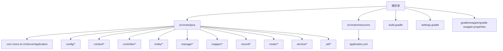
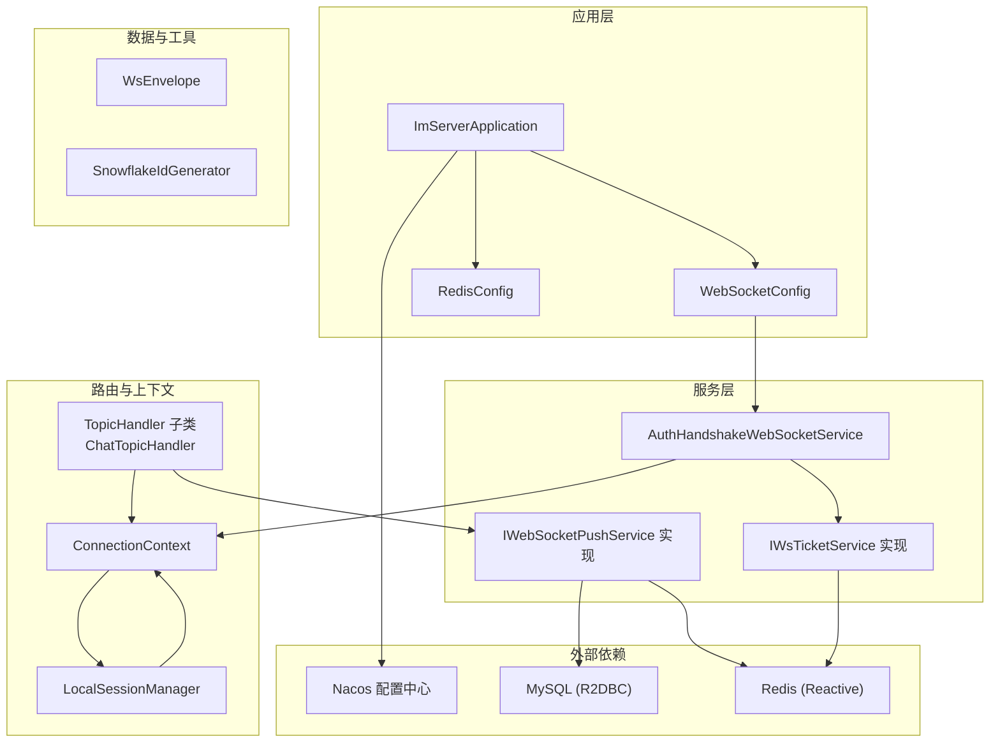
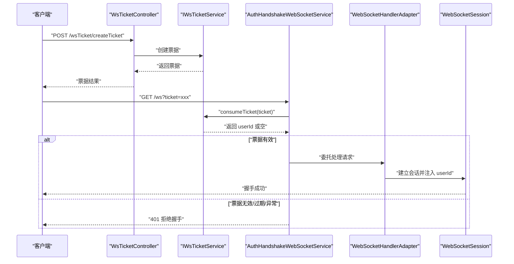
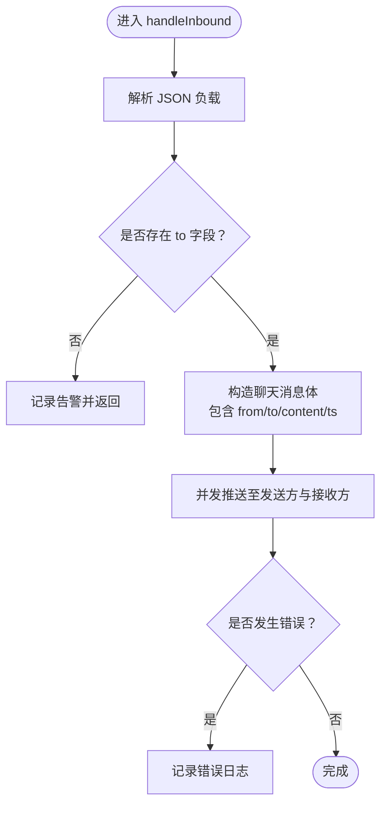
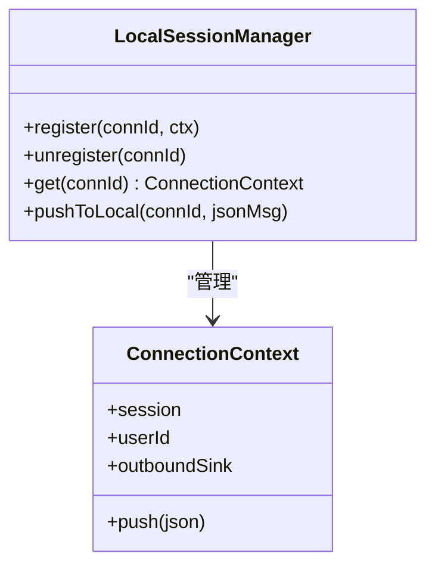
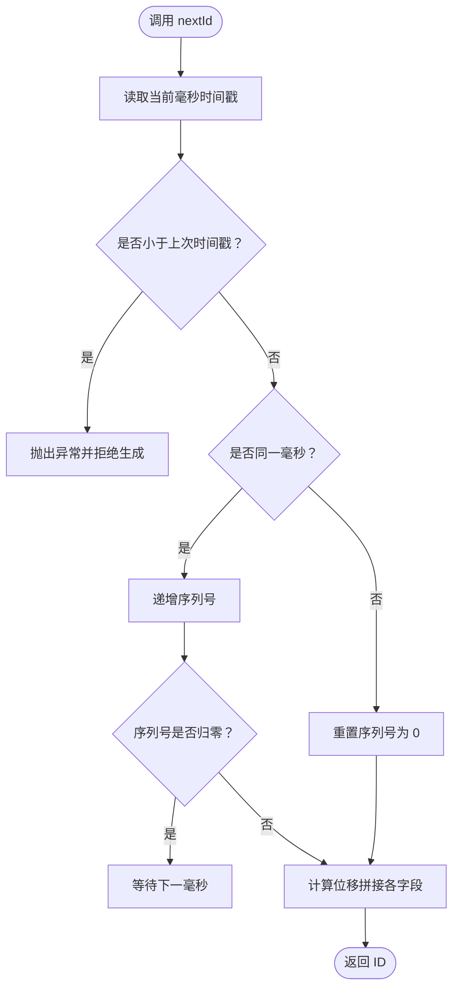
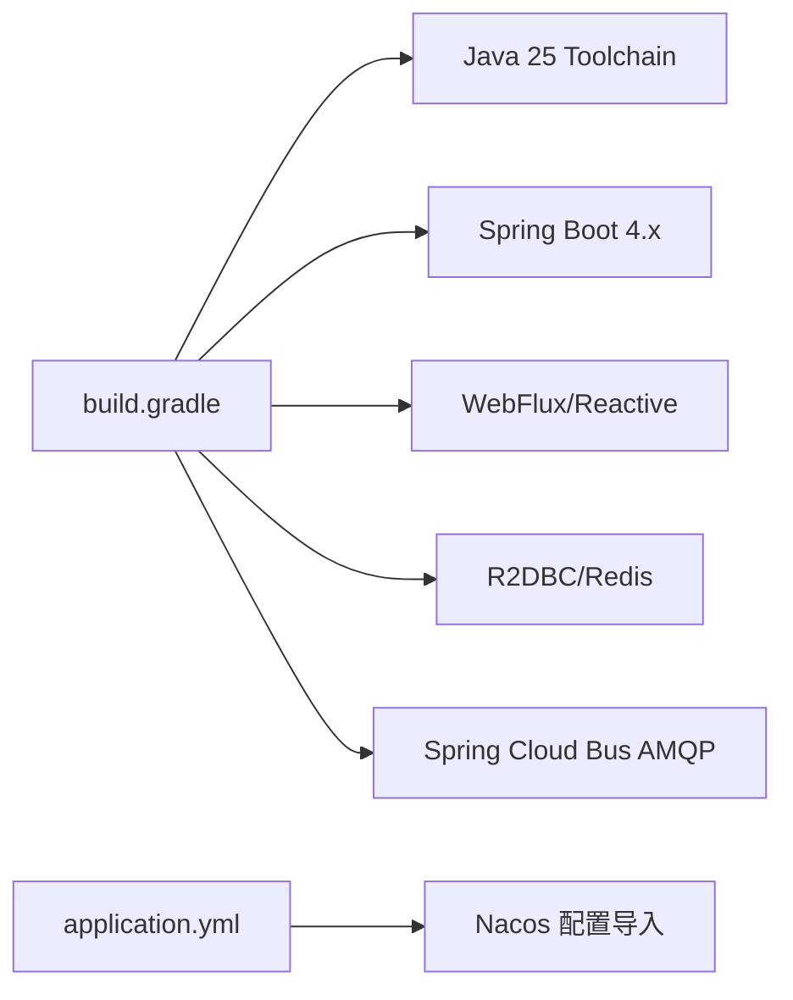

# 开发指南

<cite>
**本文引用的文件**
- [build.gradle](file://build.gradle)
- [settings.gradle](file://settings.gradle)
- [gradle-wrapper.properties](file://gradle/wrapper/gradle-wrapper.properties)
- [application.yml](file://src/main/resources/application.yml)
- [ImServerApplication.java](file://src/main/java/com/rivers/im/ImServerApplication.java)
- [WebSocketConfig.java](file://src/main/java/com/rivers/im/config/WebSocketConfig.java)
- [RedisConfig.java](file://src/main/java/com/rivers/im/config/RedisConfig.java)
- [AuthHandshakeWebSocketService.java](file://src/main/java/com/rivers/im/service/impl/AuthHandshakeWebSocketService.java)
- [ConnectionContext.java](file://src/main/java/com/rivers/im/context/ConnectionContext.java)
- [LocalSessionManager.java](file://src/main/java/com/rivers/im/manage/LocalSessionManager.java)
- [WsTicketController.java](file://src/main/java/com/rivers/im/controller/WsTicketController.java)
- [IWsTicketService.java](file://src/main/java/com/rivers/im/service/IWsTicketService.java)
- [ChatTopicHandler.java](file://src/main/java/com/rivers/im/router/ChatTopicHandler.java)
- [WsEnvelope.java](file://src/main/java/com/rivers/im/record/WsEnvelope.java)
- [SnowflakeIdGenerator.java](file://src/main/java/com/rivers/im/util/SnowflakeIdGenerator.java)
</cite>

## 目录
1. [简介](#简介)
2. [项目结构](#项目结构)
3. [核心组件](#核心组件)
4. [架构总览](#架构总览)
5. [详细组件分析](#详细组件分析)
6. [依赖分析](#依赖分析)
7. [性能考虑](#性能考虑)
8. [故障排查指南](#故障排查指南)
9. [结论](#结论)
10. [附录](#附录)

## 简介
本指南面向参与 IM 服务器项目的开发者，覆盖开发环境搭建、代码规范与最佳实践、测试与调试策略、构建与打包流程以及常见问题与效率建议。项目采用 Spring Boot 4.x + Spring WebFlux + 响应式 Redis/R2DBC 的技术栈，提供基于 WebSocket 的实时通信能力，并通过票据机制完成握手鉴权。

## 项目结构
项目采用标准 Maven/Gradle 工程布局，源码位于 src/main/java，资源位于 src/main/resources；根目录包含 Gradle 构建脚本与包装器配置。模块名称由 settings.gradle 指定。

图表来源
- [settings.gradle:1-2](file://settings.gradle#L1-L2)
- [build.gradle:1-64](file://build.gradle#L1-L64)
- [ImServerApplication.java:1-14](file://src/main/java/com/rivers/im/ImServerApplication.java#L1-L14)
- [application.yml:1-14](file://src/main/resources/application.yml#L1-L14)

章节来源
- [settings.gradle:1-2](file://settings.gradle#L1-L2)
- [build.gradle:1-64](file://build.gradle#L1-L64)
- [gradle-wrapper.properties:1-8](file://gradle/wrapper/gradle-wrapper.properties#L1-L8)

## 核心组件
- 应用入口与启动
  - 启动类负责引导 Spring Boot 应用上下文。
  - 参考路径：[ImServerApplication.java:1-14](file://src/main/java/com/rivers/im/ImServerApplication.java#L1-L14)
- 配置层
  - WebSocket 配置：注册 WebSocket 映射与自定义握手适配器。
    - 参考路径：[WebSocketConfig.java:1-35](file://src/main/java/com/rivers/im/config/WebSocketConfig.java#L1-L35)
  - Redis 配置：提供响应式消息监听容器。
    - 参考路径：[RedisConfig.java:1-18](file://src/main/java/com/rivers/im/config/RedisConfig.java#L1-L18)
- 会话与上下文
  - 连接上下文：封装 WebSocket 会话、用户标识与出站消息通道。
    - 参考路径：[ConnectionContext.java:1-24](file://src/main/java/com/rivers/im/context/ConnectionContext.java#L1-L24)
  - 本地会话管理：维护连接 ID 到上下文的映射，支持本地推送与清理。
    - 参考路径：[LocalSessionManager.java:1-43](file://src/main/java/com/rivers/im/manage/LocalSessionManager.java#L1-L43)
- 握手与鉴权
  - 自定义握手服务：从查询参数提取票据，校验有效性后注入用户标识到会话属性。
    - 参考路径：[AuthHandshakeWebSocketService.java:1-73](file://src/main/java/com/rivers/im/service/impl/AuthHandshakeWebSocketService.java#L1-L73)
- 路由与主题处理
  - 主题处理器示例：聊天主题处理，解析负载并进行双向推送。
    - 参考路径：[ChatTopicHandler.java:1-51](file://src/main/java/com/rivers/im/router/ChatTopicHandler.java#L1-L51)
- 票据服务与控制器
  - 票据接口：创建票据与消费票据。
    - 参考路径：[IWsTicketService.java:1-14](file://src/main/java/com/rivers/im/service/IWsTicketService.java#L1-L14)
  - 票据控制器：对外暴露创建票据的 REST 接口。
    - 参考路径：[WsTicketController.java:1-26](file://src/main/java/com/rivers/im/controller/WsTicketController.java#L1-L26)
- 数据模型与工具
  - 信封模型：统一承载 topic/msgId/payload。
    - 参考路径：[WsEnvelope.java:1-10](file://src/main/java/com/rivers/im/record/WsEnvelope.java#L1-L10)
  - Snowflake ID 生成器：分布式唯一 ID。
    - 参考路径：[SnowflakeIdGenerator.java:1-69](file://src/main/java/com/rivers/im/util/SnowflakeIdGenerator.java#L1-L69)

章节来源
- [ImServerApplication.java:1-14](file://src/main/java/com/rivers/im/ImServerApplication.java#L1-L14)
- [WebSocketConfig.java:1-35](file://src/main/java/com/rivers/im/config/WebSocketConfig.java#L1-L35)
- [RedisConfig.java:1-18](file://src/main/java/com/rivers/im/config/RedisConfig.java#L1-L18)
- [ConnectionContext.java:1-24](file://src/main/java/com/rivers/im/context/ConnectionContext.java#L1-L24)
- [LocalSessionManager.java:1-43](file://src/main/java/com/rivers/im/manage/LocalSessionManager.java#L1-L43)
- [AuthHandshakeWebSocketService.java:1-73](file://src/main/java/com/rivers/im/service/impl/AuthHandshakeWebSocketService.java#L1-L73)
- [ChatTopicHandler.java:1-51](file://src/main/java/com/rivers/im/router/ChatTopicHandler.java#L1-L51)
- [IWsTicketService.java:1-14](file://src/main/java/com/rivers/im/service/IWsTicketService.java#L1-L14)
- [WsTicketController.java:1-26](file://src/main/java/com/rivers/im/controller/WsTicketController.java#L1-L26)
- [WsEnvelope.java:1-10](file://src/main/java/com/rivers/im/record/WsEnvelope.java#L1-L10)
- [SnowflakeIdGenerator.java:1-69](file://src/main/java/com/rivers/im/util/SnowflakeIdGenerator.java#L1-L69)

## 架构总览
系统以响应式编程为核心，结合 Spring WebFlux 提供非阻塞 I/O，配合 R2DBC 访问 MySQL、Reactive Redis 实现消息订阅与发布，通过 WebSocket 提供实时通信。票据服务用于握手鉴权，路由层按主题分发消息。

图表来源
- [ImServerApplication.java:1-14](file://src/main/java/com/rivers/im/ImServerApplication.java#L1-L14)
- [WebSocketConfig.java:1-35](file://src/main/java/com/rivers/im/config/WebSocketConfig.java#L1-L35)
- [RedisConfig.java:1-18](file://src/main/java/com/rivers/im/config/RedisConfig.java#L1-L18)
- [AuthHandshakeWebSocketService.java:1-73](file://src/main/java/com/rivers/im/service/impl/AuthHandshakeWebSocketService.java#L1-L73)
- [ChatTopicHandler.java:1-51](file://src/main/java/com/rivers/im/router/ChatTopicHandler.java#L1-L51)
- [ConnectionContext.java:1-24](file://src/main/java/com/rivers/im/context/ConnectionContext.java#L1-L24)
- [LocalSessionManager.java:1-43](file://src/main/java/com/rivers/im/manage/LocalSessionManager.java#L1-L43)
- [WsEnvelope.java:1-10](file://src/main/java/com/rivers/im/record/WsEnvelope.java#L1-L10)
- [SnowflakeIdGenerator.java:1-69](file://src/main/java/com/rivers/im/util/SnowflakeIdGenerator.java#L1-L69)

## 详细组件分析

### 组件一：WebSocket 握手与鉴权流程
该流程确保只有携带有效票据的客户端才能建立 WebSocket 连接，并将用户标识注入会话属性以便后续路由与推送使用。

图表来源
- [WsTicketController.java:1-26](file://src/main/java/com/rivers/im/controller/WsTicketController.java#L1-L26)
- [IWsTicketService.java:1-14](file://src/main/java/com/rivers/im/service/IWsTicketService.java#L1-L14)
- [AuthHandshakeWebSocketService.java:1-73](file://src/main/java/com/rivers/im/service/impl/AuthHandshakeWebSocketService.java#L1-L73)
- [WebSocketConfig.java:1-35](file://src/main/java/com/rivers/im/config/WebSocketConfig.java#L1-L35)

章节来源
- [WsTicketController.java:1-26](file://src/main/java/com/rivers/im/controller/WsTicketController.java#L1-L26)
- [IWsTicketService.java:1-14](file://src/main/java/com/rivers/im/service/IWsTicketService.java#L1-L14)
- [AuthHandshakeWebSocketService.java:1-73](file://src/main/java/com/rivers/im/service/impl/AuthHandshakeWebSocketService.java#L1-L73)
- [WebSocketConfig.java:1-35](file://src/main/java/com/rivers/im/config/WebSocketConfig.java#L1-L35)

### 组件二：聊天主题消息处理
聊天主题处理器负责解析消息负载、校验接收方、构造标准化消息并进行双向推送。

图表来源
- [ChatTopicHandler.java:1-51](file://src/main/java/com/rivers/im/router/ChatTopicHandler.java#L1-L51)

章节来源
- [ChatTopicHandler.java:1-51](file://src/main/java/com/rivers/im/router/ChatTopicHandler.java#L1-L51)

### 组件三：会话上下文与本地会话管理
连接上下文封装 WebSocket 会话与用户标识，并通过响应式多播通道实现背压推送；本地会话管理器维护连接映射并提供线程安全的本地推送。

图表来源
- [ConnectionContext.java:1-24](file://src/main/java/com/rivers/im/context/ConnectionContext.java#L1-L24)
- [LocalSessionManager.java:1-43](file://src/main/java/com/rivers/im/manage/LocalSessionManager.java#L1-L43)

章节来源
- [ConnectionContext.java:1-24](file://src/main/java/com/rivers/im/context/ConnectionContext.java#L1-L24)
- [LocalSessionManager.java:1-43](file://src/main/java/com/rivers/im/manage/LocalSessionManager.java#L1-L43)

### 组件四：分布式 ID 生成器
Snowflake ID 生成器提供高吞吐的全局唯一 ID，具备时间回拨保护与序列号溢出等待机制。

图表来源
- [SnowflakeIdGenerator.java:1-69](file://src/main/java/com/rivers/im/util/SnowflakeIdGenerator.java#L1-L69)

章节来源
- [SnowflakeIdGenerator.java:1-69](file://src/main/java/com/rivers/im/util/SnowflakeIdGenerator.java#L1-L69)

## 依赖分析
- 构建与工具链
  - Gradle 包装器版本：参考 [gradle-wrapper.properties:1-8](file://gradle/wrapper/gradle-wrapper.properties#L1-L8)
  - Java Toolchain：语言版本 25，参考 [build.gradle:11-15](file://build.gradle#L11-L15)
  - Spring Boot 插件与依赖管理：参考 [build.gradle:1-64](file://build.gradle#L1-L64)
- 运行时依赖
  - WebFlux、WebSocket、Actuator、R2DBC、Reactive Redis、AMQP Bus、Nacos 导入等，参考 [build.gradle:31-52](file://build.gradle#L31-L52)
- 配置导入
  - 应用通过 Nacos 导入配置，参考 [application.yml:1-14](file://src/main/resources/application.yml#L1-L14)

图表来源
- [build.gradle:1-64](file://build.gradle#L1-L64)
- [gradle-wrapper.properties:1-8](file://gradle/wrapper/gradle-wrapper.properties#L1-L8)
- [application.yml:1-14](file://src/main/resources/application.yml#L1-L14)

章节来源
- [build.gradle:1-64](file://build.gradle#L1-L64)
- [gradle-wrapper.properties:1-8](file://gradle/wrapper/gradle-wrapper.properties#L1-L8)
- [application.yml:1-14](file://src/main/resources/application.yml#L1-L14)

## 性能考虑
- 响应式优先：充分利用 Reactor 的背压与非阻塞特性，避免阻塞操作。
- 并发推送：使用并发组合进行双向推送，降低延迟。
- 背压策略：连接上下文的出站通道采用带缓冲的背压策略，防止内存压力过大。
- 本地会话管理：通过并发映射与条件判断减少锁竞争与无效推送。
- ID 生成：Snowflake 在单节点内无锁化同步生成，适合高并发场景。
- 外部依赖：合理配置 Redis 与数据库连接池参数，避免抖动。

## 故障排查指南
- 握手被拒
  - 现象：客户端收到 400/401。
  - 排查要点：
    - 确认票据参数存在且格式正确。
    - 检查票据服务是否返回用户 ID，关注超时与异常分支。
    - 查看拒绝握手的优雅实现，避免响应已提交导致异常。
  - 参考路径：
    - [AuthHandshakeWebSocketService.java:26-67](file://src/main/java/com/rivers/im/service/impl/AuthHandshakeWebSocketService.java#L26-L67)
- 消息未送达
  - 现象：聊天消息未到达对端。
  - 排查要点：
    - 检查主题处理器是否正确解析 to 字段。
    - 确认推送服务实现与 Redis/数据库连通性。
    - 关注并发推送的错误回调日志。
  - 参考路径：
    - [ChatTopicHandler.java:31-49](file://src/main/java/com/rivers/im/router/ChatTopicHandler.java#L31-L49)
- 会话丢失或重复推送
  - 现象：推送失败或重复。
  - 排查要点：
    - 检查本地会话管理器的注册/注销逻辑。
    - 确保会话关闭时主动完成出站通道。
  - 参考路径：
    - [LocalSessionManager.java:17-42](file://src/main/java/com/rivers/im/manage/LocalSessionManager.java#L17-L42)
- 配置无法加载
  - 现象：应用启动阶段无法读取 Nacos 配置。
  - 排查要点：
    - 检查 Nacos 地址与配置文件名是否匹配。
    - 确认网络连通与权限。
  - 参考路径：
    - [application.yml:4-10](file://src/main/resources/application.yml#L4-L10)

章节来源
- [AuthHandshakeWebSocketService.java:26-67](file://src/main/java/com/rivers/im/service/impl/AuthHandshakeWebSocketService.java#L26-L67)
- [ChatTopicHandler.java:31-49](file://src/main/java/com/rivers/im/router/ChatTopicHandler.java#L31-L49)
- [LocalSessionManager.java:17-42](file://src/main/java/com/rivers/im/manage/LocalSessionManager.java#L17-L42)
- [application.yml:4-10](file://src/main/resources/application.yml#L4-L10)

## 结论
本指南提供了从环境搭建到编码规范、测试调试、构建打包与故障排查的完整开发指引。建议在开发中遵循响应式设计原则、明确职责边界、完善日志与监控，并结合现有票据与路由机制快速扩展新功能。

## 附录

### 开发环境搭建
- JDK 版本
  - 使用 Java 25 Toolchain，参考 [build.gradle:11-15](file://build.gradle#L11-L15)
- IDE 配置
  - 建议启用 Lombok 支持（已在构建脚本中声明）。
  - 使用 Gradle 包装器进行项目导入，参考 [gradle-wrapper.properties:1-8](file://gradle/wrapper/gradle-wrapper.properties#L1-L8)
- Gradle 工具链
  - 使用 Gradle 9.4.1 包装器，参考 [gradle-wrapper.properties](file://gradle/wrapper/gradle-wrapper.properties#L3)
  - Spring Boot 4.x 插件与依赖管理，参考 [build.gradle:1-64](file://build.gradle#L1-L64)

章节来源
- [build.gradle:11-15](file://build.gradle#L11-L15)
- [gradle-wrapper.properties:1-8](file://gradle/wrapper/gradle-wrapper.properties#L1-L8)

### 代码规范与最佳实践
- 命名约定
  - 类型使用 PascalCase；方法与变量使用 camelCase；常量使用 UPPER_SNAKE_CASE。
  - 包名全小写，遵循反向域名规则。
- 注释标准
  - 公共 API 与复杂逻辑需提供清晰注释；错误处理与边界条件应标注日志级别。
- 架构设计原则
  - 单一职责：控制器仅负责请求编排，业务逻辑下沉至服务层。
  - 依赖倒置：通过接口抽象（如 IWsTicketService、IWebSocketPushService）隔离实现细节。
  - 响应式优先：避免阻塞调用，使用 Mono/Flux 串联异步流程。
  - 背压与资源管理：合理使用 Sinks 与并发集合，及时释放资源。

### 测试策略与调试技巧
- 单元测试
  - 对服务接口与工具类编写 JUnit/Mock 测试，覆盖正常与异常分支。
  - 参考测试入口与平台配置：[build.gradle:61-63](file://build.gradle#L61-L63)
- 集成测试
  - 使用 WebTestClient 对 REST 接口与 WebSocket 握手进行端到端验证。
  - 通过 Mock 或本地 Redis/R2DBC 运行环境进行集成验证。
- 性能测试
  - 使用 JMH 或 Gatling 对高并发场景进行压测，重点关注握手、消息路由与推送延迟。
- 调试技巧
  - 利用 Actuator 暴露健康检查与指标，结合日志定位问题。
  - 在 AuthHandshake 与 TopicHandler 中增加细粒度日志，便于追踪会话生命周期与消息流转。

### 构建与打包流程
- Gradle 任务
  - 使用 JUnit 平台运行测试，参考 [build.gradle:61-63](file://build.gradle#L61-L63)
  - 依赖管理引入 Spring Cloud BOM，参考 [build.gradle:55-59](file://build.gradle#L55-L59)
- 部署准备
  - 确认 Nacos 配置导入可用，参考 [application.yml:4-10](file://src/main/resources/application.yml#L4-L10)
  - 准备 MySQL 与 Redis 服务，确保 R2DBC 与 Reactive Redis 可用。
  - 如需打包，可使用 Spring Boot Gradle 插件生成可执行包，参考 [build.gradle:1-64](file://build.gradle#L1-L64)

章节来源
- [build.gradle:55-63](file://build.gradle#L55-L63)
- [application.yml:4-10](file://src/main/resources/application.yml#L4-L10)