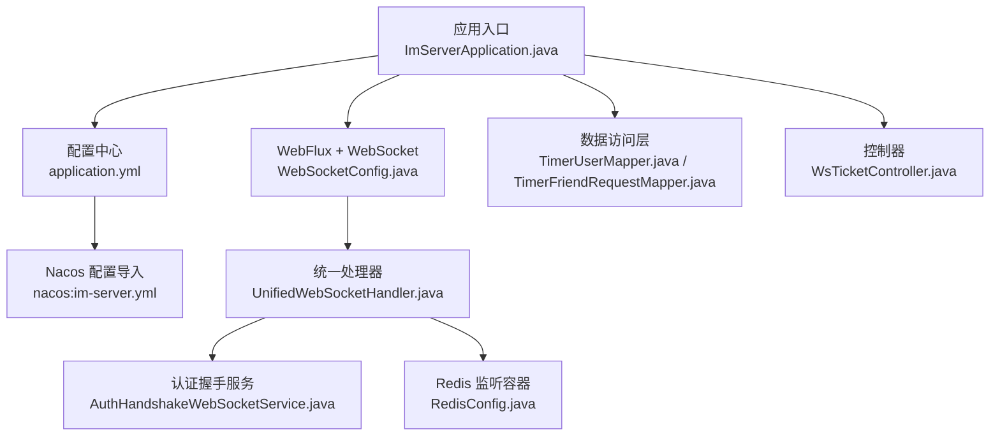
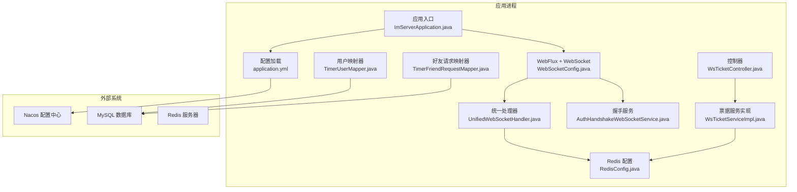
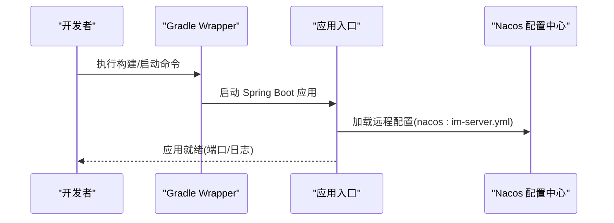
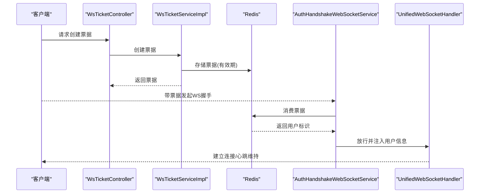
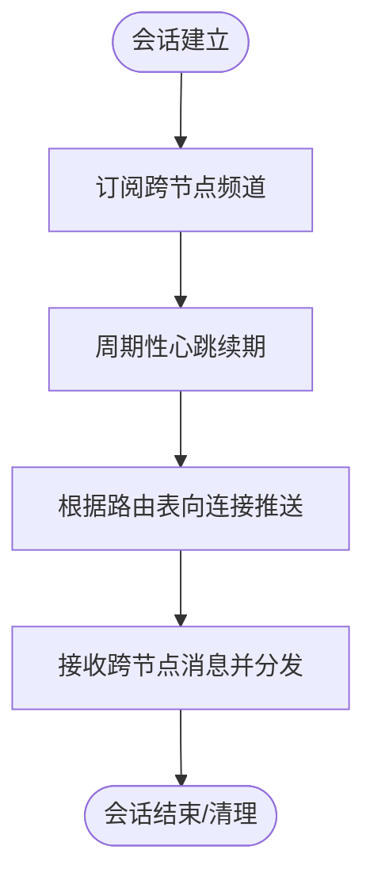
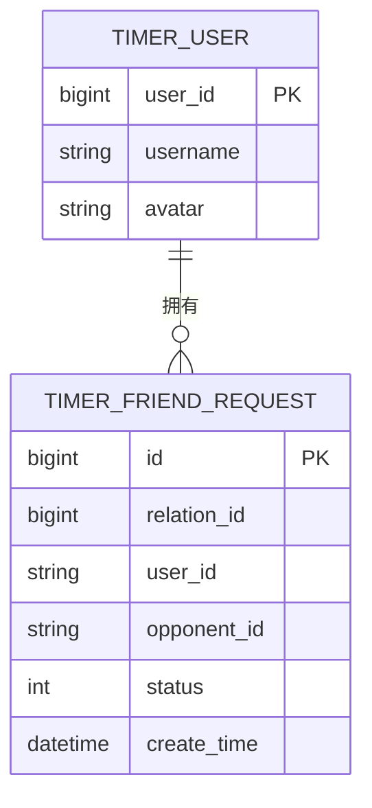
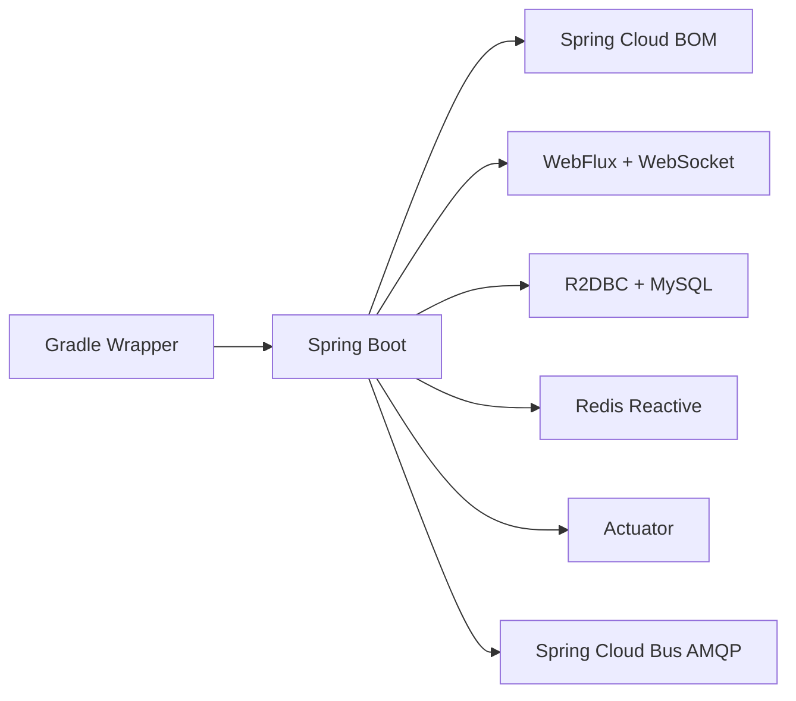

# 快速开始

<cite>
**本文引用的文件**
- [ImServerApplication.java](file://src/main/java/com/rivers/im/ImServerApplication.java)
- [application.yml](file://src/main/resources/application.yml)
- [build.gradle](file://build.gradle)
- [settings.gradle](file://settings.gradle)
- [gradle-wrapper.properties](file://gradle/wrapper/gradle-wrapper.properties)
- [RedisConfig.java](file://src/main/java/com/rivers/im/config/RedisConfig.java)
- [WebSocketConfig.java](file://src/main/java/com/rivers/im/config/WebSocketConfig.java)
- [UnifiedWebSocketHandler.java](file://src/main/java/com/rivers/im/config/UnifiedWebSocketHandler.java)
- [AuthHandshakeWebSocketService.java](file://src/main/java/com/rivers/im/service/impl/AuthHandshakeWebSocketService.java)
- [WsTicketServiceImpl.java](file://src/main/java/com/rivers/im/service/impl/WsTicketServiceImpl.java)
- [TimerUserMapper.java](file://src/main/java/com/rivers/im/mapper/TimerUserMapper.java)
- [TimerFriendRequestMapper.java](file://src/main/java/com/rivers/im/mapper/TimerFriendRequestMapper.java)
- [WsTicketController.java](file://src/main/java/com/rivers/im/controller/WsTicketController.java)
</cite>

## 目录
1. [简介](#简介)
2. [项目结构](#项目结构)
3. [核心组件](#核心组件)
4. [架构总览](#架构总览)
5. [详细组件分析](#详细组件分析)
6. [依赖分析](#依赖分析)
7. [性能考虑](#性能考虑)
8. [故障排查指南](#故障排查指南)
9. [结论](#结论)
10. [附录](#附录)

## 简介
本指南面向首次接触 IM 服务器的开发者，帮助你在本地快速完成环境准备、项目构建与启动，并通过最小化配置验证服务可用性。项目基于 Spring Boot 与响应式 WebFlux 构建，采用 R2DBC 连接 MySQL、Redis 实现会话路由与消息推送，并通过 Nacos 进行集中配置管理。

## 项目结构
- 应用入口位于应用根包下，负责启动 Spring Boot 应用。
- 配置集中在资源目录下的配置文件中，支持从 Nacos 动态加载。
- 核心功能模块包括：
  - WebSocket 配置与统一处理器
  - 认证握手服务（基于票据）
  - Redis 响应式配置与消息监听容器
  - 数据访问层（R2DBC + Reactor）
  - 控制器（用于票据签发等）

**图表来源**
- [ImServerApplication.java:1-14](file://src/main/java/com/rivers/im/ImServerApplication.java#L1-L14)
- [application.yml:1-14](file://src/main/resources/application.yml#L1-L14)
- [WebSocketConfig.java:1-35](file://src/main/java/com/rivers/im/config/WebSocketConfig.java#L1-L35)
- [UnifiedWebSocketHandler.java:1-138](file://src/main/java/com/rivers/im/config/UnifiedWebSocketHandler.java#L1-L138)
- [AuthHandshakeWebSocketService.java:1-73](file://src/main/java/com/rivers/im/service/impl/AuthHandshakeWebSocketService.java#L1-L73)
- [RedisConfig.java:1-18](file://src/main/java/com/rivers/im/config/RedisConfig.java#L1-L18)
- [TimerUserMapper.java:1-18](file://src/main/java/com/rivers/im/mapper/TimerUserMapper.java#L1-L18)
- [TimerFriendRequestMapper.java:1-45](file://src/main/java/com/rivers/im/mapper/TimerFriendRequestMapper.java#L1-L45)
- [WsTicketController.java:1-26](file://src/main/java/com/rivers/im/controller/WsTicketController.java#L1-L26)

**章节来源**
- [ImServerApplication.java:1-14](file://src/main/java/com/rivers/im/ImServerApplication.java#L1-L14)
- [application.yml:1-14](file://src/main/resources/application.yml#L1-L14)
- [build.gradle:1-64](file://build.gradle#L1-L64)
- [settings.gradle:1-2](file://settings.gradle#L1-L2)

## 核心组件
- 应用入口与启动
  - 应用入口类负责启动 Spring Boot 应用上下文。
  - 参考路径：[应用入口:1-14](file://src/main/java/com/rivers/im/ImServerApplication.java#L1-L14)
- 配置中心与导入
  - 通过配置文件声明 Nacos 地址与文件扩展名，并导入远程配置。
  - 参考路径：[配置文件:1-14](file://src/main/resources/application.yml#L1-L14)
- 响应式 Web 与 WebSocket
  - 使用 WebFlux 提供响应式 HTTP 与 WebSocket 支持；统一处理器负责心跳、路由与跨节点消息分发。
  - 参考路径：[WebSocket 配置:1-35](file://src/main/java/com/rivers/im/config/WebSocketConfig.java#L1-L35)、[统一处理器:1-138](file://src/main/java/com/rivers/im/config/UnifiedWebSocketHandler.java#L1-L138)
- 认证握手与票据
  - 握手阶段通过票据校验用户身份，票据由服务端签发并在有效期内消费一次。
  - 参考路径：[认证握手服务:1-73](file://src/main/java/com/rivers/im/service/impl/AuthHandshakeWebSocketService.java#L1-L73)、[票据服务实现:1-54](file://src/main/java/com/rivers/im/service/impl/WsTicketServiceImpl.java#L1-L54)、[票据控制器:1-26](file://src/main/java/com/rivers/im/controller/WsTicketController.java#L1-L26)
- Redis 集成
  - 提供响应式 Redis 连接工厂与消息监听容器，用于会话路由与跨节点消息订阅。
  - 参考路径：[Redis 配置:1-18](file://src/main/java/com/rivers/im/config/RedisConfig.java#L1-L18)
- 数据访问层
  - 基于 R2DBC 的响应式仓库接口，支持查询与分页等场景。
  - 参考路径：[用户映射器:1-18](file://src/main/java/com/rivers/im/mapper/TimerUserMapper.java#L1-L18)、[好友请求映射器:1-45](file://src/main/java/com/rivers/im/mapper/TimerFriendRequestMapper.java#L1-L45)

**章节来源**
- [ImServerApplication.java:1-14](file://src/main/java/com/rivers/im/ImServerApplication.java#L1-L14)
- [application.yml:1-14](file://src/main/resources/application.yml#L1-L14)
- [WebSocketConfig.java:1-35](file://src/main/java/com/rivers/im/config/WebSocketConfig.java#L1-L35)
- [UnifiedWebSocketHandler.java:1-138](file://src/main/java/com/rivers/im/config/UnifiedWebSocketHandler.java#L1-L138)
- [AuthHandshakeWebSocketService.java:1-73](file://src/main/java/com/rivers/im/service/impl/AuthHandshakeWebSocketService.java#L1-L73)
- [WsTicketServiceImpl.java:1-54](file://src/main/java/com/rivers/im/service/impl/WsTicketServiceImpl.java#L1-L54)
- [WsTicketController.java:1-26](file://src/main/java/com/rivers/im/controller/WsTicketController.java#L1-L26)
- [RedisConfig.java:1-18](file://src/main/java/com/rivers/im/config/RedisConfig.java#L1-L18)
- [TimerUserMapper.java:1-18](file://src/main/java/com/rivers/im/mapper/TimerUserMapper.java#L1-L18)
- [TimerFriendRequestMapper.java:1-45](file://src/main/java/com/rivers/im/mapper/TimerFriendRequestMapper.java#L1-L45)

## 架构总览
下图展示了应用启动到 WebSocket 握手与消息分发的关键流程，以及与外部系统的交互点（Nacos、MySQL、Redis）。

**图表来源**
- [ImServerApplication.java:1-14](file://src/main/java/com/rivers/im/ImServerApplication.java#L1-L14)
- [application.yml:1-14](file://src/main/resources/application.yml#L1-L14)
- [WebSocketConfig.java:1-35](file://src/main/java/com/rivers/im/config/WebSocketConfig.java#L1-L35)
- [UnifiedWebSocketHandler.java:1-138](file://src/main/java/com/rivers/im/config/UnifiedWebSocketHandler.java#L1-L138)
- [AuthHandshakeWebSocketService.java:1-73](file://src/main/java/com/rivers/im/service/impl/AuthHandshakeWebSocketService.java#L1-L73)
- [RedisConfig.java:1-18](file://src/main/java/com/rivers/im/config/RedisConfig.java#L1-L18)
- [WsTicketController.java:1-26](file://src/main/java/com/rivers/im/controller/WsTicketController.java#L1-L26)
- [WsTicketServiceImpl.java:1-54](file://src/main/java/com/rivers/im/service/impl/WsTicketServiceImpl.java#L1-L54)
- [TimerUserMapper.java:1-18](file://src/main/java/com/rivers/im/mapper/TimerUserMapper.java#L1-L18)
- [TimerFriendRequestMapper.java:1-45](file://src/main/java/com/rivers/im/mapper/TimerFriendRequestMapper.java#L1-L45)

## 详细组件分析

### 组件一：应用启动与配置加载
- 启动流程
  - 应用入口负责启动 Spring Boot 应用上下文。
  - 参考路径：[应用入口:1-14](file://src/main/java/com/rivers/im/ImServerApplication.java#L1-L14)
- 配置导入
  - 通过配置文件声明 Nacos 地址与文件扩展名，并导入远程配置。
  - 参考路径：[配置文件:1-14](file://src/main/resources/application.yml#L1-L14)

**图表来源**
- [gradle-wrapper.properties:1-8](file://gradle/wrapper/gradle-wrapper.properties#L1-L8)
- [ImServerApplication.java:1-14](file://src/main/java/com/rivers/im/ImServerApplication.java#L1-L14)
- [application.yml:1-14](file://src/main/resources/application.yml#L1-L14)

**章节来源**
- [ImServerApplication.java:1-14](file://src/main/java/com/rivers/im/ImServerApplication.java#L1-L14)
- [application.yml:1-14](file://src/main/resources/application.yml#L1-L14)
- [gradle-wrapper.properties:1-8](file://gradle/wrapper/gradle-wrapper.properties#L1-L8)

### 组件二：WebSocket 握手与认证
- 握手流程
  - 客户端携带票据发起 WebSocket 握手，服务端校验票据有效性后放行。
  - 参考路径：[认证握手服务:1-73](file://src/main/java/com/rivers/im/service/impl/AuthHandshakeWebSocketService.java#L1-L73)
- 票据签发与消费
  - 控制器对外提供票据签发接口；票据在 Redis 中短期存储，消费后失效。
  - 参考路径：[票据控制器:1-26](file://src/main/java/com/rivers/im/controller/WsTicketController.java#L1-L26)、[票据服务实现:1-54](file://src/main/java/com/rivers/im/service/impl/WsTicketServiceImpl.java#L1-L54)

**图表来源**
- [WsTicketController.java:1-26](file://src/main/java/com/rivers/im/controller/WsTicketController.java#L1-L26)
- [WsTicketServiceImpl.java:1-54](file://src/main/java/com/rivers/im/service/impl/WsTicketServiceImpl.java#L1-L54)
- [AuthHandshakeWebSocketService.java:1-73](file://src/main/java/com/rivers/im/service/impl/AuthHandshakeWebSocketService.java#L1-L73)
- [UnifiedWebSocketHandler.java:1-138](file://src/main/java/com/rivers/im/config/UnifiedWebSocketHandler.java#L1-L138)

**章节来源**
- [WsTicketController.java:1-26](file://src/main/java/com/rivers/im/controller/WsTicketController.java#L1-L26)
- [WsTicketServiceImpl.java:1-54](file://src/main/java/com/rivers/im/service/impl/WsTicketServiceImpl.java#L1-L54)
- [AuthHandshakeWebSocketService.java:1-73](file://src/main/java/com/rivers/im/service/impl/AuthHandshakeWebSocketService.java#L1-L73)
- [UnifiedWebSocketHandler.java:1-138](file://src/main/java/com/rivers/im/config/UnifiedWebSocketHandler.java#L1-L138)

### 组件三：Redis 集成与消息监听
- 监听容器
  - 提供响应式 Redis 监听容器，用于订阅跨节点消息通道。
  - 参考路径：[Redis 配置:1-18](file://src/main/java/com/rivers/im/config/RedisConfig.java#L1-L18)
- 统一处理器
  - 在会话建立后订阅跨节点频道，维持心跳并进行消息分发。
  - 参考路径：[统一处理器:1-138](file://src/main/java/com/rivers/im/config/UnifiedWebSocketHandler.java#L1-L138)

**图表来源**
- [RedisConfig.java:1-18](file://src/main/java/com/rivers/im/config/RedisConfig.java#L1-L18)
- [UnifiedWebSocketHandler.java:1-138](file://src/main/java/com/rivers/im/config/UnifiedWebSocketHandler.java#L1-L138)

**章节来源**
- [RedisConfig.java:1-18](file://src/main/java/com/rivers/im/config/RedisConfig.java#L1-L18)
- [UnifiedWebSocketHandler.java:1-138](file://src/main/java/com/rivers/im/config/UnifiedWebSocketHandler.java#L1-L138)

### 组件四：数据访问层（R2DBC）
- 用户查询
  - 支持按用户 ID 列表批量查询用户信息。
  - 参考路径：[用户映射器:1-18](file://src/main/java/com/rivers/im/mapper/TimerUserMapper.java#L1-L18)
- 好友请求管理
  - 支持按关系 ID 更新状态、检查待处理请求、分页查询等。
  - 参考路径：[好友请求映射器:1-45](file://src/main/java/com/rivers/im/mapper/TimerFriendRequestMapper.java#L1-L45)

**图表来源**
- [TimerUserMapper.java:1-18](file://src/main/java/com/rivers/im/mapper/TimerUserMapper.java#L1-L18)
- [TimerFriendRequestMapper.java:1-45](file://src/main/java/com/rivers/im/mapper/TimerFriendRequestMapper.java#L1-L45)

**章节来源**
- [TimerUserMapper.java:1-18](file://src/main/java/com/rivers/im/mapper/TimerUserMapper.java#L1-L18)
- [TimerFriendRequestMapper.java:1-45](file://src/main/java/com/rivers/im/mapper/TimerFriendRequestMapper.java#L1-L45)

## 依赖分析
- 构建工具与版本
  - 使用 Gradle Wrapper 与指定版本，确保团队一致性。
  - 参考路径：[Gradle Wrapper 属性:1-8](file://gradle/wrapper/gradle-wrapper.properties#L1-L8)
- 依赖管理
  - Spring Boot 与 Spring Cloud 版本通过 BOM 管理，确保兼容性。
  - 参考路径：[构建脚本:1-64](file://build.gradle#L1-L64)
- 关键依赖
  - WebFlux、WebSocket、R2DBC、Redis Reactive、Actuator、AMQP 总线等。
  - 参考路径：[构建脚本:31-45](file://build.gradle#L31-L45)

**图表来源**
- [gradle-wrapper.properties:1-8](file://gradle/wrapper/gradle-wrapper.properties#L1-L8)
- [build.gradle:1-64](file://build.gradle#L1-L64)

**章节来源**
- [gradle-wrapper.properties:1-8](file://gradle/wrapper/gradle-wrapper.properties#L1-L8)
- [build.gradle:1-64](file://build.gradle#L1-L64)

## 性能考虑
- 响应式模型
  - 采用 WebFlux 与 R2DBC，适合高并发低延迟场景；注意避免阻塞操作。
- Redis 路由与心跳
  - 通过心跳续期与哈希路由表提升连接稳定性与可扩展性。
- 票据时效
  - 票据有效期短、消费即失效，降低重放风险并减少缓存压力。

## 故障排查指南
- 端口占用
  - 默认端口为 9000，若被占用请调整配置或释放端口。
  - 参考路径：[配置文件:13-14](file://src/main/resources/application.yml#L13-L14)
- Nacos 连接失败
  - 确认 Nacos 地址与文件扩展名正确，且远程配置存在。
  - 参考路径：[配置文件:4-10](file://src/main/resources/application.yml#L4-L10)
- Redis 连接异常
  - 检查 Redis 服务可达性与认证设置；确认监听容器正常启动。
  - 参考路径：[Redis 配置:1-18](file://src/main/java/com/rivers/im/config/RedisConfig.java#L1-L18)、[统一处理器:67-77](file://src/main/java/com/rivers/im/config/UnifiedWebSocketHandler.java#L67-L77)
- MySQL 连接问题
  - 确认驱动与连接参数正确；R2DBC 需要兼容的驱动与方言。
  - 参考路径：[构建脚本:37-42](file://build.gradle#L37-L42)、[用户映射器:1-18](file://src/main/java/com/rivers/im/mapper/TimerUserMapper.java#L1-L18)
- WebSocket 握手失败
  - 检查票据是否有效且未过期；确认握手服务正确注入与调用。
  - 参考路径：[认证握手服务:26-55](file://src/main/java/com/rivers/im/service/impl/AuthHandshakeWebSocketService.java#L26-L55)、[票据服务实现:31-48](file://src/main/java/com/rivers/im/service/impl/WsTicketServiceImpl.java#L31-L48)

**章节来源**
- [application.yml:13-14](file://src/main/resources/application.yml#L13-L14)
- [application.yml:4-10](file://src/main/resources/application.yml#L4-L10)
- [RedisConfig.java:1-18](file://src/main/java/com/rivers/im/config/RedisConfig.java#L1-L18)
- [UnifiedWebSocketHandler.java:67-77](file://src/main/java/com/rivers/im/config/UnifiedWebSocketHandler.java#L67-L77)
- [build.gradle:37-42](file://build.gradle#L37-L42)
- [TimerUserMapper.java:1-18](file://src/main/java/com/rivers/im/mapper/TimerUserMapper.java#L1-L18)
- [AuthHandshakeWebSocketService.java:26-55](file://src/main/java/com/rivers/im/service/impl/AuthHandshakeWebSocketService.java#L26-L55)
- [WsTicketServiceImpl.java:31-48](file://src/main/java/com/rivers/im/service/impl/WsTicketServiceImpl.java#L31-L48)

## 结论
通过本指南，你可以在本地完成环境准备、项目构建与启动，并理解应用的核心组件与关键流程。建议在开发过程中结合 Nacos 的动态配置能力与 Redis 的高性能特性，逐步完善业务模块与监控指标。

## 附录

### 环境要求
- Java 版本
  - 构建脚本声明了工具链语言版本，请确保本地 JDK 符合要求。
  - 参考路径：[构建脚本:11-15](file://build.gradle#L11-L15)
- 构建工具
  - 使用 Gradle Wrapper，无需手动安装 Gradle。
  - 参考路径：[Gradle Wrapper 属性:1-8](file://gradle/wrapper/gradle-wrapper.properties#L1-L8)

**章节来源**
- [build.gradle:11-15](file://build.gradle#L11-L15)
- [gradle-wrapper.properties:1-8](file://gradle/wrapper/gradle-wrapper.properties#L1-L8)

### 安装与部署步骤
- 克隆项目
  - 使用 Git 克隆仓库至本地工作目录。
- 依赖安装
  - 使用 Gradle Wrapper 下载依赖并编译项目。
  - 参考路径：[Gradle Wrapper 属性:1-8](file://gradle/wrapper/gradle-wrapper.properties#L1-L8)
- 数据库初始化
  - 准备 MySQL 数据库，确保 R2DBC 驱动与连接参数正确。
  - 参考路径：[构建脚本:37-42](file://build.gradle#L37-L42)、[用户映射器:1-18](file://src/main/java/com/rivers/im/mapper/TimerUserMapper.java#L1-L18)
- Redis 配置
  - 启动 Redis 服务，确保应用可连接；确认监听容器可用。
  - 参考路径：[Redis 配置:1-18](file://src/main/java/com/rivers/im/config/RedisConfig.java#L1-L18)、[统一处理器:67-77](file://src/main/java/com/rivers/im/config/UnifiedWebSocketHandler.java#L67-L77)
- Nacos 配置
  - 启动 Nacos 并创建配置文件 im-server.yml；确认地址与扩展名正确。
  - 参考路径：[配置文件:4-10](file://src/main/resources/application.yml#L4-L10)
- 启动服务
  - 通过应用入口启动 Spring Boot 应用，观察日志输出。
  - 参考路径：[应用入口:1-14](file://src/main/java/com/rivers/im/ImServerApplication.java#L1-L14)
- 验证方法
  - 通过票据控制器获取票据，再使用该票据建立 WebSocket 连接，观察握手与心跳日志。
  - 参考路径：[票据控制器:1-26](file://src/main/java/com/rivers/im/controller/WsTicketController.java#L1-L26)、[认证握手服务:26-55](file://src/main/java/com/rivers/im/service/impl/AuthHandshakeWebSocketService.java#L26-L55)、[统一处理器:111-122](file://src/main/java/com/rivers/im/config/UnifiedWebSocketHandler.java#L111-L122)

**章节来源**
- [gradle-wrapper.properties:1-8](file://gradle/wrapper/gradle-wrapper.properties#L1-L8)
- [build.gradle:37-42](file://build.gradle#L37-L42)
- [TimerUserMapper.java:1-18](file://src/main/java/com/rivers/im/mapper/TimerUserMapper.java#L1-L18)
- [RedisConfig.java:1-18](file://src/main/java/com/rivers/im/config/RedisConfig.java#L1-L18)
- [UnifiedWebSocketHandler.java:67-77](file://src/main/java/com/rivers/im/config/UnifiedWebSocketHandler.java#L67-L77)
- [application.yml:4-10](file://src/main/resources/application.yml#L4-L10)
- [ImServerApplication.java:1-14](file://src/main/java/com/rivers/im/ImServerApplication.java#L1-L14)
- [WsTicketController.java:1-26](file://src/main/java/com/rivers/im/controller/WsTicketController.java#L1-L26)
- [AuthHandshakeWebSocketService.java:26-55](file://src/main/java/com/rivers/im/service/impl/AuthHandshakeWebSocketService.java#L26-L55)
- [UnifiedWebSocketHandler.java:111-122](file://src/main/java/com/rivers/im/config/UnifiedWebSocketHandler.java#L111-L122)