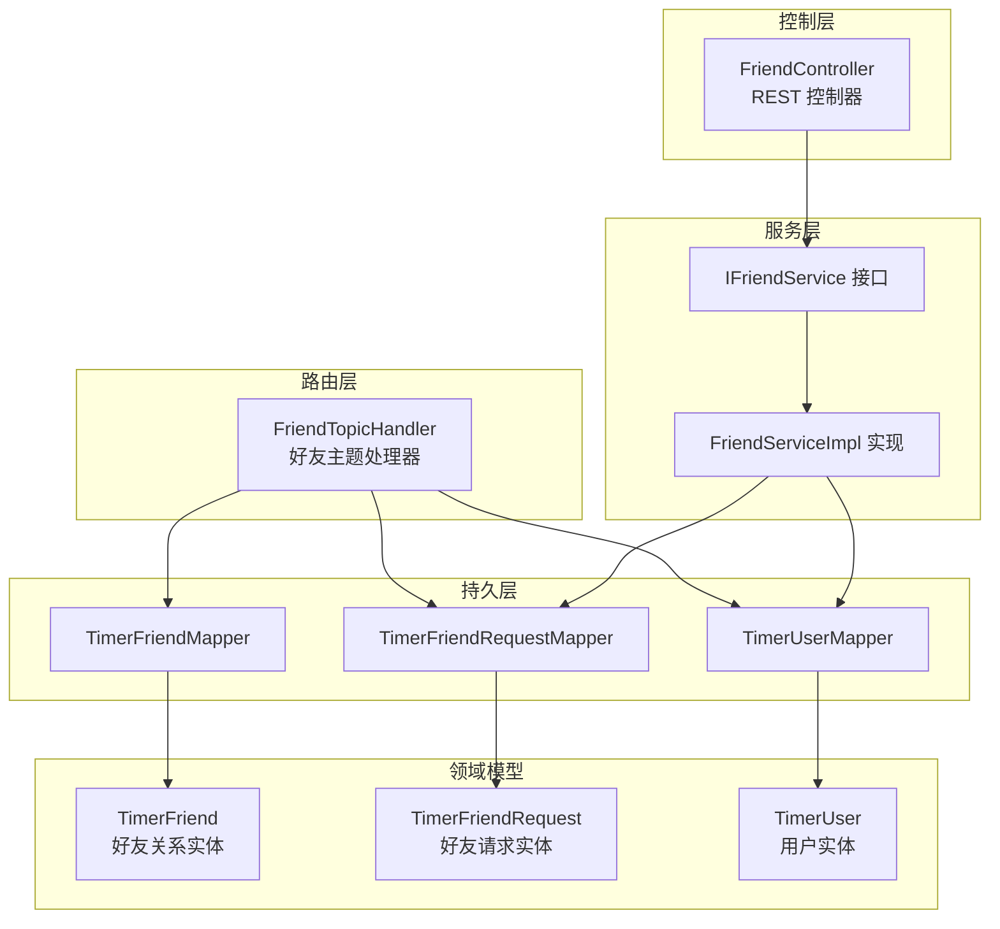
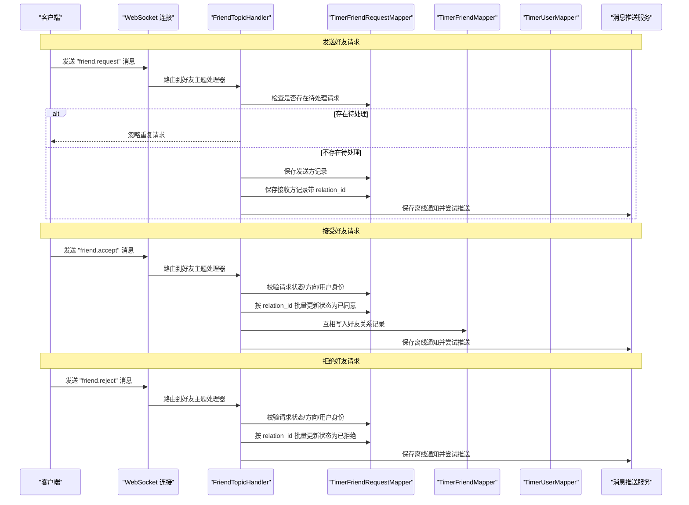
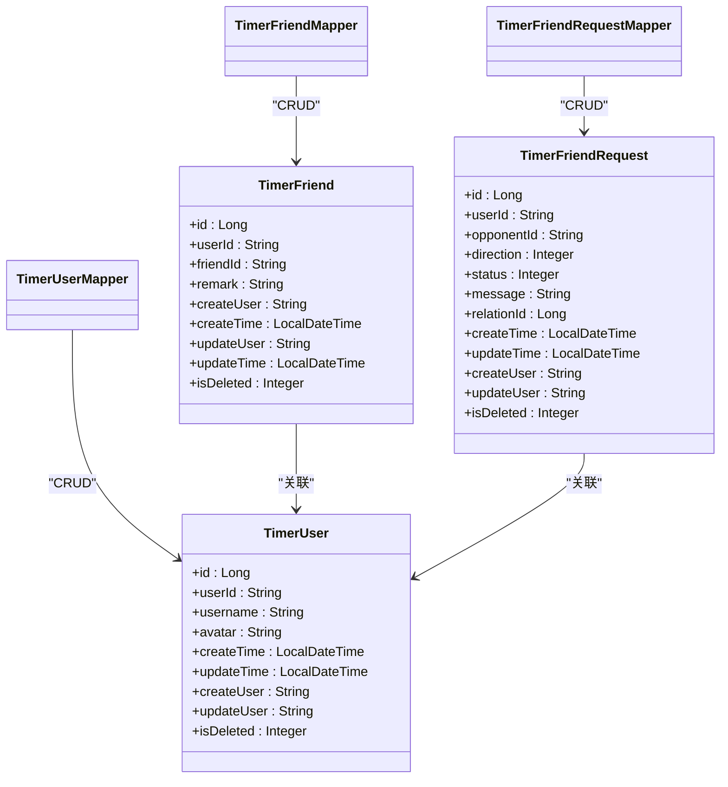

# 好友关系模型

<cite>
**本文引用的文件列表**
- [TimerFriend.java](file://src/main/java/com/rivers/im/entity/TimerFriend.java)
- [TimerFriendRequest.java](file://src/main/java/com/rivers/im/entity/TimerFriendRequest.java)
- [TimerUser.java](file://src/main/java/com/rivers/im/entity/TimerUser.java)
- [TimerFriendMapper.java](file://src/main/java/com/rivers/im/mapper/TimerFriendMapper.java)
- [TimerFriendRequestMapper.java](file://src/main/java/com/rivers/im/mapper/TimerFriendRequestMapper.java)
- [TimerUserMapper.java](file://src/main/java/com/rivers/im/mapper/TimerUserMapper.java)
- [FriendController.java](file://src/main/java/com/rivers/im/controller/FriendController.java)
- [FriendServiceImpl.java](file://src/main/java/com/rivers/im/service/impl/FriendServiceImpl.java)
- [IFriendService.java](file://src/main/java/com/rivers/im/service/IFriendService.java)
- [FriendTopicHandler.java](file://src/main/java/com/rivers/im/router/FriendTopicHandler.java)
- [application.yml](file://src/main/resources/application.yml)
- [ImServerApplication.java](file://src/main/java/com/rivers/im/ImServerApplication.java)
</cite>

## 目录
1. [简介](#简介)
2. [项目结构](#项目结构)
3. [核心组件](#核心组件)
4. [架构总览](#架构总览)
5. [详细组件分析](#详细组件分析)
6. [依赖关系分析](#依赖关系分析)
7. [性能考量](#性能考量)
8. [故障排查指南](#故障排查指南)
9. [结论](#结论)
10. [附录](#附录)

## 简介
本文件系统性梳理“好友关系模型”的设计与实现，重点围绕 TimerFriend 实体的字段定义、业务语义、状态流转与生命周期管理，以及与用户模型、请求模型之间的关联关系。同时给出好友关系的建立、查询、状态更新与解除的典型流程与最佳实践，并结合现有代码路径提供可操作的参考示例。

## 项目结构
IM 服务采用分层架构：控制器层负责对外接口；服务层封装业务逻辑；路由处理器处理实时消息；映射器层对接数据库；实体层描述数据模型。与好友关系相关的关键模块如下图所示。

图表来源
- [FriendController.java:1-28](file://src/main/java/com/rivers/im/controller/FriendController.java#L1-28)
- [FriendServiceImpl.java:1-106](file://src/main/java/com/rivers/im/service/impl/FriendServiceImpl.java#L1-106)
- [FriendTopicHandler.java:1-261](file://src/main/java/com/rivers/im/router/FriendTopicHandler.java#L1-261)
- [TimerFriendMapper.java:1-8](file://src/main/java/com/rivers/im/mapper/TimerFriendMapper.java#L1-8)
- [TimerFriendRequestMapper.java:1-45](file://src/main/java/com/rivers/im/mapper/TimerFriendRequestMapper.java#L1-45)
- [TimerUserMapper.java:1-19](file://src/main/java/com/rivers/im/mapper/TimerUserMapper.java#L1-19)
- [TimerFriend.java:1-86](file://src/main/java/com/rivers/im/entity/TimerFriend.java#L1-86)
- [TimerFriendRequest.java:1-101](file://src/main/java/com/rivers/im/entity/TimerFriendRequest.java#L1-101)
- [TimerUser.java:1-111](file://src/main/java/com/rivers/im/entity/TimerUser.java#L1-111)

章节来源
- [application.yml:1-14](file://src/main/resources/application.yml#L1-14)
- [ImServerApplication.java:1-14](file://src/main/java/com/rivers/im/ImServerApplication.java#L1-14)

## 核心组件
- TimerFriend：好友关系实体，记录双方用户 ID、备注、创建/修改信息及删除标记。
- TimerFriendRequest：好友请求实体，包含请求方向、状态、消息、关联 ID、时间戳等。
- TimerUser：用户实体，用于好友请求分页返回时补充对方用户的基本信息。
- TimerFriendMapper：好友关系的响应式 CRUD 映射器。
- TimerFriendRequestMapper：好友请求的响应式 CRUD 映射器，含按关联 ID 批量更新状态、检查待处理请求、分页查询等方法。
- TimerUserMapper：用户信息的响应式查询映射器。
- FriendController：对外暴露好友请求分页查询接口。
- FriendServiceImpl：实现好友请求分页查询的业务逻辑。
- FriendTopicHandler：处理好友主题的实时消息，支持发送请求、接受、拒绝等操作，并在成功后持久化离线通知与尝试实时推送。

章节来源
- [TimerFriend.java:1-86](file://src/main/java/com/rivers/im/entity/TimerFriend.java#L1-86)
- [TimerFriendRequest.java:1-101](file://src/main/java/com/rivers/im/entity/TimerFriendRequest.java#L1-101)
- [TimerUser.java:1-111](file://src/main/java/com/rivers/im/entity/TimerUser.java#L1-111)
- [TimerFriendMapper.java:1-8](file://src/main/java/com/rivers/im/mapper/TimerFriendMapper.java#L1-8)
- [TimerFriendRequestMapper.java:1-45](file://src/main/java/com/rivers/im/mapper/TimerFriendRequestMapper.java#L1-45)
- [TimerUserMapper.java:1-19](file://src/main/java/com/rivers/im/mapper/TimerUserMapper.java#L1-19)
- [FriendController.java:1-28](file://src/main/java/com/rivers/im/controller/FriendController.java#L1-28)
- [FriendServiceImpl.java:1-106](file://src/main/java/com/rivers/im/service/impl/FriendServiceImpl.java#L1-106)
- [FriendTopicHandler.java:1-261](file://src/main/java/com/rivers/im/router/FriendTopicHandler.java#L1-261)

## 架构总览
下图展示好友关系从请求发起到状态变更的端到端流程，涵盖请求、接受、拒绝三个关键动作，以及与用户信息的联动。

图表来源
- [FriendTopicHandler.java:72-205](file://src/main/java/com/rivers/im/router/FriendTopicHandler.java#L72-205)
- [TimerFriendRequestMapper.java:14-44](file://src/main/java/com/rivers/im/mapper/TimerFriendRequestMapper.java#L14-44)
- [TimerFriendMapper.java:1-8](file://src/main/java/com/rivers/im/mapper/TimerFriendMapper.java#L1-8)
- [TimerUserMapper.java:1-19](file://src/main/java/com/rivers/im/mapper/TimerUserMapper.java#L1-19)

## 详细组件分析

### TimerFriend 实体
- 字段与含义
  - id：主键标识
  - userId：用户ID（关系中的“我”）
  - friendId：好友ID（关系中的“他/她”）
  - remark：备注名（可为空）
  - createUser/updateUser：创建/修改人
  - createTime/updateTime：创建/修改时间
  - isDeleted：逻辑删除标记
- 关系与约束
  - 一对多：一个用户可以拥有多个好友关系记录
  - 唯一性：建议在数据库层面为 (userId, friendId) 建立唯一索引，避免重复好友关系
  - 互惠性：当 A 添加 B 为好友时，应同时生成 B -> A 的互惠记录
- 生命周期
  - 创建：接受好友请求后写入
  - 更新：备注名等元数据变更
  - 删除：逻辑删除（isDeleted=1），或在需要时物理删除
- 数据一致性
  - 接受请求时通过事务或原子操作确保双方记录同时写入
  - 删除时统一走逻辑删除策略，保留审计轨迹

章节来源
- [TimerFriend.java:23-86](file://src/main/java/com/rivers/im/entity/TimerFriend.java#L23-86)

### TimerFriendRequest 实体与状态机
- 字段与含义
  - id：主键标识
  - userId/opponentId：请求发起方与接收方
  - direction：请求方向（SENT/RECEIVED）
  - status：请求状态（PENDING/ACCEPTED/REJECTED）
  - message：附言
  - relationId：请求关联 ID，用于成对记录的状态批量同步
  - createTime/updateTime/createUser/updateUser/isDeleted：时间与审计字段
- 状态流转
  - PENDING -> ACCEPTED：接收方接受
  - PENDING -> REJECTED：接收方拒绝
  - 已处理状态不可重复操作
- 关联关系
  - relationId：成对记录（发送方/接收方）共享同一 relationId，便于批量更新状态
  - 与 TimerFriend：接受后写入双方好友关系记录

章节来源
- [TimerFriendRequest.java:14-101](file://src/main/java/com/rivers/im/entity/TimerFriendRequest.java#L14-101)
- [TimerFriendRequestMapper.java:14-44](file://src/main/java/com/rivers/im/mapper/TimerFriendRequestMapper.java#L14-44)

### TimerUser 实体
- 字段与含义
  - 包含用户基础信息（如 user_id、username、avatar 等）
- 在好友请求分页中的作用
  - 通过用户 ID 列表批量查询，填充请求列表中对方用户的头像与昵称

章节来源
- [TimerUser.java:23-111](file://src/main/java/com/rivers/im/entity/TimerUser.java#L23-111)
- [TimerUserMapper.java:13-16](file://src/main/java/com/rivers/im/mapper/TimerUserMapper.java#L13-16)

### 好友关系生命周期与状态变更规则
- 发起请求
  - 校验目标用户非空且不等于当前用户
  - 检查是否存在未处理的双向请求，若存在则忽略
  - 生成 relationId，分别写入发送方与接收方记录
  - 保存离线通知并尝试实时推送
- 接受请求
  - 校验请求状态为 PENDING、方向为 RECEIVED、且当前用户为目标用户
  - 按 relationId 批量更新状态为 ACCEPTED
  - 互相写入 TimerFriend 记录
  - 保存离线通知并尝试实时推送
- 拒绝请求
  - 校验请求状态为 PENDING、方向为 RECEIVED、且当前用户为目标用户
  - 按 relationId 批量更新状态为 REJECTED
  - 保存离线通知并尝试实时推送
- 数据一致性保障
  - 使用 relationId 成对记录，确保状态变更原子性
  - 接受请求时，先更新状态再写入好友关系，避免中间态不一致
  - 离线通知与实时推送采用“尽力而为”，失败仅记录日志

章节来源
- [FriendTopicHandler.java:72-205](file://src/main/java/com/rivers/im/router/FriendTopicHandler.java#L72-205)
- [TimerFriendRequestMapper.java:14-44](file://src/main/java/com/rivers/im/mapper/TimerFriendRequestMapper.java#L14-44)
- [TimerFriendMapper.java:1-8](file://src/main/java/com/rivers/im/mapper/TimerFriendMapper.java#L1-8)

### 好友关系查询、状态更新与关系解除

#### 查询好友请求分页
- 入口：FriendController.getFriendRequestPage
- 流程：
  - 解析分页参数（pageSize、lastCreateTime、lastId）
  - 通过 TimerFriendRequestMapper 分页查询当前用户的请求记录
  - 使用 TimerUserMapper 批量查询对方用户信息，组装返回结果
- 返回结构：包含是否有更多、请求列表（含状态描述、方向描述、时间等）

章节来源
- [FriendController.java:23-26](file://src/main/java/com/rivers/im/controller/FriendController.java#L23-26)
- [FriendServiceImpl.java:45-104](file://src/main/java/com/rivers/im/service/impl/FriendServiceImpl.java#L45-104)
- [TimerFriendRequestMapper.java:32-44](file://src/main/java/com/rivers/im/mapper/TimerFriendRequestMapper.java#L32-44)
- [TimerUserMapper.java:13-16](file://src/main/java/com/rivers/im/mapper/TimerUserMapper.java#L13-16)

#### 状态更新（接受/拒绝）
- 接受：FriendTopicHandler.handleAccept
  - 校验请求状态、方向与用户身份
  - 按 relationId 批量更新状态为 ACCEPTED
  - 互相写入 TimerFriend 记录
  - 保存离线通知并尝试推送
- 拒绝：FriendTopicHandler.handleReject
  - 校验请求状态、方向与用户身份
  - 按 relationId 批量更新状态为 REJECTED
  - 保存离线通知并尝试推送

章节来源
- [FriendTopicHandler.java:123-205](file://src/main/java/com/rivers/im/router/FriendTopicHandler.java#L123-205)
- [TimerFriendRequestMapper.java:14-19](file://src/main/java/com/rivers/im/mapper/TimerFriendRequestMapper.java#L14-19)

#### 关系解除（扩展建议）
- 当前代码未提供直接解除好友关系的操作。建议新增：
  - 删除双方 TimerFriend 记录（逻辑删除或物理删除）
  - 清理相关聊天记录与会话缓存
  - 通知双方用户关系变更
- 注意：解除关系需考虑幂等性与一致性，建议引入事务或补偿机制

章节来源
- [TimerFriendMapper.java:1-8](file://src/main/java/com/rivers/im/mapper/TimerFriendMapper.java#L1-8)

### 好友关系模型与用户模型的关联
- 关联方式
  - TimerFriend.userId/friendId 与 TimerUser.userId 关联
  - TimerFriendRequest.userId/opponentId 与 TimerUser.userId 关联
- 查询优化
  - 好友请求分页时使用 IN 查询批量获取用户信息，减少多次往返
- 数据一致性
  - 用户信息变更（如头像、昵称）不会影响好友关系记录，但会影响展示层

章节来源
- [TimerFriend.java:39-46](file://src/main/java/com/rivers/im/entity/TimerFriend.java#L39-46)
- [TimerFriendRequest.java:20-24](file://src/main/java/com/rivers/im/entity/TimerFriendRequest.java#L20-24)
- [TimerUser.java:35-36](file://src/main/java/com/rivers/im/entity/TimerUser.java#L35-36)
- [TimerUserMapper.java:13-16](file://src/main/java/com/rivers/im/mapper/TimerUserMapper.java#L13-16)

## 依赖关系分析
- 控制器依赖服务接口，服务实现依赖映射器与用户映射器
- 路由处理器依赖请求映射器、好友映射器与用户映射器
- 映射器基于响应式框架，支持高并发读写
- 实体之间通过外键字段（用户 ID）关联，建议在数据库层建立索引提升查询性能

图表来源
- [TimerFriend.java:23-86](file://src/main/java/com/rivers/im/entity/TimerFriend.java#L23-86)
- [TimerFriendRequest.java:14-101](file://src/main/java/com/rivers/im/entity/TimerFriendRequest.java#L14-101)
- [TimerUser.java:23-111](file://src/main/java/com/rivers/im/entity/TimerUser.java#L23-111)
- [TimerFriendMapper.java:1-8](file://src/main/java/com/rivers/im/mapper/TimerFriendMapper.java#L1-8)
- [TimerFriendRequestMapper.java:1-45](file://src/main/java/com/rivers/im/mapper/TimerFriendRequestMapper.java#L1-45)
- [TimerUserMapper.java:1-19](file://src/main/java/com/rivers/im/mapper/TimerUserMapper.java#L1-19)

## 性能考量
- 分页查询
  - 使用复合条件 (create_time, id) < (...) 并按时间降序排序，避免全表扫描
  - 限制每页数量，结合 lastCreateTime 与 lastId 实现无间隙分页
- 批量查询
  - 对用户 ID 列表使用 IN 查询，减少网络往返
- 状态批量更新
  - 通过 relation_id 一次性更新双方请求状态，降低写放大
- 并发控制
  - 接受/拒绝请求前进行状态校验，防止重复处理
  - 离线通知与实时推送采用异步与“尽力而为”策略，避免阻塞主流程

章节来源
- [TimerFriendRequestMapper.java:32-44](file://src/main/java/com/rivers/im/mapper/TimerFriendRequestMapper.java#L32-44)
- [TimerUserMapper.java:13-16](file://src/main/java/com/rivers/im/mapper/TimerUserMapper.java#L13-16)
- [FriendTopicHandler.java:123-205](file://src/main/java/com/rivers/im/router/FriendTopicHandler.java#L123-205)

## 故障排查指南
- 常见问题
  - 重复请求：系统会检测并忽略已存在的待处理请求
  - 非目标用户操作：仅目标用户可接受/拒绝请求
  - 方向错误：只能对“收到的”请求执行接受/拒绝
  - 状态已处理：已同意/拒绝的请求不再允许重复操作
- 日志定位
  - 路由处理器记录详细日志，包括用户 ID、操作类型、请求 ID、异常信息
- 建议
  - 在数据库层为 (userId, friendId) 建唯一索引，避免重复好友关系
  - 对高频查询字段（如 create_time、relation_id）建立索引
  - 对外暴露的接口增加限流与重试策略，提升稳定性

章节来源
- [FriendTopicHandler.java:72-205](file://src/main/java/com/rivers/im/router/FriendTopicHandler.java#L72-205)

## 结论
本好友关系模型以 TimerFriend 为核心，配合 TimerFriendRequest 完成请求的生命周期管理，并通过 TimerUser 提升展示层体验。系统采用响应式编程与批量化更新策略，在保证一致性的同时兼顾性能与可扩展性。建议后续补充关系解除能力与更完善的审计与监控体系。

## 附录

### 字段定义与业务语义对照
- TimerFriend
  - userId：关系发起方用户 ID
  - friendId：关系被添加方用户 ID
  - remark：备注名
  - createTime/updateTime：关系建立/最近更新时间
  - isDeleted：逻辑删除标记
- TimerFriendRequest
  - direction：请求方向（SENT/RECEIVED）
  - status：请求状态（PENDING/ACCEPTED/REJECTED）
  - relationId：成对记录的关联 ID
  - message：附言
- TimerUser
  - userId/username/avatar：用户标识与展示信息

章节来源
- [TimerFriend.java:39-82](file://src/main/java/com/rivers/im/entity/TimerFriend.java#L39-82)
- [TimerFriendRequest.java:20-51](file://src/main/java/com/rivers/im/entity/TimerFriendRequest.java#L20-51)
- [TimerUser.java:35-60](file://src/main/java/com/rivers/im/entity/TimerUser.java#L35-60)