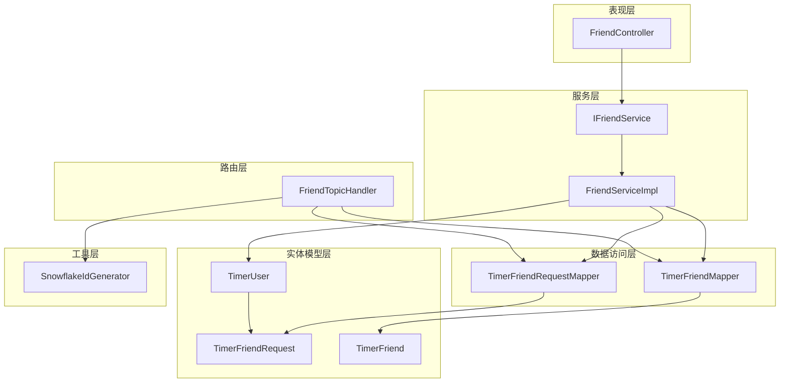
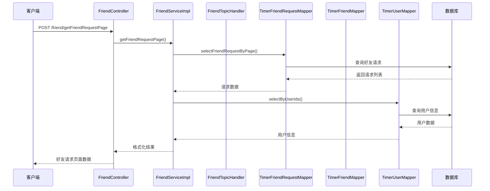
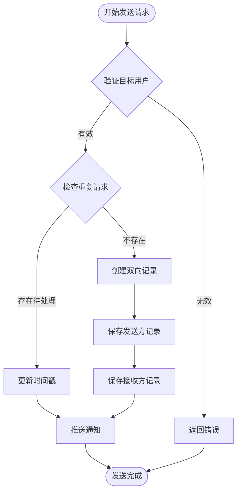
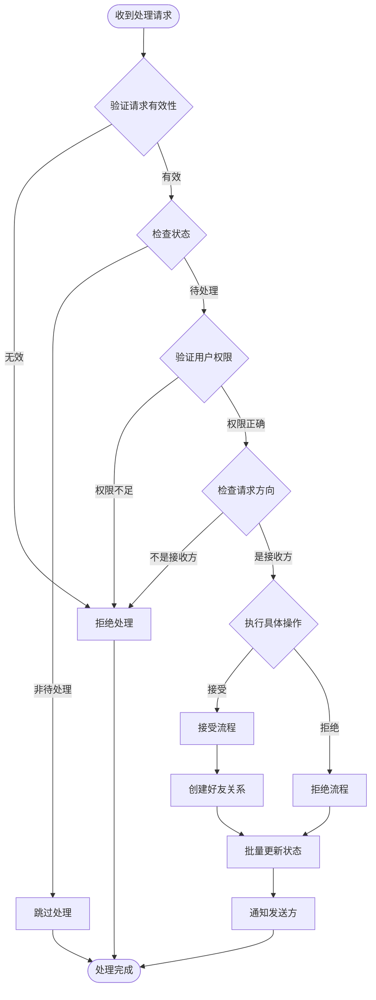
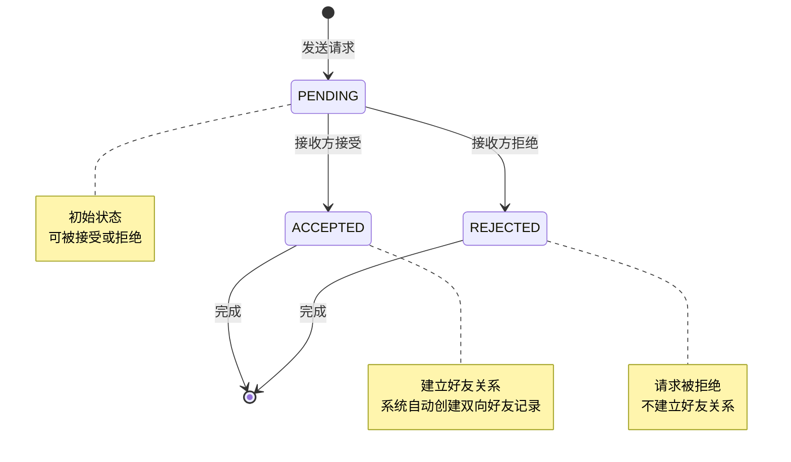
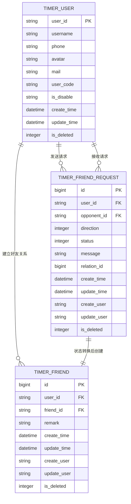
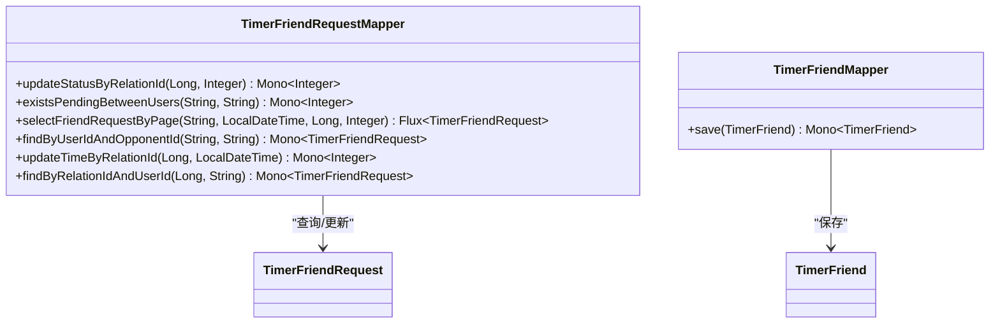
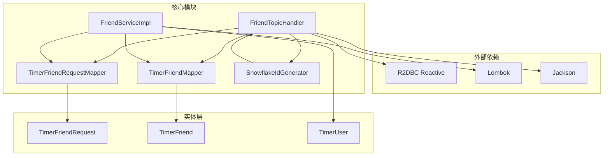
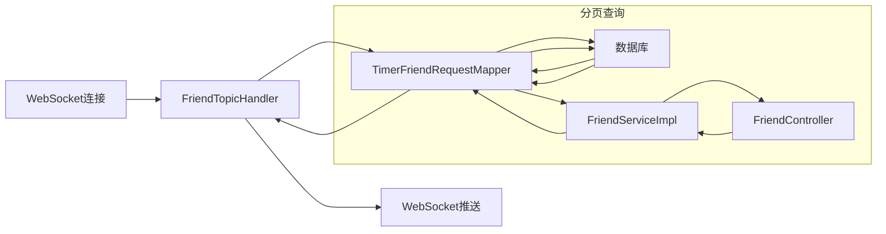

# 好友请求模型

<cite>
**本文档引用的文件**
- [TimerFriendRequest.java](file://src/main/java/com/rivers/im/entity/TimerFriendRequest.java)
- [TimerFriend.java](file://src/main/java/com/rivers/im/entity/TimerFriend.java)
- [TimerUser.java](file://src/main/java/com/rivers/im/entity/TimerUser.java)
- [TimerFriendRequestMapper.java](file://src/main/java/com/rivers/im/mapper/TimerFriendRequestMapper.java)
- [TimerFriendMapper.java](file://src/main/java/com/rivers/im/mapper/TimerFriendMapper.java)
- [FriendTopicHandler.java](file://src/main/java/com/rivers/im/router/FriendTopicHandler.java)
- [FriendServiceImpl.java](file://src/main/java/com/rivers/im/service/impl/FriendServiceImpl.java)
- [FriendController.java](file://src/main/java/com/rivers/im/controller/FriendController.java)
- [SnowflakeIdGenerator.java](file://src/main/java/com/rivers/im/util/SnowflakeIdGenerator.java)
</cite>

## 目录
1. [简介](#简介)
2. [项目结构](#项目结构)
3. [核心组件](#核心组件)
4. [架构概览](#架构概览)
5. [详细组件分析](#详细组件分析)
6. [依赖分析](#依赖分析)
7. [性能考虑](#性能考虑)
8. [故障排除指南](#故障排除指南)
9. [结论](#结论)

## 简介

本文档深入解析了IM服务器中好友请求模型的设计与实现。TimerFriendRequest实体作为好友系统的核心数据模型，负责管理用户间的好友申请、状态跟踪和生命周期管理。该模型采用写扩散策略，通过relation_id关联发送方和接收方的双向记录，实现了高效的状态同步和事务一致性保证。

## 项目结构

基于仓库结构，好友请求功能主要分布在以下层次：

**图表来源**
- [FriendController.java:1-28](file://src/main/java/com/rivers/im/controller/FriendController.java#L1-L28)
- [FriendServiceImpl.java:1-106](file://src/main/java/com/rivers/im/service/impl/FriendServiceImpl.java#L1-L106)
- [FriendTopicHandler.java:1-276](file://src/main/java/com/rivers/im/router/FriendTopicHandler.java#L1-L276)

## 核心组件

### TimerFriendRequest实体设计

TimerFriendRequest是好友请求的核心数据模型，采用Spring Data R2DBC注解映射到数据库表。

#### 主要字段设计

| 字段名 | 类型 | 描述 | 约束 |
|--------|------|------|------|
| id | Long | 主键标识 | 自增主键 |
| userId | String | 请求发起者用户ID | 非空，外键约束 |
| opponentId | String | 请求接收者用户ID | 非空，外键约束 |
| direction | Integer | 请求方向 | 1=SENT(我发出的), 2=RECEIVED(我收到的) |
| status | Integer | 请求状态 | 0=PENDING, 1=ACCEPTED, 2=REJECTED |
| message | String | 附言信息 | 最大长度限制 |
| relationId | Long | 关联ID | 唯一标识一对好友请求的双向记录 |
| createTime | LocalDateTime | 创建时间 | 自动填充 |
| updateTime | LocalDateTime | 更新时间 | 自动更新 |
| createUser | String | 创建用户 | 审计字段 |
| updateUser | String | 更新用户 | 审计字段 |
| isDeleted | Integer | 删除标记 | 0=正常, 1=删除 |

#### 枚举设计

**状态枚举(Status)**
- PENDING(0): 待处理状态，初始状态
- ACCEPTED(1): 已同意状态，建立好友关系
- REJECTED(2): 已拒绝状态，请求被拒绝

**方向枚举(Direction)**
- SENT(1): 发送方视角，表示当前用户向他人发送请求
- RECEIVED(2): 接收方视角，表示当前用户收到他人请求

**章节来源**
- [TimerFriendRequest.java:15-101](file://src/main/java/com/rivers/im/entity/TimerFriendRequest.java#L15-L101)

## 架构概览

好友请求系统采用分层架构设计，实现了请求发送、处理和状态管理的完整流程：

**图表来源**
- [FriendController.java:23-26](file://src/main/java/com/rivers/im/controller/FriendController.java#L23-L26)
- [FriendServiceImpl.java:46-104](file://src/main/java/com/rivers/im/service/impl/FriendServiceImpl.java#L46-L104)

## 详细组件分析

### 请求生命周期管理

好友请求的完整生命周期包含三个关键阶段：发送、处理和完成。

#### 发送阶段

**图表来源**
- [FriendTopicHandler.java:80-136](file://src/main/java/com/rivers/im/router/FriendTopicHandler.java#L80-L136)

#### 处理阶段

**图表来源**
- [FriendTopicHandler.java:141-220](file://src/main/java/com/rivers/im/router/FriendTopicHandler.java#L141-L220)

#### 状态转换规则

好友请求的状态转换遵循严格的业务规则：

**图表来源**
- [TimerFriendRequest.java:54-76](file://src/main/java/com/rivers/im/entity/TimerFriendRequest.java#L54-L76)

**章节来源**
- [FriendTopicHandler.java:80-220](file://src/main/java/com/rivers/im/router/FriendTopicHandler.java#L80-L220)

### 数据验证逻辑

系统实现了多层次的数据验证机制：

#### 基础验证
- 目标用户ID不能为空且不能等于当前用户ID
- 请求消息长度限制
- 用户权限验证（只能处理自己的接收方请求）

#### 业务验证
- 防止重复请求：同一用户对同一目标用户的待处理请求会被合并处理
- 状态检查：只允许处理状态为PENDING的请求
- 方向验证：只能处理方向为RECEIVED的请求

#### 并发控制
- 使用relation_id确保双向记录的一致性
- 批量状态更新保证原子性

**章节来源**
- [FriendTopicHandler.java:80-136](file://src/main/java/com/rivers/im/router/FriendTopicHandler.java#L80-L136)
- [FriendTopicHandler.java:141-220](file://src/main/java/com/rivers/im/router/FriendTopicHandler.java#L141-L220)

### 关联关系设计

#### 与用户模型的关系

**图表来源**
- [TimerUser.java:24-111](file://src/main/java/com/rivers/im/entity/TimerUser.java#L24-L111)
- [TimerFriendRequest.java:15-101](file://src/main/java/com/rivers/im/entity/TimerFriendRequest.java#L15-L101)
- [TimerFriend.java:28-86](file://src/main/java/com/rivers/im/entity/TimerFriend.java#L28-L86)

#### 与好友关系模型的关系

当好友请求被接受时，系统会自动创建双向的好友关系记录：
- 发送方视角：userId=opponentId, friendId=userId
- 接收方视角：userId=userId, friendId=opponentId

这种设计确保了好友关系的对称性和完整性。

**章节来源**
- [TimerFriend.java:28-86](file://src/main/java/com/rivers/im/entity/TimerFriend.java#L28-L86)
- [FriendTopicHandler.java:161-179](file://src/main/java/com/rivers/im/router/FriendTopicHandler.java#L161-L179)

### 数据访问层设计

#### 查询接口设计

**图表来源**
- [TimerFriendRequestMapper.java:12-68](file://src/main/java/com/rivers/im/mapper/TimerFriendRequestMapper.java#L12-L68)
- [TimerFriendMapper.java:6-7](file://src/main/java/com/rivers/im/mapper/TimerFriendMapper.java#L6-L7)

**章节来源**
- [TimerFriendRequestMapper.java:12-68](file://src/main/java/com/rivers/im/mapper/TimerFriendRequestMapper.java#L12-L68)

## 依赖分析

### 组件耦合关系

**图表来源**
- [FriendTopicHandler.java:32-51](file://src/main/java/com/rivers/im/router/FriendTopicHandler.java#L32-L51)
- [FriendServiceImpl.java:32-43](file://src/main/java/com/rivers/im/service/impl/FriendServiceImpl.java#L32-L43)

### 数据流分析

好友请求的数据流贯穿整个系统：

**图表来源**
- [FriendTopicHandler.java:58-70](file://src/main/java/com/rivers/im/router/FriendTopicHandler.java#L58-L70)
- [FriendController.java:23-26](file://src/main/java/com/rivers/im/controller/FriendController.java#L23-L26)

**章节来源**
- [FriendTopicHandler.java:1-276](file://src/main/java/com/rivers/im/router/FriendTopicHandler.java#L1-L276)
- [FriendServiceImpl.java:1-106](file://src/main/java/com/rivers/im/service/impl/FriendServiceImpl.java#L1-L106)

## 性能考虑

### 查询优化

1. **索引设计建议**
   - 在(user_id, opponent_id, is_deleted)上建立复合索引
   - 在(relation_id, is_deleted)上建立索引
   - 在(create_time, id)上建立复合索引支持分页查询

2. **分页查询优化**
   - 使用lastCreateTime和lastId参数实现游标分页
   - 限制单次查询数量避免内存溢出

3. **批量操作**
   - 使用relation_id进行批量状态更新
   - 双向记录的原子性操作

### 并发控制

1. **雪花ID生成器**
   - 提供全局唯一ID，避免并发冲突
   - 支持多实例部署的ID去重

2. **事务一致性**
   - 批量状态更新保证原子性
   - 双向记录创建的事务保证

**章节来源**
- [SnowflakeIdGenerator.java:1-69](file://src/main/java/com/rivers/im/util/SnowflakeIdGenerator.java#L1-L69)
- [TimerFriendRequestMapper.java:17-19](file://src/main/java/com/rivers/im/mapper/TimerFriendRequestMapper.java#L17-L19)

## 故障排除指南

### 常见问题及解决方案

#### 请求状态异常
- **问题**：请求状态显示不正确
- **原因**：批量状态更新失败或网络中断
- **解决**：检查数据库连接和事务配置

#### 重复请求处理
- **问题**：同一用户多次发送相同请求
- **原因**：客户端未正确处理响应
- **解决**：系统自动检测并更新时间戳

#### 权限验证失败
- **问题**：用户无法处理他人的请求
- **原因**：请求方向验证失败
- **解决**：确认请求是发送给当前用户的接收方记录

#### 推送通知失败
- **问题**：接收方未收到通知
- **原因**：WebSocket连接断开或推送服务异常
- **解决**：系统自动降级为离线消息存储

**章节来源**
- [FriendTopicHandler.java:147-159](file://src/main/java/com/rivers/im/router/FriendTopicHandler.java#L147-L159)
- [FriendTopicHandler.java:225-274](file://src/main/java/com/rivers/im/router/FriendTopicHandler.java#L225-L274)

## 结论

TimerFriendRequest实体设计体现了现代IM系统的最佳实践：

1. **设计原则**：采用写扩散策略确保数据一致性，通过relation_id关联双向记录
2. **业务完整性**：完整的生命周期管理，严格的业务规则验证
3. **性能优化**：批量操作、索引优化和分页查询
4. **可靠性保障**：事务一致性、错误处理和降级机制

该模型为好友系统提供了稳定可靠的基础，支持高并发场景下的好友请求处理需求。通过合理的架构设计和完善的错误处理机制，确保了用户体验的流畅性和系统的稳定性。