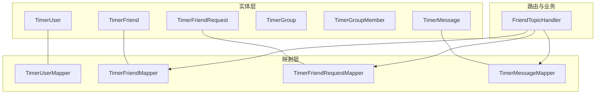
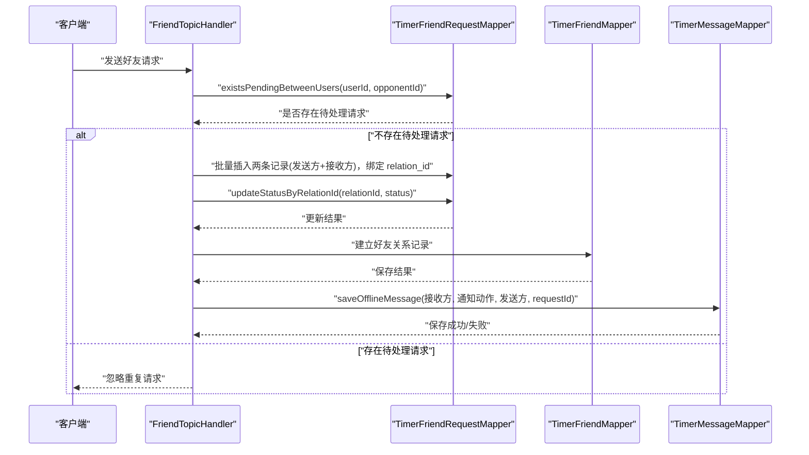
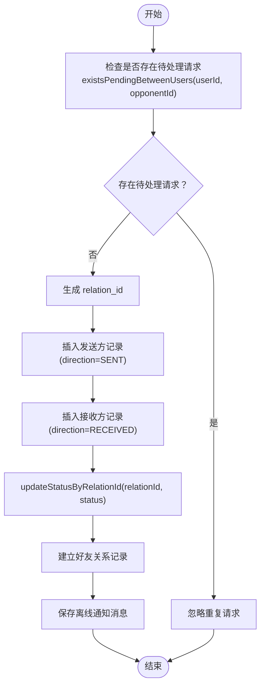
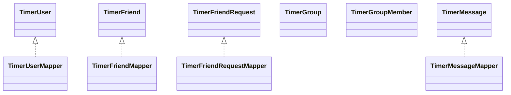

# 数据模型设计

<cite>
**本文引用的文件**
- [TimerUser.java](file://src/main/java/com/rivers/im/entity/TimerUser.java)
- [TimerFriend.java](file://src/main/java/com/rivers/im/entity/TimerFriend.java)
- [TimerFriendRequest.java](file://src/main/java/com/rivers/im/entity/TimerFriendRequest.java)
- [TimerGroup.java](file://src/main/java/com/rivers/im/entity/TimerGroup.java)
- [TimerGroupMember.java](file://src/main/java/com/rivers/im/entity/TimerGroupMember.java)
- [TimerMessage.java](file://src/main/java/com/rivers/im/entity/TimerMessage.java)
- [TimerUserMapper.java](file://src/main/java/com/rivers/im/mapper/TimerUserMapper.java)
- [TimerFriendMapper.java](file://src/main/java/com/rivers/im/mapper/TimerFriendMapper.java)
- [TimerFriendRequestMapper.java](file://src/main/java/com/rivers/im/mapper/TimerFriendRequestMapper.java)
- [TimerMessageMapper.java](file://src/main/java/com/rivers/im/mapper/TimerMessageMapper.java)
- [FriendTopicHandler.java](file://src/main/java/com/rivers/im/router/FriendTopicHandler.java)
- [application.yml](file://src/main/resources/application.yml)
</cite>

## 目录
1. [引言](#引言)
2. [项目结构](#项目结构)
3. [核心组件](#核心组件)
4. [架构总览](#架构总览)
5. [详细组件分析](#详细组件分析)
6. [依赖分析](#依赖分析)
7. [性能考虑](#性能考虑)
8. [故障排查指南](#故障排查指南)
9. [结论](#结论)
10. [附录](#附录)

## 引言
本文件系统性梳理 IM 服务中的数据模型设计，覆盖用户、好友关系、好友请求、群组、群成员与消息六大实体模型，明确各模型的业务含义、字段定义、约束条件与关系映射，并给出扩展与版本演进建议，以支撑业务持续演进与可维护性。

## 项目结构
- 实体层：位于 entity 包，使用 Spring Data 注解映射关系型数据库表。
- 映射层：位于 mapper 包，基于 Spring Data R2DBC 的响应式 CRUD 接口，部分提供自定义查询。
- 路由与业务：位于 router 包，包含好友主题处理器等，负责写扩散模型与离线通知持久化等业务流程。
- 配置：application.yml 提供应用与网关端口配置。

图表来源
- [TimerUser.java:23-110](file://src/main/java/com/rivers/im/entity/TimerUser.java#L23-L110)
- [TimerFriend.java:27-85](file://src/main/java/com/rivers/im/entity/TimerFriend.java#L27-L85)
- [TimerFriendRequest.java:14-99](file://src/main/java/com/rivers/im/entity/TimerFriendRequest.java#L14-L99)
- [TimerGroup.java:21-83](file://src/main/java/com/rivers/im/entity/TimerGroup.java#L21-L83)
- [TimerGroupMember.java:24-93](file://src/main/java/com/rivers/im/entity/TimerGroupMember.java#L24-L93)
- [TimerMessage.java:23-104](file://src/main/java/com/rivers/im/entity/TimerMessage.java#L23-L104)
- [TimerUserMapper.java:10-18](file://src/main/java/com/rivers/im/mapper/TimerUserMapper.java#L10-L18)
- [TimerFriendMapper.java:6-7](file://src/main/java/com/rivers/im/mapper/TimerFriendMapper.java#L6-L7)
- [TimerFriendRequestMapper.java:12-44](file://src/main/java/com/rivers/im/mapper/TimerFriendRequestMapper.java#L12-L44)
- [TimerMessageMapper.java:6-7](file://src/main/java/com/rivers/im/mapper/TimerMessageMapper.java#L6-L7)
- [FriendTopicHandler.java:32-37](file://src/main/java/com/rivers/im/router/FriendTopicHandler.java#L32-L37)

章节来源
- [application.yml:1-14](file://src/main/resources/application.yml#L1-L14)

## 核心组件
- TimerUser 用户模型：承载用户身份信息与通用元数据，支持软删除与审计字段。
- TimerFriend 好友关系模型：记录用户与好友的关联及备注，支持软删除与审计字段。
- TimerFriendRequest 好友请求模型：记录好友请求的发起方向、状态、消息内容与关联 ID，支持软删除与审计字段。
- TimerGroup 群组模型：记录群组基本信息与容量限制，支持软删除与审计字段。
- TimerGroupMember 群成员模型：记录成员角色、群内昵称与加入时间，支持软删除与审计字段。
- TimerMessage 消息模型：记录消息发送方、接收方（私聊或群聊）、消息类型与内容，支持阅读状态与发送时间。

章节来源
- [TimerUser.java:23-110](file://src/main/java/com/rivers/im/entity/TimerUser.java#L23-L110)
- [TimerFriend.java:27-85](file://src/main/java/com/rivers/im/entity/TimerFriend.java#L27-L85)
- [TimerFriendRequest.java:14-99](file://src/main/java/com/rivers/im/entity/TimerFriendRequest.java#L14-L99)
- [TimerGroup.java:21-83](file://src/main/java/com/rivers/im/entity/TimerGroup.java#L21-L83)
- [TimerGroupMember.java:24-93](file://src/main/java/com/rivers/im/entity/TimerGroupMember.java#L24-L93)
- [TimerMessage.java:23-104](file://src/main/java/com/rivers/im/entity/TimerMessage.java#L23-L104)

## 架构总览
下图展示数据模型在路由层与映射层的交互，体现写扩散模型与离线通知持久化的关键流程。

图表来源
- [FriendTopicHandler.java:76-98](file://src/main/java/com/rivers/im/router/FriendTopicHandler.java#L76-L98)
- [FriendTopicHandler.java:218-241](file://src/main/java/com/rivers/im/router/FriendTopicHandler.java#L218-L241)
- [TimerFriendRequestMapper.java:17-19](file://src/main/java/com/rivers/im/mapper/TimerFriendRequestMapper.java#L17-L19)
- [TimerFriendRequestMapper.java:25-29](file://src/main/java/com/rivers/im/mapper/TimerFriendRequestMapper.java#L25-L29)
- [TimerFriendRequestMapper.java:32-44](file://src/main/java/com/rivers/im/mapper/TimerFriendRequestMapper.java#L32-L44)
- [TimerFriendMapper.java:6-7](file://src/main/java/com/rivers/im/mapper/TimerFriendMapper.java#L6-L7)
- [TimerMessageMapper.java:6-7](file://src/main/java/com/rivers/im/mapper/TimerMessageMapper.java#L6-L7)

## 详细组件分析

### TimerUser 用户模型
- 设计理念
  - 作为系统用户主体，统一管理用户标识、凭证与基础资料。
  - 支持软删除与审计字段，便于合规与审计追踪。
- 字段与约束
  - 主键：自增长整型 id。
  - 用户标识：字符串 user_id，用于业务唯一标识。
  - 基础资料：username、phone、avatar、mail、userCode。
  - 状态控制：isDisable 控制账号启用/禁用。
  - 审计字段：createUser/createTime、updateUser/updateTime、isDeleted。
- 业务含义
  - 作为好友关系、群成员与消息发送/接收的基础引用对象。
- 复杂度与性能
  - 查询按 user_id 列表进行批量检索，适合基于索引的高效查询。
- 扩展建议
  - 可增加索引：user_id、phone、mail；可引入用户状态枚举替代 isDisable 字符串。
  - 可拆分资料表以降低主表膨胀。

章节来源
- [TimerUser.java:23-110](file://src/main/java/com/rivers/im/entity/TimerUser.java#L23-L110)
- [TimerUserMapper.java:13-16](file://src/main/java/com/rivers/im/mapper/TimerUserMapper.java#L13-L16)

### TimerFriend 好友关系模型
- 设计理念
  - 记录用户与好友的稳定关系，支持备注名与软删除。
- 字段与约束
  - 主键：自增长整型 id。
  - 关系标识：user_id、friend_id。
  - 备注：remark。
  - 审计字段：createUser/createTime、updateUser/updateTime、isDeleted。
- 业务含义
  - 作为好友列表与会话边界的基础数据。
- 复杂度与性能
  - 建议对 (user_id, friend_id) 建立联合索引，避免重复关系。
- 扩展建议
  - 可引入关系标签、屏蔽列表等扩展属性。
  - 可增加好友分组归类字段。

章节来源
- [TimerFriend.java:27-85](file://src/main/java/com/rivers/im/entity/TimerFriend.java#L27-L85)
- [TimerFriendMapper.java:6-7](file://src/main/java/com/rivers/im/mapper/TimerFriendMapper.java#L6-L7)

### TimerFriendRequest 好友请求模型
- 设计理念
  - 采用“写扩散”策略：同一请求同时生成发送方与接收方两条记录，通过 relation_id 绑定，实现状态一致性与双向同步。
- 字段与约束
  - 主键：自增长整型 id。
  - 请求标识：user_id（发起方）、opponent_id（对方）、relation_id（关联 ID）。
  - 方向：direction（SENT/RECEIVED）。
  - 状态：status（PENDING/ACCEPTED/REJECTED）。
  - 内容：message。
  - 审计字段：createUser/createTime、updateUser/updateTime、isDeleted。
- 业务含义
  - 支持请求去重、分页拉取与批量状态更新。
- 复杂度与性能
  - existsPendingBetweenUsers 使用联合条件快速判断重复请求。
  - updateStatusByRelationId 一次 SQL 更新双方记录，减少往返。
  - 分页查询按时间戳与主键降序分页，避免跳页问题。
- 扩展建议
  - 可引入请求有效期、自动过期清理策略。
  - 可增加请求来源渠道、风控标记等。

图表来源
- [TimerFriendRequestMapper.java:17-19](file://src/main/java/com/rivers/im/mapper/TimerFriendRequestMapper.java#L17-L19)
- [TimerFriendRequestMapper.java:25-29](file://src/main/java/com/rivers/im/mapper/TimerFriendRequestMapper.java#L25-L29)
- [TimerFriendRequestMapper.java:32-44](file://src/main/java/com/rivers/im/mapper/TimerFriendRequestMapper.java#L32-L44)
- [FriendTopicHandler.java:76-98](file://src/main/java/com/rivers/im/router/FriendTopicHandler.java#L76-L98)
- [FriendTopicHandler.java:218-241](file://src/main/java/com/rivers/im/router/FriendTopicHandler.java#L218-L241)

章节来源
- [TimerFriendRequest.java:14-99](file://src/main/java/com/rivers/im/entity/TimerFriendRequest.java#L14-L99)
- [TimerFriendRequestMapper.java:12-44](file://src/main/java/com/rivers/im/mapper/TimerFriendRequestMapper.java#L12-L44)
- [FriendTopicHandler.java:76-98](file://src/main/java/com/rivers/im/router/FriendTopicHandler.java#L76-L98)
- [FriendTopicHandler.java:218-241](file://src/main/java/com/rivers/im/router/FriendTopicHandler.java#L218-L241)

### TimerGroup 群组模型
- 设计理念
  - 记录群组基本信息与容量上限，支持软删除与审计字段。
- 字段与约束
  - 主键：自增长整型 id。
  - 基本信息：name、avatar、description、maxMembers。
  - 审计字段：createUser/createTime、updateUser/updateTime、isDeleted。
- 业务含义
  - 作为群成员与群消息的容器。
- 复杂度与性能
  - 建议对 name 建立索引，便于搜索。
- 扩展建议
  - 可引入群类型、权限策略、公告等字段。
  - 可增加群状态（如封禁）与风控字段。

章节来源
- [TimerGroup.java:21-83](file://src/main/java/com/rivers/im/entity/TimerGroup.java#L21-L83)

### TimerGroupMember 群成员模型
- 设计理念
  - 记录成员角色、群内昵称与加入时间，支持软删除与审计字段。
- 字段与约束
  - 主键：自增长整型 id。
  - 关联标识：group_id、user_id。
  - 角色：role（1-普通成员, 2-管理员, 3-群主）。
  - 群内昵称：nickname。
  - 加入时间：joinedAt。
  - 审计字段：createUser/createTime、updateUser/updateTime、isDeleted。
- 业务含义
  - 作为群权限与成员管理的基础。
- 复杂度与性能
  - 建议对 (group_id, user_id) 建立唯一索引，避免重复加入。
- 扩展建议
  - 可引入禁言、拉黑、邀请人等字段。
  - 可增加角色变更历史与权限继承策略。

章节来源
- [TimerGroupMember.java:24-93](file://src/main/java/com/rivers/im/entity/TimerGroupMember.java#L24-L93)

### TimerMessage 消息模型
- 设计理念
  - 统一承载私聊与群聊消息，支持多种消息类型与阅读状态。
- 字段与约束
  - 主键：自增长整型 id。
  - 发送方：fromUserId。
  - 接收方：toUserId（私聊）、groupId（群聊）。
  - 类型与内容：messageType（1-文本, 2-图片, 3-文件, 4-语音, 5-视频）、content、fileUrl。
  - 阅读状态：readStatus（0-未读, 1-已读）。
  - 时间：sentTime。
  - 审计字段：createUser/createTime、updateUser/updateTime。
- 业务含义
  - 作为聊天记录与离线推送的核心载体。
- 复杂度与性能
  - 建议对 (from_user_id, to_user_id, sent_time) 或 (group_id, sent_time) 建立复合索引。
  - 离线通知采用系统消息类型与定时清理策略。
- 扩展建议
  - 可引入消息回执、多终端同步、消息撤回与编辑历史。
  - 可增加消息安全与敏感词过滤字段。

章节来源
- [TimerMessage.java:23-104](file://src/main/java/com/rivers/im/entity/TimerMessage.java#L23-L104)
- [FriendTopicHandler.java:218-241](file://src/main/java/com/rivers/im/router/FriendTopicHandler.java#L218-L241)

## 依赖分析
- 实体与映射
  - 各实体通过 @Table/@Column 映射至对应表，映射器继承响应式 CRUD 接口，提供基础持久化能力。
  - 自定义查询集中在 FriendRequestMapper 中，体现领域查询的内聚性。
- 路由与模型
  - FriendTopicHandler 在路由层协调请求映射、状态更新与消息持久化，形成清晰的职责边界。
- 外部依赖
  - 应用配置通过 Nacos 导入，端口由 application.yml 统一管理。

图表来源
- [TimerUser.java:23-110](file://src/main/java/com/rivers/im/entity/TimerUser.java#L23-L110)
- [TimerFriend.java:27-85](file://src/main/java/com/rivers/im/entity/TimerFriend.java#L27-L85)
- [TimerFriendRequest.java:14-99](file://src/main/java/com/rivers/im/entity/TimerFriendRequest.java#L14-L99)
- [TimerGroup.java:21-83](file://src/main/java/com/rivers/im/entity/TimerGroup.java#L21-L83)
- [TimerGroupMember.java:24-93](file://src/main/java/com/rivers/im/entity/TimerGroupMember.java#L24-L93)
- [TimerMessage.java:23-104](file://src/main/java/com/rivers/im/entity/TimerMessage.java#L23-L104)
- [TimerUserMapper.java:10-18](file://src/main/java/com/rivers/im/mapper/TimerUserMapper.java#L10-L18)
- [TimerFriendMapper.java:6-7](file://src/main/java/com/rivers/im/mapper/TimerFriendMapper.java#L6-L7)
- [TimerFriendRequestMapper.java:12-44](file://src/main/java/com/rivers/im/mapper/TimerFriendRequestMapper.java#L12-L44)
- [TimerMessageMapper.java:6-7](file://src/main/java/com/rivers/im/mapper/TimerMessageMapper.java#L6-L7)

章节来源
- [TimerUserMapper.java:10-18](file://src/main/java/com/rivers/im/mapper/TimerUserMapper.java#L10-L18)
- [TimerFriendRequestMapper.java:12-44](file://src/main/java/com/rivers/im/mapper/TimerFriendRequestMapper.java#L12-L44)
- [application.yml:1-14](file://src/main/resources/application.yml#L1-L14)

## 性能考虑
- 索引策略
  - 用户：对 user_id 建立唯一索引；对 phone/mail 建立索引。
  - 好友：对 (user_id, friend_id) 建立唯一索引。
  - 请求：对 (user_id, opponent_id, status) 建立复合索引；对 relation_id 建立索引。
  - 群组：对 name 建立索引；对 (group_id, user_id) 建立唯一索引。
  - 消息：对 (from_user_id, to_user_id, sent_time) 或 (group_id, sent_time) 建立复合索引。
- 查询优化
  - 使用 exists 查询避免重复请求。
  - 分页查询使用时间戳与主键联合排序，保证稳定性。
- 写扩散
  - 通过 relation_id 一次性更新双方状态，减少事务与往返。
- 离线通知
  - 将系统通知写入消息表，结合定时任务清理，保障可靠性与可追溯性。

## 故障排查指南
- 常见问题
  - 重复请求：若 existsPendingBetweenUsers 返回存在待处理请求，应避免重复插入。
  - 状态不一致：确认 updateStatusByRelationId 是否正确更新双方记录。
  - 离线通知缺失：检查 saveOfflineMessage 的调用链与异常处理。
- 排查步骤
  - 核对请求参数与 relation_id 生成逻辑。
  - 检查映射器自定义 SQL 的参数绑定与返回值。
  - 查看路由层日志与错误恢复分支。
- 相关实现参考
  - 请求处理与写扩散：FriendTopicHandler 中的 handleRequest 流程。
  - 离线通知持久化：FriendTopicHandler 中的 saveOfflineMessage 流程。
  - 自定义查询：TimerFriendRequestMapper 的 existsPendingBetweenUsers 与分页查询。

章节来源
- [FriendTopicHandler.java:76-98](file://src/main/java/com/rivers/im/router/FriendTopicHandler.java#L76-L98)
- [FriendTopicHandler.java:218-241](file://src/main/java/com/rivers/im/router/FriendTopicHandler.java#L218-L241)
- [TimerFriendRequestMapper.java:25-29](file://src/main/java/com/rivers/im/mapper/TimerFriendRequestMapper.java#L25-L29)
- [TimerFriendRequestMapper.java:32-44](file://src/main/java/com/rivers/im/mapper/TimerFriendRequestMapper.java#L32-L44)

## 结论
该数据模型围绕用户、好友、群组与消息构建，采用软删除与审计字段增强可追溯性；通过写扩散模型与自定义查询提升一致性与性能；路由层将业务流程与数据持久化解耦。建议后续在索引、扩展字段与消息能力方面持续演进，以满足更复杂的业务场景。

## 附录
- 版本演进策略
  - 迁移策略：采用非阻塞迁移，先加列、后改默认值与索引，最后删除旧列。
  - 兼容性：保留 is_deleted 与审计字段，确保历史数据可读。
  - 渐进式扩展：优先在路由层与映射层新增查询，再沉淀为实体字段。
- 扩展指南
  - 新增枚举/状态：在实体中定义枚举并在映射器中补充查询。
  - 新增索引：评估查询模式与写放大，逐步上线。
  - 新增字段：遵循最小侵入原则，优先通过配置或扩展表实现。