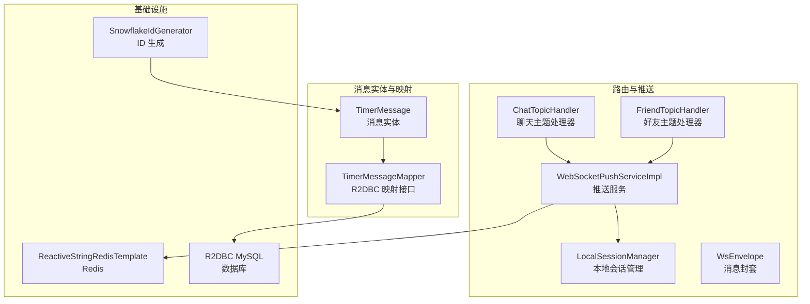
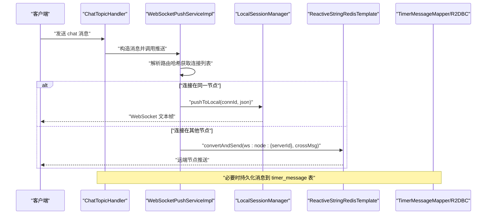
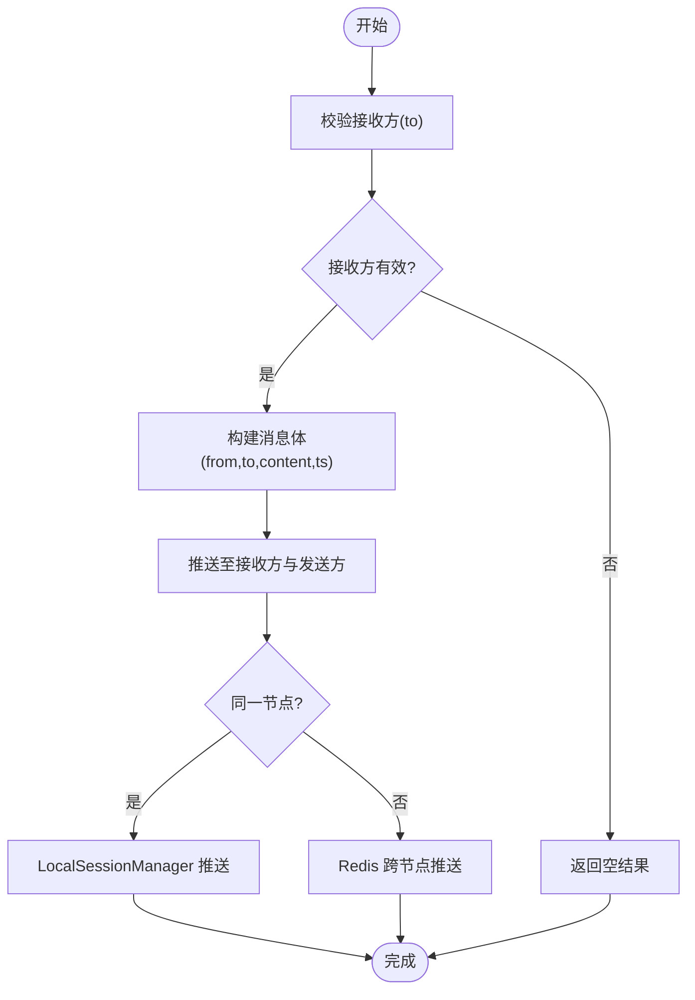
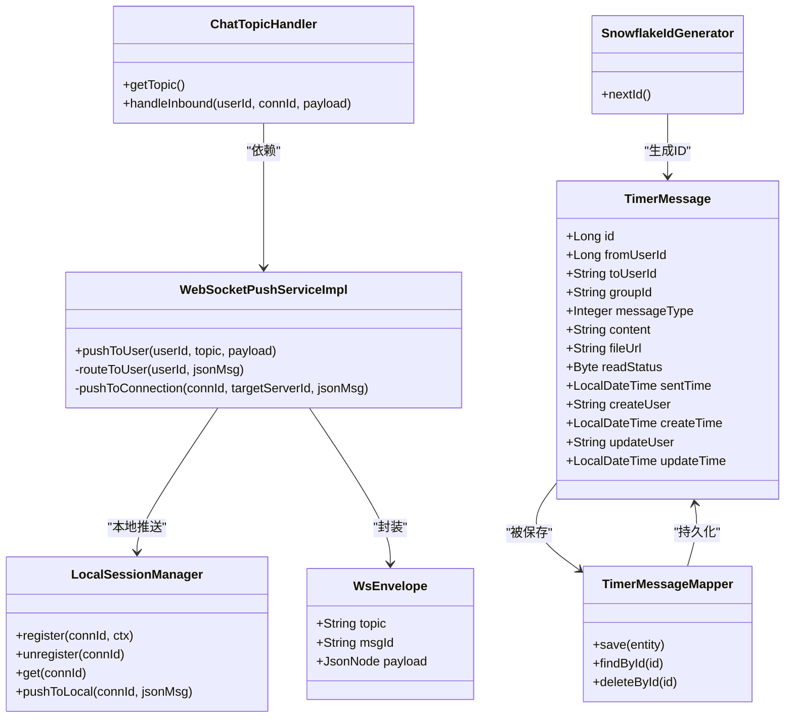

# 消息实体模型

<cite>
**本文引用的文件**
- [TimerMessage.java](file://src/main/java/com/rivers/im/entity/TimerMessage.java)
- [TimerMessageMapper.java](file://src/main/java/com/rivers/im/mapper/TimerMessageMapper.java)
- [ChatTopicHandler.java](file://src/main/java/com/rivers/im/router/ChatTopicHandler.java)
- [WebSocketPushServiceImpl.java](file://src/main/java/com/rivers/im/service/impl/WebSocketPushServiceImpl.java)
- [LocalSessionManager.java](file://src/main/java/com/rivers/im/manage/LocalSessionManager.java)
- [WsEnvelope.java](file://src/main/java/com/rivers/im/record/WsEnvelope.java)
- [FriendTopicHandler.java](file://src/main/java/com/rivers/im/router/FriendTopicHandler.java)
- [SnowflakeIdGenerator.java](file://src/main/java/com/rivers/im/util/SnowflakeIdGenerator.java)
- [build.gradle](file://build.gradle)
</cite>

## 目录
1. [简介](#简介)
2. [项目结构](#项目结构)
3. [核心组件](#核心组件)
4. [架构总览](#架构总览)
5. [详细组件分析](#详细组件分析)
6. [依赖分析](#依赖分析)
7. [性能考虑](#性能考虑)
8. [故障排查指南](#故障排查指南)
9. [结论](#结论)
10. [附录](#附录)

## 简介
本文件围绕消息实体模型进行系统性梳理，重点覆盖 TimerMessage 的字段设计、消息类型分类、存储策略、索引与查询优化、与用户/群组的关联关系，以及在实时通信中的流转机制。同时给出不同类型消息的处理示例与消息历史管理策略，帮助读者快速理解并高效扩展 IM 系统的消息能力。

## 项目结构
IM 服务采用响应式 WebFlux + R2DBC + Reactive Redis 架构，消息实体与映射器位于 entity 与 mapper 包中；路由层负责订阅不同主题（如 chat、notification）并将消息推送到目标用户；推送层通过本地会话管理器与跨节点 Redis 路由实现本地与远端推送；工具类提供全局唯一 ID 生成。

图表来源
- [TimerMessage.java:24-104](file://src/main/java/com/rivers/im/entity/TimerMessage.java#L24-L104)
- [TimerMessageMapper.java:6-7](file://src/main/java/com/rivers/im/mapper/TimerMessageMapper.java#L6-L7)
- [ChatTopicHandler.java:14-50](file://src/main/java/com/rivers/im/router/ChatTopicHandler.java#L14-L50)
- [FriendTopicHandler.java:230-275](file://src/main/java/com/rivers/im/router/FriendTopicHandler.java#L230-L275)
- [WebSocketPushServiceImpl.java:20-89](file://src/main/java/com/rivers/im/service/impl/WebSocketPushServiceImpl.java#L20-L89)
- [LocalSessionManager.java:12-43](file://src/main/java/com/rivers/im/manage/LocalSessionManager.java#L12-L43)
- [WsEnvelope.java:5-9](file://src/main/java/com/rivers/im/record/WsEnvelope.java#L5-L9)
- [SnowflakeIdGenerator.java:7-69](file://src/main/java/com/rivers/im/util/SnowflakeIdGenerator.java#L7-L69)

章节来源
- [build.gradle:31-45](file://build.gradle#L31-L45)

## 核心组件
- 消息实体 TimerMessage：定义消息主键、发送者、接收者、群组、消息类型、内容、文件 URL、阅读状态、发送时间及审计字段。
- 映射器 TimerMessageMapper：基于 ReactiveCrudRepository 提供对 timer_message 表的响应式 CRUD 访问。
- 路由处理器 ChatTopicHandler：处理 chat 主题消息，校验接收方，构造消息体并双发推送。
- 推送服务 WebSocketPushServiceImpl：将消息按用户路由至本地或远端节点，支持跨节点广播。
- 本地会话管理 LocalSessionManager：维护连接上下文，向指定 connId 推送 JSON 文本。
- 消息封套 WsEnvelope：统一承载 topic、msgId、payload 的传输结构。
- 好友主题处理器 FriendTopicHandler：持久化离线通知到 timer_message 表，并尝试实时推送。
- ID 生成 SnowflakeIdGenerator：提供高吞吐、单调递增的全局唯一 ID。

章节来源
- [TimerMessage.java:24-104](file://src/main/java/com/rivers/im/entity/TimerMessage.java#L24-L104)
- [TimerMessageMapper.java:6-7](file://src/main/java/com/rivers/im/mapper/TimerMessageMapper.java#L6-L7)
- [ChatTopicHandler.java:14-50](file://src/main/java/com/rivers/im/router/ChatTopicHandler.java#L14-L50)
- [WebSocketPushServiceImpl.java:20-89](file://src/main/java/com/rivers/im/service/impl/WebSocketPushServiceImpl.java#L20-L89)
- [LocalSessionManager.java:12-43](file://src/main/java/com/rivers/im/manage/LocalSessionManager.java#L12-L43)
- [WsEnvelope.java:5-9](file://src/main/java/com/rivers/im/record/WsEnvelope.java#L5-L9)
- [FriendTopicHandler.java:230-275](file://src/main/java/com/rivers/im/router/FriendTopicHandler.java#L230-L275)
- [SnowflakeIdGenerator.java:7-69](file://src/main/java/com/rivers/im/util/SnowflakeIdGenerator.java#L7-L69)

## 架构总览
消息从路由层进入，经推送服务根据目标用户定位连接，若在同一节点则直接推送，否则通过 Redis 将消息转发到目标节点；消息持久化通过 R2DBC 写入数据库，用于历史与离线场景。

图表来源
- [ChatTopicHandler.java:31-49](file://src/main/java/com/rivers/im/router/ChatTopicHandler.java#L31-L49)
- [WebSocketPushServiceImpl.java:45-88](file://src/main/java/com/rivers/im/service/impl/WebSocketPushServiceImpl.java#L45-L88)
- [LocalSessionManager.java:35-42](file://src/main/java/com/rivers/im/manage/LocalSessionManager.java#L35-L42)
- [TimerMessageMapper.java:6-7](file://src/main/java/com/rivers/im/mapper/TimerMessageMapper.java#L6-L7)

## 详细组件分析

### TimerMessage 实体字段设计与消息类型分类
- 标识与主键
  - id：消息主键，使用长整型。
- 发送与接收
  - fromUserId：发送者用户 ID。
  - toUserId：私聊接收者用户 ID（字符串）。
  - groupId：群聊所属群组 ID（字符串）。
- 消息类型与内容
  - messageType：消息类型枚举，包含文本、图片、文件、语音、视频等。
  - content：消息正文内容。
  - fileUrl：多媒体资源访问地址（图片/文件/语音/视频）。
- 状态与时间
  - readStatus：阅读状态（未读/已读）。
  - sentTime：消息发送时间。
- 审计字段
  - createUser/createTime/updateUser/updateTime：创建与更新的人员与时间戳。
- 设计要点
  - 字段命名与注解明确映射到数据库列，便于 ORM 映射与查询。
  - messageType 作为分类标识，配合 content 与 fileUrl 实现富媒体消息表达。

章节来源
- [TimerMessage.java:29-102](file://src/main/java/com/rivers/im/entity/TimerMessage.java#L29-L102)

### 消息类型分类与处理示例
- 文本消息
  - 来自路由层的 chat 主题消息，默认 content 字段承载文本内容，推送后双方均收到相同内容。
- 图片/文件/语音/视频
  - 通过 fileUrl 字段携带资源地址，content 可存放简要描述或 JSON 结构。
- 离线通知
  - 好友主题处理器在实时推送失败或用户离线时，将通知封装为 TimerMessage 并持久化到 timer_message 表，消息类型标记为通知类型，readStatus 初始化为未读。

章节来源
- [ChatTopicHandler.java:37-44](file://src/main/java/com/rivers/im/router/ChatTopicHandler.java#L37-L44)
- [FriendTopicHandler.java:233-250](file://src/main/java/com/rivers/im/router/FriendTopicHandler.java#L233-L250)

### 存储策略与索引设计
- 存储介质
  - 使用 R2DBC 连接 MySQL，通过 TimerMessageMapper 对 timer_message 表进行响应式写入与查询。
- 索引建议
  - 基于查询模式建议建立以下索引（概念性建议，非现有实现）：
    - (from_user_id, sent_time)：查询某用户的发送历史。
    - (to_user_id, sent_time)：查询某用户的接收历史。
    - (group_id, sent_time)：查询群组消息历史。
    - (read_status, sent_time)：统计未读消息。
    - (sent_time)：按时间范围分页拉取。
- 查询优化
  - 分页与游标：结合 sent_time 与主键 id 进行“时间倒序 + 限界”的分页查询，避免 OFFSET。
  - 缓存热点：最近 N 分钟内的热消息可引入 Redis 缓存，降低数据库压力。
  - 写扩散：好友请求场景采用 relation_id 关联双向状态更新，减少二次查询。

章节来源
- [TimerMessageMapper.java:6-7](file://src/main/java/com/rivers/im/mapper/TimerMessageMapper.java#L6-L7)
- [FriendTopicHandler.java:76-99](file://src/main/java/com/rivers/im/router/FriendTopicHandler.java#L76-L99)

### 消息与用户、群组的关联关系
- 私聊关系
  - 通过 toUserId 与 fromUserId 建立发送与接收关系；路由层严格校验 to 字段。
- 群聊关系
  - 通过 groupId 字段标识消息归属群组；群成员变更与权限控制由群组模块负责。
- 关联查询
  - 可通过用户 ID 与时间范围查询其私聊/群聊历史；结合 content/fileUrl 判断消息类型。

章节来源
- [ChatTopicHandler.java:32-36](file://src/main/java/com/rivers/im/router/ChatTopicHandler.java#L32-L36)
- [TimerMessage.java:35-48](file://src/main/java/com/rivers/im/entity/TimerMessage.java#L35-L48)

### 实时通信中的消息流转机制
- 入站处理
  - ChatTopicHandler 校验接收方并构造包含 from、to、content、ts 的消息体。
- 路由与推送
  - WebSocketPushServiceImpl 依据用户路由键查找连接集合，同一节点直接推送，跨节点通过 Redis 广播。
- 本地推送
  - LocalSessionManager 在连接存在且打开时推送 JSON 文本帧。
- 离线与持久化
  - 若推送失败或用户离线，FriendTopicHandler 将通知持久化到 timer_message 表，等待后续拉取或再次推送。

图表来源
- [ChatTopicHandler.java:31-49](file://src/main/java/com/rivers/im/router/ChatTopicHandler.java#L31-L49)
- [WebSocketPushServiceImpl.java:56-88](file://src/main/java/com/rivers/im/service/impl/WebSocketPushServiceImpl.java#L56-L88)
- [LocalSessionManager.java:35-42](file://src/main/java/com/rivers/im/manage/LocalSessionManager.java#L35-L42)

### 消息历史管理策略
- 拉取策略
  - 以 sent_time 降序与主键 id 作为联合条件进行分页，支持“加载更早”和“加载更多新”两种方向。
- 清理策略
  - 基于业务设定保留周期（如 30/90 天），定期归档或删除过期消息。
- 未读统计
  - 通过 read_status 字段统计每个会话的未读数，支持前端即时提醒。
- 离线兜底
  - 当实时推送失败时，将通知持久化到 timer_message 表，确保消息不丢失。

章节来源
- [FriendTopicHandler.java:233-250](file://src/main/java/com/rivers/im/router/FriendTopicHandler.java#L233-L250)
- [TimerMessage.java:69-78](file://src/main/java/com/rivers/im/entity/TimerMessage.java#L69-L78)

### 类图（实体与服务）

图表来源
- [TimerMessage.java:24-104](file://src/main/java/com/rivers/im/entity/TimerMessage.java#L24-L104)
- [TimerMessageMapper.java:6-7](file://src/main/java/com/rivers/im/mapper/TimerMessageMapper.java#L6-L7)
- [ChatTopicHandler.java:14-50](file://src/main/java/com/rivers/im/router/ChatTopicHandler.java#L14-L50)
- [WebSocketPushServiceImpl.java:20-89](file://src/main/java/com/rivers/im/service/impl/WebSocketPushServiceImpl.java#L20-L89)
- [LocalSessionManager.java:12-43](file://src/main/java/com/rivers/im/manage/LocalSessionManager.java#L12-L43)
- [WsEnvelope.java:5-9](file://src/main/java/com/rivers/im/record/WsEnvelope.java#L5-L9)
- [SnowflakeIdGenerator.java:7-69](file://src/main/java/com/rivers/im/util/SnowflakeIdGenerator.java#L7-L69)

## 依赖分析
- 技术栈
  - Spring Boot 4.0.x + Spring WebFlux + Spring Data R2DBC + Spring Data Redis Reactive。
  - Jackson 用于 JSON 序列化与对象树操作。
- 组件耦合
  - 路由层仅依赖推送服务接口，低耦合；推送服务依赖本地会话管理器与 Redis，实现跨节点解耦。
  - 实体与映射器通过 R2DBC 解耦具体数据库实现。
- 外部依赖
  - R2DBC MySQL 驱动、Reactive Redis、Jackson。

章节来源
- [build.gradle:31-45](file://build.gradle#L31-L45)

## 性能考虑
- 推送路径
  - 优先本地推送，减少网络往返；跨节点通过 Redis 广播，注意消息大小与频道负载。
- 数据库写入
  - 使用响应式流批处理批量写入，避免阻塞；对高频写入场景可引入本地缓存队列异步落盘。
- 查询优化
  - 基于 sent_time 与主键的复合索引，采用“时间窗口 + 主键边界”的分页策略。
- ID 生成
  - Snowflake 算法提供高吞吐与单调性，适合分布式场景下的消息主键生成。

章节来源
- [WebSocketPushServiceImpl.java:56-88](file://src/main/java/com/rivers/im/service/impl/WebSocketPushServiceImpl.java#L56-L88)
- [TimerMessageMapper.java:6-7](file://src/main/java/com/rivers/im/mapper/TimerMessageMapper.java#L6-L7)
- [SnowflakeIdGenerator.java:41-59](file://src/main/java/com/rivers/im/util/SnowflakeIdGenerator.java#L41-L59)

## 故障排查指南
- 接收方缺失
  - 路由层在缺少 to 字段时直接记录告警并返回空结果，检查客户端 payload 是否正确。
- 用户离线
  - 推送服务在连接不存在或已关闭时记录调试日志；离线场景下应检查 Redis 路由哈希是否正确。
- 跨节点推送失败
  - 记录警告日志并回退为空；检查 ws:node:* 频道订阅与目标服务器标识。
- 离线通知持久化
  - 好友主题处理器在推送失败时将通知写入 timer_message 表，检查消息类型与 readStatus 字段是否符合预期。

章节来源
- [ChatTopicHandler.java:32-35](file://src/main/java/com/rivers/im/router/ChatTopicHandler.java#L32-L35)
- [WebSocketPushServiceImpl.java:63-66](file://src/main/java/com/rivers/im/service/impl/WebSocketPushServiceImpl.java#L63-L66)
- [WebSocketPushServiceImpl.java:84-87](file://src/main/java/com/rivers/im/service/impl/WebSocketPushServiceImpl.java#L84-L87)
- [FriendTopicHandler.java:252-255](file://src/main/java/com/rivers/im/router/FriendTopicHandler.java#L252-L255)

## 结论
本消息实体模型以 TimerMessage 为核心，结合响应式推送与 R2DBC 持久化，实现了私聊与群聊、文本与富媒体消息的统一建模。通过路由与推送解耦、跨节点广播与本地直连相结合的方式，兼顾了实时性与可靠性。配合合理的索引与分页策略，可在高并发场景下保持稳定性能。离线通知持久化进一步增强了消息可达性，满足 IM 场景的完整需求。

## 附录
- 消息类型对照（示例）
  - 1：文本
  - 2：图片
  - 3：文件
  - 4：语音
  - 5：视频
  - 99：通知（用于离线通知）
- 关键流程参考路径
  - 聊天消息处理：[ChatTopicHandler.java:31-49](file://src/main/java/com/rivers/im/router/ChatTopicHandler.java#L31-L49)
  - 推送路由与跨节点广播：[WebSocketPushServiceImpl.java:56-88](file://src/main/java/com/rivers/im/service/impl/WebSocketPushServiceImpl.java#L56-L88)
  - 本地推送：[LocalSessionManager.java:35-42](file://src/main/java/com/rivers/im/manage/LocalSessionManager.java#L35-L42)
  - 离线通知持久化：[FriendTopicHandler.java:233-250](file://src/main/java/com/rivers/im/router/FriendTopicHandler.java#L233-L250)
  - 消息实体与映射：[TimerMessage.java:24-104](file://src/main/java/com/rivers/im/entity/TimerMessage.java#L24-L104)、[TimerMessageMapper.java:6-7](file://src/main/java/com/rivers/im/mapper/TimerMessageMapper.java#L6-L7)
  - ID 生成：[SnowflakeIdGenerator.java:41-59](file://src/main/java/com/rivers/im/util/SnowflakeIdGenerator.java#L41-L59)