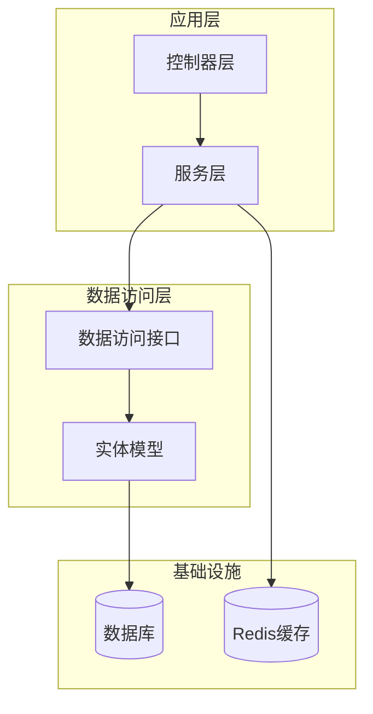
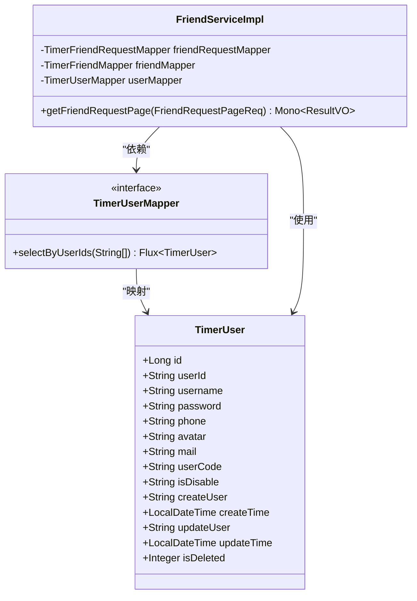
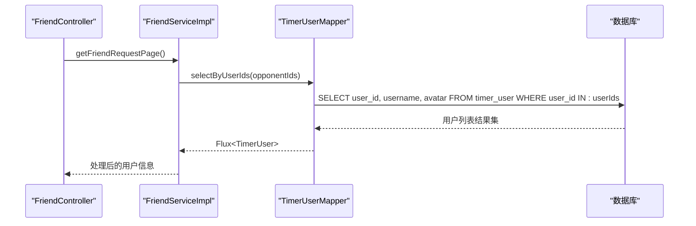
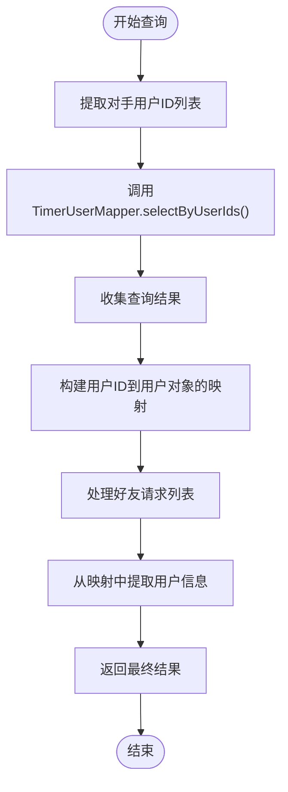
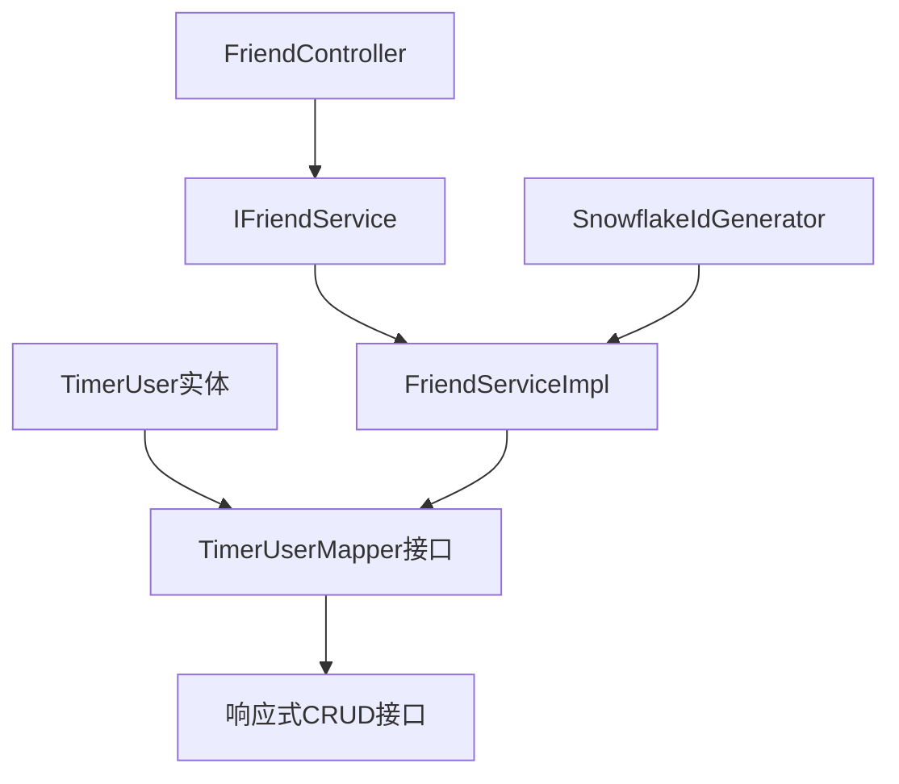

# 用户实体模型

<cite>
**本文档引用的文件**
- [TimerUser.java](file://src/main/java/com/rivers/im/entity/TimerUser.java)
- [TimerUserMapper.java](file://src/main/java/com/rivers/im/mapper/TimerUserMapper.java)
- [FriendServiceImpl.java](file://src/main/java/com/rivers/im/service/impl/FriendServiceImpl.java)
- [FriendController.java](file://src/main/java/com/rivers/im/controller/FriendController.java)
- [IFriendService.java](file://src/main/java/com/rivers/im/service/IFriendService.java)
- [SnowflakeIdGenerator.java](file://src/main/java/com/rivers/im/util/SnowflakeIdGenerator.java)
- [application.yml](file://src/main/resources/application.yml)
</cite>

## 目录
1. [简介](#简介)
2. [项目结构](#项目结构)
3. [核心组件](#核心组件)
4. [架构概览](#架构概览)
5. [详细组件分析](#详细组件分析)
6. [依赖关系分析](#依赖关系分析)
7. [性能考量](#性能考量)
8. [故障排除指南](#故障排除指南)
9. [结论](#结论)
10. [附录](#附录)

## 简介
本文档深入解析了IM服务器中的用户实体模型TimerUser，这是一个基于Spring Data R2DBC构建的响应式用户数据模型。该模型采用关系型数据库映射策略，通过注解驱动的方式实现Java对象与数据库表之间的映射关系。本文将详细阐述用户字段定义、数据类型、业务含义以及设计原则，并提供完整的CRUD操作示例和与其他实体的关系映射说明。

## 项目结构
IM服务器采用分层架构设计，用户实体模型位于entity包中，配合相应的Mapper接口实现数据访问层功能。

**图表来源**
- [TimerUser.java:23-111](file://src/main/java/com/rivers/im/entity/TimerUser.java#L23-L111)
- [TimerUserMapper.java:10-19](file://src/main/java/com/rivers/im/mapper/TimerUserMapper.java#L10-L19)

**章节来源**
- [TimerUser.java:1-111](file://src/main/java/com/rivers/im/entity/TimerUser.java#L1-L111)
- [application.yml:1-14](file://src/main/resources/application.yml#L1-L14)

## 核心组件
TimerUser作为用户实体模型，采用了Spring Data注解进行数据库映射，支持响应式编程模型。

### 字段定义与数据类型

| 字段名称 | 数据库列名 | Java类型 | 注解 | 业务含义 | 约束 |
|---------|-----------|----------|------|----------|------|
| id | id | Long | @Id | 主键标识 | 自增主键 |
| userId | user_id | String | @Column("user_id") | 用户唯一标识 | 唯一性约束 |
| username | username | String | @Column("username") | 用户名 | 非空 |
| password | password | String | @Column("password") | 密码哈希 | 非空 |
| phone | phone | String | @Column("phone") | 手机号码 | 可选 |
| avatar | avatar | String | @Column("avatar") | 头像URL | 可选 |
| mail | mail | String | @Column("mail") | 邮箱地址 | 可选 |
| userCode | user_code | String | @Column("user_code") | 用户编码 | 可选 |
| isDisable | is_disable | String | @Column("is_disable") | 是否禁用 | '0'/'1'枚举 |
| createUser | create_user | String | @Column("create_user") | 创建人 | 可选 |
| createTime | create_time | LocalDateTime | @Column("create_time") | 创建时间 | 非空 |
| updateUser | update_user | String | @Column("update_user") | 修改人 | 可选 |
| updateTime | update_time | LocalDateTime | @Column("update_time") | 修改时间 | 非空 |
| isDeleted | is_deleted | Integer | @Column("is_deleted") | 删除标记 | 0/1 |

### 设计原则
1. **响应式设计**: 采用Spring Data R2DBC实现非阻塞I/O操作
2. **注解驱动**: 使用@Table和@Column注解简化ORM映射
3. **序列化支持**: 实现Serializable接口支持对象序列化
4. **Lombok集成**: 使用@Getter和@Setter简化getter/setter方法
5. **时间戳管理**: 统一使用LocalDateTime处理时间数据

**章节来源**
- [TimerUser.java:29-108](file://src/main/java/com/rivers/im/entity/TimerUser.java#L29-L108)

## 架构概览
用户实体模型在整个IM系统中扮演着核心角色，为好友关系、消息传递等功能提供基础数据支撑。

**图表来源**
- [TimerUser.java:24-111](file://src/main/java/com/rivers/im/entity/TimerUser.java#L24-L111)
- [TimerUserMapper.java:10-19](file://src/main/java/com/rivers/im/mapper/TimerUserMapper.java#L10-L19)
- [FriendServiceImpl.java:30-43](file://src/main/java/com/rivers/im/service/impl/FriendServiceImpl.java#L30-L43)

## 详细组件分析

### 数据模型设计
TimerUser采用了标准的企业级数据模型设计，包含了完整的审计字段和业务字段。

#### 核心业务字段
- **用户标识**: userId作为主要业务标识符，对应数据库的user_id列
- **身份信息**: username用于显示名称，password存储密码哈希
- **联系信息**: phone和mail提供多种联系方式
- **个人资料**: avatar存储头像URL，userCode提供额外标识

#### 审计字段设计
- **创建信息**: createUser和createTime记录创建者和创建时间
- **修改信息**: updateUser和updateTime记录最后修改者和修改时间
- **删除标记**: isDeleted实现软删除机制

#### 状态管理
- **禁用状态**: isDisable使用'0'/'1'字符串枚举表示启用/禁用状态
- **时间戳**: 所有时间字段使用LocalDateTime确保时区一致性

### 数据访问层实现
TimerUserMapper继承自ReactiveCrudRepository，提供了响应式的CRUD操作能力。

#### 查询方法设计

**图表来源**
- [FriendController.java:23-26](file://src/main/java/com/rivers/im/controller/FriendController.java#L23-L26)
- [FriendServiceImpl.java:71-72](file://src/main/java/com/rivers/im/service/impl/FriendServiceImpl.java#L71-L72)
- [TimerUserMapper.java:13-16](file://src/main/java/com/rivers/im/mapper/TimerUserMapper.java#L13-L16)

**章节来源**
- [TimerUserMapper.java:10-19](file://src/main/java/com/rivers/im/mapper/TimerUserMapper.java#L10-L19)
- [FriendServiceImpl.java:71-72](file://src/main/java/com/rivers/im/service/impl/FriendServiceImpl.java#L71-L72)

### 服务层集成
FriendServiceImpl展示了如何在实际业务场景中使用TimerUser模型。

#### 批量用户查询流程

**图表来源**
- [FriendServiceImpl.java:67-76](file://src/main/java/com/rivers/im/service/impl/FriendServiceImpl.java#L67-L76)
- [FriendServiceImpl.java:78-96](file://src/main/java/com/rivers/im/service/impl/FriendServiceImpl.java#L78-L96)

**章节来源**
- [FriendServiceImpl.java:45-104](file://src/main/java/com/rivers/im/service/impl/FriendServiceImpl.java#L45-L104)

### 验证规则与约束
当前代码库中未发现显式的字段验证逻辑，但根据字段定义可以推导出以下约束：

#### 必填字段
- userId: 用户唯一标识，必须非空
- username: 用户名，必须非空
- password: 密码哈希，必须非空
- createTime: 创建时间，必须非空
- updateTime: 修改时间，必须非空

#### 数据类型约束
- 数字字段: id使用Long类型
- 字符串字段: 支持可变长度字符串
- 时间字段: 使用LocalDateTime确保精度

#### 业务约束
- isDisable: 仅允许'0'或'1'值
- isDeleted: 通常使用0表示正常，1表示删除

**章节来源**
- [TimerUser.java:35-108](file://src/main/java/com/rivers/im/entity/TimerUser.java#L35-L108)

## 依赖关系分析

### 组件间依赖关系

**图表来源**
- [TimerUser.java:24](file://src/main/java/com/rivers/im/entity/TimerUser.java#L24)
- [TimerUserMapper.java:10](file://src/main/java/com/rivers/im/mapper/TimerUserMapper.java#L10)
- [FriendServiceImpl.java:30-43](file://src/main/java/com/rivers/im/service/impl/FriendServiceImpl.java#L30-L43)
- [IFriendService.java:8-11](file://src/main/java/com/rivers/im/service/IFriendService.java#L8-L11)

### 外部依赖
- **Spring Data R2DBC**: 提供响应式数据库访问能力
- **Lombok**: 自动生成getter/setter和构造函数
- **Reactor**: 支持响应式编程模型
- **Apache Commons**: 提供集合工具类

**章节来源**
- [FriendServiceImpl.java:15-26](file://src/main/java/com/rivers/im/service/impl/FriendServiceImpl.java#L15-L26)

## 性能考量
基于当前实现，需要关注以下几个性能方面：

### 数据库查询优化
1. **批量查询**: 使用IN子句进行批量用户查询，避免N+1查询问题
2. **索引设计**: 建议在user_id列上建立索引以提升查询性能
3. **投影查询**: 只选择必要的字段(username, avatar)，减少数据传输

### 内存使用优化
1. **响应式流**: 利用Flux和Mono处理大数据集，避免内存溢出
2. **延迟加载**: 仅在需要时加载用户完整信息
3. **连接池**: 合理配置数据库连接池参数

### 缓存策略
虽然当前实现未包含用户缓存，但可以考虑：
1. **Redis缓存**: 缓存热点用户信息
2. **本地缓存**: 使用Caffeine缓存最近使用的用户数据
3. **缓存失效**: 设置合理的TTL和失效策略

## 故障排除指南

### 常见问题诊断
1. **数据库连接问题**: 检查application.yml中的数据库配置
2. **响应式流异常**: 确认Flux和Mono的正确使用
3. **时间格式问题**: 验证LocalDateTime的序列化和反序列化

### 调试建议
1. **日志记录**: 在关键节点添加日志输出
2. **单元测试**: 为Mapper接口编写测试用例
3. **性能监控**: 监控数据库查询时间和响应延迟

**章节来源**
- [application.yml:1-14](file://src/main/resources/application.yml#L1-L14)

## 结论
TimerUser用户实体模型展现了现代响应式应用的最佳实践，通过Spring Data R2DBC实现了高性能的数据访问层。模型设计遵循了企业级应用的标准规范，包含了完整的审计字段和业务字段。通过批量化查询和响应式编程模型，有效提升了系统的并发处理能力和资源利用率。

在未来演进中，建议重点关注缓存策略、安全加固和性能优化等方面，以适应更大规模的应用需求。

## 附录

### 字段详细说明表

| 字段名 | 数据类型 | 长度限制 | 允许为空 | 默认值 | 说明 |
|--------|----------|----------|----------|--------|------|
| id | BIGINT | 无 | 否 | 自增 | 主键标识 |
| user_id | VARCHAR | 50 | 否 | 无 | 用户唯一标识 |
| username | VARCHAR | 100 | 否 | 无 | 用户显示名称 |
| password | VARCHAR | 255 | 否 | 无 | 密码哈希值 |
| phone | VARCHAR | 20 | 是 | NULL | 手机号码 |
| avatar | TEXT | 无限制 | 是 | NULL | 头像图片URL |
| mail | VARCHAR | 100 | 是 | NULL | 邮箱地址 |
| user_code | VARCHAR | 50 | 是 | NULL | 用户内部编码 |
| is_disable | CHAR | 1 | 是 | '0' | 用户禁用状态 |
| create_user | VARCHAR | 50 | 是 | NULL | 创建人标识 |
| create_time | TIMESTAMP | 无 | 否 | 当前时间 | 记录创建时间 |
| update_user | VARCHAR | 50 | 是 | NULL | 最后修改人 |
| update_time | TIMESTAMP | 无 | 否 | 当前时间 | 记录更新时间 |
| is_deleted | TINYINT | 1 | 是 | 0 | 逻辑删除标记 |

### 扩展建议
1. **安全性增强**: 添加密码加密和验证机制
2. **字段验证**: 实现Bean Validation注解
3. **审计追踪**: 添加更详细的变更历史记录
4. **缓存机制**: 实现用户信息的多级缓存
5. **分页查询**: 为大量用户数据提供分页支持