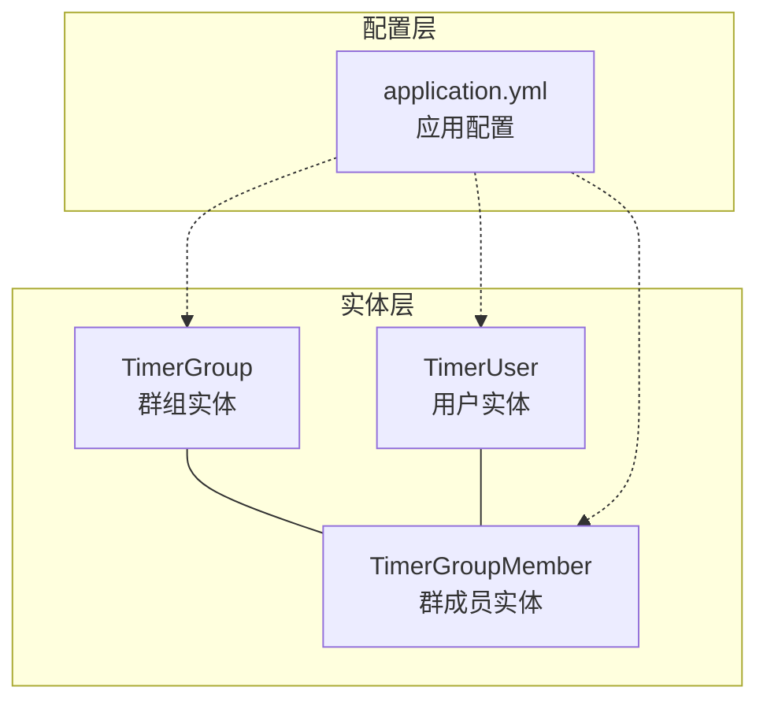
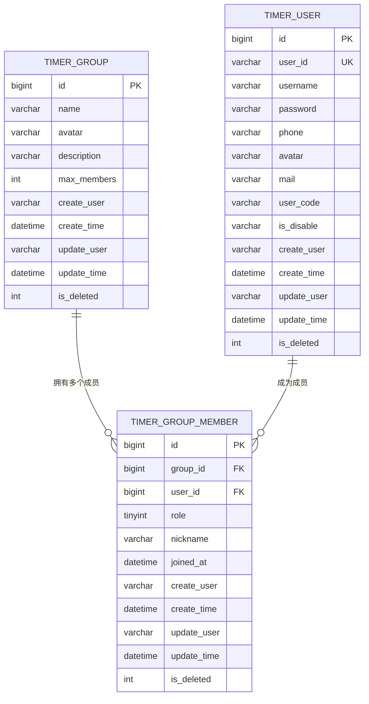
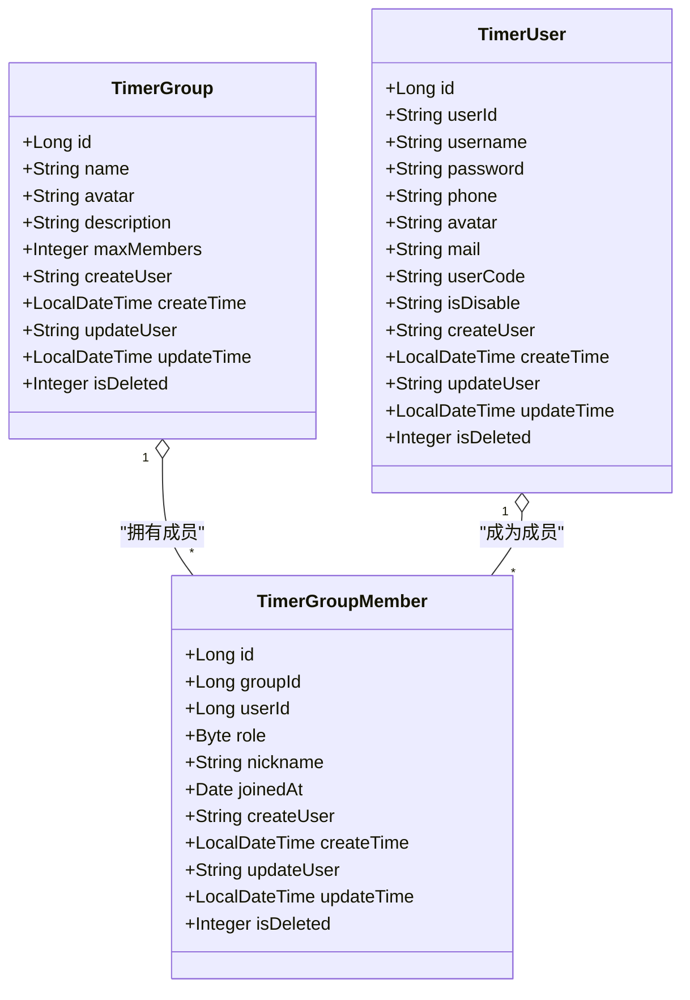
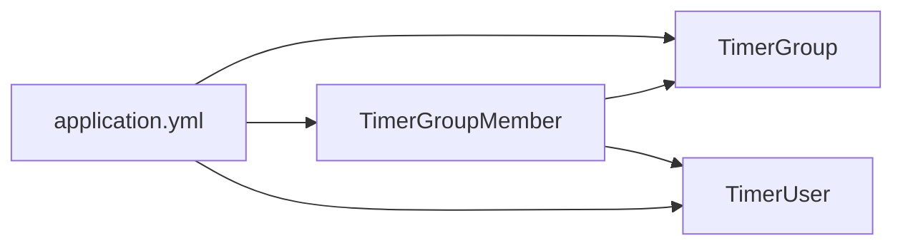

# 群组相关模型

<cite>
**本文引用的文件**
- [TimerGroup.java](file://src/main/java/com/rivers/im/entity/TimerGroup.java)
- [TimerGroupMember.java](file://src/main/java/com/rivers/im/entity/TimerGroupMember.java)
- [TimerUser.java](file://src/main/java/com/rivers/im/entity/TimerUser.java)
- [application.yml](file://src/main/resources/application.yml)
</cite>

## 目录
1. [引言](#引言)
2. [项目结构](#项目结构)
3. [核心组件](#核心组件)
4. [架构总览](#架构总览)
5. [详细组件分析](#详细组件分析)
6. [依赖分析](#依赖分析)
7. [性能考虑](#性能考虑)
8. [故障排查指南](#故障排查指南)
9. [结论](#结论)
10. [附录](#附录)

## 引言
本文件聚焦于即时通讯系统中的“群组相关模型”，围绕以下目标展开：  
- 深入解析 TimerGroup 群组实体的字段定义与业务含义（如群组名称、头像、描述、最大成员数、创建者、创建时间、更新信息、逻辑删除等）。  
- 全面阐述 TimerGroupMember 群成员实体的设计（成员角色、群内昵称、加入时间、创建/更新信息、逻辑删除等），并明确其与 TimerGroup 的多对多关系映射。  
- 基于现有实体设计，给出群组创建、成员管理、权限控制的操作示例与最佳实践建议。  

为确保内容可追溯，所有技术细节均对应到仓库中的具体文件与行号。

## 项目结构
本项目采用基于包的分层组织方式，群组相关模型位于 entity 层，配合 Spring Data 注解进行数据库映射；应用配置位于 resources 下的 application.yml。  
- 实体层：TimerGroup、TimerGroupMember、TimerUser  
- 配置层：application.yml（Spring Cloud Nacos 配置导入与服务端口）

图表来源
- [TimerGroup.java:1-84](file://src/main/java/com/rivers/im/entity/TimerGroup.java#L1-L84)
- [TimerGroupMember.java:1-94](file://src/main/java/com/rivers/im/entity/TimerGroupMember.java#L1-L94)
- [TimerUser.java:1-111](file://src/main/java/com/rivers/im/entity/TimerUser.java#L1-L111)
- [application.yml:1-14](file://src/main/resources/application.yml#L1-L14)

章节来源
- [application.yml:1-14](file://src/main/resources/application.yml#L1-L14)

## 核心组件
本节从数据模型角度，系统梳理 TimerGroup 与 TimerGroupMember 的字段与职责，并说明它们在业务上的作用边界。

- TimerGroup（群组实体）
  - 主键：id（Long）  
  - 名称：name（String）  
  - 头像：avatar（String）  
  - 描述：description（String）  
  - 最大成员数：maxMembers（Integer）  
  - 创建者：createUser（String）  
  - 创建时间：createTime（LocalDateTime）  
  - 更新者：updateUser（String）  
  - 更新时间：updateTime（LocalDateTime）  
  - 逻辑删除：isDeleted（Integer）  

- TimerGroupMember（群成员实体）
  - 主键：id（Long）  
  - 群组ID：groupId（Long）  
  - 用户ID：userId（Long）  
  - 角色：role（Byte）  
    - 1：普通成员  
    - 2：管理员  
    - 3：群主  
  - 群内昵称：nickname（String）  
  - 加入时间：joinedAt（Date）  
  - 创建者：createUser（String）  
  - 创建时间：createTime（LocalDateTime）  
  - 更新者：updateUser（String）  
  - 更新时间：updateTime（LocalDateTime）  
  - 逻辑删除：isDeleted（Integer）  

- TimerUser（用户实体，用于成员身份关联）
  - 主键：id（Long）  
  - 用户标识：userId（String）  
  - 用户名：username（String）  
  - 密码：password（String）  
  - 手机：phone（String）  
  - 头像：avatar（String）  
  - 邮箱：mail（String）  
  - 用户编码：userCode（String）  
  - 是否禁用：isDisable（String）  
  - 创建者：createUser（String）  
  - 创建时间：createTime（LocalDateTime）  
  - 更新者：updateUser（String）  
  - 更新时间：updateTime（LocalDateTime）  
  - 逻辑删除：isDeleted（Integer）  

章节来源
- [TimerGroup.java:27-82](file://src/main/java/com/rivers/im/entity/TimerGroup.java#L27-L82)
- [TimerGroupMember.java:30-91](file://src/main/java/com/rivers/im/entity/TimerGroupMember.java#L30-L91)
- [TimerUser.java:29-108](file://src/main/java/com/rivers/im/entity/TimerUser.java#L29-L108)

## 架构总览
下图展示群组与成员的数据模型关系，以及与用户实体的关联路径。该图为概念性示意，帮助理解多对多关系与外键约束思路。

图表来源
- [TimerGroup.java:27-82](file://src/main/java/com/rivers/im/entity/TimerGroup.java#L27-L82)
- [TimerGroupMember.java:30-91](file://src/main/java/com/rivers/im/entity/TimerGroupMember.java#L30-L91)
- [TimerUser.java:29-108](file://src/main/java/com/rivers/im/entity/TimerUser.java#L29-L108)

## 详细组件分析

### TimerGroup（群组实体）
- 设计要点
  - 使用注解声明表名为 timer_group，字段通过 Column 映射到数据库列。  
  - 提供标准的审计字段：创建者、创建时间、更新者、更新时间、逻辑删除标志。  
  - 支持设置最大成员数，便于后续扩展容量控制策略。  

- 字段与业务含义
  - name：群组对外可见的名称，用于展示与检索。  
  - avatar：群组头像，支持个性化展示。  
  - description：群组简介或公告区域，便于成员了解群组定位。  
  - maxMembers：上限人数，可用于入群审批或阻断策略。  
  - createUser/updateUser：审计追踪，便于问题溯源。  
  - createTime/updateTime：记录变更时间，支持排序与统计。  
  - isDeleted：软删除标记，避免物理删除造成数据不可恢复。  

- 复杂度与性能
  - 字段均为标量类型，持久化开销低；建议在查询时按需投影，减少网络传输。  
  - 建议对 name、createUser 等常用过滤字段建立索引，提升查询效率。  

章节来源
- [TimerGroup.java:27-82](file://src/main/java/com/rivers/im/entity/TimerGroup.java#L27-L82)

### TimerGroupMember（群成员实体）
- 设计要点
  - 表名为 timer_group_member，通过 groupId 与 userId 组成复合维度，体现多对多关系。  
  - 角色字段 role 以 Byte 存储，枚举值 1/2/3 分别代表普通成员/管理员/群主，便于权限判定。  
  - nickname 支持成员在群内的个性化展示名称。  
  - joinedAt 记录成员加入时间，可用于入群顺序、权益发放等场景。  

- 成员角色与权限层级
  - 群主（role=3）：最高权限，通常具备修改群资料、任命/移除管理员、踢人、解散群等能力。  
  - 管理员（role=2）：次高权限，可执行部分群务操作（如禁言、移除成员等），但不能转让群主。  
  - 普通成员（role=1）：基础权限，仅能参与聊天与接收通知。  

- 审计与生命周期
  - 审计字段与软删除策略与 TimerGroup 一致，便于统一治理。  

- 复杂度与性能
  - 角色判断为 O(1)，适合在内存中快速决策；建议在高频权限校验处缓存当前成员的角色信息。  
  - 建议对 groupId、userId、role 建立组合索引，优化成员查询与权限判定。  

章节来源
- [TimerGroupMember.java:30-91](file://src/main/java/com/rivers/im/entity/TimerGroupMember.java#L30-L91)

### TimerUser（用户实体）
- 设计要点
  - 提供用户基本信息与状态字段，支撑成员身份识别与安全校验。  
  - user_id 作为唯一标识，便于与外部系统对接或跨模块引用。  

- 与群组的关系
  - TimerGroupMember.userId 关联 TimerUser.id 或 user_id，形成成员身份绑定。  
  - 在权限判定与消息推送时，常需要联合查询用户状态（如是否禁用）以保障安全。  

章节来源
- [TimerUser.java:29-108](file://src/main/java/com/rivers/im/entity/TimerUser.java#L29-L108)

### 类关系与交互（概念性）

图表来源
- [TimerGroup.java:27-82](file://src/main/java/com/rivers/im/entity/TimerGroup.java#L27-L82)
- [TimerGroupMember.java:30-91](file://src/main/java/com/rivers/im/entity/TimerGroupMember.java#L30-L91)
- [TimerUser.java:29-108](file://src/main/java/com/rivers/im/entity/TimerUser.java#L29-L108)

## 依赖分析
- 内部耦合
  - TimerGroupMember 对 TimerGroup 与 TimerUser 形成外键式依赖，体现“成员属于群组、由用户组成”的关系。  
  - 审计字段与软删除策略在三者间保持一致性，降低维护成本。  

- 外部依赖
  - 应用配置通过 application.yml 导入 Nacos 配置中心，便于集中化管理与动态刷新。  

图表来源
- [TimerGroup.java:27-82](file://src/main/java/com/rivers/im/entity/TimerGroup.java#L27-L82)
- [TimerGroupMember.java:30-91](file://src/main/java/com/rivers/im/entity/TimerGroupMember.java#L30-L91)
- [TimerUser.java:29-108](file://src/main/java/com/rivers/im/entity/TimerUser.java#L29-L108)
- [application.yml:1-14](file://src/main/resources/application.yml#L1-L14)

章节来源
- [application.yml:1-14](file://src/main/resources/application.yml#L1-L14)

## 性能考虑
- 查询优化
  - 对 TimerGroup 的 name、createUser 建立索引；对 TimerGroupMember 的 groupId、userId、role 建立组合索引。  
  - 分页查询时尽量使用覆盖索引，避免回表。  

- 写入优化
  - 批量入群时优先使用批量插入，减少事务次数。  
  - 软删除策略避免频繁重建表结构，但需定期清理历史数据。  

- 缓存策略
  - 将当前用户的群组列表与角色缓存至本地或分布式缓存，降低重复查询成本。  

## 故障排查指南
- 常见问题与处理
  - 成员角色不生效：检查 role 字段是否正确写入（1/2/3），并确认权限判定逻辑是否匹配。  
  - 入群失败：核对 maxMembers 上限与当前成员数，同时检查 joinedAt 与业务规则的一致性。  
  - 审计字段为空：确认调用方是否正确填充 createUser/updateUser 及 createTime/updateTime。  
  - 数据不一致：启用软删除后，查询时需过滤 isDeleted=0，避免脏数据污染。  

- 排查步骤
  1) 确认请求参数与实体字段映射正确。  
  2) 校验数据库索引是否存在，必要时补充。  
  3) 查看审计字段与软删除标志，排除历史数据干扰。  
  4) 结合日志与监控，定位慢查询与异常写入点。  

## 结论
- TimerGroup 与 TimerGroupMember 构成了清晰的群组与成员模型，配合 TimerUser 实现了成员身份绑定。  
- 角色体系（群主/管理员/普通成员）为权限控制提供了天然支点，建议在服务层统一收敛权限判定逻辑。  
- 审计与软删除策略提升了系统的可维护性与可追溯性，建议在接口层默认开启。  
- 建议结合索引与缓存策略优化查询与写入性能，并在上线前完成压测与回归验证。  

## 附录
- 操作示例与最佳实践（基于现有模型的通用流程）
  - 群组创建
    - 步骤：填写 name、avatar、description、maxMembers，设置 createUser/createTime，保存后返回 id。  
    - 最佳实践：创建完成后立即初始化一个角色为群主的成员记录，确保创建者即管理员。  
  - 成员管理
    - 新增成员：写入 TimerGroupMember，设置 groupId、userId、role=1、joinedAt，必要时设置 nickname。  
    - 调整角色：更新 TimerGroupMember.role，注意群主转移需同步处理旧群主的角色变化。  
    - 移除成员：逻辑删除（isDeleted=1）或物理删除（谨慎），并清理相关会话与缓存。  
  - 权限控制
    - 群主：全权管理；管理员：受限制的管理权限；普通成员：仅聊天与接收通知。  
    - 判定流程：先根据 groupId+userId 获取角色，再依据业务动作进行分支处理。  
  - 审计与合规
    - 所有关键操作均需记录 create_user/create_time/update_user/update_time，便于审计与复盘。  

章节来源
- [TimerGroup.java:27-82](file://src/main/java/com/rivers/im/entity/TimerGroup.java#L27-L82)
- [TimerGroupMember.java:30-91](file://src/main/java/com/rivers/im/entity/TimerGroupMember.java#L30-L91)
- [TimerUser.java:29-108](file://src/main/java/com/rivers/im/entity/TimerUser.java#L29-L108)