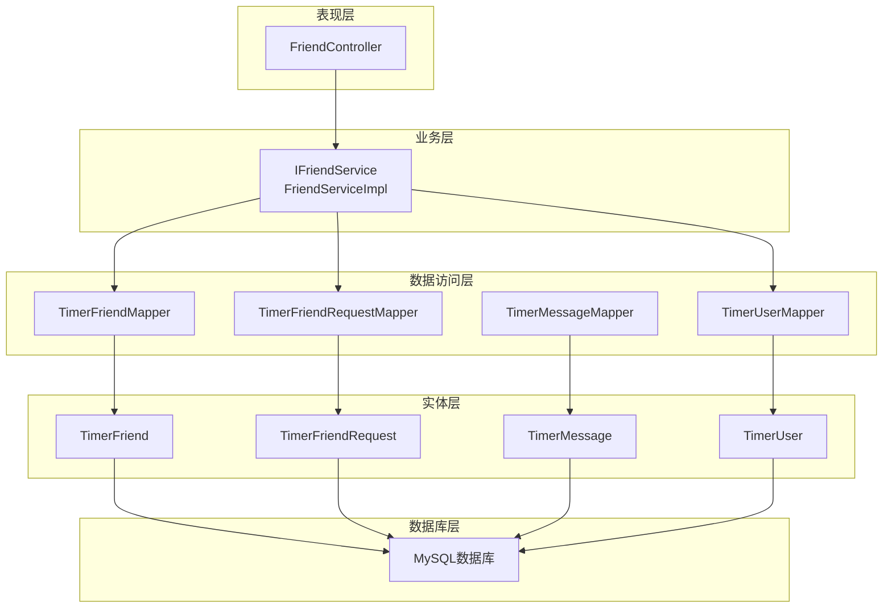
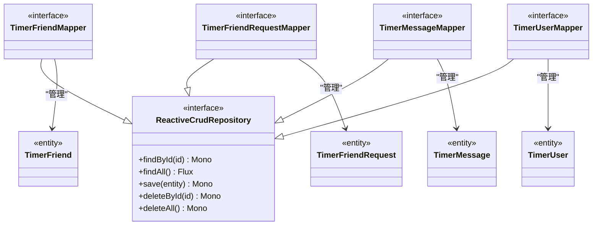
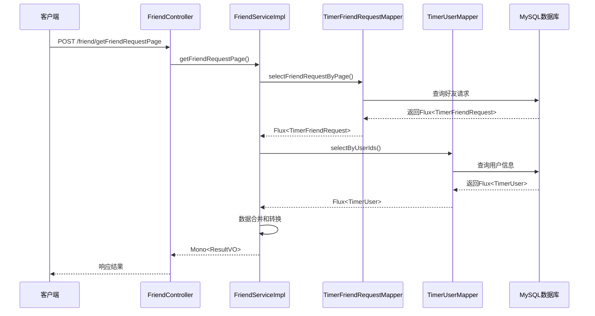
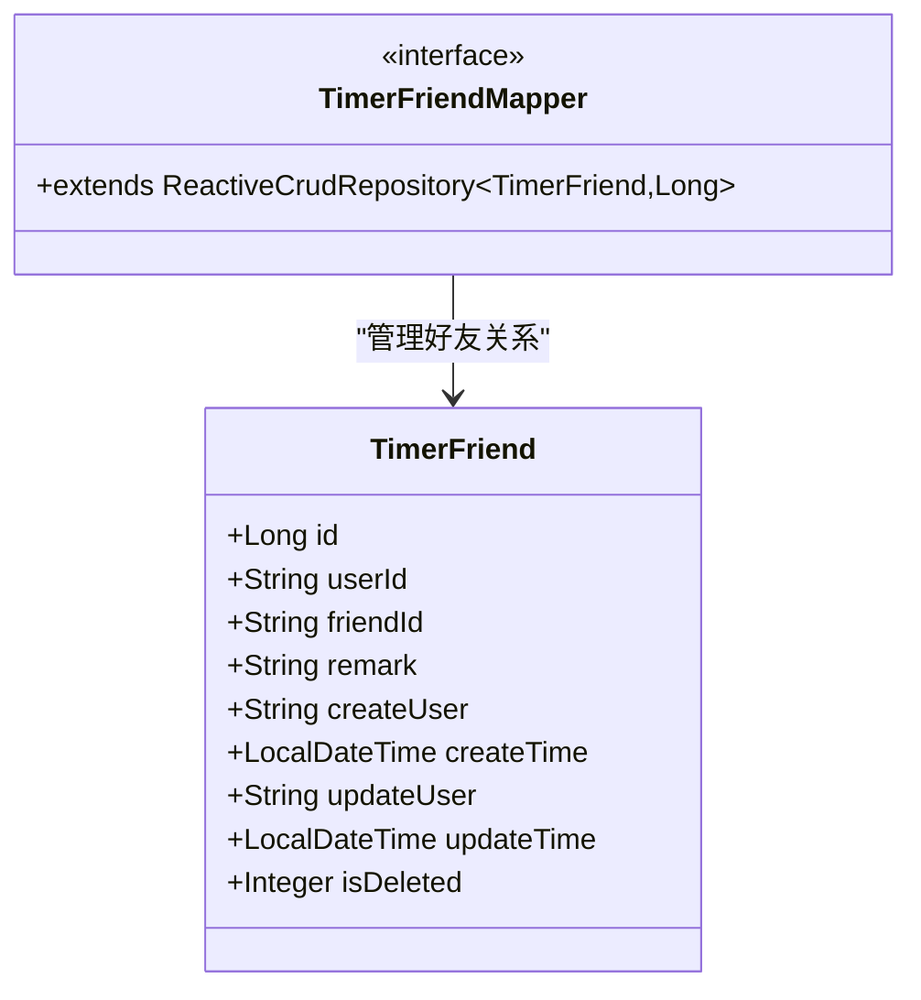
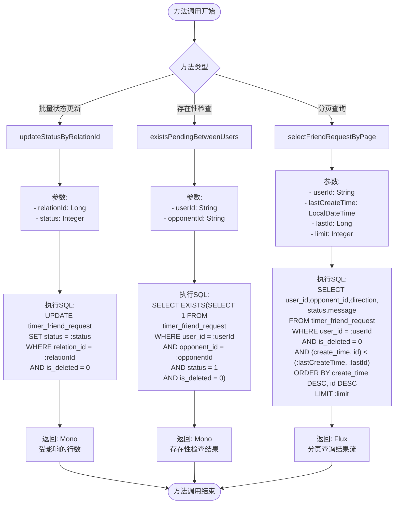
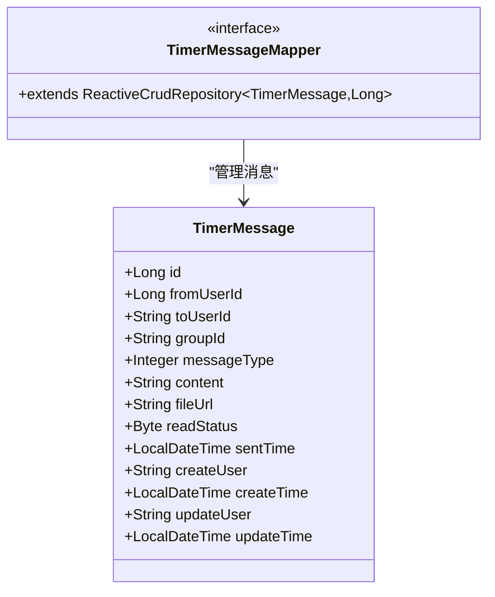
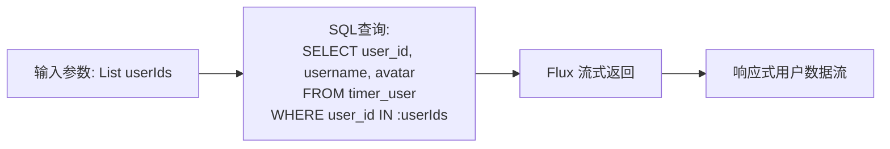
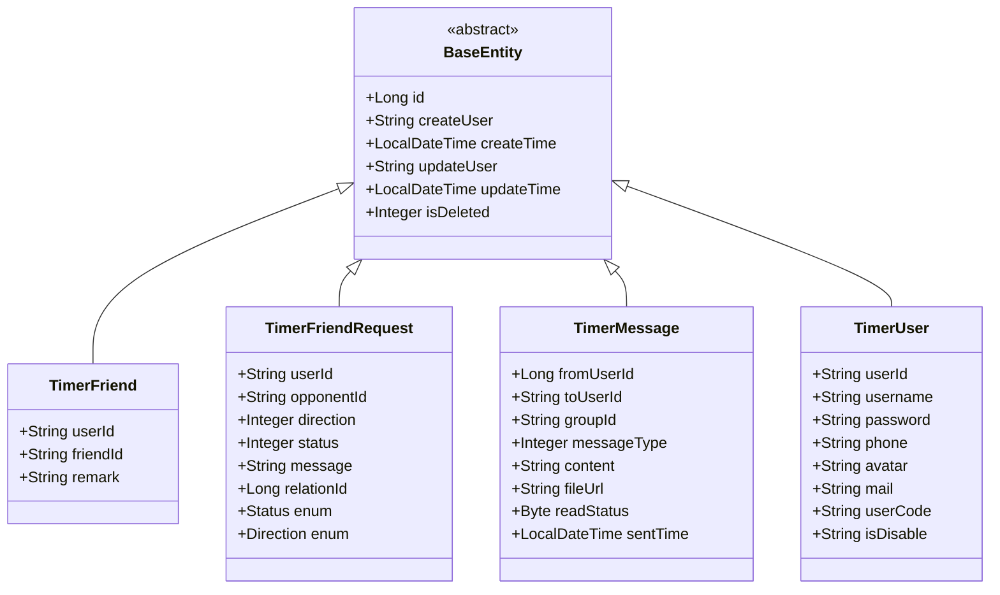
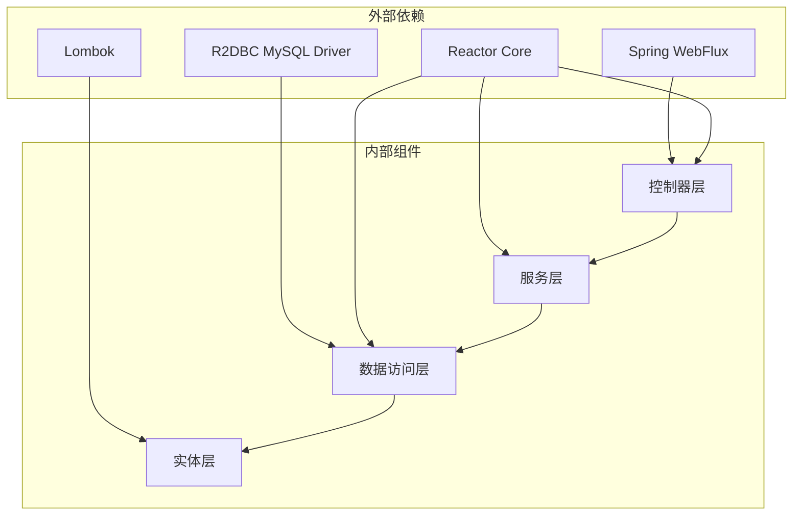

# Mapper接口设计

<cite>
**本文档引用的文件**
- [TimerFriendMapper.java](file://src/main/java/com/rivers/im/mapper/TimerFriendMapper.java)
- [TimerFriendRequestMapper.java](file://src/main/java/com/rivers/im/mapper/TimerFriendRequestMapper.java)
- [TimerMessageMapper.java](file://src/main/java/com/rivers/im/mapper/TimerMessageMapper.java)
- [TimerUserMapper.java](file://src/main/java/com/rivers/im/mapper/TimerUserMapper.java)
- [TimerFriend.java](file://src/main/java/com/rivers/im/entity/TimerFriend.java)
- [TimerFriendRequest.java](file://src/main/java/com/rivers/im/entity/TimerFriendRequest.java)
- [TimerMessage.java](file://src/main/java/com/rivers/im/entity/TimerMessage.java)
- [TimerUser.java](file://src/main/java/com/rivers/im/entity/TimerUser.java)
- [FriendServiceImpl.java](file://src/main/java/com/rivers/im/service/impl/FriendServiceImpl.java)
- [IFriendService.java](file://src/main/java/com/rivers/im/service/IFriendService.java)
- [FriendController.java](file://src/main/java/com/rivers/im/controller/FriendController.java)
- [build.gradle](file://build.gradle)
- [application.yml](file://src/main/resources/application.yml)
</cite>

## 目录
1. [简介](#简介)
2. [项目结构](#项目结构)
3. [核心组件](#核心组件)
4. [架构概览](#架构概览)
5. [详细组件分析](#详细组件分析)
6. [依赖分析](#依赖分析)
7. [性能考虑](#性能考虑)
8. [故障排除指南](#故障排除指南)
9. [结论](#结论)

## 简介

本项目采用Spring Data R2DBC和响应式编程模型构建IM服务器的数据库访问层。所有Mapper接口均基于ReactiveCrudRepository，实现了完全的响应式数据访问模式。本文档深入分析了四个核心Mapper接口的设计原则、最佳实践和实现细节，包括接口方法定义、参数传递和返回值处理策略。

## 项目结构

项目采用分层架构设计，核心数据访问层由四个专门的Mapper接口组成，每个接口对应一个实体类，遵循统一的命名规范和设计模式。



**图表来源**
- [FriendController.java:1-28](file://src/main/java/com/rivers/im/controller/FriendController.java#L1-L28)
- [FriendServiceImpl.java:1-106](file://src/main/java/com/rivers/im/service/impl/FriendServiceImpl.java#L1-L106)
- [TimerFriendMapper.java:1-8](file://src/main/java/com/rivers/im/mapper/TimerFriendMapper.java#L1-L8)

**章节来源**
- [build.gradle:31-45](file://build.gradle#L31-L45)
- [application.yml:1-14](file://src/main/resources/application.yml#L1-L14)

## 核心组件

### 响应式编程基础

项目采用Spring WebFlux和R2DBC实现完全的响应式数据访问层。所有Mapper接口都继承自ReactiveCrudRepository，支持Flux和Mono两种响应式类型。



**图表来源**
- [TimerFriendMapper.java:6](file://src/main/java/com/rivers/im/mapper/TimerFriendMapper.java#L6)
- [TimerFriendRequestMapper.java:12](file://src/main/java/com/rivers/im/mapper/TimerFriendRequestMapper.java#L12)
- [TimerMessageMapper.java:6](file://src/main/java/com/rivers/im/mapper/TimerMessageMapper.java#L6)
- [TimerUserMapper.java:10](file://src/main/java/com/rivers/im/mapper/TimerUserMapper.java#L10)

### 数据库连接配置

项目使用R2DBC连接MySQL数据库，配置了异步非阻塞的数据访问模式。

**章节来源**
- [build.gradle:37](file://build.gradle#L37)
- [build.gradle:41](file://build.gradle#L41)

## 架构概览

系统采用典型的三层架构，响应式编程贯穿整个数据访问层，实现了高并发和低延迟的数据处理能力。



**图表来源**
- [FriendController.java:23-26](file://src/main/java/com/rivers/im/controller/FriendController.java#L23-L26)
- [FriendServiceImpl.java:45-104](file://src/main/java/com/rivers/im/service/impl/FriendServiceImpl.java#L45-L104)
- [TimerFriendRequestMapper.java:40-44](file://src/main/java/com/rivers/im/mapper/TimerFriendRequestMapper.java#L40-L44)
- [TimerUserMapper.java:13-16](file://src/main/java/com/rivers/im/mapper/TimerUserMapper.java#L13-L16)

## 详细组件分析

### TimerFriendMapper - 好友关系映射器

TimerFriendMapper是最简单的Mapper接口，直接继承ReactiveCrudRepository，提供了标准的CRUD操作。



**图表来源**
- [TimerFriendMapper.java:6](file://src/main/java/com/rivers/im/mapper/TimerFriendMapper.java#L6)
- [TimerFriend.java:33-82](file://src/main/java/com/rivers/im/entity/TimerFriend.java#L33-L82)

**章节来源**
- [TimerFriendMapper.java:1-8](file://src/main/java/com/rivers/im/mapper/TimerFriendMapper.java#L1-L8)
- [TimerFriend.java:1-86](file://src/main/java/com/rivers/im/entity/TimerFriend.java#L1-L86)

### TimerFriendRequestMapper - 好友请求映射器

TimerFriendRequestMapper是最复杂的Mapper接口，包含了多个自定义查询方法，展示了响应式编程的最佳实践。

#### 核心方法分析



**图表来源**
- [TimerFriendRequestMapper.java:17-19](file://src/main/java/com/rivers/im/mapper/TimerFriendRequestMapper.java#L17-L19)
- [TimerFriendRequestMapper.java:25-29](file://src/main/java/com/rivers/im/mapper/TimerFriendRequestMapper.java#L25-L29)
- [TimerFriendRequestMapper.java:32-44](file://src/main/java/com/rivers/im/mapper/TimerFriendRequestMapper.java#L32-L44)

#### 方法签名设计特点

1. **批量状态更新方法** (`updateStatusByRelationId`)
   - 使用@Query注解定义复杂SQL语句
   - 参数使用@Param注解进行绑定
   - 返回Mono<Integer>表示受影响的行数
   - 支持一条SQL同时更新发送方和接收方记录

2. **存在性检查方法** (`existsPendingBetweenUsers`)
   - 利用SQL的EXISTS函数进行高效检查
   - 返回Integer类型的结果
   - 避免了不必要的数据加载

3. **分页查询方法** (`selectFriendRequestByPage`)
   - 实现了复合条件的分页查询
   - 使用复合排序键确保查询稳定性
   - 返回Flux<TimerFriendRequest>支持流式处理

**章节来源**
- [TimerFriendRequestMapper.java:1-45](file://src/main/java/com/rivers/im/mapper/TimerFriendRequestMapper.java#L1-L45)

### TimerMessageMapper - 消息映射器

TimerMessageMapper提供了标准的CRUD操作，用于管理聊天消息数据。



**图表来源**
- [TimerMessageMapper.java:6](file://src/main/java/com/rivers/im/mapper/TimerMessageMapper.java#L6)
- [TimerMessage.java:29-102](file://src/main/java/com/rivers/im/entity/TimerMessage.java#L29-L102)

**章节来源**
- [TimerMessageMapper.java:1-8](file://src/main/java/com/rivers/im/mapper/TimerMessageMapper.java#L1-L8)
- [TimerMessage.java:1-105](file://src/main/java/com/rivers/im/entity/TimerMessage.java#L1-L105)

### TimerUserMapper - 用户映射器

TimerUserMapper实现了自定义的批量用户查询功能。

#### 自定义查询方法



**图表来源**
- [TimerUserMapper.java:13-16](file://src/main/java/com/rivers/im/mapper/TimerUserMapper.java#L13-L16)

**章节来源**
- [TimerUserMapper.java:1-19](file://src/main/java/com/rivers/im/mapper/TimerUserMapper.java#L1-L19)
- [TimerUser.java:35-60](file://src/main/java/com/rivers/im/entity/TimerUser.java#L35-L60)

### 实体类设计模式

所有实体类都采用了统一的设计模式，确保了数据访问的一致性和可维护性。



**图表来源**
- [TimerFriend.java:28](file://src/main/java/com/rivers/im/entity/TimerFriend.java#L28)
- [TimerFriendRequest.java:15](file://src/main/java/com/rivers/im/entity/TimerFriendRequest.java#L15)
- [TimerMessage.java:24](file://src/main/java/com/rivers/im/entity/TimerMessage.java#L24)
- [TimerUser.java:24](file://src/main/java/com/rivers/im/entity/TimerUser.java#L24)

**章节来源**
- [TimerFriend.java:1-86](file://src/main/java/com/rivers/im/entity/TimerFriend.java#L1-L86)
- [TimerFriendRequest.java:1-101](file://src/main/java/com/rivers/im/entity/TimerFriendRequest.java#L1-L101)
- [TimerMessage.java:1-105](file://src/main/java/com/rivers/im/entity/TimerMessage.java#L1-L105)
- [TimerUser.java:1-111](file://src/main/java/com/rivers/im/entity/TimerUser.java#L1-L111)

## 依赖分析

### 组件耦合关系



**图表来源**
- [build.gradle:37](file://build.gradle#L37)
- [build.gradle:41](file://build.gradle#L41)
- [build.gradle:39](file://build.gradle#L39)

### 关键依赖特性

1. **响应式依赖链**
   - 控制器层：返回Mono<ResultVO>
   - 服务层：返回Mono或Flux
   - 数据访问层：返回ReactiveCrudRepository的响应式类型

2. **数据库驱动**
   - 使用R2DBC替代传统的JDBC
   - 支持异步非阻塞的数据库操作

3. **序列化支持**
   - 使用Jackson进行JSON序列化
   - 支持响应式数据流的序列化

**章节来源**
- [build.gradle:31-45](file://build.gradle#L31-L45)

## 性能考虑

### 响应式编程优势

1. **内存效率**
   - 流式处理避免了大对象的内存占用
   - 按需消费数据，减少内存峰值

2. **并发性能**
   - 异步非阻塞I/O模型
   - 更好的CPU利用率

3. **背压处理**
   - 自动的背压机制防止数据溢出
   - 可控的数据流速率

### 查询优化策略

1. **索引利用**
   - 分页查询使用复合索引 `(create_time, id)`
   - WHERE条件字段建立适当索引

2. **查询限制**
   - 使用LIMIT控制结果集大小
   - 避免SELECT *，只选择必要字段

3. **批处理优化**
   - IN子句使用合理的参数数量
   - 避免过大的参数列表

## 故障排除指南

### 常见问题及解决方案

1. **响应式流异常处理**
   ```java
   // 在服务层添加适当的错误处理
   return friendRequestMapper.selectFriendRequestByPage(...)
       .onErrorResume(error -> {
           log.error("查询好友请求失败", error);
           return Mono.empty();
       });
   ```

2. **数据库连接问题**
   - 检查R2DBC连接字符串配置
   - 验证MySQL服务可用性
   - 监控连接池状态

3. **背压问题**
   - 使用`buffer()`或`window()`控制数据流
   - 实施适当的超时机制
   - 监控内存使用情况

**章节来源**
- [FriendServiceImpl.java:45-104](file://src/main/java/com/rivers/im/service/impl/FriendServiceImpl.java#L45-L104)

## 结论

本项目在Mapper接口设计方面展现了现代响应式编程的最佳实践：

1. **设计原则**
   - 统一的命名规范和层次结构
   - 响应式编程模型的完整应用
   - 明确的职责分离和接口设计

2. **技术特色**
   - 完全的响应式数据访问层
   - 高效的批量操作和分页查询
   - 灵活的自定义查询方法

3. **扩展性考虑**
   - 基于ReactiveCrudRepository的扩展能力
   - 统一的实体设计模式
   - 清晰的依赖注入架构

这种设计模式为IM系统的高并发需求提供了坚实的技术基础，通过响应式编程实现了更好的性能和可扩展性。