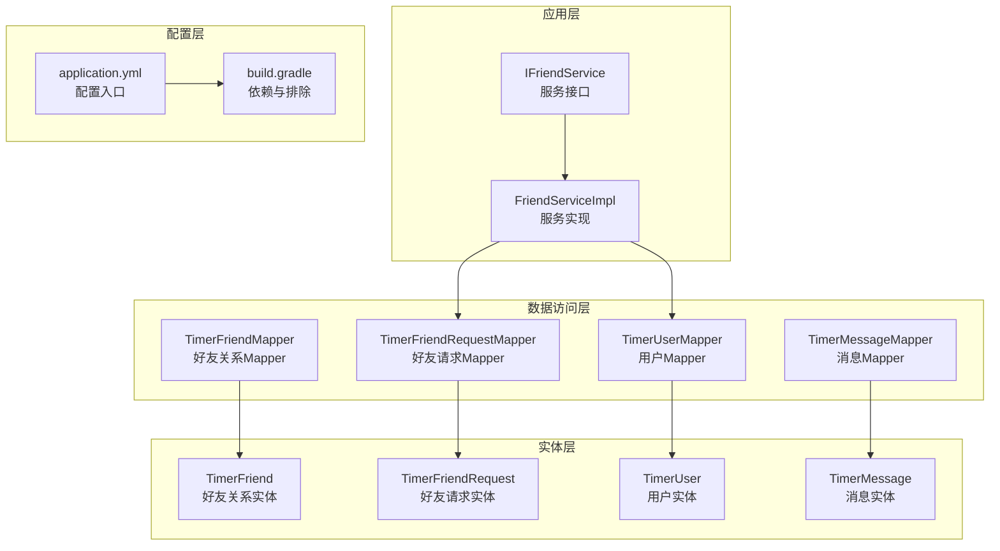
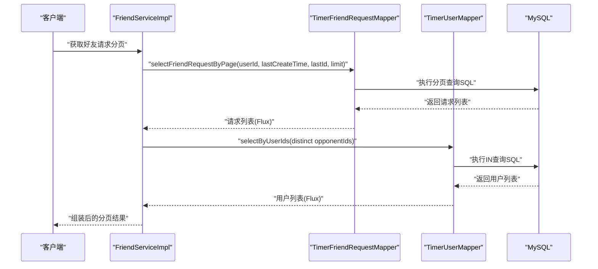
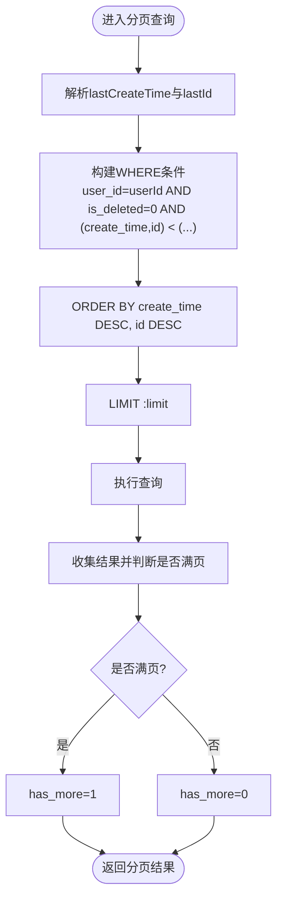
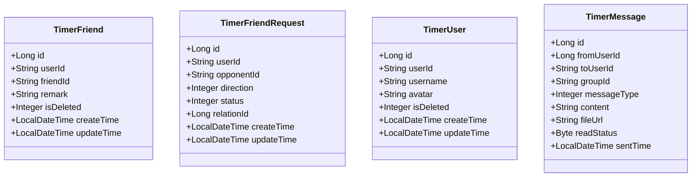
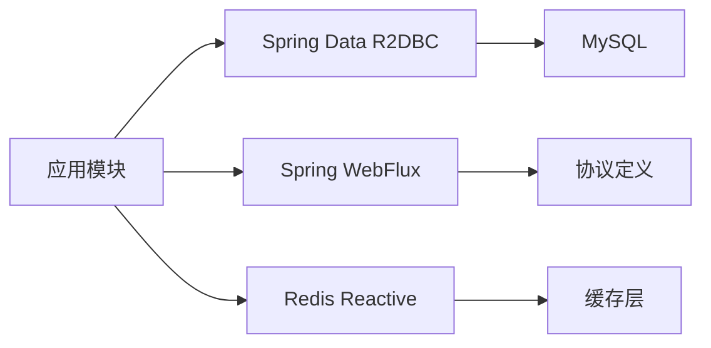

# SQL映射配置

<cite>
**本文引用的文件**
- [TimerFriendMapper.java](file://src/main/java/com/rivers/im/mapper/TimerFriendMapper.java)
- [TimerFriendRequestMapper.java](file://src/main/java/com/rivers/im/mapper/TimerFriendRequestMapper.java)
- [TimerMessageMapper.java](file://src/main/java/com/rivers/im/mapper/TimerMessageMapper.java)
- [TimerUserMapper.java](file://src/main/java/com/rivers/im/mapper/TimerUserMapper.java)
- [TimerFriend.java](file://src/main/java/com/rivers/im/entity/TimerFriend.java)
- [TimerFriendRequest.java](file://src/main/java/com/rivers/im/entity/TimerFriendRequest.java)
- [TimerMessage.java](file://src/main/java/com/rivers/im/entity/TimerMessage.java)
- [TimerUser.java](file://src/main/java/com/rivers/im/entity/TimerUser.java)
- [FriendServiceImpl.java](file://src/main/java/com/rivers/im/service/impl/FriendServiceImpl.java)
- [IFriendService.java](file://src/main/java/com/rivers/im/service/IFriendService.java)
- [application.yml](file://src/main/resources/application.yml)
- [build.gradle](file://build.gradle)
</cite>

## 目录
1. [简介](#简介)
2. [项目结构](#项目结构)
3. [核心组件](#核心组件)
4. [架构总览](#架构总览)
5. [详细组件分析](#详细组件分析)
6. [依赖分析](#依赖分析)
7. [性能考虑](#性能考虑)
8. [故障排查指南](#故障排查指南)
9. [结论](#结论)
10. [附录](#附录)

## 简介
本技术文档聚焦于IM服务器项目中的SQL映射配置与使用方式，系统性说明基于Spring Data R2DBC的响应式SQL映射设计：如何在无MyBatis XML映射文件的前提下，通过接口上的@Query注解与实体类的R2DBC注解完成SQL语句定义、参数绑定与结果映射；并结合实际业务场景，解析动态条件构造、分页查询、批量更新等常见需求的实现思路与注意事项。同时，提供SQL优化策略、索引利用建议、查询计划分析方法以及SQL注入防护与安全编码实践。

## 项目结构
本项目采用Spring Boot + Spring Data R2DBC + MySQL的响应式数据访问方案，未使用MyBatis XML映射文件。SQL映射由以下层次构成：
- 实体层：通过@Table与@Column注解声明表与字段映射关系
- 映射层：通过ReactiveCrudRepository接口与@Query注解声明SQL语句与参数绑定
- 服务层：组合多个Mapper执行业务流程，如分页查询+用户信息聚合
- 配置层：通过application.yml导入远程配置，构建R2DBC连接

图表来源
- [FriendServiceImpl.java:30-104](file://src/main/java/com/rivers/im/service/impl/FriendServiceImpl.java#L30-L104)
- [TimerFriendRequestMapper.java:12-67](file://src/main/java/com/rivers/im/mapper/TimerFriendRequestMapper.java#L12-L67)
- [TimerUserMapper.java:10-18](file://src/main/java/com/rivers/im/mapper/TimerUserMapper.java#L10-L18)
- [TimerFriend.java:27-82](file://src/main/java/com/rivers/im/entity/TimerFriend.java#L27-L82)
- [TimerFriendRequest.java:14-51](file://src/main/java/com/rivers/im/entity/TimerFriendRequest.java#L14-L51)
- [TimerUser.java:23-108](file://src/main/java/com/rivers/im/entity/TimerUser.java#L23-L108)
- [TimerMessage.java:23-104](file://src/main/java/com/rivers/im/entity/TimerMessage.java#L23-L104)
- [application.yml:1-14](file://src/main/resources/application.yml#L1-L14)
- [build.gradle:31-45](file://build.gradle#L31-L45)

章节来源
- [application.yml:1-14](file://src/main/resources/application.yml#L1-L14)
- [build.gradle:31-45](file://build.gradle#L31-L45)

## 核心组件
- 实体类：通过@Table与@Column标注表名与列名，配合@Id标识主键，用于ORM映射
- Mapper接口：继承ReactiveCrudRepository，部分方法使用@Query自定义SQL，参数通过@Param或方法参数名绑定
- 服务实现：组合多个Mapper，执行复杂业务流程，如分页查询与用户信息聚合

章节来源
- [TimerFriend.java:27-82](file://src/main/java/com/rivers/im/entity/TimerFriend.java#L27-L82)
- [TimerFriendRequest.java:14-51](file://src/main/java/com/rivers/im/entity/TimerFriendRequest.java#L14-L51)
- [TimerUser.java:23-108](file://src/main/java/com/rivers/im/entity/TimerUser.java#L23-L108)
- [TimerMessage.java:23-104](file://src/main/java/com/rivers/im/entity/TimerMessage.java#L23-L104)
- [TimerFriendMapper.java:1-8](file://src/main/java/com/rivers/im/mapper/TimerFriendMapper.java#L1-L8)
- [TimerFriendRequestMapper.java:12-67](file://src/main/java/com/rivers/im/mapper/TimerFriendRequestMapper.java#L12-L67)
- [TimerUserMapper.java:10-18](file://src/main/java/com/rivers/im/mapper/TimerUserMapper.java#L10-L18)
- [TimerMessageMapper.java:1-8](file://src/main/java/com/rivers/im/mapper/TimerMessageMapper.java#L1-L8)

## 架构总览
下图展示从服务层到数据访问层再到实体层的整体交互，以及关键SQL映射点：

图表来源
- [FriendServiceImpl.java:46-104](file://src/main/java/com/rivers/im/service/impl/FriendServiceImpl.java#L46-L104)
- [TimerFriendRequestMapper.java:32-44](file://src/main/java/com/rivers/im/mapper/TimerFriendRequestMapper.java#L32-L44)
- [TimerUserMapper.java:13-16](file://src/main/java/com/rivers/im/mapper/TimerUserMapper.java#L13-L16)

## 详细组件分析

### TimerFriendRequestMapper：条件查询与分页
- 分页查询：通过复合条件与LIMIT实现“上一页”翻页，避免全表扫描
- 动态条件：根据lastCreateTime与lastId进行降序分页，确保一致性
- 参数绑定：使用@Param明确命名参数，提升可读性与可维护性
- 批量更新：按relationId同时更新双方记录，减少往返次数
- 存在性检查：使用EXISTS快速判断是否存在待处理请求

图表来源
- [TimerFriendRequestMapper.java:32-44](file://src/main/java/com/rivers/im/mapper/TimerFriendRequestMapper.java#L32-L44)

章节来源
- [TimerFriendRequestMapper.java:12-67](file://src/main/java/com/rivers/im/mapper/TimerFriendRequestMapper.java#L12-L67)

### TimerUserMapper：批量IN查询
- 批量查询：通过IN子句一次性查询多个用户，减少多次往返
- 字段选择：仅查询必要字段，降低网络与内存开销
- 参数绑定：使用集合参数自动展开为IN列表

章节来源
- [TimerUserMapper.java:10-18](file://src/main/java/com/rivers/im/mapper/TimerUserMapper.java#L10-L18)
- [FriendServiceImpl.java:67-76](file://src/main/java/com/rivers/im/service/impl/FriendServiceImpl.java#L67-L76)

### TimerFriendMapper与TimerMessageMapper：基础CRUD
- 继承ReactiveCrudRepository：提供通用的响应式CRUD能力
- 本项目中未显式定义@Query，遵循约定优于配置原则

章节来源
- [TimerFriendMapper.java:1-8](file://src/main/java/com/rivers/im/mapper/TimerFriendMapper.java#L1-L8)
- [TimerMessageMapper.java:1-8](file://src/main/java/com/rivers/im/mapper/TimerMessageMapper.java#L1-L8)

### 实体类映射关系
- 表与类映射：@Table定义表名，@Column定义列名，@Id定义主键
- 时间字段：统一使用LocalDateTime，便于序列化与排序
- 枚举字段：通过枚举类型表达状态与方向，增强可读性

图表来源
- [TimerFriend.java:27-82](file://src/main/java/com/rivers/im/entity/TimerFriend.java#L27-L82)
- [TimerFriendRequest.java:14-51](file://src/main/java/com/rivers/im/entity/TimerFriendRequest.java#L14-L51)
- [TimerUser.java:23-108](file://src/main/java/com/rivers/im/entity/TimerUser.java#L23-L108)
- [TimerMessage.java:23-104](file://src/main/java/com/rivers/im/entity/TimerMessage.java#L23-L104)

## 依赖分析
- 数据库驱动：使用io.asyncer:r2dbc-mysql作为R2DBC驱动
- ORM框架：Spring Data R2DBC负责响应式SQL映射与执行
- Web框架：WebFlux提供非阻塞HTTP处理能力
- 配置管理：通过Nacos导入远端配置，集中管理数据库连接等参数

图表来源
- [build.gradle:31-45](file://build.gradle#L31-L45)

章节来源
- [build.gradle:31-45](file://build.gradle#L31-L45)
- [application.yml:1-14](file://src/main/resources/application.yml#L1-L14)

## 性能考虑
- 分页策略
  - 使用复合条件与LIMIT实现高效分页，避免OFFSET过大导致的性能问题
  - 建议在create_time与id上建立联合索引，保证排序与过滤效率
- 批量查询
  - IN查询应限制参数数量，避免过长SQL与网络传输压力
  - 可考虑分批查询或临时表优化大批量场景
- 更新策略
  - 批量更新按relationId同时更新双方记录，减少往返次数
  - 建议对relation_id与is_deleted建立索引，加速WHERE过滤
- 连接与资源
  - 合理设置连接池大小与超时时间，避免并发高时的连接争用
  - 使用响应式编程模型，充分利用非阻塞I/O提升吞吐

## 故障排查指南
- 参数绑定问题
  - 确认@Param名称与SQL中命名参数一致，避免运行时绑定失败
  - 对于集合参数，确保传入值非空且元素类型正确
- 查询异常
  - 检查WHERE条件中字段是否带is_deleted过滤，避免误删数据被查询到
  - 分页查询需确保排序字段包含在索引中，防止隐式排序导致慢查询
- 结果映射问题
  - 确保实体类字段与数据库列名一致或通过@Column正确映射
  - 对枚举字段，确认数据库存储值与枚举定义一致
- 安全与注入
  - 严格使用命名参数绑定，避免字符串拼接
  - 对输入参数进行白名单校验与长度限制
  - 对IN参数控制数量，防止爆破攻击

章节来源
- [TimerFriendRequestMapper.java:12-67](file://src/main/java/com/rivers/im/mapper/TimerFriendRequestMapper.java#L12-L67)
- [TimerUserMapper.java:10-18](file://src/main/java/com/rivers/im/mapper/TimerUserMapper.java#L10-L18)
- [FriendServiceImpl.java:46-104](file://src/main/java/com/rivers/im/service/impl/FriendServiceImpl.java#L46-L104)

## 结论
本项目采用Spring Data R2DBC实现响应式SQL映射，通过@Query与实体注解完成SQL定义、参数绑定与结果映射，避免了传统MyBatis XML映射的复杂度。在好友请求分页、用户批量查询等场景中，该方案具备良好的可维护性与扩展性。建议后续结合业务增长，持续完善索引策略、连接池配置与监控告警体系，进一步提升系统稳定性与性能表现。

## 附录
- 安全编码实践
  - 始终使用命名参数绑定，禁止字符串拼接SQL
  - 对输入参数进行长度、格式与范围校验
  - 对敏感字段（如密码）避免在日志中输出
  - 对IN参数设置上限，防止大规模爆破
- SQL优化清单
  - 为高频查询字段建立合适索引（如联合索引）
  - 使用LIMIT限制单次返回行数
  - 避免SELECT *，仅查询必要字段
  - 对分页查询使用覆盖索引，减少回表