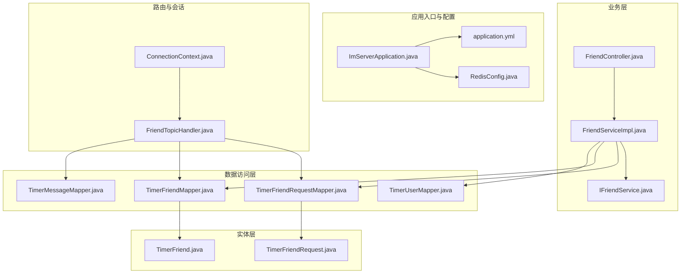
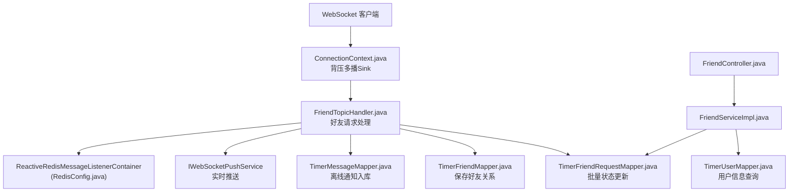
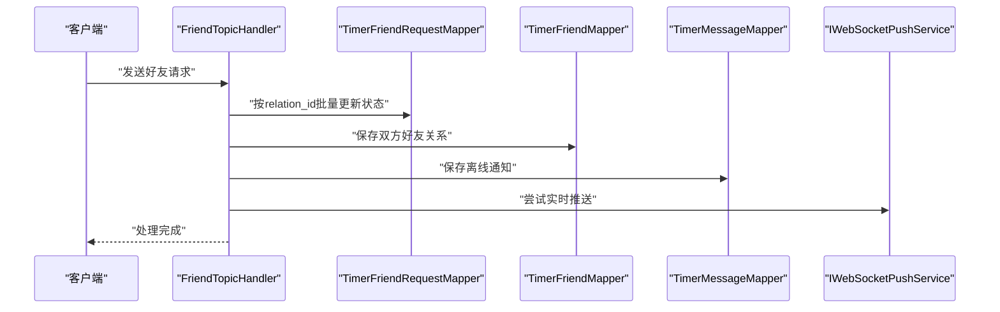
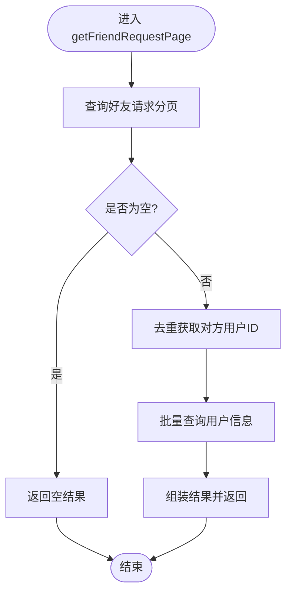
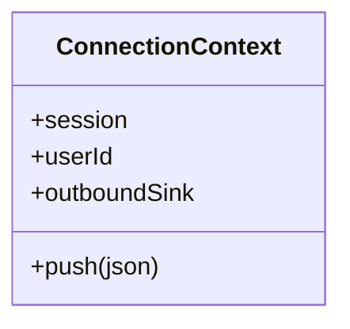
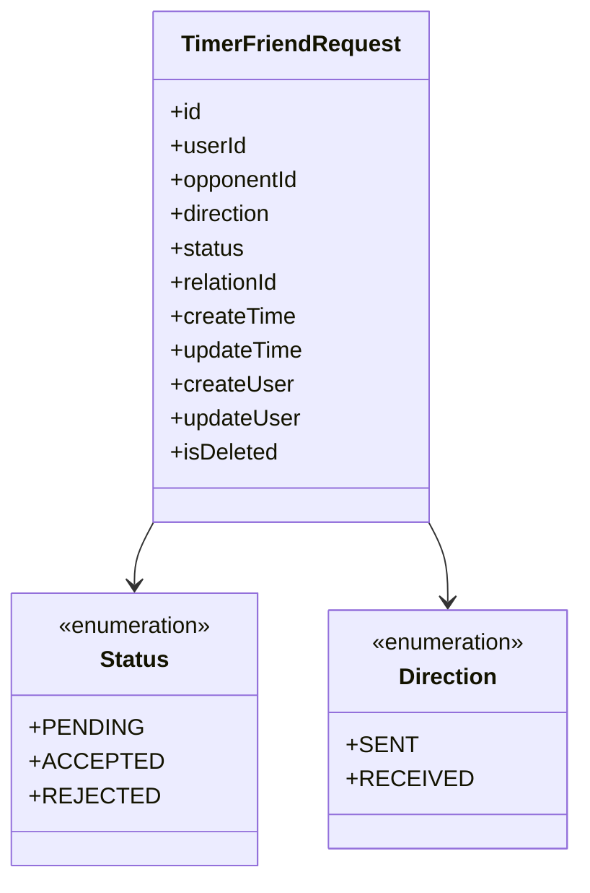
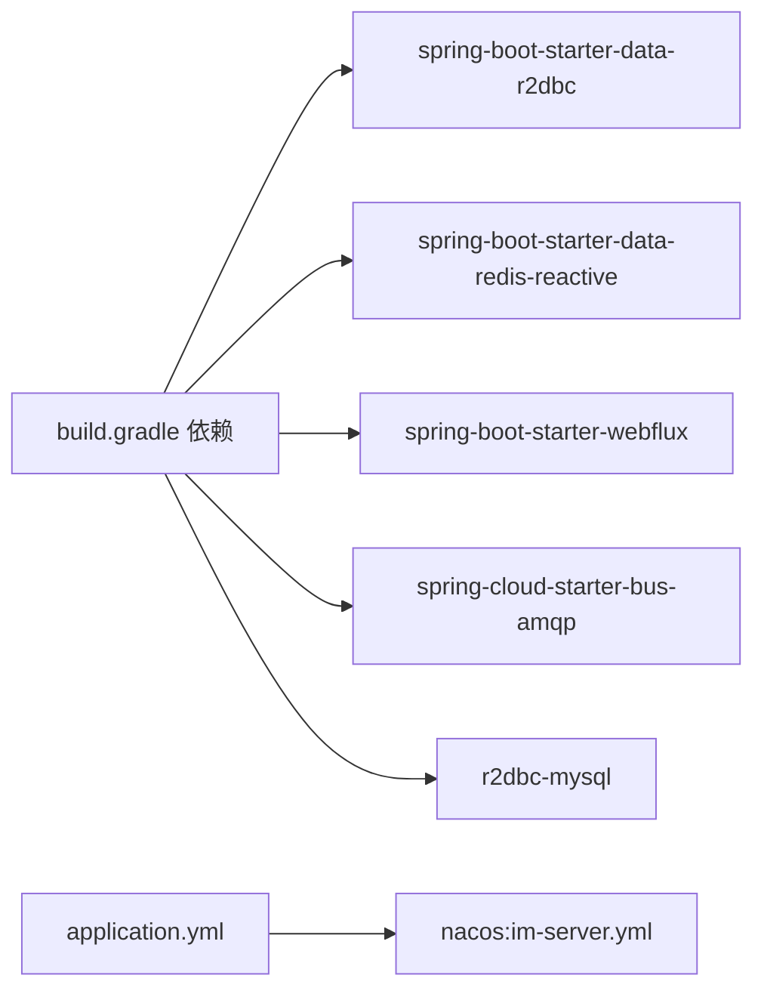

# 事务管理

<cite>
**本文引用的文件**
- [ImServerApplication.java](file://src/main/java/com/rivers/im/ImServerApplication.java)
- [application.yml](file://src/main/resources/application.yml)
- [RedisConfig.java](file://src/main/java/com/rivers/im/config/RedisConfig.java)
- [ConnectionContext.java](file://src/main/java/com/rivers/im/context/ConnectionContext.java)
- [FriendTopicHandler.java](file://src/main/java/com/rivers/im/router/FriendTopicHandler.java)
- [FriendController.java](file://src/main/java/com/rivers/im/controller/FriendController.java)
- [FriendServiceImpl.java](file://src/main/java/com/rivers/im/service/impl/FriendServiceImpl.java)
- [IFriendService.java](file://src/main/java/com/rivers/im/service/IFriendService.java)
- [TimerFriendRequestMapper.java](file://src/main/java/com/rivers/im/mapper/TimerFriendRequestMapper.java)
- [TimerFriendMapper.java](file://src/main/java/com/rivers/im/mapper/TimerFriendMapper.java)
- [TimerUserMapper.java](file://src/main/java/com/rivers/im/mapper/TimerUserMapper.java)
- [TimerMessageMapper.java](file://src/main/java/com/rivers/im/mapper/TimerMessageMapper.java)
- [TimerFriendRequest.java](file://src/main/java/com/rivers/im/entity/TimerFriendRequest.java)
- [TimerFriend.java](file://src/main/java/com/rivers/im/entity/TimerFriend.java)
- [build.gradle](file://build.gradle)
</cite>

## 目录
1. [引言](#引言)
2. [项目结构](#项目结构)
3. [核心组件](#核心组件)
4. [架构总览](#架构总览)
5. [详细组件分析](#详细组件分析)
6. [依赖分析](#依赖分析)
7. [性能考虑](#性能考虑)
8. [故障排查指南](#故障排查指南)
9. [结论](#结论)
10. [附录](#附录)

## 引言
本文件围绕响应式环境下的事务管理进行系统性技术说明，结合仓库中实际实现，重点覆盖以下主题：
- 响应式事务注解与限制：解释在响应式栈中使用传统声明式事务注解的局限，并给出可行的替代方案。
- 分布式事务策略：基于现有“写扩散”与“单表批量更新”的设计，提出Saga模式与最终一致性的落地思路。
- 事务隔离级别、回滚策略与并发控制：结合R2DBC与Reactive Streams特性，讨论隔离与并发控制现状及改进建议。
- 性能优化与异常处理最佳实践：从数据访问、网络推送、缓存与消息监听等维度给出优化建议。

## 项目结构
本项目采用Spring Boot 4 + Spring WebFlux + R2DBC + 响应式Redis的响应式架构。核心模块划分如下：
- 应用入口与配置：应用启动类、外部化配置、Redis响应式连接容器。
- 路由与会话：WebSocket路由处理器、连接上下文与背压推送。
- 业务层：好友请求分页查询、好友关系变更处理。
- 数据访问层：基于ReactiveCrudRepository与自定义R2DBC查询的映射接口。
- 实体层：领域对象与枚举（状态、方向）。

**图表来源**
- [ImServerApplication.java:1-14](file://src/main/java/com/rivers/im/ImServerApplication.java#L1-L14)
- [application.yml:1-14](file://src/main/resources/application.yml#L1-L14)
- [RedisConfig.java:1-18](file://src/main/java/com/rivers/im/config/RedisConfig.java#L1-L18)
- [ConnectionContext.java:1-24](file://src/main/java/com/rivers/im/context/ConnectionContext.java#L1-L24)
- [FriendTopicHandler.java:1-276](file://src/main/java/com/rivers/im/router/FriendTopicHandler.java#L1-L276)
- [FriendController.java:1-28](file://src/main/java/com/rivers/im/controller/FriendController.java#L1-L28)
- [FriendServiceImpl.java:1-106](file://src/main/java/com/rivers/im/service/impl/FriendServiceImpl.java#L1-L106)
- [IFriendService.java:1-12](file://src/main/java/com/rivers/im/service/IFriendService.java#L1-L12)
- [TimerFriendRequestMapper.java:1-68](file://src/main/java/com/rivers/im/mapper/TimerFriendRequestMapper.java#L1-L68)
- [TimerFriendMapper.java:1-8](file://src/main/java/com/rivers/im/mapper/TimerFriendMapper.java#L1-L8)
- [TimerUserMapper.java:1-19](file://src/main/java/com/rivers/im/mapper/TimerUserMapper.java#L1-L19)
- [TimerMessageMapper.java:1-8](file://src/main/java/com/rivers/im/mapper/TimerMessageMapper.java#L1-L8)
- [TimerFriendRequest.java:1-101](file://src/main/java/com/rivers/im/entity/TimerFriendRequest.java#L1-L101)
- [TimerFriend.java:1-86](file://src/main/java/com/rivers/im/entity/TimerFriend.java#L1-L86)

**章节来源**
- [ImServerApplication.java:1-14](file://src/main/java/com/rivers/im/ImServerApplication.java#L1-L14)
- [application.yml:1-14](file://src/main/resources/application.yml#L1-L14)
- [build.gradle:31-45](file://build.gradle#L31-L45)

## 核心组件
- 响应式事务注解与限制
  - 在响应式栈中，Spring的@Transactional注解不支持跨Reactor调度器的事务传播，且R2DBC默认不提供全局事务语义。因此，@Transactional在当前实现中并不具备传统同步事务的强一致性保障。
  - 替代方案
    - 使用R2DBC事务API（如Connection在同一线程/调度器内）进行细粒度控制。
    - 对于跨多个资源或跨服务的场景，采用事件驱动与补偿机制（见后续分布式事务章节）。
- 分布式事务策略
  - 写扩散与单表批量更新：在好友请求处理中，通过relation_id将发送方与接收方两条记录绑定，使用单条SQL批量更新状态，确保双方状态一致。
  - Saga模式与最终一致性：对更复杂的跨服务流程，建议以事件为中心，拆分为多个本地事务步骤，通过补偿动作实现最终一致性。
- 事务隔离级别与并发控制
  - 当前实现未显式设置隔离级别；默认行为取决于底层R2DBC驱动与数据库配置。
  - 并发控制：Reactive Streams的背压与多播Sink用于保障推送侧的线程安全与有序消费；数据访问层通过Mono/Flux的组合实现非阻塞串行与并行。
- 异常处理与回滚策略
  - 对外层调用使用onErrorResume进行降级（如忽略错误、返回空结果），避免异常向上传播影响整体链路。
  - 对内部数据库操作，采用doOnError记录日志并在必要时中断后续步骤。

**章节来源**
- [FriendTopicHandler.java:72-136](file://src/main/java/com/rivers/im/router/FriendTopicHandler.java#L72-L136)
- [FriendTopicHandler.java:138-220](file://src/main/java/com/rivers/im/router/FriendTopicHandler.java#L138-L220)
- [FriendServiceImpl.java:45-104](file://src/main/java/com/rivers/im/service/impl/FriendServiceImpl.java#L45-L104)

## 架构总览
下图展示了从WebSocket路由到数据库持久化的典型路径，以及与Redis的协作点（票据与消息监听）。

**图表来源**
- [ConnectionContext.java:1-24](file://src/main/java/com/rivers/im/context/ConnectionContext.java#L1-L24)
- [FriendTopicHandler.java:1-276](file://src/main/java/com/rivers/im/router/FriendTopicHandler.java#L1-L276)
- [TimerFriendRequestMapper.java:1-68](file://src/main/java/com/rivers/im/mapper/TimerFriendRequestMapper.java#L1-L68)
- [TimerFriendMapper.java:1-8](file://src/main/java/com/rivers/im/mapper/TimerFriendMapper.java#L1-L8)
- [TimerMessageMapper.java:1-8](file://src/main/java/com/rivers/im/mapper/TimerMessageMapper.java#L1-L8)
- [FriendController.java:1-28](file://src/main/java/com/rivers/im/controller/FriendController.java#L1-L28)
- [FriendServiceImpl.java:1-106](file://src/main/java/com/rivers/im/service/impl/FriendServiceImpl.java#L1-L106)
- [TimerUserMapper.java:1-19](file://src/main/java/com/rivers/im/mapper/TimerUserMapper.java#L1-L19)
- [RedisConfig.java:1-18](file://src/main/java/com/rivers/im/config/RedisConfig.java#L1-L18)

## 详细组件分析

### 好友请求处理（写扩散与批量更新）
该组件演示了在响应式环境下如何通过单条SQL批量更新与双端写入，实现强一致的状态同步，并结合离线消息与实时推送完成闭环。

**图表来源**
- [FriendTopicHandler.java:138-185](file://src/main/java/com/rivers/im/router/FriendTopicHandler.java#L138-L185)
- [TimerFriendRequestMapper.java:17-19](file://src/main/java/com/rivers/im/mapper/TimerFriendRequestMapper.java#L17-L19)
- [TimerFriendMapper.java:1-8](file://src/main/java/com/rivers/im/mapper/TimerFriendMapper.java#L1-L8)
- [TimerMessageMapper.java:1-8](file://src/main/java/com/rivers/im/mapper/TimerMessageMapper.java#L1-L8)

**章节来源**
- [FriendTopicHandler.java:72-136](file://src/main/java/com/rivers/im/router/FriendTopicHandler.java#L72-L136)
- [FriendTopicHandler.java:138-220](file://src/main/java/com/rivers/im/router/FriendTopicHandler.java#L138-L220)

### 好友请求分页查询（响应式聚合）
该组件展示了典型的响应式数据聚合：先查询请求列表，再根据对方用户ID批量查询用户信息，最后组装结果返回。

**图表来源**
- [FriendServiceImpl.java:45-104](file://src/main/java/com/rivers/im/service/impl/FriendServiceImpl.java#L45-L104)
- [TimerUserMapper.java:13-16](file://src/main/java/com/rivers/im/mapper/TimerUserMapper.java#L13-L16)

**章节来源**
- [FriendServiceImpl.java:45-104](file://src/main/java/com/rivers/im/service/impl/FriendServiceImpl.java#L45-L104)
- [IFriendService.java:1-12](file://src/main/java/com/rivers/im/service/IFriendService.java#L1-L12)

### 连接上下文与推送（背压与多播）
连接上下文使用Reactor的Sinks.Many配合背压缓冲，确保在高并发推送场景下的线程安全与有序消费。

**图表来源**
- [ConnectionContext.java:1-24](file://src/main/java/com/rivers/im/context/ConnectionContext.java#L1-L24)

**章节来源**
- [ConnectionContext.java:1-24](file://src/main/java/com/rivers/im/context/ConnectionContext.java#L1-L24)

### 实体模型（状态与方向）
实体中的枚举用于表达状态与方向，便于在路由与服务层进行条件判断与展示。

**图表来源**
- [TimerFriendRequest.java:54-99](file://src/main/java/com/rivers/im/entity/TimerFriendRequest.java#L54-L99)

**章节来源**
- [TimerFriendRequest.java:1-101](file://src/main/java/com/rivers/im/entity/TimerFriendRequest.java#L1-L101)

## 依赖分析
- 响应式栈与数据库
  - 使用Spring Boot Starter WebFlux、Spring Data R2DBC与MySQL R2DBC驱动，构建响应式数据访问层。
  - 依赖中包含Reactive Redis与消息总线，用于会话票据与事件广播。
- 事务相关依赖
  - 未引入JTA或全局事务管理器依赖，表明当前实现不依赖传统分布式事务框架。
- 配置与外部化
  - application.yml通过Nacos导入配置，便于在不同环境切换。

**图表来源**
- [build.gradle:31-45](file://build.gradle#L31-L45)
- [application.yml:1-14](file://src/main/resources/application.yml#L1-L14)

**章节来源**
- [build.gradle:31-45](file://build.gradle#L31-L45)
- [application.yml:1-14](file://src/main/resources/application.yml#L1-L14)

## 性能考虑
- 数据访问层
  - 使用Flux/Mono的组合进行批量查询与并行保存，减少往返次数。
  - 对高频查询建立合适的索引（如relation_id、user_id+status、create_time/id复合排序键）。
- 网络与推送
  - 使用背压缓冲与多播Sink降低高并发下的内存压力与丢包风险。
  - 实时推送失败时快速降级至离线消息入库，避免阻塞主流程。
- 缓存与会话
  - 会话票据使用Redis短生命周期存储，结合读取后删除操作，降低并发冲突。
- 事务与隔离
  - 在单数据库、单连接的场景下，尽量在同一事务边界内完成相关写操作，减少锁竞争。
  - 如需跨服务，优先采用事件驱动与幂等设计，避免长事务占用资源。

## 故障排查指南
- 常见问题定位
  - 好友请求状态未更新：检查relation_id是否正确、批量更新SQL是否执行成功。
  - 接受/拒绝请求无效：确认请求状态为待处理、目标用户匹配、方向为收到的请求。
  - 实时推送失败：查看推送服务日志与用户在线状态，确认降级逻辑生效。
- 日志与监控
  - 关键路径均记录warn/error日志，便于快速定位异常。
  - 对数据库操作使用doOnError记录异常堆栈，便于回溯。
- 回滚与补偿
  - 对于写扩散的两条记录，若一方保存成功而另一方失败，建议在上层增加补偿或重试机制（例如基于消息队列的异步补偿）。

**章节来源**
- [FriendTopicHandler.java:138-220](file://src/main/java/com/rivers/im/router/FriendTopicHandler.java#L138-L220)
- [FriendTopicHandler.java:225-274](file://src/main/java/com/rivers/im/router/FriendTopicHandler.java#L225-L274)

## 结论
本项目在响应式环境中通过“写扩散+单表批量更新”的方式实现了好友请求流程的强一致状态同步，并结合离线消息与实时推送完成了端到端体验。由于未引入全局事务框架，事务管理主要依赖于：
- 同一事务边界的细粒度控制；
- 事件驱动与补偿机制（面向未来的Saga模式）；
- 背压与多播等响应式特性保障高并发下的稳定性与性能。

## 附录
- 响应式事务注解使用建议
  - 不要在跨调度器的方法间使用@Transactional，避免事务边界跨越导致的不可控行为。
  - 对需要强一致的写扩散操作，优先使用R2DBC的Connection级事务控制，并在同一线程内完成所有相关写操作。
- 分布式事务策略建议
  - 对于更复杂的跨服务流程，采用事件驱动架构，将长流程拆分为多个本地事务步骤，通过补偿动作实现最终一致性。
- 并发控制与隔离
  - 明确数据库与驱动的默认隔离级别，必要时通过DDL或驱动参数调整。
  - 对热点数据增加缓存与限流，避免数据库成为瓶颈。