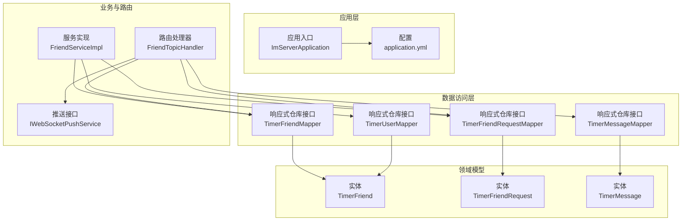
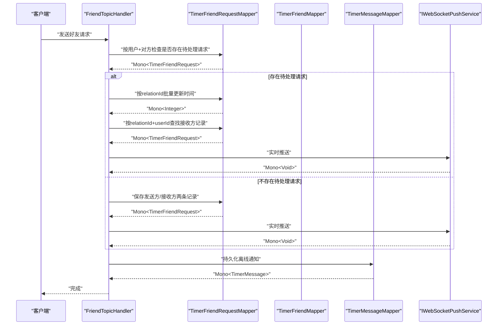
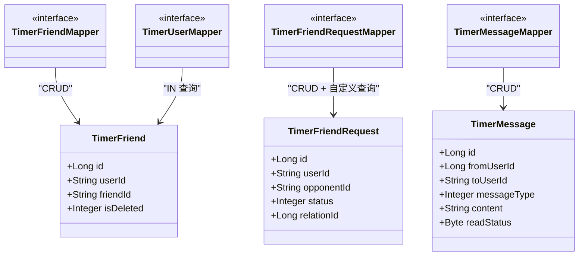
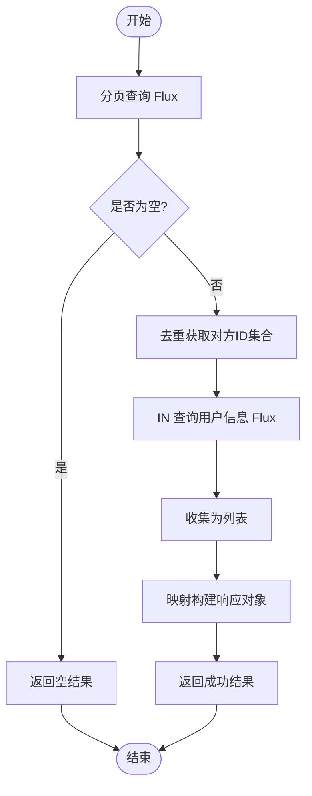
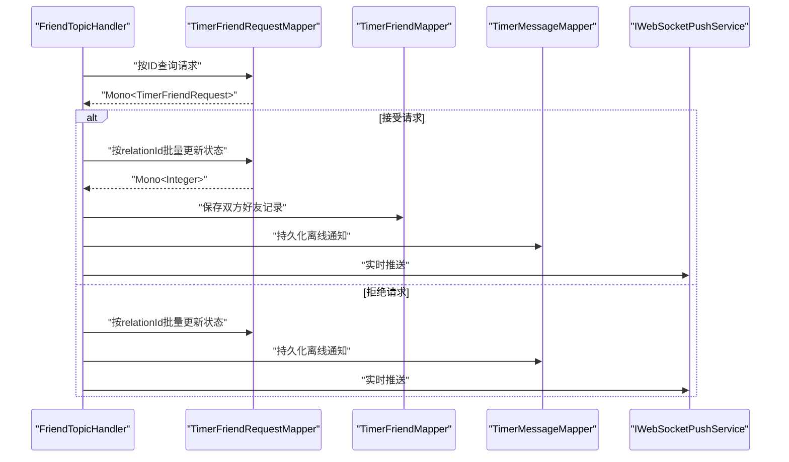
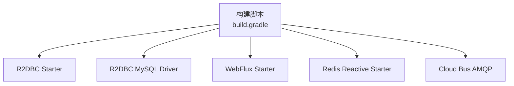

# 响应式数据库访问

<cite>
**本文引用的文件**
- [ImServerApplication.java](file://src/main/java/com/rivers/im/ImServerApplication.java)
- [application.yml](file://src/main/resources/application.yml)
- [build.gradle](file://build.gradle)
- [ConnectionContext.java](file://src/main/java/com/rivers/im/context/ConnectionContext.java)
- [TimerFriendMapper.java](file://src/main/java/com/rivers/im/mapper/TimerFriendMapper.java)
- [TimerFriendRequestMapper.java](file://src/main/java/com/rivers/im/mapper/TimerFriendRequestMapper.java)
- [TimerMessageMapper.java](file://src/main/java/com/rivers/im/mapper/TimerMessageMapper.java)
- [TimerUserMapper.java](file://src/main/java/com/rivers/im/mapper/TimerUserMapper.java)
- [TimerFriend.java](file://src/main/java/com/rivers/im/entity/TimerFriend.java)
- [TimerFriendRequest.java](file://src/main/java/com/rivers/im/entity/TimerFriendRequest.java)
- [TimerMessage.java](file://src/main/java/com/rivers/im/entity/TimerMessage.java)
- [FriendServiceImpl.java](file://src/main/java/com/rivers/im/service/impl/FriendServiceImpl.java)
- [FriendTopicHandler.java](file://src/main/java/com/rivers/im/router/FriendTopicHandler.java)
- [IWebSocketPushService.java](file://src/main/java/com/rivers/im/service/IWebSocketPushService.java)
- [RedisConfig.java](file://src/main/java/com/rivers/im/config/RedisConfig.java)
</cite>

## 目录
1. [引言](#引言)
2. [项目结构](#项目结构)
3. [核心组件](#核心组件)
4. [架构总览](#架构总览)
5. [详细组件分析](#详细组件分析)
6. [依赖分析](#依赖分析)
7. [性能考虑](#性能考虑)
8. [故障排查指南](#故障排查指南)
9. [结论](#结论)
10. [附录](#附录)

## 引言
本技术文档围绕响应式数据库访问展开，聚焦于 Spring Data R2DBC 在项目中的集成与使用，涵盖异步查询执行、背压处理与流式数据处理；深入解析响应式 Repository 的实现方式及 Flux/Mono 的使用场景与性能优势；阐述连接池管理、事务处理与错误处理机制，并总结响应式编程最佳实践与常见陷阱。

## 项目结构
该项目采用 Spring Boot 4 + WebFlux + R2DBC + 响应式 Redis 的现代化响应式架构。核心模块包括：
- 应用入口与配置：应用启动类、通用配置与 Nacos 动态配置导入
- 数据访问层：基于 Spring Data R2DBC 的响应式 Repository（ReactiveCrudRepository 扩展）
- 领域模型：基于注解映射的实体类（@Table/@Column/@Id）
- 业务服务层：以响应式组合为主的服务实现（Flux/Mono）
- 路由与推送：基于 WebSocket 的实时推送与消息持久化

图表来源
- [ImServerApplication.java:1-14](file://src/main/java/com/rivers/im/ImServerApplication.java#L1-L14)
- [application.yml:1-14](file://src/main/resources/application.yml#L1-L14)
- [TimerFriendMapper.java:1-8](file://src/main/java/com/rivers/im/mapper/TimerFriendMapper.java#L1-L8)
- [TimerFriendRequestMapper.java:1-68](file://src/main/java/com/rivers/im/mapper/TimerFriendRequestMapper.java#L1-L68)
- [TimerUserMapper.java:1-19](file://src/main/java/com/rivers/im/mapper/TimerUserMapper.java#L1-L19)
- [TimerMessageMapper.java:1-8](file://src/main/java/com/rivers/im/mapper/TimerMessageMapper.java#L1-L8)
- [TimerFriend.java:1-86](file://src/main/java/com/rivers/im/entity/TimerFriend.java#L1-L86)
- [TimerFriendRequest.java:1-101](file://src/main/java/com/rivers/im/entity/TimerFriendRequest.java#L1-L101)
- [TimerMessage.java:1-105](file://src/main/java/com/rivers/im/entity/TimerMessage.java#L1-L105)
- [FriendServiceImpl.java:1-106](file://src/main/java/com/rivers/im/service/impl/FriendServiceImpl.java#L1-L106)
- [FriendTopicHandler.java:1-276](file://src/main/java/com/rivers/im/router/FriendTopicHandler.java#L1-L276)
- [IWebSocketPushService.java:1-12](file://src/main/java/com/rivers/im/service/IWebSocketPushService.java#L1-L12)

章节来源
- [ImServerApplication.java:1-14](file://src/main/java/com/rivers/im/ImServerApplication.java#L1-L14)
- [application.yml:1-14](file://src/main/resources/application.yml#L1-L14)

## 核心组件
- 响应式仓库接口：基于 ReactiveCrudRepository，提供 CRUD 与自定义 @Query 查询，返回 Flux/Mono
- 领域实体：使用 @Table/@Column/@Id 映射关系型表结构
- 业务服务：以响应式组合（flatMap/zip/merge）串联多个仓库调用，实现复杂业务流程
- 路由与推送：基于 WebSocket 的实时推送，结合 Redis 与数据库实现“尽力而为”的离线通知
- 连接上下文：使用 Sinks.Many.multicast().onBackpressureBuffer 实现带背压的多播推送

章节来源
- [TimerFriendMapper.java:1-8](file://src/main/java/com/rivers/im/mapper/TimerFriendMapper.java#L1-L8)
- [TimerFriendRequestMapper.java:1-68](file://src/main/java/com/rivers/im/mapper/TimerFriendRequestMapper.java#L1-L68)
- [TimerUserMapper.java:1-19](file://src/main/java/com/rivers/im/mapper/TimerUserMapper.java#L1-L19)
- [TimerMessageMapper.java:1-8](file://src/main/java/com/rivers/im/mapper/TimerMessageMapper.java#L1-L8)
- [TimerFriend.java:1-86](file://src/main/java/com/rivers/im/entity/TimerFriend.java#L1-L86)
- [TimerFriendRequest.java:1-101](file://src/main/java/com/rivers/im/entity/TimerFriendRequest.java#L1-L101)
- [TimerMessage.java:1-105](file://src/main/java/com/rivers/im/entity/TimerMessage.java#L1-L105)
- [FriendServiceImpl.java:1-106](file://src/main/java/com/rivers/im/service/impl/FriendServiceImpl.java#L1-L106)
- [FriendTopicHandler.java:1-276](file://src/main/java/com/rivers/im/router/FriendTopicHandler.java#L1-L276)
- [ConnectionContext.java:1-24](file://src/main/java/com/rivers/im/context/ConnectionContext.java#L1-L24)

## 架构总览
下图展示从路由到数据访问的整体链路，强调响应式流式处理与背压控制：

图表来源
- [FriendTopicHandler.java:80-136](file://src/main/java/com/rivers/im/router/FriendTopicHandler.java#L80-L136)
- [TimerFriendRequestMapper.java:32-67](file://src/main/java/com/rivers/im/mapper/TimerFriendRequestMapper.java#L32-L67)
- [TimerFriendMapper.java:1-8](file://src/main/java/com/rivers/im/mapper/TimerFriendMapper.java#L1-L8)
- [TimerMessageMapper.java:1-8](file://src/main/java/com/rivers/im/mapper/TimerMessageMapper.java#L1-L8)
- [IWebSocketPushService.java:1-12](file://src/main/java/com/rivers/im/service/IWebSocketPushService.java#L1-L12)

## 详细组件分析

### 响应式仓库与实体映射
- TimerFriendMapper/TIMER_MESSAGE_MAPPER：继承 ReactiveCrudRepository，提供基础 CRUD 与扩展查询
- TimerFriendRequestMapper：自定义 @Query 实现批量更新、分页查询、存在性判断等
- TimerUserMapper：自定义 @Query 实现 IN 查询，返回 Flux<TimerUser>
- 实体类使用 @Table/@Column/@Id 映射关系型表字段，支持序列化与时间字段

图表来源
- [TimerFriendMapper.java:1-8](file://src/main/java/com/rivers/im/mapper/TimerFriendMapper.java#L1-L8)
- [TimerFriendRequestMapper.java:1-68](file://src/main/java/com/rivers/im/mapper/TimerFriendRequestMapper.java#L1-L68)
- [TimerMessageMapper.java:1-8](file://src/main/java/com/rivers/im/mapper/TimerMessageMapper.java#L1-L8)
- [TimerUserMapper.java:1-19](file://src/main/java/com/rivers/im/mapper/TimerUserMapper.java#L1-L19)
- [TimerFriend.java:1-86](file://src/main/java/com/rivers/im/entity/TimerFriend.java#L1-L86)
- [TimerFriendRequest.java:1-101](file://src/main/java/com/rivers/im/entity/TimerFriendRequest.java#L1-L101)
- [TimerMessage.java:1-105](file://src/main/java/com/rivers/im/entity/TimerMessage.java#L1-L105)

章节来源
- [TimerFriendMapper.java:1-8](file://src/main/java/com/rivers/im/mapper/TimerFriendMapper.java#L1-L8)
- [TimerFriendRequestMapper.java:1-68](file://src/main/java/com/rivers/im/mapper/TimerFriendRequestMapper.java#L1-L68)
- [TimerUserMapper.java:1-19](file://src/main/java/com/rivers/im/mapper/TimerUserMapper.java#L1-L19)
- [TimerMessageMapper.java:1-8](file://src/main/java/com/rivers/im/mapper/TimerMessageMapper.java#L1-L8)
- [TimerFriend.java:1-86](file://src/main/java/com/rivers/im/entity/TimerFriend.java#L1-L86)
- [TimerFriendRequest.java:1-101](file://src/main/java/com/rivers/im/entity/TimerFriendRequest.java#L1-L101)
- [TimerMessage.java:1-105](file://src/main/java/com/rivers/im/entity/TimerMessage.java#L1-L105)

### 服务层：Flux 与 Mono 的使用场景
- 分页查询：selectFriendRequestByPage 返回 Flux<TimerFriendRequest>，用于流式分页
- 批量查询：selectByUserIds 返回 Flux<TimerUser>，配合 collectList 聚合用户信息
- 条件分支：existsPendingBetweenUsers 返回 Mono<Integer>，用于存在性判断
- 并发写入：Mono.zip(save(sender), save(receiver)) 并行保存双方记录
- 错误恢复：onErrorResume 统一降级为空结果，避免异常传播

图表来源
- [FriendServiceImpl.java:46-104](file://src/main/java/com/rivers/im/service/impl/FriendServiceImpl.java#L46-L104)
- [TimerFriendRequestMapper.java:32-44](file://src/main/java/com/rivers/im/mapper/TimerFriendRequestMapper.java#L32-L44)
- [TimerUserMapper.java:13-16](file://src/main/java/com/rivers/im/mapper/TimerUserMapper.java#L13-L16)

章节来源
- [FriendServiceImpl.java:1-106](file://src/main/java/com/rivers/im/service/impl/FriendServiceImpl.java#L1-L106)
- [TimerFriendRequestMapper.java:1-68](file://src/main/java/com/rivers/im/mapper/TimerFriendRequestMapper.java#L1-L68)
- [TimerUserMapper.java:1-19](file://src/main/java/com/rivers/im/mapper/TimerUserMapper.java#L1-L19)

### 路由与推送：实时通知与离线存储
- 路由处理器根据 action 分派至 request/accept/reject 流程
- 使用 relation_id 关联双方记录，实现“写扩散”模型，减少跨表 JOIN
- saveAndPush 先持久化离线通知，再尝试实时推送，失败仅记录日志
- 推送接口 IWebSocketPushService 定义 pushToUser，具体实现由外部注入

图表来源
- [FriendTopicHandler.java:141-220](file://src/main/java/com/rivers/im/router/FriendTopicHandler.java#L141-L220)
- [TimerFriendRequestMapper.java:17-19](file://src/main/java/com/rivers/im/mapper/TimerFriendRequestMapper.java#L17-L19)
- [TimerFriendMapper.java:1-8](file://src/main/java/com/rivers/im/mapper/TimerFriendMapper.java#L1-L8)
- [TimerMessageMapper.java:1-8](file://src/main/java/com/rivers/im/mapper/TimerMessageMapper.java#L1-L8)
- [IWebSocketPushService.java:1-12](file://src/main/java/com/rivers/im/service/IWebSocketPushService.java#L1-L12)

章节来源
- [FriendTopicHandler.java:1-276](file://src/main/java/com/rivers/im/router/FriendTopicHandler.java#L1-L276)
- [IWebSocketPushService.java:1-12](file://src/main/java/com/rivers/im/service/IWebSocketPushService.java#L1-L12)

### 连接上下文与背压处理
- ConnectionContext 使用 Sinks.Many.multicast().onBackpressureBuffer(1024) 实现多播与背压缓冲
- push 方法通过 tryEmitNext 发送 JSON 文本，确保线程安全与背压感知
- 该模式适合高并发推送场景，避免内存暴涨与丢包

章节来源
- [ConnectionContext.java:1-24](file://src/main/java/com/rivers/im/context/ConnectionContext.java#L1-L24)

## 依赖分析
- 响应式数据库访问：spring-boot-starter-data-r2dbc + r2dbc-mysql
- 响应式 Web：spring-boot-starter-webflux + spring-boot-starter-websocket
- 响应式缓存：spring-boot-starter-data-redis-reactive
- 配置中心：spring-cloud-starter-bus-amqp + Nacos 导入配置
- 构建脚本中包含 R2DBC MySQL 驱动与相关依赖

图表来源
- [build.gradle:31-45](file://build.gradle#L31-L45)

章节来源
- [build.gradle:1-45](file://build.gradle#L1-L45)
- [application.yml:1-14](file://src/main/resources/application.yml#L1-L14)

## 性能考虑
- 异步查询执行：所有仓库方法返回 Mono/Flux，避免阻塞线程，充分利用事件循环
- 流式数据处理：Flux 支持背压与分块传输，适合大数据量分页与聚合
- 批量更新：通过 relation_id 执行批量更新，减少往返次数
- 并发写入：使用 Mono.zip 并行保存双方记录，缩短端到端延迟
- 缓存与降级：Redis 作为会话票据与消息监听容器，onErrorResume 保障失败时的降级行为
- 连接池与事务：R2DBC 默认连接池由驱动与配置决定；事务在单连接内有效，跨连接需谨慎

## 故障排查指南
- 常见错误类型与处理
  - 查询为空：使用 switchIfEmpty 或条件判断，避免空指针
  - 并发冲突：使用 relation_id 关联记录，批量更新保证一致性
  - 推送失败：saveAndPush 中先持久化后推送，onErrorResume 记录日志不中断主流程
  - 握手拒绝：在认证阶段优雅拒绝，避免响应已提交导致异常
- 日志与可观测性
  - 对关键路径增加日志级别，便于定位问题
  - 使用 Actuator 监控应用健康状态

章节来源
- [FriendTopicHandler.java:134-136](file://src/main/java/com/rivers/im/router/FriendTopicHandler.java#L134-L136)
- [FriendTopicHandler.java:183-185](file://src/main/java/com/rivers/im/router/FriendTopicHandler.java#L183-L185)
- [FriendTopicHandler.java:218-220](file://src/main/java/com/rivers/im/router/FriendTopicHandler.java#L218-L220)
- [FriendTopicHandler.java:252-256](file://src/main/java/com/rivers/im/router/FriendTopicHandler.java#L252-L256)
- [FriendTopicHandler.java:270-274](file://src/main/java/com/rivers/im/router/FriendTopicHandler.java#L270-L274)
- [AuthHandshakeWebSocketService.java:57-73](file://src/main/java/com/rivers/im/service/impl/AuthHandshakeWebSocketService.java#L57-L73)

## 结论
本项目以 Spring Data R2DBC 为核心，结合响应式仓库、Flux/Mono 流式处理与背压控制，实现了高性能、低延迟的数据库访问与实时推送能力。通过 relation_id 的“写扩散”模型简化了双向状态管理，配合 Redis 与数据库的“尽力而为”推送策略，提升了用户体验与系统韧性。建议在生产环境中进一步完善连接池参数、事务边界与监控告警体系。

## 附录
- 最佳实践
  - 优先使用 Flux/Mono 进行数据流编排，避免阻塞式调用
  - 对大结果集使用分页查询与背压缓冲，防止内存压力
  - 使用 zip/merge 并行化独立任务，提升吞吐
  - 对外暴露的错误统一捕获与降级，保障服务稳定性
- 常见陷阱
  - 忽视背压导致内存溢出或丢包
  - 在事务外进行跨连接操作引发一致性问题
  - 过度依赖阻塞式 IO 导致事件循环被阻塞
  - 错误处理不当导致异常传播影响整体可用性