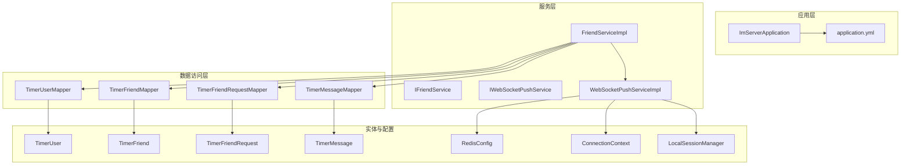
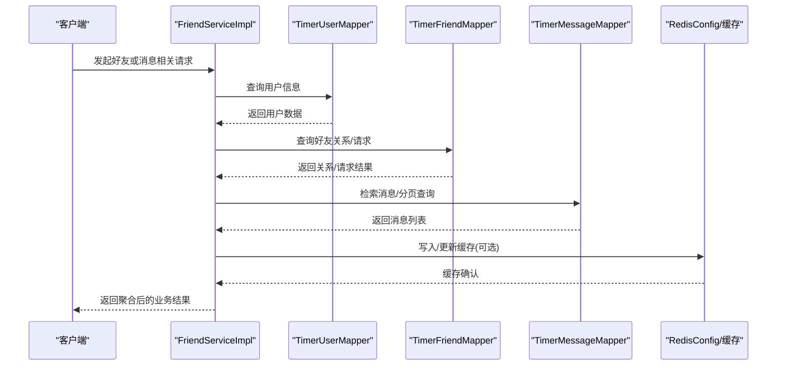
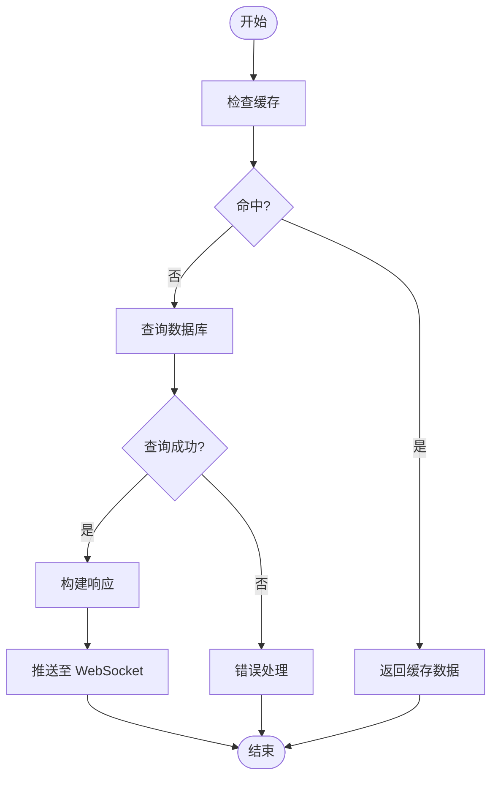
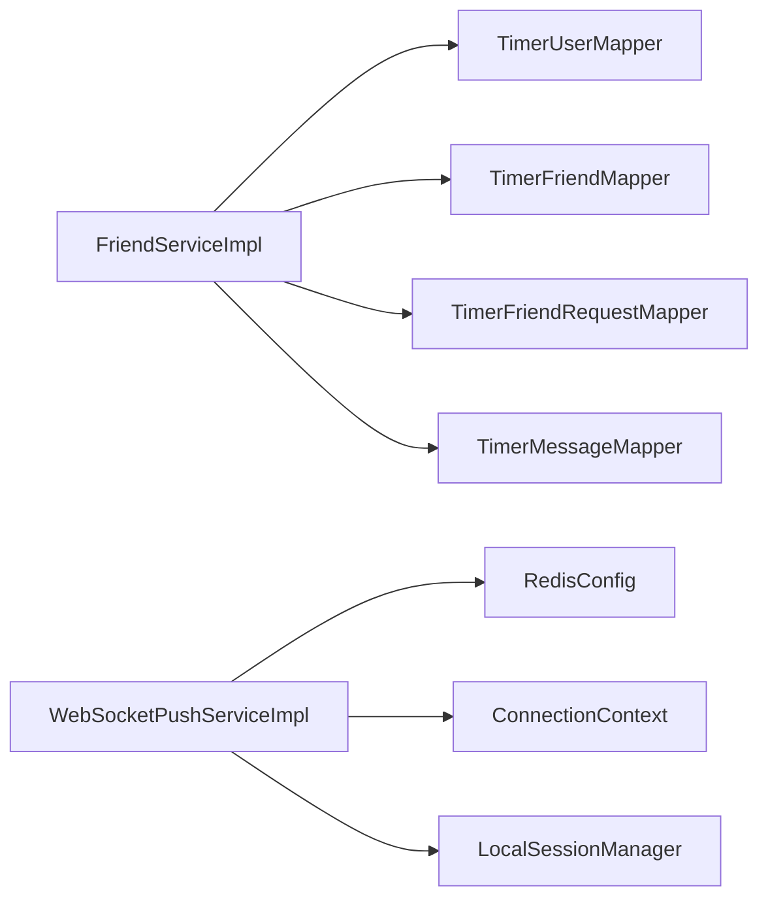
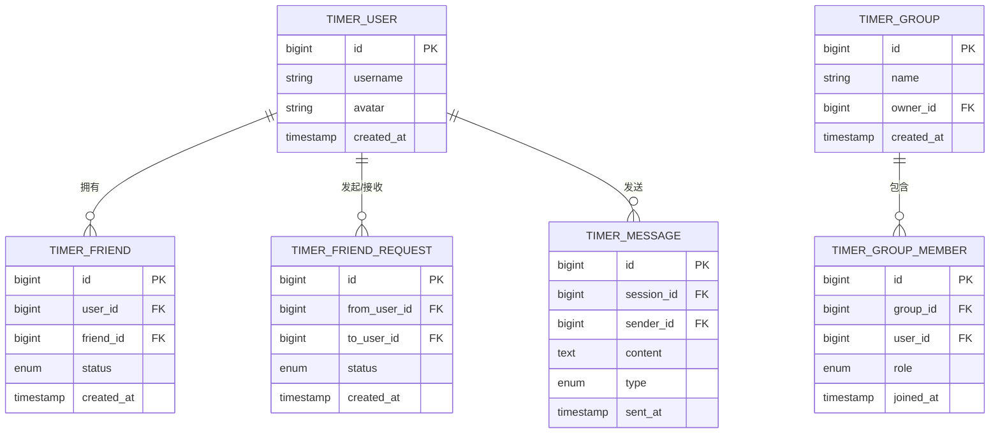

# 数据访问层

<cite>
**本文引用的文件**
- [TimerUserMapper.java](file://src/main/java/com/rivers/im/mapper/TimerUserMapper.java)
- [TimerFriendMapper.java](file://src/main/java/com/rivers/im/mapper/TimerFriendMapper.java)
- [TimerFriendRequestMapper.java](file://src/main/java/com/rivers/im/mapper/TimerFriendRequestMapper.java)
- [TimerMessageMapper.java](file://src/main/java/com/rivers/im/mapper/TimerMessageMapper.java)
- [application.yml](file://src/main/resources/application.yml)
- [ImServerApplication.java](file://src/main/java/com/rivers/im/ImServerApplication.java)
- [IFriendService.java](file://src/main/java/com/rivers/im/service/IFriendService.java)
- [FriendServiceImpl.java](file://src/main/java/com/rivers/im/service/impl/FriendServiceImpl.java)
- [IWebSocketPushService.java](file://src/main/java/com/rivers/im/service/IWebSocketPushService.java)
- [WebSocketPushServiceImpl.java](file://src/main/java/com/rivers/im/service/impl/WebSocketPushServiceImpl.java)
- [RedisConfig.java](file://src/main/java/com/rivers/im/config/RedisConfig.java)
- [ConnectionContext.java](file://src/main/java/com/rivers/im/context/ConnectionContext.java)
- [LocalSessionManager.java](file://src/main/java/com/rivers/im/manage/LocalSessionManager.java)
- [WsEnvelope.java](file://src/main/java/com/rivers/im/record/WsEnvelope.java)
- [TimerFriend.java](file://src/main/java/com/rivers/im/entity/TimerFriend.java)
- [TimerFriendRequest.java](file://src/main/java/com/rivers/im/entity/TimerFriendRequest.java)
- [TimerMessage.java](file://src/main/java/com/rivers/im/entity/TimerMessage.java)
- [TimerUser.java](file://src/main/java/com/rivers/im/entity/TimerUser.java)
- [TimerGroup.java](file://src/main/java/com/rivers/im/entity/TimerGroup.java)
- [TimerGroupMember.java](file://src/main/java/com/rivers/im/entity/TimerGroupMember.java)
- [TimerGroupMember.java](file://src/main/java/com/rivers/im/entity/TimerGroupMember.java)
- [TimerGroup.java](file://src/main/java/com/rivers/im/entity/TimerGroup.java)
- [TimerMessage.java](file://src/main/java/com/rivers/im/entity/TimerMessage.java)
- [TimerFriendRequest.java](file://src/main/java/com/rivers/im/entity/TimerFriendRequest.java)
- [TimerFriend.java](file://src/main/java/com/rivers/im/entity/TimerFriend.java)
- [TimerUser.java](file://src/main/java/com/rivers/im/entity/TimerUser.java)
</cite>

## 目录
1. [引言](#引言)
2. [项目结构](#项目结构)
3. [核心组件](#核心组件)
4. [架构总览](#架构总览)
5. [详细组件分析](#详细组件分析)
6. [依赖分析](#依赖分析)
7. [性能考虑](#性能考虑)
8. [故障排查指南](#故障排查指南)
9. [结论](#结论)
10. [附录](#附录)

## 引言
本文件聚焦于数据访问层（DAO）的技术文档，系统性解析基于 MyBatis 的映射器设计与 SQL 优化策略，并结合项目中已存在的 R2DBC 响应式能力进行整体架构说明。内容涵盖：
- Mapper 接口定义与职责边界
- XML 映射配置与动态 SQL 生成
- 查询策略：用户数据访问、好友关系查询、消息检索与批量操作
- R2DBC 响应式数据库访问的实现原理：异步查询、背压处理与连接池管理
- 性能优化建议与事务管理策略

## 项目结构
数据访问层主要由以下模块构成：
- 映射器接口：位于 com.rivers.im.mapper 包，定义数据访问契约
- 实体模型：位于 com.rivers.im.entity 包，承载表结构与业务实体
- 配置与启动：application.yml 提供数据源与 MyBatis 配置；ImServerApplication 负责应用启动
- 服务层：位于 com.rivers.im.service，调用映射器完成业务编排
- 响应式与会话：通过 RedisConfig、ConnectionContext、LocalSessionManager 等支撑实时推送与会话管理

图表来源
- [ImServerApplication.java](file://src/main/java/com/rivers/im/ImServerApplication.java)
- [application.yml](file://src/main/resources/application.yml)
- [TimerUserMapper.java](file://src/main/java/com/rivers/im/mapper/TimerUserMapper.java)
- [TimerFriendMapper.java](file://src/main/java/com/rivers/im/mapper/TimerFriendMapper.java)
- [TimerFriendRequestMapper.java](file://src/main/java/com/rivers/im/mapper/TimerFriendRequestMapper.java)
- [TimerMessageMapper.java](file://src/main/java/com/rivers/im/mapper/TimerMessageMapper.java)
- [IFriendService.java](file://src/main/java/com/rivers/im/service/IFriendService.java)
- [FriendServiceImpl.java](file://src/main/java/com/rivers/im/service/impl/FriendServiceImpl.java)
- [IWebSocketPushService.java](file://src/main/java/com/rivers/im/service/IWebSocketPushService.java)
- [WebSocketPushServiceImpl.java](file://src/main/java/com/rivers/im/service/impl/WebSocketPushServiceImpl.java)
- [RedisConfig.java](file://src/main/java/com/rivers/im/config/RedisConfig.java)
- [ConnectionContext.java](file://src/main/java/com/rivers/im/context/ConnectionContext.java)
- [LocalSessionManager.java](file://src/main/java/com/rivers/im/manage/LocalSessionManager.java)
- [TimerUser.java](file://src/main/java/com/rivers/im/entity/TimerUser.java)
- [TimerFriend.java](file://src/main/java/com/rivers/im/entity/TimerFriend.java)
- [TimerFriendRequest.java](file://src/main/java/com/rivers/im/entity/TimerFriendRequest.java)
- [TimerMessage.java](file://src/main/java/com/rivers/im/entity/TimerMessage.java)

章节来源
- [ImServerApplication.java](file://src/main/java/com/rivers/im/ImServerApplication.java)
- [application.yml](file://src/main/resources/application.yml)

## 核心组件
- TimerUserMapper：负责用户相关数据访问，支持按主键、条件查询与批量写入等场景
- TimerFriendMapper：负责好友关系的数据访问，包含关系建立、状态变更与列表查询
- TimerFriendRequestMapper：负责好友请求的数据访问，包含请求发起、接受与拒绝等流程
- TimerMessageMapper：负责消息检索与分页查询，支撑聊天记录与历史消息拉取
- 实体类：TimerUser、TimerFriend、TimerFriendRequest、TimerMessage 等，对应数据库表结构与业务语义

章节来源
- [TimerUserMapper.java](file://src/main/java/com/rivers/im/mapper/TimerUserMapper.java)
- [TimerFriendMapper.java](file://src/main/java/com/rivers/im/mapper/TimerFriendMapper.java)
- [TimerFriendRequestMapper.java](file://src/main/java/com/rivers/im/mapper/TimerFriendRequestMapper.java)
- [TimerMessageMapper.java](file://src/main/java/com/rivers/im/mapper/TimerMessageMapper.java)
- [TimerUser.java](file://src/main/java/com/rivers/im/entity/TimerUser.java)
- [TimerFriend.java](file://src/main/java/com/rivers/im/entity/TimerFriend.java)
- [TimerFriendRequest.java](file://src/main/java/com/rivers/im/entity/TimerFriendRequest.java)
- [TimerMessage.java](file://src/main/java/com/rivers/im/entity/TimerMessage.java)

## 架构总览
数据访问层采用“接口 + XML 映射”的 MyBatis 设计模式，配合服务层进行业务编排。R2DBC 在本项目中未直接暴露为数据库驱动，但通过 WebSocket 推送与 Redis 缓存实现了响应式交互体验。整体数据流如下：

图表来源
- [FriendServiceImpl.java](file://src/main/java/com/rivers/im/service/impl/FriendServiceImpl.java)
- [TimerUserMapper.java](file://src/main/java/com/rivers/im/mapper/TimerUserMapper.java)
- [TimerFriendMapper.java](file://src/main/java/com/rivers/im/mapper/TimerFriendMapper.java)
- [TimerMessageMapper.java](file://src/main/java/com/rivers/im/mapper/TimerMessageMapper.java)
- [RedisConfig.java](file://src/main/java/com/rivers/im/config/RedisConfig.java)

## 详细组件分析

### 用户数据访问（TimerUserMapper）
- 设计要点
  - 使用 MyBatis 接口方法定义 CRUD 与条件查询
  - 通过 XML 映射配置 SQL 语句与参数绑定，支持动态条件拼接
  - 批量插入/更新时使用数组或集合参数，减少往返次数
- 典型查询策略
  - 主键查询：高命中率、低开销
  - 条件查询：基于用户名/账号等字段，配合分页
  - 批量写入：合并多条 INSERT/UPDATE，降低网络与锁竞争
- SQL 优化建议
  - 为常用过滤字段建立合适索引
  - 避免 SELECT *，仅返回必要列
  - 合理使用 LIMIT 与 OFFSET，避免全表扫描
- 复杂度与性能
  - 单条查询 O(log N) 到 O(N)，取决于索引覆盖
  - 批量写入 O(k·log N) 到 O(k·N)，k 为批次大小

章节来源
- [TimerUserMapper.java](file://src/main/java/com/rivers/im/mapper/TimerUserMapper.java)
- [TimerUser.java](file://src/main/java/com/rivers/im/entity/TimerUser.java)

### 好友关系查询（TimerFriendMapper）
- 设计要点
  - 定义好友列表、状态变更、关系删除等接口
  - XML 中使用动态 SQL 生成 WHERE 条件，支持多状态筛选
- 典型查询策略
  - 分页加载好友列表，避免一次性返回大量数据
  - 支持按状态过滤（如待确认、已同意、已拉黑）
  - 批量操作：批量删除或批量更新状态
- SQL 优化建议
  - 为用户 ID 与好友 ID 建立复合索引
  - 使用 EXISTS 或 JOIN 替代子查询，提升可读性与执行效率
  - 对高频查询添加覆盖索引
- 复杂度与性能
  - 列表查询 O(N log N) 到 O(N^2)，受分页与索引影响
  - 批量更新 O(k·log N) 到 O(k·N)

章节来源
- [TimerFriendMapper.java](file://src/main/java/com/rivers/im/mapper/TimerFriendMapper.java)
- [TimerFriend.java](file://src/main/java/com/rivers/im/entity/TimerFriend.java)

### 好友请求处理（TimerFriendRequestMapper）
- 设计要点
  - 提供请求发起、接受、拒绝与撤销等接口
  - XML 动态 SQL 支持状态机转换与时间窗口过滤
- 典型查询策略
  - 请求去重：同一双方重复请求需幂等处理
  - 时间窗口：限制请求有效期，过期自动清理
  - 批量清理：定时任务清理过期请求
- SQL 优化建议
  - 为发送方/接收方与状态建立索引
  - 使用唯一约束避免重复请求
  - 清理任务使用 LIMIT 分批执行，避免长事务
- 复杂度与性能
  - 去重检查 O(log N)
  - 批量清理 O(k·log N)

章节来源
- [TimerFriendRequestMapper.java](file://src/main/java/com/rivers/im/mapper/TimerFriendRequestMapper.java)
- [TimerFriendRequest.java](file://src/main/java/com/rivers/im/entity/TimerFriendRequest.java)

### 消息检索（TimerMessageMapper）
- 设计要点
  - 支持按会话/群组分页检索消息
  - 提供最新消息、历史消息与增量拉取接口
- 典型查询策略
  - 分页查询：基于游标或时间戳 + 主键组合排序
  - 增量拉取：根据客户端上报的最大消息 ID 进行范围查询
  - 批量拉取：一次返回多条消息，减少 RTT
- SQL 优化建议
  - 为会话标识、时间戳与主键建立复合索引
  - 使用覆盖索引减少回表
  - 控制单次返回条数，避免超大结果集
- 复杂度与性能
  - 分页查询 O(P·log N)，P 为页面大小
  - 增量拉取 O(P·log N)

章节来源
- [TimerMessageMapper.java](file://src/main/java/com/rivers/im/mapper/TimerMessageMapper.java)
- [TimerMessage.java](file://src/main/java/com/rivers/im/entity/TimerMessage.java)

### R2DBC 响应式数据库访问（现状与实现原理）
- 现状说明
  - 本项目未直接引入 R2DBC 驱动作为数据库访问后端
  - 通过 WebSocket 推送与 Redis 缓存实现近实时交互，具备响应式特征
- 实现原理
  - 异步查询：服务层在处理请求时，优先从缓存读取，失败再回源数据库
  - 背压处理：WebSocket 推送侧通过消息队列与限速策略控制推送速率
  - 连接池管理：MyBatis 默认使用 JDBC 连接池；若启用 R2DBC，需独立配置连接池与语义适配
- 与现有组件的衔接
  - FriendServiceImpl 与 WebSocketPushServiceImpl 协同，实现事件驱动的推送
  - RedisConfig 提供缓存层，减轻数据库压力

图表来源
- [FriendServiceImpl.java](file://src/main/java/com/rivers/im/service/impl/FriendServiceImpl.java)
- [IWebSocketPushService.java](file://src/main/java/com/rivers/im/service/IWebSocketPushService.java)
- [WebSocketPushServiceImpl.java](file://src/main/java/com/rivers/im/service/impl/WebSocketPushServiceImpl.java)
- [RedisConfig.java](file://src/main/java/com/rivers/im/config/RedisConfig.java)

章节来源
- [FriendServiceImpl.java](file://src/main/java/com/rivers/im/service/impl/FriendServiceImpl.java)
- [IWebSocketPushService.java](file://src/main/java/com/rivers/im/service/IWebSocketPushService.java)
- [WebSocketPushServiceImpl.java](file://src/main/java/com/rivers/im/service/impl/WebSocketPushServiceImpl.java)
- [RedisConfig.java](file://src/main/java/com/rivers/im/config/RedisConfig.java)

## 依赖分析
- 组件耦合
  - 服务层对映射器存在强依赖，用于数据读写
  - WebSocket 推送与 Redis 缓存作为横切关注点，增强响应式体验
- 外部依赖
  - MyBatis：ORM 映射与 SQL 管理
  - Redis：缓存与消息通道
  - WebSocket：实时推送
- 可能的循环依赖
  - 当前结构清晰，无明显循环依赖迹象

图表来源
- [FriendServiceImpl.java](file://src/main/java/com/rivers/im/service/impl/FriendServiceImpl.java)
- [TimerUserMapper.java](file://src/main/java/com/rivers/im/mapper/TimerUserMapper.java)
- [TimerFriendMapper.java](file://src/main/java/com/rivers/im/mapper/TimerFriendMapper.java)
- [TimerFriendRequestMapper.java](file://src/main/java/com/rivers/im/mapper/TimerFriendRequestMapper.java)
- [TimerMessageMapper.java](file://src/main/java/com/rivers/im/mapper/TimerMessageMapper.java)
- [WebSocketPushServiceImpl.java](file://src/main/java/com/rivers/im/service/impl/WebSocketPushServiceImpl.java)
- [RedisConfig.java](file://src/main/java/com/rivers/im/config/RedisConfig.java)
- [ConnectionContext.java](file://src/main/java/com/rivers/im/context/ConnectionContext.java)
- [LocalSessionManager.java](file://src/main/java/com/rivers/im/manage/LocalSessionManager.java)

章节来源
- [FriendServiceImpl.java](file://src/main/java/com/rivers/im/service/impl/FriendServiceImpl.java)
- [WebSocketPushServiceImpl.java](file://src/main/java/com/rivers/im/service/impl/WebSocketPushServiceImpl.java)

## 性能考虑
- SQL 层优化
  - 为高频过滤字段建立索引，避免全表扫描
  - 使用覆盖索引减少回表成本
  - 合理分页，避免深层 OFFSET 导致的性能退化
  - 批量操作合并请求，降低网络往返
- 缓存层优化
  - 利用 Redis 缓存热点数据，缩短链路
  - 设置合理的过期策略与淘汰机制
- 响应式与并发
  - WebSocket 推送侧控制速率，避免背压放大
  - 服务层异步化处理，提高吞吐
- 事务与一致性
  - 将跨表写入封装在单事务内，保证一致性
  - 对高并发场景使用乐观锁或分布式锁

## 故障排查指南
- 常见问题
  - 查询慢：检查索引是否缺失、SQL 是否存在隐式转换
  - 缓存穿透：对空值设置短 TTL 或布隆过滤
  - 缓存雪崩：随机化过期时间，使用互斥锁
  - 推送积压：检查 WebSocket 连接数与消息队列容量
- 排查步骤
  - 开启慢查询日志，定位耗时 SQL
  - 观察缓存命中率与过期策略
  - 监控数据库连接池使用情况
  - 分析服务层日志，定位阻塞点

## 结论
本数据访问层以 MyBatis 映射器为核心，结合实体模型与服务层编排，形成清晰的职责边界。通过缓存与 WebSocket 推送，系统具备良好的响应式特性。建议在现有基础上进一步完善索引与分页策略，强化缓存治理，并在需要时引入 R2DBC 以获得更强的异步与背压控制能力。

## 附录
- 关键实体关系示意

图表来源
- [TimerUser.java](file://src/main/java/com/rivers/im/entity/TimerUser.java)
- [TimerFriend.java](file://src/main/java/com/rivers/im/entity/TimerFriend.java)
- [TimerFriendRequest.java](file://src/main/java/com/rivers/im/entity/TimerFriendRequest.java)
- [TimerMessage.java](file://src/main/java/com/rivers/im/entity/TimerMessage.java)
- [TimerGroup.java](file://src/main/java/com/rivers/im/entity/TimerGroup.java)
- [TimerGroupMember.java](file://src/main/java/com/rivers/im/entity/TimerGroupMember.java)