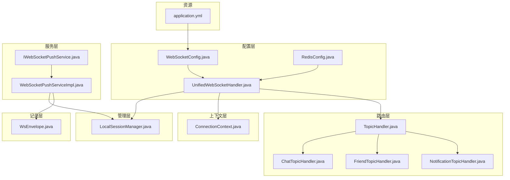
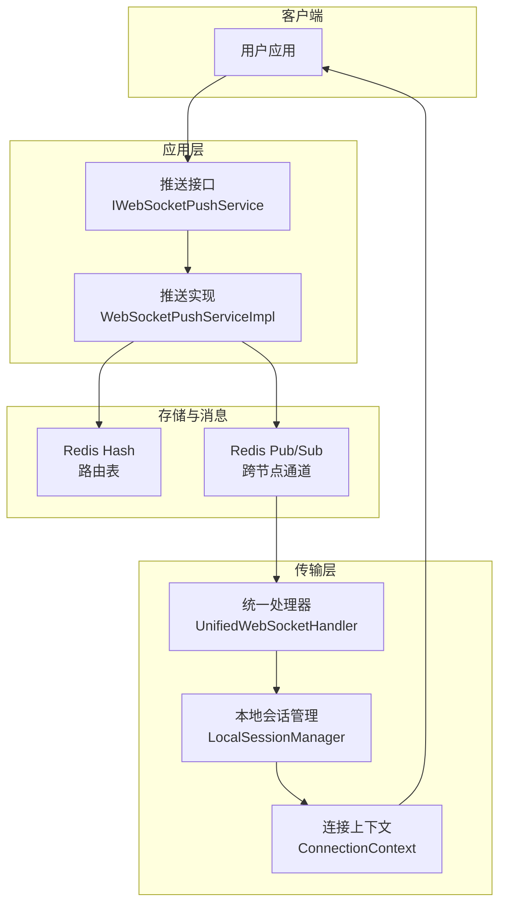
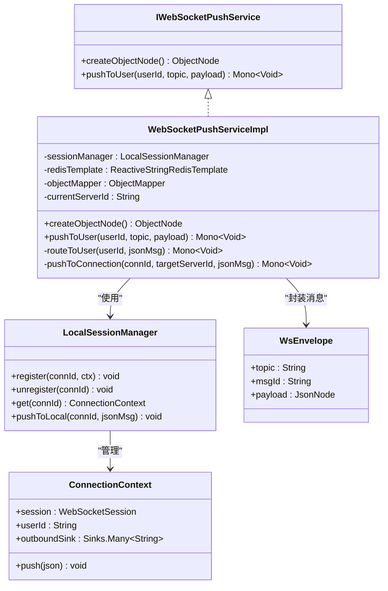
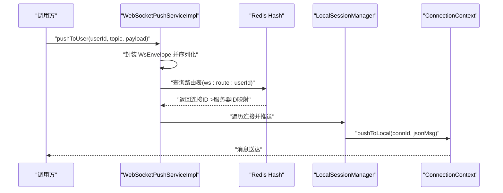
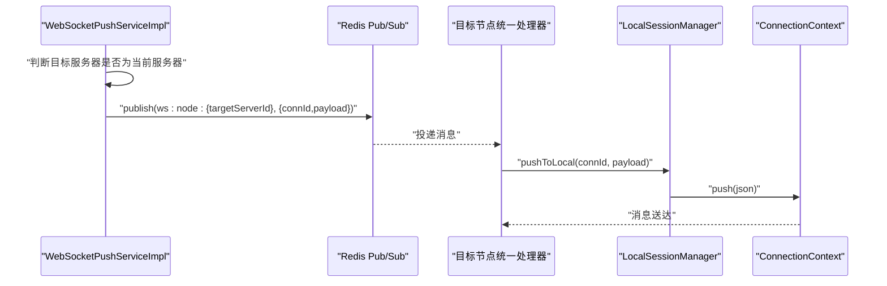
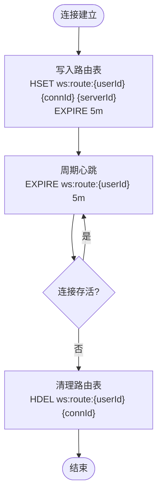
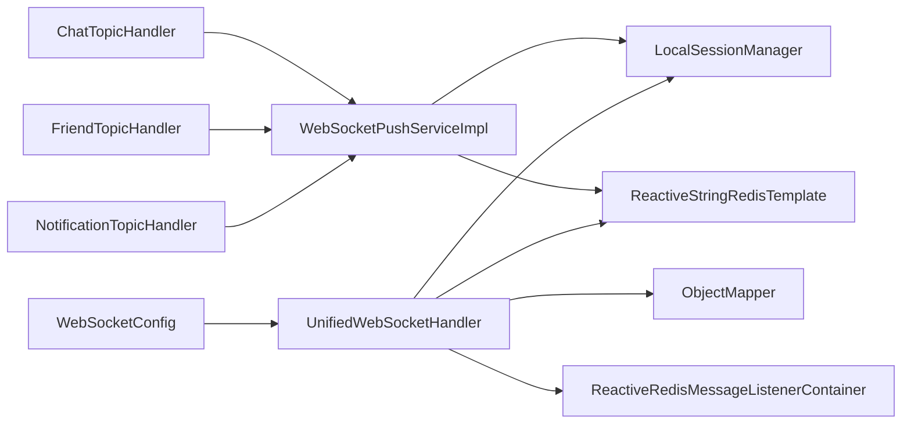

# 推送服务实现

<cite>
**本文档引用的文件**
- [WebSocketPushServiceImpl.java](file://src/main/java/com/rivers/im/service/impl/WebSocketPushServiceImpl.java)
- [IWebSocketPushService.java](file://src/main/java/com/rivers/im/service/IWebSocketPushService.java)
- [LocalSessionManager.java](file://src/main/java/com/rivers/im/manage/LocalSessionManager.java)
- [ConnectionContext.java](file://src/main/java/com/rivers/im/context/ConnectionContext.java)
- [UnifiedWebSocketHandler.java](file://src/main/java/com/rivers/im/config/UnifiedWebSocketHandler.java)
- [WebSocketConfig.java](file://src/main/java/com/rivers/im/config/WebSocketConfig.java)
- [RedisConfig.java](file://src/main/java/com/rivers/im/config/RedisConfig.java)
- [WsEnvelope.java](file://src/main/java/com/rivers/im/record/WsEnvelope.java)
- [TopicHandler.java](file://src/main/java/com/rivers/im/router/TopicHandler.java)
- [ChatTopicHandler.java](file://src/main/java/com/rivers/im/router/ChatTopicHandler.java)
- [FriendTopicHandler.java](file://src/main/java/com/rivers/im/router/FriendTopicHandler.java)
- [NotificationTopicHandler.java](file://src/main/java/com/rivers/im/router/NotificationTopicHandler.java)
- [application.yml](file://src/main/resources/application.yml)
</cite>

## 目录
1. [简介](#简介)
2. [项目结构](#项目结构)
3. [核心组件](#核心组件)
4. [架构概览](#架构概览)
5. [详细组件分析](#详细组件分析)
6. [依赖关系分析](#依赖关系分析)
7. [性能考虑](#性能考虑)
8. [故障排查指南](#故障排查指南)
9. [结论](#结论)

## 简介
本文件面向推送服务实现的技术文档，重点围绕 WebSocketPushServiceImpl 的具体实现进行深入分析，涵盖本地推送逻辑、跨节点消息转发机制以及 Redis Pub/Sub 集成策略。同时，文档解释了用户连接状态检查、消息路由算法与异常处理机制，并提出性能优化策略（连接池管理、消息批处理、内存优化）。最后提供监控指标、日志记录与故障排查指南，帮助开发者快速定位问题并优化系统表现。

## 项目结构
该项目采用分层与功能模块结合的组织方式：
- config 层：负责 WebSocket 配置、统一处理器、Redis 监听容器等基础设施
- context 层：持有 WebSocket 会话上下文与输出通道
- manage 层：维护本地会话映射与推送入口
- record 层：定义消息载体封装结构
- router 层：按主题分发消息到对应处理器
- service 层：提供推送接口与具体实现
- controller 层：对外暴露业务接口（如票据验证）
- mapper/entity 层：持久化定时任务与消息数据

**图表来源**
- [WebSocketConfig.java:1-35](file://src/main/java/com/rivers/im/config/WebSocketConfig.java#L1-L35)
- [UnifiedWebSocketHandler.java:1-181](file://src/main/java/com/rivers/im/config/UnifiedWebSocketHandler.java#L1-L181)
- [RedisConfig.java:1-18](file://src/main/java/com/rivers/im/config/RedisConfig.java#L1-L18)
- [ConnectionContext.java:1-24](file://src/main/java/com/rivers/im/context/ConnectionContext.java#L1-L24)
- [LocalSessionManager.java:1-43](file://src/main/java/com/rivers/im/manage/LocalSessionManager.java#L1-L43)
- [WsEnvelope.java:1-10](file://src/main/java/com/rivers/im/record/WsEnvelope.java#L1-L10)
- [TopicHandler.java:1-14](file://src/main/java/com/rivers/im/router/TopicHandler.java#L1-L14)
- [ChatTopicHandler.java:1-51](file://src/main/java/com/rivers/im/router/ChatTopicHandler.java#L1-L51)
- [FriendTopicHandler.java:1-261](file://src/main/java/com/rivers/im/router/FriendTopicHandler.java#L1-L261)
- [NotificationTopicHandler.java:1-27](file://src/main/java/com/rivers/im/router/NotificationTopicHandler.java#L1-L27)
- [IWebSocketPushService.java:1-12](file://src/main/java/com/rivers/im/service/IWebSocketPushService.java#L1-L12)
- [WebSocketPushServiceImpl.java:1-90](file://src/main/java/com/rivers/im/service/impl/WebSocketPushServiceImpl.java#L1-L90)
- [application.yml:1-14](file://src/main/resources/application.yml#L1-L14)

**章节来源**
- [WebSocketConfig.java:1-35](file://src/main/java/com/rivers/im/config/WebSocketConfig.java#L1-L35)
- [application.yml:1-14](file://src/main/resources/application.yml#L1-L14)

## 核心组件
本节聚焦于推送服务的关键组件及其职责：
- IWebSocketPushService：推送服务接口，定义对象节点创建与用户推送方法
- WebSocketPushServiceImpl：推送服务实现，负责消息封装、路由查询、本地/跨节点推送
- LocalSessionManager：本地会话管理器，维护 connId 到连接上下文的映射，支持线程安全推送
- ConnectionContext：连接上下文，封装 WebSocketSession、用户标识与背压输出通道
- UnifiedWebSocketHandler：统一 WebSocket 处理器，负责握手、路由注册、心跳续期、跨节点消息订阅与清理
- TopicHandler 及其实现：按主题分发消息，如聊天、好友、通知等

**章节来源**
- [IWebSocketPushService.java:1-12](file://src/main/java/com/rivers/im/service/IWebSocketPushService.java#L1-L12)
- [WebSocketPushServiceImpl.java:1-90](file://src/main/java/com/rivers/im/service/impl/WebSocketPushServiceImpl.java#L1-L90)
- [LocalSessionManager.java:1-43](file://src/main/java/com/rivers/im/manage/LocalSessionManager.java#L1-L43)
- [ConnectionContext.java:1-24](file://src/main/java/com/rivers/im/context/ConnectionContext.java#L1-L24)
- [UnifiedWebSocketHandler.java:1-181](file://src/main/java/com/rivers/im/config/UnifiedWebSocketHandler.java#L1-L181)
- [TopicHandler.java:1-14](file://src/main/java/com/rivers/im/router/TopicHandler.java#L1-L14)

## 架构概览
推送服务整体架构基于响应式编程与 Redis Pub/Sub 实现，形成“本地直连 + 跨节点转发”的双通道推送体系。用户侧通过 WebSocket 连接接入，服务端在统一处理器中完成鉴权、路由注册与心跳续期；应用层通过推送服务封装消息并查询路由，本地连接直接推送，跨节点通过 Redis Pub/Sub 转发至目标节点的统一处理器。

**图表来源**
- [WebSocketPushServiceImpl.java:1-90](file://src/main/java/com/rivers/im/service/impl/WebSocketPushServiceImpl.java#L1-L90)
- [UnifiedWebSocketHandler.java:1-181](file://src/main/java/com/rivers/im/config/UnifiedWebSocketHandler.java#L1-L181)
- [LocalSessionManager.java:1-43](file://src/main/java/com/rivers/im/manage/LocalSessionManager.java#L1-L43)
- [ConnectionContext.java:1-24](file://src/main/java/com/rivers/im/context/ConnectionContext.java#L1-L24)

## 详细组件分析

### 推送服务接口与实现
WebSocketPushServiceImpl 实现 IWebSocketPushService，提供以下能力：
- 对象节点创建：通过 ObjectMapper 创建 JSON 节点，便于构建消息负载
- 用户推送：将消息封装为 WsEnvelope，序列化后根据路由表选择本地或跨节点推送

**图表来源**
- [IWebSocketPushService.java:1-12](file://src/main/java/com/rivers/im/service/IWebSocketPushService.java#L1-L12)
- [WebSocketPushServiceImpl.java:1-90](file://src/main/java/com/rivers/im/service/impl/WebSocketPushServiceImpl.java#L1-L90)
- [LocalSessionManager.java:1-43](file://src/main/java/com/rivers/im/manage/LocalSessionManager.java#L1-L43)
- [ConnectionContext.java:1-24](file://src/main/java/com/rivers/im/context/ConnectionContext.java#L1-L24)
- [WsEnvelope.java:1-10](file://src/main/java/com/rivers/im/record/WsEnvelope.java#L1-L10)

**章节来源**
- [IWebSocketPushService.java:1-12](file://src/main/java/com/rivers/im/service/IWebSocketPushService.java#L1-L12)
- [WebSocketPushServiceImpl.java:1-90](file://src/main/java/com/rivers/im/service/impl/WebSocketPushServiceImpl.java#L1-L90)

### 本地推送逻辑
本地推送流程如下：
- 从路由表中查询用户的所有连接 ID 及其所在服务器标识
- 若连接存在于当前服务器，则通过 LocalSessionManager 将消息推送到对应连接
- 使用 ConnectionContext 的背压输出通道确保线程安全与流量控制

**图表来源**
- [WebSocketPushServiceImpl.java:44-88](file://src/main/java/com/rivers/im/service/impl/WebSocketPushServiceImpl.java#L44-L88)
- [LocalSessionManager.java:35-42](file://src/main/java/com/rivers/im/manage/LocalSessionManager.java#L35-L42)
- [ConnectionContext.java:21-23](file://src/main/java/com/rivers/im/context/ConnectionContext.java#L21-L23)

**章节来源**
- [WebSocketPushServiceImpl.java:44-88](file://src/main/java/com/rivers/im/service/impl/WebSocketPushServiceImpl.java#L44-L88)
- [LocalSessionManager.java:35-42](file://src/main/java/com/rivers/im/manage/LocalSessionManager.java#L35-L42)
- [ConnectionContext.java:21-23](file://src/main/java/com/rivers/im/context/ConnectionContext.java#L21-L23)

### 跨节点消息转发机制
跨节点转发通过 Redis Pub/Sub 实现：
- 当目标服务器标识不等于当前服务器时，构造跨节点消息（包含连接 ID 与消息体）
- 将消息发布到目标服务器专属频道（ws:node:{serverId}）
- 目标节点的统一处理器订阅该频道，解析消息并调用本地推送

**图表来源**
- [WebSocketPushServiceImpl.java:76-88](file://src/main/java/com/rivers/im/service/impl/WebSocketPushServiceImpl.java#L76-L88)
- [UnifiedWebSocketHandler.java:140-149](file://src/main/java/com/rivers/im/config/UnifiedWebSocketHandler.java#L140-L149)

**章节来源**
- [WebSocketPushServiceImpl.java:76-88](file://src/main/java/com/rivers/im/service/impl/WebSocketPushServiceImpl.java#L76-L88)
- [UnifiedWebSocketHandler.java:140-149](file://src/main/java/com/rivers/im/config/UnifiedWebSocketHandler.java#L140-L149)

### Redis Pub/Sub 集成策略
- 路由注册：连接建立时，将 connId -> 当前服务器 ID 写入哈希键 ws:route:{userId}，并设置过期时间以自动清理
- 心跳续期：周期性延长路由键 TTL，维持活跃连接的可达性
- 跨节点订阅：统一处理器启动时订阅 ws:node:{currentServerId} 频道，处理来自其他节点的消息
- 清理机制：连接断开时移除路由表中的对应项，避免僵尸连接

**图表来源**
- [UnifiedWebSocketHandler.java:97-118](file://src/main/java/com/rivers/im/config/UnifiedWebSocketHandler.java#L97-L118)
- [UnifiedWebSocketHandler.java:151-162](file://src/main/java/com/rivers/im/config/UnifiedWebSocketHandler.java#L151-L162)

**章节来源**
- [UnifiedWebSocketHandler.java:97-118](file://src/main/java/com/rivers/im/config/UnifiedWebSocketHandler.java#L97-L118)
- [UnifiedWebSocketHandler.java:151-162](file://src/main/java/com/rivers/im/config/UnifiedWebSocketHandler.java#L151-L162)

### 用户连接状态检查
- 连接存在性：推送前先查询路由表，若为空则判定用户离线，直接返回空结果
- 连接有效性：本地推送时检查会话是否打开，否则记录调试日志并忽略
- 异常处理：跨节点推送失败时记录警告并继续执行，保证主流程不受影响

**章节来源**
- [WebSocketPushServiceImpl.java:63-66](file://src/main/java/com/rivers/im/service/impl/WebSocketPushServiceImpl.java#L63-L66)
- [LocalSessionManager.java:37-41](file://src/main/java/com/rivers/im/manage/LocalSessionManager.java#L37-L41)
- [WebSocketPushServiceImpl.java:85-87](file://src/main/java/com/rivers/im/service/impl/WebSocketPushServiceImpl.java#L85-L87)

### 消息路由算法
- 路由键：ws:route:{userId}
- 查询策略：读取哈希中所有连接 ID 及其服务器标识
- 分发策略：本地连接直接推送；跨节点按服务器标识分组后批量发布
- 并发控制：使用 Mono.when 并行触发多个推送任务，提升吞吐

**章节来源**
- [WebSocketPushServiceImpl.java:56-74](file://src/main/java/com/rivers/im/service/impl/WebSocketPushServiceImpl.java#L56-L74)

### 异常处理机制
- Redis 操作异常：路由注册、心跳续期、清理均进行错误捕获与告警，不影响主流程
- 解析异常：消息反序列化失败或未知 Topic 时记录警告并丢弃
- 跨节点推送异常：记录警告并继续执行，避免阻塞主流程
- 握手鉴权异常：拒绝无效或过期票据，避免非法连接进入系统

**章节来源**
- [UnifiedWebSocketHandler.java:101](file://src/main/java/com/rivers/im/config/UnifiedWebSocketHandler.java#L101)
- [UnifiedWebSocketHandler.java:115](file://src/main/java/com/rivers/im/config/UnifiedWebSocketHandler.java#L115)
- [UnifiedWebSocketHandler.java:129-137](file://src/main/java/com/rivers/im/config/UnifiedWebSocketHandler.java#L129-L137)
- [WebSocketPushServiceImpl.java:85-87](file://src/main/java/com/rivers/im/service/impl/WebSocketPushServiceImpl.java#L85-L87)
- [AuthHandshakeWebSocketService.java:33-54](file://src/main/java/com/rivers/im/service/impl/AuthHandshakeWebSocketService.java#L33-L54)

## 依赖关系分析
推送服务与系统其他模块的耦合关系如下：
- WebSocketPushServiceImpl 依赖 LocalSessionManager 与 Redis 模板
- UnifiedWebSocketHandler 依赖 Redis 监听容器、会话管理器与 ObjectMapper
- TopicHandler 家族负责业务主题分发，最终调用推送服务实现
- WebSocketConfig 提供统一处理器与自定义握手服务的装配

**图表来源**
- [WebSocketPushServiceImpl.java:1-90](file://src/main/java/com/rivers/im/service/impl/WebSocketPushServiceImpl.java#L1-L90)
- [LocalSessionManager.java:1-43](file://src/main/java/com/rivers/im/manage/LocalSessionManager.java#L1-L43)
- [UnifiedWebSocketHandler.java:1-181](file://src/main/java/com/rivers/im/config/UnifiedWebSocketHandler.java#L1-L181)
- [ChatTopicHandler.java:1-51](file://src/main/java/com/rivers/im/router/ChatTopicHandler.java#L1-L51)
- [FriendTopicHandler.java:1-261](file://src/main/java/com/rivers/im/router/FriendTopicHandler.java#L1-L261)
- [NotificationTopicHandler.java:1-27](file://src/main/java/com/rivers/im/router/NotificationTopicHandler.java#L1-L27)
- [WebSocketConfig.java:1-35](file://src/main/java/com/rivers/im/config/WebSocketConfig.java#L1-L35)

**章节来源**
- [WebSocketPushServiceImpl.java:1-90](file://src/main/java/com/rivers/im/service/impl/WebSocketPushServiceImpl.java#L1-L90)
- [UnifiedWebSocketHandler.java:1-181](file://src/main/java/com/rivers/im/config/UnifiedWebSocketHandler.java#L1-L181)
- [ChatTopicHandler.java:1-51](file://src/main/java/com/rivers/im/router/ChatTopicHandler.java#L1-L51)
- [FriendTopicHandler.java:1-261](file://src/main/java/com/rivers/im/router/FriendTopicHandler.java#L1-L261)
- [NotificationTopicHandler.java:1-27](file://src/main/java/com/rivers/im/router/NotificationTopicHandler.java#L1-L27)
- [WebSocketConfig.java:1-35](file://src/main/java/com/rivers/im/config/WebSocketConfig.java#L1-L35)

## 性能考虑
- 连接池管理
  - 使用响应式 Redis 客户端与 Reactor Netty 底层连接复用，减少连接创建开销
  - WebSocket 输出通道采用背压缓冲，避免高并发下内存暴涨
- 消息批处理
  - 路由查询后对多连接并行推送，使用 Mono.when 合并多个异步任务
  - 跨节点消息批量发布，降低网络往返次数
- 内存优化
  - 使用对象池化的 ObjectMapper 与紧凑的 WsEnvelope 结构
  - 路由表键值短小精悍，配合 TTL 自动回收
- 资源释放
  - 连接断开时及时清理路由表，防止内存泄漏
  - 订阅者在销毁阶段主动释放，避免资源泄露

[本节为通用性能指导，不直接分析具体文件]

## 故障排查指南
- 连接无法建立
  - 检查握手服务是否正确消费票据并注入 userId
  - 查看统一处理器是否成功提取 userId 并注册路由
- 消息未送达
  - 确认路由表中是否存在目标用户的连接
  - 检查本地会话是否仍处于打开状态
  - 观察跨节点频道订阅是否正常，目标节点是否在线
- Redis 相关异常
  - 路由注册失败：检查 Redis 连通性与权限
  - 心跳续期失败：确认键名格式与过期策略
  - Pub/Sub 订阅异常：查看监听容器初始化日志
- 日志定位
  - 关注推送服务与统一处理器中的调试与告警日志
  - 使用唯一消息 ID（msgId）串联一次推送的全链路轨迹

**章节来源**
- [AuthHandshakeWebSocketService.java:33-54](file://src/main/java/com/rivers/im/service/impl/AuthHandshakeWebSocketService.java#L33-L54)
- [UnifiedWebSocketHandler.java:90-96](file://src/main/java/com/rivers/im/config/UnifiedWebSocketHandler.java#L90-L96)
- [WebSocketPushServiceImpl.java:63-66](file://src/main/java/com/rivers/im/service/impl/WebSocketPushServiceImpl.java#L63-L66)
- [LocalSessionManager.java:37-41](file://src/main/java/com/rivers/im/manage/LocalSessionManager.java#L37-L41)
- [UnifiedWebSocketHandler.java:115](file://src/main/java/com/rivers/im/config/UnifiedWebSocketHandler.java#L115)
- [UnifiedWebSocketHandler.java:74](file://src/main/java/com/rivers/im/config/UnifiedWebSocketHandler.java#L74)

## 结论
本推送服务通过“本地直连 + 跨节点转发”的双通道设计，结合 Redis Hash 路由表与 Pub/Sub 机制，实现了高可用、低延迟的实时消息分发。WebSocketPushServiceImpl 在消息封装、路由查询与并行推送方面具备清晰的职责边界；UnifiedWebSocketHandler 则承担了连接生命周期管理、心跳与清理等关键职责。整体架构在异常处理、资源释放与性能优化方面均有良好实践，适合在分布式场景下扩展与演进。