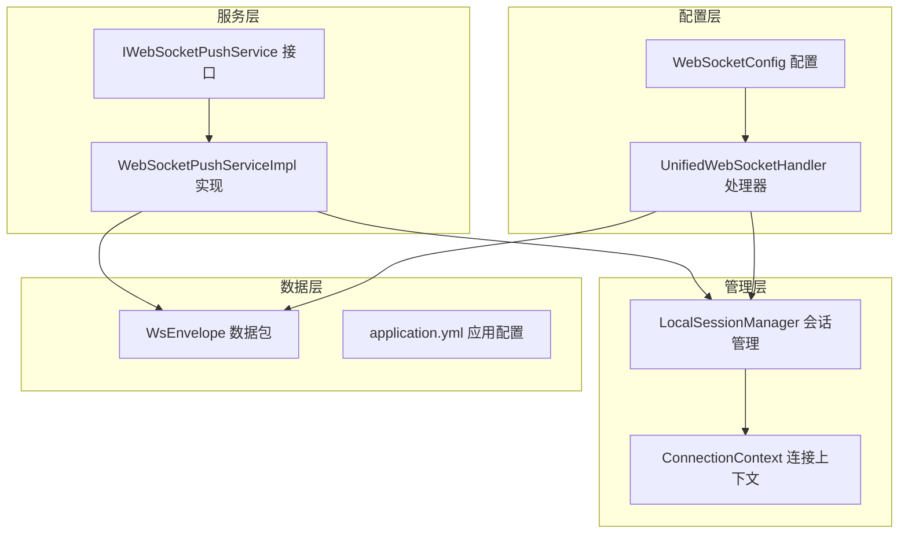
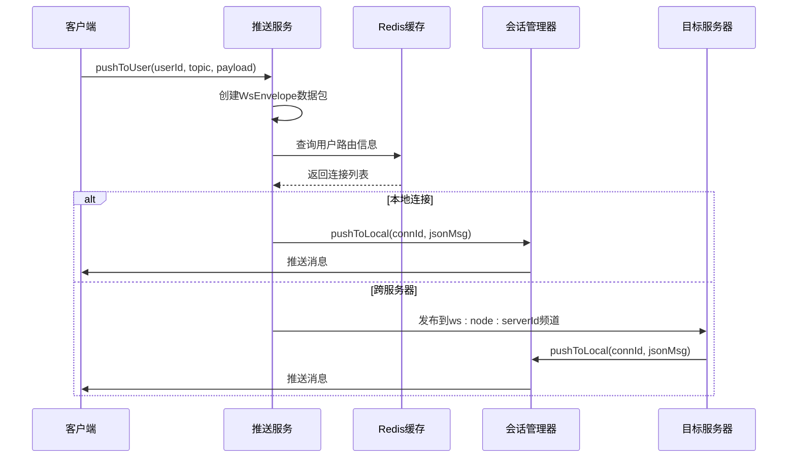
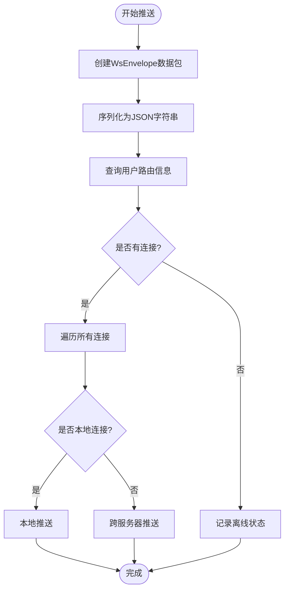
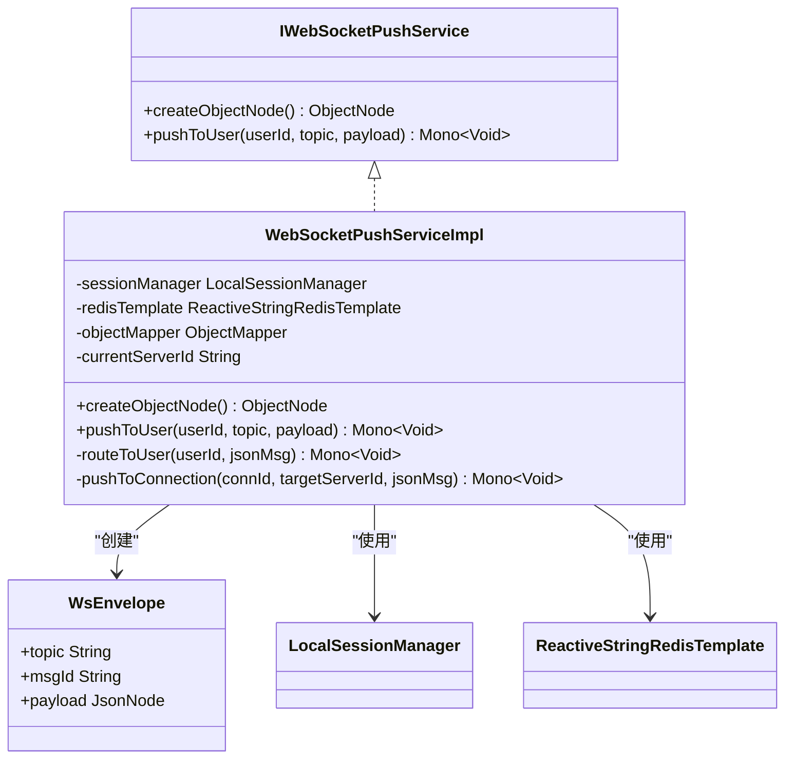
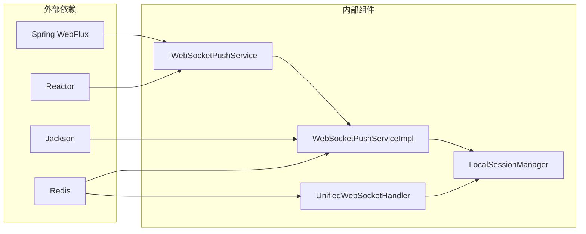

# 推送服务接口设计

<cite>
**本文档引用的文件**
- [IWebSocketPushService.java](file://src/main/java/com/rivers/im/service/IWebSocketPushService.java)
- [WebSocketPushServiceImpl.java](file://src/main/java/com/rivers/im/service/impl/WebSocketPushServiceImpl.java)
- [WsEnvelope.java](file://src/main/java/com/rivers/im/record/WsEnvelope.java)
- [UnifiedWebSocketHandler.java](file://src/main/java/com/rivers/im/config/UnifiedWebSocketHandler.java)
- [WebSocketConfig.java](file://src/main/java/com/rivers/im/config/WebSocketConfig.java)
- [LocalSessionManager.java](file://src/main/java/com/rivers/im/manage/LocalSessionManager.java)
- [ConnectionContext.java](file://src/main/java/com/rivers/im/context/ConnectionContext.java)
- [application.yml](file://src/main/resources/application.yml)
</cite>

## 目录
1. [简介](#简介)
2. [项目结构](#项目结构)
3. [核心组件](#核心组件)
4. [架构概览](#架构概览)
5. [详细组件分析](#详细组件分析)
6. [依赖关系分析](#依赖关系分析)
7. [性能考虑](#性能考虑)
8. [故障排除指南](#故障排除指南)
9. [结论](#结论)

## 简介

本项目实现了一个基于Spring WebFlux和Reactor的响应式WebSocket推送服务系统。该系统采用接口抽象设计，通过IWebSocketPushService接口定义推送服务的核心能力，并提供了完整的实现类WebSocketPushServiceImpl。系统支持多服务器部署场景下的跨节点消息传递，利用Redis作为消息中间件实现服务间通信。

## 项目结构

该项目采用分层架构设计，主要包含以下核心模块：

**图表来源**
- [IWebSocketPushService.java:1-12](file://src/main/java/com/rivers/im/service/IWebSocketPushService.java#L1-L12)
- [WebSocketPushServiceImpl.java:1-90](file://src/main/java/com/rivers/im/service/impl/WebSocketPushServiceImpl.java#L1-L90)
- [WebSocketConfig.java:1-35](file://src/main/java/com/rivers/im/config/WebSocketConfig.java#L1-L35)

**章节来源**
- [IWebSocketPushService.java:1-12](file://src/main/java/com/rivers/im/service/IWebSocketPushService.java#L1-L12)
- [WebSocketPushServiceImpl.java:1-90](file://src/main/java/com/rivers/im/service/impl/WebSocketPushServiceImpl.java#L1-L90)
- [WebSocketConfig.java:1-35](file://src/main/java/com/rivers/im/config/WebSocketConfig.java#L1-L35)

## 核心组件

### IWebSocketPushService 接口设计

IWebSocketPushService是整个推送服务的核心接口，定义了两个关键方法：

1. **createObjectNode()** - 提供Jackson ObjectMapper的便捷访问
2. **pushToUser(userId, topic, payload)** - 核心推送方法，返回Mono<Void>实现异步处理

接口采用响应式编程模式，所有操作都是非阻塞的，符合Spring WebFlux的设计理念。

**章节来源**
- [IWebSocketPushService.java:6-11](file://src/main/java/com/rivers/im/service/IWebSocketPushService.java#L6-L11)

### WebSocketPushServiceImpl 实现

WebSocketPushServiceImpl实现了IWebSocketPushService接口，提供了完整的推送功能：

- **依赖注入**：LocalSessionManager、ReactiveStringRedisTemplate、ObjectMapper
- **服务器标识**：通过配置获取当前服务器唯一标识
- **响应式处理**：使用Reactor的Mono和Flux实现异步操作

**章节来源**
- [WebSocketPushServiceImpl.java:20-37](file://src/main/java/com/rivers/im/service/impl/WebSocketPushServiceImpl.java#L20-L37)

## 架构概览

系统采用分布式架构，支持多服务器部署：

**图表来源**
- [WebSocketPushServiceImpl.java:44-88](file://src/main/java/com/rivers/im/service/impl/WebSocketPushServiceImpl.java#L44-L88)
- [UnifiedWebSocketHandler.java:140-149](file://src/main/java/com/rivers/im/config/UnifiedWebSocketHandler.java#L140-L149)

## 详细组件分析

### 推送服务接口设计

#### 响应式编程模式应用

接口设计充分体现了响应式编程的核心原则：

- **非阻塞IO**：所有操作返回Mono类型，避免阻塞线程
- **背压处理**：使用Reactor的背压策略处理高并发场景
- **链式操作**：支持函数式编程风格的链式调用

#### Mono<Void>返回类型的异步处理策略

pushToUser方法返回Mono<Void>表示：
- **异步执行**：操作在后台线程池中执行
- **无返回值**：成功或失败都不需要返回具体数据
- **错误传播**：异常会通过Reactor的错误流传播

**图表来源**
- [WebSocketPushServiceImpl.java:44-74](file://src/main/java/com/rivers/im/service/impl/WebSocketPushServiceImpl.java#L44-L74)

**章节来源**
- [IWebSocketPushService.java:10](file://src/main/java/com/rivers/im/service/IWebSocketPushService.java#L10)
- [WebSocketPushServiceImpl.java:44-54](file://src/main/java/com/rivers/im/service/impl/WebSocketPushServiceImpl.java#L44-L54)

### createObjectNode()方法详解

#### 方法作用

createObjectNode()方法提供了一个便捷的ObjectNode创建入口：
- **统一创建**：确保所有ObjectNode都通过相同的ObjectMapper创建
- **类型安全**：返回ObjectNode类型，便于后续的JSON构建操作
- **一致性**：保证与WebSocketPushServiceImpl中使用的ObjectMapper保持一致

#### Jackson ObjectMapper集成方式

实现类通过构造函数注入ObjectMapper：
- **依赖注入**：Spring容器自动注入ObjectMapper实例
- **单例模式**：ObjectMapper通常以单例形式存在，减少内存开销
- **线程安全**：Jackson的ObjectMapper是线程安全的，可以在多线程环境中共享

**章节来源**
- [IWebSocketPushService.java:8](file://src/main/java/com/rivers/im/service/IWebSocketPushService.java#L8)
- [WebSocketPushServiceImpl.java:40-42](file://src/main/java/com/rivers/im/service/impl/WebSocketPushServiceImpl.java#L40-L42)

### pushToUser()方法参数设计

#### 参数详解

1. **userId (String)**：用户唯一标识符
   - **类型**：String类型
   - **用途**：用于查找用户的活跃连接
   - **格式**：业务系统中的用户ID

2. **topic (String)**：消息主题标识
   - **类型**：String类型
   - **用途**：标识消息的业务类型
   - **示例**："chat"、"notification"等

3. **payload (Object)**：消息负载数据
   - **类型**：Object类型，可接受任意对象
   - **用途**：实际要传输的数据内容
   - **序列化**：通过ObjectMapper转换为JsonNode

#### 处理机制

**图表来源**
- [IWebSocketPushService.java:6-11](file://src/main/java/com/rivers/im/service/IWebSocketPushService.java#L6-L11)
- [WebSocketPushServiceImpl.java:20-37](file://src/main/java/com/rivers/im/service/impl/WebSocketPushServiceImpl.java#L20-L37)
- [WsEnvelope.java:5-9](file://src/main/java/com/rivers/im/record/WsEnvelope.java#L5-L9)

**章节来源**
- [WebSocketPushServiceImpl.java:44-54](file://src/main/java/com/rivers/im/service/impl/WebSocketPushServiceImpl.java#L44-L54)
- [WsEnvelope.java:5-9](file://src/main/java/com/rivers/im/record/WsEnvelope.java#L5-L9)

### 会话管理器设计

#### LocalSessionManager功能

LocalSessionManager负责管理本地WebSocket连接：
- **连接注册**：维护connId到ConnectionContext的映射
- **连接注销**：处理连接断开时的清理工作
- **本地推送**：直接向指定连接推送消息

#### ConnectionContext设计

ConnectionContext封装了WebSocket会话的相关信息：
- **WebSocketSession**：底层的WebSocket会话对象
- **userId**：用户标识符
- **outboundSink**：用于推送消息的多播通道

**章节来源**
- [LocalSessionManager.java:12-43](file://src/main/java/com/rivers/im/manage/LocalSessionManager.java#L12-L43)
- [ConnectionContext.java:8-24](file://src/main/java/com/rivers/im/context/ConnectionContext.java#L8-L24)

### WebSocket处理器架构

#### UnifiedWebSocketHandler职责

UnifiedWebSocketHandler实现了WebSocketHandler接口：
- **连接建立**：处理新的WebSocket连接
- **消息路由**：根据topic将消息分发给相应的处理器
- **心跳维护**：定期更新Redis中的路由信息
- **资源清理**：连接断开时清理相关资源

#### 跨服务器消息处理

系统支持多服务器部署，通过Redis实现跨节点通信：
- **频道订阅**：每个服务器订阅自己的频道(ws:node:serverId)
- **消息转发**：收到跨服务器消息后转发给本地连接
- **错误处理**：网络异常时记录日志但不影响主流程

**章节来源**
- [UnifiedWebSocketHandler.java:38-181](file://src/main/java/com/rivers/im/config/UnifiedWebSocketHandler.java#L38-L181)

## 依赖关系分析

### 组件耦合度分析

**图表来源**
- [WebSocketPushServiceImpl.java:3-15](file://src/main/java/com/rivers/im/service/impl/WebSocketPushServiceImpl.java#L3-L15)
- [UnifiedWebSocketHandler.java:3-34](file://src/main/java/com/rivers/im/config/UnifiedWebSocketHandler.java#L3-L34)

### 关键依赖关系

1. **响应式依赖**：所有组件都依赖于Reactor的Mono和Flux
2. **JSON处理依赖**：Jackson ObjectMapper用于序列化和反序列化
3. **缓存依赖**：Redis用于存储用户路由信息和跨服务器通信
4. **Web框架依赖**：Spring WebFlux提供响应式Web支持

**章节来源**
- [WebSocketPushServiceImpl.java:3-15](file://src/main/java/com/rivers/im/service/impl/WebSocketPushServiceImpl.java#L3-L15)
- [UnifiedWebSocketHandler.java:3-34](file://src/main/java/com/rivers/im/config/UnifiedWebSocketHandler.java#L3-L34)

## 性能考虑

### 异步处理优势

1. **非阻塞IO**：避免传统阻塞式IO导致的线程等待
2. **背压处理**：通过Reactor的背压策略防止内存溢出
3. **连接复用**：单个连接可以处理多个消息，减少连接开销

### 缓存策略

1. **路由缓存**：Redis Hash存储用户到连接的映射
2. **心跳机制**：定期更新TTL，确保路由信息的时效性
3. **连接池**：避免频繁创建和销毁连接

### 错误处理策略

1. **优雅降级**：推送失败时记录日志但不中断主流程
2. **超时控制**：合理设置Redis操作的超时时间
3. **重试机制**：对于临时性错误提供重试机会

## 故障排除指南

### 常见问题及解决方案

#### 用户离线问题

**现象**：推送返回空结果且无错误日志
**原因**：用户没有活跃的WebSocket连接
**解决方案**：检查用户登录状态和连接建立流程

#### 跨服务器推送失败

**现象**：日志显示跨服推送失败警告
**原因**：目标服务器可能宕机或网络异常
**解决方案**：检查Redis连接和目标服务器状态

#### JSON序列化异常

**现象**：推送过程中出现JSON转换错误
**原因**：payload对象包含不可序列化的字段
**解决方案**：确保payload对象的字段都是可序列化的

**章节来源**
- [WebSocketPushServiceImpl.java:64](file://src/main/java/com/rivers/im/service/impl/WebSocketPushServiceImpl.java#L64)
- [WebSocketPushServiceImpl.java:85](file://src/main/java/com/rivers/im/service/impl/WebSocketPushServiceImpl.java#L85)

### 监控指标

建议监控以下关键指标：
- **推送成功率**：计算成功推送与总推送的比例
- **延迟时间**：从调用到消息送达的时间
- **连接数统计**：活跃连接数量的变化趋势
- **错误率**：各种错误类型的发生频率

## 结论

本推送服务接口设计充分体现了现代响应式编程的理念，通过IWebSocketPushService接口抽象了推送服务的核心能力，并提供了高效的实现方案。系统采用分布式架构，支持多服务器部署，能够满足高并发场景下的实时消息推送需求。

### 设计亮点

1. **响应式设计**：完全基于Reactor实现，提供优秀的性能表现
2. **分布式支持**：通过Redis实现跨服务器消息传递
3. **错误处理**：完善的错误处理和降级机制
4. **扩展性强**：接口设计简洁，易于扩展新的推送场景

### 最佳实践建议

1. **参数验证**：在调用pushToUser前验证userId和topic的有效性
2. **负载优化**：合理设计payload结构，避免过大的消息体
3. **错误监控**：建立完善的监控体系，及时发现和处理异常
4. **性能测试**：进行压力测试，确保系统在高并发下的稳定性