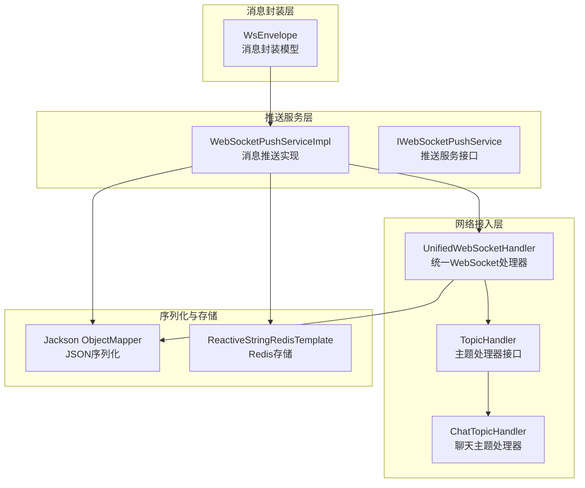
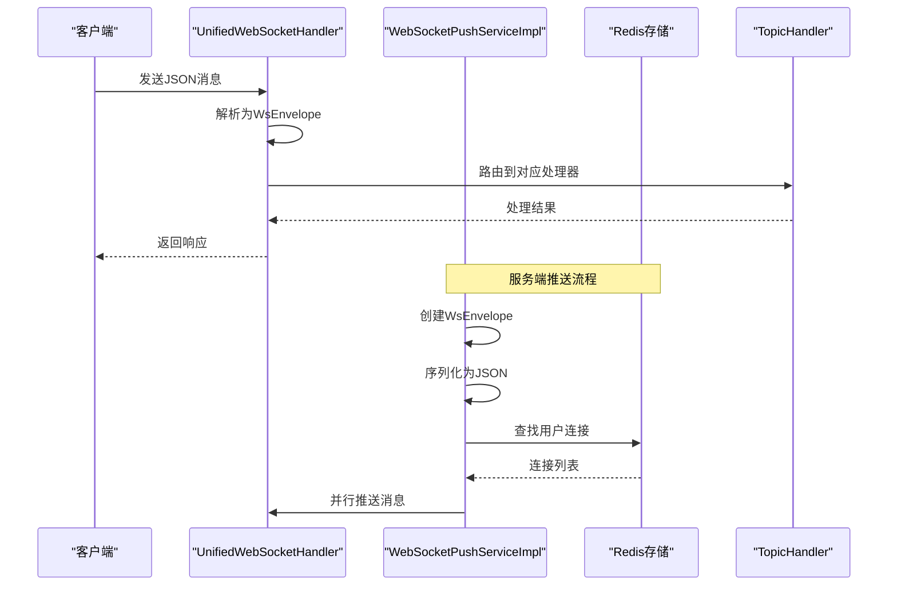
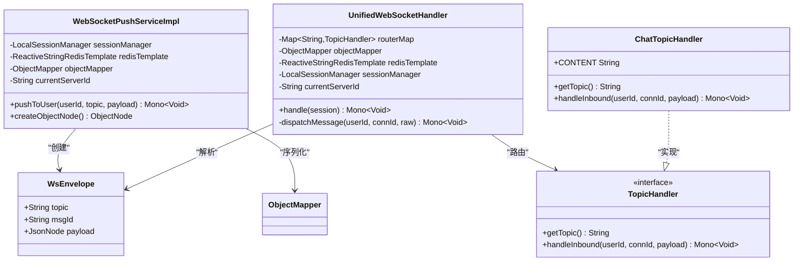
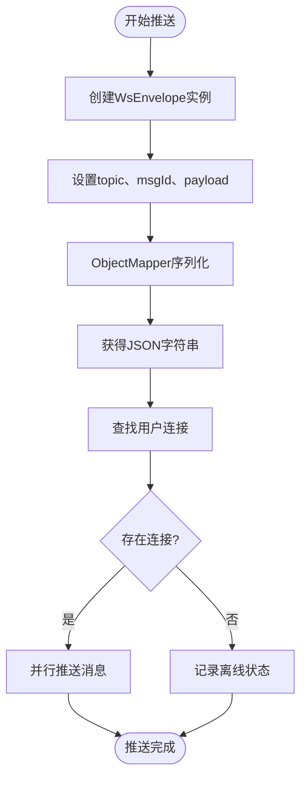
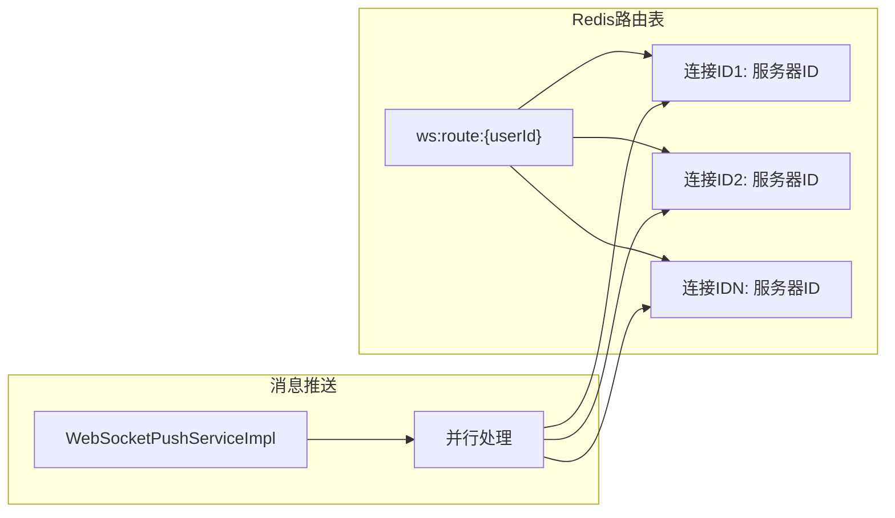
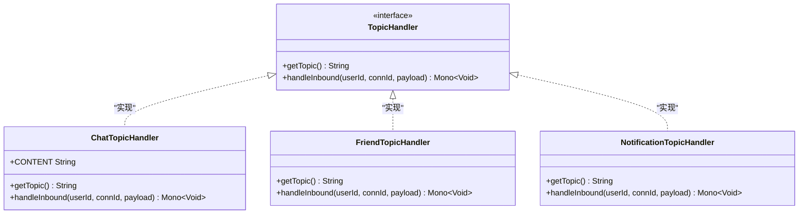
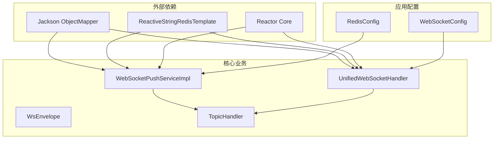

# 消息封装设计

<cite>
**本文档引用的文件**
- [WsEnvelope.java](file://src/main/java/com/rivers/im/record/WsEnvelope.java)
- [WebSocketPushServiceImpl.java](file://src/main/java/com/rivers/im/service/impl/WebSocketPushServiceImpl.java)
- [UnifiedWebSocketHandler.java](file://src/main/java/com/rivers/im/config/UnifiedWebSocketHandler.java)
- [TopicHandler.java](file://src/main/java/com/rivers/im/router/TopicHandler.java)
- [ChatTopicHandler.java](file://src/main/java/com/rivers/im/router/ChatTopicHandler.java)
- [IWebSocketPushService.java](file://src/main/java/com/rivers/im/service/IWebSocketPushService.java)
</cite>

## 目录
1. [引言](#引言)
2. [项目结构](#项目结构)
3. [核心组件](#核心组件)
4. [架构概览](#架构概览)
5. [详细组件分析](#详细组件分析)
6. [依赖关系分析](#依赖关系分析)
7. [性能考虑](#性能考虑)
8. [故障排除指南](#故障排除指南)
9. [结论](#结论)

## 引言

本文件针对IM服务器中的消息封装设计进行深入技术分析，重点围绕WsEnvelope消息封装类的设计思路展开。该设计采用标准化的消息格式，通过Jackson JSON库实现序列化与反序列化，并结合Redis进行跨节点消息路由。消息封装包含消息头（topic、msgId）和消息体（payload），并通过统一的WebSocket处理器完成消息的接收、解析和分发。

## 项目结构

该项目采用基于功能模块的分层组织方式，消息封装相关的核心代码分布于以下包中：

- record：存放消息封装模型类（WsEnvelope）
- service：存放推送服务实现（WebSocketPushServiceImpl）
- config：存放WebSocket配置与统一处理器（UnifiedWebSocketHandler）
- router：存放主题处理器接口与具体实现（TopicHandler、ChatTopicHandler等）
- service接口：存放服务接口定义（IWebSocketPushService）

**图表来源**
- [WsEnvelope.java:1-10](file://src/main/java/com/rivers/im/record/WsEnvelope.java#L1-L10)
- [WebSocketPushServiceImpl.java:1-74](file://src/main/java/com/rivers/im/service/impl/WebSocketPushServiceImpl.java#L1-L74)
- [UnifiedWebSocketHandler.java:1-138](file://src/main/java/com/rivers/im/config/UnifiedWebSocketHandler.java#L1-L138)
- [TopicHandler.java:1-13](file://src/main/java/com/rivers/im/router/TopicHandler.java#L1-L13)
- [ChatTopicHandler.java:1-28](file://src/main/java/com/rivers/im/router/ChatTopicHandler.java#L1-L28)

**章节来源**
- [WsEnvelope.java:1-10](file://src/main/java/com/rivers/im/record/WsEnvelope.java#L1-L10)
- [WebSocketPushServiceImpl.java:1-74](file://src/main/java/com/rivers/im/service/impl/WebSocketPushServiceImpl.java#L1-L74)
- [UnifiedWebSocketHandler.java:1-138](file://src/main/java/com/rivers/im/config/UnifiedWebSocketHandler.java#L1-L138)
- [TopicHandler.java:1-13](file://src/main/java/com/rivers/im/router/TopicHandler.java#L1-L13)
- [ChatTopicHandler.java:1-28](file://src/main/java/com/rivers/im/router/ChatTopicHandler.java#L1-L28)

## 核心组件

### WsEnvelope消息封装类

WsEnvelope采用Java记录类（record）实现，提供不可变的数据封装能力。其设计遵循最小必要原则，仅包含三个核心字段：

- topic：消息主题标识，用于路由到相应的处理器
- msgId：消息唯一标识符，使用UUID生成确保全局唯一性
- payload：消息载荷，采用JsonNode类型支持任意JSON结构

该设计的优势在于：
- 不可变性保证了线程安全
- 记录类语法简洁，减少样板代码
- JsonNode类型提供了灵活的JSON处理能力

**章节来源**
- [WsEnvelope.java:5-9](file://src/main/java/com/rivers/im/record/WsEnvelope.java#L5-L9)

### 推送服务实现

WebSocketPushServiceImpl负责将业务对象转换为WsEnvelope并进行序列化推送。其核心流程包括：

1. 创建WsEnvelope实例，设置topic、msgId和payload
2. 使用ObjectMapper将WsEnvelope序列化为JSON字符串
3. 通过Redis路由表查找目标用户的所有连接
4. 并行向所有连接推送消息

该实现采用响应式编程模式，使用Mono进行异步处理，提高了并发性能。

**章节来源**
- [WebSocketPushServiceImpl.java:44-74](file://src/main/java/com/rivers/im/service/impl/WebSocketPushServiceImpl.java#L44-L74)

### 统一WebSocket处理器

UnifiedWebSocketHandler作为WebSocket的统一入口点，负责：
- 建立连接并注册用户路由信息
- 接收客户端消息并解析为WsEnvelope
- 根据topic路由到对应的TopicHandler
- 处理心跳保活和连接清理

该处理器实现了消息的双向流转，既处理入站消息也管理出站消息。

**章节来源**
- [UnifiedWebSocketHandler.java:87-138](file://src/main/java/com/rivers/im/config/UnifiedWebSocketHandler.java#L87-L138)

## 架构概览

整个消息封装系统采用分层架构设计，各层职责清晰：

**图表来源**
- [UnifiedWebSocketHandler.java:124-138](file://src/main/java/com/rivers/im/config/UnifiedWebSocketHandler.java#L124-L138)
- [WebSocketPushServiceImpl.java:44-74](file://src/main/java/com/rivers/im/service/impl/WebSocketPushServiceImpl.java#L44-L74)

## 详细组件分析

### 消息封装类设计

**图表来源**
- [WsEnvelope.java:5-9](file://src/main/java/com/rivers/im/record/WsEnvelope.java#L5-L9)
- [WebSocketPushServiceImpl.java:17-37](file://src/main/java/com/rivers/im/service/impl/WebSocketPushServiceImpl.java#L17-L37)
- [UnifiedWebSocketHandler.java:38-64](file://src/main/java/com/rivers/im/config/UnifiedWebSocketHandler.java#L38-L64)
- [TopicHandler.java:8-13](file://src/main/java/com/rivers/im/router/TopicHandler.java#L8-L13)
- [ChatTopicHandler.java:14-28](file://src/main/java/com/rivers/im/router/ChatTopicHandler.java#L14-L28)

### 序列化与反序列化流程

消息的序列化和反序列化是系统的核心环节，采用Jackson库实现：

**图表来源**
- [WebSocketPushServiceImpl.java:44-74](file://src/main/java/com/rivers/im/service/impl/WebSocketPushServiceImpl.java#L44-L74)

### 消息路由机制

系统采用基于Redis的分布式路由机制：

**图表来源**
- [WebSocketPushServiceImpl.java:56-74](file://src/main/java/com/rivers/im/service/impl/WebSocketPushServiceImpl.java#L56-L74)

**章节来源**
- [WebSocketPushServiceImpl.java:44-74](file://src/main/java/com/rivers/im/service/impl/WebSocketPushServiceImpl.java#L44-L74)

### 主题处理器扩展机制

系统通过TopicHandler接口实现消息处理的扩展性：

**图表来源**
- [TopicHandler.java:8-13](file://src/main/java/com/rivers/im/router/TopicHandler.java#L8-L13)
- [ChatTopicHandler.java:14-28](file://src/main/java/com/rivers/im/router/ChatTopicHandler.java#L14-L28)

**章节来源**
- [TopicHandler.java:8-13](file://src/main/java/com/rivers/im/router/TopicHandler.java#L8-L13)
- [ChatTopicHandler.java:14-28](file://src/main/java/com/rivers/im/router/ChatTopicHandler.java#L14-L28)

## 依赖关系分析

系统各组件之间的依赖关系呈现清晰的层次结构：

**图表来源**
- [WebSocketPushServiceImpl.java:12-36](file://src/main/java/com/rivers/im/service/impl/WebSocketPushServiceImpl.java#L12-L36)
- [UnifiedWebSocketHandler.java:25-64](file://src/main/java/com/rivers/im/config/UnifiedWebSocketHandler.java#L25-L64)

**章节来源**
- [WebSocketPushServiceImpl.java:12-36](file://src/main/java/com/rivers/im/service/impl/WebSocketPushServiceImpl.java#L12-L36)
- [UnifiedWebSocketHandler.java:25-64](file://src/main/java/com/rivers/im/config/UnifiedWebSocketHandler.java#L25-L64)

## 性能考虑

### 序列化性能优化

- 使用记录类（record）替代传统POJO，减少内存占用和GC压力
- 采用响应式编程模式，避免阻塞操作
- 并行推送机制提高多连接场景下的吞吐量

### 内存管理策略

- JsonNode类型支持流式处理，避免大对象的完整加载
- UUID生成器确保消息ID的唯一性同时保持低冲突概率
- 连接路由信息使用Redis Hash结构，内存效率高

### 扩展性建议

- 可考虑引入消息压缩机制（如GZIP）以减少网络传输开销
- 支持消息版本控制，便于向后兼容
- 实现消息去重机制，防止重复消息的处理

## 故障排除指南

### 常见问题诊断

1. **消息解析失败**
   - 检查JSON格式是否符合WsEnvelope结构
   - 验证topic字段的有效性
   - 确认payload的JSON格式正确

2. **路由失败**
   - 检查Redis连接状态
   - 验证用户路由表是否存在
   - 确认连接ID的有效性

3. **推送超时**
   - 监控Redis写入性能
   - 检查网络延迟情况
   - 评估并发连接数量

**章节来源**
- [UnifiedWebSocketHandler.java:124-138](file://src/main/java/com/rivers/im/config/UnifiedWebSocketHandler.java#L124-L138)
- [WebSocketPushServiceImpl.java:56-74](file://src/main/java/com/rivers/im/service/impl/WebSocketPushServiceImpl.java#L56-L74)

## 结论

本消息封装设计通过简洁的WsEnvelope模型实现了IM系统的标准化消息格式。系统采用响应式编程和分布式路由机制，在保证性能的同时具备良好的扩展性。设计的关键优势包括：

- 标准化的消息格式，便于协议演进
- 基于Redis的分布式路由，支持水平扩展
- 响应式编程模型，提供高并发处理能力
- 插件化的主题处理器，支持功能扩展

未来可在消息压缩、版本兼容性和监控告警等方面进一步完善，以适应更大规模的应用场景。