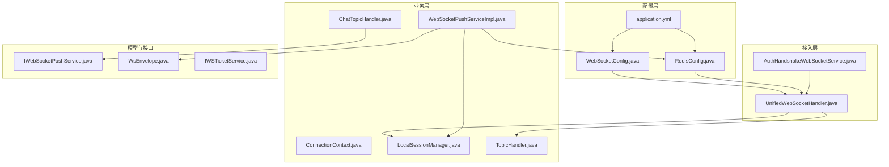
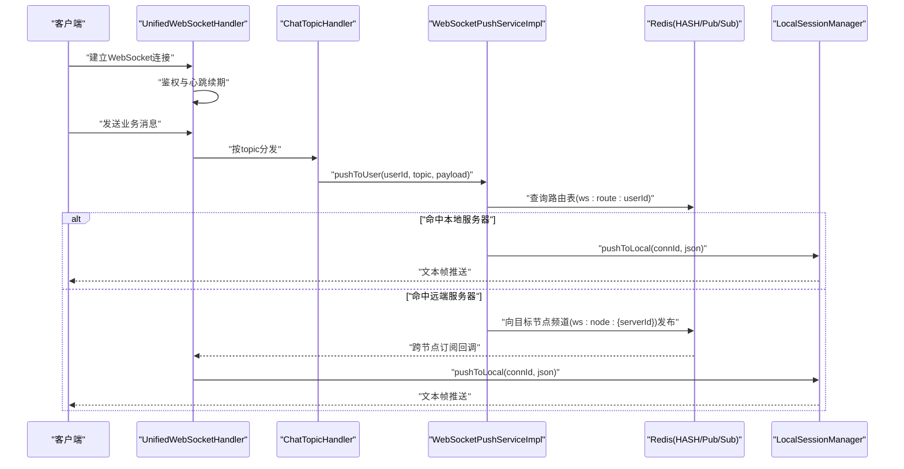
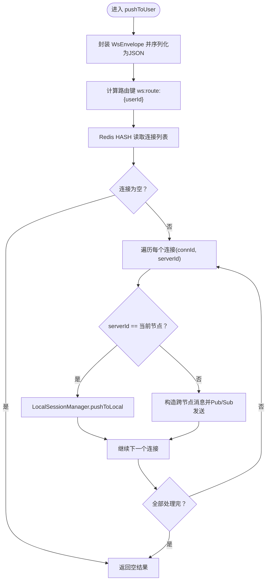
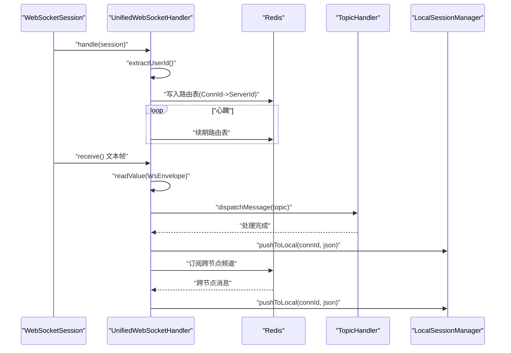
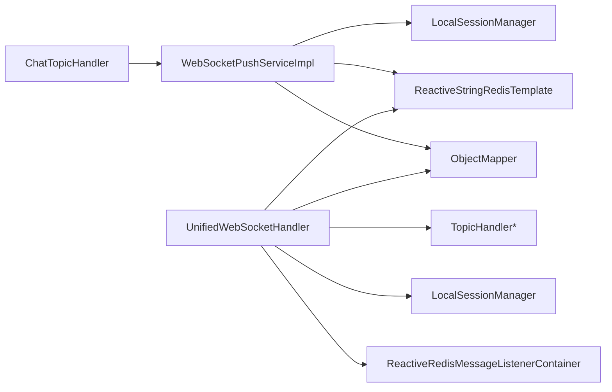

# 消息推送系统

<cite>
**本文引用的文件**
- [IWebSocketPushService.java](file://src/main/java/com/rivers/im/service/IWebSocketPushService.java)
- [WebSocketPushServiceImpl.java](file://src/main/java/com/rivers/im/service/impl/WebSocketPushServiceImpl.java)
- [WsEnvelope.java](file://src/main/java/com/rivers/im/record/WsEnvelope.java)
- [LocalSessionManager.java](file://src/main/java/com/rivers/im/manage/LocalSessionManager.java)
- [UnifiedWebSocketHandler.java](file://src/main/java/com/rivers/im/config/UnifiedWebSocketHandler.java)
- [WebSocketConfig.java](file://src/main/java/com/rivers/im/config/WebSocketConfig.java)
- [RedisConfig.java](file://src/main/java/com/rivers/im/config/RedisConfig.java)
- [AuthHandshakeWebSocketService.java](file://src/main/java/com/rivers/im/service/impl/AuthHandshakeWebSocketService.java)
- [ConnectionContext.java](file://src/main/java/com/rivers/im/context/ConnectionContext.java)
- [TopicHandler.java](file://src/main/java/com/rivers/im/router/TopicHandler.java)
- [ChatTopicHandler.java](file://src/main/java/com/rivers/im/router/ChatTopicHandler.java)
- [IWSTicketService.java](file://src/main/java/com/rivers/im/service/IWsTicketService.java)
- [application.yml](file://src/main/resources/application.yml)
- [build.gradle](file://build.gradle)
</cite>

## 目录
1. [引言](#引言)
2. [项目结构](#项目结构)
3. [核心组件](#核心组件)
4. [架构总览](#架构总览)
5. [详细组件分析](#详细组件分析)
6. [依赖分析](#依赖分析)
7. [性能考虑](#性能考虑)
8. [故障排查指南](#故障排查指南)
9. [结论](#结论)
10. [附录](#附录)

## 引言
本文件为消息推送系统的完整技术文档，聚焦于 IWebSocketPushService 的设计理念与实现策略，深入剖析 WebSocketPushServiceImpl 的推送实现（本地推送、跨节点消息转发、Redis Pub/Sub 集成），阐述 WsEnvelope 消息封装的设计思路（消息格式标准化、序列化机制、传输优化），并提供性能优化策略、错误重试机制与监控指标建议。

## 项目结构
该系统采用基于响应式 WebFlux 的微服务架构，结合 Redis 哈希与 Pub/Sub 实现跨节点消息路由；通过统一的 WebSocket 入口与主题处理器完成消息分发；以 Jackson 进行 JSON 序列化与反序列化；以 Lombok 简化样板代码；以 Spring Cloud 作为基础设施支撑。

图表来源
- [WebSocketConfig.java:1-35](file://src/main/java/com/rivers/im/config/WebSocketConfig.java#L1-L35)
- [RedisConfig.java:1-18](file://src/main/java/com/rivers/im/config/RedisConfig.java#L1-L18)
- [UnifiedWebSocketHandler.java:1-181](file://src/main/java/com/rivers/im/config/UnifiedWebSocketHandler.java#L1-L181)
- [AuthHandshakeWebSocketService.java:1-73](file://src/main/java/com/rivers/im/service/impl/AuthHandshakeWebSocketService.java#L1-L73)
- [WebSocketPushServiceImpl.java:1-90](file://src/main/java/com/rivers/im/service/impl/WebSocketPushServiceImpl.java#L1-L90)
- [LocalSessionManager.java:1-43](file://src/main/java/com/rivers/im/manage/LocalSessionManager.java#L1-L43)
- [TopicHandler.java:1-14](file://src/main/java/com/rivers/im/router/TopicHandler.java#L1-L14)
- [ChatTopicHandler.java:1-51](file://src/main/java/com/rivers/im/router/ChatTopicHandler.java#L1-L51)
- [IWebSocketPushService.java:1-12](file://src/main/java/com/rivers/im/service/IWebSocketPushService.java#L1-L12)
- [WsEnvelope.java:1-10](file://src/main/java/com/rivers/im/record/WsEnvelope.java#L1-L10)
- [IWSTicketService.java:1-14](file://src/main/java/com/rivers/im/service/IWsTicketService.java#L1-L14)
- [application.yml:1-14](file://src/main/resources/application.yml#L1-L14)

章节来源
- [build.gradle:1-64](file://build.gradle#L1-L64)
- [application.yml:1-14](file://src/main/resources/application.yml#L1-L14)

## 核心组件
- IWebSocketPushService：推送服务接口，定义对象节点构造与按用户主题推送能力，确保上层业务与具体推送实现解耦。
- WebSocketPushServiceImpl：推送服务实现，负责消息封装、路由查询、本地/远程推送决策、跨节点消息转发与错误处理。
- WsEnvelope：消息载体记录类，标准化消息字段（topic、msgId、payload），便于序列化与跨节点传输。
- UnifiedWebSocketHandler：统一 WebSocket 处理器，负责握手鉴权、连接生命周期管理、心跳续期、消息分发与跨节点订阅。
- LocalSessionManager：本地会话管理器，维护 connId 到 ConnectionContext 的映射，支持线程安全的本地推送。
- TopicHandler/ChatTopicHandler：主题处理器接口与聊天主题实现，负责业务消息解析与调用推送服务。
- RedisConfig/WebSocketConfig：Redis 响应式监听容器与 WebSocket 映射配置，保障跨节点消息通道与接入入口。
- ConnectionContext：连接上下文，封装 WebSocketSession、用户标识与出站消息多播通道。
- IWsTicketService：票据服务接口，用于握手鉴权阶段的身份校验。

章节来源
- [IWebSocketPushService.java:1-12](file://src/main/java/com/rivers/im/service/IWebSocketPushService.java#L1-L12)
- [WebSocketPushServiceImpl.java:1-90](file://src/main/java/com/rivers/im/service/impl/WebSocketPushServiceImpl.java#L1-L90)
- [WsEnvelope.java:1-10](file://src/main/java/com/rivers/im/record/WsEnvelope.java#L1-L10)
- [UnifiedWebSocketHandler.java:1-181](file://src/main/java/com/rivers/im/config/UnifiedWebSocketHandler.java#L1-L181)
- [LocalSessionManager.java:1-43](file://src/main/java/com/rivers/im/manage/LocalSessionManager.java#L1-L43)
- [TopicHandler.java:1-14](file://src/main/java/com/rivers/im/router/TopicHandler.java#L1-L14)
- [ChatTopicHandler.java:1-51](file://src/main/java/com/rivers/im/router/ChatTopicHandler.java#L1-L51)
- [RedisConfig.java:1-18](file://src/main/java/com/rivers/im/config/RedisConfig.java#L1-L18)
- [WebSocketConfig.java:1-35](file://src/main/java/com/rivers/im/config/WebSocketConfig.java#L1-L35)
- [ConnectionContext.java:1-24](file://src/main/java/com/rivers/im/context/ConnectionContext.java#L1-L24)
- [IWSTicketService.java:1-14](file://src/main/java/com/rivers/im/service/IWsTicketService.java#L1-L14)

## 架构总览
系统采用“请求-响应”与“事件驱动”相结合的架构：
- 接入层：统一 WebSocket 入口与鉴权握手服务，建立连接并注入用户标识。
- 业务层：主题处理器根据 topic 分发消息，调用推送服务进行目标用户消息投递。
- 推送层：推送服务将业务负载封装为 WsEnvelope，查询路由表决定本地或跨节点推送。
- 传输层：本地推送通过 LocalSessionManager 写入连接上下文的出站通道；跨节点通过 Redis Pub/Sub 广播到目标节点，目标节点再本地投递。

图表来源
- [UnifiedWebSocketHandler.java:87-122](file://src/main/java/com/rivers/im/config/UnifiedWebSocketHandler.java#L87-L122)
- [ChatTopicHandler.java:30-49](file://src/main/java/com/rivers/im/router/ChatTopicHandler.java#L30-L49)
- [WebSocketPushServiceImpl.java:44-88](file://src/main/java/com/rivers/im/service/impl/WebSocketPushServiceImpl.java#L44-L88)
- [LocalSessionManager.java:35-42](file://src/main/java/com/rivers/im/manage/LocalSessionManager.java#L35-L42)

## 详细组件分析

### IWebSocketPushService 接口设计
- 设计理念
  - 抽象推送能力，屏蔽具体传输细节，便于替换实现（如直连、MQ、RPC）。
  - 提供对象节点构造方法，统一业务侧 JSON 结构生成方式，降低序列化成本。
- 扩展机制
  - 通过实现类可插拔替换，支持不同路由策略（本地优先、一致性哈希、随机等）。
  - 通过注入 RedisTemplate、ObjectMapper、会话管理器等依赖，实现横向扩展。

章节来源
- [IWebSocketPushService.java:6-11](file://src/main/java/com/rivers/im/service/IWebSocketPushService.java#L6-L11)

### WebSocketPushServiceImpl 推送实现
- 消息封装与序列化
  - 使用 WsEnvelope 将 topic、msgId、payload 统一为标准结构，便于跨节点传输与日志追踪。
  - 通过 Jackson ObjectMapper 完成对象到 JSON 的序列化，确保跨语言兼容性。
- 路由与推送决策
  - 查询 Redis Hash 中的路由表（键：ws:route:{userId}），读取所有连接与其所在服务器 ID。
  - 对每个连接判断是否为当前服务器：是则本地推送，否则构造跨节点消息并通过 Pub/Sub 发送到目标节点。
- 错误处理与可观测性
  - 对跨节点发送失败进行告警并忽略，保证主流程不阻塞。
  - 对用户离线或连接不存在进行日志记录，便于问题定位。

图表来源
- [WebSocketPushServiceImpl.java:44-88](file://src/main/java/com/rivers/im/service/impl/WebSocketPushServiceImpl.java#L44-L88)
- [WsEnvelope.java:5-9](file://src/main/java/com/rivers/im/record/WsEnvelope.java#L5-L9)

章节来源
- [WebSocketPushServiceImpl.java:20-88](file://src/main/java/com/rivers/im/service/impl/WebSocketPushServiceImpl.java#L20-L88)

### WsEnvelope 消息封装设计
- 设计思路
  - 采用 Java Record 简化不可变数据结构，字段明确：topic（主题）、msgId（消息唯一标识）、payload（业务载荷）。
  - 通过 Jackson JsonNode 保存原始树结构，避免二次序列化开销，提升传输效率。
- 序列化与传输优化
  - 在推送侧统一序列化为字符串，减少类型转换与装箱拆箱成本。
  - 跨节点传输时复用同一 JSON 字符串，避免重复序列化。

章节来源
- [WsEnvelope.java:5-9](file://src/main/java/com/rivers/im/record/WsEnvelope.java#L5-L9)
- [WebSocketPushServiceImpl.java:47-53](file://src/main/java/com/rivers/im/service/impl/WebSocketPushServiceImpl.java#L47-L53)

### UnifiedWebSocketHandler 与会话生命周期
- 握手与鉴权
  - 通过 AuthHandshakeWebSocketService 校验票据并注入用户标识到会话属性中。
- 连接注册与心跳
  - 建立连接后注册到 LocalSessionManager，并将 connId 与当前节点 ID 写入 Redis Hash 路由表，周期性续期。
- 消息分发与跨节点订阅
  - 订阅当前节点的跨服频道，收到其他节点转发的消息后，直接本地投递。
  - 解析入站消息为 WsEnvelope，按 topic 查找对应 TopicHandler 进行业务处理。
- 清理与可观测性
  - 断开连接时清理路由表与会话上下文，记录日志便于排障。

图表来源
- [UnifiedWebSocketHandler.java:87-122](file://src/main/java/com/rivers/im/config/UnifiedWebSocketHandler.java#L87-L122)
- [UnifiedWebSocketHandler.java:140-149](file://src/main/java/com/rivers/im/config/UnifiedWebSocketHandler.java#L140-L149)
- [AuthHandshakeWebSocketService.java:26-54](file://src/main/java/com/rivers/im/service/impl/AuthHandshakeWebSocketService.java#L26-L54)

章节来源
- [UnifiedWebSocketHandler.java:38-181](file://src/main/java/com/rivers/im/config/UnifiedWebSocketHandler.java#L38-L181)
- [AuthHandshakeWebSocketService.java:18-73](file://src/main/java/com/rivers/im/service/impl/AuthHandshakeWebSocketService.java#L18-L73)

### LocalSessionManager 与 ConnectionContext
- LocalSessionManager
  - 维护 connId 到 ConnectionContext 的并发映射，提供注册、注销、查询与本地推送能力。
  - 推送前检查连接状态，避免对已关闭连接写入。
- ConnectionContext
  - 包含 WebSocketSession、用户标识与出站 Sink（多播、背压缓冲）。
  - push 方法通过 Sink 安全地向下游发送消息。

章节来源
- [LocalSessionManager.java:12-43](file://src/main/java/com/rivers/im/manage/LocalSessionManager.java#L12-L43)
- [ConnectionContext.java:8-24](file://src/main/java/com/rivers/im/context/ConnectionContext.java#L8-L24)

### 主题处理器与业务集成
- TopicHandler 接口
  - 规定 getTopic 与 handleInbound 能力，便于扩展新主题。
- ChatTopicHandler
  - 校验接收方，组装业务载荷（包含时间戳），分别向发送方与接收方推送相同内容，保证双方可见。

章节来源
- [TopicHandler.java:8-13](file://src/main/java/com/rivers/im/router/TopicHandler.java#L8-L13)
- [ChatTopicHandler.java:14-51](file://src/main/java/com/rivers/im/router/ChatTopicHandler.java#L14-L51)

### 配置与依赖
- WebSocketConfig
  - 注册统一 WebSocket 映射与自定义握手适配器，保证鉴权与接入顺序。
- RedisConfig
  - 提供响应式 Pub/Sub 监听容器，支撑跨节点消息通道。
- application.yml
  - 配置应用名称、Nacos 配置中心地址与服务端口，用于生成节点标识。

章节来源
- [WebSocketConfig.java:14-35](file://src/main/java/com/rivers/im/config/WebSocketConfig.java#L14-L35)
- [RedisConfig.java:9-18](file://src/main/java/com/rivers/im/config/RedisConfig.java#L9-L18)
- [application.yml:1-14](file://src/main/resources/application.yml#L1-L14)

## 依赖分析
- 组件耦合
  - WebSocketPushServiceImpl 依赖 LocalSessionManager、ReactiveStringRedisTemplate、ObjectMapper、当前节点标识。
  - UnifiedWebSocketHandler 依赖 TopicHandler 列表、ObjectMapper、ReactiveStringRedisTemplate、ReactiveRedisMessageListenerContainer、LocalSessionManager。
  - ChatTopicHandler 依赖 IWebSocketPushService 与 ObjectMapper。
- 外部依赖
  - Spring Boot WebFlux、Spring Data Redis Reactive、Jackson、Lombok。
- 循环依赖规避
  - WebSocketConfig 仅注入 Handler 与握手服务，避免循环；TopicHandler 通过构造注入，形成单向依赖链。

图表来源
- [WebSocketPushServiceImpl.java:22-37](file://src/main/java/com/rivers/im/service/impl/WebSocketPushServiceImpl.java#L22-L37)
- [UnifiedWebSocketHandler.java:50-64](file://src/main/java/com/rivers/im/config/UnifiedWebSocketHandler.java#L50-L64)
- [ChatTopicHandler.java:17-23](file://src/main/java/com/rivers/im/router/ChatTopicHandler.java#L17-L23)

章节来源
- [build.gradle:31-45](file://build.gradle#L31-L45)

## 性能考虑
- 序列化与内存
  - 使用 JsonNode 保存原始树，避免重复序列化；推送前一次性序列化为字符串，减少 GC 压力。
- 路由查询与并发
  - Redis Hash 查询为 O(k)（k 为用户连接数），批量推送使用并行 Mono，提升吞吐。
- 背压与缓冲
  - 出站 Sink 采用多播+背压缓冲，避免高并发下丢包与阻塞。
- 心跳与续期
  - 定期续期路由表，防止连接断开导致的僵尸路由。
- 跨节点传输
  - Pub/Sub 为异步广播，避免阻塞主推送流程；跨节点消息体仅包含必要字段，降低网络开销。

[本节为通用性能指导，无需列出章节来源]

## 故障排查指南
- 握手失败
  - 检查票据有效性与超时设置，确认 AuthHandshakeWebSocketService 返回状态码与日志。
- 连接未注册或路由缺失
  - 核对路由键格式与 Redis Hash 写入逻辑，确认心跳续期是否正常。
- 跨节点消息未达
  - 检查目标节点订阅是否生效、Pub/Sub 频道命名是否一致、网络连通性。
- 本地推送失败
  - 查看 LocalSessionManager 是否存在连接、连接是否打开、Sink 是否被消费。
- 日志定位
  - 关注推送服务与统一处理器中的告警与错误日志，结合 msgId 与 connId 进行关联分析。

章节来源
- [AuthHandshakeWebSocketService.java:26-54](file://src/main/java/com/rivers/im/service/impl/AuthHandshakeWebSocketService.java#L26-L54)
- [UnifiedWebSocketHandler.java:67-77](file://src/main/java/com/rivers/im/config/UnifiedWebSocketHandler.java#L67-L77)
- [WebSocketPushServiceImpl.java:76-88](file://src/main/java/com/rivers/im/service/impl/WebSocketPushServiceImpl.java#L76-L88)
- [LocalSessionManager.java:35-42](file://src/main/java/com/rivers/im/manage/LocalSessionManager.java#L35-L42)

## 结论
该消息推送系统通过清晰的抽象与模块化设计，实现了本地与跨节点的高效消息投递。IWebSocketPushService 提供稳定的接口契约，WebSocketPushServiceImpl 将业务与传输解耦；WsEnvelope 统一消息格式，配合 Redis 路由与 Pub/Sub 实现水平扩展；UnifiedWebSocketHandler 与 LocalSessionManager 构建了健壮的接入与会话管理框架。整体具备良好的可扩展性与可观测性，适合在分布式场景下演进。

[本节为总结性内容，无需列出章节来源]

## 附录
- 监控指标建议
  - 推送成功率、延迟分布、跨节点消息量、路由查询耗时、心跳续期失败率、会话断开率。
- 错误重试策略
  - 跨节点发送失败可引入指数退避与最大重试次数；本地推送失败记录并上报，必要时触发补偿推送。
- 扩展方向
  - 引入消息去重（基于 msgId）、持久化离线消息、限流与熔断、多租户隔离与权限控制。

[本节为通用建议，无需列出章节来源]