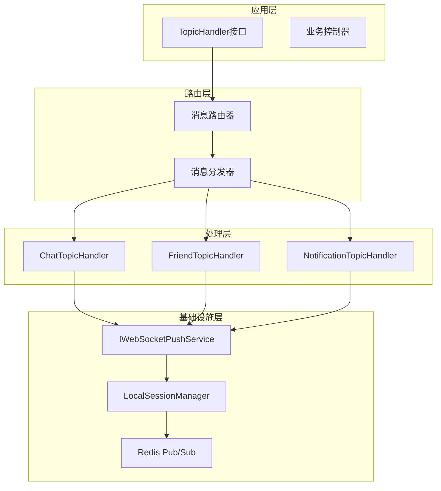
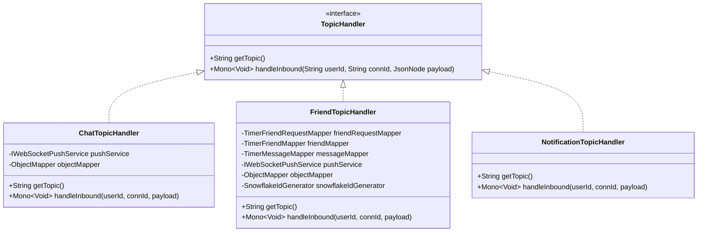
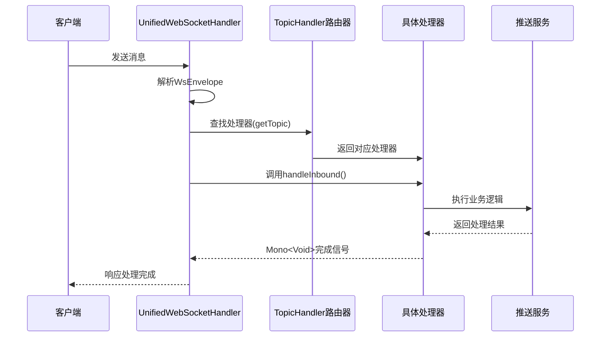
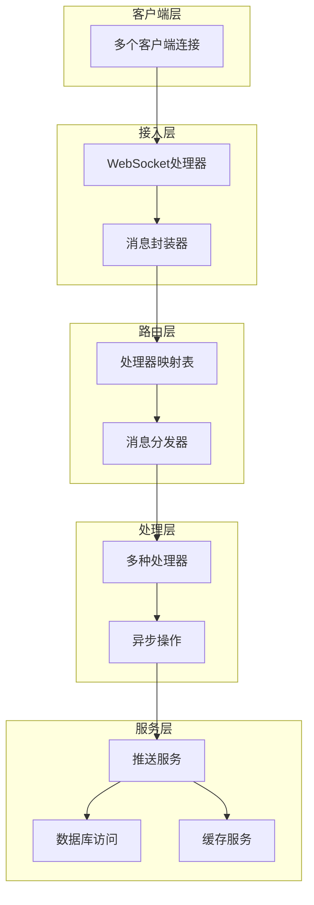
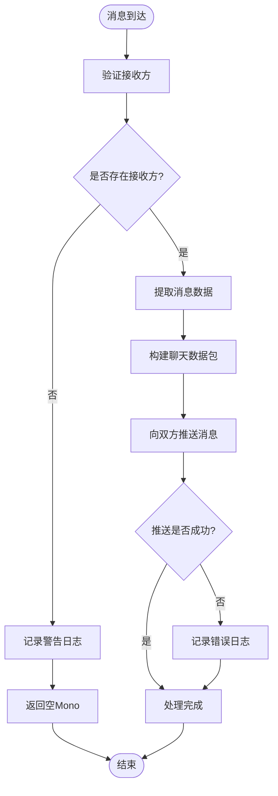
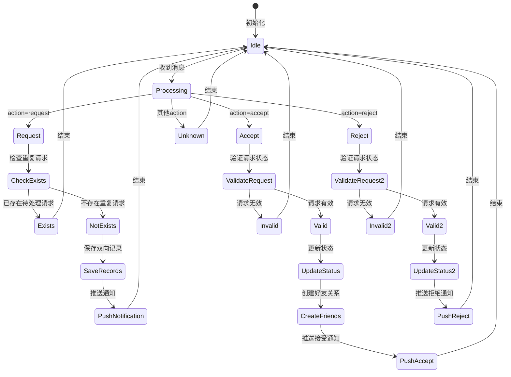
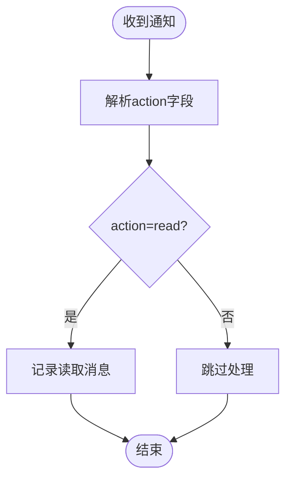
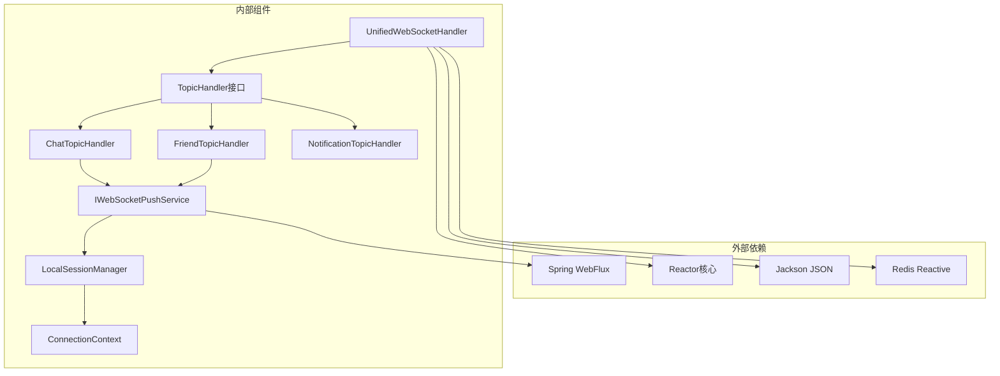
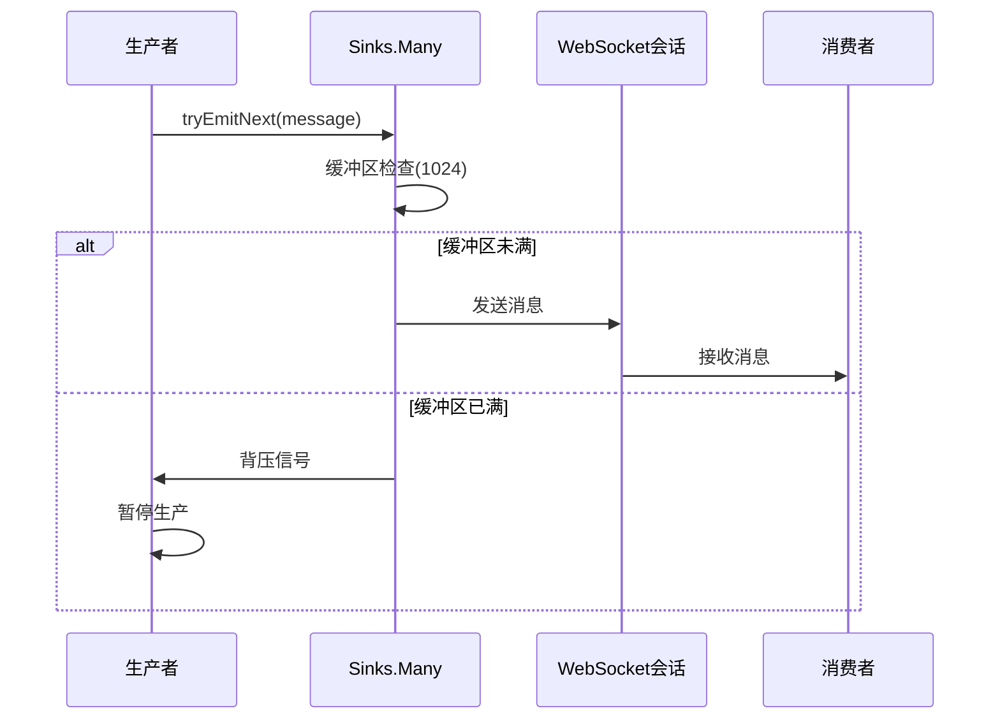
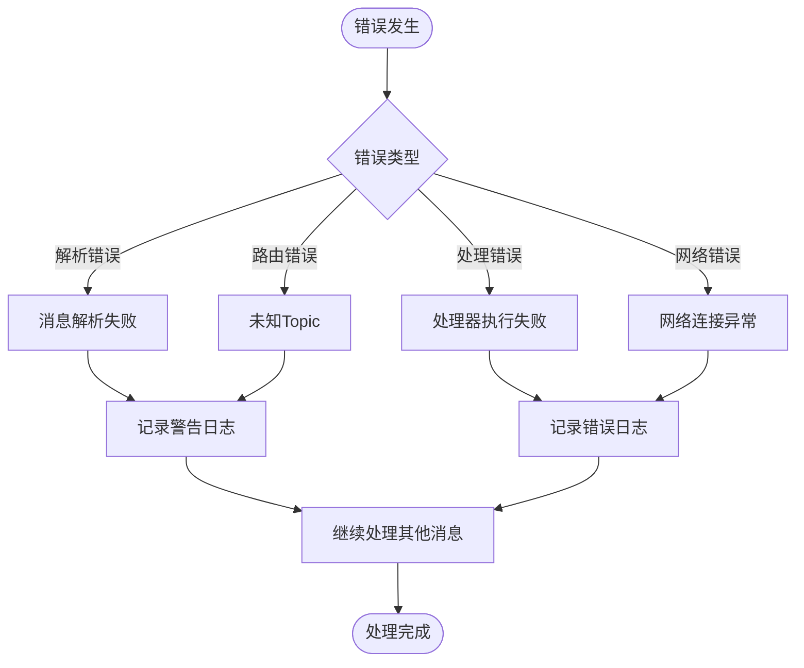

# TopicHandler接口设计

<cite>
**本文档引用的文件**
- [TopicHandler.java](file://src/main/java/com/rivers/im/router/TopicHandler.java)
- [ChatTopicHandler.java](file://src/main/java/com/rivers/im/router/ChatTopicHandler.java)
- [FriendTopicHandler.java](file://src/main/java/com/rivers/im/router/FriendTopicHandler.java)
- [NotificationTopicHandler.java](file://src/main/java/com/rivers/im/router/NotificationTopicHandler.java)
- [IWebSocketPushService.java](file://src/main/java/com/rivers/im/service/IWebSocketPushService.java)
- [UnifiedWebSocketHandler.java](file://src/main/java/com/rivers/im/config/UnifiedWebSocketHandler.java)
- [ConnectionContext.java](file://src/main/java/com/rivers/im/context/ConnectionContext.java)
- [WsEnvelope.java](file://src/main/java/com/rivers/im/record/WsEnvelope.java)
- [LocalSessionManager.java](file://src/main/java/com/rivers/im/manage/LocalSessionManager.java)
</cite>

## 目录
1. [引言](#引言)
2. [项目结构](#项目结构)
3. [核心组件](#核心组件)
4. [架构概览](#架构概览)
5. [详细组件分析](#详细组件分析)
6. [依赖分析](#依赖分析)
7. [性能考虑](#性能考虑)
8. [故障排除指南](#故障排除指南)
9. [结论](#结论)

## 引言

TopicHandler接口是本IM服务器消息路由系统的核心抽象层，负责定义消息处理器的标准接口规范。该接口采用响应式编程范式，基于Reactor框架实现了异步非阻塞的消息处理机制。通过统一的接口设计，系统实现了消息类型与处理器的完全解耦，支持动态扩展和灵活的消息路由。

本接口的设计体现了现代微服务架构中消息驱动架构的核心理念，通过明确的职责分离和标准化的数据流，确保了系统的可扩展性、可维护性和高性能。

## 项目结构

消息路由系统采用分层架构设计，主要包含以下层次：

**图表来源**
- [TopicHandler.java:1-14](file://src/main/java/com/rivers/im/router/TopicHandler.java#L1-L14)
- [UnifiedWebSocketHandler.java:38-65](file://src/main/java/com/rivers/im/config/UnifiedWebSocketHandler.java#L38-L65)

**章节来源**
- [TopicHandler.java:1-14](file://src/main/java/com/rivers/im/router/TopicHandler.java#L1-L14)
- [UnifiedWebSocketHandler.java:38-65](file://src/main/java/com/rivers/im/config/UnifiedWebSocketHandler.java#L38-L65)

## 核心组件

### TopicHandler接口设计

TopicHandler接口定义了消息处理器的核心行为规范，采用最小化设计原则，只包含两个关键方法：

**图表来源**
- [TopicHandler.java:8-13](file://src/main/java/com/rivers/im/router/TopicHandler.java#L8-L13)
- [ChatTopicHandler.java:14-50](file://src/main/java/com/rivers/im/router/ChatTopicHandler.java#L14-L50)
- [FriendTopicHandler.java:24-51](file://src/main/java/com/rivers/im/router/FriendTopicHandler.java#L24-L51)
- [NotificationTopicHandler.java:12-27](file://src/main/java/com/rivers/im/router/NotificationTopicHandler.java#L12-L27)

接口的核心设计理念体现在以下几个方面：

1. **消息类型标识机制**：通过`getTopic()`方法返回消息类型标识符，实现消息类型与处理器的静态绑定
2. **异步处理模式**：采用`Mono<Void>`返回类型，支持响应式编程和非阻塞处理
3. **参数标准化**：统一的参数签名确保所有处理器具有相同的调用契约
4. **错误隔离**：通过响应式流的错误传播机制实现错误的局部化处理

**章节来源**
- [TopicHandler.java:8-13](file://src/main/java/com/rivers/im/router/TopicHandler.java#L8-L13)

### 消息路由系统

消息路由系统通过统一的路由器实现消息的动态分发：

**图表来源**
- [UnifiedWebSocketHandler.java:124-138](file://src/main/java/com/rivers/im/config/UnifiedWebSocketHandler.java#L124-L138)
- [TopicHandler.java:10-12](file://src/main/java/com/rivers/im/router/TopicHandler.java#L10-L12)

**章节来源**
- [UnifiedWebSocketHandler.java:124-138](file://src/main/java/com/rivers/im/config/UnifiedWebSocketHandler.java#L124-L138)

## 架构概览

消息路由系统采用事件驱动架构，结合响应式编程和微服务设计理念：

**图表来源**
- [UnifiedWebSocketHandler.java:87-122](file://src/main/java/com/rivers/im/config/UnifiedWebSocketHandler.java#L87-L122)
- [ConnectionContext.java:8-19](file://src/main/java/com/rivers/im/context/ConnectionContext.java#L8-L19)

系统架构的关键特性：

1. **解耦设计**：处理器与具体业务逻辑完全分离
2. **异步非阻塞**：基于Reactor的响应式编程模型
3. **水平扩展**：支持多实例部署和负载均衡
4. **容错机制**：完善的错误处理和恢复策略

## 详细组件分析

### ChatTopicHandler实现

ChatTopicHandler负责处理聊天消息，实现了基本的消息转发功能：

**图表来源**
- [ChatTopicHandler.java:31-49](file://src/main/java/com/rivers/im/router/ChatTopicHandler.java#L31-L49)

实现特点：
- **双路推送**：同时向发送方和接收方推送消息
- **数据封装**：使用ObjectMapper构建标准消息格式
- **错误处理**：推送失败时记录日志但不中断流程
- **性能优化**：使用`Mono.when()`并行执行推送操作

**章节来源**
- [ChatTopicHandler.java:14-50](file://src/main/java/com/rivers/im/router/ChatTopicHandler.java#L14-L50)

### FriendTopicHandler实现

FriendTopicHandler实现了复杂的好友关系管理功能，包含完整的CRUD操作：

**图表来源**
- [FriendTopicHandler.java:59-70](file://src/main/java/com/rivers/im/router/FriendTopicHandler.java#L59-L70)

核心功能模块：

1. **请求处理**：写扩散模型实现双向记录的一致性
2. **状态管理**：完整的请求生命周期管理
3. **通知机制**：离线消息持久化和实时推送
4. **事务保证**：基于关系ID的状态批量更新

**章节来源**
- [FriendTopicHandler.java:24-261](file://src/main/java/com/rivers/im/router/FriendTopicHandler.java#L24-L261)

### NotificationTopicHandler实现

NotificationTopicHandler是最简单的处理器实现，专注于消息读取通知：

**图表来源**
- [NotificationTopicHandler.java:19-26](file://src/main/java/com/rivers/im/router/NotificationTopicHandler.java#L19-L26)

实现特点：
- **轻量级设计**：最小化的实现确保高效率
- **无副作用**：只记录日志不执行其他操作
- **扩展友好**：为未来功能扩展预留空间

**章节来源**
- [NotificationTopicHandler.java:12-27](file://src/main/java/com/rivers/im/router/NotificationTopicHandler.java#L12-L27)

## 依赖分析

系统采用松耦合的依赖设计，通过Spring框架实现自动装配：

**图表来源**
- [UnifiedWebSocketHandler.java:50-64](file://src/main/java/com/rivers/im/config/UnifiedWebSocketHandler.java#L50-L64)
- [ChatTopicHandler.java:17-23](file://src/main/java/com/rivers/im/router/ChatTopicHandler.java#L17-L23)
- [FriendTopicHandler.java:32-51](file://src/main/java/com/rivers/im/router/FriendTopicHandler.java#L32-L51)

依赖关系分析：

1. **接口导向**：所有组件依赖于TopicHandler接口而非具体实现
2. **服务注入**：通过构造函数注入实现依赖注入
3. **异步通信**：基于Reactor的响应式数据流
4. **配置驱动**：通过Spring容器管理组件生命周期

**章节来源**
- [UnifiedWebSocketHandler.java:50-64](file://src/main/java/com/rivers/im/config/UnifiedWebSocketHandler.java#L50-L64)

## 性能考虑

### 背压处理机制

系统实现了多层次的背压处理机制：

**图表来源**
- [ConnectionContext.java:18](file://src/main/java/com/rivers/im/context/ConnectionContext.java#L18)

背压处理策略：
- **缓冲区大小**：设置合理的缓冲区容量(1024条消息)
- **多播机制**：使用Multicast确保线程安全
- **背压策略**：基于缓冲区状态的动态调节

### 异步处理优化

系统通过多种方式优化异步处理性能：

1. **并行处理**：使用`Mono.when()`并行执行独立操作
2. **延迟执行**：使用`Mono.defer()`避免不必要的立即执行
3. **错误恢复**：通过`onErrorResume()`实现优雅降级
4. **资源管理**：及时释放连接和会话资源

**章节来源**
- [ChatTopicHandler.java:45-48](file://src/main/java/com/rivers/im/router/ChatTopicHandler.java#L45-L48)
- [FriendTopicHandler.java:210-213](file://src/main/java/com/rivers/im/router/FriendTopicHandler.java#L210-L213)

## 故障排除指南

### 常见问题诊断

系统提供了完善的错误处理和日志记录机制：

**图表来源**
- [UnifiedWebSocketHandler.java:134-137](file://src/main/java/com/rivers/im/config/UnifiedWebSocketHandler.java#L134-L137)

故障排除步骤：

1. **检查日志**：查看详细的错误信息和堆栈跟踪
2. **验证配置**：确认Topic映射和处理器注册正确
3. **监控资源**：检查内存使用和连接池状态
4. **测试网络**：验证Redis连接和网络连通性

**章节来源**
- [UnifiedWebSocketHandler.java:134-137](file://src/main/java/com/rivers/im/config/UnifiedWebSocketHandler.java#L134-L137)

### 性能监控指标

建议关注以下关键性能指标：

- **消息吞吐量**：每秒处理的消息数量
- **延迟时间**：从接收消息到处理完成的时间
- **错误率**：处理失败的比例
- **内存使用**：缓冲区和对象池的使用情况
- **连接数**：活跃WebSocket连接的数量

## 结论

TopicHandler接口设计体现了现代消息驱动架构的最佳实践，通过简洁而强大的接口设计实现了：

1. **高度解耦**：消息类型与处理器完全分离，支持动态扩展
2. **响应式编程**：基于Reactor的异步非阻塞处理模式
3. **错误隔离**：完善的错误处理和恢复机制
4. **性能优化**：多层次的背压处理和异步优化策略

该设计为IM系统的扩展提供了坚实的基础，支持未来更多的消息类型和业务场景。通过遵循本文档的最佳实践和扩展指南，开发者可以快速实现新的消息处理器，同时保持系统的稳定性和高性能。