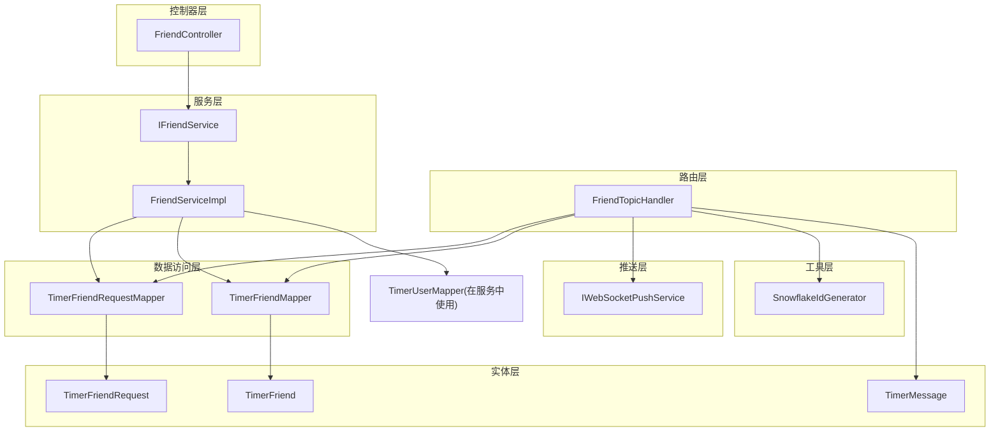
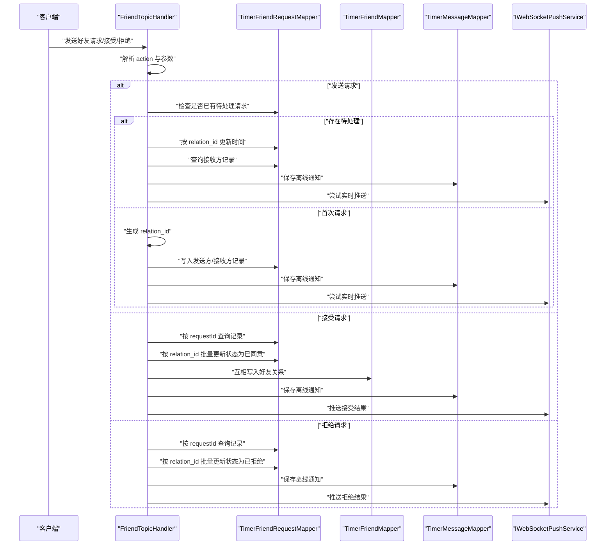
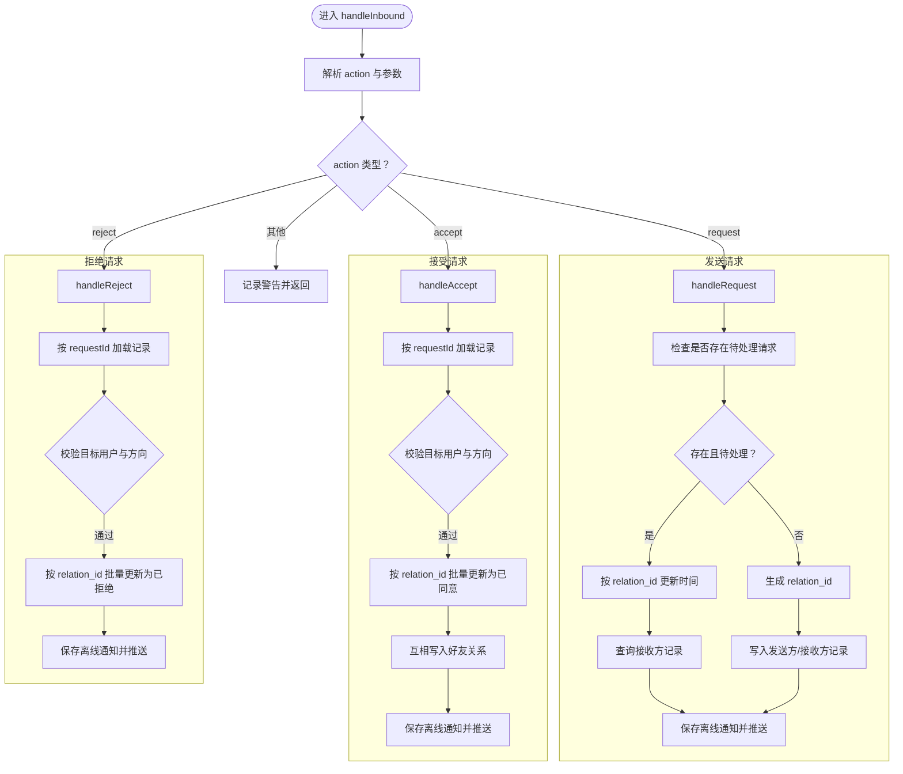
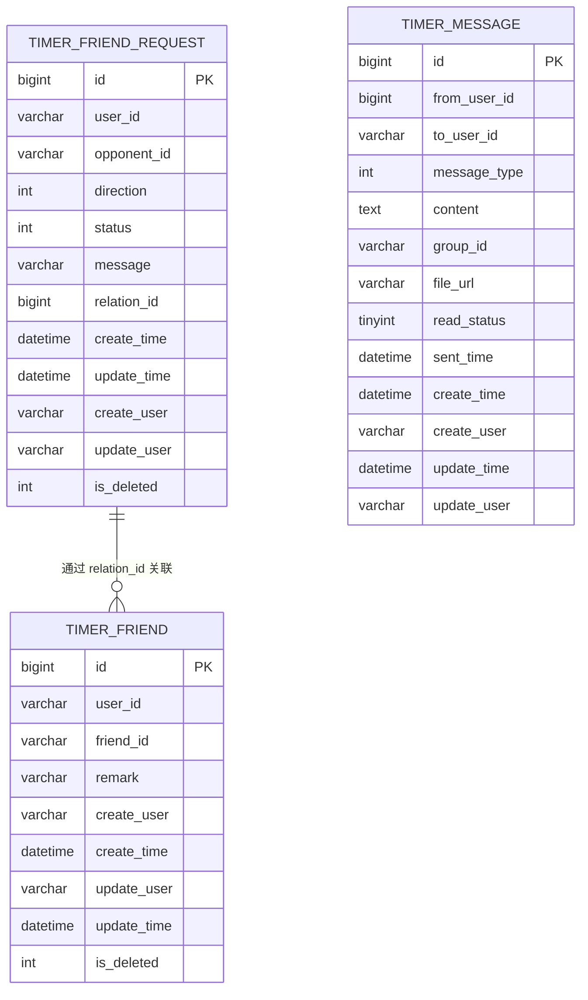
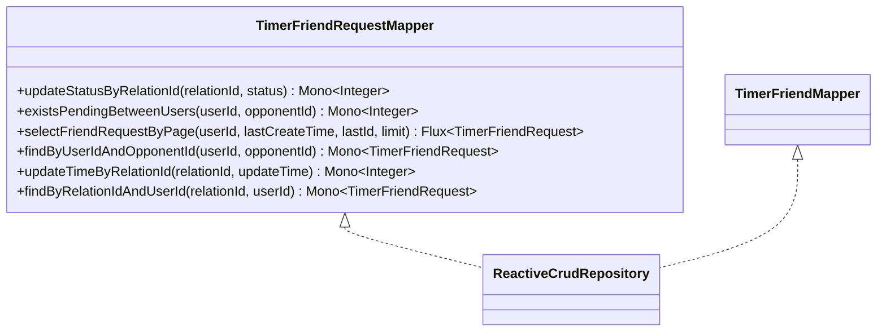
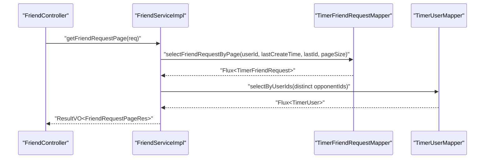
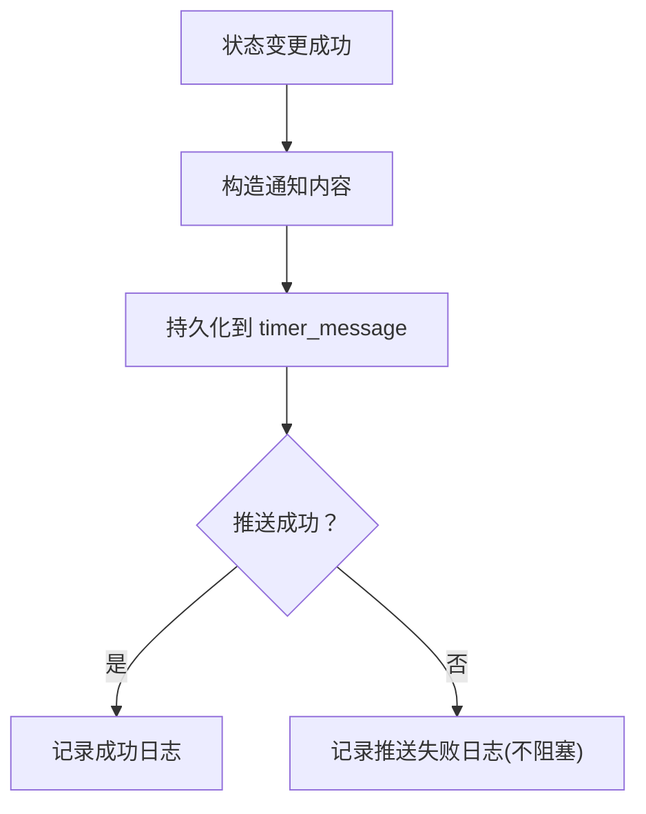
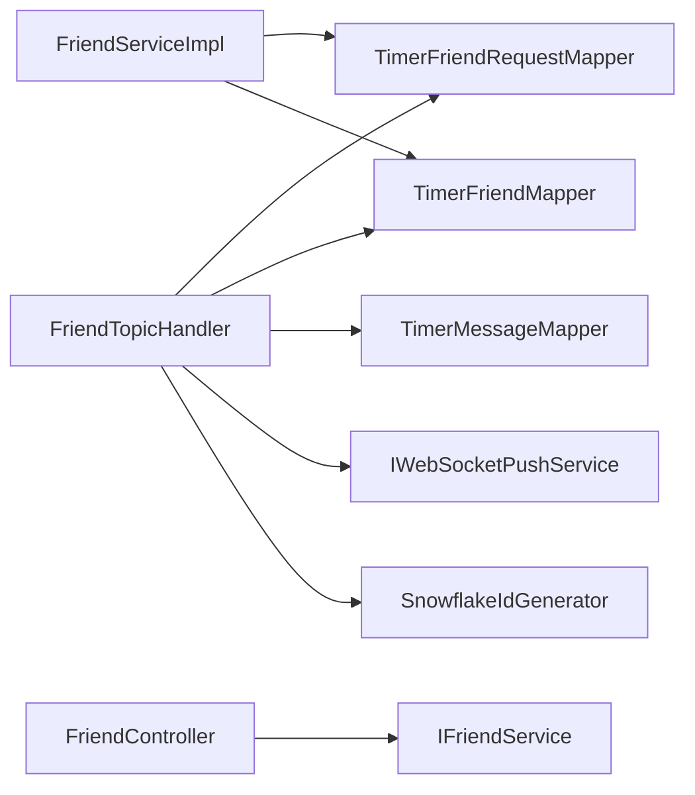

# 好友消息处理器

<cite>
**本文引用的文件**
- [FriendTopicHandler.java](file://src/main/java/com/rivers/im/router/FriendTopicHandler.java)
- [FriendServiceImpl.java](file://src/main/java/com/rivers/im/service/impl/FriendServiceImpl.java)
- [IFriendService.java](file://src/main/java/com/rivers/im/service/IFriendService.java)
- [TimerFriendRequestMapper.java](file://src/main/java/com/rivers/im/mapper/TimerFriendRequestMapper.java)
- [TimerFriendMapper.java](file://src/main/java/com/rivers/im/mapper/TimerFriendMapper.java)
- [TimerFriend.java](file://src/main/java/com/rivers/im/entity/TimerFriend.java)
- [TimerFriendRequest.java](file://src/main/java/com/rivers/im/entity/TimerFriendRequest.java)
- [TimerMessage.java](file://src/main/java/com/rivers/im/entity/TimerMessage.java)
- [IWebSocketPushService.java](file://src/main/java/com/rivers/im/service/IWebSocketPushService.java)
- [SnowflakeIdGenerator.java](file://src/main/java/com/rivers/im/util/SnowflakeIdGenerator.java)
- [FriendController.java](file://src/main/java/com/rivers/im/controller/FriendController.java)
- [application.yml](file://src/main/resources/application.yml)
</cite>

## 目录
1. [简介](#简介)
2. [项目结构](#项目结构)
3. [核心组件](#核心组件)
4. [架构总览](#架构总览)
5. [详细组件分析](#详细组件分析)
6. [依赖关系分析](#依赖关系分析)
7. [性能与扩展性](#性能与扩展性)
8. [故障排查指南](#故障排查指南)
9. [结论](#结论)

## 简介
本技术文档围绕“好友消息处理器”展开，重点解析 FriendTopicHandler 的实现原理，涵盖好友请求的发送、接受与拒绝流程；深入剖析好友关系变更的实时通知机制（状态同步与冲突处理）、好友列表的动态更新策略与数据一致性保障；并总结安全性保障（权限校验与防刷思路）、性能优化与扩展性设计建议。文档以代码级分析为基础，辅以可视化图示，帮助读者快速理解系统行为与关键路径。

## 项目结构
IM 服务采用分层架构：路由层负责消息主题分发，业务层封装领域逻辑，持久层使用响应式 R2DBC 访问数据库，消息推送通过 WebSocket 服务完成。与好友相关的关键模块如下：
- 路由层：FriendTopicHandler（处理好友主题消息）
- 服务层：FriendServiceImpl（提供好友请求分页查询等能力）
- 控制器层：FriendController（对外暴露 REST 接口）
- 数据访问层：TimerFriendRequestMapper、TimerFriendMapper
- 实体层：TimerFriend、TimerFriendRequest、TimerMessage
- 推送层：IWebSocketPushService
- 工具层：SnowflakeIdGenerator（全局唯一 ID 生成）

图表来源
- [FriendTopicHandler.java:24-51](file://src/main/java/com/rivers/im/router/FriendTopicHandler.java#L24-L51)
- [FriendServiceImpl.java:30-43](file://src/main/java/com/rivers/im/service/impl/FriendServiceImpl.java#L30-L43)
- [FriendController.java:13-26](file://src/main/java/com/rivers/im/controller/FriendController.java#L13-L26)
- [TimerFriendRequestMapper.java:12-67](file://src/main/java/com/rivers/im/mapper/TimerFriendRequestMapper.java#L12-L67)
- [TimerFriendMapper.java:6-7](file://src/main/java/com/rivers/im/mapper/TimerFriendMapper.java#L6-L7)
- [TimerFriend.java:28-85](file://src/main/java/com/rivers/im/entity/TimerFriend.java#L28-L85)
- [TimerFriendRequest.java:14-100](file://src/main/java/com/rivers/im/entity/TimerFriendRequest.java#L14-L100)
- [TimerMessage.java:24-104](file://src/main/java/com/rivers/im/entity/TimerMessage.java#L24-L104)
- [IWebSocketPushService.java:6-11](file://src/main/java/com/rivers/im/service/IWebSocketPushService.java#L6-L11)
- [SnowflakeIdGenerator.java:7-39](file://src/main/java/com/rivers/im/util/SnowflakeIdGenerator.java#L7-L39)

章节来源
- [application.yml:1-14](file://src/main/resources/application.yml#L1-L14)

## 核心组件
- FriendTopicHandler：实现好友主题的消息入口，负责解析 action（request/accept/reject），执行相应业务，并进行离线消息持久化与实时推送。
- FriendServiceImpl：提供好友请求分页查询能力，组装返回结果。
- TimerFriendRequestMapper/TimerFriendMapper：基于 R2DBC 的响应式数据访问接口，支持按 relation_id 批量更新状态、分页查询等。
- IWebSocketPushService：抽象的 WebSocket 推送接口，用于向指定用户推送通知。
- SnowflakeIdGenerator：分布式 ID 生成器，用于生成 relation_id，确保跨节点唯一性。

章节来源
- [FriendTopicHandler.java:24-51](file://src/main/java/com/rivers/im/router/FriendTopicHandler.java#L24-L51)
- [FriendServiceImpl.java:30-43](file://src/main/java/com/rivers/im/service/impl/FriendServiceImpl.java#L30-L43)
- [TimerFriendRequestMapper.java:12-67](file://src/main/java/com/rivers/im/mapper/TimerFriendRequestMapper.java#L12-L67)
- [TimerFriendMapper.java:6-7](file://src/main/java/com/rivers/im/mapper/TimerFriendMapper.java#L6-L7)
- [IWebSocketPushService.java:6-11](file://src/main/java/com/rivers/im/service/IWebSocketPushService.java#L6-L11)
- [SnowflakeIdGenerator.java:7-39](file://src/main/java/com/rivers/im/util/SnowflakeIdGenerator.java#L7-L39)

## 架构总览
下图展示好友主题消息从接入到落库与推送的整体流程，以及各组件之间的调用关系。

图表来源
- [FriendTopicHandler.java:59-220](file://src/main/java/com/rivers/im/router/FriendTopicHandler.java#L59-L220)
- [TimerFriendRequestMapper.java:17-19](file://src/main/java/com/rivers/im/mapper/TimerFriendRequestMapper.java#L17-L19)
- [TimerFriendMapper.java:6-7](file://src/main/java/com/rivers/im/mapper/TimerFriendMapper.java#L6-L7)
- [TimerMessage.java:24-104](file://src/main/java/com/rivers/im/entity/TimerMessage.java#L24-L104)
- [IWebSocketPushService.java:10-11](file://src/main/java/com/rivers/im/service/IWebSocketPushService.java#L10-L11)

## 详细组件分析

### FriendTopicHandler：好友主题处理器
FriendTopicHandler 是好友消息的统一入口，负责：
- 主题识别：固定主题名为 friend
- 动作分发：根据 action 分派到 request/accept/reject
- 幂等与冲突控制：通过 relation_id 与状态枚举避免重复处理
- 状态同步：写扩散模型，同时维护发送方与接收方两条记录
- 实时通知：best-effort 的离线消息持久化与 WebSocket 推送

关键实现要点
- 发送请求（write-through + 写扩散）：若已存在待处理请求则仅刷新时间并推送；否则生成 relation_id，分别写入发送方与接收方记录，随后持久化离线通知并尝试实时推送。
- 接受请求：校验目标用户与方向，按 relation_id 批量更新状态为已同意，再互相写入好友关系，最后推送通知。
- 拒绝请求：校验目标用户与方向，按 relation_id 批量更新状态为已拒绝，最后推送通知。
- 离线通知与推送：saveAndPush 组合保存与推送，失败仅记录日志，不阻塞主流程。

图表来源
- [FriendTopicHandler.java:59-220](file://src/main/java/com/rivers/im/router/FriendTopicHandler.java#L59-L220)

章节来源
- [FriendTopicHandler.java:24-51](file://src/main/java/com/rivers/im/router/FriendTopicHandler.java#L24-L51)
- [FriendTopicHandler.java:59-136](file://src/main/java/com/rivers/im/router/FriendTopicHandler.java#L59-L136)
- [FriendTopicHandler.java:137-185](file://src/main/java/com/rivers/im/router/FriendTopicHandler.java#L137-L185)
- [FriendTopicHandler.java:186-220](file://src/main/java/com/rivers/im/router/FriendTopicHandler.java#L186-L220)
- [FriendTopicHandler.java:222-274](file://src/main/java/com/rivers/im/router/FriendTopicHandler.java#L222-L274)

### 数据模型与映射
- TimerFriendRequest：好友请求记录，含用户、对方、方向、状态、relation_id、时间戳等字段；提供状态与方向枚举。
- TimerFriend：好友关系记录，含用户与好友 ID。
- TimerMessage：系统通知消息载体，用于离线存储与推送。

图表来源
- [TimerFriendRequest.java:14-100](file://src/main/java/com/rivers/im/entity/TimerFriendRequest.java#L14-L100)
- [TimerFriend.java:28-85](file://src/main/java/com/rivers/im/entity/TimerFriend.java#L28-L85)
- [TimerMessage.java:24-104](file://src/main/java/com/rivers/im/entity/TimerMessage.java#L24-L104)

章节来源
- [TimerFriendRequest.java:14-100](file://src/main/java/com/rivers/im/entity/TimerFriendRequest.java#L14-L100)
- [TimerFriend.java:28-85](file://src/main/java/com/rivers/im/entity/TimerFriend.java#L28-L85)
- [TimerMessage.java:24-104](file://src/main/java/com/rivers/im/entity/TimerMessage.java#L24-L104)

### 数据访问层：响应式 R2DBC
- TimerFriendRequestMapper：提供按 relation_id 批量更新状态、按 relation_id 更新时间、按用户与对方查询待处理请求、分页查询等方法。
- TimerFriendMapper：继承 ReactiveCrudRepository，提供基础增删改查能力。

图表来源
- [TimerFriendRequestMapper.java:12-67](file://src/main/java/com/rivers/im/mapper/TimerFriendRequestMapper.java#L12-L67)
- [TimerFriendMapper.java:6-7](file://src/main/java/com/rivers/im/mapper/TimerFriendMapper.java#L6-L7)

章节来源
- [TimerFriendRequestMapper.java:12-67](file://src/main/java/com/rivers/im/mapper/TimerFriendRequestMapper.java#L12-L67)
- [TimerFriendMapper.java:6-7](file://src/main/java/com/rivers/im/mapper/TimerFriendMapper.java#L6-L7)

### 服务层：好友请求分页查询
FriendServiceImpl 提供好友请求分页查询能力，支持按时间与 ID 进行游标翻页，聚合用户信息并返回结构化结果。

图表来源
- [FriendController.java:23-26](file://src/main/java/com/rivers/im/controller/FriendController.java#L23-L26)
- [FriendServiceImpl.java:46-104](file://src/main/java/com/rivers/im/service/impl/FriendServiceImpl.java#L46-L104)

章节来源
- [FriendServiceImpl.java:30-43](file://src/main/java/com/rivers/im/service/impl/FriendServiceImpl.java#L30-L43)
- [FriendServiceImpl.java:46-104](file://src/main/java/com/rivers/im/service/impl/FriendServiceImpl.java#L46-L104)
- [FriendController.java:13-26](file://src/main/java/com/rivers/im/controller/FriendController.java#L13-L26)

### 实时通知与离线消息
FriendTopicHandler 在每次状态变更后，都会执行“保存离线通知 + 尝试实时推送”的组合流程。该流程采用 best-effort 策略：即使推送失败也仅记录日志，确保主流程不受影响。

图表来源
- [FriendTopicHandler.java:222-274](file://src/main/java/com/rivers/im/router/FriendTopicHandler.java#L222-L274)
- [TimerMessage.java:24-104](file://src/main/java/com/rivers/im/entity/TimerMessage.java#L24-L104)
- [IWebSocketPushService.java:10-11](file://src/main/java/com/rivers/im/service/IWebSocketPushService.java#L10-L11)

章节来源
- [FriendTopicHandler.java:222-274](file://src/main/java/com/rivers/im/router/FriendTopicHandler.java#L222-L274)

### 安全性与防刷
- 权限校验：在“接受/拒绝”流程中，严格校验当前用户是否为目标用户、请求方向是否为“收到的”，防止越权操作。
- 幂等与去重：通过 relation_id 与状态枚举避免重复处理；发送请求时若存在待处理请求则仅刷新时间，减少冗余写入。
- 参数校验：对目标用户 ID、自身 ID、action 等进行前置校验，非法输入直接记录警告并返回空结果。

章节来源
- [FriendTopicHandler.java:80-136](file://src/main/java/com/rivers/im/router/FriendTopicHandler.java#L80-L136)
- [FriendTopicHandler.java:137-185](file://src/main/java/com/rivers/im/router/FriendTopicHandler.java#L137-L185)
- [FriendTopicHandler.java:186-220](file://src/main/java/com/rivers/im/router/FriendTopicHandler.java#L186-L220)

## 依赖关系分析
- 组件耦合：FriendTopicHandler 依赖 Mapper 与推送服务，职责清晰；FriendServiceImpl 依赖 Mapper 与用户映射，便于扩展。
- 外部依赖：R2DBC 访问数据库；WebSocket 推送服务；Snowflake ID 生成器。
- 循环依赖：未发现循环依赖迹象。

图表来源
- [FriendTopicHandler.java:32-50](file://src/main/java/com/rivers/im/router/FriendTopicHandler.java#L32-L50)
- [FriendServiceImpl.java:32-42](file://src/main/java/com/rivers/im/service/impl/FriendServiceImpl.java#L32-L42)
- [FriendController.java:17-21](file://src/main/java/com/rivers/im/controller/FriendController.java#L17-L21)

章节来源
- [FriendTopicHandler.java:32-50](file://src/main/java/com/rivers/im/router/FriendTopicHandler.java#L32-L50)
- [FriendServiceImpl.java:32-42](file://src/main/java/com/rivers/im/service/impl/FriendServiceImpl.java#L32-L42)
- [FriendController.java:17-21](file://src/main/java/com/rivers/im/controller/FriendController.java#L17-L21)

## 性能与扩展性
- 写扩散模型：发送请求时同时写入发送方与接收方记录，配合 relation_id 批量更新，降低后续查询与状态同步成本。
- 批量更新：通过 relation_id 批量更新状态，减少多次往返与锁竞争。
- 最佳努力推送：离线消息持久化与实时推送分离，提升吞吐与可用性。
- 分页查询：基于时间与 ID 的游标分页，适合高并发场景下的增量拉取。
- 扩展建议：
  - 引入缓存：对常用用户信息与好友列表做 LRU 缓存，降低数据库压力。
  - 限流与熔断：在高频操作（如批量接受/拒绝）处增加限流与熔断策略。
  - 消息队列：将通知异步化，进一步削峰填谷。
  - 增加索引：为 relation_id、user_id/opponent_id/status 等建立复合索引，优化查询与更新性能。

[本节为通用性能讨论，不直接分析具体文件]

## 故障排查指南
- 常见问题定位
  - 未知 action：记录警告日志，确认客户端 payload 的 action 字段是否正确。
  - 缺少参数：如 requestId 或目标用户 ID，记录警告并返回空结果。
  - 非目标用户操作：接受/拒绝时校验失败会记录警告，需检查鉴权上下文。
  - 推送失败：实时推送失败仅记录日志，可通过离线消息兜底；检查推送服务可用性与用户在线状态。
- 日志与可观测性
  - 使用 INFO/WARN/ERROR 等不同级别输出关键事件，便于定位问题。
  - 对异常进行 onErrorResume 并记录错误堆栈，避免中断主流程。

章节来源
- [FriendTopicHandler.java:65-68](file://src/main/java/com/rivers/im/router/FriendTopicHandler.java#L65-L68)
- [FriendTopicHandler.java:82-89](file://src/main/java/com/rivers/im/router/FriendTopicHandler.java#L82-L89)
- [FriendTopicHandler.java:143-159](file://src/main/java/com/rivers/im/router/FriendTopicHandler.java#L143-L159)
- [FriendTopicHandler.java:268-273](file://src/main/java/com/rivers/im/router/FriendTopicHandler.java#L268-L273)

## 结论
FriendTopicHandler 通过写扩散模型与 relation_id 批量更新，实现了好友请求发送、接受、拒绝的高效与一致；结合离线消息持久化与 best-effort 实时推送，保障了用户体验与可靠性。服务层与数据访问层的清晰分层，为后续扩展与优化提供了良好基础。建议在生产环境中引入缓存、限流与异步化策略，持续提升系统的吞吐与稳定性。