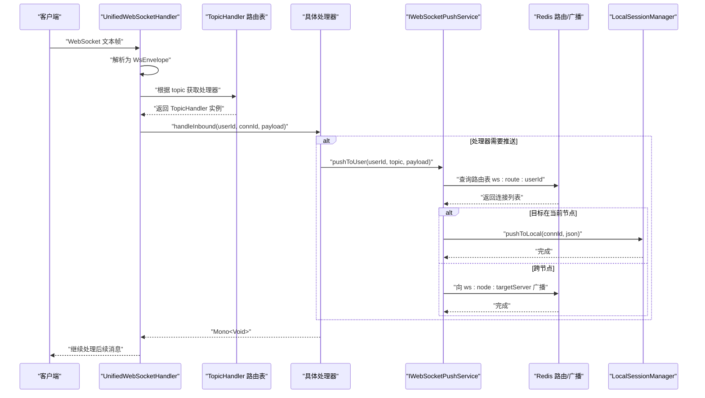
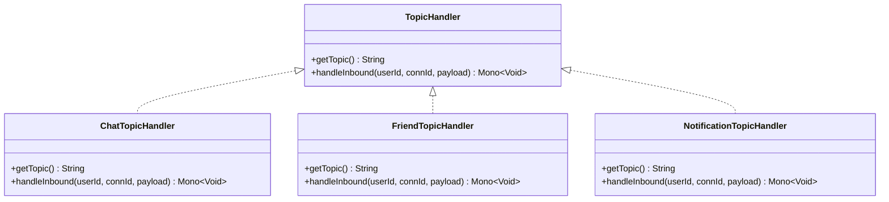
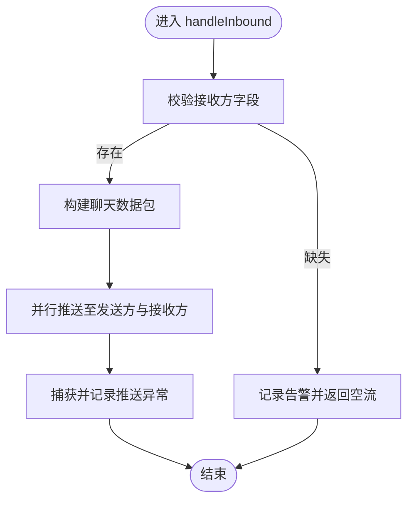
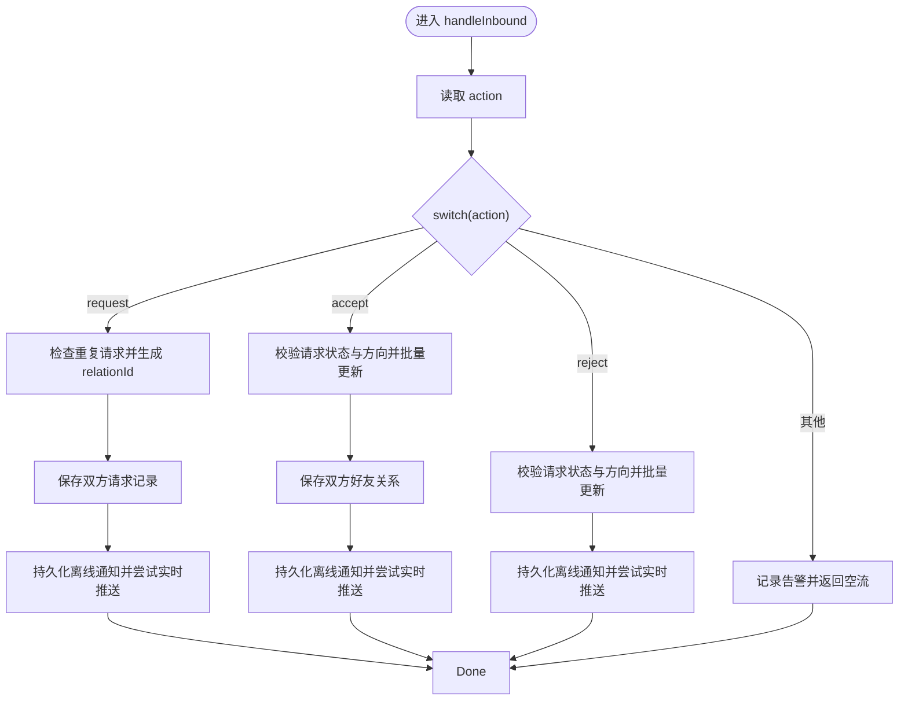
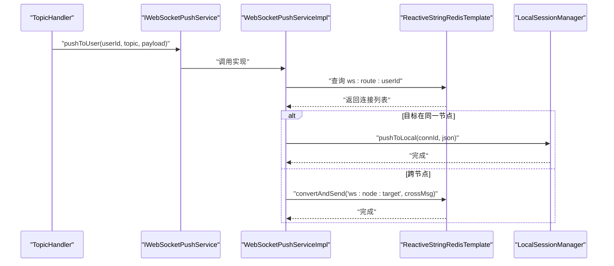
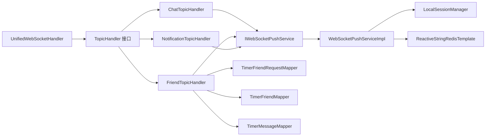

# 消息路由系统

<cite>
**本文档引用的文件**
- [TopicHandler.java](file://src/main/java/com/rivers/im/router/TopicHandler.java)
- [ChatTopicHandler.java](file://src/main/java/com/rivers/im/router/ChatTopicHandler.java)
- [FriendTopicHandler.java](file://src/main/java/com/rivers/im/router/FriendTopicHandler.java)
- [NotificationTopicHandler.java](file://src/main/java/com/rivers/im/router/NotificationTopicHandler.java)
- [IWebSocketPushService.java](file://src/main/java/com/rivers/im/service/IWebSocketPushService.java)
- [WebSocketPushServiceImpl.java](file://src/main/java/com/rivers/im/service/impl/WebSocketPushServiceImpl.java)
- [UnifiedWebSocketHandler.java](file://src/main/java/com/rivers/im/config/UnifiedWebSocketHandler.java)
- [WebSocketConfig.java](file://src/main/java/com/rivers/im/config/WebSocketConfig.java)
- [ConnectionContext.java](file://src/main/java/com/rivers/im/context/ConnectionContext.java)
- [LocalSessionManager.java](file://src/main/java/com/rivers/im/manage/LocalSessionManager.java)
- [WsEnvelope.java](file://src/main/java/com/rivers/im/record/WsEnvelope.java)
- [TimerFriendRequestMapper.java](file://src/main/java/com/rivers/im/mapper/TimerFriendRequestMapper.java)
- [TimerFriendMapper.java](file://src/main/java/com/rivers/im/mapper/TimerFriendMapper.java)
- [TimerMessageMapper.java](file://src/main/java/com/rivers/im/mapper/TimerMessageMapper.java)
- [TimerFriendRequest.java](file://src/main/java/com/rivers/im/entity/TimerFriendRequest.java)
- [TimerFriend.java](file://src/main/java/com/rivers/im/entity/TimerFriend.java)
- [application.yml](file://src/main/resources/application.yml)
</cite>

## 目录
1. [简介](#简介)
2. [项目结构](#项目结构)
3. [核心组件](#核心组件)
4. [架构总览](#架构总览)
5. [详细组件分析](#详细组件分析)
6. [依赖分析](#依赖分析)
7. [性能考虑](#性能考虑)
8. [故障排查指南](#故障排查指南)
9. [结论](#结论)
10. [附录](#附录)

## 简介
本技术文档围绕消息路由系统展开，重点阐释 TopicHandler 接口的设计模式与扩展机制，涵盖消息类型识别、路由策略与处理器选择；深入分析三类主题处理器：ChatTopicHandler 的聊天消息处理、FriendTopicHandler 的好友相关消息处理、NotificationTopicHandler 的通知消息处理；同时阐述消息路由的优先级机制、错误处理策略与性能优化方案，并提供自定义主题处理器的开发指南与最佳实践。

## 项目结构
消息路由系统采用分层与职责分离的设计：
- 路由层：统一 WebSocket 入口与消息分发，负责将消息按 topic 分派给对应处理器
- 处理器层：基于 TopicHandler 接口的多实现，分别处理不同业务域的消息
- 服务层：推送服务与会话管理，负责跨节点消息转发与本地消息投递
- 数据访问层：R2DBC 映射器，支撑好友关系与离线通知等持久化需求
- 配置层：WebSocket 路由与握手配置，确保处理器被正确注入与使用

```mermaid
graph TB
subgraph "配置层"
WSConfig["WebSocketConfig<br/>URL映射与握手适配"]
UWH["UnifiedWebSocketHandler<br/>统一WS处理器"]
end
subgraph "路由层"
TH["TopicHandler 接口"]
CTH["ChatTopicHandler"]
FTH["FriendTopicHandler"]
NTH["NotificationTopicHandler"]
end
subgraph "服务层"
IWP["IWebSocketPushService 接口"]
WP["WebSocketPushServiceImpl<br/>推送实现"]
LSM["LocalSessionManager<br/>本地会话管理"]
end
subgraph "数据层"
TFRM["TimerFriendRequestMapper"]
TFM["TimerFriendMapper"]
TMM["TimerMessageMapper"]
end
WSConfig --> UWH
UWH --> TH
TH --> CTH
TH --> FTH
TH --> NTH
CTH --> IWP
FTH --> IWP
NTH --> IWP
IWP --> WP
WP --> LSM
FTH --> TFRM
FTH --> TFM
FTH --> TMM
```

图表来源
- [WebSocketConfig.java:1-35](file://src/main/java/com/rivers/im/config/WebSocketConfig.java#L1-L35)
- [UnifiedWebSocketHandler.java:38-181](file://src/main/java/com/rivers/im/config/UnifiedWebSocketHandler.java#L38-L181)
- [TopicHandler.java:8-13](file://src/main/java/com/rivers/im/router/TopicHandler.java#L8-L13)
- [ChatTopicHandler.java:14-51](file://src/main/java/com/rivers/im/router/ChatTopicHandler.java#L14-L51)
- [FriendTopicHandler.java:24-261](file://src/main/java/com/rivers/im/router/FriendTopicHandler.java#L24-L261)
- [NotificationTopicHandler.java:12-27](file://src/main/java/com/rivers/im/router/NotificationTopicHandler.java#L12-L27)
- [IWebSocketPushService.java:6-11](file://src/main/java/com/rivers/im/service/IWebSocketPushService.java#L6-L11)
- [WebSocketPushServiceImpl.java:20-90](file://src/main/java/com/rivers/im/service/impl/WebSocketPushServiceImpl.java#L20-L90)
- [LocalSessionManager.java:12-43](file://src/main/java/com/rivers/im/manage/LocalSessionManager.java#L12-L43)
- [TimerFriendRequestMapper.java:12-45](file://src/main/java/com/rivers/im/mapper/TimerFriendRequestMapper.java#L12-L45)
- [TimerFriendMapper.java:1-7](file://src/main/java/com/rivers/im/mapper/TimerFriendMapper.java#L1-L7)
- [TimerMessageMapper.java:1-7](file://src/main/java/com/rivers/im/mapper/TimerMessageMapper.java#L1-L7)

章节来源
- [WebSocketConfig.java:1-35](file://src/main/java/com/rivers/im/config/WebSocketConfig.java#L1-L35)
- [UnifiedWebSocketHandler.java:38-181](file://src/main/java/com/rivers/im/config/UnifiedWebSocketHandler.java#L38-L181)

## 核心组件
- TopicHandler 接口：定义统一的路由入口，包含获取 topic 名称与处理入站消息的方法
- 处理器实现：ChatTopicHandler、FriendTopicHandler、NotificationTopicHandler 分别处理聊天、好友与通知相关消息
- 推送服务：IWebSocketPushService 与 WebSocketPushServiceImpl 提供跨节点与本地消息投递能力
- 会话上下文：ConnectionContext 与 LocalSessionManager 管理连接生命周期与消息出站
- 统一处理器：UnifiedWebSocketHandler 负责消息解析、路由与错误恢复

章节来源
- [TopicHandler.java:8-13](file://src/main/java/com/rivers/im/router/TopicHandler.java#L8-L13)
- [ChatTopicHandler.java:14-51](file://src/main/java/com/rivers/im/router/ChatTopicHandler.java#L14-L51)
- [FriendTopicHandler.java:24-261](file://src/main/java/com/rivers/im/router/FriendTopicHandler.java#L24-L261)
- [NotificationTopicHandler.java:12-27](file://src/main/java/com/rivers/im/router/NotificationTopicHandler.java#L12-L27)
- [IWebSocketPushService.java:6-11](file://src/main/java/com/rivers/im/service/IWebSocketPushService.java#L6-L11)
- [WebSocketPushServiceImpl.java:20-90](file://src/main/java/com/rivers/im/service/impl/WebSocketPushServiceImpl.java#L20-L90)
- [ConnectionContext.java:8-24](file://src/main/java/com/rivers/im/context/ConnectionContext.java#L8-L24)
- [LocalSessionManager.java:12-43](file://src/main/java/com/rivers/im/manage/LocalSessionManager.java#L12-L43)
- [UnifiedWebSocketHandler.java:38-181](file://src/main/java/com/rivers/im/config/UnifiedWebSocketHandler.java#L38-L181)

## 架构总览
消息从客户端进入统一 WebSocket 处理器，解析为封装消息体后按 topic 查找对应处理器执行。处理器内部可能调用推送服务进行实时投递，或持久化离线通知以保障可靠性。

图表来源
- [UnifiedWebSocketHandler.java:124-138](file://src/main/java/com/rivers/im/config/UnifiedWebSocketHandler.java#L124-L138)
- [WsEnvelope.java:5-9](file://src/main/java/com/rivers/im/record/WsEnvelope.java#L5-L9)
- [IWebSocketPushService.java:10](file://src/main/java/com/rivers/im/service/IWebSocketPushService.java#L10)
- [WebSocketPushServiceImpl.java:44-88](file://src/main/java/com/rivers/im/service/impl/WebSocketPushServiceImpl.java#L44-L88)
- [LocalSessionManager.java:35-42](file://src/main/java/com/rivers/im/manage/LocalSessionManager.java#L35-L42)

## 详细组件分析

### TopicHandler 接口与扩展机制
- 设计模式：策略接口 + 多实现，便于按 topic 动态扩展新处理器
- 扩展步骤：
  1) 实现 TopicHandler 接口，提供唯一的 topic 名称与处理逻辑
  2) 在 Spring 容器中声明为组件，自动被统一处理器收集并注册
  3) 客户端发送消息时携带该 topic，即可触发对应处理器
- 优点：解耦消息类型与处理逻辑，支持热插拔式扩展

图表来源
- [TopicHandler.java:8-13](file://src/main/java/com/rivers/im/router/TopicHandler.java#L8-L13)
- [ChatTopicHandler.java:14-51](file://src/main/java/com/rivers/im/router/ChatTopicHandler.java#L14-L51)
- [FriendTopicHandler.java:24-261](file://src/main/java/com/rivers/im/router/FriendTopicHandler.java#L24-L261)
- [NotificationTopicHandler.java:12-27](file://src/main/java/com/rivers/im/router/NotificationTopicHandler.java#L12-L27)

章节来源
- [TopicHandler.java:8-13](file://src/main/java/com/rivers/im/router/TopicHandler.java#L8-L13)
- [UnifiedWebSocketHandler.java:50-65](file://src/main/java/com/rivers/im/config/UnifiedWebSocketHandler.java#L50-L65)

### ChatTopicHandler：聊天消息处理
- 消息类型识别：topic 固定为 "chat"
- 路由策略：从 payload 中提取接收方与内容，构造标准聊天数据包
- 处理流程：
  1) 校验接收方字段，缺失则记录告警并丢弃
  2) 构造包含发送方、接收方、内容与时间戳的数据对象
  3) 并行推送至发送方与接收方，失败时记录错误但不中断整体流程
- 错误处理：对推送失败进行日志记录与忽略，保证消息处理的幂等性
- 性能优化：使用并行推送减少往返延迟

图表来源
- [ChatTopicHandler.java:31-49](file://src/main/java/com/rivers/im/router/ChatTopicHandler.java#L31-L49)

章节来源
- [ChatTopicHandler.java:14-51](file://src/main/java/com/rivers/im/router/ChatTopicHandler.java#L14-L51)

### FriendTopicHandler：好友相关消息处理
- 消息类型识别：topic 固定为 "friend"，通过 action 字段区分子操作
- 路由策略：根据 action 分发到 request/accept/reject 三个分支
- 处理流程：
  - request：写扩散模型，为发送方与接收方各创建一条记录，使用 relation_id 关联，批量更新状态以保持一致性
  - accept/reject：通过 relation_id 批量更新双向记录状态，完成后持久化离线通知并尝试实时推送
- 离线通知与实时推送：saveAndPush 组合持久化与推送，采用“尽力而为”的策略，失败仅记录日志
- 错误处理：所有数据库与推送异常均被捕获并转换为空流，避免阻断主流程
- 性能优化：批量更新、并行推送、Redis 路由查询与心跳续期

图表来源
- [FriendTopicHandler.java:59-70](file://src/main/java/com/rivers/im/router/FriendTopicHandler.java#L59-L70)
- [FriendTopicHandler.java:76-121](file://src/main/java/com/rivers/im/router/FriendTopicHandler.java#L76-L121)
- [FriendTopicHandler.java:126-170](file://src/main/java/com/rivers/im/router/FriendTopicHandler.java#L126-L170)
- [FriendTopicHandler.java:175-205](file://src/main/java/com/rivers/im/router/FriendTopicHandler.java#L175-L205)
- [FriendTopicHandler.java:210-259](file://src/main/java/com/rivers/im/router/FriendTopicHandler.java#L210-L259)

章节来源
- [FriendTopicHandler.java:24-261](file://src/main/java/com/rivers/im/router/FriendTopicHandler.java#L24-L261)
- [TimerFriendRequestMapper.java:12-45](file://src/main/java/com/rivers/im/mapper/TimerFriendRequestMapper.java#L12-L45)
- [TimerFriendMapper.java:1-7](file://src/main/java/com/rivers/im/mapper/TimerFriendMapper.java#L1-7)
- [TimerMessageMapper.java:1-7](file://src/main/java/com/rivers/im/mapper/TimerMessageMapper.java#L1-7)

### NotificationTopicHandler：通知消息处理
- 消息类型识别：topic 固定为 "notification"
- 路由策略：根据 action 字段执行相应动作（如 read）
- 处理流程：简单记录日志，用于标记通知已读等场景
- 错误处理：无外部副作用，异常会被统一捕获并忽略

章节来源
- [NotificationTopicHandler.java:12-27](file://src/main/java/com/rivers/im/router/NotificationTopicHandler.java#L12-L27)

### 推送与会话管理
- IWebSocketPushService：抽象推送接口，提供创建对象节点与按用户推送的能力
- WebSocketPushServiceImpl：实现跨节点与本地推送
  - 本地推送：直接写入本地会话管理器
  - 跨节点推送：通过 Redis 广播到目标节点，目标节点再投递到本地会话
- LocalSessionManager：维护连接上下文，提供线程安全的本地推送与连接生命周期管理

图表来源
- [IWebSocketPushService.java:6-11](file://src/main/java/com/rivers/im/service/IWebSocketPushService.java#L6-L11)
- [WebSocketPushServiceImpl.java:44-88](file://src/main/java/com/rivers/im/service/impl/WebSocketPushServiceImpl.java#L44-L88)
- [LocalSessionManager.java:35-42](file://src/main/java/com/rivers/im/manage/LocalSessionManager.java#L35-L42)

章节来源
- [IWebSocketPushService.java:6-11](file://src/main/java/com/rivers/im/service/IWebSocketPushService.java#L6-L11)
- [WebSocketPushServiceImpl.java:20-90](file://src/main/java/com/rivers/im/service/impl/WebSocketPushServiceImpl.java#L20-L90)
- [LocalSessionManager.java:12-43](file://src/main/java/com/rivers/im/manage/LocalSessionManager.java#L12-L43)

### 统一 WebSocket 处理器
- 负责建立连接、提取用户标识、注册路由、心跳续期与清理资源
- 解析消息为 WsEnvelope，按 topic 查找处理器并执行
- 对未知 topic 与解析异常进行告警并忽略，保证鲁棒性

章节来源
- [UnifiedWebSocketHandler.java:87-122](file://src/main/java/com/rivers/im/config/UnifiedWebSocketHandler.java#L87-L122)
- [UnifiedWebSocketHandler.java:124-138](file://src/main/java/com/rivers/im/config/UnifiedWebSocketHandler.java#L124-L138)
- [ConnectionContext.java:8-24](file://src/main/java/com/rivers/im/context/ConnectionContext.java#L8-L24)
- [WsEnvelope.java:5-9](file://src/main/java/com/rivers/im/record/WsEnvelope.java#L5-L9)

## 依赖分析
- 组件耦合度：处理器通过接口与推送服务交互，耦合度低；统一处理器通过接口聚合多个处理器，具备良好扩展性
- 外部依赖：Redis 用于路由注册、心跳续期与跨节点广播；R2DBC 映射器用于好友与通知数据持久化
- 循环依赖：配置层仅依赖处理器与握手服务，避免循环引用

图表来源
- [UnifiedWebSocketHandler.java:50-65](file://src/main/java/com/rivers/im/config/UnifiedWebSocketHandler.java#L50-L65)
- [ChatTopicHandler.java:17](file://src/main/java/com/rivers/im/router/ChatTopicHandler.java#L17)
- [FriendTopicHandler.java:32-37](file://src/main/java/com/rivers/im/router/FriendTopicHandler.java#L32-L51)
- [NotificationTopicHandler.java:12](file://src/main/java/com/rivers/im/router/NotificationTopicHandler.java#L12)
- [WebSocketPushServiceImpl.java:22-37](file://src/main/java/com/rivers/im/service/impl/WebSocketPushServiceImpl.java#L22-L37)
- [LocalSessionManager.java:14-15](file://src/main/java/com/rivers/im/manage/LocalSessionManager.java#L14-L15)
- [TimerFriendRequestMapper.java:12](file://src/main/java/com/rivers/im/mapper/TimerFriendRequestMapper.java#L12)
- [TimerFriendMapper.java:1](file://src/main/java/com/rivers/im/mapper/TimerFriendMapper.java#L1)
- [TimerMessageMapper.java:1](file://src/main/java/com/rivers/im/mapper/TimerMessageMapper.java#L1)

章节来源
- [WebSocketConfig.java:13-35](file://src/main/java/com/rivers/im/config/WebSocketConfig.java#L13-L35)
- [application.yml:13-14](file://src/main/resources/application.yml#L13-L14)

## 性能考虑
- 并行处理：聊天处理器对发送方与接收方并行推送，降低端到端延迟
- 最大努力投递：好友处理器在推送失败时仅记录日志，避免阻塞主流程
- Redis 路由与心跳：通过哈希表维护用户到连接的映射，并定期续期，提升可用性
- 背压与缓冲：连接上下文使用带缓冲的多播 sink，保证高并发下的稳定性
- 批量更新：好友请求的接受/拒绝通过 relation_id 批量更新，减少数据库往返

章节来源
- [ChatTopicHandler.java:45-48](file://src/main/java/com/rivers/im/router/ChatTopicHandler.java#L45-L48)
- [FriendTopicHandler.java:159-167](file://src/main/java/com/rivers/im/router/FriendTopicHandler.java#L159-L167)
- [WebSocketPushServiceImpl.java:67-73](file://src/main/java/com/rivers/im/service/impl/WebSocketPushServiceImpl.java#L67-L73)
- [ConnectionContext.java:17-18](file://src/main/java/com/rivers/im/context/ConnectionContext.java#L17-L18)
- [TimerFriendRequestMapper.java:17-19](file://src/main/java/com/rivers/im/mapper/TimerFriendRequestMapper.java#L17-L19)

## 故障排查指南
- 未知 topic：统一处理器会记录告警并忽略消息，检查客户端 payload 的 topic 字段是否与处理器 getTopic 返回值一致
- 解析异常：消息格式不符合 WsEnvelope 结构时，统一处理器会捕获异常并忽略，检查消息序列化与传输格式
- 推送失败：推送服务在跨节点或本地推送失败时仅记录日志，确认 Redis 连接与目标节点存活
- 好友请求异常：检查数据库中是否存在重复请求、状态是否正确以及 relation_id 是否匹配
- 连接清理：统一处理器在连接关闭时清理路由与会话，若出现消息未送达，检查心跳续期与路由注册是否成功

章节来源
- [UnifiedWebSocketHandler.java:124-138](file://src/main/java/com/rivers/im/config/UnifiedWebSocketHandler.java#L124-L138)
- [WebSocketPushServiceImpl.java:81-87](file://src/main/java/com/rivers/im/service/impl/WebSocketPushServiceImpl.java#L81-L87)
- [FriendTopicHandler.java:88-121](file://src/main/java/com/rivers/im/router/FriendTopicHandler.java#L88-L121)

## 结论
消息路由系统通过 TopicHandler 接口实现了清晰的扩展机制，结合统一 WebSocket 处理器与推送服务，形成了高内聚、低耦合的消息处理架构。聊天、好友与通知三大主题处理器覆盖了 IM 场景的核心需求，配合 Redis 路由与心跳机制，提供了可靠的跨节点消息投递能力。建议在新增处理器时遵循现有接口契约与错误处理策略，确保系统的稳定性与可维护性。

## 附录

### 自定义主题处理器开发指南
- 实现步骤
  1) 新建类实现 TopicHandler 接口，重写 getTopic 与 handleInbound 方法
  2) 在构造函数中注入所需依赖（如推送服务、映射器等）
  3) 在 handleInbound 中解析 payload，执行业务逻辑并返回 Mono<Void>
  4) 通过 Spring 组件化机制自动注册到统一处理器
- 最佳实践
  - 使用“最大努力”策略处理外部依赖（如数据库、网络），避免阻断主流程
  - 对关键路径增加日志与告警，便于问题定位
  - 注意幂等性设计，避免重复处理导致的状态不一致
  - 合理使用并行与批处理，提升吞吐量
  - 严格校验输入参数，及时返回空流以避免异常传播

章节来源
- [TopicHandler.java:8-13](file://src/main/java/com/rivers/im/router/TopicHandler.java#L8-L13)
- [ChatTopicHandler.java:31-49](file://src/main/java/com/rivers/im/router/ChatTopicHandler.java#L31-L49)
- [FriendTopicHandler.java:59-70](file://src/main/java/com/rivers/im/router/FriendTopicHandler.java#L59-L70)
- [NotificationTopicHandler.java:18-26](file://src/main/java/com/rivers/im/router/NotificationTopicHandler.java#L18-L26)