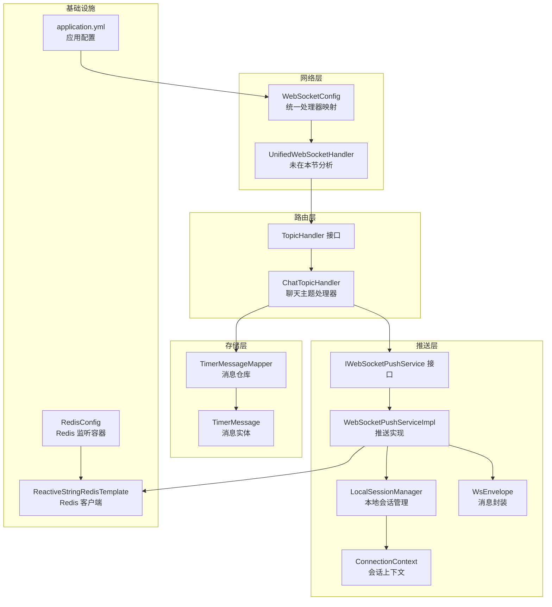
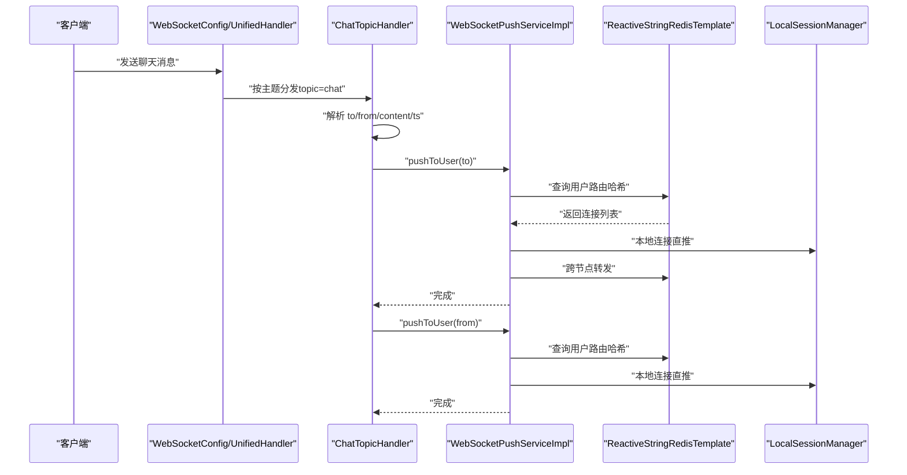
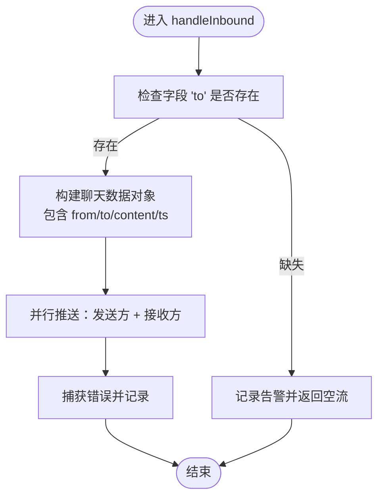
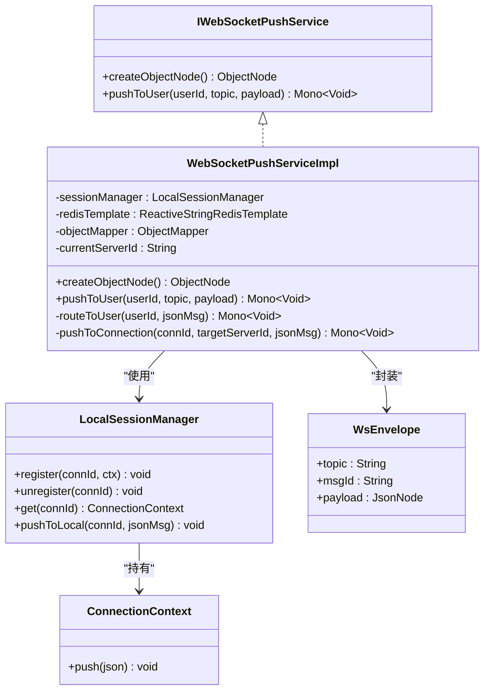
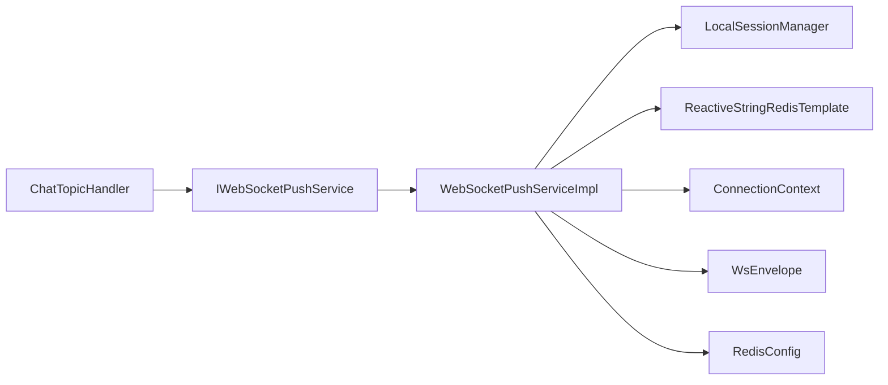

# 聊天消息处理器

<cite>
**本文引用的文件**
- [ChatTopicHandler.java](file://src/main/java/com/rivers/im/router/ChatTopicHandler.java)
- [TopicHandler.java](file://src/main/java/com/rivers/im/router/TopicHandler.java)
- [IWebSocketPushService.java](file://src/main/java/com/rivers/im/service/IWebSocketPushService.java)
- [WebSocketPushServiceImpl.java](file://src/main/java/com/rivers/im/service/impl/WebSocketPushServiceImpl.java)
- [LocalSessionManager.java](file://src/main/java/com/rivers/im/manage/LocalSessionManager.java)
- [ConnectionContext.java](file://src/main/java/com/rivers/im/context/ConnectionContext.java)
- [WsEnvelope.java](file://src/main/java/com/rivers/im/record/WsEnvelope.java)
- [TimerMessage.java](file://src/main/java/com/rivers/im/entity/TimerMessage.java)
- [TimerMessageMapper.java](file://src/main/java/com/rivers/im/mapper/TimerMessageMapper.java)
- [application.yml](file://src/main/resources/application.yml)
- [RedisConfig.java](file://src/main/java/com/rivers/im/config/RedisConfig.java)
- [WebSocketConfig.java](file://src/main/java/com/rivers/im/config/WebSocketConfig.java)
</cite>

## 目录
1. [引言](#引言)
2. [项目结构](#项目结构)
3. [核心组件](#核心组件)
4. [架构总览](#架构总览)
5. [详细组件分析](#详细组件分析)
6. [依赖分析](#依赖分析)
7. [性能考虑](#性能考虑)
8. [故障排查指南](#故障排查指南)
9. [结论](#结论)
10. [附录](#附录)

## 引言
本技术文档围绕聊天消息处理器展开，重点剖析 ChatTopicHandler 的实现原理与运行机制，涵盖消息格式解析、内容校验、业务处理流程；详解消息路由到目标用户的实现（单聊场景）；阐述消息持久化的触发时机与一致性保障；并给出性能优化建议（批量处理、缓存策略、内存管理）。同时提供使用示例与常见问题解决方案，帮助开发者快速理解与扩展。

## 项目结构
IM 服务采用基于 Spring WebFlux 的响应式架构，通过统一的 WebSocket 入口分发不同主题的消息处理器。聊天消息主题由 ChatTopicHandler 负责处理，消息投递由 IWebSocketPushService 实现，跨节点消息通过 Redis 进行路由与转发，本地会话管理由 LocalSessionManager 提供。

图表来源
- [WebSocketConfig.java:1-35](file://src/main/java/com/rivers/im/config/WebSocketConfig.java#L1-L35)
- [TopicHandler.java:1-14](file://src/main/java/com/rivers/im/router/TopicHandler.java#L1-L14)
- [ChatTopicHandler.java:1-51](file://src/main/java/com/rivers/im/router/ChatTopicHandler.java#L1-L51)
- [IWebSocketPushService.java:1-12](file://src/main/java/com/rivers/im/service/IWebSocketPushService.java#L1-L12)
- [WebSocketPushServiceImpl.java:1-90](file://src/main/java/com/rivers/im/service/impl/WebSocketPushServiceImpl.java#L1-L90)
- [LocalSessionManager.java:1-43](file://src/main/java/com/rivers/im/manage/LocalSessionManager.java#L1-L43)
- [ConnectionContext.java:1-24](file://src/main/java/com/rivers/im/context/ConnectionContext.java#L1-L24)
- [WsEnvelope.java:1-10](file://src/main/java/com/rivers/im/record/WsEnvelope.java#L1-L10)
- [TimerMessageMapper.java:1-8](file://src/main/java/com/rivers/im/mapper/TimerMessageMapper.java#L1-L8)
- [TimerMessage.java:1-105](file://src/main/java/com/rivers/im/entity/TimerMessage.java#L1-L105)
- [RedisConfig.java:1-18](file://src/main/java/com/rivers/im/config/RedisConfig.java#L1-L18)
- [application.yml:1-14](file://src/main/resources/application.yml#L1-L14)

章节来源
- [application.yml:1-14](file://src/main/resources/application.yml#L1-L14)
- [WebSocketConfig.java:1-35](file://src/main/java/com/rivers/im/config/WebSocketConfig.java#L1-L35)

## 核心组件
- ChatTopicHandler：实现 TopicHandler 接口，负责解析聊天主题消息、进行基础校验，并调用推送服务向发送方与接收方广播消息。
- IWebSocketPushService/WebSocketPushServiceImpl：抽象并实现消息推送能力，支持本地会话直推与跨节点转发，结合 Redis 哈希表进行路由。
- LocalSessionManager/ConnectionContext：维护本地连接映射与背压输出通道，确保线程安全与有序推送。
- TimerMessage/TImpl/TImplMapper：消息持久化模型与仓库接口，用于后续扩展离线消息落库与查询。
- WsEnvelope：统一消息封装载体，包含主题、消息 ID 与负载。

章节来源
- [ChatTopicHandler.java:1-51](file://src/main/java/com/rivers/im/router/ChatTopicHandler.java#L1-L51)
- [TopicHandler.java:1-14](file://src/main/java/com/rivers/im/router/TopicHandler.java#L1-L14)
- [IWebSocketPushService.java:1-12](file://src/main/java/com/rivers/im/service/IWebSocketPushService.java#L1-L12)
- [WebSocketPushServiceImpl.java:1-90](file://src/main/java/com/rivers/im/service/impl/WebSocketPushServiceImpl.java#L1-L90)
- [LocalSessionManager.java:1-43](file://src/main/java/com/rivers/im/manage/LocalSessionManager.java#L1-L43)
- [ConnectionContext.java:1-24](file://src/main/java/com/rivers/im/context/ConnectionContext.java#L1-L24)
- [WsEnvelope.java:1-10](file://src/main/java/com/rivers/im/record/WsEnvelope.java#L1-L10)
- [TimerMessage.java:1-105](file://src/main/java/com/rivers/im/entity/TimerMessage.java#L1-L105)
- [TimerMessageMapper.java:1-8](file://src/main/java/com/rivers/im/mapper/TimerMessageMapper.java#L1-L8)

## 架构总览
下图展示从 WebSocket 入口到消息路由与推送的关键路径，以及与 Redis 和本地会话的交互。

图表来源
- [ChatTopicHandler.java:30-49](file://src/main/java/com/rivers/im/router/ChatTopicHandler.java#L30-L49)
- [WebSocketPushServiceImpl.java:44-88](file://src/main/java/com/rivers/im/service/impl/WebSocketPushServiceImpl.java#L44-L88)
- [LocalSessionManager.java:35-42](file://src/main/java/com/rivers/im/manage/LocalSessionManager.java#L35-L42)

## 详细组件分析

### ChatTopicHandler：聊天消息处理
- 主题识别：返回固定主题标识，用于统一入口分发。
- 输入解析：从 JsonNode 中提取接收方 to、发送方（当前连接绑定的 userId）、内容 content、时间戳 ts。
- 校验与日志：若缺少接收方则记录告警并短路返回；否则记录消息摘要。
- 数据组装：构造包含 from、to、content、ts 的对象，交由推送服务。
- 并行推送：对发送方与接收方分别执行推送，使用 Mono.when 并行组合，异常时记录错误但不中断整体流程。

图表来源
- [ChatTopicHandler.java:30-49](file://src/main/java/com/rivers/im/router/ChatTopicHandler.java#L30-L49)

章节来源
- [ChatTopicHandler.java:14-50](file://src/main/java/com/rivers/im/router/ChatTopicHandler.java#L14-L50)

### IWebSocketPushService 与 WebSocketPushServiceImpl：消息推送
- 对象节点创建：提供统一的对象节点工厂方法，便于复用 ObjectMapper。
- pushToUser：将负载封装为 WsEnvelope，序列化后根据路由键查询用户连接集合，分别进行本地直推与跨节点转发。
- 路由策略：以“用户路由哈希”的形式存储连接信息，值为连接所在服务器标识；若目标服务器等于当前服务器，则本地推送；否则通过 Redis 发布订阅通道跨节点转发。
- 错误处理：对跨节点转发失败进行告警并忽略，保证主流程不受影响。

图表来源
- [IWebSocketPushService.java:1-12](file://src/main/java/com/rivers/im/service/IWebSocketPushService.java#L1-L12)
- [WebSocketPushServiceImpl.java:20-89](file://src/main/java/com/rivers/im/service/impl/WebSocketPushServiceImpl.java#L20-L89)
- [LocalSessionManager.java:12-43](file://src/main/java/com/rivers/im/manage/LocalSessionManager.java#L12-L43)
- [ConnectionContext.java:8-24](file://src/main/java/com/rivers/im/context/ConnectionContext.java#L8-L24)
- [WsEnvelope.java:5-9](file://src/main/java/com/rivers/im/record/WsEnvelope.java#L5-L9)

章节来源
- [IWebSocketPushService.java:6-11](file://src/main/java/com/rivers/im/service/IWebSocketPushService.java#L6-L11)
- [WebSocketPushServiceImpl.java:20-89](file://src/main/java/com/rivers/im/service/impl/WebSocketPushServiceImpl.java#L20-L89)
- [LocalSessionManager.java:12-43](file://src/main/java/com/rivers/im/manage/LocalSessionManager.java#L12-L43)
- [ConnectionContext.java:8-24](file://src/main/java/com/rivers/im/context/ConnectionContext.java#L8-L24)
- [WsEnvelope.java:5-9](file://src/main/java/com/rivers/im/record/WsEnvelope.java#L5-L9)

### 消息持久化与一致性
- 当前实现：ChatTopicHandler 在处理聊天消息时仅进行实时推送，未显式写入数据库。
- 扩展建议：若需持久化，可在 ChatTopicHandler 或推送服务中引入 TimerMessage 的保存逻辑；或在 WebSocketPushServiceImpl 中增加“离线持久化”分支，针对用户路由为空的情况将消息写入 TimerMessage 表，字段包括发送方、接收方、消息体、类型、时间等。
- 一致性保障：使用数据库事务或幂等键避免重复写入；对跨节点场景，可在消息中携带唯一 ID，确保多副本不重复落库。

章节来源
- [TimerMessage.java:24-104](file://src/main/java/com/rivers/im/entity/TimerMessage.java#L24-L104)
- [TimerMessageMapper.java:6-7](file://src/main/java/com/rivers/im/mapper/TimerMessageMapper.java#L6-L7)

### 单聊与群聊处理策略
- 单聊：ChatTopicHandler 已覆盖，to 字段指向具体用户 ID，推送至该用户的所有连接。
- 群聊：当前代码未体现群组处理逻辑。建议新增 group_id 字段解析与 group 成员路由查询，再对成员集合进行并行推送；或引入群组成员映射表，结合 Redis 哈希存储成员连接集合，实现广播式推送。

章节来源
- [ChatTopicHandler.java:32-38](file://src/main/java/com/rivers/im/router/ChatTopicHandler.java#L32-L38)
- [TimerMessage.java:46-48](file://src/main/java/com/rivers/im/entity/TimerMessage.java#L46-L48)

## 依赖分析
- 组件耦合：ChatTopicHandler 仅依赖推送服务接口与 ObjectMapper，低耦合高内聚。
- 外部依赖：WebSocketPushServiceImpl 依赖 Redis 与本地会话管理器；Redis 通过 ReactiveStringRedisTemplate 提供异步操作能力。
- 循环依赖规避：WebSocketConfig 通过构造注入避免循环依赖，路由层通过接口解耦。

图表来源
- [ChatTopicHandler.java:17-23](file://src/main/java/com/rivers/im/router/ChatTopicHandler.java#L17-L23)
- [WebSocketPushServiceImpl.java:22-37](file://src/main/java/com/rivers/im/service/impl/WebSocketPushServiceImpl.java#L22-L37)
- [LocalSessionManager.java:14-15](file://src/main/java/com/rivers/im/manage/LocalSessionManager.java#L14-L15)
- [RedisConfig.java:14-17](file://src/main/java/com/rivers/im/config/RedisConfig.java#L14-L17)

章节来源
- [ChatTopicHandler.java:17-23](file://src/main/java/com/rivers/im/router/ChatTopicHandler.java#L17-L23)
- [WebSocketPushServiceImpl.java:22-37](file://src/main/java/com/rivers/im/service/impl/WebSocketPushServiceImpl.java#L22-L37)
- [RedisConfig.java:14-17](file://src/main/java/com/rivers/im/config/RedisConfig.java#L14-L17)

## 性能考虑
- 批量处理
  - 将多个用户推送合并为一次 Redis 查询与一次本地推送批处理，减少网络往返与锁竞争。
  - 使用 Mono.when 组合多个推送任务，充分利用背压与异步并发。
- 缓存策略
  - 将用户路由哈希（用户->连接集合）放入热点缓存（如 Redis Hash），降低查询延迟。
  - 对热点用户连接进行本地缓存预热，缩短查找路径。
- 内存管理
  - ConnectionContext 使用带缓冲的背压 Sink，避免内存暴涨；合理设置缓冲大小与超时策略。
  - WebSocketPushServiceImpl 对 JSON 序列化结果进行一次性分配，避免频繁 GC。
- 跨节点优化
  - 跨节点转发时合并小消息为批次，减少发布订阅频率。
  - 使用分区键（用户 ID 哈希）提升路由命中率，降低跨节点比例。

## 故障排查指南
- 接收方缺失
  - 现象：日志出现“缺少接收方”，消息被丢弃。
  - 处理：检查客户端 payload 是否包含 to 字段，确保字段非空。
- 路由为空
  - 现象：用户离线或无在线连接，日志显示“用户离线”。
  - 处理：确认用户登录态与路由注册是否正确；检查 Redis 路由哈希是否存在。
- 跨节点失败
  - 现象：跨服推送告警，但不影响主流程。
  - 处理：检查目标服务器标识与 Redis 订阅通道；确认网络连通性与权限。
- 本地推送失败
  - 现象：本地连接不存在或已关闭。
  - 处理：确认会话生命周期与注销流程；检查 Session 是否已关闭。

章节来源
- [ChatTopicHandler.java:32-35](file://src/main/java/com/rivers/im/router/ChatTopicHandler.java#L32-L35)
- [WebSocketPushServiceImpl.java:63-66](file://src/main/java/com/rivers/im/service/impl/WebSocketPushServiceImpl.java#L63-L66)
- [WebSocketPushServiceImpl.java:81-87](file://src/main/java/com/rivers/im/service/impl/WebSocketPushServiceImpl.java#L81-L87)
- [LocalSessionManager.java:37-41](file://src/main/java/com/rivers/im/manage/LocalSessionManager.java#L37-L41)

## 结论
ChatTopicHandler 以简洁清晰的方式实现了单聊消息的实时推送，配合 WebSocketPushServiceImpl 的本地直推与跨节点转发机制，满足高并发下的低延迟需求。当前实现聚焦于实时投递，消息持久化与群聊广播可通过扩展点逐步增强。通过合理的缓存、批处理与内存管理策略，可进一步提升系统吞吐与稳定性。

## 附录

### 使用示例
- 单聊发送
  - 客户端向统一 WebSocket 入口发送消息，主题为 chat，包含 to、content 等字段。
  - 服务端 ChatTopicHandler 解析并并行推送至发送方与接收方。
- 群聊扩展
  - 在 payload 中增加 group_id 字段，解析后查询群成员路由集合，对每个成员执行推送。

章节来源
- [ChatTopicHandler.java:30-49](file://src/main/java/com/rivers/im/router/ChatTopicHandler.java#L30-L49)