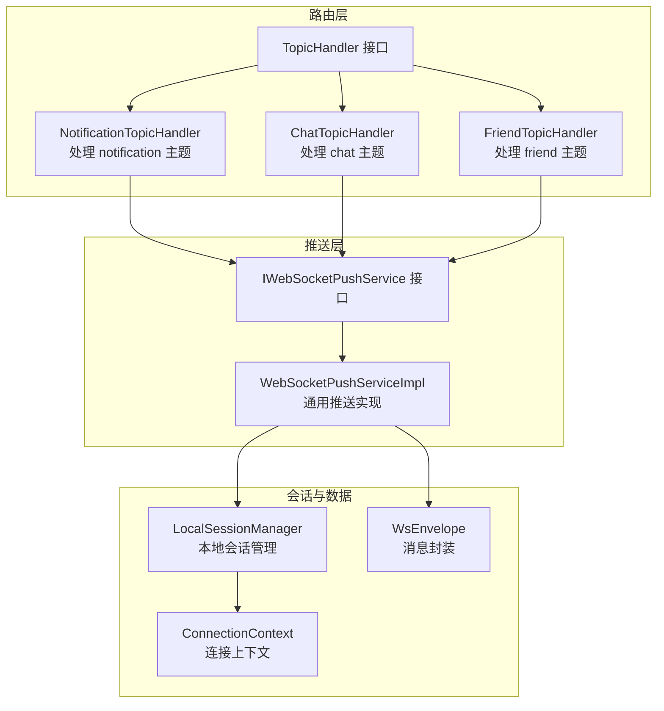
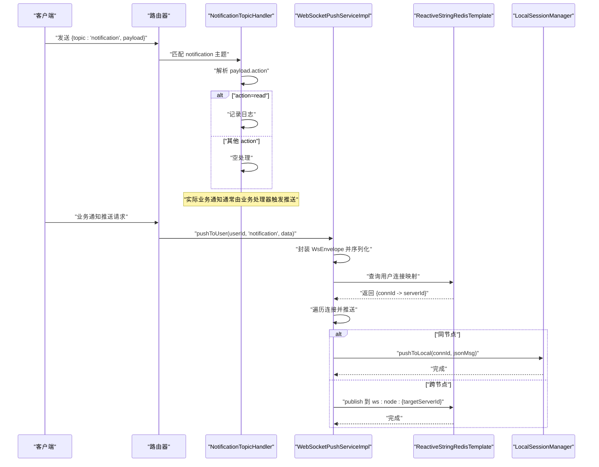
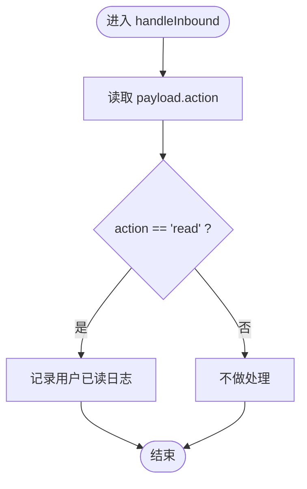
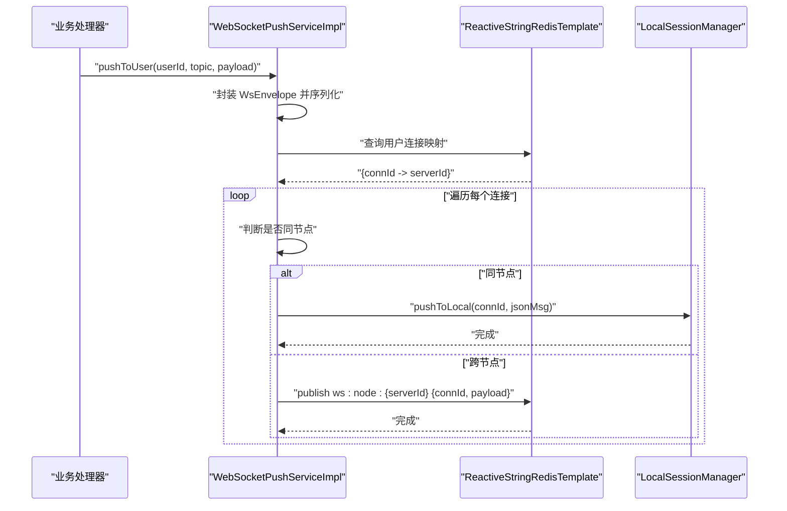
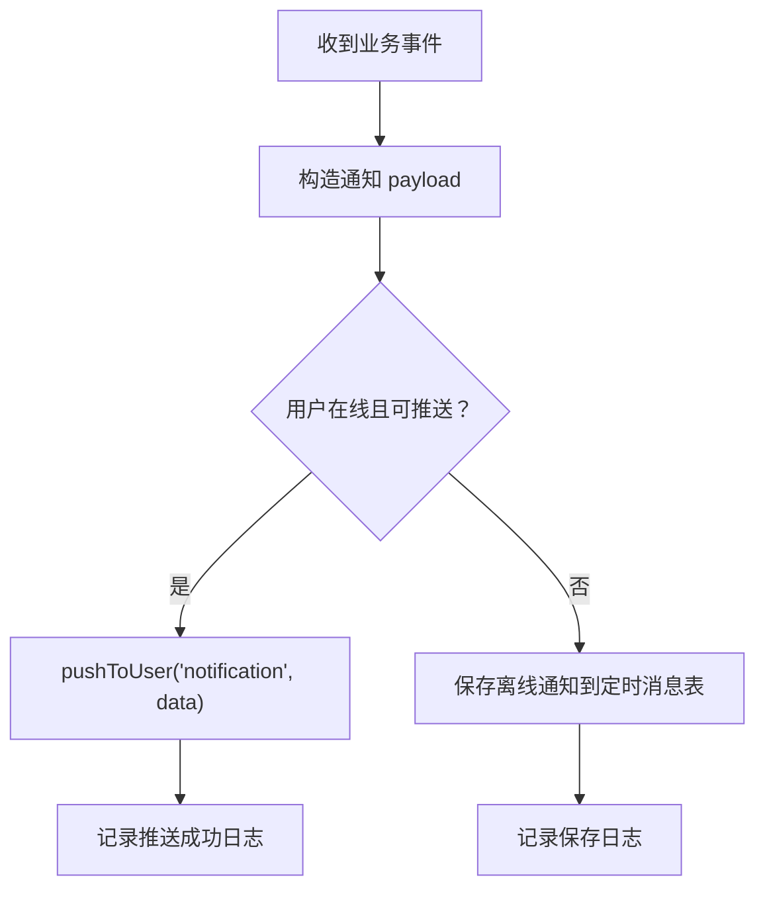
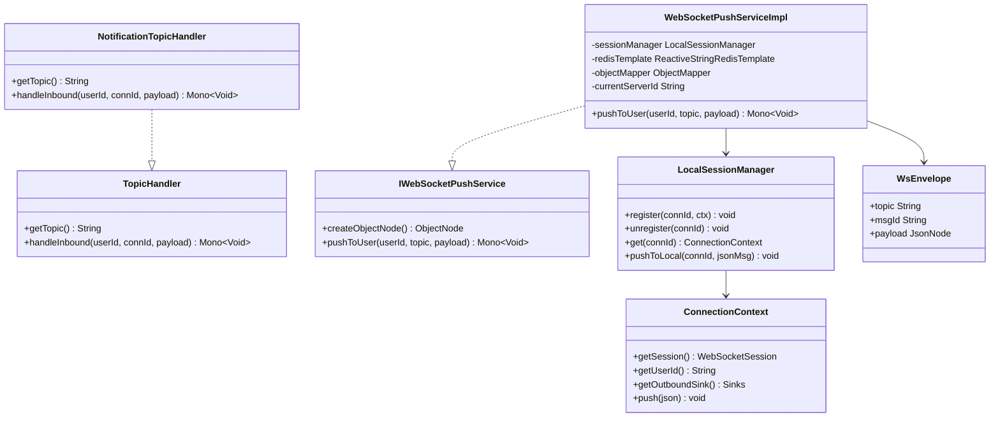

# 通知消息处理器

<cite>
**本文引用的文件**
- [NotificationTopicHandler.java](file://src/main/java/com/rivers/im/router/NotificationTopicHandler.java)
- [TopicHandler.java](file://src/main/java/com/rivers/im/router/TopicHandler.java)
- [IWebSocketPushService.java](file://src/main/java/com/rivers/im/service/IWebSocketPushService.java)
- [WebSocketPushServiceImpl.java](file://src/main/java/com/rivers/im/service/impl/WebSocketPushServiceImpl.java)
- [LocalSessionManager.java](file://src/main/java/com/rivers/im/manage/LocalSessionManager.java)
- [ConnectionContext.java](file://src/main/java/com/rivers/im/context/ConnectionContext.java)
- [WsEnvelope.java](file://src/main/java/com/rivers/im/record/WsEnvelope.java)
- [FriendTopicHandler.java](file://src/main/java/com/rivers/im/router/FriendTopicHandler.java)
- [ChatTopicHandler.java](file://src/main/java/com/rivers/im/router/ChatTopicHandler.java)
</cite>

## 目录
1. [引言](#引言)
2. [项目结构](#项目结构)
3. [核心组件](#核心组件)
4. [架构总览](#架构总览)
5. [详细组件分析](#详细组件分析)
6. [依赖分析](#依赖分析)
7. [性能考虑](#性能考虑)
8. [故障排查指南](#故障排查指南)
9. [结论](#结论)
10. [附录](#附录)

## 引言
本文件围绕通知消息处理器进行技术文档梳理，重点覆盖以下方面：
- NotificationTopicHandler 的实现原理与职责边界
- 系统通知、提醒消息与状态变更通知的处理机制与路由
- 通知消息的优先级与去重策略现状与建议
- 扩展性设计：自定义通知类型与多推送渠道集成
- 性能优化与可靠性保障措施

当前代码库中，通知主题处理器处于最小可用实现阶段：仅处理“已读”动作的日志记录；实时推送通过通用推送服务完成，离线持久化由业务处理器负责。本文在不臆测未实现功能的前提下，基于现有代码进行严谨分析，并给出可落地的扩展与优化建议。

## 项目结构
通知系统涉及的关键模块与文件如下：
- 路由层：TopicHandler 接口与具体处理器（如 NotificationTopicHandler、ChatTopicHandler、FriendTopicHandler）
- 推送层：IWebSocketPushService 及其实现 WebSocketPushServiceImpl
- 会话管理：LocalSessionManager 与 ConnectionContext
- 数据模型：WsEnvelope 作为消息载体
- 业务示例：FriendTopicHandler 展示了实时推送与离线持久化的结合

图表来源
- [NotificationTopicHandler.java:12-27](file://src/main/java/com/rivers/im/router/NotificationTopicHandler.java#L12-L27)
- [TopicHandler.java:8-13](file://src/main/java/com/rivers/im/router/TopicHandler.java#L8-L13)
- [IWebSocketPushService.java:6-11](file://src/main/java/com/rivers/im/service/IWebSocketPushService.java#L6-L11)
- [WebSocketPushServiceImpl.java:20-89](file://src/main/java/com/rivers/im/service/impl/WebSocketPushServiceImpl.java#L20-L89)
- [LocalSessionManager.java:12-43](file://src/main/java/com/rivers/im/manage/LocalSessionManager.java#L12-L43)
- [ConnectionContext.java:8-24](file://src/main/java/com/rivers/im/context/ConnectionContext.java#L8-L24)
- [WsEnvelope.java:5-9](file://src/main/java/com/rivers/im/record/WsEnvelope.java#L5-L9)

章节来源
- [NotificationTopicHandler.java:12-27](file://src/main/java/com/rivers/im/router/NotificationTopicHandler.java#L12-L27)
- [TopicHandler.java:8-13](file://src/main/java/com/rivers/im/router/TopicHandler.java#L8-L13)
- [IWebSocketPushService.java:6-11](file://src/main/java/com/rivers/im/service/IWebSocketPushService.java#L6-L11)
- [WebSocketPushServiceImpl.java:20-89](file://src/main/java/com/rivers/im/service/impl/WebSocketPushServiceImpl.java#L20-L89)
- [LocalSessionManager.java:12-43](file://src/main/java/com/rivers/im/manage/LocalSessionManager.java#L12-L43)
- [ConnectionContext.java:8-24](file://src/main/java/com/rivers/im/context/ConnectionContext.java#L8-L24)
- [WsEnvelope.java:5-9](file://src/main/java/com/rivers/im/record/WsEnvelope.java#L5-L9)

## 核心组件
- TopicHandler 接口：定义主题名与入站处理方法，统一路由分发入口
- NotificationTopicHandler：实现 notification 主题处理，默认仅记录“已读”动作
- IWebSocketPushService/WebSocketPushServiceImpl：提供按用户路由的通用推送能力，支持跨节点转发
- LocalSessionManager/ConnectionContext：维护本地连接与出站通道
- WsEnvelope：消息载体，包含主题、消息 ID 与负载

章节来源
- [TopicHandler.java:8-13](file://src/main/java/com/rivers/im/router/TopicHandler.java#L8-L13)
- [NotificationTopicHandler.java:12-27](file://src/main/java/com/rivers/im/router/NotificationTopicHandler.java#L12-L27)
- [IWebSocketPushService.java:6-11](file://src/main/java/com/rivers/im/service/IWebSocketPushService.java#L6-L11)
- [WebSocketPushServiceImpl.java:20-89](file://src/main/java/com/rivers/im/service/impl/WebSocketPushServiceImpl.java#L20-L89)
- [LocalSessionManager.java:12-43](file://src/main/java/com/rivers/im/manage/LocalSessionManager.java#L12-L43)
- [ConnectionContext.java:8-24](file://src/main/java/com/rivers/im/context/ConnectionContext.java#L8-L24)
- [WsEnvelope.java:5-9](file://src/main/java/com/rivers/im/record/WsEnvelope.java#L5-L9)

## 架构总览
通知系统采用“主题路由 + 通用推送”的解耦架构：
- 路由器根据主题选择对应处理器
- 处理器调用推送服务向目标用户发送消息
- 推送服务通过 Redis 哈希定位用户连接，本地直接推送或跨节点转发
- 本地会话管理器将消息写入连接的出站通道

图表来源
- [NotificationTopicHandler.java:18-26](file://src/main/java/com/rivers/im/router/NotificationTopicHandler.java#L18-L26)
- [WebSocketPushServiceImpl.java:44-88](file://src/main/java/com/rivers/im/service/impl/WebSocketPushServiceImpl.java#L44-L88)
- [LocalSessionManager.java:35-42](file://src/main/java/com/rivers/im/manage/LocalSessionManager.java#L35-L42)

## 详细组件分析

### NotificationTopicHandler 分析
- 主题识别：固定返回 "notification"
- 入站处理：从 payload 中提取 action 字段，当前仅处理 "read" 动作并记录日志
- 设计要点：
  - 当前实现为“只读”型处理器，不执行业务逻辑或持久化
  - 适合承载“客户端上报”的动作类通知（如已读回执）

图表来源
- [NotificationTopicHandler.java:19-25](file://src/main/java/com/rivers/im/router/NotificationTopicHandler.java#L19-L25)

章节来源
- [NotificationTopicHandler.java:12-27](file://src/main/java/com/rivers/im/router/NotificationTopicHandler.java#L12-L27)

### 通用推送服务分析
- 职责：按用户主题推送消息，自动封装消息体并路由至目标连接
- 流程：
  - 将业务对象转换为 WsEnvelope 并序列化
  - 查询用户连接映射（Redis Hash），逐个连接推送
  - 同节点：通过 LocalSessionManager 写入本地连接
  - 跨节点：通过 Redis 发布到目标节点频道
- 错误处理：跨节点推送失败时记录告警并忽略错误，保证主流程不阻塞

图表来源
- [WebSocketPushServiceImpl.java:44-88](file://src/main/java/com/rivers/im/service/impl/WebSocketPushServiceImpl.java#L44-L88)
- [LocalSessionManager.java:35-42](file://src/main/java/com/rivers/im/manage/LocalSessionManager.java#L35-L42)

章节来源
- [IWebSocketPushService.java:6-11](file://src/main/java/com/rivers/im/service/IWebSocketPushService.java#L6-L11)
- [WebSocketPushServiceImpl.java:20-89](file://src/main/java/com/rivers/im/service/impl/WebSocketPushServiceImpl.java#L20-L89)
- [LocalSessionManager.java:12-43](file://src/main/java/com/rivers/im/manage/LocalSessionManager.java#L12-L43)
- [ConnectionContext.java:8-24](file://src/main/java/com/rivers/im/context/ConnectionContext.java#L8-L24)
- [WsEnvelope.java:5-9](file://src/main/java/com/rivers/im/record/WsEnvelope.java#L5-L9)

### 业务处理器中的通知模式（以好友场景为例）
- 实时推送：优先尝试 WebSocket 即时推送，成功则记录日志，失败则降级
- 离线持久化：当实时推送不可达时，将通知内容持久化到定时消息表，供后续投递
- 这体现了“尽力而为 + 降级存储”的可靠性策略

图表来源
- [FriendTopicHandler.java:230-275](file://src/main/java/com/rivers/im/router/FriendTopicHandler.java#L230-L275)

章节来源
- [FriendTopicHandler.java:230-275](file://src/main/java/com/rivers/im/router/FriendTopicHandler.java#L230-L275)

### 主题分类与路由规则
- 主题划分：
  - notification：通知主题（当前仅处理“已读”等动作）
  - chat：聊天主题（用于点对点消息）
  - friend：好友相关主题（用于好友事件通知）
- 路由规则：
  - 路由器根据 getTopic() 返回值选择对应处理器
  - 处理器内部可进一步解析 payload 的子字段决定具体行为

章节来源
- [NotificationTopicHandler.java:14-16](file://src/main/java/com/rivers/im/router/NotificationTopicHandler.java#L14-L16)
- [ChatTopicHandler.java:25-28](file://src/main/java/com/rivers/im/router/ChatTopicHandler.java#L25-L28)
- [FriendTopicHandler.java:262-268](file://src/main/java/com/rivers/im/router/FriendTopicHandler.java#L262-L268)

### 优先级与去重机制
- 现状：
  - 通知主题处理器未实现优先级与去重逻辑
  - 推送服务未内置去重键
- 建议（扩展设计）：
  - 在 WsEnvelope 或 payload 中引入优先级字段与去重键
  - 在推送服务侧增加内存/缓存去重检查，避免重复投递
  - 对高频通知（如状态变更）采用合并策略或节流

章节来源
- [WsEnvelope.java:5-9](file://src/main/java/com/rivers/im/record/WsEnvelope.java#L5-L9)
- [WebSocketPushServiceImpl.java:44-88](file://src/main/java/com/rivers/im/service/impl/WebSocketPushServiceImpl.java#L44-L88)

## 依赖分析
- NotificationTopicHandler 依赖 TopicHandler 接口，遵循统一路由规范
- WebSocketPushServiceImpl 依赖 LocalSessionManager、ReactiveStringRedisTemplate、ObjectMapper
- LocalSessionManager 依赖 ConnectionContext 提供出站通道
- WsEnvelope 作为不可变数据载体被推送服务使用

图表来源
- [TopicHandler.java:8-13](file://src/main/java/com/rivers/im/router/TopicHandler.java#L8-L13)
- [NotificationTopicHandler.java:12-27](file://src/main/java/com/rivers/im/router/NotificationTopicHandler.java#L12-L27)
- [IWebSocketPushService.java:6-11](file://src/main/java/com/rivers/im/service/IWebSocketPushService.java#L6-L11)
- [WebSocketPushServiceImpl.java:20-89](file://src/main/java/com/rivers/im/service/impl/WebSocketPushServiceImpl.java#L20-L89)
- [LocalSessionManager.java:12-43](file://src/main/java/com/rivers/im/manage/LocalSessionManager.java#L12-L43)
- [ConnectionContext.java:8-24](file://src/main/java/com/rivers/im/context/ConnectionContext.java#L8-L24)
- [WsEnvelope.java:5-9](file://src/main/java/com/rivers/im/record/WsEnvelope.java#L5-L9)

章节来源
- [TopicHandler.java:8-13](file://src/main/java/com/rivers/im/router/TopicHandler.java#L8-L13)
- [NotificationTopicHandler.java:12-27](file://src/main/java/com/rivers/im/router/NotificationTopicHandler.java#L12-L27)
- [IWebSocketPushService.java:6-11](file://src/main/java/com/rivers/im/service/IWebSocketPushService.java#L6-L11)
- [WebSocketPushServiceImpl.java:20-89](file://src/main/java/com/rivers/im/service/impl/WebSocketPushServiceImpl.java#L20-L89)
- [LocalSessionManager.java:12-43](file://src/main/java/com/rivers/im/manage/LocalSessionManager.java#L12-L43)
- [ConnectionContext.java:8-24](file://src/main/java/com/rivers/im/context/ConnectionContext.java#L8-L24)
- [WsEnvelope.java:5-9](file://src/main/java/com/rivers/im/record/WsEnvelope.java#L5-L9)

## 性能考虑
- 异步与背压：推送服务使用响应式编程模型，连接出站通道采用带缓冲的多播背压策略，有助于平滑突发流量
- 路由效率：通过 Redis Hash 快速定位用户连接，批量推送使用并行组合减少等待
- 跨节点开销：跨节点推送依赖 Redis 发布，需关注频道订阅与网络延迟
- 建议优化：
  - 对高频通知进行合并或限流，降低推送频率
  - 在推送前置缓存热点用户的连接映射，减少 Redis 查询
  - 针对长连接异常断开场景，完善心跳与清理策略

章节来源
- [ConnectionContext.java:17-18](file://src/main/java/com/rivers/im/context/ConnectionContext.java#L17-L18)
- [WebSocketPushServiceImpl.java:56-74](file://src/main/java/com/rivers/im/service/impl/WebSocketPushServiceImpl.java#L56-L74)

## 故障排查指南
- 用户离线
  - 现象：推送日志显示用户离线
  - 处理：确认用户连接映射是否存在，检查会话注册/注销流程
- 跨节点推送失败
  - 现象：跨服推送告警日志
  - 处理：检查目标节点是否在线、Redis 订阅是否正常、网络连通性
- 连接无效或已关闭
  - 现象：本地推送时出现连接不存在或已关闭提示
  - 处理：确保会话生命周期管理正确，及时清理无效连接
- 通知未送达
  - 现象：业务侧反馈通知缺失
  - 处理：核对主题与处理器匹配、payload 结构、以及离线持久化路径

章节来源
- [WebSocketPushServiceImpl.java:63-66](file://src/main/java/com/rivers/im/service/impl/WebSocketPushServiceImpl.java#L63-L66)
- [WebSocketPushServiceImpl.java:84-87](file://src/main/java/com/rivers/im/service/impl/WebSocketPushServiceImpl.java#L84-L87)
- [LocalSessionManager.java:37-41](file://src/main/java/com/rivers/im/manage/LocalSessionManager.java#L37-L41)

## 结论
当前通知消息处理器以“只读”型处理器为核心，配合通用推送服务实现按用户主题的即时投递。系统具备良好的扩展性：通过实现 TopicHandler 接口即可新增通知类型；通过 IWebSocketPushService 可接入多种推送渠道。为进一步提升可靠性与性能，建议补充优先级与去重机制、完善离线持久化策略，并在推送前置缓存与限流合并方面持续优化。

## 附录
- 扩展建议清单
  - 新增通知类型：实现 TopicHandler 接口，注册主题与处理逻辑
  - 多渠道推送：在推送服务中抽象渠道接口，按通知类型选择不同渠道
  - 去重与优先级：在消息体中加入去重键与优先级字段，推送服务侧做缓存校验
  - 离线存储：对无法实时推送的通知落库，结合定时任务兜底投递