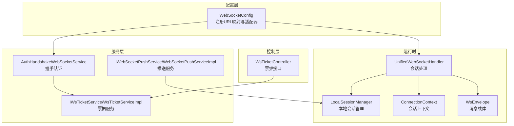
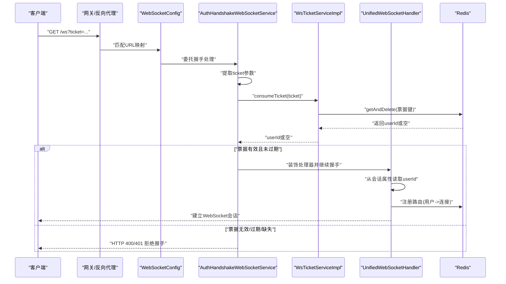
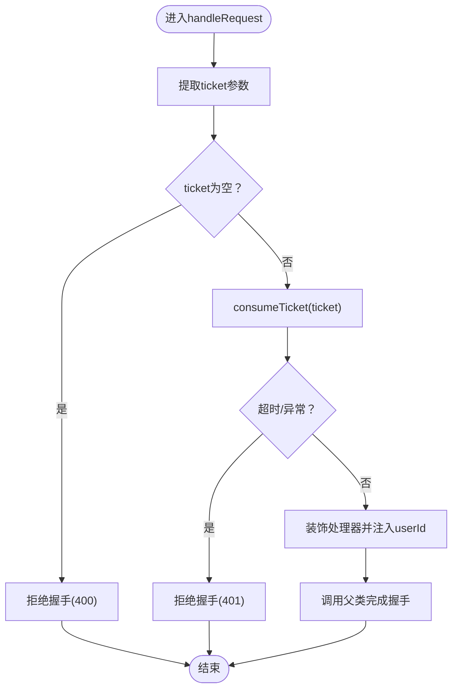
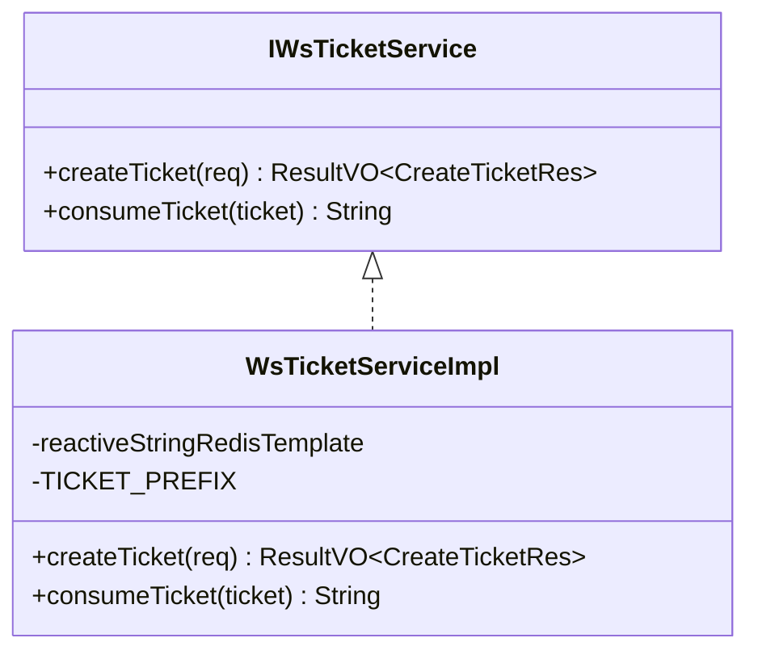
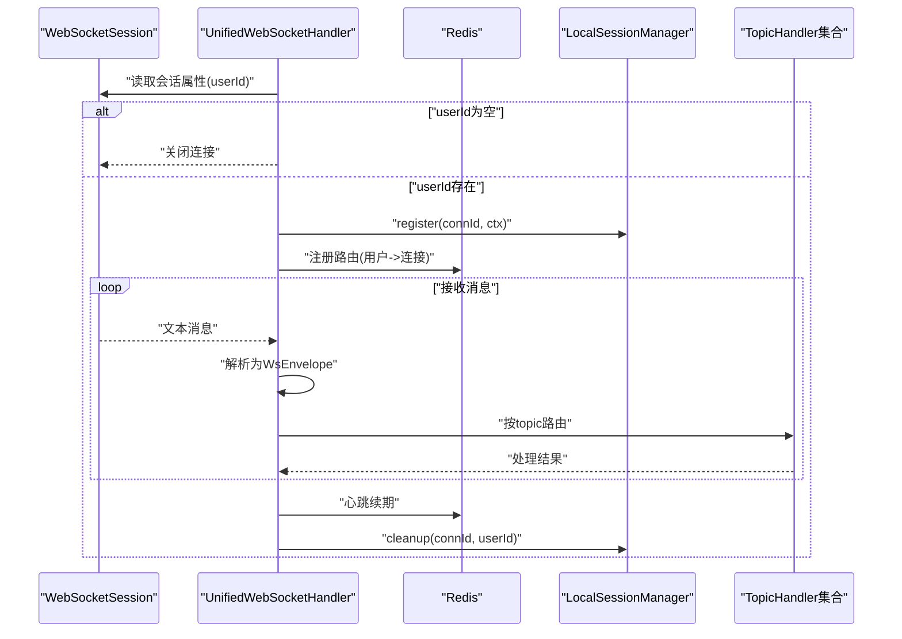
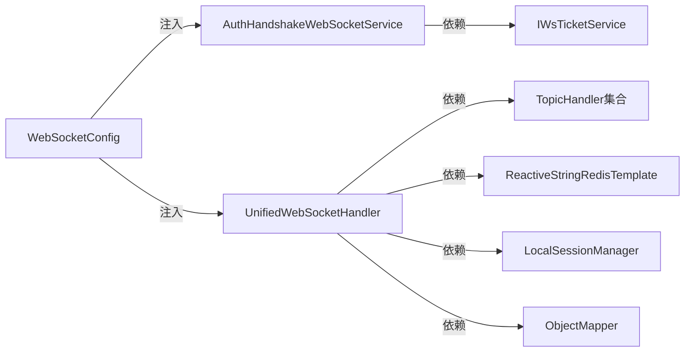
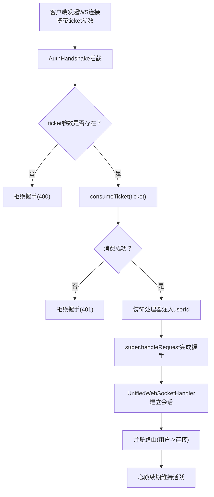

# WebSocket握手认证

<cite>
**本文引用的文件列表**
- [AuthHandshakeWebSocketService.java](file://src/main/java/com/rivers/im/service/impl/AuthHandshakeWebSocketService.java)
- [IWsTicketService.java](file://src/main/java/com/rivers/im/service/IWsTicketService.java)
- [WsTicketServiceImpl.java](file://src/main/java/com/rivers/im/service/impl/WsTicketServiceImpl.java)
- [WsTicketController.java](file://src/main/java/com/rivers/im/controller/WsTicketController.java)
- [UnifiedWebSocketHandler.java](file://src/main/java/com/rivers/im/config/UnifiedWebSocketHandler.java)
- [WebSocketConfig.java](file://src/main/java/com/rivers/im/config/WebSocketConfig.java)
- [ConnectionContext.java](file://src/main/java/com/rivers/im/context/ConnectionContext.java)
- [LocalSessionManager.java](file://src/main/java/com/rivers/im/manage/LocalSessionManager.java)
- [WsEnvelope.java](file://src/main/java/com/rivers/im/record/WsEnvelope.java)
- [application.yml](file://src/main/resources/application.yml)
</cite>

## 目录
1. [引言](#引言)
2. [项目结构](#项目结构)
3. [核心组件](#核心组件)
4. [架构总览](#架构总览)
5. [详细组件分析](#详细组件分析)
6. [依赖关系分析](#依赖关系分析)
7. [性能考量](#性能考量)
8. [故障排查指南](#故障排查指南)
9. [结论](#结论)
10. [附录](#附录)

## 引言
本技术文档围绕WebSocket握手认证模块展开，重点剖析AuthHandshakeWebSocketService的认证实现原理与安全策略，涵盖握手过程中的安全验证机制、Token校验流程、用户身份绑定、防重放攻击与会话劫持防护、非法连接拦截、认证失败处理与错误响应策略，并提供调试方法与常见问题排查指南。文档同时给出完整的握手流程图与安全考虑要点，帮助开发者快速理解与维护该模块。

## 项目结构
本项目采用分层+功能域组织方式：
- config：配置与入口装配，包含WebSocket映射与自定义握手服务注入
- service：业务服务层，包含票据生成与消费、握手认证、推送等
- controller：对外接口，负责票据发放
- context：会话上下文封装
- manage：本地会话管理
- record：消息载体
- router：消息路由处理器
- 其他：定时任务、Mapper等

图表来源
- [WebSocketConfig.java:22-34](file://src/main/java/com/rivers/im/config/WebSocketConfig.java#L22-L34)
- [AuthHandshakeWebSocketService.java:22-55](file://src/main/java/com/rivers/im/service/impl/AuthHandshakeWebSocketService.java#L22-L55)
- [WsTicketServiceImpl.java:20-53](file://src/main/java/com/rivers/im/service/impl/WsTicketServiceImpl.java#L20-L53)
- [UnifiedWebSocketHandler.java:38-122](file://src/main/java/com/rivers/im/config/UnifiedWebSocketHandler.java#L38-L122)
- [ConnectionContext.java:8-19](file://src/main/java/com/rivers/im/context/ConnectionContext.java#L8-L19)
- [LocalSessionManager.java:12-42](file://src/main/java/com/rivers/im/manage/LocalSessionManager.java#L12-L42)
- [WsEnvelope.java:5-9](file://src/main/java/com/rivers/im/record/WsEnvelope.java#L5-L9)

章节来源
- [WebSocketConfig.java:15-35](file://src/main/java/com/rivers/im/config/WebSocketConfig.java#L15-L35)
- [application.yml:1-14](file://src/main/resources/application.yml#L1-L14)

## 核心组件
- AuthHandshakeWebSocketService：基于Spring WebFlux的自定义握手服务，负责从请求参数中提取票据并进行消费校验，成功后将userId注入到WebSocket会话属性中，再交由统一处理器处理。
- IWsTicketService/WsTicketServiceImpl：提供票据创建与消费能力，票据存储于Redis，具备时效性与一次性消费特性。
- WsTicketController：对外提供票据创建接口，供客户端在建立WebSocket前获取有效票据。
- UnifiedWebSocketHandler：统一的WebSocket处理器，负责会话生命周期管理、消息路由、心跳续期与清理。
- ConnectionContext/LocalSessionManager：封装会话上下文与本地会话管理，支持多路推送与背压。
- WsEnvelope：消息载体，承载topic、msgId与payload，用于路由分发。

章节来源
- [AuthHandshakeWebSocketService.java:22-73](file://src/main/java/com/rivers/im/service/impl/AuthHandshakeWebSocketService.java#L22-L73)
- [IWsTicketService.java:8-13](file://src/main/java/com/rivers/im/service/IWsTicketService.java#L8-L13)
- [WsTicketServiceImpl.java:20-53](file://src/main/java/com/rivers/im/service/impl/WsTicketServiceImpl.java#L20-L53)
- [WsTicketController.java:14-25](file://src/main/java/com/rivers/im/controller/WsTicketController.java#L14-L25)
- [UnifiedWebSocketHandler.java:38-181](file://src/main/java/com/rivers/im/config/UnifiedWebSocketHandler.java#L38-L181)
- [ConnectionContext.java:8-24](file://src/main/java/com/rivers/im/context/ConnectionContext.java#L8-L24)
- [LocalSessionManager.java:12-43](file://src/main/java/com/rivers/im/manage/LocalSessionManager.java#L12-L43)
- [WsEnvelope.java:5-9](file://src/main/java/com/rivers/im/record/WsEnvelope.java#L5-L9)

## 架构总览
下图展示从客户端发起WebSocket连接到会话建立与消息路由的整体流程，以及认证握手的关键节点。

图表来源
- [WebSocketConfig.java:22-34](file://src/main/java/com/rivers/im/config/WebSocketConfig.java#L22-L34)
- [AuthHandshakeWebSocketService.java:26-55](file://src/main/java/com/rivers/im/service/impl/AuthHandshakeWebSocketService.java#L26-L55)
- [WsTicketServiceImpl.java:50-53](file://src/main/java/com/rivers/im/service/impl/WsTicketServiceImpl.java#L50-L53)
- [UnifiedWebSocketHandler.java:87-122](file://src/main/java/com/rivers/im/config/UnifiedWebSocketHandler.java#L87-L122)

## 详细组件分析

### 认证握手服务：AuthHandshakeWebSocketService
- 参数提取与校验
  - 从查询参数中提取ticket；若为空则直接拒绝握手并返回相应状态码。
- 票据消费与超时控制
  - 调用票据服务消费票据，设置超时时间以避免阻塞；若票据不存在或已过期，通过拒绝握手返回状态码。
  - 对异常进行捕获并统一走拒绝路径，避免异常传播导致响应状态不一致。
- 用户身份注入
  - 成功获取userId后，通过装饰WebSocketHandler的方式将userId写入会话属性，供后续处理器使用。
- 握手拒绝策略
  - 使用响应对象的isCommitted判断避免重复提交状态，确保优雅拒绝。

图表来源
- [AuthHandshakeWebSocketService.java:26-55](file://src/main/java/com/rivers/im/service/impl/AuthHandshakeWebSocketService.java#L26-L55)

章节来源
- [AuthHandshakeWebSocketService.java:22-73](file://src/main/java/com/rivers/im/service/impl/AuthHandshakeWebSocketService.java#L22-L73)

### 票据服务：IWsTicketService 与 WsTicketServiceImpl
- 票据创建
  - 生成唯一票据字符串，将“票据键”映射到用户ID并设置短期有效期。
  - 写入Redis成功后返回票据；失败时返回统一错误结果。
- 票据消费
  - 使用原子性的getAndDelete操作消费票据，确保一次性使用与防重放。
  - 返回userId或空值，供握手服务判定。

图表来源
- [IWsTicketService.java:8-13](file://src/main/java/com/rivers/im/service/IWsTicketService.java#L8-L13)
- [WsTicketServiceImpl.java:20-53](file://src/main/java/com/rivers/im/service/impl/WsTicketServiceImpl.java#L20-L53)

章节来源
- [IWsTicketService.java:8-13](file://src/main/java/com/rivers/im/service/IWsTicketService.java#L8-L13)
- [WsTicketServiceImpl.java:20-53](file://src/main/java/com/rivers/im/service/impl/WsTicketServiceImpl.java#L20-L53)

### 统一WebSocket处理器：UnifiedWebSocketHandler
- 会话建立与身份提取
  - 从会话属性中读取userId；若无法获取，直接关闭连接。
- 会话上下文与本地管理
  - 创建ConnectionContext并注册到LocalSessionManager，准备多路推送。
- 路由注册与心跳
  - 将“用户->连接”的映射写入Redis哈希，并设置过期时间；周期性续期以维持活跃。
- 消息分发
  - 解析消息为WsEnvelope，按topic路由至对应TopicHandler处理。
- 清理与错误处理
  - 会话结束时清理路由与本地会话；对异常进行日志记录与容错。

图表来源
- [UnifiedWebSocketHandler.java:87-122](file://src/main/java/com/rivers/im/config/UnifiedWebSocketHandler.java#L87-L122)
- [ConnectionContext.java:8-19](file://src/main/java/com/rivers/im/context/ConnectionContext.java#L8-L19)
- [LocalSessionManager.java:17-26](file://src/main/java/com/rivers/im/manage/LocalSessionManager.java#L17-L26)

章节来源
- [UnifiedWebSocketHandler.java:38-181](file://src/main/java/com/rivers/im/config/UnifiedWebSocketHandler.java#L38-L181)
- [ConnectionContext.java:8-24](file://src/main/java/com/rivers/im/context/ConnectionContext.java#L8-L24)
- [LocalSessionManager.java:12-43](file://src/main/java/com/rivers/im/manage/LocalSessionManager.java#L12-L43)
- [WsEnvelope.java:5-9](file://src/main/java/com/rivers/im/record/WsEnvelope.java#L5-L9)

### 配置与入口：WebSocketConfig
- URL映射
  - 将/ws路径映射到统一处理器，设置较高优先级以确保拦截。
- 适配器注入
  - 注入自定义的AuthHandshakeWebSocketService，替换默认握手行为。
- 应用端口
  - 通过配置文件指定服务端口。

章节来源
- [WebSocketConfig.java:15-35](file://src/main/java/com/rivers/im/config/WebSocketConfig.java#L15-L35)
- [application.yml:13-14](file://src/main/resources/application.yml#L13-L14)

### 票据接口：WsTicketController
- 提供POST接口用于创建票据，返回ResultVO包装的票据信息，供客户端在握手时携带ticket参数。

章节来源
- [WsTicketController.java:14-25](file://src/main/java/com/rivers/im/controller/WsTicketController.java#L14-L25)

## 依赖关系分析
- 组件耦合
  - AuthHandshakeWebSocketService依赖IWsTicketService；WebSocketConfig注入AuthHandshakeWebSocketService与UnifiedWebSocketHandler。
  - UnifiedWebSocketHandler依赖TopicHandler集合、Redis模板、LocalSessionManager与ObjectMapper。
- 外部依赖
  - Redis用于票据存储与会话路由；Nacos作为配置中心（通过application.yml导入）。
- 循环依赖规避
  - WebSocketConfig仅持有Handler实例，避免了握手服务与处理器之间的循环依赖。

图表来源
- [WebSocketConfig.java:20-34](file://src/main/java/com/rivers/im/config/WebSocketConfig.java#L20-L34)
- [AuthHandshakeWebSocketService.java:24-24](file://src/main/java/com/rivers/im/service/impl/AuthHandshakeWebSocketService.java#L24-L24)
- [UnifiedWebSocketHandler.java:50-64](file://src/main/java/com/rivers/im/config/UnifiedWebSocketHandler.java#L50-L64)

章节来源
- [WebSocketConfig.java:15-35](file://src/main/java/com/rivers/im/config/WebSocketConfig.java#L15-L35)
- [AuthHandshakeWebSocketService.java:22-24](file://src/main/java/com/rivers/im/service/impl/AuthHandshakeWebSocketService.java#L22-L24)
- [UnifiedWebSocketHandler.java:50-64](file://src/main/java/com/rivers/im/config/UnifiedWebSocketHandler.java#L50-L64)

## 性能考量
- 响应式与非阻塞
  - 整体采用WebFlux与Reactive Redis，避免阻塞线程，提升并发能力。
- 超时与背压
  - 握手阶段设置超时，防止长时间阻塞；推送侧使用背压缓冲，避免内存压力。
- 心跳与续期
  - 定期续期Redis路由键，降低无效连接占用资源。
- 并发与清理
  - 会话清理在finally阶段执行，确保资源回收及时。

章节来源
- [AuthHandshakeWebSocketService.java:34-43](file://src/main/java/com/rivers/im/service/impl/AuthHandshakeWebSocketService.java#L34-L43)
- [UnifiedWebSocketHandler.java:111-118](file://src/main/java/com/rivers/im/config/UnifiedWebSocketHandler.java#L111-L118)
- [LocalSessionManager.java:35-42](file://src/main/java/com/rivers/im/manage/LocalSessionManager.java#L35-L42)

## 故障排查指南
- 常见错误与定位
  - 缺少ticket参数：握手被拒绝，返回400；检查客户端是否正确传递ticket。
  - ticket无效或已过期：消费票据返回空，握手被拒绝，返回401；检查票据有效期与是否已被消费。
  - Redis写入失败：票据创建失败；检查Redis可用性与权限。
  - 会话属性缺失：统一处理器无法提取userId，直接关闭连接；确认握手装饰逻辑是否生效。
  - 路由注册失败：心跳续期异常；检查Redis写入权限与网络连通性。
- 日志与告警
  - 关注握手阶段的日志输出，定位拒绝原因；关注消息解析与路由失败的警告。
- 调试步骤
  - 在AuthHandshake阶段打印ticket与userId；在统一处理器中打印路由注册与心跳续期结果。
  - 使用Redis命令查看票据键与路由键状态，确认消费与过期行为符合预期。

章节来源
- [AuthHandshakeWebSocketService.java:30-43](file://src/main/java/com/rivers/im/service/impl/AuthHandshakeWebSocketService.java#L30-L43)
- [WsTicketServiceImpl.java:31-47](file://src/main/java/com/rivers/im/service/impl/WsTicketServiceImpl.java#L31-L47)
- [UnifiedWebSocketHandler.java:98-102](file://src/main/java/com/rivers/im/config/UnifiedWebSocketHandler.java#L98-L102)
- [UnifiedWebSocketHandler.java:114-117](file://src/main/java/com/rivers/im/config/UnifiedWebSocketHandler.java#L114-L117)

## 结论
AuthHandshakeWebSocketService通过“票据+一次性消费+超时控制”的组合，实现了轻量、可扩展的WebSocket握手认证。结合Redis的原子性消费与统一处理器的路由、心跳与清理机制，整体方案在安全性与性能之间取得平衡。建议在生产环境中配合Nginx限流、Redis高可用与完善的监控体系，进一步增强稳定性与可观测性。

## 附录

### 握手流程图（含安全要点）

图表来源
- [AuthHandshakeWebSocketService.java:26-55](file://src/main/java/com/rivers/im/service/impl/AuthHandshakeWebSocketService.java#L26-L55)
- [WsTicketServiceImpl.java:50-53](file://src/main/java/com/rivers/im/service/impl/WsTicketServiceImpl.java#L50-L53)
- [UnifiedWebSocketHandler.java:97-118](file://src/main/java/com/rivers/im/config/UnifiedWebSocketHandler.java#L97-L118)

### 安全考虑要点
- 防重放攻击
  - 票据一次性消费（getAndDelete），确保同一票据仅能使用一次。
- 会话劫持防护
  - 票据有效期短（示例为秒级），降低泄露后的利用窗口；会话属性仅在握手阶段注入，避免参数透传风险。
- 非法连接拦截
  - 缺失或无效ticket直接拒绝，避免未授权访问。
- 错误响应策略
  - 明确区分400与401，便于客户端与网关区分处理；拒绝握手时避免响应已提交导致异常。

章节来源
- [WsTicketServiceImpl.java:31-32](file://src/main/java/com/rivers/im/service/impl/WsTicketServiceImpl.java#L31-L32)
- [AuthHandshakeWebSocketService.java:30-43](file://src/main/java/com/rivers/im/service/impl/AuthHandshakeWebSocketService.java#L30-L43)
- [AuthHandshakeWebSocketService.java:60-67](file://src/main/java/com/rivers/im/service/impl/AuthHandshakeWebSocketService.java#L60-L67)