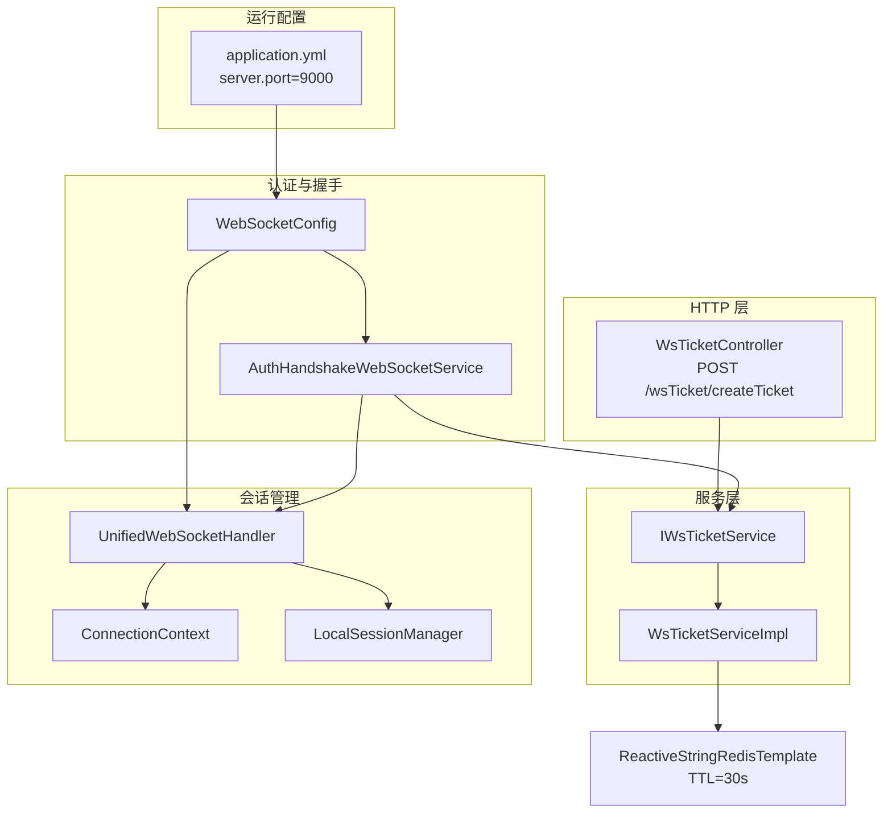
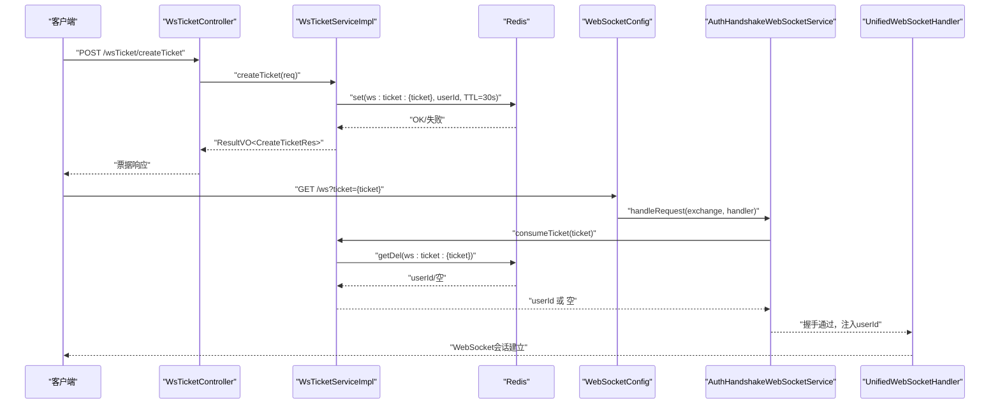
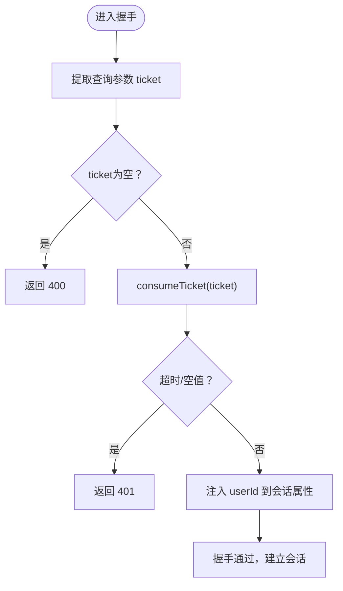
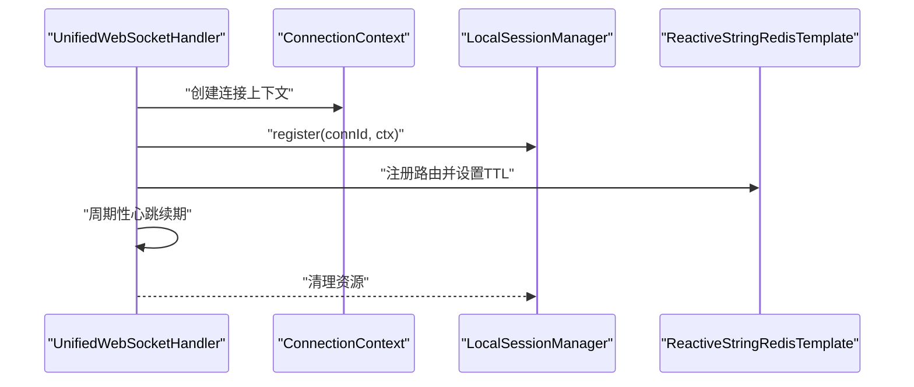
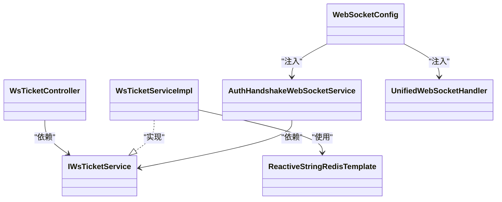

# 票据控制器

<cite>
**本文引用的文件**
- [WsTicketController.java](file://src/main/java/com/rivers/im/controller/WsTicketController.java)
- [IWsTicketService.java](file://src/main/java/com/rivers/im/service/IWsTicketService.java)
- [WsTicketServiceImpl.java](file://src/main/java/com/rivers/im/service/impl/WsTicketServiceImpl.java)
- [AuthHandshakeWebSocketService.java](file://src/main/java/com/rivers/im/service/impl/AuthHandshakeWebSocketService.java)
- [WebSocketConfig.java](file://src/main/java/com/rivers/im/config/WebSocketConfig.java)
- [application.yml](file://src/main/resources/application.yml)
- [ConnectionContext.java](file://src/main/java/com/rivers/im/context/ConnectionContext.java)
- [LocalSessionManager.java](file://src/main/java/com/rivers/im/manage/LocalSessionManager.java)
- [UnifiedWebSocketHandler.java](file://src/main/java/com/rivers/im/config/UnifiedWebSocketHandler.java)
- [WsEnvelope.java](file://src/main/java/com/rivers/im/record/WsEnvelope.java)
</cite>

## 目录
1. [简介](#简介)
2. [项目结构](#项目结构)
3. [核心组件](#核心组件)
4. [架构总览](#架构总览)
5. [详细组件分析](#详细组件分析)
6. [依赖分析](#依赖分析)
7. [性能考虑](#性能考虑)
8. [故障排查指南](#故障排查指南)
9. [结论](#结论)
10. [附录](#附录)

## 简介
本文件为票据控制器模块的详细API文档，聚焦于WebSocket票据（ticket）的生成与消费流程，覆盖以下内容：
- 票据获取接口的URL模式、请求参数、响应格式与状态码
- 票据验证与WebSocket握手流程的使用方法（请求头/查询参数设置、参数传递与返回值解析）
- 票据刷新机制的实现细节与使用场景
- 完整的API调用示例（含curl命令与多语言客户端思路）
- 错误处理策略、异常情况说明与最佳实践建议

## 项目结构
围绕票据控制与WebSocket握手认证的关键文件如下：
- 控制层：WsTicketController 提供票据创建接口
- 服务层：IWsTicketService 接口与 WsTicketServiceImpl 实现
- 握手认证：AuthHandshakeWebSocketService 在WebSocket握手阶段校验票据
- 配置：WebSocketConfig 将自定义握手服务注入到映射路径
- 运行配置：application.yml 指定服务端口
- 会话上下文：ConnectionContext、LocalSessionManager、UnifiedWebSocketHandler 用于建立与维护会话

图表来源
- [WsTicketController.java:14-25](file://src/main/java/com/rivers/im/controller/WsTicketController.java#L14-L25)
- [IWsTicketService.java:8-13](file://src/main/java/com/rivers/im/service/IWsTicketService.java#L8-L13)
- [WsTicketServiceImpl.java:20-54](file://src/main/java/com/rivers/im/service/impl/WsTicketServiceImpl.java#L20-L54)
- [AuthHandshakeWebSocketService.java:22-55](file://src/main/java/com/rivers/im/service/impl/AuthHandshakeWebSocketService.java#L22-L55)
- [WebSocketConfig.java:15-35](file://src/main/java/com/rivers/im/config/WebSocketConfig.java#L15-L35)
- [application.yml:13-14](file://src/main/resources/application.yml#L13-L14)
- [ConnectionContext.java:8-24](file://src/main/java/com/rivers/im/context/ConnectionContext.java#L8-L24)
- [LocalSessionManager.java:12-43](file://src/main/java/com/rivers/im/manage/LocalSessionManager.java#L12-L43)
- [UnifiedWebSocketHandler.java:38-138](file://src/main/java/com/rivers/im/config/UnifiedWebSocketHandler.java#L38-L138)

章节来源
- [application.yml:13-14](file://src/main/resources/application.yml#L13-L14)
- [WebSocketConfig.java:15-35](file://src/main/java/com/rivers/im/config/WebSocketConfig.java#L15-L35)

## 核心组件
- 票据控制器 WsTicketController
  - 提供票据创建接口，接收CreateTicketReq，返回ResultVO<CreateTicketRes>
  - 请求方式：POST
  - 路径：/wsTicket/createTicket
- 票据服务 IWsTicketService 与 WsTicketServiceImpl
  - createTicket：生成UUID作为票据，写入Redis，TTL=30秒；成功返回票据，失败返回统一错误包装
  - consumeTicket：按票据键读取并删除，返回用户标识
- WebSocket握手认证 AuthHandshakeWebSocketService
  - 从查询参数提取ticket，校验非空与有效性（超时与空值处理），通过后将userId放入会话属性
- WebSocket配置 WebSocketConfig
  - 映射/ws为统一处理器，并注入自定义握手服务
- 会话与消息处理 UnifiedWebSocketHandler
  - 建立会话、注册路由、心跳续期、消息分发与清理

章节来源
- [WsTicketController.java:14-25](file://src/main/java/com/rivers/im/controller/WsTicketController.java#L14-L25)
- [IWsTicketService.java:8-13](file://src/main/java/com/rivers/im/service/IWsTicketService.java#L8-L13)
- [WsTicketServiceImpl.java:26-53](file://src/main/java/com/rivers/im/service/impl/WsTicketServiceImpl.java#L26-L53)
- [AuthHandshakeWebSocketService.java:26-55](file://src/main/java/com/rivers/im/service/impl/AuthHandshakeWebSocketService.java#L26-L55)
- [WebSocketConfig.java:22-34](file://src/main/java/com/rivers/im/config/WebSocketConfig.java#L22-L34)
- [UnifiedWebSocketHandler.java:88-122](file://src/main/java/com/rivers/im/config/UnifiedWebSocketHandler.java#L88-L122)

## 架构总览
下图展示从HTTP创建票据到WebSocket握手认证与会话建立的完整链路。

图表来源
- [WsTicketController.java:21-24](file://src/main/java/com/rivers/im/controller/WsTicketController.java#L21-L24)
- [WsTicketServiceImpl.java:27-53](file://src/main/java/com/rivers/im/service/impl/WsTicketServiceImpl.java#L27-L53)
- [AuthHandshakeWebSocketService.java:27-54](file://src/main/java/com/rivers/im/service/impl/AuthHandshakeWebSocketService.java#L27-L54)
- [WebSocketConfig.java:22-34](file://src/main/java/com/rivers/im/config/WebSocketConfig.java#L22-L34)
- [UnifiedWebSocketHandler.java:88-122](file://src/main/java/com/rivers/im/config/UnifiedWebSocketHandler.java#L88-L122)

## 详细组件分析

### 票据获取接口（HTTP）
- 接口描述
  - 作用：为WebSocket连接生成一次性票据，票据有效期30秒
- URL模式
  - 方法：POST
  - 路径：/wsTicket/createTicket
- 请求体
  - 类型：CreateTicketReq
  - 关键字段：包含登录用户信息（如用户ID等）
- 响应体
  - 类型：ResultVO<CreateTicketRes>
  - 成功时：包含票据字符串
  - 失败时：统一错误包装（如系统繁忙、创建失败）
- 状态码
  - 200：成功
  - 500：内部错误（如Redis写入失败）
- 使用示例
  - curl
    - curl -X POST http://localhost:9000/wsTicket/createTicket -H "Content-Type: application/json" -d '{...}'
  - Java（RestTemplate/MVC）
    - 发送POST请求至 /wsTicket/createTicket，传入CreateTicketReq对象
  - JavaScript（fetch）
    - fetch('http://localhost:9000/wsTicket/createTicket', { method: 'POST', body: JSON.stringify(req), headers: { 'Content-Type': 'application/json' } })

章节来源
- [WsTicketController.java:21-24](file://src/main/java/com/rivers/im/controller/WsTicketController.java#L21-L24)
- [WsTicketServiceImpl.java:27-48](file://src/main/java/com/rivers/im/service/impl/WsTicketServiceImpl.java#L27-L48)
- [application.yml:13-14](file://src/main/resources/application.yml#L13-L14)

### 票据验证与WebSocket握手
- 握手入口
  - 路径：/ws
  - 查询参数：ticket（必填）
- 参数传递
  - ticket：通过查询参数传递
- 返回值解析
  - 成功：握手通过，会话中携带userId
  - 失败：根据原因返回400（缺少ticket）或401（无效/过期/异常）
- 核心逻辑
  - 校验ticket非空
  - 从Redis读取并删除票据，超时控制
  - 若票据有效，将userId注入会话属性，继续建立WebSocket
- 错误处理
  - 缺少ticket：400 Bad Request
  - 无效或过期：401 Unauthorized
  - Redis异常：401 Unauthorized
- 使用示例
  - curl（WebSocket）
    - wscat -c "ws://localhost:9000/ws?ticket={票据}"
  - JavaScript（浏览器）
    - new WebSocket("ws://localhost:9000/ws?ticket={票据}")

图表来源
- [AuthHandshakeWebSocketService.java:27-54](file://src/main/java/com/rivers/im/service/impl/AuthHandshakeWebSocketService.java#L27-L54)
- [WsTicketServiceImpl.java:50-53](file://src/main/java/com/rivers/im/service/impl/WsTicketServiceImpl.java#L50-L53)

章节来源
- [AuthHandshakeWebSocketService.java:26-55](file://src/main/java/com/rivers/im/service/impl/AuthHandshakeWebSocketService.java#L26-L55)
- [WebSocketConfig.java:22-34](file://src/main/java/com/rivers/im/config/WebSocketConfig.java#L22-L34)

### 票据刷新机制
- 当前实现
  - 票据创建后仅支持一次性消费，TTL=30秒
  - 未提供刷新接口或自动续期逻辑
- 使用场景
  - 适用于短时、一次性连接的认证
- 建议方案（扩展思路）
  - 新增刷新接口：客户端持有票据后，在即将过期前发起刷新请求，服务端延长TTL
  - 引入票据哈希与幂等：对同一票据多次刷新进行去重与限流
  - 客户端策略：在30秒内检测到即将过期时主动重新申请票据

章节来源
- [WsTicketServiceImpl.java:27-48](file://src/main/java/com/rivers/im/service/impl/WsTicketServiceImpl.java#L27-L48)

### 会话生命周期与消息处理
- 建立会话
  - 从会话属性读取userId，注册到本地会话管理器
  - 向Redis注册路由并设置TTL，定时心跳续期
- 消息分发
  - 解析WsEnvelope，按topic路由到对应TopicHandler
- 清理
  - 会话关闭时清理路由与资源

图表来源
- [UnifiedWebSocketHandler.java:88-122](file://src/main/java/com/rivers/im/config/UnifiedWebSocketHandler.java#L88-L122)
- [ConnectionContext.java:14-24](file://src/main/java/com/rivers/im/context/ConnectionContext.java#L14-L24)
- [LocalSessionManager.java:17-26](file://src/main/java/com/rivers/im/manage/LocalSessionManager.java#L17-L26)

章节来源
- [UnifiedWebSocketHandler.java:88-122](file://src/main/java/com/rivers/im/config/UnifiedWebSocketHandler.java#L88-L122)
- [ConnectionContext.java:8-24](file://src/main/java/com/rivers/im/context/ConnectionContext.java#L8-L24)
- [LocalSessionManager.java:12-43](file://src/main/java/com/rivers/im/manage/LocalSessionManager.java#L12-L43)

## 依赖分析
- 组件耦合
  - WsTicketController 依赖 IWsTicketService
  - WsTicketServiceImpl 依赖 ReactiveStringRedisTemplate
  - AuthHandshakeWebSocketService 依赖 IWsTicketService 与 WebSocketHandler
  - WebSocketConfig 注入 UnifiedWebSocketHandler 与 AuthHandshakeWebSocketService
- 外部依赖
  - Redis：存储票据与路由信息
  - Spring WebFlux：响应式HTTP与WebSocket

图表来源
- [WsTicketController.java:19-24](file://src/main/java/com/rivers/im/controller/WsTicketController.java#L19-L24)
- [IWsTicketService.java:8-13](file://src/main/java/com/rivers/im/service/IWsTicketService.java#L8-L13)
- [WsTicketServiceImpl.java:22-22](file://src/main/java/com/rivers/im/service/impl/WsTicketServiceImpl.java#L22-L22)
- [AuthHandshakeWebSocketService.java:24-24](file://src/main/java/com/rivers/im/service/impl/AuthHandshakeWebSocketService.java#L24-L24)
- [WebSocketConfig.java:18-34](file://src/main/java/com/rivers/im/config/WebSocketConfig.java#L18-L34)

章节来源
- [WsTicketController.java:14-25](file://src/main/java/com/rivers/im/controller/WsTicketController.java#L14-L25)
- [IWsTicketService.java:8-13](file://src/main/java/com/rivers/im/service/IWsTicketService.java#L8-L13)
- [WsTicketServiceImpl.java:20-54](file://src/main/java/com/rivers/im/service/impl/WsTicketServiceImpl.java#L20-L54)
- [AuthHandshakeWebSocketService.java:22-55](file://src/main/java/com/rivers/im/service/impl/AuthHandshakeWebSocketService.java#L22-L55)
- [WebSocketConfig.java:15-35](file://src/main/java/com/rivers/im/config/WebSocketConfig.java#L15-L35)

## 性能考虑
- Redis写入与读取
  - 写入TTL=30秒，读取后即删，降低持久化压力
  - 建议监控Redis延迟与命中率
- 响应式并发
  - 使用Reactor与Reactive Redis，提升高并发下的吞吐
- 握手超时
  - 消费票据过程设置超时，避免阻塞
- 心跳与路由
  - 会话心跳续期与路由注册减少无效连接与消息丢失

## 故障排查指南
- 创建票据失败
  - 现象：返回统一错误包装
  - 排查：检查Redis连通性、写入权限、容量
- 握手400（缺少ticket）
  - 现象：直接拒绝
  - 排查：确认查询参数是否正确传递
- 握手401（无效/过期/异常）
  - 现象：票据无效或Redis异常
  - 排查：确认票据是否被消费、是否过期、Redis日志
- WebSocket无法建立
  - 现象：握手通过但会话立即断开
  - 排查：检查会话属性中userId是否可取、路由注册是否成功

章节来源
- [WsTicketServiceImpl.java:41-47](file://src/main/java/com/rivers/im/service/impl/WsTicketServiceImpl.java#L41-L47)
- [AuthHandshakeWebSocketService.java:29-43](file://src/main/java/com/rivers/im/service/impl/AuthHandshakeWebSocketService.java#L29-L43)
- [UnifiedWebSocketHandler.java:90-94](file://src/main/java/com/rivers/im/config/UnifiedWebSocketHandler.java#L90-L94)

## 结论
- 票据控制器以Redis为核心实现了轻量、高并发的WebSocket一次性票据机制
- 握手阶段严格校验票据，确保连接安全
- 当前未提供刷新机制，建议在业务需要时扩展刷新接口与客户端重试策略
- 通过响应式架构与心跳续期，保障了系统的稳定性与可扩展性

## 附录
- 端口与路径
  - HTTP端口：9000（来自application.yml）
  - 票据接口：/wsTicket/createTicket
  - WebSocket：/ws?ticket={票据}
- 最佳实践
  - 客户端在票据即将过期前主动重新申请
  - 对Redis异常进行降级与重试
  - 记录关键日志以便定位握手与会话问题

章节来源
- [application.yml:13-14](file://src/main/resources/application.yml#L13-L14)
- [WebSocketConfig.java:24-26](file://src/main/java/com/rivers/im/config/WebSocketConfig.java#L24-L26)