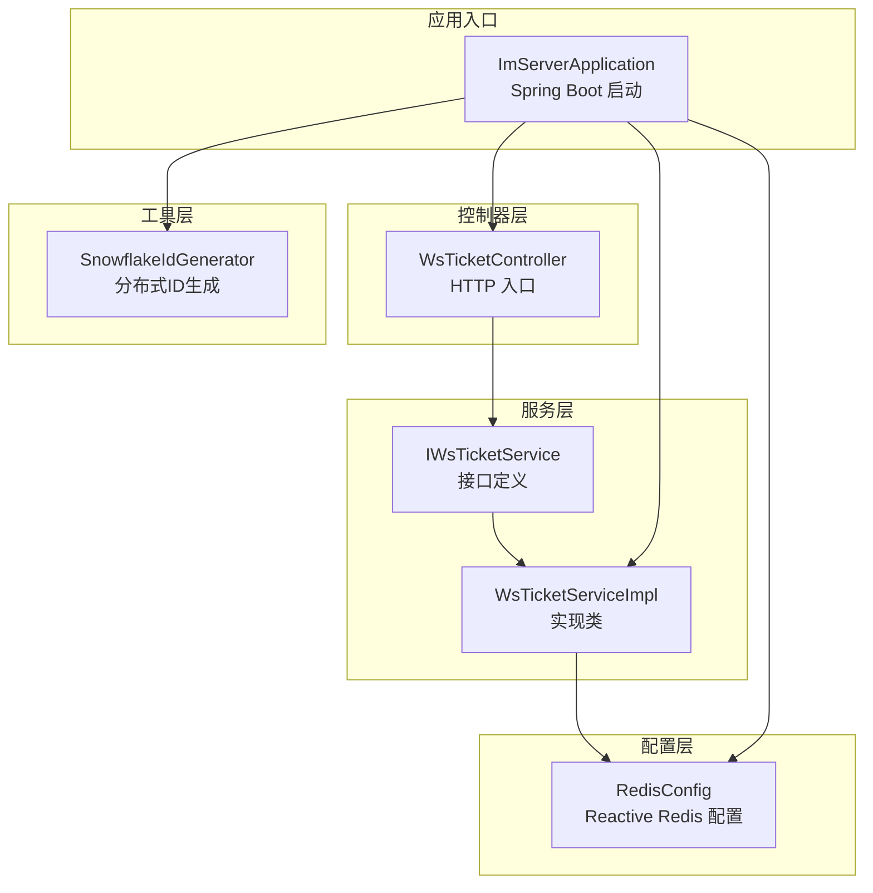
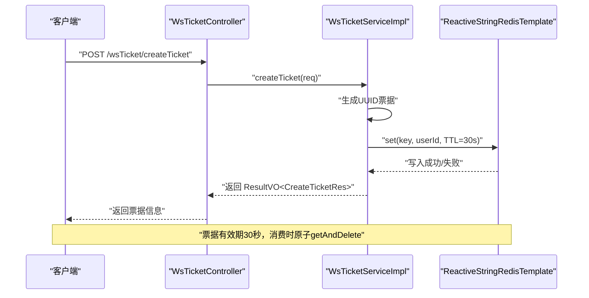
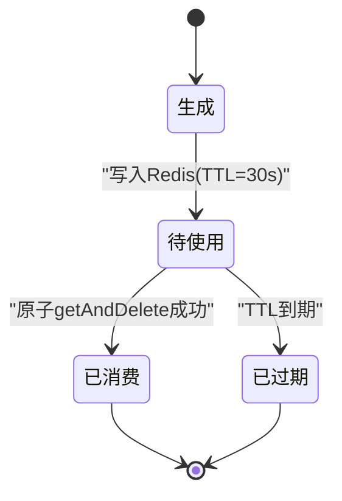
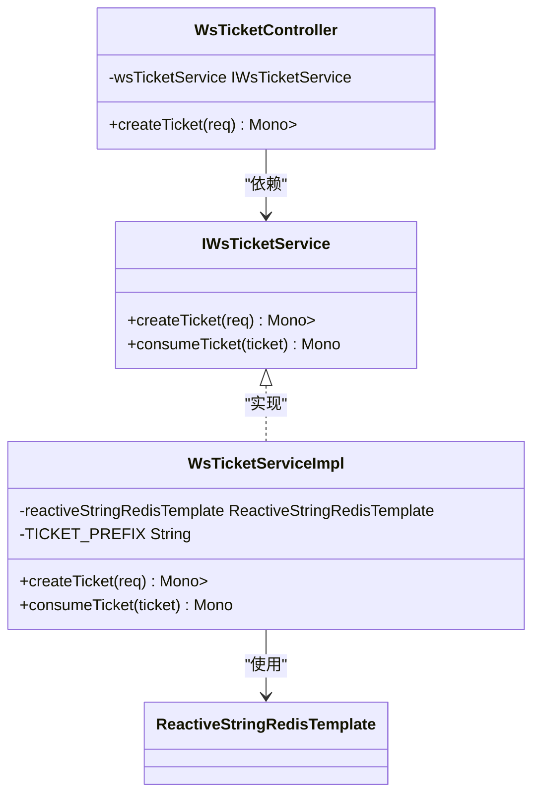
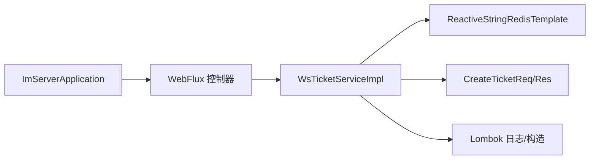

# 票据服务

<cite>
**本文引用的文件**
- [IWsTicketService.java](file://src/main/java/com/rivers/im/service/IWsTicketService.java)
- [WsTicketServiceImpl.java](file://src/main/java/com/rivers/im/service/impl/WsTicketServiceImpl.java)
- [WsTicketController.java](file://src/main/java/com/rivers/im/controller/WsTicketController.java)
- [RedisConfig.java](file://src/main/java/com/rivers/im/config/RedisConfig.java)
- [SnowflakeIdGenerator.java](file://src/main/java/com/rivers/im/util/SnowflakeIdGenerator.java)
- [ImServerApplication.java](file://src/main/java/com/rivers/im/ImServerApplication.java)
- [build.gradle](file://build.gradle)
</cite>

## 目录
1. [简介](#简介)
2. [项目结构](#项目结构)
3. [核心组件](#核心组件)
4. [架构总览](#架构总览)
5. [详细组件分析](#详细组件分析)
6. [依赖分析](#依赖分析)
7. [性能考量](#性能考量)
8. [故障排查指南](#故障排查指南)
9. [结论](#结论)
10. [附录](#附录)

## 简介
本文件面向“票据服务”模块，围绕 IWsTicketService 接口与 WsTicketServiceImpl 实现展开，系统化说明票据生成算法、唯一性与安全性保障、存储策略、过期时间管理与自动清理机制、票据生命周期管理、并发安全与性能优化建议，并给出实际使用路径与最佳实践指引。该模块采用响应式编程模型（WebFlux）与 Redis 原子操作，确保高并发下的稳定与一致性。

## 项目结构
票据服务位于 IM 服务的后端工程中，采用分层架构：
- 控制器层：对外暴露 HTTP 接口，负责请求接收与结果封装
- 服务层：定义票据服务接口与具体实现，负责业务逻辑与数据持久化
- 配置层：Redis 响应式连接与监听容器配置
- 工具层：分布式 ID 生成器（Snowflake），用于需要全局唯一 ID 的场景
- 应用入口：Spring Boot 启动类

图表来源
- [WsTicketController.java:1-26](file://src/main/java/com/rivers/im/controller/WsTicketController.java#L1-L26)
- [IWsTicketService.java:1-14](file://src/main/java/com/rivers/im/service/IWsTicketService.java#L1-L14)
- [WsTicketServiceImpl.java:1-55](file://src/main/java/com/rivers/im/service/impl/WsTicketServiceImpl.java#L1-L55)
- [RedisConfig.java:1-18](file://src/main/java/com/rivers/im/config/RedisConfig.java#L1-L18)
- [SnowflakeIdGenerator.java:1-69](file://src/main/java/com/rivers/im/util/SnowflakeIdGenerator.java#L1-L69)
- [ImServerApplication.java:1-14](file://src/main/java/com/rivers/im/ImServerApplication.java#L1-L14)

章节来源
- [build.gradle:31-45](file://build.gradle#L31-L45)

## 核心组件
- 接口定义：IWsTicketService
  - 提供两个核心方法：
    - 创建票据：createTicket(CreateTicketReq) → Mono<ResultVO<CreateTicketRes>>
    - 消费票据：consumeTicket(String ticket) → Mono<String>
- 实现类：WsTicketServiceImpl
  - 使用响应式 Redis 模板进行原子操作
  - 采用 UUID 生成票据字符串，设置 TTL 为 30 秒
  - 消费票据时通过原子 getAndDelete 获取用户 ID 并移除键
- 控制器：WsTicketController
  - 对外暴露 HTTP 接口 wsTicket/createTicket，转发至服务层
- 配置：RedisConfig
  - 提供 ReactiveRedisMessageListenerContainer Bean，支撑响应式消息监听
- 工具：SnowflakeIdGenerator
  - 分布式 ID 生成器，可用于需要全局唯一 ID 的扩展场景

章节来源
- [IWsTicketService.java:8-13](file://src/main/java/com/rivers/im/service/IWsTicketService.java#L8-L13)
- [WsTicketServiceImpl.java:20-54](file://src/main/java/com/rivers/im/service/impl/WsTicketServiceImpl.java#L20-L54)
- [WsTicketController.java:17-25](file://src/main/java/com/rivers/im/controller/WsTicketController.java#L17-L25)
- [RedisConfig.java:9-18](file://src/main/java/com/rivers/im/config/RedisConfig.java#L9-L18)
- [SnowflakeIdGenerator.java:7-69](file://src/main/java/com/rivers/im/util/SnowflakeIdGenerator.java#L7-L69)

## 架构总览
票据服务采用“请求-响应式服务-Redis”的典型架构，控制器接收请求后调用服务层，服务层通过响应式 Redis 完成票据的创建与消费，消费时利用原子删除确保并发安全。

图表来源
- [WsTicketController.java:21-24](file://src/main/java/com/rivers/im/controller/WsTicketController.java#L21-L24)
- [WsTicketServiceImpl.java:27-48](file://src/main/java/com/rivers/im/service/impl/WsTicketServiceImpl.java#L27-L48)
- [WsTicketServiceImpl.java:50-53](file://src/main/java/com/rivers/im/service/impl/WsTicketServiceImpl.java#L50-L53)

## 详细组件分析

### 接口设计与职责边界
- 职责分离清晰：
  - 接口仅声明票据生命周期关键操作，便于替换实现与测试
  - 实现类专注 Redis 原子操作与错误处理
- 返回类型统一：
  - 使用 Reactor Mono 封装异步结果，便于链式组合与背压控制
  - 统一返回 ResultVO 包裹业务结果，便于前端统一处理

章节来源
- [IWsTicketService.java:8-13](file://src/main/java/com/rivers/im/service/IWsTicketService.java#L8-L13)

### 票据生成算法与唯一性保证
- 票据生成策略
  - 使用 UUID 随机字符串，去除连字符，形成紧凑的票据标识
  - 通过随机性与长度（约 32 字符）在合理范围内避免碰撞
- 唯一性与冲突处理
  - 当前实现未显式检查重复；若需更强唯一性，可在写入前增加幂等校验或使用 Redis SET key value NX EX ttl
  - 若发生冲突，可回退重试或采用带前缀的复合键策略

章节来源
- [WsTicketServiceImpl.java:27-32](file://src/main/java/com/rivers/im/service/impl/WsTicketServiceImpl.java#L27-L32)

### 安全性考虑
- 传输安全
  - 建议通过 HTTPS 与网关鉴权保护票据接口
- 存储安全
  - 票据仅存放于内存数据库（Redis），不落盘
  - TTL 限制票据有效期，降低泄露风险
- 使用安全
  - 消费票据采用原子 getAndDelete，避免并发竞争导致的重复消费
  - 消费成功后立即失效，防止二次使用

章节来源
- [WsTicketServiceImpl.java:31-32](file://src/main/java/com/rivers/im/service/impl/WsTicketServiceImpl.java#L31-L32)
- [WsTicketServiceImpl.java:50-53](file://src/main/java/com/rivers/im/service/impl/WsTicketServiceImpl.java#L50-L53)

### 票据存储策略与过期管理
- 键空间设计
  - 使用统一前缀 ws:ticket: + 票据字符串，便于批量清理与命名规范
- TTL 设置
  - 默认 30 秒，短 TTL 降低长期暴露风险
- 过期清理
  - Redis 自动过期清理，无需额外扫描任务
- 并发消费
  - getAndDelete 原子操作，确保同一票据不会被多个消费者同时取走

章节来源
- [WsTicketServiceImpl.java:24](file://src/main/java/com/rivers/im/service/impl/WsTicketServiceImpl.java#L24)
- [WsTicketServiceImpl.java:31-32](file://src/main/java/com/rivers/im/service/impl/WsTicketServiceImpl.java#L31-L32)
- [WsTicketServiceImpl.java:50-53](file://src/main/java/com/rivers/im/service/impl/WsTicketServiceImpl.java#L50-L53)

### 票据生命周期管理
- 生成阶段
  - 生成票据 → 写入 Redis（TTL=30s）→ 返回给客户端
- 使用阶段
  - 客户端携带票据发起握手请求
  - 服务端消费票据（原子 getAndDelete）→ 获取用户 ID
- 失效阶段
  - 未使用或超时自动过期
  - 成功消费后立即失效，无法再次使用

图表来源
- [WsTicketServiceImpl.java:27-48](file://src/main/java/com/rivers/im/service/impl/WsTicketServiceImpl.java#L27-L48)
- [WsTicketServiceImpl.java:50-53](file://src/main/java/com/rivers/im/service/impl/WsTicketServiceImpl.java#L50-L53)

### 并发安全与错误处理
- 并发安全
  - getAndDelete 原子性：同一票据在同一时刻只能被一个消费者取走
  - setNX 可选增强：如需更强幂等，可在写入前使用 NX 参数
- 错误处理
  - 写入失败：记录日志并返回通用错误提示
  - 异常兜底：onErrorResume 统一捕获异常，避免上游中断
  - 消费失败：返回空值表示票据不存在或已过期

章节来源
- [WsTicketServiceImpl.java:33-47](file://src/main/java/com/rivers/im/service/impl/WsTicketServiceImpl.java#L33-L47)
- [WsTicketServiceImpl.java:50-53](file://src/main/java/com/rivers/im/service/impl/WsTicketServiceImpl.java#L50-L53)

### 类图与依赖关系

图表来源
- [IWsTicketService.java:8-13](file://src/main/java/com/rivers/im/service/IWsTicketService.java#L8-L13)
- [WsTicketServiceImpl.java:20-54](file://src/main/java/com/rivers/im/service/impl/WsTicketServiceImpl.java#L20-L54)
- [WsTicketController.java:17-25](file://src/main/java/com/rivers/im/controller/WsTicketController.java#L17-L25)

## 依赖分析
- 技术栈
  - Spring WebFlux：响应式 HTTP 处理
  - Spring Data Redis Reactive：响应式 Redis 访问
  - Lombok：简化 POJO 与日志
  - Protobuf：CreateTicketReq/Res 等消息定义
- 关键依赖
  - ReactiveStringRedisTemplate：提供原子 set/get/del 操作
  - ResultVO：统一响应包装
- 配置要点
  - RedisConfig 提供响应式监听容器 Bean
  - 应用启动类启用 Spring Boot 自动装配

图表来源
- [build.gradle:31-45](file://build.gradle#L31-L45)
- [ImServerApplication.java:6-11](file://src/main/java/com/rivers/im/ImServerApplication.java#L6-L11)
- [RedisConfig.java:13-17](file://src/main/java/com/rivers/im/config/RedisConfig.java#L13-L17)

章节来源
- [build.gradle:31-45](file://build.gradle#L31-L45)
- [RedisConfig.java:9-18](file://src/main/java/com/rivers/im/config/RedisConfig.java#L9-L18)

## 性能考量
- 响应式优势
  - 非阻塞 I/O，适合高并发场景
  - 背压与流控，避免资源耗尽
- Redis 本地化
  - 将票据存放在内存数据库，读写延迟低
- TTL 策略
  - 短 TTL 降低缓存占用与过期扫描压力
- 并发优化建议
  - 消费前可增加幂等键（如基于用户 ID 的一次性令牌）以进一步降低冲突概率
  - 在高并发下，可考虑对不同用户维度做分区键，减少热点
- 监控与告警
  - 监控 Redis 写入成功率与消费失败率
  - 观察响应时间分布，识别慢查询

## 故障排查指南
- 常见问题定位
  - 写入失败：检查 Redis 连接状态与权限；查看服务日志中的错误堆栈
  - 消费失败：确认票据是否已过期或已被其他实例消费
  - 并发冲突：观察是否存在大量重复消费尝试，必要时引入幂等键
- 日志与追踪
  - 服务层已记录关键错误日志，便于快速定位
  - 建议在控制器层增加请求级 TraceId，便于端到端追踪

章节来源
- [WsTicketServiceImpl.java:41-47](file://src/main/java/com/rivers/im/service/impl/WsTicketServiceImpl.java#L41-L47)
- [WsTicketServiceImpl.java:50-53](file://src/main/java/com/rivers/im/service/impl/WsTicketServiceImpl.java#L50-L53)

## 结论
票据服务通过简洁的接口与响应式实现，结合 Redis 原子操作，实现了高并发下的安全票据发放与消费。其短 TTL 设计与原子消费机制有效降低了泄露与并发冲突风险。建议在生产环境中配合 HTTPS、鉴权与监控体系，持续优化并发与可用性。

## 附录

### 使用路径与最佳实践
- 接口调用路径
  - 控制器入口：POST /wsTicket/createTicket
  - 请求体：CreateTicketReq（包含登录用户信息）
  - 返回体：ResultVO<CreateTicketRes>（包含票据字符串）
- 最佳实践
  - 客户端收到票据后尽快使用，避免超时
  - 服务端消费票据后立即建立会话，减少中间态
  - 如需更强幂等，可在写入前增加幂等键或使用 setNX
  - 对高并发场景，建议引入限流与熔断策略

章节来源
- [WsTicketController.java:21-24](file://src/main/java/com/rivers/im/controller/WsTicketController.java#L21-L24)
- [WsTicketServiceImpl.java:27-48](file://src/main/java/com/rivers/im/service/impl/WsTicketServiceImpl.java#L27-L48)
- [WsTicketServiceImpl.java:50-53](file://src/main/java/com/rivers/im/service/impl/WsTicketServiceImpl.java#L50-L53)