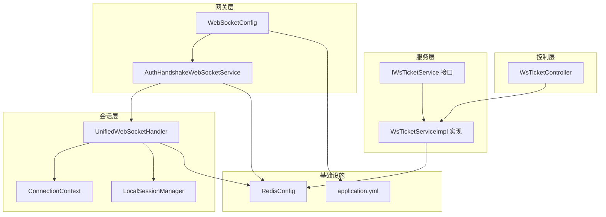
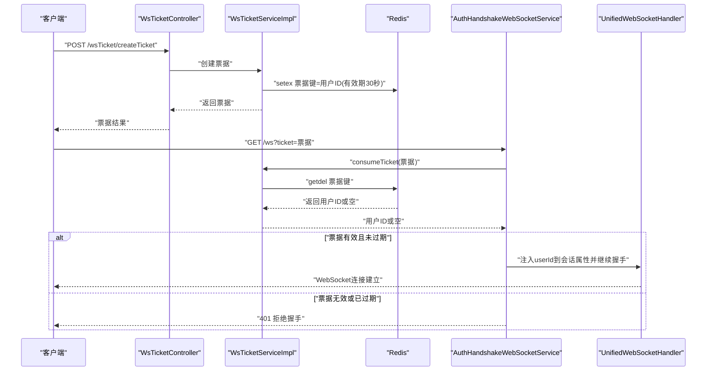
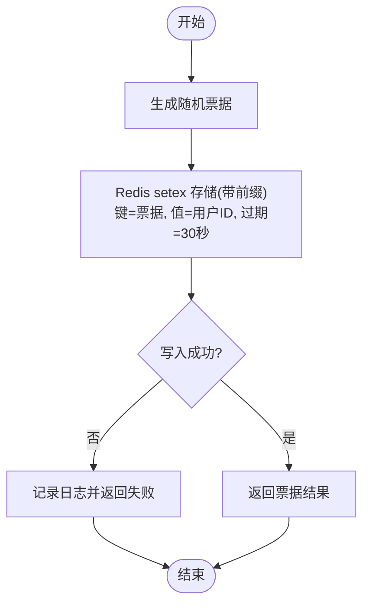
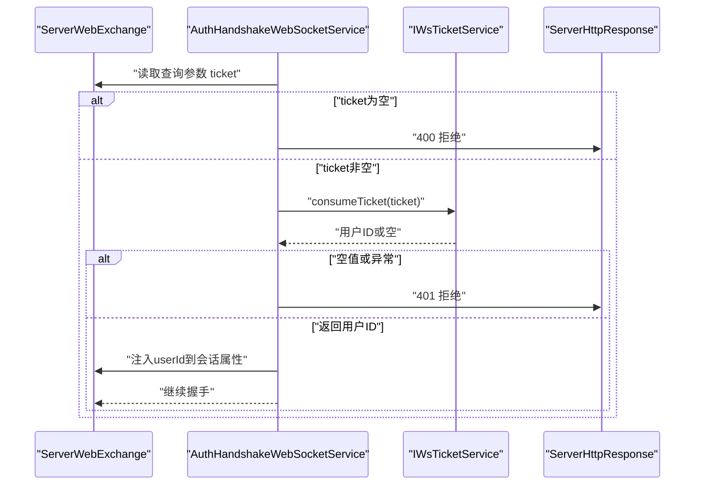
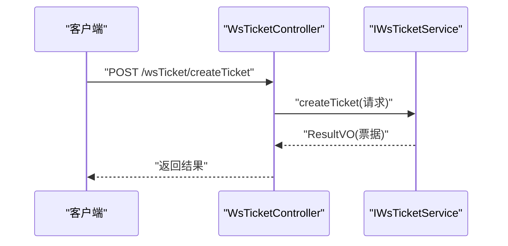
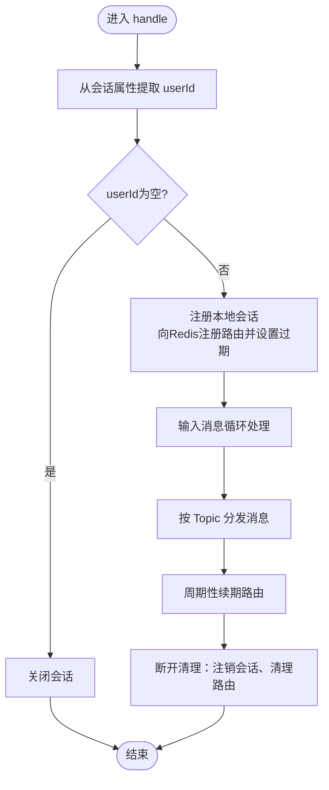
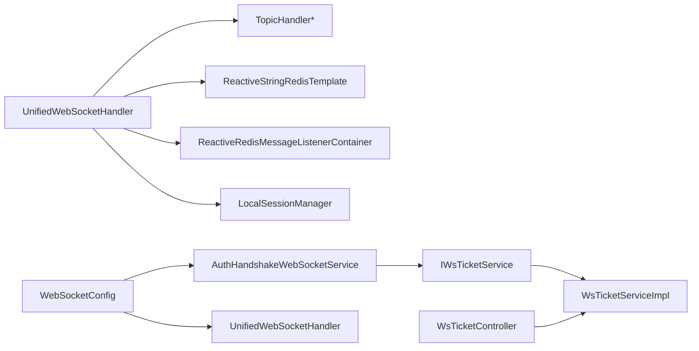

# 认证授权系统

<cite>
**本文引用的文件**
- [IWsTicketService.java](file://src/main/java/com/rivers/im/service/IWsTicketService.java)
- [WsTicketServiceImpl.java](file://src/main/java/com/rivers/im/service/impl/WsTicketServiceImpl.java)
- [AuthHandshakeWebSocketService.java](file://src/main/java/com/rivers/im/service/impl/AuthHandshakeWebSocketService.java)
- [WsTicketController.java](file://src/main/java/com/rivers/im/controller/WsTicketController.java)
- [WebSocketConfig.java](file://src/main/java/com/rivers/im/config/WebSocketConfig.java)
- [UnifiedWebSocketHandler.java](file://src/main/java/com/rivers/im/config/UnifiedWebSocketHandler.java)
- [ConnectionContext.java](file://src/main/java/com/rivers/im/context/ConnectionContext.java)
- [LocalSessionManager.java](file://src/main/java/com/rivers/im/manage/LocalSessionManager.java)
- [RedisConfig.java](file://src/main/java/com/rivers/im/config/RedisConfig.java)
- [application.yml](file://src/main/resources/application.yml)
</cite>

## 目录
1. [引言](#引言)
2. [项目结构](#项目结构)
3. [核心组件](#核心组件)
4. [架构总览](#架构总览)
5. [详细组件分析](#详细组件分析)
6. [依赖分析](#依赖分析)
7. [性能考虑](#性能考虑)
8. [故障排查指南](#故障排查指南)
9. [结论](#结论)
10. [附录](#附录)

## 引言
本文件面向认证授权系统，聚焦以下目标：
- 深入解释 IWsTicketService 的票据管理机制：票据生成、验证与过期处理策略
- 详细分析 AuthHandshakeWebSocketService 的握手认证实现：认证流程、安全验证与会话绑定
- 阐述 WsTicketController 的 REST API 设计：票据获取接口、验证接口与刷新机制
- 提供安全最佳实践：防重放攻击、会话劫持防护与权限控制策略

## 项目结构
系统采用分层与职责分离的设计：
- 控制层：WsTicketController 提供票据获取接口
- 服务层：IWsTicketService 定义票据能力；WsTicketServiceImpl 基于 Redis 实现票据生成与消费
- 网关层：AuthHandshakeWebSocketService 自定义握手认证，拦截 WebSocket 握手请求
- 会话层：UnifiedWebSocketHandler 负责建立会话、路由与心跳续期；ConnectionContext 与 LocalSessionManager 管理会话生命周期
- 配置层：WebSocketConfig 注册自定义握手服务；RedisConfig 提供 Redis 监听容器；application.yml 提供基础运行参数

图表来源
- [WebSocketConfig.java:22-34](file://src/main/java/com/rivers/im/config/WebSocketConfig.java#L22-L34)
- [AuthHandshakeWebSocketService.java:22-55](file://src/main/java/com/rivers/im/service/impl/AuthHandshakeWebSocketService.java#L22-L55)
- [WsTicketController.java:14-24](file://src/main/java/com/rivers/im/controller/WsTicketController.java#L14-L24)
- [WsTicketServiceImpl.java:20-54](file://src/main/java/com/rivers/im/service/impl/WsTicketServiceImpl.java#L20-L54)
- [UnifiedWebSocketHandler.java:38-122](file://src/main/java/com/rivers/im/config/UnifiedWebSocketHandler.java#L38-L122)
- [ConnectionContext.java:8-24](file://src/main/java/com/rivers/im/context/ConnectionContext.java#L8-L24)
- [LocalSessionManager.java:12-43](file://src/main/java/com/rivers/im/manage/LocalSessionManager.java#L12-L43)
- [RedisConfig.java:9-18](file://src/main/java/com/rivers/im/config/RedisConfig.java#L9-L18)
- [application.yml:1-14](file://src/main/resources/application.yml#L1-L14)

章节来源
- [WebSocketConfig.java:13-35](file://src/main/java/com/rivers/im/config/WebSocketConfig.java#L13-L35)
- [application.yml:1-14](file://src/main/resources/application.yml#L1-L14)

## 核心组件
- IWsTicketService：定义票据创建与消费两个核心能力，返回响应式结果，便于异步与非阻塞处理
- WsTicketServiceImpl：基于 Redis 的响应式实现，票据键带有前缀，有效期短（秒级），消费时原子删除，防止重放
- AuthHandshakeWebSocketService：自定义握手服务，在握手阶段从查询参数提取票据，调用票据服务进行验证，通过后将用户标识注入会话属性
- WsTicketController：提供票据创建接口，接收登录用户信息，返回票据
- UnifiedWebSocketHandler：建立会话、注册路由、心跳续期、消息分发与清理
- ConnectionContext 与 LocalSessionManager：封装会话上下文、多播输出通道与本地会话注册/注销
- WebSocketConfig：注册 WebSocket 映射与自定义握手适配器
- RedisConfig：提供 Redis 监听容器 Bean，支撑跨节点消息与路由表维护

章节来源
- [IWsTicketService.java:8-13](file://src/main/java/com/rivers/im/service/IWsTicketService.java#L8-L13)
- [WsTicketServiceImpl.java:20-54](file://src/main/java/com/rivers/im/service/impl/WsTicketServiceImpl.java#L20-L54)
- [AuthHandshakeWebSocketService.java:22-55](file://src/main/java/com/rivers/im/service/impl/AuthHandshakeWebSocketService.java#L22-L55)
- [WsTicketController.java:14-24](file://src/main/java/com/rivers/im/controller/WsTicketController.java#L14-L24)
- [UnifiedWebSocketHandler.java:38-122](file://src/main/java/com/rivers/im/config/UnifiedWebSocketHandler.java#L38-L122)
- [ConnectionContext.java:8-24](file://src/main/java/com/rivers/im/context/ConnectionContext.java#L8-L24)
- [LocalSessionManager.java:12-43](file://src/main/java/com/rivers/im/manage/LocalSessionManager.java#L12-L43)
- [WebSocketConfig.java:22-34](file://src/main/java/com/rivers/im/config/WebSocketConfig.java#L22-L34)
- [RedisConfig.java:9-18](file://src/main/java/com/rivers/im/config/RedisConfig.java#L9-L18)

## 架构总览
系统通过“票据驱动”的握手认证，将 WebSocket 会话与用户身份绑定，并以 Redis 作为票据存储与路由中心，实现高并发下的低延迟认证与消息投递。

图表来源
- [WsTicketController.java:21-24](file://src/main/java/com/rivers/im/controller/WsTicketController.java#L21-L24)
- [WsTicketServiceImpl.java:27-48](file://src/main/java/com/rivers/im/service/impl/WsTicketServiceImpl.java#L27-L48)
- [AuthHandshakeWebSocketService.java:27-55](file://src/main/java/com/rivers/im/service/impl/AuthHandshakeWebSocketService.java#L27-L55)
- [UnifiedWebSocketHandler.java:87-122](file://src/main/java/com/rivers/im/config/UnifiedWebSocketHandler.java#L87-L122)

## 详细组件分析

### 组件一：IWsTicketService 与 WsTicketServiceImpl（票据管理）
- 票据生成
  - 使用随机字符串生成唯一票据，绑定用户标识，存入 Redis 并设置短期过期时间（秒级）
  - 成功写入后返回票据；写入失败或异常时返回统一错误包装
- 票据验证与过期处理
  - 消费票据采用原子读取并删除，确保一次性使用，避免重放
  - 消费超时或异常均视为无效票据，拒绝握手
- 复杂度与性能
  - 写入与消费均为 O(1)，基于 Redis 单线程命令的原子性保障
  - 短有效期降低票据泄露风险，同时减少缓存占用

图表来源
- [WsTicketServiceImpl.java:27-48](file://src/main/java/com/rivers/im/service/impl/WsTicketServiceImpl.java#L27-L48)

章节来源
- [IWsTicketService.java:8-13](file://src/main/java/com/rivers/im/service/IWsTicketService.java#L8-L13)
- [WsTicketServiceImpl.java:20-54](file://src/main/java/com/rivers/im/service/impl/WsTicketServiceImpl.java#L20-L54)

### 组件二：AuthHandshakeWebSocketService（握手认证）
- 认证流程
  - 从请求查询参数提取票据，若为空直接拒绝
  - 调用票据服务消费票据，设置超时时间，空值分支拒绝握手
  - 成功后将用户 ID 注入 WebSocket 会话属性，交由默认握手服务完成后续握手
- 安全验证
  - 票据一次性使用（原子 getdel）避免重放
  - 短有效期（秒级）降低票据泄露窗口
  - 拒绝握手时优雅设置状态码，避免响应提交后的异常
- 会话绑定
  - 将用户 ID 写入会话属性，后续处理器可直接读取

图表来源
- [AuthHandshakeWebSocketService.java:26-55](file://src/main/java/com/rivers/im/service/impl/AuthHandshakeWebSocketService.java#L26-L55)

章节来源
- [AuthHandshakeWebSocketService.java:22-55](file://src/main/java/com/rivers/im/service/impl/AuthHandshakeWebSocketService.java#L22-L55)

### 组件三：WsTicketController（REST API 设计）
- 接口定义
  - 路径：/wsTicket/createTicket
  - 方法：POST
  - 请求体：包含登录用户信息的票据创建请求
  - 返回：统一结果对象，内含票据
- 设计要点
  - 响应式风格，与底层票据服务保持一致
  - 当前仅提供“创建票据”接口，未提供“验证票据”与“刷新票据”接口

图表来源
- [WsTicketController.java:21-24](file://src/main/java/com/rivers/im/controller/WsTicketController.java#L21-L24)

章节来源
- [WsTicketController.java:14-24](file://src/main/java/com/rivers/im/controller/WsTicketController.java#L14-L24)

### 组件四：会话与路由（UnifiedWebSocketHandler、ConnectionContext、LocalSessionManager）
- 会话建立
  - 从会话属性中提取用户 ID，若缺失则关闭连接
  - 注册本地会话上下文，向 Redis 注册路由表项并设置过期
- 消息分发
  - 输入流按顺序处理消息，根据 Topic 分发至对应处理器
  - 输出流将多播消息转换为文本消息发送
- 心跳与清理
  - 周期性续期路由表，维持会话活跃
  - 断开时清理路由与资源

图表来源
- [UnifiedWebSocketHandler.java:87-122](file://src/main/java/com/rivers/im/config/UnifiedWebSocketHandler.java#L87-L122)
- [ConnectionContext.java:14-24](file://src/main/java/com/rivers/im/context/ConnectionContext.java#L14-L24)
- [LocalSessionManager.java:17-42](file://src/main/java/com/rivers/im/manage/LocalSessionManager.java#L17-L42)

章节来源
- [UnifiedWebSocketHandler.java:38-122](file://src/main/java/com/rivers/im/config/UnifiedWebSocketHandler.java#L38-L122)
- [ConnectionContext.java:8-24](file://src/main/java/com/rivers/im/context/ConnectionContext.java#L8-L24)
- [LocalSessionManager.java:12-43](file://src/main/java/com/rivers/im/manage/LocalSessionManager.java#L12-L43)

### 组件五：WebSocket 配置与 Redis 监听
- WebSocket 映射
  - 将 /ws 映射到统一处理器，优先级高于其他映射
  - 注入自定义握手服务，实现票据认证
- Redis 监听
  - 提供 ReactiveRedisMessageListenerContainer Bean，用于跨节点消息订阅
  - 统一处理器在初始化时订阅当前节点频道，销毁时取消订阅

章节来源
- [WebSocketConfig.java:22-34](file://src/main/java/com/rivers/im/config/WebSocketConfig.java#L22-L34)
- [RedisConfig.java:13-18](file://src/main/java/com/rivers/im/config/RedisConfig.java#L13-L18)

## 依赖分析
- 组件耦合
  - AuthHandshakeWebSocketService 依赖 IWsTicketService，耦合度低，便于替换实现
  - UnifiedWebSocketHandler 依赖多个组件（路由处理器、Redis 模板、监听容器、会话管理器），但通过构造注入保持清晰边界
- 外部依赖
  - Redis 提供票据存储、路由注册与心跳续期
  - 响应式栈（Spring WebFlux）贯穿票据服务与会话处理，提升吞吐与弹性
- 循环依赖规避
  - WebSocketConfig 仅持有处理器实例，不反向依赖处理器，避免循环

图表来源
- [AuthHandshakeWebSocketService.java:24](file://src/main/java/com/rivers/im/service/impl/AuthHandshakeWebSocketService.java#L24)
- [WsTicketController.java:19](file://src/main/java/com/rivers/im/controller/WsTicketController.java#L19)
- [UnifiedWebSocketHandler.java:50-64](file://src/main/java/com/rivers/im/config/UnifiedWebSocketHandler.java#L50-L64)
- [WebSocketConfig.java:20-33](file://src/main/java/com/rivers/im/config/WebSocketConfig.java#L20-33)

章节来源
- [AuthHandshakeWebSocketService.java:22-55](file://src/main/java/com/rivers/im/service/impl/AuthHandshakeWebSocketService.java#L22-L55)
- [WsTicketController.java:14-24](file://src/main/java/com/rivers/im/controller/WsTicketController.java#L14-L24)
- [UnifiedWebSocketHandler.java:38-122](file://src/main/java/com/rivers/im/config/UnifiedWebSocketHandler.java#L38-L122)
- [WebSocketConfig.java:13-35](file://src/main/java/com/rivers/im/config/WebSocketConfig.java#L13-L35)

## 性能考虑
- 响应式与非阻塞
  - 全链路采用 Reactor，减少线程阻塞，提高并发处理能力
- Redis 原子操作
  - 票据消费使用原子 getdel，避免竞态与重复使用
- 路由与心跳
  - 路由表定期续期，结合心跳机制维持会话活跃，降低无效连接占用
- 资源释放
  - 会话断开时清理路由与多播通道，避免内存泄漏

## 故障排查指南
- 握手被拒绝
  - 检查查询参数是否包含有效的非空票据
  - 查看票据是否已过期或已被消费
  - 关注拒绝握手时的日志与状态码
- 票据创建失败
  - 检查 Redis 写入是否成功与网络连通性
  - 观察服务端异常日志
- 会话无法建立
  - 确认会话属性中 userId 是否正确注入
  - 检查路由注册与心跳续期是否正常
- 跨节点消息不可达
  - 确认 Redis 监听容器是否启动与订阅是否成功
  - 检查节点频道命名与当前服务器标识

章节来源
- [AuthHandshakeWebSocketService.java:30-43](file://src/main/java/com/rivers/im/service/impl/AuthHandshakeWebSocketService.java#L30-L43)
- [WsTicketServiceImpl.java:44-47](file://src/main/java/com/rivers/im/service/impl/WsTicketServiceImpl.java#L44-L47)
- [UnifiedWebSocketHandler.java:90-94](file://src/main/java/com/rivers/im/config/UnifiedWebSocketHandler.java#L90-L94)
- [RedisConfig.java:13-18](file://src/main/java/com/rivers/im/config/RedisConfig.java#L13-L18)

## 结论
该认证授权系统以“票据+Redis+响应式”为核心，实现了低延迟、高并发的 WebSocket 握手认证与会话管理。票据生成与消费的原子性与短期有效期有效降低了重放与劫持风险；统一的会话与路由机制保障了消息可达与资源可控。建议在现有基础上扩展“票据验证”与“刷新”接口，进一步完善生命周期管理。

## 附录
- 安全最佳实践
  - 防重放攻击：票据一次性消费（原子 getdel）、短期有效期、严格超时控制
  - 会话劫持防护：票据与用户绑定、会话属性注入、心跳续期与路由校验
  - 权限控制策略：在消息分发前基于用户 ID 与 Topic 进行细粒度权限检查
- 扩展建议
  - 新增票据验证接口：对外暴露票据有效性校验，便于前端预检
  - 新增票据刷新接口：在接近过期时允许刷新，延长会话可用时间
  - 引入签名与随机数：在票据中加入时间戳与随机数，增强抗重放能力