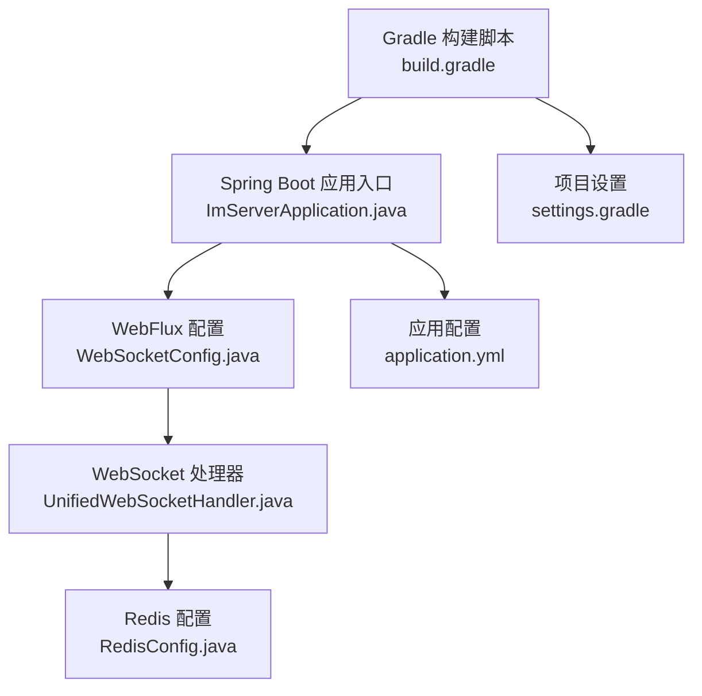
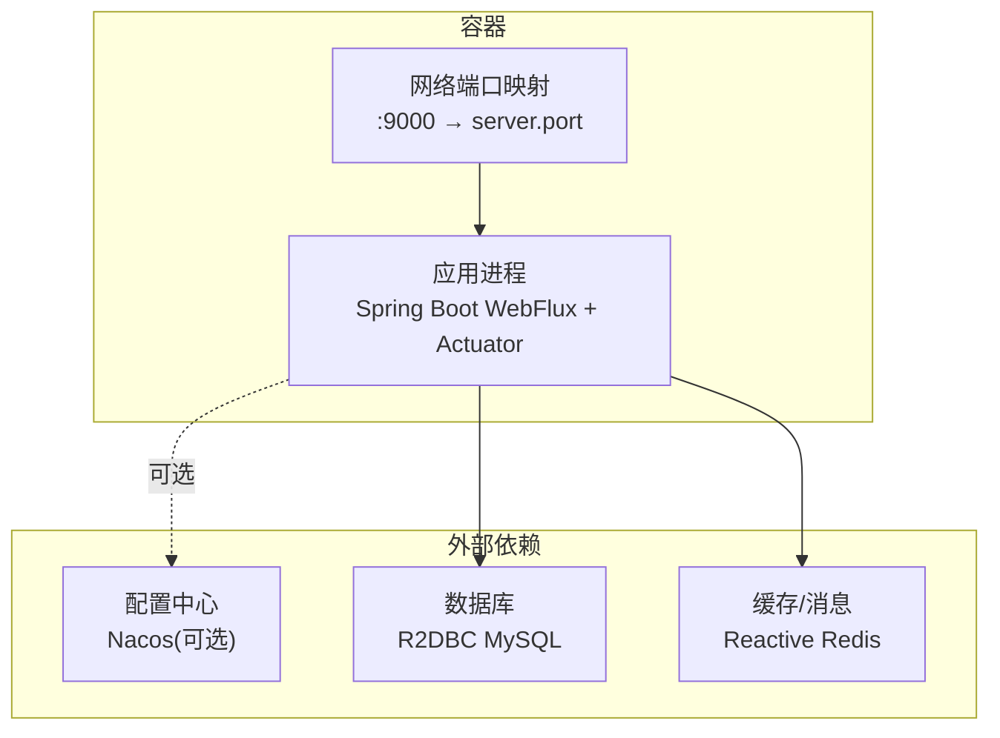
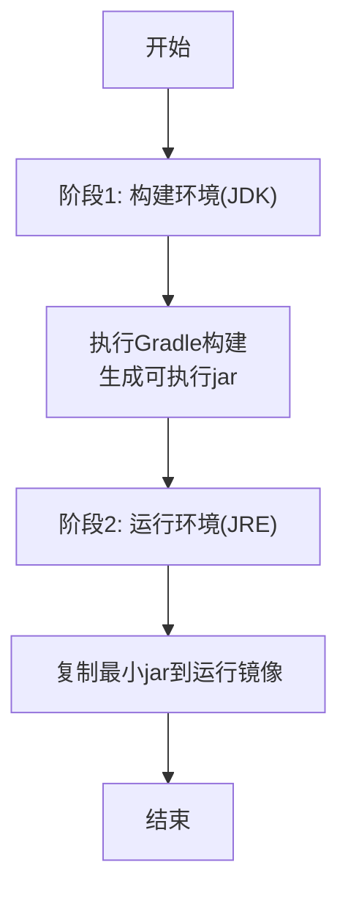
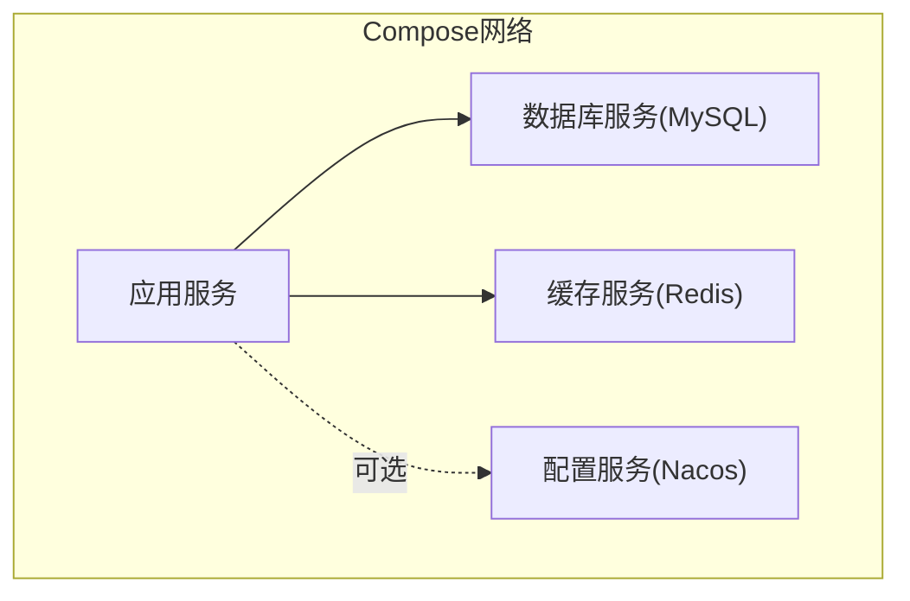
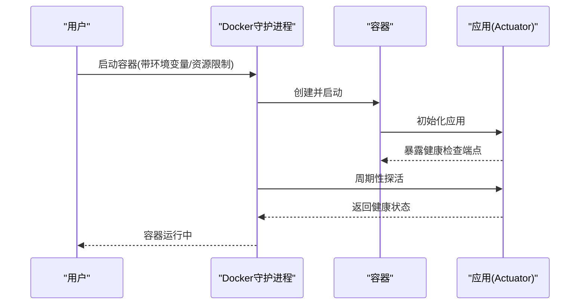
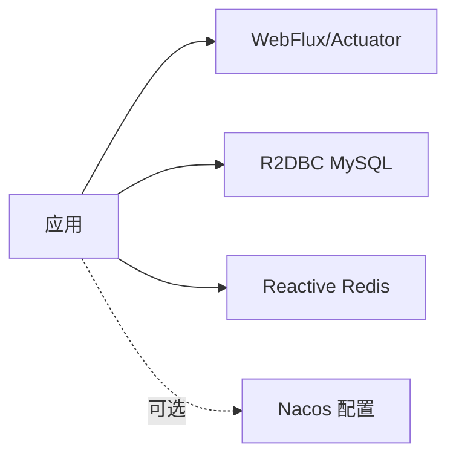

# Docker容器化

<cite>
**本文引用的文件**
- [build.gradle](file://build.gradle)
- [settings.gradle](file://settings.gradle)
- [application.yml](file://src/main/resources/application.yml)
- [ImServerApplication.java](file://src/main/java/com/rivers/im/ImServerApplication.java)
- [RedisConfig.java](file://src/main/java/com/rivers/im/config/RedisConfig.java)
- [WebSocketConfig.java](file://src/main/java/com/rivers/im/config/WebSocketConfig.java)
- [UnifiedWebSocketHandler.java](file://src/main/java/com/rivers/im/config/UnifiedWebSocketHandler.java)
- [HELP.md](file://HELP.md)
</cite>

## 目录
1. [简介](#简介)
2. [项目结构](#项目结构)
3. [核心组件](#核心组件)
4. [架构总览](#架构总览)
5. [详细组件分析](#详细组件分析)
6. [依赖分析](#依赖分析)
7. [性能考虑](#性能考虑)
8. [故障排查指南](#故障排查指南)
9. [结论](#结论)
10. [附录](#附录)

## 简介
本文件面向IM服务器（基于Spring Boot 4与WebFlux）的Docker容器化部署，提供从镜像构建到服务编排、运行参数、健康检查、日志与安全的最佳实践。该应用采用响应式栈、R2DBC数据库连接、Reactive Redis以及WebSocket网关，具备跨节点消息推送能力，适合在容器环境中通过Compose进行多实例编排。

## 项目结构
- 构建系统：Gradle（插件含Spring Boot与依赖管理）
- 运行时：Java Toolchain指定版本，Spring Boot启动入口
- 配置中心：Nacos导入配置（本地开发默认地址），服务端口在配置中声明
- 核心特性：WebFlux + WebSocket + R2DBC + Reactive Redis + Actuator

图表来源
- [build.gradle:1-64](file://build.gradle#L1-L64)
- [ImServerApplication.java:1-14](file://src/main/java/com/rivers/im/ImServerApplication.java#L1-L14)
- [WebSocketConfig.java:1-35](file://src/main/java/com/rivers/im/config/WebSocketConfig.java#L1-L35)
- [UnifiedWebSocketHandler.java:1-181](file://src/main/java/com/rivers/im/config/UnifiedWebSocketHandler.java#L1-L181)
- [RedisConfig.java:1-18](file://src/main/java/com/rivers/im/config/RedisConfig.java#L1-L18)
- [application.yml:1-14](file://src/main/resources/application.yml#L1-L14)
- [settings.gradle:1-2](file://settings.gradle#L1-L2)

章节来源
- [build.gradle:1-64](file://build.gradle#L1-L64)
- [settings.gradle:1-2](file://settings.gradle#L1-L2)
- [application.yml:1-14](file://src/main/resources/application.yml#L1-L14)
- [ImServerApplication.java:1-14](file://src/main/java/com/rivers/im/ImServerApplication.java#L1-L14)

## 核心组件
- 启动入口：Spring Boot应用主类负责引导容器化运行
- WebFlux与WebSocket：提供低延迟双向通信，支持心跳续期与跨节点消息
- 数据访问：R2DBC连接MySQL，Actuator暴露监控端点
- 缓存与消息：Reactive Redis用于会话路由与跨节点消息订阅
- 配置中心：通过Nacos导入运行时配置，便于集中管理

章节来源
- [ImServerApplication.java:1-14](file://src/main/java/com/rivers/im/ImServerApplication.java#L1-L14)
- [WebSocketConfig.java:1-35](file://src/main/java/com/rivers/im/config/WebSocketConfig.java#L1-L35)
- [UnifiedWebSocketHandler.java:1-181](file://src/main/java/com/rivers/im/config/UnifiedWebSocketHandler.java#L1-L181)
- [RedisConfig.java:1-18](file://src/main/java/com/rivers/im/config/RedisConfig.java#L1-L18)
- [application.yml:1-14](file://src/main/resources/application.yml#L1-L14)

## 架构总览
下图展示容器化部署视角下的应用与外部依赖交互：应用容器内运行Spring Boot，通过R2DBC访问MySQL，通过Reactive Redis与消息通道交互；Nacos作为配置中心在开发环境可本地运行。

图表来源
- [application.yml:13-14](file://src/main/resources/application.yml#L13-L14)
- [HELP.md:7-8](file://HELP.md#L7-L8)

## 详细组件分析

### Dockerfile编写与镜像构建
- 基础镜像选择：建议使用官方JRE镜像（如eclipse-temurin:21-jre-alpine）以减小体积
- 多阶段构建策略：
  - 第一阶段：使用完整JDK构建，启用Gradle缓存目录复用，产物为可执行jar
  - 第二阶段：仅拷贝第一阶段生成的最小jar，避免携带构建工具与依赖源码
- 产物与入口：
  - 使用Spring Boot Gradle插件生成OCI镜像或直接打包jar后复制至最终镜像
  - 容器入口命令指向java -jar，结合Dockerfile EXPOSE声明端口
- 镜像大小控制：
  - 使用精简基础镜像（alpine）
  - 清理包管理器缓存与构建中间文件
  - 合理分层，将变动较少的依赖层放在前面，提升缓存命中率

（本图为概念性流程示意，不对应具体源文件）

### Docker Compose服务编排
- 服务定义：单个应用服务，声明端口映射、环境变量、卷挂载与健康检查
- 网络配置：使用自定义桥接网络，确保服务间DNS解析与隔离
- 卷挂载：
  - 日志卷：将应用日志输出到宿主机目录，便于采集与持久化
  - 配置卷：挂载外部配置文件（如application.yml或Nacos配置）
- 依赖与启动顺序：通过healthcheck与init脚本实现依赖就绪检测

（本图为概念性编排示意，不对应具体源文件）

### 容器运行参数配置
- 环境变量传递：
  - 通过-D或环境变量覆盖server.port与Nacos地址等
  - 通过JAVA_TOOL_OPTIONS传入JVM参数（如堆大小、GC选项）
- 端口映射：将容器9000映射到宿主机随机或固定端口
- 资源限制：设置CPU与内存上限，保障多实例稳定运行
- 健康检查：利用Actuator健康端点探测应用状态
- 重启策略：设置unless-stopped或on-failure，结合健康检查自动恢复

（本图为概念性流程示意，不对应具体源文件）

### 容器健康检查与重启策略
- 健康检查：基于Actuator健康端点，周期性探测应用存活与依赖可用性
- 重启策略：根据业务SLA选择unless-stopped或on-failure，避免无限重启
- 故障恢复：结合日志与指标监控，触发自动扩缩容或替换

（本节为通用实践说明，不涉及具体源文件）

### 容器日志管理与调试
- 日志输出：应用标准输出/错误输出，配合卷挂载到宿主机统一收集
- 调试手段：进入容器执行ping/redis-cli/mysql命令验证连通性；查看应用日志定位问题
- 性能观测：结合Actuator指标与容器资源监控，识别瓶颈

（本节为通用实践说明，不涉及具体源文件）

### 容器安全与权限管理
- 最小权限原则：以非root用户运行容器，降低攻击面
- 只读根文件系统：禁用不必要的写入路径，减少持久化风险
- 秘钥与敏感配置：通过密文存储或环境注入，避免硬编码
- 网络隔离：使用独立网络命名空间与防火墙规则限制访问

（本节为通用实践说明，不涉及具体源文件）

## 依赖分析
- 构建与运行依赖：
  - Spring Boot 4 + Spring Cloud Bus AMQP
  - WebFlux + WebSocket + Actuator
  - R2DBC MySQL驱动 + Reactive Redis
- 配置导入：通过Nacos导入运行时配置，便于集中管理

图表来源
- [build.gradle:31-45](file://build.gradle#L31-L45)
- [application.yml:4-10](file://src/main/resources/application.yml#L4-L10)

章节来源
- [build.gradle:1-64](file://build.gradle#L1-L64)
- [application.yml:1-14](file://src/main/resources/application.yml#L1-L14)

## 性能考虑
- 响应式模型：充分利用WebFlux与Reactive Redis，降低阻塞与上下文切换开销
- 连接池与超时：合理配置R2DBC连接池大小与超时时间，避免资源耗尽
- 心跳与续期：WebSocket心跳与Redis路由过期策略需平衡实时性与资源占用
- JVM调优：通过环境变量设置堆大小、GC策略与线程池参数，结合容器资源限制

（本节为通用指导，不涉及具体源文件）

## 故障排查指南
- 启动失败：检查端口占用、依赖服务可达性与配置导入是否成功
- WebSocket异常：确认Redis订阅通道、路由键与心跳续期逻辑
- 数据库连接：验证R2DBC驱动与连接字符串，检查网络连通性
- 配置问题：核对Nacos地址与配置文件名，确保导入路径正确

章节来源
- [HELP.md:28-31](file://HELP.md#L28-L31)
- [application.yml:13-14](file://src/main/resources/application.yml#L13-L14)

## 结论
通过多阶段构建与精简基础镜像，结合Docker Compose的服务编排、健康检查与资源限制，可实现IM服务器的高效、稳定与可观测的容器化部署。配合Actuator与日志采集，能够快速定位问题并持续优化性能与安全性。

## 附录
- 关键配置要点
  - 端口：server.port=9000（可通过环境变量覆盖）
  - 配置中心：spring.cloud.nacos.config.server-addr与file-extension
  - 依赖：R2DBC驱动与Reactive Redis客户端
- 推荐实践
  - 使用Spring Boot Gradle插件生成OCI镜像或最小化jar
  - 在Compose中启用健康检查与重启策略
  - 将日志与配置通过卷挂载到宿主机，便于运维与审计

章节来源
- [HELP.md:7-8](file://HELP.md#L7-L8)
- [application.yml:1-14](file://src/main/resources/application.yml#L1-L14)
- [build.gradle:31-45](file://build.gradle#L31-L45)