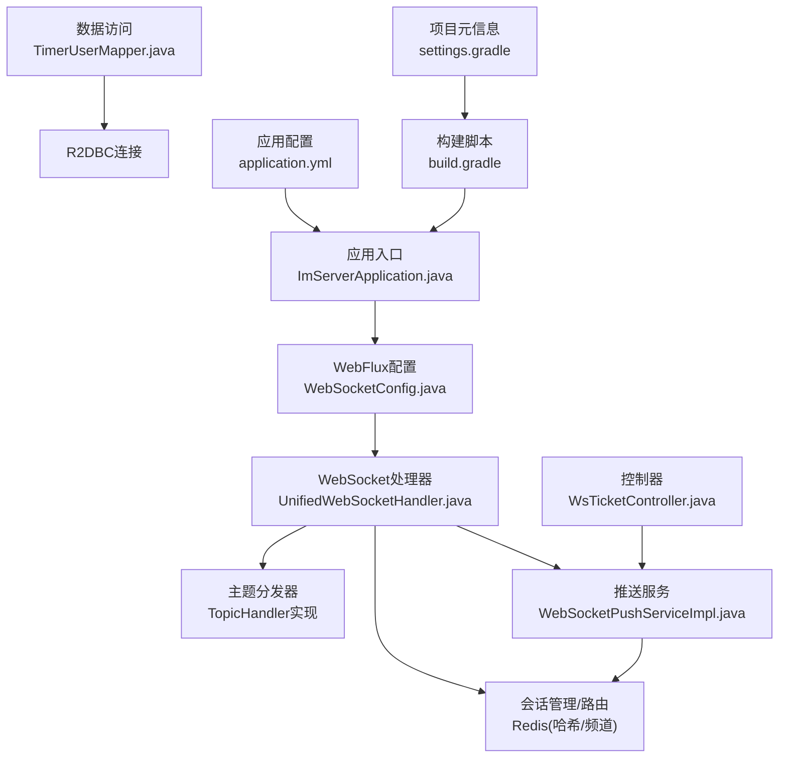
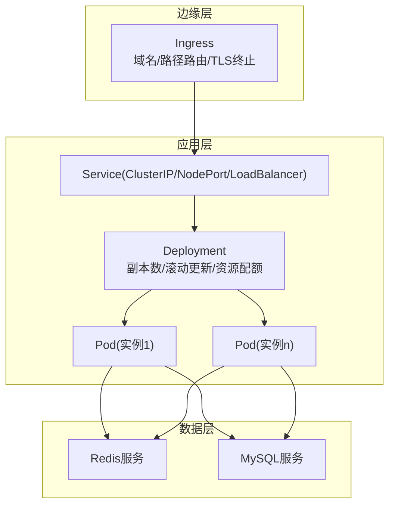
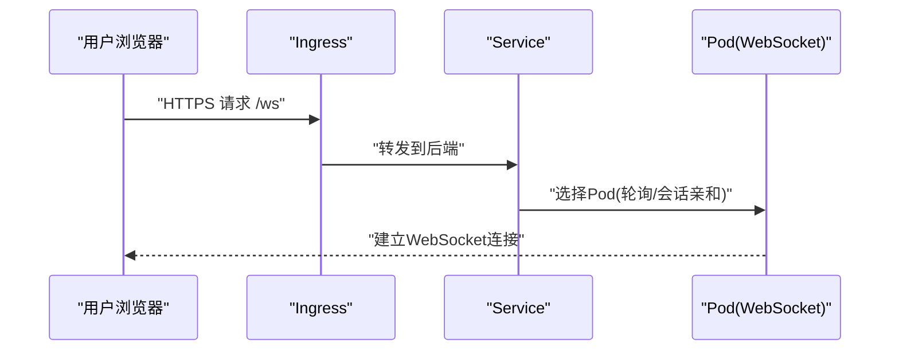
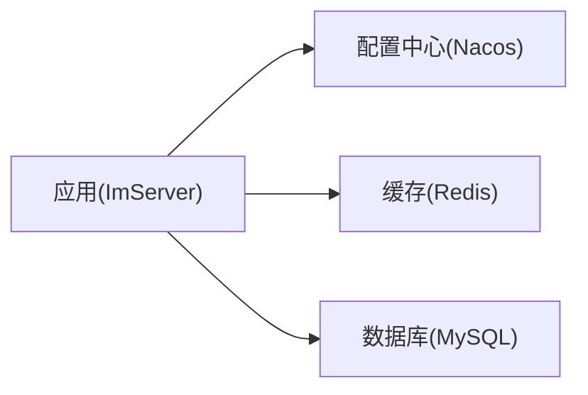
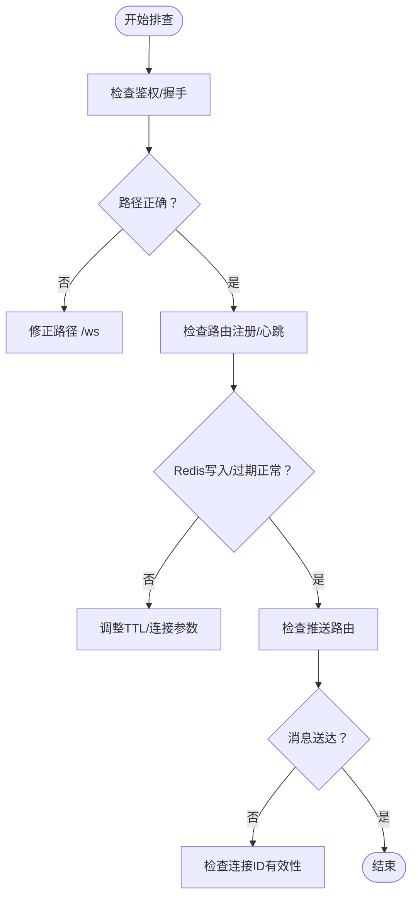

# Kubernetes部署

<cite>
**本文引用的文件**
- [application.yml](file://src/main/resources/application.yml)
- [build.gradle](file://build.gradle)
- [settings.gradle](file://settings.gradle)
- [ImServerApplication.java](file://src/main/java/com/rivers/im/ImServerApplication.java)
- [WebSocketConfig.java](file://src/main/java/com/rivers/im/config/WebSocketConfig.java)
- [UnifiedWebSocketHandler.java](file://src/main/java/com/rivers/im/config/UnifiedWebSocketHandler.java)
- [WebSocketPushServiceImpl.java](file://src/main/java/com/rivers/im/service/impl/WebSocketPushServiceImpl.java)
- [WsTicketController.java](file://src/main/java/com/rivers/im/controller/WsTicketController.java)
- [RedisConfig.java](file://src/main/java/com/rivers/im/config/RedisConfig.java)
- [TimerUserMapper.java](file://src/main/java/com/rivers/im/mapper/TimerUserMapper.java)
</cite>

## 目录
1. [简介](#简介)
2. [项目结构](#项目结构)
3. [核心组件](#核心组件)
4. [架构总览](#架构总览)
5. [详细组件分析](#详细组件分析)
6. [依赖关系分析](#依赖关系分析)
7. [性能考虑](#性能考虑)
8. [故障排查指南](#故障排查指南)
9. [结论](#结论)
10. [附录](#附录)

## 简介
本指南面向在Kubernetes中部署IM网关服务（基于Spring Boot WebFlux + WebSocket + Redis）的工程实践，围绕以下主题提供可操作的编排建议：Deployment配置（副本数、滚动更新策略、资源配额）、Service配置（ClusterIP/NodePort/LoadBalancer）、Ingress配置（域名路由/TLS终止/负载均衡）、ConfigMap与Secret管理、Helm Charts使用与自定义模板、Pod亲和性调度与污点容忍、命名空间与RBAC权限控制。

## 项目结构
该仓库为一个基于Gradle的Spring Boot应用，采用响应式WebFlux与WebSocket实现IM网关，使用Redis进行会话路由与跨节点消息推送，同时通过R2DBC访问MySQL。应用入口为Spring Boot启动类，WebSocket相关配置集中在配置类与处理器中，业务控制器提供票据接口。

**图表来源**
- [ImServerApplication.java:1-13](file://src/main/java/com/rivers/im/ImServerApplication.java#L1-L13)
- [WebSocketConfig.java:1-35](file://src/main/java/com/rivers/im/config/WebSocketConfig.java#L1-L35)
- [UnifiedWebSocketHandler.java:1-181](file://src/main/java/com/rivers/im/config/UnifiedWebSocketHandler.java#L1-L181)
- [WebSocketPushServiceImpl.java:1-74](file://src/main/java/com/rivers/im/service/impl/WebSocketPushServiceImpl.java#L1-L74)
- [WsTicketController.java:1-26](file://src/main/java/com/rivers/im/controller/WsTicketController.java#L1-L26)
- [TimerUserMapper.java:1-18](file://src/main/java/com/rivers/im/mapper/TimerUserMapper.java#L1-L18)
- [application.yml:1-14](file://src/main/resources/application.yml#L1-L14)
- [build.gradle:1-64](file://build.gradle#L1-L64)
- [settings.gradle:1-1](file://settings.gradle#L1-L1)

**章节来源**
- [ImServerApplication.java:1-13](file://src/main/java/com/rivers/im/ImServerApplication.java#L1-L13)
- [build.gradle:1-64](file://build.gradle#L1-L64)
- [settings.gradle:1-1](file://settings.gradle#L1-L1)
- [application.yml:1-14](file://src/main/resources/application.yml#L1-L14)

## 核心组件
- 应用入口与运行时
  - 启动类负责加载Spring上下文与自动配置。
  - 构建脚本声明了响应式WebFlux、WebSocket、Actuator、Redis Reactive、R2DBC等依赖。
- WebSocket网关
  - 配置类将/ws路径映射到统一处理器，握手阶段注入鉴权服务。
  - 统一处理器负责鉴权、会话注册、消息分发、心跳续期与清理。
- 推送与路由
  - 基于Redis哈希维护用户到连接ID的路由，支持跨节点消息转发。
  - 推送服务将消息封装为协议体后按路由投递。
- 控制器与数据访问
  - 提供WebSocket票据接口，用于客户端鉴权。
  - 使用R2DBC访问MySQL，提供响应式查询能力。

**章节来源**
- [ImServerApplication.java:1-13](file://src/main/java/com/rivers/im/ImServerApplication.java#L1-L13)
- [WebSocketConfig.java:1-35](file://src/main/java/com/rivers/im/config/WebSocketConfig.java#L1-L35)
- [UnifiedWebSocketHandler.java:1-181](file://src/main/java/com/rivers/im/config/UnifiedWebSocketHandler.java#L1-L181)
- [WebSocketPushServiceImpl.java:1-74](file://src/main/java/com/rivers/im/service/impl/WebSocketPushServiceImpl.java#L1-L74)
- [WsTicketController.java:1-26](file://src/main/java/com/rivers/im/controller/WsTicketController.java#L1-L26)
- [TimerUserMapper.java:1-18](file://src/main/java/com/rivers/im/mapper/TimerUserMapper.java#L1-L18)
- [build.gradle:31-45](file://build.gradle#L31-L45)

## 架构总览
下图展示应用在Kubernetes中的典型部署形态：前端通过Ingress接入，后端由Deployment提供多副本Pod，Service暴露内部网络；应用与Redis、MySQL通过服务名访问；Ingress负责TLS终止与HTTP路由。

[此图为概念性架构示意，不直接映射具体源码文件，故无“图表来源”]

## 详细组件分析

### Deployment配置
- 副本数设置
  - 建议副本数≥2以满足高可用与滚动更新期间的流量承载。
  - 结合水平Pod自动扩缩容（HPA）根据CPU/内存或自定义指标动态扩容。
- 滚动更新策略
  - 使用滚动更新，设置最大不可用与最大同时升级比例，保障服务连续性。
  - 在更新前执行就绪探针，避免将流量引入未完全启动的实例。
- 资源配额
  - 为容器设置requests/limits，优先为CPU密集型的WebSocket处理分配足够的CPU。
  - 对内存设置合理上限，避免GC压力导致延迟抖动。
- 就绪/存活探针
  - 就绪探针用于指示Pod是否可接收流量；存活探针用于容器自愈。
  - 可结合Actuator健康检查端点进行探针配置。

**章节来源**
- [build.gradle:36-40](file://build.gradle#L36-L40)
- [application.yml:13-14](file://src/main/resources/application.yml#L13-L14)

### Service配置
- ClusterIP
  - 默认集群内访问方式，适合同命名空间内的组件调用。
- NodePort
  - 在开发/测试环境快速暴露服务，便于本地调试。
- LoadBalancer
  - 生产环境推荐，由云厂商提供外部负载均衡器，简化TLS与高可用。

**章节来源**
- [WebSocketConfig.java:22-28](file://src/main/java/com/rivers/im/config/WebSocketConfig.java#L22-L28)

### Ingress配置
- 域名路由
  - 通过Host与Path规则将域名流量转发至对应Service。
- TLS终止
  - 在Ingress上配置证书，实现端到端加密；后端Pod保持HTTP即可。
- 负载均衡
  - Ingress控制器负责多副本Pod的流量分发；结合Service的会话亲和可选。

[此图为概念性流程示意，不直接映射具体源码文件，故无“图表来源”]

### ConfigMap与Secret管理
- ConfigMap
  - 存放非敏感配置（如日志级别、功能开关），通过挂载或环境变量注入。
- Secret
  - 存放敏感信息（数据库密码、Redis认证、Nacos地址等），通过只读挂载注入。
- 配置热更新
  - ConfigMap/Secret变更后，可通过滚动更新触发Pod重启以加载新配置。

**章节来源**
- [application.yml:4-10](file://src/main/resources/application.yml#L4-L10)

### Helm Charts使用与自定义模板
- Chart结构
  - 包含templates目录下的Deployment、Service、Ingress、ConfigMap、Secret等模板。
- 自定义值
  - values.yaml中定义镜像、副本数、探针阈值、资源配额、Ingress主机名等。
- 模板复用
  - 使用labels与selector保持资源一致性；通过注释与命名规范提升可维护性。

[本节为通用实践说明，不直接分析具体源码文件，故无“章节来源”]

### Pod亲和性调度、污点容忍与资源请求限制
- 亲和性
  - 同区域/同AZ部署，降低跨区延迟；或对Redis/MySQL做节点亲和以减少网络开销。
- 污点容忍
  - 允许Pod容忍特定污点，以便在专用节点运行。
- 资源请求与限制
  - 为WebSocket/Push组件设置更高的CPU requests/limits，避免共享资源争抢。

**章节来源**
- [build.gradle:36-40](file://build.gradle#L36-L40)

### 命名空间与RBAC权限控制
- 命名空间
  - 按环境（dev/staging/prod）划分命名空间，隔离资源与权限。
- RBAC
  - 为CI/CD、监控、运维分别授予最小权限；限制对Secret/Ingress的修改范围。

[本节为通用实践说明，不直接分析具体源码文件，故无“章节来源”]

## 依赖关系分析
应用对外部系统的依赖主要体现在配置与运行时组件上：Nacos作为配置中心（通过spring.config.import），Redis用于会话路由与跨节点消息，MySQL通过R2DBC访问。

**图表来源**
- [application.yml:4-10](file://src/main/resources/application.yml#L4-L10)
- [RedisConfig.java:1-18](file://src/main/java/com/rivers/im/config/RedisConfig.java#L1-L18)
- [TimerUserMapper.java:1-18](file://src/main/java/com/rivers/im/mapper/TimerUserMapper.java#L1-L18)

**章节来源**
- [application.yml:4-10](file://src/main/resources/application.yml#L4-L10)
- [RedisConfig.java:1-18](file://src/main/java/com/rivers/im/config/RedisConfig.java#L1-L18)
- [TimerUserMapper.java:1-18](file://src/main/java/com/rivers/im/mapper/TimerUserMapper.java#L1-L18)

## 性能考虑
- 连接与路由
  - 使用Redis哈希维护用户到连接ID的映射，配合过期时间实现心跳续期，避免僵尸路由。
- 消息分发
  - 响应式链路串行化消息处理，降低并发竞争；推送时批量合并输出以减少网络往返。
- 数据库访问
  - R2DBC异步访问MySQL，避免阻塞；合理设置连接池大小与超时参数。
- 探针与健康
  - 结合Actuator健康端点与探针，及时发现并隔离异常实例。

**章节来源**
- [UnifiedWebSocketHandler.java:87-122](file://src/main/java/com/rivers/im/config/UnifiedWebSocketHandler.java#L87-L122)
- [WebSocketPushServiceImpl.java:44-74](file://src/main/java/com/rivers/im/service/impl/WebSocketPushServiceImpl.java#L44-L74)
- [TimerUserMapper.java:10-16](file://src/main/java/com/rivers/im/mapper/TimerUserMapper.java#L10-L16)

## 故障排查指南
- WebSocket连接失败
  - 检查鉴权握手是否通过、URL路径是否正确、会话属性中是否存在用户标识。
  - 关注路由注册与心跳续期日志，确认Redis写入与过期设置正常。
- 跨节点消息丢失
  - 核对Redis频道订阅与消息序列化格式；检查节点ID拼接规则与通道名称一致性。
- 推送无响应
  - 确认用户路由键存在且未过期；检查连接ID是否仍存在于哈希中。
- 票据校验失败
  - 核对票据生成与消费流程，确保Redis键前缀一致且TTL设置合理。

**章节来源**
- [UnifiedWebSocketHandler.java:164-179](file://src/main/java/com/rivers/im/config/UnifiedWebSocketHandler.java#L164-L179)
- [WebSocketPushServiceImpl.java:56-74](file://src/main/java/com/rivers/im/service/impl/WebSocketPushServiceImpl.java#L56-L74)
- [WsTicketController.java:21-24](file://src/main/java/com/rivers/im/controller/WsTicketController.java#L21-L24)

## 结论
本指南从应用特性出发，给出了Kubernetes部署的关键配置要点与最佳实践：以Deployment+Service+Ingress为核心，结合ConfigMap/Secret、Helm模板与RBAC，实现高可用、可观测与安全可控的生产级部署。针对WebSocket与Redis的特性，建议重点关注路由稳定性、心跳续期与资源配额，确保在高并发场景下的稳定表现。

## 附录
- 关键端口
  - 应用监听端口来源于配置文件，需在Service与Ingress中保持一致。
- 依赖清单
  - 响应式WebFlux、WebSocket、Actuator、Redis Reactive、R2DBC、AMQP总线等。

**章节来源**
- [application.yml:13-14](file://src/main/resources/application.yml#L13-L14)
- [build.gradle:31-45](file://build.gradle#L31-L45)