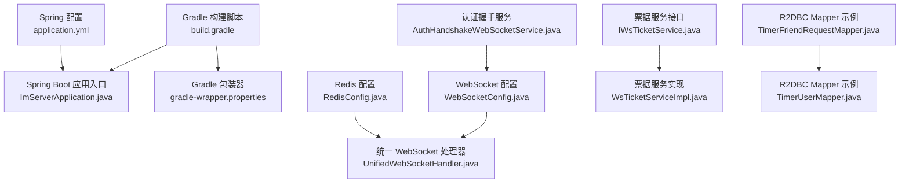
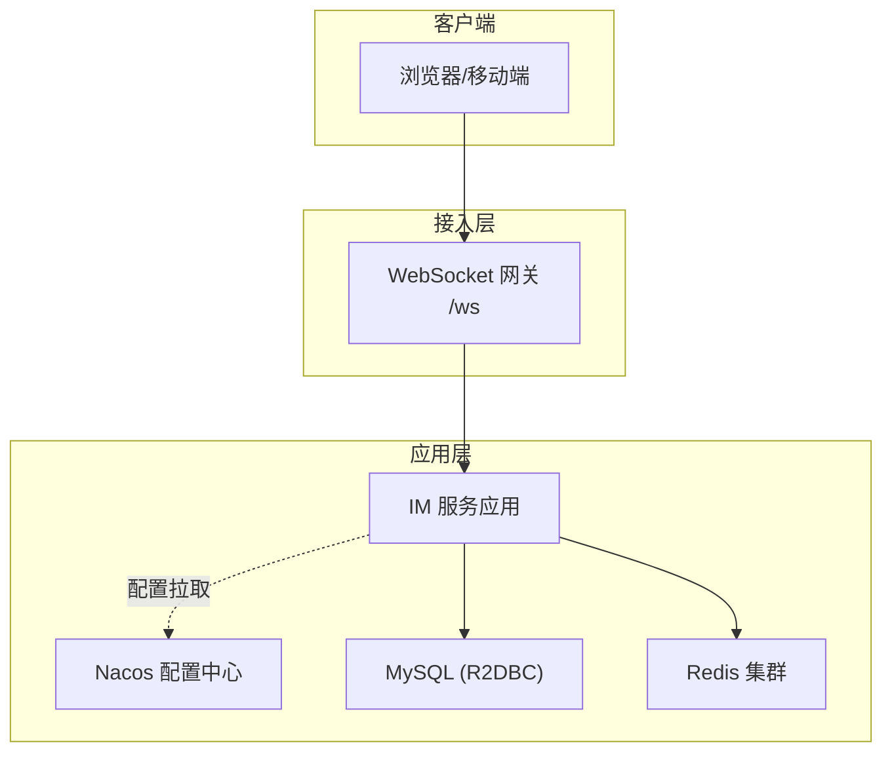
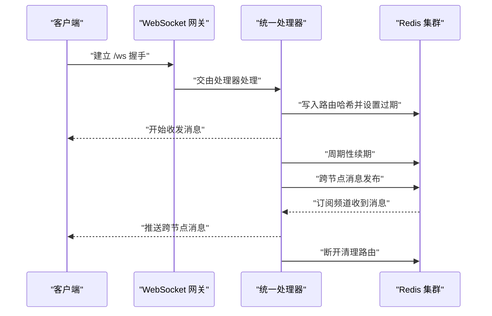
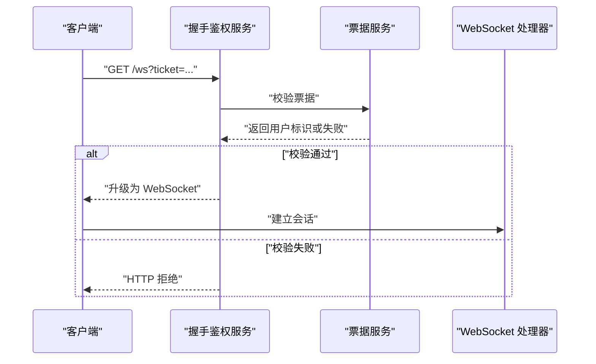
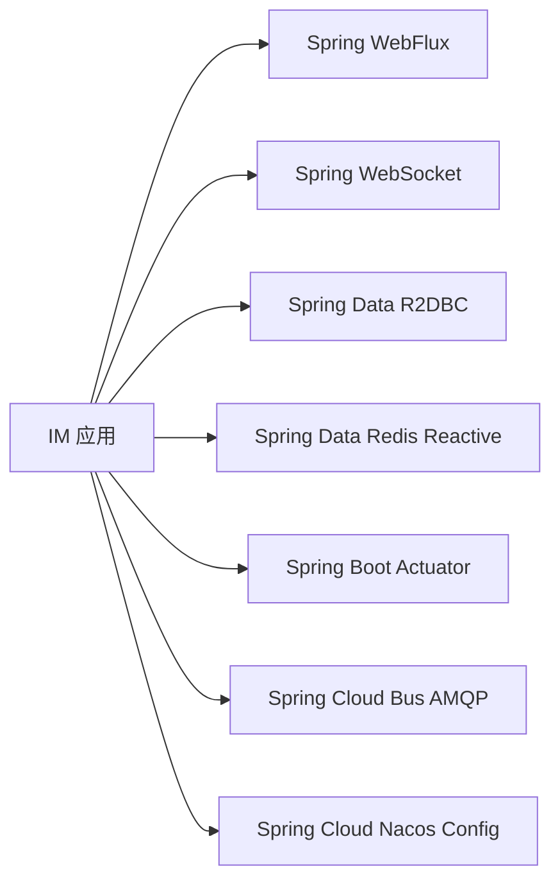

# 环境部署

<cite>
**本文引用的文件**
- [ImServerApplication.java](file://src/main/java/com/rivers/im/ImServerApplication.java)
- [application.yml](file://src/main/resources/application.yml)
- [build.gradle](file://build.gradle)
- [settings.gradle](file://settings.gradle)
- [gradle-wrapper.properties](file://gradle/wrapper/gradle-wrapper.properties)
- [RedisConfig.java](file://src/main/java/com/rivers/im/config/RedisConfig.java)
- [WebSocketConfig.java](file://src/main/java/com/rivers/im/config/WebSocketConfig.java)
- [UnifiedWebSocketHandler.java](file://src/main/java/com/rivers/im/config/UnifiedWebSocketHandler.java)
- [AuthHandshakeWebSocketService.java](file://src/main/java/com/rivers/im/service/impl/AuthHandshakeWebSocketService.java)
- [IWsTicketService.java](file://src/main/java/com/rivers/im/service/IWsTicketService.java)
- [WsTicketServiceImpl.java](file://src/main/java/com/rivers/im/service/impl/WsTicketServiceImpl.java)
- [TimerFriendRequestMapper.java](file://src/main/java/com/rivers/im/mapper/TimerFriendRequestMapper.java)
- [TimerUserMapper.java](file://src/main/java/com/rivers/im/mapper/TimerUserMapper.java)
</cite>

## 目录
1. [简介](#简介)
2. [项目结构](#项目结构)
3. [核心组件](#核心组件)
4. [架构总览](#架构总览)
5. [详细组件分析](#详细组件分析)
6. [依赖分析](#依赖分析)
7. [性能考虑](#性能考虑)
8. [故障排查指南](#故障排查指南)
9. [结论](#结论)
10. [附录](#附录)

## 简介
本指南面向生产环境部署，围绕 IM 服务器应用的运行环境与配置进行系统化说明，覆盖以下要点：
- 生产服务器配置要求：JDK 版本、内存与 CPU、磁盘空间规划
- 不同环境（开发、测试、生产）的配置差异与切换方法
- 数据库连接配置、Redis 集群配置、Nacos 配置中心部署
- 系统资源规划与环境变量、SSL 证书、防火墙规则
- 部署前检查清单与部署后验证步骤

## 项目结构
该仓库为基于 Spring Boot 4 的响应式 WebFlux 应用，采用 Gradle 构建，使用 Spring Cloud Nacos 作为配置中心导入源，内置 WebSocket 网关与 Redis 响应式 Pub/Sub 支持。

图表来源
- [build.gradle:1-64](file://build.gradle#L1-L64)
- [ImServerApplication.java:1-14](file://src/main/java/com/rivers/im/ImServerApplication.java#L1-L14)
- [gradle-wrapper.properties:1-8](file://gradle/wrapper/gradle-wrapper.properties#L1-L8)
- [application.yml:1-14](file://src/main/resources/application.yml#L1-L14)
- [WebSocketConfig.java:1-35](file://src/main/java/com/rivers/im/config/WebSocketConfig.java#L1-L35)
- [UnifiedWebSocketHandler.java:1-181](file://src/main/java/com/rivers/im/config/UnifiedWebSocketHandler.java#L1-L181)
- [RedisConfig.java:1-18](file://src/main/java/com/rivers/im/config/RedisConfig.java#L1-L18)
- [AuthHandshakeWebSocketService.java:1-73](file://src/main/java/com/rivers/im/service/impl/AuthHandshakeWebSocketService.java#L1-L73)
- [IWsTicketService.java:1-13](file://src/main/java/com/rivers/im/service/IWsTicketService.java#L1-L13)
- [WsTicketServiceImpl.java:22-54](file://src/main/java/com/rivers/im/service/impl/WsTicketServiceImpl.java#L22-L54)
- [TimerFriendRequestMapper.java:1-45](file://src/main/java/com/rivers/im/mapper/TimerFriendRequestMapper.java#L1-L45)
- [TimerUserMapper.java:1-18](file://src/main/java/com/rivers/im/mapper/TimerUserMapper.java#L1-L18)

章节来源
- [build.gradle:1-64](file://build.gradle#L1-L64)
- [settings.gradle:1-2](file://settings.gradle#L1-L2)
- [gradle-wrapper.properties:1-8](file://gradle/wrapper/gradle-wrapper.properties#L1-L8)
- [application.yml:1-14](file://src/main/resources/application.yml#L1-L14)
- [ImServerApplication.java:1-14](file://src/main/java/com/rivers/im/ImServerApplication.java#L1-L14)

## 核心组件
- 应用入口与启动
  - 应用通过 Spring Boot 启动类加载配置与组件，监听端口对外提供服务。
- 配置中心集成
  - 通过 Nacos 配置中心导入远端配置，本地仅声明地址与扩展名。
- WebSocket 网关
  - 提供 /ws 路由，注入自定义握手鉴权服务，支持心跳与跨节点消息分发。
- Redis 响应式集成
  - 使用响应式 Redis 客户端与 Pub/Sub 监听容器，支撑会话路由与跨节点推送。
- 数据访问层
  - 基于 R2DBC 的响应式数据访问，示例包含好友请求与用户信息查询。

章节来源
- [ImServerApplication.java:1-14](file://src/main/java/com/rivers/im/ImServerApplication.java#L1-L14)
- [application.yml:1-14](file://src/main/resources/application.yml#L1-L14)
- [WebSocketConfig.java:1-35](file://src/main/java/com/rivers/im/config/WebSocketConfig.java#L1-L35)
- [UnifiedWebSocketHandler.java:1-181](file://src/main/java/com/rivers/im/config/UnifiedWebSocketHandler.java#L1-L181)
- [RedisConfig.java:1-18](file://src/main/java/com/rivers/im/config/RedisConfig.java#L1-L18)
- [TimerFriendRequestMapper.java:1-45](file://src/main/java/com/rivers/im/mapper/TimerFriendRequestMapper.java#L1-L45)
- [TimerUserMapper.java:1-18](file://src/main/java/com/rivers/im/mapper/TimerUserMapper.java#L1-L18)

## 架构总览
下图展示应用在生产环境中的典型部署拓扑：应用节点通过 Nacos 获取配置，使用 MySQL 与 Redis 集群，WebSocket 通过网关暴露，跨节点消息经由 Redis Pub/Sub 分发。

图表来源
- [application.yml:1-14](file://src/main/resources/application.yml#L1-L14)
- [build.gradle:31-45](file://build.gradle#L31-L45)
- [WebSocketConfig.java:22-34](file://src/main/java/com/rivers/im/config/WebSocketConfig.java#L22-L34)
- [UnifiedWebSocketHandler.java:87-122](file://src/main/java/com/rivers/im/config/UnifiedWebSocketHandler.java#L87-L122)
- [RedisConfig.java:13-17](file://src/main/java/com/rivers/im/config/RedisConfig.java#L13-L17)

## 详细组件分析

### JDK 与构建工具要求
- JDK 版本
  - 构建工具链指定语言版本为 25，生产服务器需安装对应版本 JDK 以确保兼容性。
- Gradle 版本
  - 使用 Gradle 包装器，确保团队与 CI 环境一致。
- Spring Boot 与 Spring Cloud
  - Spring Boot 版本与 Spring Cloud 版本在构建脚本中声明，生产部署需匹配依赖版本矩阵。

章节来源
- [build.gradle:11-15](file://build.gradle#L11-L15)
- [gradle-wrapper.properties:1-8](file://gradle/wrapper/gradle-wrapper.properties#L1-L8)
- [build.gradle:26-28](file://build.gradle#L26-L28)

### 网络与端口
- 应用端口
  - 默认监听端口在配置文件中定义，生产环境建议通过环境变量覆盖。
- WebSocket 路由
  - 网关映射到 /ws，握手鉴权由自定义服务完成，生产需确保代理层透传 WebSocket 协议。

章节来源
- [application.yml:13-14](file://src/main/resources/application.yml#L13-L14)
- [WebSocketConfig.java:22-28](file://src/main/java/com/rivers/im/config/WebSocketConfig.java#L22-L28)
- [AuthHandshakeWebSocketService.java:22-73](file://src/main/java/com/rivers/im/service/impl/AuthHandshakeWebSocketService.java#L22-L73)

### Nacos 配置中心
- 配置导入
  - 本地配置声明了 Nacos 地址与文件扩展名，并通过配置导入指令拉取远端配置。
- 环境切换
  - 通过环境变量或容器注入方式替换 Nacos 地址与配置命名空间，实现多环境隔离。

章节来源
- [application.yml:4-10](file://src/main/resources/application.yml#L4-L10)

### 数据库连接（R2DBC + MySQL）
- 依赖
  - 引入响应式数据库连接与 MySQL R2DBC 驱动。
- 推荐实践
  - 在 Nacos 中集中管理数据库连接参数（URL、用户名、密码），启用连接池与只读副本策略。
  - 对高频查询建立索引，结合分页查询降低单次负载。

章节来源
- [build.gradle:37-41](file://build.gradle#L37-L41)
- [TimerFriendRequestMapper.java:14-19](file://src/main/java/com/rivers/im/mapper/TimerFriendRequestMapper.java#L14-L19)
- [TimerUserMapper.java:13-16](file://src/main/java/com/rivers/im/mapper/TimerUserMapper.java#L13-L16)

### Redis 集群与会话路由
- 组件职责
  - 响应式 Redis 客户端用于会话路由与心跳续期；Pub/Sub 监听容器负责跨节点消息分发。
- 关键行为
  - 统一处理器在连接建立时写入路由哈希并在心跳周期内续期；断开时清理路由。
  - 跨节点消息通过频道“ws:node:{serverId}”广播，本地会话管理器按连接 ID 推送。

图表来源
- [WebSocketConfig.java:22-34](file://src/main/java/com/rivers/im/config/WebSocketConfig.java#L22-L34)
- [UnifiedWebSocketHandler.java:87-122](file://src/main/java/com/rivers/im/config/UnifiedWebSocketHandler.java#L87-L122)
- [UnifiedWebSocketHandler.java:140-149](file://src/main/java/com/rivers/im/config/UnifiedWebSocketHandler.java#L140-L149)
- [RedisConfig.java:13-17](file://src/main/java/com/rivers/im/config/RedisConfig.java#L13-L17)

章节来源
- [RedisConfig.java:1-18](file://src/main/java/com/rivers/im/config/RedisConfig.java#L1-L18)
- [UnifiedWebSocketHandler.java:67-85](file://src/main/java/com/rivers/im/config/UnifiedWebSocketHandler.java#L67-L85)
- [UnifiedWebSocketHandler.java:97-121](file://src/main/java/com/rivers/im/config/UnifiedWebSocketHandler.java#L97-L121)
- [UnifiedWebSocketHandler.java:151-162](file://src/main/java/com/rivers/im/config/UnifiedWebSocketHandler.java#L151-L162)

### WebSocket 握手与鉴权
- 自定义握手服务
  - 重写握手逻辑，从查询参数提取鉴权票据并校验，拒绝握手时避免响应已提交错误。
- 票据服务
  - 提供票据生成与消费能力，票据有效期短，适合一次性握手校验。

图表来源
- [AuthHandshakeWebSocketService.java:22-73](file://src/main/java/com/rivers/im/service/impl/AuthHandshakeWebSocketService.java#L22-L73)
- [IWsTicketService.java:8-13](file://src/main/java/com/rivers/im/service/IWsTicketService.java#L8-L13)
- [WsTicketServiceImpl.java:26-54](file://src/main/java/com/rivers/im/service/impl/WsTicketServiceImpl.java#L26-L54)

章节来源
- [AuthHandshakeWebSocketService.java:1-73](file://src/main/java/com/rivers/im/service/impl/AuthHandshakeWebSocketService.java#L1-L73)
- [IWsTicketService.java:1-13](file://src/main/java/com/rivers/im/service/IWsTicketService.java#L1-L13)
- [WsTicketServiceImpl.java:22-54](file://src/main/java/com/rivers/im/service/impl/WsTicketServiceImpl.java#L22-L54)

### 环境配置差异与切换
- 开发环境
  - 本地直连 Nacos（默认地址）、本地 Redis 与 MySQL，日志级别较低，便于调试。
- 测试环境
  - 使用测试专用 Nacos 命名空间与配置集，数据库与缓存使用测试实例，开启更严格的超时与重试策略。
- 生产环境
  - 通过环境变量覆盖 Nacos 地址、数据库连接与 Redis 集群地址；启用健康检查与指标导出；限制日志级别，避免敏感信息泄露。

章节来源
- [application.yml:4-10](file://src/main/resources/application.yml#L4-L10)
- [build.gradle:31-45](file://build.gradle#L31-L45)

## 依赖分析
应用对 Spring 生态与响应式技术栈有较强依赖，主要外部组件如下：

图表来源
- [build.gradle:31-45](file://build.gradle#L31-L45)

章节来源
- [build.gradle:31-45](file://build.gradle#L31-L45)

## 性能考虑
- CPU 与内存
  - 响应式模型对 CPU 亲和性与线程数不敏感，但高并发下需合理设置 JVM 堆大小与 GC 参数，避免频繁 Full GC。
- 磁盘空间
  - 日志目录与临时文件需预留足够空间；数据库与 Redis 需要独立挂载与快照备份策略。
- 连接池与限流
  - R2DBC 连接池与 Redis 客户端连接池需根据 QPS 与延迟目标调优；对 WebSocket 连接数与消息速率实施限流。
- 缓存与索引
  - 将热点路由与会话元数据放入 Redis；数据库查询建立复合索引，减少慢查询。

## 故障排查指南
- 启动失败
  - 检查 JDK 版本是否与构建工具链一致；确认 Nacos 地址可达且配置可拉取。
- WebSocket 握手失败
  - 校验票据服务可用性与票据有效期；查看握手鉴权服务日志。
- 跨节点消息丢失
  - 确认 Redis 集群正常，Pub/Sub 订阅通道名称与当前节点 ID 一致；检查心跳续期是否持续。
- 数据库访问异常
  - 检查 R2DBC 连接串、账号权限与网络连通性；关注慢查询与锁等待。

章节来源
- [AuthHandshakeWebSocketService.java:58-67](file://src/main/java/com/rivers/im/service/impl/AuthHandshakeWebSocketService.java#L58-L67)
- [UnifiedWebSocketHandler.java:72-76](file://src/main/java/com/rivers/im/config/UnifiedWebSocketHandler.java#L72-L76)
- [TimerFriendRequestMapper.java:14-19](file://src/main/java/com/rivers/im/mapper/TimerFriendRequestMapper.java#L14-L19)

## 结论
本指南提供了从服务器硬件到软件配置的全栈部署建议，强调了 Nacos 配置中心、R2DBC 数据库与 Redis 集群在生产环境中的关键作用。通过明确的环境差异与切换策略、资源规划与验证流程，可显著提升系统的稳定性与可维护性。

## 附录

### 部署前检查清单
- 服务器规格与操作系统版本满足 JDK 与运行时需求
- 防火墙放行应用端口与 Redis、MySQL 端口
- 准备 SSL 证书并配置反向代理或网关
- 在 Nacos 创建配置集并上传生产配置
- 准备数据库初始化脚本与 Redis 集群拓扑
- 准备环境变量（如 NACOS_SERVER_ADDR、DB_URL、REDIS_CLUSTER_NODES）

### 部署后验证步骤
- 健康检查：访问健康端点与指标端点
- 功能验证：通过票据握手建立 WebSocket 连接，发送与接收消息
- 跨节点验证：在多个应用节点间发送消息，确认路由与推送正常
- 性能验证：模拟峰值流量，观察延迟与错误率