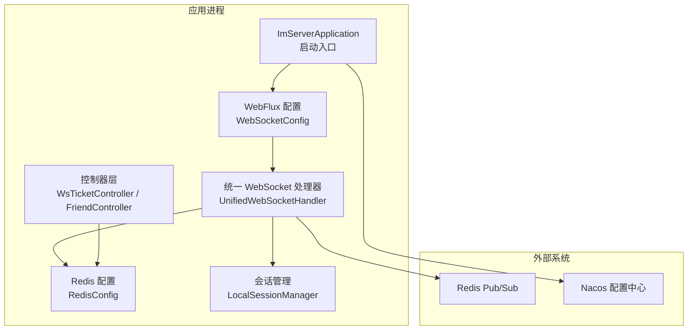
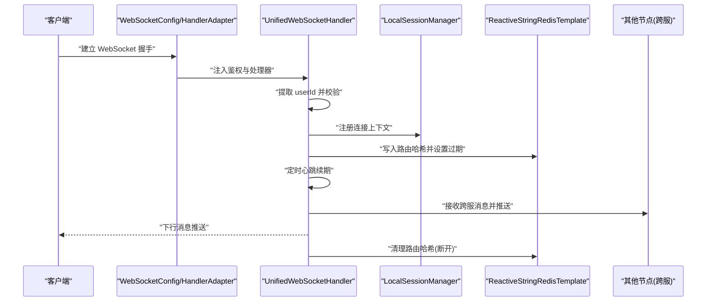
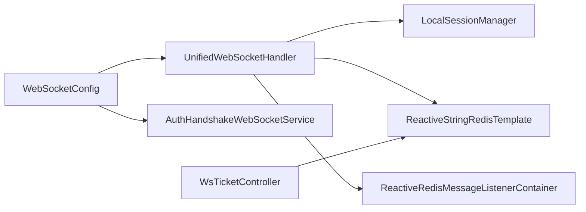

# 监控告警

<cite>
**本文引用的文件**
- [application.yml](file://src/main/resources/application.yml)
- [build.gradle](file://build.gradle)
- [ImServerApplication.java](file://src/main/java/com/rivers/im/ImServerApplication.java)
- [WebSocketConfig.java](file://src/main/java/com/rivers/im/config/WebSocketConfig.java)
- [RedisConfig.java](file://src/main/java/com/rivers/im/config/RedisConfig.java)
- [UnifiedWebSocketHandler.java](file://src/main/java/com/rivers/im/config/UnifiedWebSocketHandler.java)
- [WsTicketController.java](file://src/main/java/com/rivers/im/controller/WsTicketController.java)
- [FriendController.java](file://src/main/java/com/rivers/im/controller/FriendController.java)
- [AuthHandshakeWebSocketService.java](file://src/main/java/com/rivers/im/service/impl/AuthHandshakeWebSocketService.java)
- [TopicHandler.java](file://src/main/java/com/rivers/im/router/TopicHandler.java)
- [NotificationTopicHandler.java](file://src/main/java/com/rivers/im/router/NotificationTopicHandler.java)
- [LocalSessionManager.java](file://src/main/java/com/rivers/im/manage/LocalSessionManager.java)
- [WsTicketServiceImpl.java](file://src/main/java/com/rivers/im/service/impl/WsTicketServiceImpl.java)
</cite>

## 目录
1. [简介](#简介)
2. [项目结构](#项目结构)
3. [核心组件](#核心组件)
4. [架构总览](#架构总览)
5. [详细组件分析](#详细组件分析)
6. [依赖分析](#依赖分析)
7. [性能考虑](#性能考虑)
8. [故障排查指南](#故障排查指南)
9. [结论](#结论)
10. [附录](#附录)

## 简介
本文件面向该 IM 服务项目的运维与监控保障，围绕 Prometheus 指标采集、Grafana 仪表板设计、Alertmanager 告警配置、日志收集（ELK Stack）、应用性能监控（APM）与链路追踪、健康检查（存活/就绪探针）、以及运维自动化与故障恢复流程，提供可落地的方案建议。由于当前仓库未包含任何监控相关配置文件，本文在不改变现有代码的前提下，给出与 Spring Boot Actuator、Reactive 响应式栈、WebSocket、Redis Pub/Sub 等技术栈相契合的监控与告警实践。

## 项目结构
该项目采用 Spring Boot 与 Spring WebFlux 的响应式架构，使用 Redis 进行会话路由与跨节点消息传递，通过 WebSocket 提供实时通信能力。Actuator 已引入，可用于暴露运行时指标；WebSocket 配置与统一处理器负责连接生命周期与消息分发；控制器层提供 REST 接口；Redis 配置启用 Reactive 容器用于监听。

**图示来源**
- [ImServerApplication.java:1-14](file://src/main/java/com/rivers/im/ImServerApplication.java#L1-L14)
- [WebSocketConfig.java:1-35](file://src/main/java/com/rivers/im/config/WebSocketConfig.java#L1-L35)
- [UnifiedWebSocketHandler.java:1-181](file://src/main/java/com/rivers/im/config/UnifiedWebSocketHandler.java#L1-L181)
- [RedisConfig.java:1-18](file://src/main/java/com/rivers/im/config/RedisConfig.java#L1-L18)
- [WsTicketController.java:1-26](file://src/main/java/com/rivers/im/controller/WsTicketController.java#L1-L26)
- [FriendController.java:1-28](file://src/main/java/com/rivers/im/controller/FriendController.java#L1-L28)

**章节来源**
- [application.yml:1-14](file://src/main/resources/application.yml#L1-L14)
- [build.gradle:31-45](file://build.gradle#L31-L45)
- [ImServerApplication.java:1-14](file://src/main/java/com/rivers/im/ImServerApplication.java#L1-L14)

## 核心组件
- 启动与配置
  - 应用启动入口位于启动类，端口在配置中声明。
  - 引入 Actuator 以便暴露运行时指标。
- Web 层
  - WebFlux 配置注册 WebSocket 映射与握手适配器。
  - 统一 WebSocket 处理器负责鉴权、心跳续期、消息路由与跨节点消息投递。
- 数据与缓存
  - Redis 配置启用 Reactive 监听容器，配合会话管理与路由哈希实现连接到节点的映射。
- 控制器
  - 提供 REST 接口，如票据创建等，便于外部系统调用与集成监控。

**章节来源**
- [application.yml:13-14](file://src/main/resources/application.yml#L13-L14)
- [build.gradle:36-42](file://build.gradle#L36-L42)
- [WebSocketConfig.java:22-34](file://src/main/java/com/rivers/im/config/WebSocketConfig.java#L22-L34)
- [UnifiedWebSocketHandler.java:87-122](file://src/main/java/com/rivers/im/config/UnifiedWebSocketHandler.java#L87-L122)
- [RedisConfig.java:13-17](file://src/main/java/com/rivers/im/config/RedisConfig.java#L13-L17)
- [WsTicketController.java:21-24](file://src/main/java/com/rivers/im/controller/WsTicketController.java#L21-L24)

## 架构总览
下图展示了从客户端到应用、再到 Redis 的典型交互路径，以及监控指标的关键落点。

**图示来源**
- [WebSocketConfig.java:22-34](file://src/main/java/com/rivers/im/config/WebSocketConfig.java#L22-L34)
- [UnifiedWebSocketHandler.java:87-122](file://src/main/java/com/rivers/im/config/UnifiedWebSocketHandler.java#L87-L122)
- [LocalSessionManager.java](file://src/main/java/com/rivers/im/manage/LocalSessionManager.java)
- [RedisConfig.java:13-17](file://src/main/java/com/rivers/im/config/RedisConfig.java#L13-L17)

## 详细组件分析

### Prometheus 监控配置
- 指标采集
  - 启用 Actuator 暴露 JVM、HTTP 请求、线程池、WebFlux、Reactive Redis 等指标。
  - 在 Prometheus 中配置抓取目标为应用的 /actuator/prometheus 路径。
- 抓取间隔
  - 建议 15s~30s，兼顾实时性与资源消耗。
- 标签管理
  - 使用 spring.application.name 作为 job 标签，结合容器/实例维度补充 instance、cluster 等标签。
  - 对于 WebSocket 连接，可基于当前节点标识与用户 ID 增加标签以便聚合分析。

**章节来源**
- [build.gradle:36-36](file://build.gradle#L36-L36)
- [application.yml:1-14](file://src/main/resources/application.yml#L1-L14)
- [UnifiedWebSocketHandler.java:55-64](file://src/main/java/com/rivers/im/config/UnifiedWebSocketHandler.java#L55-L64)

### Grafana 仪表板设计
- 关键指标图表
  - 连接数：基于 actuator 的连接指标与自定义会话计数。
  - 消息吞吐：按 topic 分桶统计请求速率与错误率。
  - Redis 路由命中/过期：路由哈希写入与续期成功率。
  - 跨节点消息延迟：基于时间戳计算跨节点投递耗时。
- 业务指标展示
  - 登录/鉴权成功率、票据创建/消费速率与失败原因分布。
  - WebSocket 心跳失败率与断连重试次数。
- 自定义面板
  - 将节点标识、用户维度与业务动作（如通知已读）纳入可视化，支持下钻分析。

**章节来源**
- [UnifiedWebSocketHandler.java:103-121](file://src/main/java/com/rivers/im/config/UnifiedWebSocketHandler.java#L103-L121)
- [WsTicketServiceImpl.java:27-47](file://src/main/java/com/rivers/im/service/impl/WsTicketServiceImpl.java#L27-L47)
- [NotificationTopicHandler.java:19-26](file://src/main/java/com/rivers/im/router/NotificationTopicHandler.java#L19-L26)

### Alertmanager 告警配置
- 告警规则
  - 连接断连率阈值、消息处理错误率、Redis 写入失败率、心跳续期失败率、跨节点消息堆积。
- 静默周期
  - 建议按变更窗口设定静默周期，避免重复告警干扰。
- 通知渠道
  - 邮件、企业微信/飞书机器人、钉钉群机器人等，结合不同级别策略分发。

**章节来源**
- [build.gradle:36-36](file://build.gradle#L36-L36)
- [UnifiedWebSocketHandler.java:111-118](file://src/main/java/com/rivers/im/config/UnifiedWebSocketHandler.java#L111-L118)
- [WsTicketServiceImpl.java:44-47](file://src/main/java/com/rivers/im/service/impl/WsTicketServiceImpl.java#L44-L47)

### 日志收集配置（ELK Stack）
- 集成
  - 应用输出结构化 JSON 日志，结合 Filebeat 收集并发送至 Logstash/直接到 Elasticsearch。
- 聚合
  - 按服务名、实例、用户 ID、topic 等字段聚合，支持按天索引。
- 搜索与查询
  - 常用查询：错误关键字、特定用户/连接 ID、WebSocket 断连事件、Redis 路由异常。

**章节来源**
- [UnifiedWebSocketHandler.java:92-94](file://src/main/java/com/rivers/im/config/UnifiedWebSocketHandler.java#L92-L94)
- [UnifiedWebSocketHandler.java:134-137](file://src/main/java/com/rivers/im/config/UnifiedWebSocketHandler.java#L134-L137)
- [AuthHandshakeWebSocketService.java:60-67](file://src/main/java/com/rivers/im/service/impl/AuthHandshakeWebSocketService.java#L60-L67)

### 应用性能监控（APM 与链路追踪）
- APM 工具集成
  - 推荐 SkyWalking 或 OpenTelemetry，对 WebFlux、R2DBC、Redis Reactive 进行自动探针采集。
- 链路追踪
  - 以请求维度贯穿 WebSocket 握手、鉴权、消息路由、Redis 写入/读取、跨节点投递。
- 错误率监控
  - 统计各阶段错误比例，结合慢调用阈值进行告警。

**章节来源**
- [WebSocketConfig.java:30-34](file://src/main/java/com/rivers/im/config/WebSocketConfig.java#L30-L34)
- [UnifiedWebSocketHandler.java:124-138](file://src/main/java/com/rivers/im/config/UnifiedWebSocketHandler.java#L124-L138)
- [RedisConfig.java:13-17](file://src/main/java/com/rivers/im/config/RedisConfig.java#L13-L17)

### 健康检查与探针
- 存活探针
  - 使用 /actuator/health/liveness，确保进程存活且主线程可用。
- 就绪探针
  - 使用 /actuator/health/readiness，验证 Redis 连通性、数据库连接池状态、WebSocket 资源初始化完成。
- 建议
  - 探针超时与周期根据实例规格调整，避免频繁误判。

**章节来源**
- [build.gradle:36-36](file://build.gradle#L36-L36)
- [application.yml:13-14](file://src/main/resources/application.yml#L13-L14)

### 运维自动化与故障恢复
- 自动化脚本
  - 部署：Gradle 打包后通过容器编排拉起，配置探针与限流。
  - 回滚：蓝绿/金丝雀发布，结合探针失败自动回滚。
- 故障恢复流程
  - Redis 路由异常：触发重建路由与重连机制；心跳失败：主动续期与断连清理。
  - 跨节点消息丢失：记录时间戳并报警，必要时补偿投递。

**章节来源**
- [UnifiedWebSocketHandler.java:111-121](file://src/main/java/com/rivers/im/config/UnifiedWebSocketHandler.java#L111-L121)
- [UnifiedWebSocketHandler.java:151-162](file://src/main/java/com/rivers/im/config/UnifiedWebSocketHandler.java#L151-L162)

## 依赖分析
- 组件耦合
  - WebSocketConfig 依赖统一处理器与鉴权握手服务，职责清晰。
  - UnifiedWebSocketHandler 依赖会话管理、Redis 模板与监听容器，关注点分离。
- 外部依赖
  - Actuator 提供指标与健康检查；Redis Reactive 提供高性能异步访问；WebFlux 提供非阻塞 IO。

**图示来源**
- [WebSocketConfig.java:18-34](file://src/main/java/com/rivers/im/config/WebSocketConfig.java#L18-L34)
- [UnifiedWebSocketHandler.java:40-64](file://src/main/java/com/rivers/im/config/UnifiedWebSocketHandler.java#L40-L64)
- [AuthHandshakeWebSocketService.java](file://src/main/java/com/rivers/im/service/impl/AuthHandshakeWebSocketService.java)
- [WsTicketController.java:19-24](file://src/main/java/com/rivers/im/controller/WsTicketController.java#L19-L24)

**章节来源**
- [build.gradle:31-45](file://build.gradle#L31-L45)
- [WebSocketConfig.java:18-34](file://src/main/java/com/rivers/im/config/WebSocketConfig.java#L18-L34)
- [UnifiedWebSocketHandler.java:40-64](file://src/main/java/com/rivers/im/config/UnifiedWebSocketHandler.java#L40-L64)

## 性能考虑
- 指标采样
  - 对高频指标（如连接数、消息速率）采用降采样或滑动窗口统计，避免指标风暴。
- Redis 压力
  - 路由哈希过期时间与心跳频率需平衡；批量操作与管道化减少 RTT。
- 线程与背压
  - WebFlux 默认背压策略满足大多数场景；针对长连接与高并发需评估缓冲区大小与超时策略。

## 故障排查指南
- WebSocket 握手失败
  - 检查鉴权逻辑与参数提取，确认响应码优雅返回。
- 连接断开与路由残留
  - 观察清理流程是否执行，确认 Redis 路由哈希移除成功。
- 心跳失败
  - 查看心跳续期错误日志，定位网络或 Redis 延迟问题。
- 跨节点消息异常
  - 校验通道名称与序列化格式，记录时间戳辅助定位。

**章节来源**
- [AuthHandshakeWebSocketService.java:60-67](file://src/main/java/com/rivers/im/service/impl/AuthHandshakeWebSocketService.java#L60-L67)
- [UnifiedWebSocketHandler.java:151-162](file://src/main/java/com/rivers/im/config/UnifiedWebSocketHandler.java#L151-L162)
- [UnifiedWebSocketHandler.java:111-118](file://src/main/java/com/rivers/im/config/UnifiedWebSocketHandler.java#L111-L118)
- [UnifiedWebSocketHandler.java:140-149](file://src/main/java/com/rivers/im/config/UnifiedWebSocketHandler.java#L140-L149)

## 结论
本方案在不侵入现有代码的前提下，结合 Actuator、Reactive 栈与 WebSocket/Redis 特性，提供了从指标采集、仪表板、告警、日志、APM 到健康检查与自动化运维的完整闭环。建议尽快落地 Prometheus 抓取、Grafana 面板与 Alertmanager 规则，并配套 ELK 日志体系与 APM 链路追踪，以实现可观测性的持续演进。

## 附录
- 配置清单（建议项）
  - Prometheus 抓取：job、metrics_path、scrape_interval、labels。
  - Alertmanager：receiver、route、matchers、repeat_interval。
  - ELK：Filebeat 输入/过滤/输出、Logstash/ES 索引策略。
  - APM：探针安装、采样率、导出器配置。
- 关键指标建议
  - 连接数、消息速率、错误率、心跳成功率、Redis 路由写入/续期成功率、跨节点消息延迟。