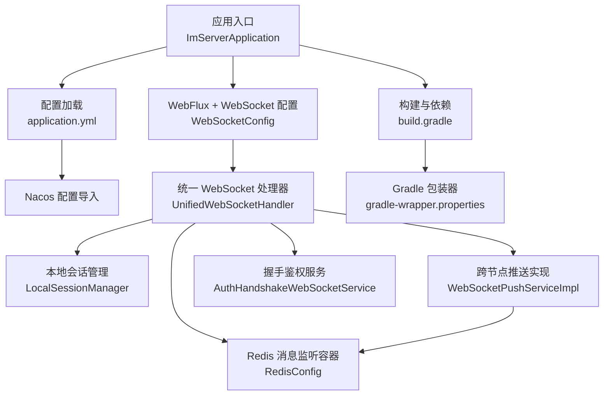
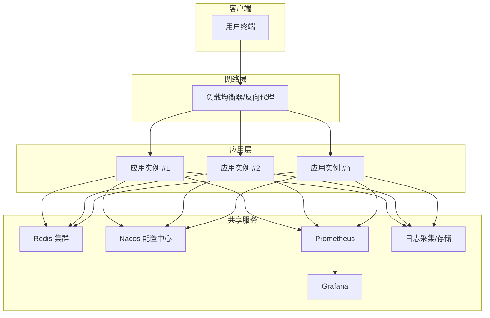
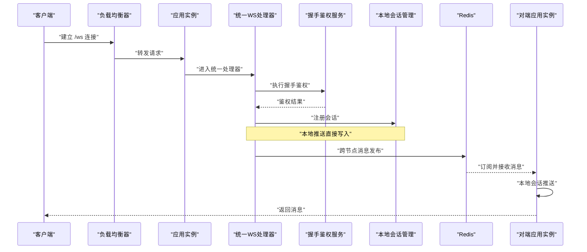
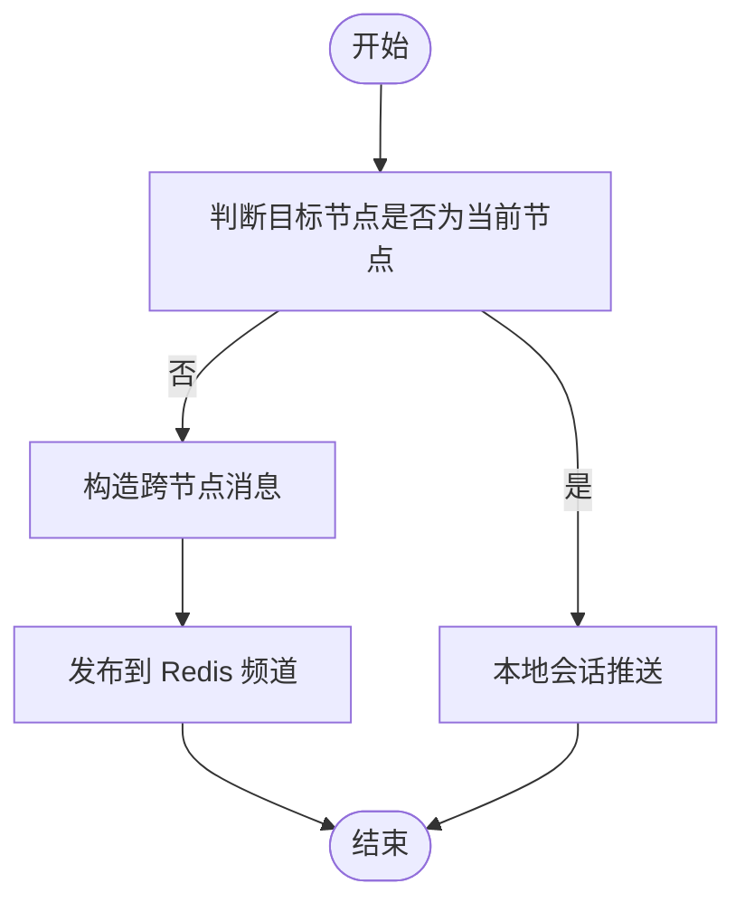
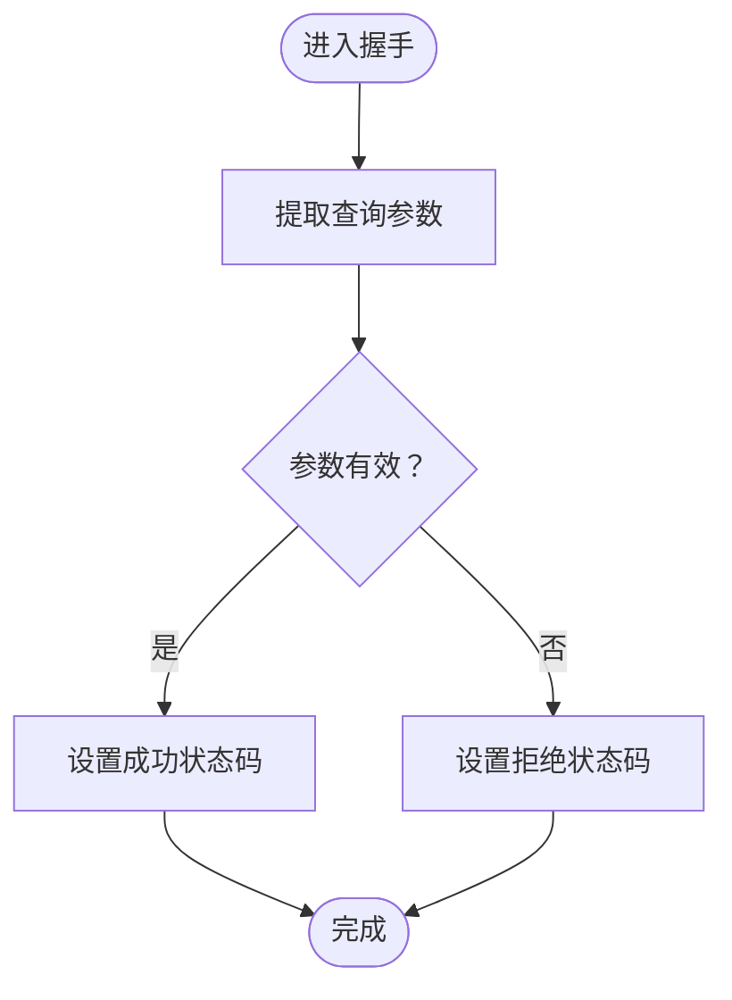
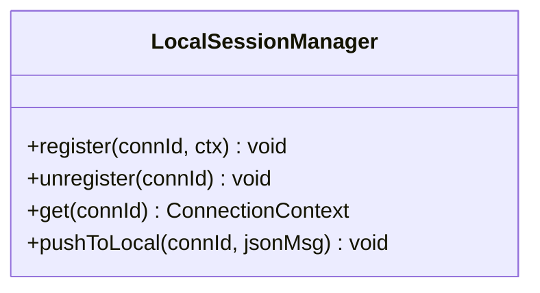
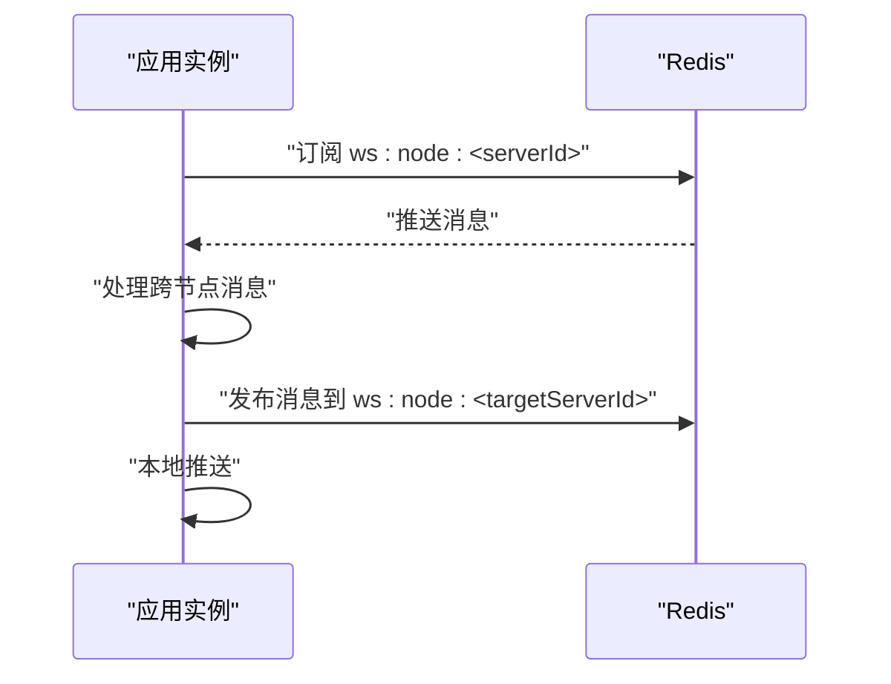
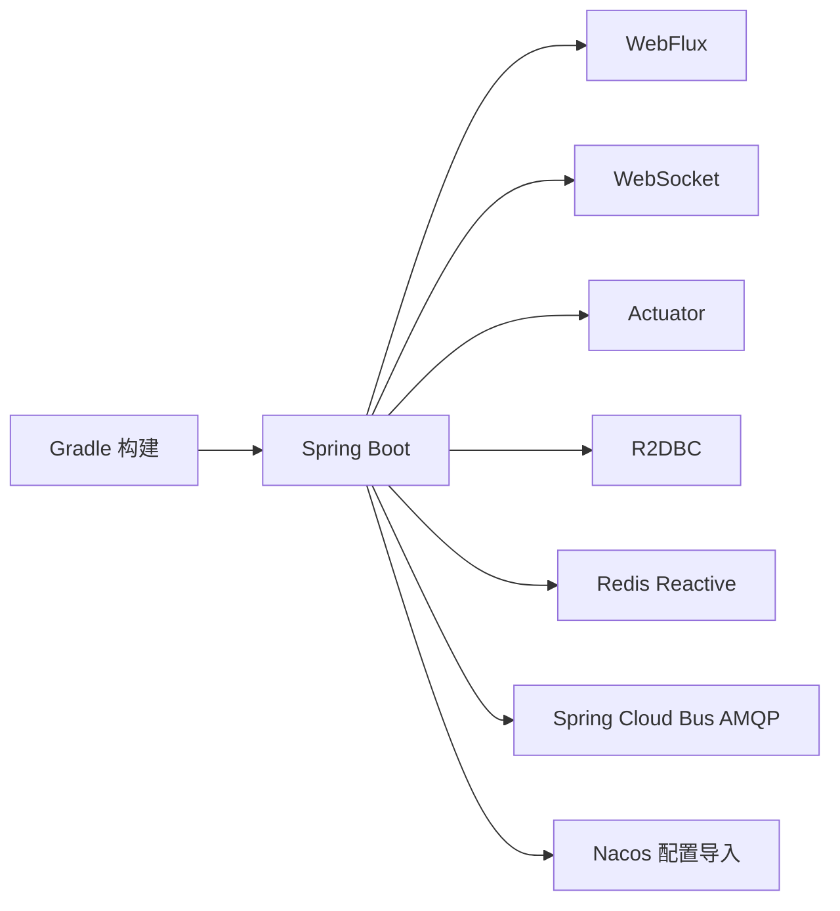

# 部署运维

<cite>
**本文引用的文件**
- [ImServerApplication.java](file://src/main/java/com/rivers/im/ImServerApplication.java)
- [application.yml](file://src/main/resources/application.yml)
- [build.gradle](file://build.gradle)
- [settings.gradle](file://settings.gradle)
- [gradle-wrapper.properties](file://gradle/wrapper/gradle-wrapper.properties)
- [RedisConfig.java](file://src/main/java/com/rivers/im/config/RedisConfig.java)
- [WebSocketConfig.java](file://src/main/java/com/rivers/im/config/WebSocketConfig.java)
- [UnifiedWebSocketHandler.java](file://src/main/java/com/rivers/im/config/UnifiedWebSocketHandler.java)
- [LocalSessionManager.java](file://src/main/java/com/rivers/im/manage/LocalSessionManager.java)
- [WsTicketServiceImpl.java](file://src/main/java/com/rivers/im/service/impl/WsTicketServiceImpl.java)
- [WebSocketPushServiceImpl.java](file://src/main/java/com/rivers/im/service/impl/WebSocketPushServiceImpl.java)
- [AuthHandshakeWebSocketService.java](file://src/main/java/com/rivers/im/service/impl/AuthHandshakeWebSocketService.java)
- [SnowflakeIdGenerator.java](file://src/main/java/com/rivers/im/util/SnowflakeIdGenerator.java)
</cite>

## 目录
1. [简介](#简介)
2. [项目结构](#项目结构)
3. [核心组件](#核心组件)
4. [架构总览](#架构总览)
5. [详细组件分析](#详细组件分析)
6. [依赖分析](#依赖分析)
7. [性能考虑](#性能考虑)
8. [故障排查指南](#故障排查指南)
9. [结论](#结论)
10. [附录](#附录)

## 简介
本指南面向生产环境的部署与运维，围绕 IM 服务器项目给出从服务器配置、负载均衡与高可用策略，到 Docker 容器化与 Kubernetes 编排的完整操作建议；同时涵盖监控告警（日志、指标、健康检查）与运维最佳实践及故障恢复策略，帮助实现稳定运行与快速恢复。

## 项目结构
该项目基于 Spring Boot 与 Spring WebFlux 实现，采用响应式编程模型，使用 Redis 进行会话管理与跨节点消息传递，通过 Nacos 进行配置中心集成。主要模块与职责如下：
- 应用入口：Spring Boot 启动类负责应用初始化与启动
- 配置层：application.yml 指定端口与 Nacos 配置导入
- 响应式 WebSocket 层：统一处理器与握手鉴权服务
- 会话与推送层：本地会话管理与跨节点推送
- Redis 集成：消息监听容器与发布订阅通道
- 构建与依赖：Gradle 构建脚本与仓库配置

图表来源
- [ImServerApplication.java:1-14](file://src/main/java/com/rivers/im/ImServerApplication.java#L1-L14)
- [application.yml:1-14](file://src/main/resources/application.yml#L1-L14)
- [WebSocketConfig.java:1-35](file://src/main/java/com/rivers/im/config/WebSocketConfig.java#L1-L35)
- [UnifiedWebSocketHandler.java:67-85](file://src/main/java/com/rivers/im/config/UnifiedWebSocketHandler.java#L67-L85)
- [LocalSessionManager.java:1-43](file://src/main/java/com/rivers/im/manage/LocalSessionManager.java#L1-L43)
- [RedisConfig.java:1-18](file://src/main/java/com/rivers/im/config/RedisConfig.java#L1-L18)
- [WebSocketPushServiceImpl.java:76-89](file://src/main/java/com/rivers/im/service/impl/WebSocketPushServiceImpl.java#L76-L89)
- [AuthHandshakeWebSocketService.java:57-73](file://src/main/java/com/rivers/im/service/impl/AuthHandshakeWebSocketService.java#L57-L73)
- [build.gradle:1-64](file://build.gradle#L1-L64)
- [gradle-wrapper.properties:1-8](file://gradle/wrapper/gradle-wrapper.properties#L1-L8)

章节来源
- [ImServerApplication.java:1-14](file://src/main/java/com/rivers/im/ImServerApplication.java#L1-L14)
- [application.yml:1-14](file://src/main/resources/application.yml#L1-L14)
- [build.gradle:1-64](file://build.gradle#L1-L64)
- [settings.gradle:1-2](file://settings.gradle#L1-L2)
- [gradle-wrapper.properties:1-8](file://gradle/wrapper/gradle-wrapper.properties#L1-L8)

## 核心组件
- 应用入口与启动：负责应用上下文初始化与主程序启动
- 配置中心集成：通过 Nacos 动态拉取配置，支持运行时刷新
- 响应式 WebSocket：统一处理 /ws 路由，注入自定义握手鉴权服务
- 会话管理：本地会话注册、注销与推送，线程安全的并发存储
- Redis 集成：消息监听容器与跨节点频道订阅
- 跨节点推送：根据目标节点 ID 将消息推送到对应节点的 Redis 频道
- 握手鉴权：在握手阶段进行参数提取与状态码设置，避免重复提交错误
- 构建与打包：Gradle 多仓库配置与 Java Toolchain 设置

章节来源
- [ImServerApplication.java:1-14](file://src/main/java/com/rivers/im/ImServerApplication.java#L1-L14)
- [application.yml:1-14](file://src/main/resources/application.yml#L1-L14)
- [WebSocketConfig.java:1-35](file://src/main/java/com/rivers/im/config/WebSocketConfig.java#L1-L35)
- [LocalSessionManager.java:1-43](file://src/main/java/com/rivers/im/manage/LocalSessionManager.java#L1-L43)
- [RedisConfig.java:1-18](file://src/main/java/com/rivers/im/config/RedisConfig.java#L1-L18)
- [WebSocketPushServiceImpl.java:76-89](file://src/main/java/com/rivers/im/service/impl/WebSocketPushServiceImpl.java#L76-L89)
- [AuthHandshakeWebSocketService.java:57-73](file://src/main/java/com/rivers/im/service/impl/AuthHandshakeWebSocketService.java#L57-L73)
- [build.gradle:1-64](file://build.gradle#L1-L64)

## 架构总览
下图展示生产环境典型部署拓扑：多副本应用实例通过负载均衡对外提供 WebSocket 服务；Redis 作为共享状态与消息通道；Nacos 提供集中配置；Prometheus/Grafana 用于指标采集与可视化；日志通过采集器集中存储与检索。

## 详细组件分析

### 组件一：WebSocket 会话与推送链路
该链路负责统一接入、鉴权、本地会话管理与跨节点消息转发。

图表来源
- [WebSocketConfig.java:22-34](file://src/main/java/com/rivers/im/config/WebSocketConfig.java#L22-L34)
- [UnifiedWebSocketHandler.java:67-85](file://src/main/java/com/rivers/im/config/UnifiedWebSocketHandler.java#L67-L85)
- [AuthHandshakeWebSocketService.java:57-73](file://src/main/java/com/rivers/im/service/impl/AuthHandshakeWebSocketService.java#L57-L73)
- [LocalSessionManager.java:17-42](file://src/main/java/com/rivers/im/manage/LocalSessionManager.java#L17-L42)
- [WebSocketPushServiceImpl.java:76-89](file://src/main/java/com/rivers/im/service/impl/WebSocketPushServiceImpl.java#L76-L89)
- [RedisConfig.java:13-17](file://src/main/java/com/rivers/im/config/RedisConfig.java#L13-L17)

章节来源
- [WebSocketConfig.java:1-35](file://src/main/java/com/rivers/im/config/WebSocketConfig.java#L1-L35)
- [UnifiedWebSocketHandler.java:67-85](file://src/main/java/com/rivers/im/config/UnifiedWebSocketHandler.java#L67-L85)
- [AuthHandshakeWebSocketService.java:57-73](file://src/main/java/com/rivers/im/service/impl/AuthHandshakeWebSocketService.java#L57-L73)
- [LocalSessionManager.java:1-43](file://src/main/java/com/rivers/im/manage/LocalSessionManager.java#L1-L43)
- [WebSocketPushServiceImpl.java:76-89](file://src/main/java/com/rivers/im/service/impl/WebSocketPushServiceImpl.java#L76-L89)
- [RedisConfig.java:1-18](file://src/main/java/com/rivers/im/config/RedisConfig.java#L1-L18)

### 组件二：跨节点消息流程（推送）
该流程展示当目标连接不在当前节点时，如何通过 Redis 发布订阅实现跨节点推送。

图表来源
- [WebSocketPushServiceImpl.java:76-89](file://src/main/java/com/rivers/im/service/impl/WebSocketPushServiceImpl.java#L76-L89)

章节来源
- [WebSocketPushServiceImpl.java:76-89](file://src/main/java/com/rivers/im/service/impl/WebSocketPushServiceImpl.java#L76-L89)

### 组件三：握手鉴权流程
握手阶段进行参数提取与状态码设置，避免重复提交导致的错误。

图表来源
- [AuthHandshakeWebSocketService.java:57-73](file://src/main/java/com/rivers/im/service/impl/AuthHandshakeWebSocketService.java#L57-L73)

章节来源
- [AuthHandshakeWebSocketService.java:57-73](file://src/main/java/com/rivers/im/service/impl/AuthHandshakeWebSocketService.java#L57-L73)

### 组件四：会话注册与推送
本地会话注册、注销与推送均采用线程安全的并发结构，确保高并发下的稳定性。

图表来源
- [LocalSessionManager.java:12-43](file://src/main/java/com/rivers/im/manage/LocalSessionManager.java#L12-L43)

章节来源
- [LocalSessionManager.java:1-43](file://src/main/java/com/rivers/im/manage/LocalSessionManager.java#L1-L43)

### 组件五：Redis 订阅与发布
统一处理器在启动时订阅跨节点频道，在销毁时释放订阅，确保生命周期内消息可达。

图表来源
- [UnifiedWebSocketHandler.java:67-85](file://src/main/java/com/rivers/im/config/UnifiedWebSocketHandler.java#L67-L85)
- [WebSocketPushServiceImpl.java:76-89](file://src/main/java/com/rivers/im/service/impl/WebSocketPushServiceImpl.java#L76-L89)

章节来源
- [UnifiedWebSocketHandler.java:67-85](file://src/main/java/com/rivers/im/config/UnifiedWebSocketHandler.java#L67-L85)
- [WebSocketPushServiceImpl.java:76-89](file://src/main/java/com/rivers/im/service/impl/WebSocketPushServiceImpl.java#L76-L89)
- [RedisConfig.java:13-17](file://src/main/java/com/rivers/im/config/RedisConfig.java#L13-L17)

## 依赖分析
- 构建工具：Gradle 包装器与多仓库配置，Java Toolchain 指定语言版本
- Spring 生态：WebFlux、WebSocket、Actuator、R2DBC、Redis Reactive
- 云原生：Spring Cloud Bus AMQP、Nacos 配置导入
- 第三方库：rivers-core、Jackson、Lombok

图表来源
- [build.gradle:31-45](file://build.gradle#L31-L45)
- [application.yml:4-10](file://src/main/resources/application.yml#L4-L10)

章节来源
- [build.gradle:1-64](file://build.gradle#L1-L64)
- [application.yml:1-14](file://src/main/resources/application.yml#L1-L14)

## 性能考虑
- 响应式模型：使用 WebFlux 与 Reactor，降低阻塞开销，提升吞吐
- 并发数据结构：会话表采用并发映射，减少锁竞争
- 跨节点推送：通过 Redis 发布订阅解耦，避免长链路直连
- 配置中心：Nacos 动态配置，支持运行时调整参数
- 指标与可观测性：启用 Actuator，结合 Prometheus/Grafana 监控关键指标
- 日志：统一日志输出，便于集中采集与检索

## 故障排查指南
- WebSocket 握手失败
  - 检查握手鉴权服务的状态码设置逻辑，确认未出现重复提交
  - 关注统一处理器的订阅初始化与销毁，避免监听异常导致消息不可达
- 跨节点消息丢失
  - 校验 Redis 集群可用性与频道命名一致性
  - 查看跨节点推送的错误处理与重试策略
- 会话推送异常
  - 检查本地会话是否存在且连接处于打开状态
  - 关注并发场景下的会话注册/注销时机
- 配置不生效
  - 确认 Nacos 地址与配置文件名正确
  - 触发配置刷新或重启实例以应用新配置
- 指标与日志
  - 通过 Actuator 暴露的端点检查健康状态
  - 使用日志采集器集中收集并检索异常堆栈

章节来源
- [AuthHandshakeWebSocketService.java:57-73](file://src/main/java/com/rivers/im/service/impl/AuthHandshakeWebSocketService.java#L57-L73)
- [UnifiedWebSocketHandler.java:67-85](file://src/main/java/com/rivers/im/config/UnifiedWebSocketHandler.java#L67-L85)
- [WebSocketPushServiceImpl.java:76-89](file://src/main/java/com/rivers/im/service/impl/WebSocketPushServiceImpl.java#L76-L89)
- [LocalSessionManager.java:35-42](file://src/main/java/com/rivers/im/manage/LocalSessionManager.java#L35-L42)
- [application.yml:4-10](file://src/main/resources/application.yml#L4-L10)

## 结论
本项目采用响应式架构与 Redis 解耦，具备良好的扩展性与高可用基础。结合 Nacos 配置中心、Prometheus/Grafana 监控体系与日志采集，可满足生产环境的稳定性与可观测性要求。建议在生产中完善容器化与 Kubernetes 编排、完善的健康检查与告警策略，以及标准化的故障恢复流程。

## 附录

### 生产环境部署架构与高可用策略
- 服务器配置
  - 应用端口：9000（来自配置文件）
  - 配置中心：Nacos 地址与配置文件名需按环境配置
  - 数据库：通过 R2DBC 连接 MySQL（具体连接参数由 Nacos 或环境变量提供）
  - 缓存：Redis 集群，建议开启持久化与哨兵/集群模式
- 负载均衡
  - 使用 L4/L7 负载均衡器分发请求至多个应用实例
  - WebSocket 需要支持长连接与粘性会话策略
- 高可用
  - 多副本部署，实例间通过 Redis 共享状态与消息
  - Nacos 集群保障配置可用性
  - 健康检查与自动扩缩容配合使用

章节来源
- [application.yml:13-14](file://src/main/resources/application.yml#L13-L14)
- [build.gradle:36-42](file://build.gradle#L36-L42)

### Docker 容器化部署方案
- 镜像构建
  - 使用多阶段构建：编译阶段使用 JDK，运行阶段使用精简的基础镜像
  - 将构建产物复制到镜像中，避免携带不必要的依赖
- 容器编排
  - 单容器运行：挂载配置文件，指定环境变量覆盖默认值
  - 多容器编排：应用容器 + Redis 容器 + Nacos 容器
- 环境变量配置
  - 通过环境变量覆盖 Nacos 地址、数据库连接、Redis 地址等敏感配置
  - 通过 JVM 参数调优 GC、线程数与内存

### Kubernetes 部署策略
- Pod 配置
  - 资源限制与请求，启用存活/就绪探针
  - 挂载配置卷或使用 ConfigMap/Secret
- Service 暴露
  - ClusterIP 暴露内部服务，NodePort/LoadBalancer 对外暴露
  - 为 WebSocket 服务配置会话亲和或长连接支持
- Ingress 路由
  - 配置 WebSocket 支持与超时参数
  - TLS 终止与证书管理

### 监控告警配置
- 日志收集
  - 使用采集器收集 stdout/stderr 与应用日志目录
  - 结构化日志格式，便于检索与聚合
- 性能指标
  - 暴露 JVM 与业务指标，Prometheus 抓取
  - 关键指标：请求延迟、错误率、连接数、Redis 延迟
- 健康检查
  - Liveness/Readiness 探针，结合滚动更新策略
  - 告警阈值：CPU/内存/磁盘/连接数/Redis 延迟

### 运维最佳实践与故障恢复
- 最佳实践
  - 滚动更新与灰度发布，结合探针与回滚策略
  - 配置与密钥管理，最小权限原则
  - 定期备份与演练，确保可恢复性
- 故障恢复
  - 快速定位：日志、指标、链路追踪
  - 降级与熔断：限流、缓存、降级接口
  - 回滚与扩容：自动化回滚与弹性伸缩