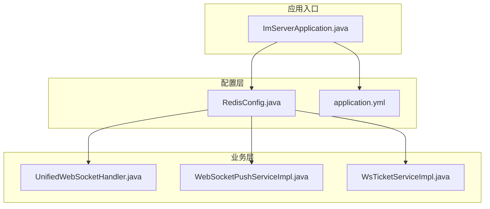
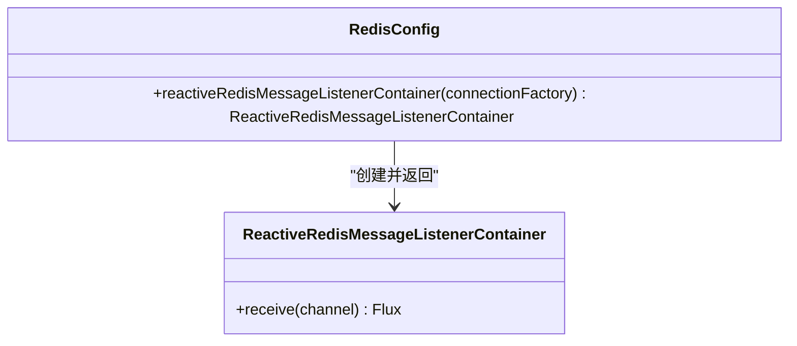
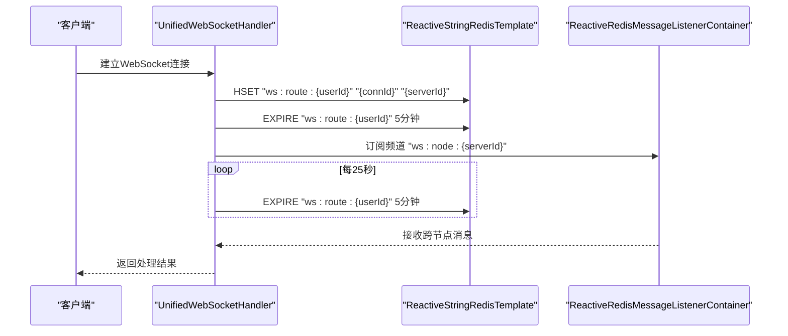
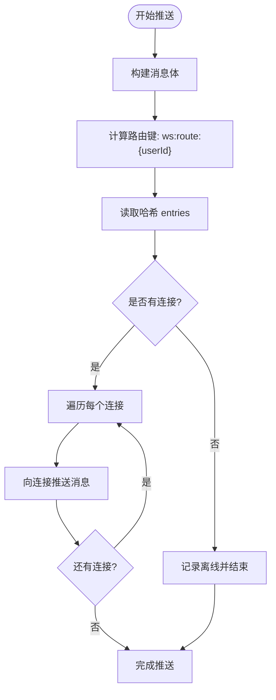
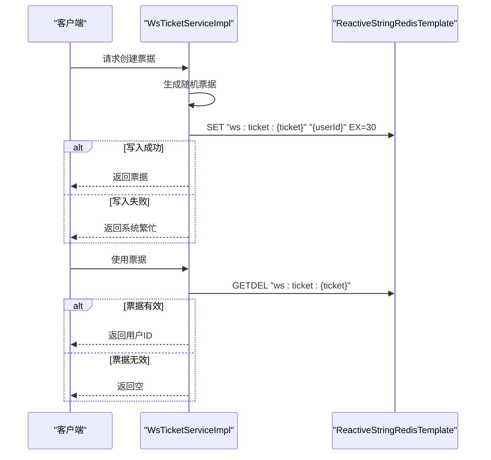
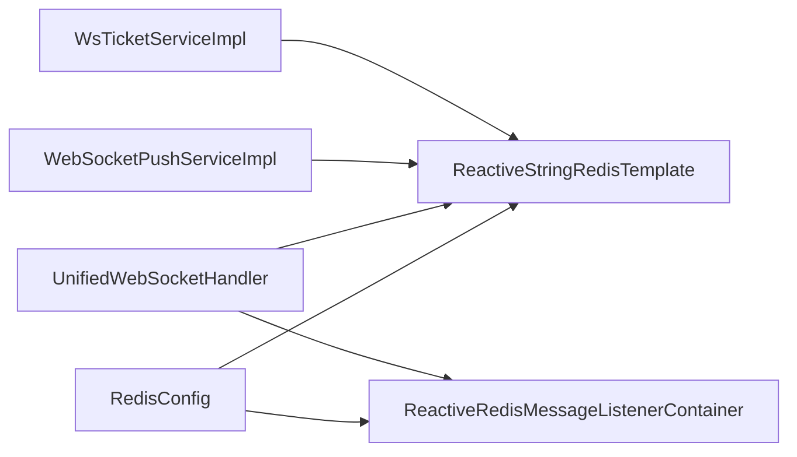

# Redis配置管理

<cite>
**本文档引用的文件**
- [RedisConfig.java](file://src/main/java/com/rivers/im/config/RedisConfig.java)
- [application.yml](file://src/main/resources/application.yml)
- [ImServerApplication.java](file://src/main/java/com/rivers/im/ImServerApplication.java)
- [UnifiedWebSocketHandler.java](file://src/main/java/com/rivers/im/config/UnifiedWebSocketHandler.java)
- [WebSocketPushServiceImpl.java](file://src/main/java/com/rivers/im/service/impl/WebSocketPushServiceImpl.java)
- [WsTicketServiceImpl.java](file://src/main/java/com/rivers/im/service/impl/WsTicketServiceImpl.java)
</cite>

## 目录
1. [简介](#简介)
2. [项目结构](#项目结构)
3. [核心组件](#核心组件)
4. [架构概览](#架构概览)
5. [详细组件分析](#详细组件分析)
6. [依赖分析](#依赖分析)
7. [性能考虑](#性能考虑)
8. [故障排除指南](#故障排除指南)
9. [结论](#结论)

## 简介
本文件针对IM（即时通讯）服务器中的Redis配置管理进行深入技术文档编写，重点分析RedisConfig类的实现细节，涵盖以下方面：
- Redis连接工厂配置与自动装配机制
- ReactiveRedisTemplate的使用方式与序列化策略
- 连接池参数配置与客户端选择（Lettuce vs Jedis）
- Redis在IM系统中的具体应用：会话存储、消息路由与跨节点推送、分布式票据与心跳续期
- 性能调优建议、连接监控方法与故障处理策略

## 项目结构
该项目采用Spring Boot标准目录结构，Redis相关配置集中在config包中，业务服务通过Reactive Redis模板进行异步操作。



**图表来源**
- [ImServerApplication.java:1-14](file://src/main/java/com/rivers/im/ImServerApplication.java#L1-L14)
- [RedisConfig.java:1-18](file://src/main/java/com/rivers/im/config/RedisConfig.java#L1-L18)
- [application.yml:1-14](file://src/main/resources/application.yml#L1-L14)

**章节来源**
- [ImServerApplication.java:1-14](file://src/main/java/com/rivers/im/ImServerApplication.java#L1-L14)
- [RedisConfig.java:1-18](file://src/main/java/com/rivers/im/config/RedisConfig.java#L1-L18)
- [application.yml:1-14](file://src/main/resources/application.yml#L1-L14)

## 核心组件
本节聚焦RedisConfig类的实现与职责，以及与业务组件的协作关系。

- RedisConfig类负责声明ReactiveRedisMessageListenerContainer Bean，用于基于Reactive Redis的发布/订阅监听容器。
- 项目中未显式定义ReactiveStringRedisTemplate Bean，但多个业务组件通过构造函数注入ReactiveStringRedisTemplate，表明该Bean由Spring Boot自动配置提供。
- 应用通过Nacos动态配置导入机制加载外部配置，其中包含Redis连接参数等。

关键点：
- Reactive Redis监听容器：用于接收跨节点消息通道，支持分布式场景下的消息广播与转发。
- 自动装配的Reactive Redis模板：业务组件直接依赖此模板进行字符串类型的键值操作与哈希操作。
- Nacos配置导入：通过spring.config.import引入nacos配置源，便于集中管理Redis连接信息。

**章节来源**
- [RedisConfig.java:1-18](file://src/main/java/com/rivers/im/config/RedisConfig.java#L1-L18)
- [application.yml:1-14](file://src/main/resources/application.yml#L1-L14)

## 架构概览
下图展示IM系统中Redis的使用架构：统一WebSocket处理器通过Reactive Redis模板维护用户到连接的路由映射；推送服务根据路由查找目标连接并进行消息分发；票据服务使用短时过期键实现握手票据；跨节点消息通过发布/订阅容器进行广播。

```mermaid
graph TB
subgraph "WebSocket层"
U[UnifiedWebSocketHandler.java]
P[WebSocketPushServiceImpl.java]
T[WsTicketServiceImpl.java]
end
subgraph "Redis"
RT[ReactiveStringRedisTemplate]
LC[ReactiveRedisMessageListenerContainer]
CH[Channel: ws:node:{serverId}]
end
subgraph "会话与路由"
RH[Hash: ws:route:{userId} -> {connId:serverId}]
TK[String: ws:ticket:{ticket} -> {userId}, TTL=30s]
end
U --> RT
U --> LC
U --> RH
P --> RT
P --> RH
T --> RT
T --> TK
LC --> CH
```

**图表来源**
- [UnifiedWebSocketHandler.java:87-122](file://src/main/java/com/rivers/im/config/UnifiedWebSocketHandler.java#L87-L122)
- [WebSocketPushServiceImpl.java:44-74](file://src/main/java/com/rivers/im/service/impl/WebSocketPushServiceImpl.java#L44-L74)
- [WsTicketServiceImpl.java:26-54](file://src/main/java/com/rivers/im/service/impl/WsTicketServiceImpl.java#L26-L54)

## 详细组件分析

### RedisConfig类分析
- 职责：声明ReactiveRedisMessageListenerContainer Bean，作为Reactive Redis发布/订阅的监听容器。
- 设计要点：
  - 仅提供监听容器Bean，未提供ReactiveStringRedisTemplate Bean，说明模板由框架自动配置。
  - 依赖ReactiveRedisConnectionFactory自动装配，确保连接工厂与容器一致。
- 可扩展性：若需自定义连接池参数或序列化策略，可在连接工厂层面进行配置。



**图表来源**
- [RedisConfig.java:13-17](file://src/main/java/com/rivers/im/config/RedisConfig.java#L13-L17)

**章节来源**
- [RedisConfig.java:1-18](file://src/main/java/com/rivers/im/config/RedisConfig.java#L1-L18)

### 统一WebSocket处理器（会话存储与心跳续期）
- 会话存储：用户建立WebSocket连接后，将连接ID与当前服务器ID写入哈希键“ws:route:{userId}”，并设置TTL以实现自动清理。
- 心跳续期：周期性刷新路由键的TTL，保证活跃会话不被清理。
- 跨节点监听：订阅“ws:node:{currentServerId}”频道，接收其他节点广播的消息并进行处理。



**图表来源**
- [UnifiedWebSocketHandler.java:87-122](file://src/main/java/com/rivers/im/config/UnifiedWebSocketHandler.java#L87-L122)
- [UnifiedWebSocketHandler.java:67-77](file://src/main/java/com/rivers/im/config/UnifiedWebSocketHandler.java#L67-L77)

**章节来源**
- [UnifiedWebSocketHandler.java:87-122](file://src/main/java/com/rivers/im/config/UnifiedWebSocketHandler.java#L87-L122)
- [UnifiedWebSocketHandler.java:67-77](file://src/main/java/com/rivers/im/config/UnifiedWebSocketHandler.java#L67-L77)

### 消息推送服务（消息路由与分发）
- 路由查询：读取用户对应的连接集合，遍历所有连接进行消息推送。
- 并发控制：使用Mono.when对多连接推送进行聚合，提升吞吐量。
- 异常处理：对离线用户或推送失败的情况进行日志记录与降级处理。



**图表来源**
- [WebSocketPushServiceImpl.java:44-74](file://src/main/java/com/rivers/im/service/impl/WebSocketPushServiceImpl.java#L44-L74)

**章节来源**
- [WebSocketPushServiceImpl.java:44-74](file://src/main/java/com/rivers/im/service/impl/WebSocketPushServiceImpl.java#L44-L74)

### 票据服务（握手票据与一次性验证）
- 票据生成：随机UUID去除连字符，前缀“ws:ticket:”+票据作为键，值为用户ID，TTL=30秒。
- 票据消费：一次性读取并删除票据键，确保票据只能使用一次。
- 错误处理：对写入失败与异常情况进行日志记录与错误响应。



**图表来源**
- [WsTicketServiceImpl.java:26-54](file://src/main/java/com/rivers/im/service/impl/WsTicketServiceImpl.java#L26-L54)

**章节来源**
- [WsTicketServiceImpl.java:26-54](file://src/main/java/com/rivers/im/service/impl/WsTicketServiceImpl.java#L26-L54)

### 序列化策略与数据模型
- 字符串模板：ReactiveStringRedisTemplate用于字符串键值与哈希操作，适合存储JSON字符串与简单键值。
- 数据模型：
  - 路由哈希：键“ws:route:{userId}”，字段为连接ID，值为服务器ID，用于定位用户连接。
  - 票据字符串：键“ws:ticket:{ticket}”，值为用户ID，TTL=30秒，用于一次性认证。
- 序列化建议：默认使用String编码，适合JSON文本；如需复杂对象，可考虑自定义序列化器并在连接工厂层面配置。

**章节来源**
- [WebSocketPushServiceImpl.java:56-74](file://src/main/java/com/rivers/im/service/impl/WebSocketPushServiceImpl.java#L56-L74)
- [WsTicketServiceImpl.java:24-32](file://src/main/java/com/rivers/im/service/impl/WsTicketServiceImpl.java#L24-L32)

### 客户端选择：Lettuce与Jedis
- Lettuce（推荐）：
  - 非阻塞、Reactive友好，与ReactiveStringRedisTemplate天然契合。
  - 支持高级特性如连接池、超时配置、SSL等，适合高并发场景。
- Jedis：
  - 阻塞式客户端，简单易用；但在Reactive栈中不如Lettuce灵活。
  - 若项目迁移到非Reactive模式，可考虑Jedis，但当前实现建议保持Lettuce。

**章节来源**
- [RedisConfig.java:13-17](file://src/main/java/com/rivers/im/config/RedisConfig.java#L13-L17)

## 依赖分析
- 组件耦合：
  - RedisConfig与业务组件通过ReactiveStringRedisTemplate与ReactiveRedisMessageListenerContainer解耦。
  - 业务组件之间无直接依赖，均通过Redis进行间接通信。
- 外部依赖：
  - Spring Data Redis提供Reactive Redis支持。
  - Nacos配置中心提供外部化配置能力。



**图表来源**
- [RedisConfig.java:13-17](file://src/main/java/com/rivers/im/config/RedisConfig.java#L13-L17)
- [UnifiedWebSocketHandler.java:40-64](file://src/main/java/com/rivers/im/config/UnifiedWebSocketHandler.java#L40-L64)
- [WebSocketPushServiceImpl.java:22-37](file://src/main/java/com/rivers/im/service/impl/WebSocketPushServiceImpl.java#L22-L37)
- [WsTicketServiceImpl.java:21-23](file://src/main/java/com/rivers/im/service/impl/WsTicketServiceImpl.java#L21-L23)

**章节来源**
- [RedisConfig.java:1-18](file://src/main/java/com/rivers/im/config/RedisConfig.java#L1-L18)
- [UnifiedWebSocketHandler.java:40-64](file://src/main/java/com/rivers/im/config/UnifiedWebSocketHandler.java#L40-L64)
- [WebSocketPushServiceImpl.java:22-37](file://src/main/java/com/rivers/im/service/impl/WebSocketPushServiceImpl.java#L22-L37)
- [WsTicketServiceImpl.java:21-23](file://src/main/java/com/rivers/im/service/impl/WsTicketServiceImpl.java#L21-L23)

## 性能考虑
- 连接池参数：
  - 最大连接数：根据QPS与并发连接数合理设置，避免连接不足导致阻塞。
  - 最小空闲连接：保障热连接可用，降低新建连接开销。
  - 连接超时时间：缩短连接超时可快速释放无效连接。
- 序列化优化：
  - 使用紧凑的JSON序列化，减少带宽与内存占用。
  - 对热点键采用压缩策略（谨慎使用，评估CPU开销）。
- 命令批量化：
  - 将多个小命令合并为流水线执行，减少RTT。
- TTL策略：
  - 路由键设置合理的TTL，结合心跳续期，平衡资源占用与实时性。
- 监控指标：
  - 连接池利用率、命令耗时分布、错误率、Pub/Sub消息延迟。

## 故障排除指南
- 连接失败：
  - 检查Redis地址、认证信息与网络连通性。
  - 查看连接池是否耗尽，适当增大最大连接数。
- 发布/订阅异常：
  - 监听容器初始化失败时，检查连接工厂配置与频道名称格式。
  - 订阅异常日志中关注“跨服消息将不可用”的提示。
- 写入失败：
  - 票据写入失败时，确认TTL设置与磁盘空间。
  - 路由写入失败时，检查哈希键是否存在并发竞争。
- 推送失败：
  - 对离线用户进行降级处理，记录日志以便后续重试。
  - 对推送异常进行幂等设计，避免重复消息。

**章节来源**
- [WsTicketServiceImpl.java:41-47](file://src/main/java/com/rivers/im/service/impl/WsTicketServiceImpl.java#L41-L47)
- [UnifiedWebSocketHandler.java:74](file://src/main/java/com/rivers/im/config/UnifiedWebSocketHandler.java#L74)

## 结论
本项目通过Reactive Redis实现了高性能的IM会话管理与消息分发，RedisConfig类提供了必要的监听容器支持，业务组件围绕路由哈希与票据键构建了完整的握手与推送流程。建议在生产环境中进一步完善连接池参数、序列化策略与监控告警体系，以获得更稳定的性能表现。