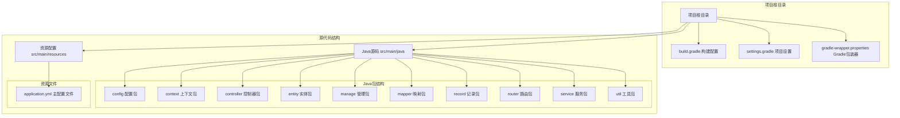
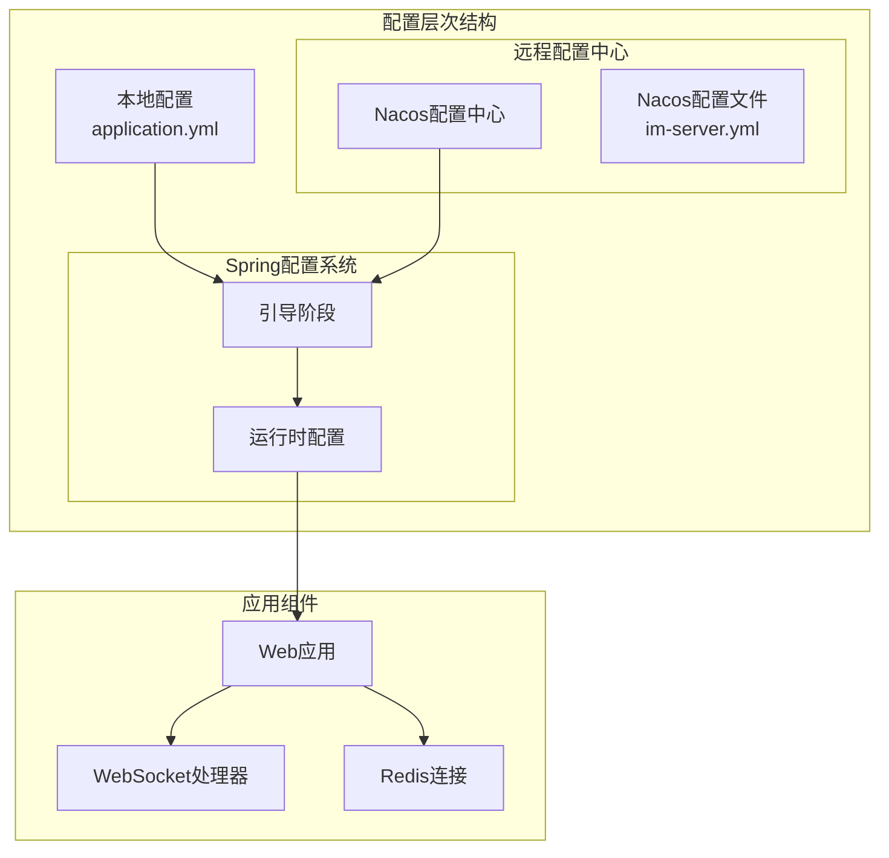
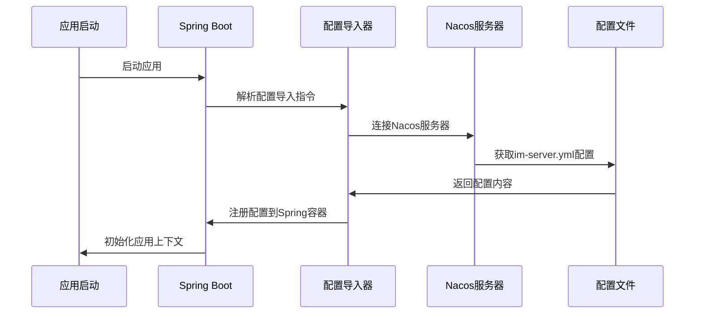
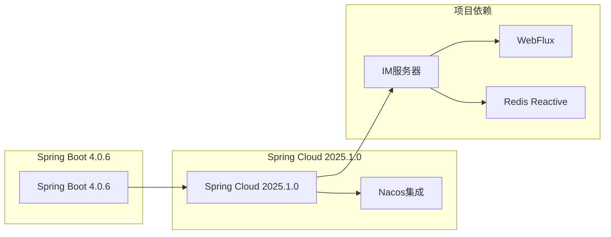
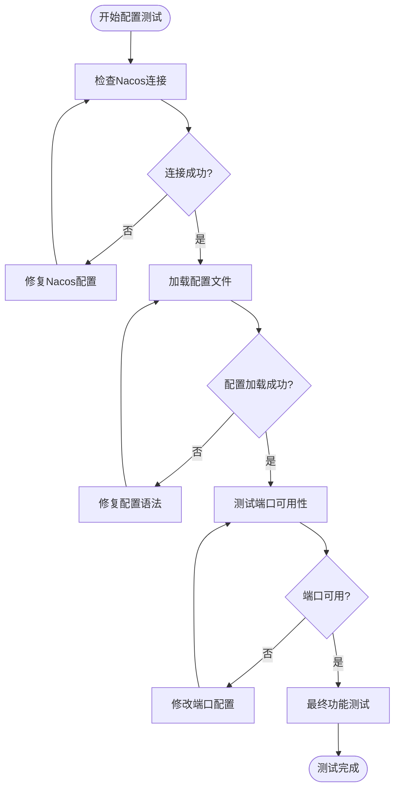

# 应用配置详解

<cite>
**本文档引用的文件**
- [application.yml](file://src/main/resources/application.yml)
- [ImServerApplication.java](file://src/main/java/com/rivers/im/ImServerApplication.java)
- [build.gradle](file://build.gradle)
- [settings.gradle](file://settings.gradle)
- [gradle-wrapper.properties](file://gradle/wrapper/gradle-wrapper.properties)
- [RedisConfig.java](file://src/main/java/com/rivers/im/config/RedisConfig.java)
- [WebSocketConfig.java](file://src/main/java/com/rivers/im/config/WebSocketConfig.java)
- [UnifiedWebSocketHandler.java](file://src/main/java/com/rivers/im/config/UnifiedWebSocketHandler.java)
</cite>

## 目录
1. [简介](#简介)
2. [项目结构](#项目结构)
3. [核心配置组件](#核心配置组件)
4. [架构概览](#架构概览)
5. [详细配置分析](#详细配置分析)
6. [依赖关系分析](#依赖关系分析)
7. [性能考虑](#性能考虑)
8. [故障排除指南](#故障排除指南)
9. [结论](#结论)

## 简介

本文件为IM服务器项目的应用配置技术文档，专注于`application.yml`配置文件的深入解析。该配置文件采用Spring Boot 4.0.6和Spring Cloud 2025.1.0版本，集成了Nacos配置中心，实现了动态配置管理。文档将详细解释每个配置项的作用、默认值、可选范围以及实际应用场景，并提供配置验证方法和常见问题排查指南。

## 项目结构

IM服务器项目采用标准的Spring Boot项目结构，核心配置集中在`src/main/resources/application.yml`文件中：



**图表来源**
- [application.yml:1-14](file://src/main/resources/application.yml#L1-L14)
- [build.gradle:1-64](file://build.gradle#L1-L64)
- [settings.gradle:1-2](file://settings.gradle#L1-L2)

**章节来源**
- [application.yml:1-14](file://src/main/resources/application.yml#L1-L14)
- [build.gradle:1-64](file://build.gradle#L1-L64)
- [settings.gradle:1-2](file://settings.gradle#L1-L2)

## 核心配置组件

### Spring应用配置

Spring应用配置位于`spring.application`命名空间下，主要用于定义应用的基本元数据：

- **应用名称**: `im-server` - 定义了应用程序的逻辑名称，用于服务发现和配置管理
- **配置导入**: 通过`spring.config.import`机制导入外部配置源

### Nacos配置中心集成

Nacos配置中心集成是本项目的核心特性，提供了动态配置管理能力：

- **服务器地址**: `127.0.0.1:8848` - Nacos服务器的默认地址和端口
- **文件扩展名**: `yml` - 指定配置文件的格式类型
- **配置导入**: `nacos:im-server.yml` - 导入指定的Nacos配置文件

### 服务器配置

服务器配置定义了应用的网络监听参数：
- **端口**: `9000` - WebSocket服务器的默认监听端口

**章节来源**
- [application.yml:1-14](file://src/main/resources/application.yml#L1-L14)

## 架构概览

IM服务器的配置架构采用了分层设计，结合本地配置和远程配置中心：



**图表来源**
- [application.yml:1-14](file://src/main/resources/application.yml#L1-L14)
- [ImServerApplication.java:1-14](file://src/main/java/com/rivers/im/ImServerApplication.java#L1-L14)

## 详细配置分析

### 配置项深度解析

#### Spring应用配置 (`spring.application`)

| 配置项 | 默认值 | 可选值 | 作用描述 | 实际应用场景 |
|--------|--------|--------|----------|-------------|
| `name` | 未设置 | 字符串 | 定义应用逻辑名称 | 服务发现、配置命名空间、日志标识 |

#### Nacos配置中心配置 (`spring.cloud.nacos.config`)

| 配置项 | 默认值 | 可选值 | 作用描述 | 实际应用场景 |
|--------|--------|--------|----------|-------------|
| `server-addr` | 未设置 | IP:端口格式 | Nacos服务器地址 | 开发环境、测试环境、生产环境部署 |
| `file-extension` | `properties` | `properties`、`yaml`、`yml`、`xml` | 配置文件格式 | YAML配置文件支持、多格式兼容 |

#### 配置导入机制 (`spring.config.import`)

| 配置项 | 默认值 | 可选值 | 作用描述 | 实际应用场景 |
|--------|--------|--------|----------|-------------|
| `nacos:` | 未设置 | `nacos:`前缀 | Nacos配置源导入 | 动态配置管理、配置热更新 |

#### 服务器配置 (`server`)

| 配置项 | 默认值 | 可选值 | 作用描述 | 实际应用场景 |
|--------|--------|--------|----------|-------------|
| `port` | `8080` | 1-65535 | HTTP服务器端口 | WebSocket服务、REST API服务 |

### 配置导入机制工作原理

Nacos配置导入机制遵循以下工作流程：



**图表来源**
- [application.yml:1-14](file://src/main/resources/application.yml#L1-L14)

### 配置文件命名规则

根据当前配置，Nacos配置文件遵循以下命名规则：
- 文件名：`im-server.yml`
- 命名规范：`{spring.application.name}.yml`
- 扩展名：`.yml`（YAML格式）

### 加载顺序和优先级

配置加载遵循以下优先级顺序（从高到低）：

1. **命令行参数** - 最高优先级
2. **操作系统环境变量** - 环境特定配置
3. **Nacos远程配置** - 动态配置中心
4. **本地application.yml** - 项目内配置
5. **默认配置** - Spring Boot内置默认值

**章节来源**
- [application.yml:1-14](file://src/main/resources/application.yml#L1-L14)

## 依赖关系分析

### Spring Cloud版本依赖

项目使用了Spring Cloud 2025.1.0版本，该版本提供了对Nacos配置中心的完整支持：



**图表来源**
- [build.gradle:26-28](file://build.gradle#L26-L28)
- [build.gradle:55-59](file://build.gradle#L55-L59)

### 关键依赖组件

| 依赖组件 | 版本 | 作用描述 | 配置相关性 |
|----------|------|----------|------------|
| Spring Boot Starter WebFlux | 4.0.6 | Reactive Web框架 | 高度相关 |
| Spring Boot Starter Data Redis Reactive | 4.0.6 | Reactive Redis支持 | 高度相关 |
| Spring Cloud Starter Bus AMQP | 4.0.6 | 消息总线支持 | 中等相关 |
| R2DBC MySQL | 4.0.6 | Reactive数据库连接 | 中等相关 |

**章节来源**
- [build.gradle:31-45](file://build.gradle#L31-L45)
- [build.gradle:55-59](file://build.gradle#L55-L59)

## 性能考虑

### 配置加载性能

1. **延迟加载策略** - Nacos配置在应用启动时一次性加载
2. **缓存机制** - 配置变更后会触发缓存更新
3. **连接池管理** - Nacos客户端连接池优化

### 内存使用优化

- **配置大小限制** - 建议单个配置文件不超过1MB
- **增量更新** - 支持部分配置更新，减少内存占用
- **垃圾回收** - 定期清理不再使用的配置对象

## 故障排除指南

### 常见配置错误及解决方案

#### Nacos连接失败

**症状**: 应用启动时报Nacos连接超时

**可能原因**:
- Nacos服务器地址配置错误
- 网络连接问题
- Nacos服务未启动

**解决步骤**:
1. 验证Nacos服务器状态
2. 检查网络连通性
3. 确认防火墙设置

#### 配置文件加载失败

**症状**: 应用启动但配置未生效

**可能原因**:
- 配置文件命名不匹配
- YAML格式错误
- 权限问题

**解决步骤**:
1. 检查配置文件命名是否为`im-server.yml`
2. 验证YAML语法正确性
3. 确认Nacos权限配置

#### 端口冲突

**症状**: 应用启动失败，提示端口被占用

**解决步骤**:
1. 修改`server.port`配置
2. 检查系统端口占用情况
3. 使用netstat命令排查

### 配置验证方法

#### 启动参数验证

```bash
# 启用配置调试输出
java -jar im-server.jar --debug

# 指定配置文件位置
java -jar im-server.jar --spring.config.location=classpath:/,file:./config/

# 启用配置导入调试
java -jar im-server.jar --spring.cloud.nacos.config.enabled=true
```

#### 运行时配置检查

1. **健康检查端点**: 访问`/actuator/health`
2. **配置信息端点**: 访问`/actuator/env`
3. **日志监控**: 查看应用启动日志

#### 配置测试工具



**章节来源**
- [application.yml:1-14](file://src/main/resources/application.yml#L1-L14)
- [UnifiedWebSocketHandler.java:55](file://src/main/java/com/rivers/im/config/UnifiedWebSocketHandler.java#L55)

## 结论

本IM服务器项目的配置系统展现了现代微服务架构的最佳实践。通过Spring Boot与Nacos的深度集成，实现了配置的集中化管理和动态更新。关键配置项的设计充分考虑了开发、测试和生产环境的不同需求。

### 主要优势

1. **动态配置管理**: 支持配置的实时更新，无需重启应用
2. **环境隔离**: 通过不同的配置文件实现环境隔离
3. **易于维护**: 集中的配置管理简化了运维工作
4. **性能优化**: 合理的配置加载策略确保应用启动效率

### 建议改进

1. **配置加密**: 对敏感配置进行加密存储
2. **配置版本控制**: 实现配置变更的历史追踪
3. **配置验证**: 添加配置格式和业务逻辑的双重验证
4. **监控告警**: 建立配置异常的监控和告警机制

通过本技术文档的指导，开发者可以更好地理解和使用项目的配置系统，确保应用的稳定运行和高效维护。