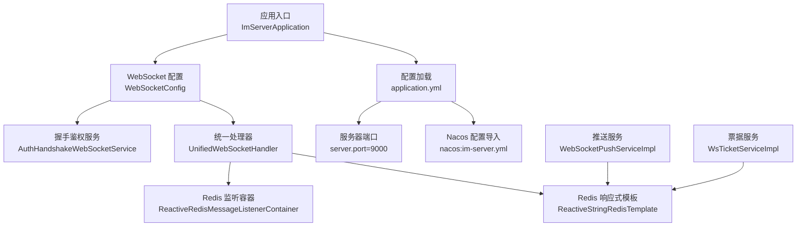
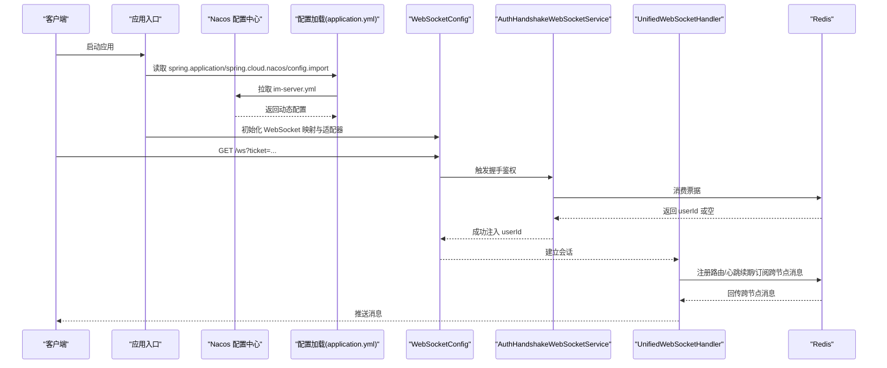
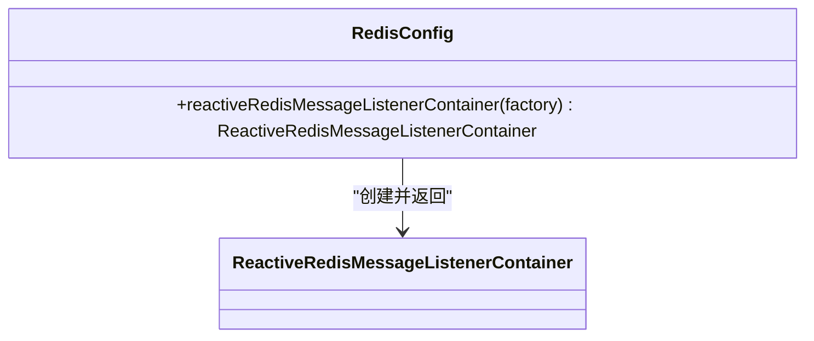
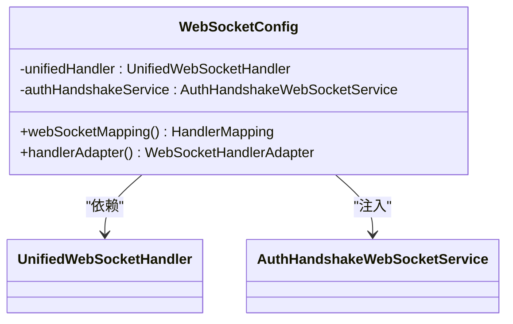
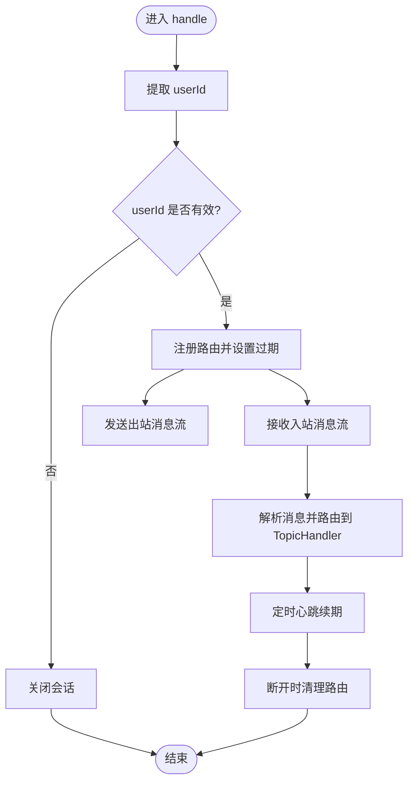
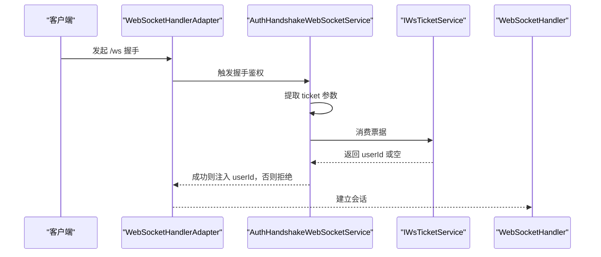
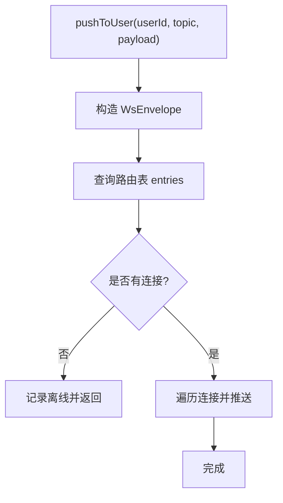
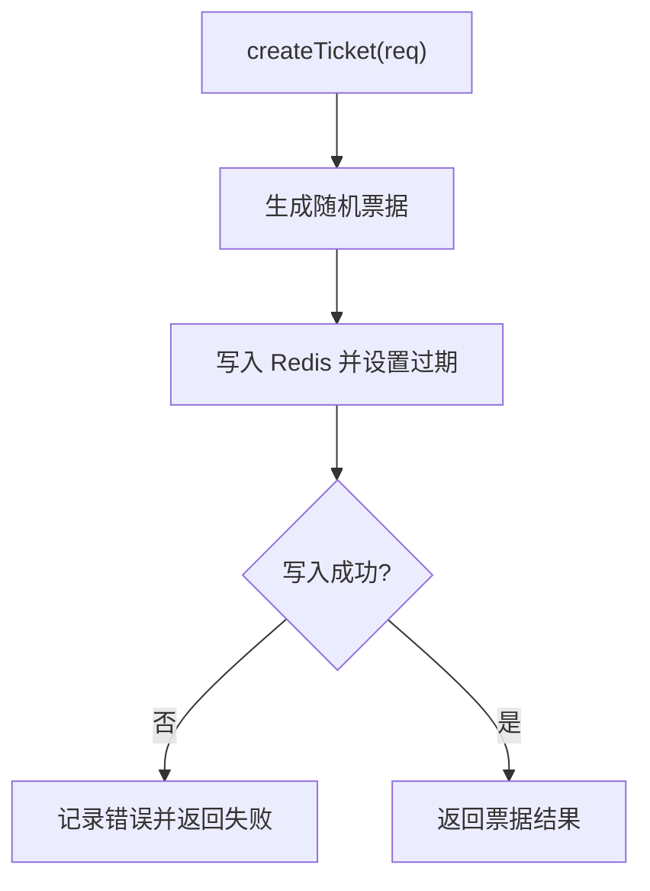
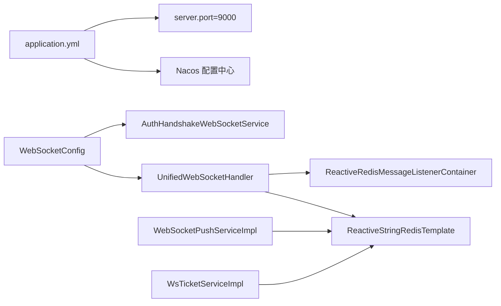

# 配置管理

<cite>
**本文引用的文件**
- [application.yml](file://src/main/resources/application.yml)
- [RedisConfig.java](file://src/main/java/com/rivers/im/config/RedisConfig.java)
- [WebSocketConfig.java](file://src/main/java/com/rivers/im/config/WebSocketConfig.java)
- [UnifiedWebSocketHandler.java](file://src/main/java/com/rivers/im/config/UnifiedWebSocketHandler.java)
- [AuthHandshakeWebSocketService.java](file://src/main/java/com/rivers/im/service/impl/AuthHandshakeWebSocketService.java)
- [WebSocketPushServiceImpl.java](file://src/main/java/com/rivers/im/service/impl/WebSocketPushServiceImpl.java)
- [WsTicketServiceImpl.java](file://src/main/java/com/rivers/im/service/impl/WsTicketServiceImpl.java)
- [ImServerApplication.java](file://src/main/java/com/rivers/im/ImServerApplication.java)
</cite>

## 目录
1. [简介](#简介)
2. [项目结构](#项目结构)
3. [核心组件](#核心组件)
4. [架构总览](#架构总览)
5. [详细组件分析](#详细组件分析)
6. [依赖分析](#依赖分析)
7. [性能考虑](#性能考虑)
8. [故障排查指南](#故障排查指南)
9. [结论](#结论)
10. [附录](#附录)

## 简介
本文件面向配置管理系统，围绕 application.yml 的结构与作用进行深入说明，并结合 RedisConfig、WebSocketConfig、UnifiedWebSocketHandler、AuthHandshakeWebSocketService、WebSocketPushServiceImpl、WsTicketServiceImpl 等关键组件，系统性阐述：
- 数据库连接、Redis 配置、WebSocket 设置与 Nacos 集成在当前代码中的体现与使用方式
- RedisConfig 的配置实现要点（连接工厂、序列化、连接池等）
- 环境差异化管理、动态配置更新机制与配置验证策略
- 最佳实践与故障排查建议

需要特别说明的是：当前仓库中未包含传统 Spring Boot 数据源配置（如数据库连接池）与显式的 Redis 序列化与连接池 Bean 定义；Redis 相关能力主要通过 Spring Data Redis 的响应式模板与监听容器体现。下文将基于现有代码进行准确解读。

## 项目结构
项目采用标准 Spring Boot 结构，配置集中在 resources 下的 application.yml，核心业务与配置位于 com.rivers.im 包内，按功能域划分为 config、service、controller、mapper、router、manage、record、entity、context 等子包。

图表来源
- [application.yml:1-14](file://src/main/resources/application.yml#L1-L14)
- [WebSocketConfig.java:13-35](file://src/main/java/com/rivers/im/config/WebSocketConfig.java#L13-L35)
- [UnifiedWebSocketHandler.java:38-181](file://src/main/java/com/rivers/im/config/UnifiedWebSocketHandler.java#L38-L181)
- [AuthHandshakeWebSocketService.java:22-55](file://src/main/java/com/rivers/im/service/impl/AuthHandshakeWebSocketService.java#L22-L55)
- [WebSocketPushServiceImpl.java:20-74](file://src/main/java/com/rivers/im/service/impl/WebSocketPushServiceImpl.java#L20-L74)
- [WsTicketServiceImpl.java:22-54](file://src/main/java/com/rivers/im/service/impl/WsTicketServiceImpl.java#L22-L54)

章节来源
- [application.yml:1-14](file://src/main/resources/application.yml#L1-L14)
- [ImServerApplication.java:1-13](file://src/main/java/com/rivers/im/ImServerApplication.java#L1-L13)

## 核心组件
- application.yml：集中声明应用名、Nacos 配置中心地址与文件扩展名、配置导入规则以及服务器端口。
- RedisConfig：提供响应式 Redis 监听容器 Bean，用于跨节点消息订阅。
- WebSocketConfig：定义 WebSocket 映射与握手适配器，注入自定义握手鉴权服务。
- UnifiedWebSocketHandler：统一的 WebSocket 入口，负责鉴权后建立会话、路由分发、心跳续期、跨节点消息订阅与清理。
- AuthHandshakeWebSocketService：基于票据（ticket）完成握手鉴权，成功后向会话注入用户标识。
- WebSocketPushServiceImpl：对外推送消息的服务实现，基于 Redis 路由表向目标连接推送。
- WsTicketServiceImpl：票据生成与消费，用于握手鉴权。

章节来源
- [application.yml:1-14](file://src/main/resources/application.yml#L1-L14)
- [RedisConfig.java:8-18](file://src/main/java/com/rivers/im/config/RedisConfig.java#L8-L18)
- [WebSocketConfig.java:13-35](file://src/main/java/com/rivers/im/config/WebSocketConfig.java#L13-L35)
- [UnifiedWebSocketHandler.java:38-181](file://src/main/java/com/rivers/im/config/UnifiedWebSocketHandler.java#L38-L181)
- [AuthHandshakeWebSocketService.java:22-55](file://src/main/java/com/rivers/im/service/impl/AuthHandshakeWebSocketService.java#L22-L55)
- [WebSocketPushServiceImpl.java:20-74](file://src/main/java/com/rivers/im/service/impl/WebSocketPushServiceImpl.java#L20-L74)
- [WsTicketServiceImpl.java:22-54](file://src/main/java/com/rivers/im/service/impl/WsTicketServiceImpl.java#L22-L54)

## 架构总览
下图展示配置驱动下的运行时交互：应用启动后从 Nacos 加载动态配置，WebSocket 接入层通过自定义握手服务完成鉴权，随后与 Redis 协作完成路由、心跳与跨节点消息投递。

图表来源
- [application.yml:4-10](file://src/main/resources/application.yml#L4-L10)
- [WebSocketConfig.java:22-34](file://src/main/java/com/rivers/im/config/WebSocketConfig.java#L22-L34)
- [AuthHandshakeWebSocketService.java:26-54](file://src/main/java/com/rivers/im/service/impl/AuthHandshakeWebSocketService.java#L26-L54)
- [UnifiedWebSocketHandler.java:87-122](file://src/main/java/com/rivers/im/config/UnifiedWebSocketHandler.java#L87-L122)

## 详细组件分析

### application.yml 配置项详解
- spring.application.name：应用名称，用于 Nacos 分组与命名空间识别。
- spring.cloud.nacos.config.server-addr：Nacos 配置中心地址与端口。
- spring.cloud.nacos.config.file-extension：配置文件扩展名为 yml。
- spring.config.import：从 Nacos 导入 im-server.yml 动态配置。
- server.port：HTTP/网关端口，默认 9000。

这些配置共同决定了应用如何接入 Nacos 并加载外部化配置，同时定义了服务暴露端口。

章节来源
- [application.yml:1-14](file://src/main/resources/application.yml#L1-L14)

### RedisConfig：响应式 Redis 监听容器
- 职责：提供 ReactiveRedisMessageListenerContainer Bean，用于订阅 Redis 主题，支撑跨节点消息广播。
- 关键点：
  - 使用 ReactiveRedisConnectionFactory 注入连接工厂。
  - 仅提供监听容器 Bean，未定义 RedisTemplate/序列化与连接池 Bean。
- 影响：若需使用响应式字符串模板或自定义序列化/连接池，应在同包或配置模块补充相应 Bean 定义。

图表来源
- [RedisConfig.java:13-17](file://src/main/java/com/rivers/im/config/RedisConfig.java#L13-L17)

章节来源
- [RedisConfig.java:8-18](file://src/main/java/com/rivers/im/config/RedisConfig.java#L8-L18)

### WebSocketConfig：映射与握手适配
- 职责：注册 /ws 路由映射，设置最高优先级；注入自定义握手鉴权服务。
- 关键点：
  - 使用 SimpleUrlHandlerMapping 将 /ws 绑定到统一处理器。
  - 使用 WebSocketHandlerAdapter 注入 AuthHandshakeWebSocketService。
- 影响：确保 WebSocket 请求优先被拦截并执行鉴权逻辑。

图表来源
- [WebSocketConfig.java:15-35](file://src/main/java/com/rivers/im/config/WebSocketConfig.java#L15-L35)

章节来源
- [WebSocketConfig.java:13-35](file://src/main/java/com/rivers/im/config/WebSocketConfig.java#L13-L35)

### UnifiedWebSocketHandler：统一接入与跨节点消息
- 职责：建立会话、提取用户标识、注册路由、心跳续期、消息分发、跨节点订阅与清理。
- 关键点：
  - 从会话属性或查询参数中提取 userId。
  - 使用 ReactiveStringRedisTemplate 注册路由并续期。
  - 订阅以当前节点 ID 命名的跨节点频道，接收其他节点推送的消息。
  - 通过 LocalSessionManager 将消息推送到本地连接。
- 性能与可靠性：
  - 心跳周期固定，续期失败会记录告警但不中断主流程。
  - 错误处理采用 onErrorResume/onErrorComplete，避免异常传播阻塞主链路。

图表来源
- [UnifiedWebSocketHandler.java:87-122](file://src/main/java/com/rivers/im/config/UnifiedWebSocketHandler.java#L87-L122)
- [UnifiedWebSocketHandler.java:124-138](file://src/main/java/com/rivers/im/config/UnifiedWebSocketHandler.java#L124-L138)
- [UnifiedWebSocketHandler.java:151-162](file://src/main/java/com/rivers/im/config/UnifiedWebSocketHandler.java#L151-L162)

章节来源
- [UnifiedWebSocketHandler.java:38-181](file://src/main/java/com/rivers/im/config/UnifiedWebSocketHandler.java#L38-L181)

### AuthHandshakeWebSocketService：基于票据的握手鉴权
- 职责：从请求参数中提取 ticket，调用票据服务消费并校验，成功后向会话注入 userId。
- 关键点：
  - 对票据消费设置超时与空值处理，避免阻塞。
  - 异常路径统一拒绝握手并记录日志。
- 影响：确保只有持有有效票据的请求才能进入 WebSocket 会话。

图表来源
- [AuthHandshakeWebSocketService.java:26-54](file://src/main/java/com/rivers/im/service/impl/AuthHandshakeWebSocketService.java#L26-L54)

章节来源
- [AuthHandshakeWebSocketService.java:22-55](file://src/main/java/com/rivers/im/service/impl/AuthHandshakeWebSocketService.java#L22-L55)

### WebSocketPushServiceImpl：推送服务
- 职责：将消息封装为统一信封并通过 Redis 路由表投递给目标连接。
- 关键点：
  - 通过路由键查询目标连接集合，对每个连接异步推送。
  - 当无在线连接时记录离线日志。
- 影响：与 UnifiedWebSocketHandler 的路由注册形成闭环，实现跨节点消息转发。

图表来源
- [WebSocketPushServiceImpl.java:45-74](file://src/main/java/com/rivers/im/service/impl/WebSocketPushServiceImpl.java#L45-L74)

章节来源
- [WebSocketPushServiceImpl.java:20-74](file://src/main/java/com/rivers/im/service/impl/WebSocketPushServiceImpl.java#L20-L74)

### WsTicketServiceImpl：票据服务
- 职责：生成唯一票据并写入 Redis，设置短期过期；消费票据并删除。
- 关键点：
  - 使用前缀区分票据键空间。
  - 写入成功后返回票据，失败记录错误并返回通用提示。
- 影响：为握手鉴权提供安全、短暂有效的凭证。

图表来源
- [WsTicketServiceImpl.java:27-48](file://src/main/java/com/rivers/im/service/impl/WsTicketServiceImpl.java#L27-L48)

章节来源
- [WsTicketServiceImpl.java:22-54](file://src/main/java/com/rivers/im/service/impl/WsTicketServiceImpl.java#L22-L54)

## 依赖分析
- 配置层：application.yml 作为入口，驱动 Nacos 动态配置导入与端口暴露。
- Web 层：WebSocketConfig 依赖 UnifiedWebSocketHandler 与 AuthHandshakeWebSocketService，形成请求拦截与鉴权链路。
- 数据访问层：UnifiedWebSocketHandler、WebSocketPushServiceImpl、WsTicketServiceImpl 依赖 ReactiveStringRedisTemplate 与监听容器，实现路由、心跳与跨节点消息投递。
- 组件耦合：各组件通过 Spring 依赖注入解耦，WebSocketConfig 与 RedisConfig 之间无直接耦合，通过共享的连接工厂与模板间接协作。

图表来源
- [application.yml:1-14](file://src/main/resources/application.yml#L1-L14)
- [WebSocketConfig.java:15-35](file://src/main/java/com/rivers/im/config/WebSocketConfig.java#L15-L35)
- [UnifiedWebSocketHandler.java:42-44](file://src/main/java/com/rivers/im/config/UnifiedWebSocketHandler.java#L42-L44)
- [WebSocketPushServiceImpl.java:23-36](file://src/main/java/com/rivers/im/service/impl/WebSocketPushServiceImpl.java#L23-L36)
- [WsTicketServiceImpl.java:22-32](file://src/main/java/com/rivers/im/service/impl/WsTicketServiceImpl.java#L22-L32)

章节来源
- [application.yml:1-14](file://src/main/resources/application.yml#L1-L14)
- [WebSocketConfig.java:13-35](file://src/main/java/com/rivers/im/config/WebSocketConfig.java#L13-L35)
- [UnifiedWebSocketHandler.java:38-181](file://src/main/java/com/rivers/im/config/UnifiedWebSocketHandler.java#L38-L181)
- [WebSocketPushServiceImpl.java:20-74](file://src/main/java/com/rivers/im/service/impl/WebSocketPushServiceImpl.java#L20-L74)
- [WsTicketServiceImpl.java:22-54](file://src/main/java/com/rivers/im/service/impl/WsTicketServiceImpl.java#L22-L54)

## 性能考虑
- 心跳与续期：统一处理器定时续期路由键，避免因过期导致消息丢失；续期失败仅记录告警，不影响主链路。
- 异步推送：推送服务对多连接采用并发推送，提升吞吐。
- 监听容器：响应式监听容器按消息事件触发回调，降低阻塞风险。
- 票据时效：票据设置短期过期，减少无效资源占用。
- 建议优化：
  - 在 RedisConfig 中补充序列化与连接池 Bean，明确键空间与序列化策略。
  - 对热点路由键增加限流或分区策略，防止单键压力过大。
  - 对跨节点消息通道引入背压与重试策略，增强稳定性。

## 故障排查指南
- 握手失败
  - 现象：客户端无法建立 WebSocket 连接。
  - 排查：确认 ticket 参数是否缺失或过期；检查票据服务消费是否超时或异常；查看鉴权服务拒绝原因。
  - 参考
    - [AuthHandshakeWebSocketService.java:28-43](file://src/main/java/com/rivers/im/service/impl/AuthHandshakeWebSocketService.java#L28-L43)
- 路由注册失败
  - 现象：消息无法投递到目标用户。
  - 排查：检查 Redis 连通性与路由键写入；确认心跳续期是否正常；查看清理阶段是否提前移除。
  - 参考
    - [UnifiedWebSocketHandler.java:98-102](file://src/main/java/com/rivers/im/config/UnifiedWebSocketHandler.java#L98-L102)
    - [UnifiedWebSocketHandler.java:111-118](file://src/main/java/com/rivers/im/config/UnifiedWebSocketHandler.java#L111-L118)
    - [UnifiedWebSocketHandler.java:154-160](file://src/main/java/com/rivers/im/config/UnifiedWebSocketHandler.java#L154-L160)
- 跨节点消息不可达
  - 现象：同一用户在不同节点登录，消息无法跨节点到达。
  - 排查：确认当前节点 ID 与频道命名一致；检查监听容器是否正确订阅；查看跨节点消息处理异常日志。
  - 参考
    - [UnifiedWebSocketHandler.java:69-76](file://src/main/java/com/rivers/im/config/UnifiedWebSocketHandler.java#L69-L76)
    - [UnifiedWebSocketHandler.java:140-149](file://src/main/java/com/rivers/im/config/UnifiedWebSocketHandler.java#L140-L149)
- Nacos 配置未生效
  - 现象：期望的动态配置未加载。
  - 排查：确认 server-addr、file-extension 与配置导入路径；检查 Nacos 上对应配置是否存在且格式正确。
  - 参考
    - [application.yml:4-10](file://src/main/resources/application.yml#L4-L10)

章节来源
- [AuthHandshakeWebSocketService.java:22-55](file://src/main/java/com/rivers/im/service/impl/AuthHandshakeWebSocketService.java#L22-L55)
- [UnifiedWebSocketHandler.java:67-85](file://src/main/java/com/rivers/im/config/UnifiedWebSocketHandler.java#L67-L85)
- [application.yml:4-10](file://src/main/resources/application.yml#L4-L10)

## 结论
本配置体系以 application.yml 为核心入口，结合 Nacos 实现动态配置加载；WebSocket 子系统通过自定义握手鉴权与 Redis 路由实现高可用的实时通信能力。RedisConfig 提供响应式监听容器，配合推送与票据服务形成闭环。建议在 RedisConfig 中补齐序列化与连接池配置，进一步完善生产级配置管理与可观测性。

## 附录
- 环境差异化管理
  - 通过 spring.profiles.active 切换不同环境配置文件，结合 Nacos 的命名空间与分组实现多环境隔离。
- 动态配置更新机制
  - Nacos 配置变更将通过 spring.config.import 的导入机制生效，建议在处理器中增加配置变更感知与平滑切换策略。
- 配置验证策略
  - 在启动阶段对关键配置（如 Nacos 地址、端口、Redis 连接信息）进行校验；对 Redis 路由键命名规范与 TTL 设置进行一致性检查。