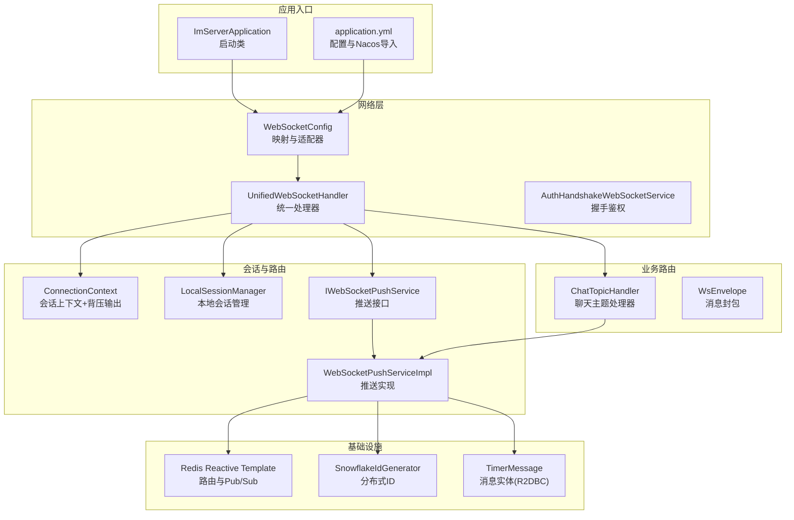
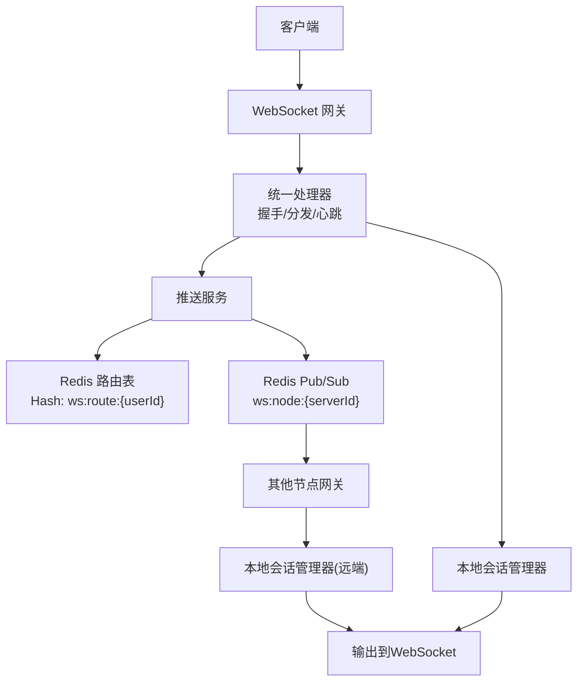
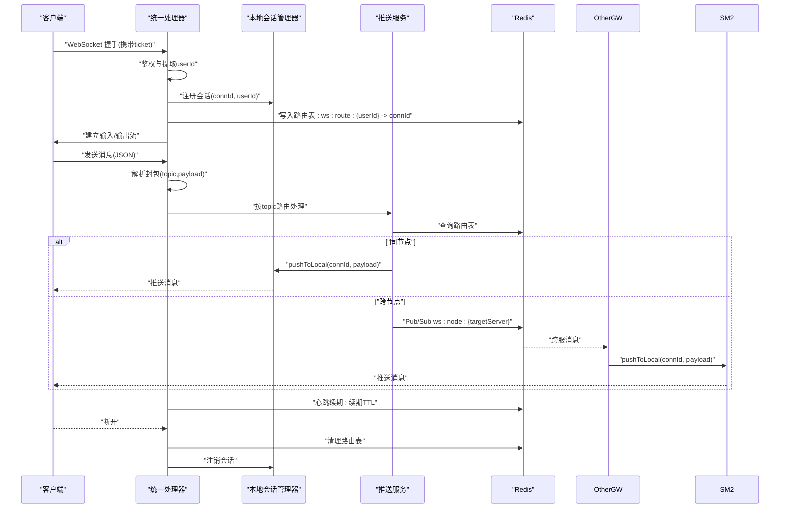
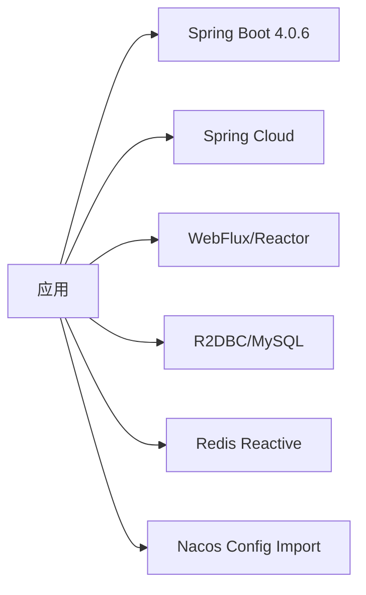

# 项目概述

<cite>
**本文引用的文件**
- [ImServerApplication.java](file://src/main/java/com/rivers/im/ImServerApplication.java)
- [application.yml](file://src/main/resources/application.yml)
- [build.gradle](file://build.gradle)
- [settings.gradle](file://settings.gradle)
- [ConnectionContext.java](file://src/main/java/com/rivers/im/context/ConnectionContext.java)
- [WebSocketConfig.java](file://src/main/java/com/rivers/im/config/WebSocketConfig.java)
- [UnifiedWebSocketHandler.java](file://src/main/java/com/rivers/im/config/UnifiedWebSocketHandler.java)
- [LocalSessionManager.java](file://src/main/java/com/rivers/im/manage/LocalSessionManager.java)
- [IWebSocketPushService.java](file://src/main/java/com/rivers/im/service/IWebSocketPushService.java)
- [WebSocketPushServiceImpl.java](file://src/main/java/com/rivers/im/service/impl/WebSocketPushServiceImpl.java)
- [AuthHandshakeWebSocketService.java](file://src/main/java/com/rivers/im/service/impl/AuthHandshakeWebSocketService.java)
- [ChatTopicHandler.java](file://src/main/java/com/rivers/im/router/ChatTopicHandler.java)
- [WsEnvelope.java](file://src/main/java/com/rivers/im/record/WsEnvelope.java)
- [SnowflakeIdGenerator.java](file://src/main/java/com/rivers/im/util/SnowflakeIdGenerator.java)
- [TimerMessage.java](file://src/main/java/com/rivers/im/entity/TimerMessage.java)
</cite>

## 目录
1. [引言](#引言)
2. [项目结构](#项目结构)
3. [核心组件](#核心组件)
4. [架构总览](#架构总览)
5. [详细组件分析](#详细组件分析)
6. [依赖分析](#依赖分析)
7. [性能考量](#性能考量)
8. [故障排查指南](#故障排查指南)
9. [结论](#结论)
10. [附录](#附录)

## 引言
本项目是一个基于 Spring Boot 4.0.6 与 Spring Cloud 的高性能 IM 即时通讯服务器，采用响应式 WebFlux 架构与 Reactor 响应式编程模型，结合 Redis 实现跨节点消息路由与分布式会话管理。系统通过 WebSocket 提供低延迟的双向通信，支持用户在线路由、心跳保活、跨服消息转发与多路推送，满足高并发实时消息场景。

## 项目结构
项目采用模块化分层组织，核心目录与职责如下：
- config：WebSocket 配置、统一处理器与握手鉴权服务
- context：连接上下文与背压输出通道
- manage：本地会话管理器
- router：主题路由处理器（如聊天）
- service：推送服务接口与实现、握手鉴权服务
- record：消息封包数据模型
- util：分布式 ID 生成器
- entity：数据库实体（R2DBC 映射）
- resources：应用配置与 Nacos 动态配置导入

图表来源
- [ImServerApplication.java:1-14](file://src/main/java/com/rivers/im/ImServerApplication.java#L1-L14)
- [application.yml:1-14](file://src/main/resources/application.yml#L1-L14)
- [WebSocketConfig.java:1-35](file://src/main/java/com/rivers/im/config/WebSocketConfig.java#L1-L35)
- [UnifiedWebSocketHandler.java:1-181](file://src/main/java/com/rivers/im/config/UnifiedWebSocketHandler.java#L1-L181)
- [ConnectionContext.java:1-24](file://src/main/java/com/rivers/im/context/ConnectionContext.java#L1-L24)
- [LocalSessionManager.java:1-43](file://src/main/java/com/rivers/im/manage/LocalSessionManager.java#L1-L43)
- [IWebSocketPushService.java:1-12](file://src/main/java/com/rivers/im/service/IWebSocketPushService.java#L1-L12)
- [WebSocketPushServiceImpl.java:1-90](file://src/main/java/com/rivers/im/service/impl/WebSocketPushServiceImpl.java#L1-L90)
- [AuthHandshakeWebSocketService.java:1-73](file://src/main/java/com/rivers/im/service/impl/AuthHandshakeWebSocketService.java#L1-L73)
- [ChatTopicHandler.java:1-51](file://src/main/java/com/rivers/im/router/ChatTopicHandler.java#L1-L51)
- [WsEnvelope.java:1-10](file://src/main/java/com/rivers/im/record/WsEnvelope.java#L1-L10)
- [SnowflakeIdGenerator.java:1-69](file://src/main/java/com/rivers/im/util/SnowflakeIdGenerator.java#L1-L69)
- [TimerMessage.java:1-105](file://src/main/java/com/rivers/im/entity/TimerMessage.java#L1-L105)

章节来源
- [ImServerApplication.java:1-14](file://src/main/java/com/rivers/im/ImServerApplication.java#L1-L14)
- [application.yml:1-14](file://src/main/resources/application.yml#L1-L14)
- [build.gradle:1-64](file://build.gradle#L1-L64)
- [settings.gradle:1-2](file://settings.gradle#L1-L2)

## 核心组件
- 启动与配置
  - 应用启动类负责引导 Spring Boot 容器
  - 配置文件启用 Nacos 动态配置导入与网关端口设置
- 响应式 WebSocket 层
  - 统一处理器负责握手后会话生命周期管理、消息分发与心跳保活
  - 握手鉴权服务基于票据校验，注入用户标识到会话属性
- 会话与推送
  - 连接上下文封装 WebSocketSession 与背压输出通道
  - 本地会话管理器维护连接映射并支持线程安全推送
  - 推送服务实现基于 Redis 路由表进行本地或跨服推送
- 主题路由
  - 聊天主题处理器对接业务逻辑，封装消息并调用推送服务
- 数据模型与工具
  - 消息封包记录用于序列化传输
  - 分布式 ID 生成器提供全局唯一消息 ID
  - R2DBC 实体映射消息表字段

章节来源
- [ImServerApplication.java:1-14](file://src/main/java/com/rivers/im/ImServerApplication.java#L1-L14)
- [application.yml:1-14](file://src/main/resources/application.yml#L1-L14)
- [ConnectionContext.java:1-24](file://src/main/java/com/rivers/im/context/ConnectionContext.java#L1-L24)
- [LocalSessionManager.java:1-43](file://src/main/java/com/rivers/im/manage/LocalSessionManager.java#L1-L43)
- [IWebSocketPushService.java:1-12](file://src/main/java/com/rivers/im/service/IWebSocketPushService.java#L1-L12)
- [WebSocketPushServiceImpl.java:1-90](file://src/main/java/com/rivers/im/service/impl/WebSocketPushServiceImpl.java#L1-L90)
- [AuthHandshakeWebSocketService.java:1-73](file://src/main/java/com/rivers/im/service/impl/AuthHandshakeWebSocketService.java#L1-L73)
- [ChatTopicHandler.java:1-51](file://src/main/java/com/rivers/im/router/ChatTopicHandler.java#L1-L51)
- [WsEnvelope.java:1-10](file://src/main/java/com/rivers/im/record/WsEnvelope.java#L1-L10)
- [SnowflakeIdGenerator.java:1-69](file://src/main/java/com/rivers/im/util/SnowflakeIdGenerator.java#L1-L69)
- [TimerMessage.java:1-105](file://src/main/java/com/rivers/im/entity/TimerMessage.java#L1-L105)

## 架构总览
系统采用“响应式 + 分布式”双轴设计：
- 响应式：WebFlux + Reactor，非阻塞 I/O 与背压控制，提升吞吐与资源利用率
- 分布式：Redis Hash 存储路由表，Pub/Sub 实现跨节点消息广播；会话按用户维度散列到不同实例

图表来源
- [WebSocketConfig.java:1-35](file://src/main/java/com/rivers/im/config/WebSocketConfig.java#L1-L35)
- [UnifiedWebSocketHandler.java:1-181](file://src/main/java/com/rivers/im/config/UnifiedWebSocketHandler.java#L1-L181)
- [LocalSessionManager.java:1-43](file://src/main/java/com/rivers/im/manage/LocalSessionManager.java#L1-L43)
- [WebSocketPushServiceImpl.java:1-90](file://src/main/java/com/rivers/im/service/impl/WebSocketPushServiceImpl.java#L1-L90)

## 详细组件分析

### 统一 WebSocket 处理器
- 职责
  - 握手后建立会话，提取用户标识，注册到本地会话管理器
  - 将输出通道与输入流组合，实现背压驱动的消息发送
  - 基于 Redis 路由表进行本地/跨服推送
  - 心跳保活：周期性续期路由键 TTL
  - 生命周期清理：断开时移除路由与会话
- 关键流程

图表来源
- [UnifiedWebSocketHandler.java:87-122](file://src/main/java/com/rivers/im/config/UnifiedWebSocketHandler.java#L87-L122)
- [WebSocketPushServiceImpl.java:56-88](file://src/main/java/com/rivers/im/service/impl/WebSocketPushServiceImpl.java#L56-L88)
- [LocalSessionManager.java:35-42](file://src/main/java/com/rivers/im/manage/LocalSessionManager.java#L35-L42)

章节来源
- [UnifiedWebSocketHandler.java:1-181](file://src/main/java/com/rivers/im/config/UnifiedWebSocketHandler.java#L1-L181)

### 握手鉴权服务
- 要点
  - 从请求参数中提取票据，调用票据服务验证
  - 使用超时与空值处理，优雅拒绝非法握手
  - 成功后将 userId 写入会话属性，供后续处理器使用
- 错误处理
  - 已提交响应时的拒绝策略避免异常传播
  - 对鉴权异常进行日志记录与状态返回

章节来源
- [AuthHandshakeWebSocketService.java:1-73](file://src/main/java/com/rivers/im/service/impl/AuthHandshakeWebSocketService.java#L1-L73)

### 本地会话管理器
- 职责
  - 维护 connId 到 ConnectionContext 的映射
  - 提供线程安全的注册、注销与推送方法
- 背压输出
  - 输出通道采用多播+缓冲+背压策略，确保高并发下稳定推送

章节来源
- [LocalSessionManager.java:1-43](file://src/main/java/com/rivers/im/manage/LocalSessionManager.java#L1-L43)
- [ConnectionContext.java:1-24](file://src/main/java/com/rivers/im/context/ConnectionContext.java#L1-L24)

### 推送服务实现
- 路由查找
  - 通过 Redis Hash 查询用户对应的连接集合
- 本地推送
  - 若目标服务器等于当前实例，则直接推送
- 跨服推送
  - 将目标连接 ID 与消息体打包，发布到目标节点的 Pub/Sub 频道
- 错误恢复
  - 对推送失败进行告警并忽略，保证主链路不中断

章节来源
- [WebSocketPushServiceImpl.java:1-90](file://src/main/java/com/rivers/im/service/impl/WebSocketPushServiceImpl.java#L1-L90)

### 聊天主题处理器
- 职责
  - 解析聊天消息负载，校验接收方
  - 组装包含发送方、接收方、内容与时间戳的消息对象
  - 并行向发送方与接收方推送相同内容
- 扩展性
  - 通过 TopicHandler 接口可扩展更多业务主题

章节来源
- [ChatTopicHandler.java:1-51](file://src/main/java/com/rivers/im/router/ChatTopicHandler.java#L1-L51)
- [IWebSocketPushService.java:1-12](file://src/main/java/com/rivers/im/service/IWebSocketPushService.java#L1-L12)

### 消息封包与分布式 ID
- 封包结构
  - 包含 topic、msgId、payload，便于路由与幂等处理
- 分布式 ID
  - 基于 Snowflake 算法生成全局唯一消息 ID，支持自定义工作节点与数据中心

章节来源
- [WsEnvelope.java:1-10](file://src/main/java/com/rivers/im/record/WsEnvelope.java#L1-L10)
- [SnowflakeIdGenerator.java:1-69](file://src/main/java/com/rivers/im/util/SnowflakeIdGenerator.java#L1-L69)

### 数据模型（R2DBC）
- TimerMessage 表示定时/普通消息实体，包含发送方、接收方、群组、消息类型、内容、文件 URL、阅读状态与时间戳等字段
- 通过注解映射到关系型数据库，配合 R2DBC 实现响应式持久化

章节来源
- [TimerMessage.java:1-105](file://src/main/java/com/rivers/im/entity/TimerMessage.java#L1-L105)

## 依赖分析
- 技术栈
  - Spring Boot 4.0.6 + Spring Cloud（版本由依赖管理统一约束）
  - WebFlux + Reactor（响应式 Web 与背压）
  - R2DBC + MySQL（响应式数据库访问）
  - Redis Reactive（响应式缓存与 Pub/Sub）
  - Nacos（动态配置）
- 依赖关系概览

图表来源
- [build.gradle:31-45](file://build.gradle#L31-L45)
- [application.yml:4-10](file://src/main/resources/application.yml#L4-L10)

章节来源
- [build.gradle:1-64](file://build.gradle#L1-L64)
- [application.yml:1-14](file://src/main/resources/application.yml#L1-L14)

## 性能考量
- 响应式与背压
  - 使用 Sinks 多播+缓冲+背压，避免内存暴涨与丢包
  - 输入流采用 concatMap 控制并发，保证有序处理
- Redis 路由与心跳
  - 路由键 TTL 保障离线清理，心跳续期维持活跃连接
  - 跨服 Pub/Sub 降低中心化耦合，提升横向扩展能力
- 并行推送
  - 多连接推送使用并行组合，提高吞吐
- I/O 与线程
  - 非阻塞 I/O 与事件循环减少线程占用，适合高并发长连接

## 故障排查指南
- 握手失败
  - 检查票据参数是否缺失或过期，确认鉴权服务可用
- 连接无法建立
  - 核对 WebSocket 映射路径与适配器配置
- 消息未送达
  - 检查路由表是否存在对应连接，确认心跳是否正常续期
  - 观察跨服 Pub/Sub 是否可达
- 日志定位
  - 统一处理器与推送服务均提供详细的错误与告警日志，便于快速定位

章节来源
- [AuthHandshakeWebSocketService.java:26-55](file://src/main/java/com/rivers/im/service/impl/AuthHandshakeWebSocketService.java#L26-L55)
- [UnifiedWebSocketHandler.java:67-85](file://src/main/java/com/rivers/im/config/UnifiedWebSocketHandler.java#L67-L85)
- [WebSocketPushServiceImpl.java:76-88](file://src/main/java/com/rivers/im/service/impl/WebSocketPushServiceImpl.java#L76-L88)

## 结论
本项目以响应式为核心，结合 Redis 实现高可靠、可扩展的分布式即时通讯服务。通过统一的 WebSocket 处理器、会话管理与推送路由，系统在高并发场景下具备良好的吞吐与稳定性。借助 Spring Boot 4 与 Spring Cloud 的现代化生态，项目具备清晰的架构边界与良好的可运维性。

## 附录
- 快速启动
  - 确保 Nacos 与 Redis 可用，启动应用后访问 WebSocket 端点进行测试
- 扩展建议
  - 新增主题处理器需实现 TopicHandler 接口并注册为 Bean
  - 跨服消息可通过 Pub/Sub 自定义频道扩展